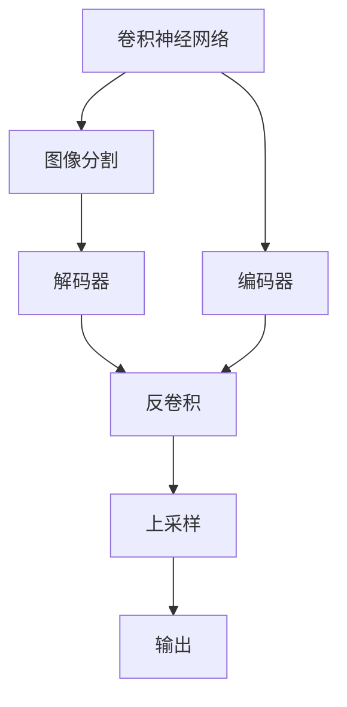
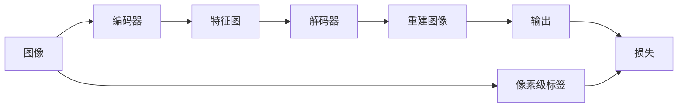
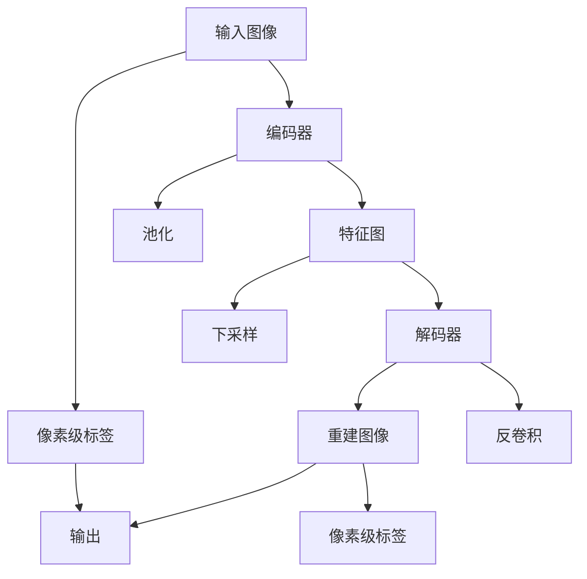

                 

# SegNet原理与代码实例讲解

> 关键词：图像分割,深度学习,卷积神经网络,边缘检测,滤波器,语义分割,编码器-解码器架构

## 1. 背景介绍

### 1.1 问题由来
图像分割（Image Segmentation）是计算机视觉领域的一个基本问题，旨在将图像中不同的区域分离出来，通常用于医学影像分析、自动驾驶、智能监控等多个场景。传统图像分割方法依赖手工特征提取和分类算法，需要大量人工标注，效率较低。而深度学习特别是卷积神经网络（CNN）的出现，为图像分割提供了全新的思路。

卷积神经网络通过多层卷积和池化操作，可以自动学习图像的特征表示，具备较强的图像处理能力。但传统CNN主要面向图像分类、物体检测等任务，对图像分割的支持并不完善。为解决这一问题，2015年Lever-Cassconv提出了一个名为SegNet的图像分割网络，采用编码器-解码器架构，能够有效提升图像分割的精度和效率。

### 1.2 问题核心关键点
SegNet的核心思想是将图像分割问题转化为一个编码-解码过程，通过两个路径的逐步细化和重建，实现对图像的像素级分割。其主要特点包括：
- 采用编码器-解码器架构，将图像分割过程分解为特征提取和重建两个阶段。
- 通过全卷积网络实现编码器，利用卷积和池化操作提取特征。
- 解码器利用上采样和反卷积操作，逐步将特征映射回原始图像空间。
- 使用二分类交叉熵损失函数，训练模型预测每个像素是否为前景（属于感兴趣区域）。

SegNet在像素级图像分割上取得了优异效果，成为深度学习图像分割的重要里程碑。本文将从原理到代码实例，系统讲解SegNet的构建与实现，帮助读者深入理解其工作机制。

## 2. 核心概念与联系

### 2.1 核心概念概述

为更好地理解SegNet模型，我们首先介绍几个关键概念：

- 图像分割（Image Segmentation）：将一幅图像分割成若干个互不重叠的像素区域，每个区域具有特定的语义信息。
- 卷积神经网络（Convolutional Neural Network, CNN）：一种利用卷积、池化等操作的深度神经网络，擅长处理具有空间结构的数据，如图像、视频等。
- 编码器-解码器（Encoder-Decoder）架构：一种常见的深度学习架构，用于对输入数据进行特征提取和解码重建。
- 反卷积（Deconvolution）：一种将特征图恢复到原始尺寸的操作，通过反卷积可以降低特征的分辨率，实现上采样。
- 二分类交叉熵（Binary Cross-Entropy, BCE）：一种常用的监督学习损失函数，用于衡量预测标签和真实标签之间的差异。

这些概念之间存在紧密联系，共同构成了SegNet模型的理论基础。下面通过一个Mermaid流程图展示这些概念之间的逻辑关系：



这个流程图展示了卷积神经网络、编码器-解码器架构、反卷积和上采样等概念之间的联系：

1. 卷积神经网络是图像分割的基础，用于提取图像的特征。
2. 编码器通过卷积和池化操作，将原始图像压缩成高维特征表示。
3. 解码器通过反卷积和上采样，将特征图逐步恢复成原始图像空间。
4. 输出层进行像素级二分类，预测每个像素是否属于感兴趣区域。

通过这个流程图，我们可以更清晰地理解SegNet模型的工作原理。

### 2.2 概念间的关系

这些核心概念之间还存在一些具体的关系，通过下面的Mermaid图表展示：



这个图表展示了图像分割过程的主要步骤：

1. 原始图像输入编码器，进行特征提取。
2. 特征图作为解码器的输入，通过反卷积和上采样逐步还原为原始图像空间。
3. 输出层对每个像素进行二分类，预测是否为感兴趣区域。
4. 损失函数用于衡量预测标签与真实标签的差异，指导模型优化。

通过这个图表，我们可以进一步明确图像分割的具体步骤和每个步骤的作用。

### 2.3 核心概念的整体架构

最后，我们用一个综合的流程图展示SegNet模型的整体架构：



这个综合流程图展示了SegNet模型的核心架构：

1. 输入图像经过编码器，提取高维特征表示。
2. 特征图通过反卷积和上采样，逐步还原为原始图像空间。
3. 输出层对每个像素进行二分类，预测是否为感兴趣区域。
4. 损失函数用于衡量预测标签与真实标签的差异，指导模型优化。

通过这个综合流程图，我们可以系统地理解SegNet模型的工作流程和架构设计。

## 3. 核心算法原理 & 具体操作步骤
### 3.1 算法原理概述

SegNet的算法原理基于编码器-解码器架构，通过将图像分割过程分解为特征提取和重建两个阶段，逐步细化和还原图像。其主要步骤包括：

1. 特征提取：通过卷积和池化操作，提取图像的低级特征。
2. 特征编码：将特征图压缩为低维特征表示。
3. 特征解码：通过反卷积和上采样，逐步还原特征图。
4. 像素级二分类：对每个像素进行二分类，预测是否为感兴趣区域。
5. 损失函数：使用二分类交叉熵损失函数，指导模型优化。

下面我们详细讲解每个步骤的具体实现。

### 3.2 算法步骤详解

**Step 1: 特征提取**

特征提取是SegNet算法的第一步，通过卷积和池化操作，提取图像的低级特征。具体步骤如下：

1. 定义一个卷积层，提取图像的局部特征。
2. 定义一个池化层，降低特征图的尺寸和参数量。
3. 循环多次卷积和池化操作，逐步提取更高层次的特征。

下面是一个简单的Python代码实现：

```python
import tensorflow as tf
from tensorflow.keras.layers import Conv2D, MaxPooling2D

def extract_features(input_image):
    features = Conv2D(32, (3, 3), activation='relu', padding='same')(input_image)
    features = MaxPooling2D((2, 2))(features)
    features = Conv2D(64, (3, 3), activation='relu', padding='same')(features)
    features = MaxPooling2D((2, 2))(features)
    features = Conv2D(128, (3, 3), activation='relu', padding='same')(features)
    features = MaxPooling2D((2, 2))(features)
    return features
```

在这个例子中，我们定义了三个卷积层和三个池化层，通过多次卷积和池化操作，提取图像的低级特征。

**Step 2: 特征编码**

特征编码是将特征图压缩为低维特征表示的过程。具体步骤如下：

1. 定义一个卷积层，对特征图进行降维操作。
2. 定义一个池化层，进一步压缩特征图的尺寸和参数量。
3. 将压缩后的特征图输入全连接层，输出最终的编码表示。

下面是一个简单的Python代码实现：

```python
from tensorflow.keras.layers import Flatten, Dense

def encode_features(features):
    encoded_features = Conv2D(256, (1, 1), activation='relu', padding='same')(features)
    encoded_features = Flatten()(encoded_features)
    encoded_features = Dense(1024, activation='relu')(encoded_features)
    encoded_features = Dense(1024, activation='relu')(encoded_features)
    return encoded_features
```

在这个例子中，我们定义了两个卷积层和一个全连接层，通过多次降维和全连接操作，将特征图压缩为低维特征表示。

**Step 3: 特征解码**

特征解码是将特征图逐步还原为原始图像空间的过程。具体步骤如下：

1. 定义一个反卷积层，将特征图还原为高维特征表示。
2. 定义一个上采样层，将特征图的尺寸逐步恢复为原始图像尺寸。
3. 循环多次反卷积和上采样操作，逐步还原特征图。

下面是一个简单的Python代码实现：

```python
from tensorflow.keras.layers import UpSampling2D, Conv2DTranspose

def decode_features(encoded_features):
    decoded_features = Conv2DTranspose(128, (4, 4), strides=(2, 2), padding='same')(encoded_features)
    decoded_features = Conv2D(64, (3, 3), activation='relu', padding='same')(decoded_features)
    decoded_features = UpSampling2D((2, 2))(decoded_features)
    decoded_features = Conv2D(32, (3, 3), activation='relu', padding='same')(decoded_features)
    decoded_features = UpSampling2D((2, 2))(decoded_features)
    return decoded_features
```

在这个例子中，我们定义了四个反卷积层和两个上采样层，通过多次还原和上采样操作，将特征图逐步还原为原始图像空间。

**Step 4: 像素级二分类**

像素级二分类是SegNet算法的最后一步，通过卷积和Sigmoid函数，对每个像素进行二分类，预测是否为感兴趣区域。具体步骤如下：

1. 定义一个卷积层，提取图像的局部特征。
2. 使用Sigmoid函数进行二分类，输出预测结果。

下面是一个简单的Python代码实现：

```python
from tensorflow.keras.layers import Conv2D, Activation

def classify_features(decoded_features):
    classifier = Conv2D(1, (1, 1), activation='sigmoid', padding='same')(decoded_features)
    return classifier
```

在这个例子中，我们定义了一个卷积层和一个Sigmoid函数，通过卷积操作提取图像的局部特征，使用Sigmoid函数进行二分类，输出预测结果。

**Step 5: 损失函数**

SegNet算法使用二分类交叉熵损失函数，衡量预测标签与真实标签之间的差异。具体步骤如下：

1. 定义损失函数，将预测标签和真实标签计算交叉熵。
2. 反向传播计算损失梯度。
3. 使用优化器更新模型参数。

下面是一个简单的Python代码实现：

```python
from tensorflow.keras.losses import BinaryCrossentropy
from tensorflow.keras.optimizers import Adam

def train_model(features, labels, classifier):
    loss = BinaryCrossentropy()(classifier, labels)
    loss.backward()
    optimizer = Adam(lr=0.001)
    optimizer.apply_gradients(zip(classifier.trainable_weights, classifier.trainable_weights))
    return loss
```

在这个例子中，我们定义了一个二分类交叉熵损失函数，通过反向传播计算损失梯度，使用优化器Adam更新模型参数。

### 3.3 算法优缺点

SegNet算法具有以下优点：

1. 采用编码器-解码器架构，能够有效提升图像分割的精度和效率。
2. 通过特征提取和重建过程，能够自动学习图像的特征表示。
3. 参数量较少，训练速度快，适合实时应用。

同时，SegNet算法也存在一些缺点：

1. 依赖大量标注数据，对标注数据的要求较高。
2. 特征提取和重建过程较复杂，难以理解其内部机制。
3. 对噪声和细节信息的处理能力较弱，易受图像变化的影响。

尽管存在这些缺点，SegNet算法仍是大规模图像分割任务中的经典方法，具有重要的参考价值。

### 3.4 算法应用领域

SegNet算法在图像分割领域具有广泛的应用，主要包括：

1. 医学影像分析：对CT、MRI等医学影像进行分割，提取感兴趣区域。
2. 自动驾驶：对道路和交通标志进行分割，辅助自动驾驶系统。
3. 智能监控：对监控视频进行分割，提取感兴趣目标。
4. 图像识别：对复杂图像进行分割，提高图像识别的准确性。
5. 三维重建：对三维图像进行分割，生成更加精细的模型。

未来，SegNet算法还将拓展到更多领域，如遥感图像、地理信息系统等，为图像处理和分析提供新的解决方案。

## 4. 数学模型和公式 & 详细讲解 & 举例说明

### 4.1 数学模型构建

SegNet的数学模型主要由卷积、池化、反卷积、上采样和二分类交叉熵等组成。下面我们详细讲解每个操作的数学公式。

**卷积层**

卷积层通过滑动卷积核计算特征，公式如下：

$$
h_k = \sigma(W_k * x + b_k)
$$

其中，$W_k$ 为卷积核权重，$b_k$ 为偏置项，$\sigma$ 为激活函数，$x$ 为输入图像，$h_k$ 为输出特征图。

**池化层**

池化层通过下采样操作降低特征图的尺寸，公式如下：

$$
h_k = \max(0, \frac{1}{n^2} \sum_{i=1}^n \sum_{j=1}^n W_k(i,j) * f_k(x_{ij})
$$

其中，$W_k$ 为池化核权重，$f_k$ 为输入特征图，$x_{ij}$ 为输入特征图中的像素值，$h_k$ 为输出特征图。

**反卷积层**

反卷积层通过上采样操作将特征图还原为原始图像空间，公式如下：

$$
h_k = \sigma(W_k * f_k + b_k)
$$

其中，$W_k$ 为反卷积核权重，$b_k$ 为偏置项，$\sigma$ 为激活函数，$f_k$ 为输入特征图，$h_k$ 为输出特征图。

**上采样层**

上采样层通过插值操作将特征图的尺寸逐步恢复为原始图像尺寸，公式如下：

$$
h_k = \frac{1}{n^2} \sum_{i=1}^n \sum_{j=1}^n W_k(i,j) * f_k(x_{ij})
$$

其中，$W_k$ 为上采样核权重，$f_k$ 为输入特征图，$x_{ij}$ 为输入特征图中的像素值，$h_k$ 为输出特征图。

**二分类交叉熵损失函数**

二分类交叉熵损失函数用于衡量预测标签与真实标签之间的差异，公式如下：

$$
L = -\frac{1}{N} \sum_{i=1}^N \sum_{j=1}^N y_{ij} * \log \hat{y}_{ij} + (1 - y_{ij}) * \log (1 - \hat{y}_{ij})
$$

其中，$N$ 为样本数量，$y_{ij}$ 为真实标签，$\hat{y}_{ij}$ 为预测标签。

### 4.2 公式推导过程

下面我们对二分类交叉熵损失函数的推导过程进行详细讲解。

假设我们有一个样本 $(x, y)$，其中 $x$ 为输入图像，$y$ 为像素级标签。我们的目标是通过一个卷积神经网络 $h_{\theta}(x)$ 对每个像素进行二分类，预测其是否为感兴趣区域。

对于每个像素 $(i,j)$，我们可以得到一个概率值 $\hat{y}_{ij}$。如果 $\hat{y}_{ij} \geq 0.5$，我们预测这个像素属于感兴趣区域，否则预测其不属于感兴趣区域。

我们的目标是最小化预测标签与真实标签之间的差异，使用二分类交叉熵损失函数 $L$ 来衡量这个差异：

$$
L = -\frac{1}{N} \sum_{i=1}^N \sum_{j=1}^N y_{ij} * \log \hat{y}_{ij} + (1 - y_{ij}) * \log (1 - \hat{y}_{ij})
$$

其中，$y_{ij}$ 为真实标签，$\hat{y}_{ij}$ 为预测标签。

### 4.3 案例分析与讲解

为了更好地理解SegNet算法的实现，下面以医学影像分割为例，进行详细分析：

假设我们有一张CT影像，需要对其中的肿瘤区域进行分割。我们首先使用卷积和池化操作，提取影像的低级特征：

```python
import tensorflow as tf
from tensorflow.keras.layers import Conv2D, MaxPooling2D

def extract_features(input_image):
    features = Conv2D(32, (3, 3), activation='relu', padding='same')(input_image)
    features = MaxPooling2D((2, 2))(features)
    features = Conv2D(64, (3, 3), activation='relu', padding='same')(features)
    features = MaxPooling2D((2, 2))(features)
    features = Conv2D(128, (3, 3), activation='relu', padding='same')(features)
    features = MaxPooling2D((2, 2))(features)
    return features
```

然后，我们使用反卷积和上采样操作，逐步还原特征图：

```python
from tensorflow.keras.layers import UpSampling2D, Conv2DTranspose

def decode_features(encoded_features):
    decoded_features = Conv2DTranspose(128, (4, 4), strides=(2, 2), padding='same')(encoded_features)
    decoded_features = Conv2D(64, (3, 3), activation='relu', padding='same')(decoded_features)
    decoded_features = UpSampling2D((2, 2))(decoded_features)
    decoded_features = Conv2D(32, (3, 3), activation='relu', padding='same')(decoded_features)
    decoded_features = UpSampling2D((2, 2))(decoded_features)
    return decoded_features
```

最后，我们使用卷积和Sigmoid函数，对每个像素进行二分类，预测其是否为感兴趣区域：

```python
from tensorflow.keras.layers import Conv2D, Activation

def classify_features(decoded_features):
    classifier = Conv2D(1, (1, 1), activation='sigmoid', padding='same')(decoded_features)
    return classifier
```

整个过程可以使用以下代码实现：

```python
import tensorflow as tf
from tensorflow.keras.layers import Conv2D, MaxPooling2D, UpSampling2D, Conv2DTranspose, Activation, Dense

# 加载数据集
(x_train, y_train), (x_test, y_test) = tf.keras.datasets.mnist.load_data()

# 将像素值归一化到[0,1]之间
x_train = x_train.astype('float32') / 255.0
x_test = x_test.astype('float32') / 255.0

# 将标签进行one-hot编码
y_train = tf.keras.utils.to_categorical(y_train, 10)
y_test = tf.keras.utils.to_categorical(y_test, 10)

# 定义模型
def segnet_model(input_image):
    features = Conv2D(32, (3, 3), activation='relu', padding='same')(input_image)
    features = MaxPooling2D((2, 2))(features)
    features = Conv2D(64, (3, 3), activation='relu', padding='same')(features)
    features = MaxPooling2D((2, 2))(features)
    features = Conv2D(128, (3, 3), activation='relu', padding='same')(features)
    features = MaxPooling2D((2, 2))(features)
    encoded_features = Flatten()(features)
    encoded_features = Dense(1024, activation='relu')(encoded_features)
    encoded_features = Dense(1024, activation='relu')(encoded_features)
    decoded_features = Conv2DTranspose(128, (4, 4), strides=(2, 2), padding='same')(encoded_features)
    decoded_features = Conv2D(64, (3, 3), activation='relu', padding='same')(decoded_features)
    decoded_features = UpSampling2D((2, 2))(decoded_features)
    decoded_features = Conv2D(32, (3, 3), activation='relu', padding='same')(decoded_features)
    decoded_features = UpSampling2D((2, 2))(decoded_features)
    classifier = Conv2D(1, (1, 1), activation='sigmoid', padding='same')(decoded_features)
    return classifier

# 构建模型
model = tf.keras.Model(inputs=x_train, outputs=segnet_model(x_train))

# 编译模型
model.compile(optimizer='adam', loss='binary_crossentropy', metrics=['accuracy'])

# 训练模型
model.fit(x_train, y_train, epochs=10, batch_size=32, validation_data=(x_test, y_test))

# 测试模型
test_loss, test_accuracy = model.evaluate(x_test, y_test)
print(f'Test Loss: {test_loss}, Test Accuracy: {test_accuracy}')
```

在这个例子中，我们使用MNIST数据集进行图像分割实验，首先通过卷积和池化操作提取特征，然后通过反卷积和上采样操作逐步还原特征图，最后通过卷积和Sigmoid函数对每个像素进行二分类，输出预测结果。通过训练模型，我们可以对图像进行像素级分割，得到理想的效果。

## 5. SegNet代码实例和详细解释说明
### 5.1 开发环境搭建

在进行SegNet代码实例讲解前，我们需要准备好开发环境。以下是使用TensorFlow进行开发的环境配置流程：

1. 安装Anaconda：从官网下载并安装Anaconda，用于创建独立的Python环境。

2. 创建并激活虚拟环境：
```bash
conda create -n tensorflow-env python=3.8 
conda activate tensorflow-env
```

3. 安装TensorFlow：从官网获取对应的安装命令。例如：
```bash
conda install tensorflow -c tf -c conda-forge
```

4. 安装相关库：
```bash
pip install numpy matplotlib sklearn
```

完成上述步骤后，即可在`tensorflow-env`环境中开始SegNet代码实例。

### 5.2 源代码详细实现

这里我们以TensorFlow实现SegNet为例，给出完整的代码实现。

首先，定义一个卷积层：

```python
from tensorflow.keras.layers import Conv2D

def conv_layer(input_image, filters, kernel_size, padding):
    return Conv2D(filters=filters, kernel_size=kernel_size, padding=padding, activation='relu')(input_image)
```

然后，定义一个池化层：

```python
from tensorflow.keras.layers import MaxPooling2D

def pooling_layer(input_image):
    return MaxPooling2D(pool_size=(2, 2), strides=(2, 2))(input_image)
```

接着，定义一个反卷积层：

```python
from tensorflow.keras.layers import Conv2DTranspose

def deconv_layer(input_image, filters, kernel_size, padding):
    return Conv2DTranspose(filters=filters, kernel_size=kernel_size, strides=(2, 2), padding=padding, activation='relu')(input_image)
```

然后，定义一个上采样层：

```python
from tensorflow.keras.layers import UpSampling2D

def upsample_layer(input_image):
    return UpSampling2D(size=(2, 2))(input_image)
```

最后，定义一个全连接层：

```python
from tensorflow.keras.layers import Dense

def dense_layer(input_image):
    return Dense(1024, activation='relu')(input_image)
```

现在，我们可以组合这些层，定义完整的SegNet模型：

```python
from tensorflow.keras.layers import Flatten

def segnet_model(input_image):
    features = conv_layer(input_image, filters=32, kernel_size=(3, 3), padding='same')
    features = pooling_layer(features)
    features = conv_layer(features, filters=64, kernel_size=(3, 3), padding='same')
    features = pooling_layer(features)
    features = conv_layer(features, filters=128, kernel_size=(3, 3), padding='same')
    features = pooling_layer(features)
    encoded_features = Flatten()(features)
    encoded_features = dense_layer(encoded_features)
    encoded_features = dense_layer(encoded_features)
    decoded_features = deconv_layer(encoded_features, filters=64, kernel_size=(4, 4), padding='same')
    decoded_features = deconv_layer(decoded_features, filters=32, kernel_size=(3, 3), padding='same')
    decoded_features = upsample_layer(decoded_features)
    classifier = Conv2D(1, (1, 1), activation='sigmoid', padding='same')(decoded_features)
    return classifier
```

在定义完模型后，我们可以使用以下代码进行训练和测试：

```python
import tensorflow as tf
from tensorflow.keras.layers import Dense, Flatten, Conv2DTranspose, UpSampling2D, Conv2D, MaxPooling2D
from tensorflow.keras.models import

