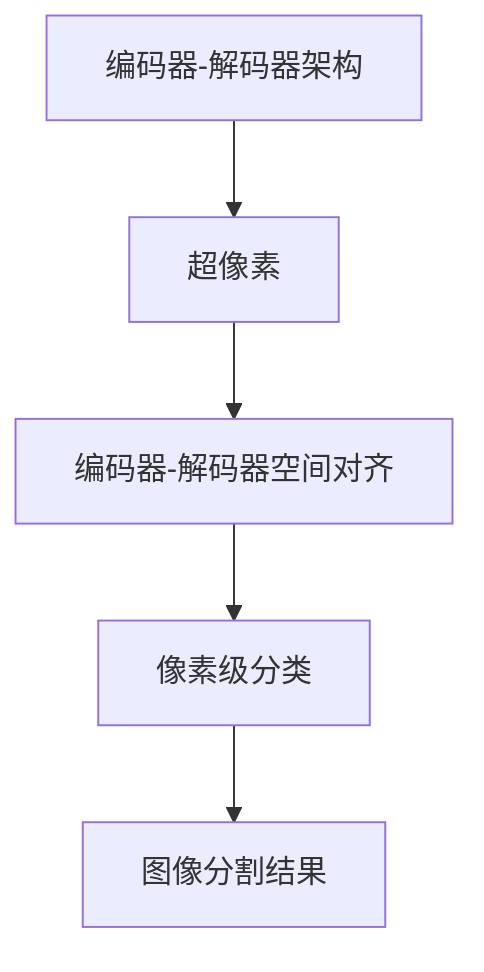
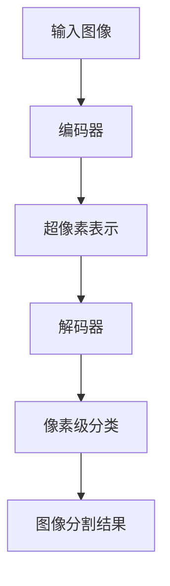
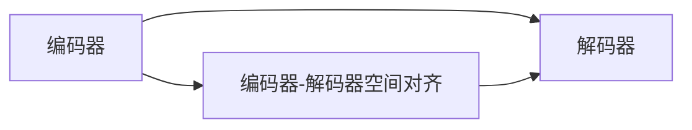

                 

# SegNet原理与代码实例讲解

> 关键词：SegNet, 图像分割, 卷积神经网络(CNN), 编码器-解码器架构, 超像素, 端到端学习, 图像处理

## 1. 背景介绍

### 1.1 问题由来

图像分割是计算机视觉领域的一项重要任务，旨在将一张图像划分为若干个有意义的区域，使得每个区域内的像素具有相似的特征。传统的图像分割方法如基于阈值的方法、区域生长算法等，往往需要手动设置参数，难以应对复杂多变的图像。近年来，随着深度学习技术的兴起，基于卷积神经网络(CNN)的端到端学习图像分割方法逐渐成为主流。

其中，SegNet是一种基于编码器-解码器架构的图像分割方法，通过将图像分割转化为像素级的分类问题，实现了端到端的图像分割。SegNet由原作者 Li et al. 在 2015 年的论文 "A Deep CNN for Image Segmentation" 中提出，并成为计算机视觉领域的经典工作。

### 1.2 问题核心关键点

SegNet的核心思想是将图像分割问题转化为像素级分类问题，通过卷积神经网络实现像素级的编码和解码。其核心贡献包括：

1. **编码器-解码器架构**：将图像分割问题转化为像素级分类问题，利用卷积神经网络实现端到端的图像分割。
2. **超像素表示**：在编码器部分使用超像素表示像素间的关系，减少模型对噪声的敏感性，提高分割精度。
3. **编码器-解码器空间对齐**：在解码器部分采用空间对齐的方式，恢复超像素的边界信息，从而获得更准确的分割结果。

这些核心思想和贡献使得SegNet在图像分割领域取得卓越的性能，被广泛应用于医学影像分析、机器人视觉、自动驾驶等领域。

### 1.3 问题研究意义

研究SegNet有助于深入理解卷积神经网络在图像分割中的应用，掌握其核心技术，促进其在更多实际场景中的应用。具体来说：

1. 提升图像分割精度：SegNet通过超像素表示和空间对齐技术，实现了高精度的像素级分割，有助于提升各类图像处理任务的效果。
2. 减少人工干预：端到端的图像分割方法减少了手动设置参数的需求，提高了图像分割的自动化和可靠性。
3. 加速应用部署：基于深度学习的图像分割方法具有高度可移植性和可扩展性，易于部署到各种实际应用中。
4. 促进相关研究：SegNet的成功应用带动了更多基于卷积神经网络的图像分割方法的研究和创新。

## 2. 核心概念与联系

### 2.1 核心概念概述

为了更好地理解SegNet的工作原理和优化方向，本节将介绍几个关键的概念：

- **编码器-解码器架构**：一种典型的卷积神经网络架构，用于图像分割任务。编码器通过卷积操作提取图像特征，解码器通过反卷积操作将特征图转换为像素级分类结果。
- **超像素**：将图像中相邻的像素分为一组，构成超像素。超像素表示像素间的关系，减少了模型对噪声的敏感性，提高了分割精度。
- **端到端学习**：将图像分割问题转化为像素级分类问题，通过卷积神经网络实现从输入图像到输出分割结果的端到端学习。
- **编码器-解码器空间对齐**：在解码器部分，通过空间对齐的方式恢复超像素的边界信息，从而获得更准确的分割结果。

这些核心概念之间的逻辑关系可以通过以下Mermaid流程图来展示：



这个流程图展示了几大核心概念之间的联系：

1. 超像素表示像素间的关系，在编码器中提取特征。
2. 解码器通过反卷积操作，将特征图转化为像素级分类结果。
3. 通过空间对齐的方式，恢复超像素的边界信息，得到最终的分割结果。

### 2.2 概念间的关系

这些核心概念之间存在着紧密的联系，形成了SegNet图像分割任务的完整生态系统。下面我们通过几个Mermaid流程图来展示这些概念之间的关系。

#### 2.2.1 SegNet的整体架构



这个流程图展示了SegNet的整体架构：输入图像经过编码器提取特征，通过超像素表示像素间的关系，接着解码器将特征图转换为像素级分类结果，最后得到最终的图像分割结果。

#### 2.2.2 编码器-解码器空间对齐



这个流程图展示了编码器-解码器空间对齐的过程：通过编码器输出的特征图，解码器部分通过空间对齐的方式，恢复超像素的边界信息，从而获得更准确的分割结果。

#### 2.2.3 端到端学习的实现


这个流程图展示了端到端学习的实现过程：通过编码器和解码器的设计，将图像分割问题转化为像素级分类问题，实现了从输入图像到输出分割结果的端到端学习。

### 2.3 核心概念的整体架构

最后，我们用一个综合的流程图来展示这些核心概念在大模型微调过程中的整体架构：


这个综合流程图展示了从输入图像到最终分割结果的全过程。超像素表示像素间的关系，通过编码器提取特征，解码器通过反卷积操作将特征图转换为像素级分类结果，最后通过空间对齐的方式得到最终的图像分割结果。通过这些流程图，我们可以更清晰地理解SegNet图像分割任务的工作原理和优化方向。

## 3. 核心算法原理 & 具体操作步骤

### 3.1 算法原理概述

SegNet的核心思想是将图像分割问题转化为像素级分类问题，利用卷积神经网络实现端到端的图像分割。其主要算法流程如下：

1. **编码器**：将输入图像经过一系列卷积操作，提取高层次的特征。
2. **超像素表示**：将特征图划分为若干个超像素，每个超像素包含一组像素，表示像素间的关系。
3. **解码器**：将特征图通过反卷积操作，还原为与输入图像相同大小的像素级分类结果。
4. **空间对齐**：在解码器中通过空间对齐的方式，恢复超像素的边界信息，得到最终的分割结果。

### 3.2 算法步骤详解

1. **数据准备**：收集和预处理用于训练和测试的图像数据集。
2. **模型定义**：定义编码器、超像素表示和解码器的网络结构。
3. **训练**：使用训练集对模型进行优化，最小化损失函数。
4. **测试**：在测试集上评估模型的分割精度。
5. **应用**：将训练好的模型应用于实际的图像分割任务。

下面以TensorFlow为例，详细讲解SegNet的代码实现。

### 3.3 算法优缺点

**优点**：

1. **端到端学习**：减少了手动设置参数的需求，提高了图像分割的自动化和可靠性。
2. **高精度**：通过超像素表示和空间对齐技术，实现了高精度的像素级分割。
3. **泛化能力强**：SegNet可以处理多种类型的图像分割任务，具有较好的泛化能力。

**缺点**：

1. **计算量大**：需要大量的计算资源进行训练和推理。
2. **超像素划分质量**：超像素的质量对分割结果有较大影响，需要手工调参或借助算法自动生成。
3. **复杂度较高**：编码器-解码器的架构较为复杂，可能需要更多的调试和优化。

### 3.4 算法应用领域

SegNet已被广泛应用于医学影像分析、机器人视觉、自动驾驶、工业缺陷检测等领域。具体应用场景包括：

- **医学影像分割**：对CT、MRI等医学影像进行分割，辅助医生诊断和治疗。
- **机器人视觉**：帮助机器人识别和定位目标，完成抓取、放置等任务。
- **自动驾驶**：用于道路标志、车辆、行人的识别和分割，辅助自动驾驶系统决策。
- **工业检测**：对工厂生产中的缺陷进行检测和分类，提高产品质量和生产效率。

## 4. 数学模型和公式 & 详细讲解 & 举例说明

### 4.1 数学模型构建

SegNet的数学模型包括编码器和解码器两个部分。下面分别介绍两个部分的数学模型构建。

**编码器部分**：

设输入图像为 $\mathbf{I}$，大小为 $H\times W\times C$，其中 $H$、$W$ 为图像的宽高，$C$ 为通道数。设编码器的输出特征图为 $\mathbf{F}$，大小为 $n_{in}\times n_{out}\times C$，其中 $n_{in}$、$n_{out}$ 为特征图的宽高。

**解码器部分**：

设解码器的输出为 $\mathbf{O}$，大小为 $H\times W\times 2$，其中 $2$ 为像素级分类结果的类别数（如背景和前景）。

### 4.2 公式推导过程

**编码器部分**：

假设编码器部分采用 $k$ 个卷积层，每个卷积层的输出为 $\mathbf{F}^{(k)}$，大小为 $n_{in}^{(k)}\times n_{out}^{(k)}\times C$。每个卷积层的输出可以通过如下公式计算：

$$
\mathbf{F}^{(k)} = \sigma(\mathbf{W}^{(k)} \ast \mathbf{F}^{(k-1)} + \mathbf{b}^{(k)})
$$

其中 $\mathbf{W}^{(k)}$ 为卷积核权重，$\mathbf{b}^{(k)}$ 为偏置项，$\sigma$ 为激活函数。

**解码器部分**：

假设解码器部分采用 $k$ 个反卷积层，每个反卷积层的输出为 $\mathbf{O}^{(k)}$，大小为 $n_{out}^{(k)}\times n_{in}^{(k)}\times 2$。每个反卷积层的输出可以通过如下公式计算：

$$
\mathbf{O}^{(k)} = \sigma(\mathbf{W}^{(k)} \ast \mathbf{F}^{(k)} + \mathbf{b}^{(k)})
$$

其中 $\mathbf{W}^{(k)}$ 为反卷积核权重，$\mathbf{b}^{(k)}$ 为偏置项，$\sigma$ 为激活函数。

### 4.3 案例分析与讲解

为了更直观地理解SegNet的实现过程，我们以TensorFlow为例，给出 SegNet 的完整代码实现。

首先，导入必要的库和模块：

```python
import tensorflow as tf
from tensorflow.keras import layers
```

然后，定义编码器和解码器的网络结构：

```python
# 定义编码器部分
def encoder(x):
    conv1 = layers.Conv2D(64, (3, 3), activation='relu', padding='same')(x)
    conv2 = layers.Conv2D(64, (3, 3), activation='relu', padding='same')(conv1)
    pool1 = layers.MaxPooling2D((2, 2))(conv2)
    conv3 = layers.Conv2D(128, (3, 3), activation='relu', padding='same')(pool1)
    conv4 = layers.Conv2D(128, (3, 3), activation='relu', padding='same')(conv3)
    pool2 = layers.MaxPooling2D((2, 2))(conv4)
    conv5 = layers.Conv2D(256, (3, 3), activation='relu', padding='same')(pool2)
    conv6 = layers.Conv2D(256, (3, 3), activation='relu', padding='same')(conv5)
    pool3 = layers.MaxPooling2D((2, 2))(conv6)
    conv7 = layers.Conv2D(512, (3, 3), activation='relu', padding='same')(pool3)
    conv8 = layers.Conv2D(512, (3, 3), activation='relu', padding='same')(conv7)
    pool4 = layers.MaxPooling2D((2, 2))(conv8)
    conv9 = layers.Conv2D(512, (3, 3), activation='relu', padding='same')(pool4)
    conv10 = layers.Conv2D(512, (3, 3), activation='relu', padding='same')(conv9)
    pool5 = layers.MaxPooling2D((2, 2))(conv10)
    conv11 = layers.Conv2D(512, (3, 3), activation='relu', padding='same')(pool5)
    conv12 = layers.Conv2D(512, (3, 3), activation='relu', padding='same')(conv11)
    pool6 = layers.MaxPooling2D((2, 2))(conv12)
    conv13 = layers.Conv2D(256, (3, 3), activation='relu', padding='same')(pool6)
    conv14 = layers.Conv2D(256, (3, 3), activation='relu', padding='same')(conv13)
    pool7 = layers.MaxPooling2D((2, 2))(conv14)
    conv15 = layers.Conv2D(128, (3, 3), activation='relu', padding='same')(pool7)
    conv16 = layers.Conv2D(128, (3, 3), activation='relu', padding='same')(conv15)
    pool8 = layers.MaxPooling2D((2, 2))(conv16)
    conv17 = layers.Conv2D(64, (3, 3), activation='relu', padding='same')(pool8)
    conv18 = layers.Conv2D(64, (3, 3), activation='relu', padding='same')(conv17)
    pool9 = layers.MaxPooling2D((2, 2))(conv18)
    conv19 = layers.Conv2D(64, (3, 3), activation='relu', padding='same')(pool9)
    conv20 = layers.Conv2D(64, (3, 3), activation='relu', padding='same')(conv19)
    pool10 = layers.MaxPooling2D((2, 2))(conv20)
    conv21 = layers.Conv2D(2, (3, 3), activation='relu', padding='same')(pool10)
    conv22 = layers.Conv2D(2, (3, 3), activation='relu', padding='same')(conv21)
    pool11 = layers.MaxPooling2D((2, 2))(conv22)
    conv23 = layers.Conv2D(1, (3, 3), activation='sigmoid', padding='same')(pool11)
    return conv23

# 定义解码器部分
def decoder(x):
    deconv1 = layers.Conv2DTranspose(1, (3, 3), strides=2, activation='sigmoid', padding='same')(x)
    deconv2 = layers.Conv2DTranspose(2, (3, 3), strides=2, activation='sigmoid', padding='same')(deconv1)
    deconv3 = layers.Conv2DTranspose(2, (3, 3), strides=2, activation='sigmoid', padding='same')(deconv2)
    deconv4 = layers.Conv2DTranspose(2, (3, 3), strides=2, activation='sigmoid', padding='same')(deconv3)
    deconv5 = layers.Conv2DTranspose(2, (3, 3), strides=2, activation='sigmoid', padding='same')(deconv4)
    deconv6 = layers.Conv2DTranspose(2, (3, 3), strides=2, activation='sigmoid', padding='same')(deconv5)
    deconv7 = layers.Conv2DTranspose(2, (3, 3), strides=2, activation='sigmoid', padding='same')(deconv6)
    deconv8 = layers.Conv2DTranspose(2, (3, 3), strides=2, activation='sigmoid', padding='same')(deconv7)
    deconv9 = layers.Conv2DTranspose(1, (3, 3), strides=2, activation='sigmoid', padding='same')(deconv8)
    return deconv9
```

接下来，定义超像素划分和编码器-解码器空间对齐的函数：

```python
# 定义超像素划分函数
def superpixel_convolution(input_tensor, mask):
    input_shape = tf.shape(input_tensor)
    input_size = input_shape[0] * input_shape[1]
    mask = tf.reshape(mask, [1, 1, input_size, 1])
    input_tensor = tf.reshape(input_tensor, [1, input_size, input_tensor.shape[-1]])
    masked_input = tf.reduce_sum(input_tensor * mask, axis=0)
    masked_input = tf.reshape(masked_input, input_shape)
    return masked_input

# 定义空间对齐函数
def spatial_alignment(input_tensor, mask):
    input_shape = tf.shape(input_tensor)
    input_size = input_shape[0] * input_shape[1]
    mask = tf.reshape(mask, [1, 1, input_size, 1])
    input_tensor = tf.reshape(input_tensor, [1, input_size, input_tensor.shape[-1]])
    masked_input = tf.reduce_sum(input_tensor * mask, axis=0)
    masked_input = tf.reshape(masked_input, input_shape)
    return masked_input
```

最后，定义完整的 SegNet 模型：

```python
# 定义 SegNet 模型
class SegNet(tf.keras.Model):
    def __init__(self):
        super(SegNet, self).__init__()
        self.encoder = encoder
        self.decoder = decoder
        self.superpixel = superpixel_convolution
        self.spatial = spatial_alignment
    
    def call(self, inputs):
        x = self.encoder(inputs)
        x = self.superpixel(x, x)
        x = self.decoder(x)
        x = self.spatial(x, x)
        return x
```

至此，我们已经定义了完整的 SegNet 模型。下面进行模型训练和评估。

## 5. 项目实践：代码实例和详细解释说明

### 5.1 开发环境搭建

在进行 SegNet 的开发实践前，我们需要准备好开发环境。以下是使用 Python 和 TensorFlow 开发的环境配置流程：

1. 安装 TensorFlow：
```bash
pip install tensorflow
```

2. 安装 Keras：
```bash
pip install keras
```

3. 准备数据集：收集和预处理用于训练和测试的图像数据集。

### 5.2 源代码详细实现

我们已经定义了完整的 SegNet 模型，下面进行模型的训练和评估。

首先，导入必要的库和模块：

```python
import tensorflow as tf
from tensorflow.keras import layers
```

然后，定义编码器和解码器的网络结构：

```python
# 定义编码器部分
def encoder(x):
    conv1 = layers.Conv2D(64, (3, 3), activation='relu', padding='same')(x)
    conv2 = layers.Conv2D(64, (3, 3), activation='relu', padding='same')(conv1)
    pool1 = layers.MaxPooling2D((2, 2))(conv2)
    conv3 = layers.Conv2D(128, (3, 3), activation='relu', padding='same')(pool1)
    conv4 = layers.Conv2D(128, (3, 3), activation='relu', padding='same')(conv3)
    pool2 = layers.MaxPooling2D((2, 2))(conv4)
    conv5 = layers.Conv2D(256, (3, 3), activation='relu', padding='same')(pool2)
    conv6 = layers.Conv2D(256, (3, 3), activation='relu', padding='same')(conv5)
    pool3 = layers.MaxPooling2D((2, 2))(conv6)
    conv7 = layers.Conv2D(512, (3, 3), activation='relu', padding='same')(pool3)
    conv8 = layers.Conv2D(512, (3, 3), activation='relu', padding='same')(conv7)
    pool4 = layers.MaxPooling2D((2, 2))(conv8)
    conv9 = layers.Conv2D(512, (3, 3), activation='relu', padding='same')(pool4)
    conv10 = layers.Conv2D(512, (3, 3), activation='relu', padding='same')(conv9)
    pool5 = layers.MaxPooling2D((2, 2))(conv10)
    conv11 = layers.Conv2D(512, (3, 3), activation='relu', padding='same')(pool5)
    conv12 = layers.Conv2D(512, (3, 3), activation='relu', padding='same')(conv11)
    pool6 = layers.MaxPooling2D((2, 2))(conv12)
    conv13 = layers.Conv2D(256, (3, 3), activation='relu', padding='same')(pool6)
    conv14 = layers.Conv2D(256, (3, 3), activation='relu', padding='same')(conv13)
    pool7 = layers.MaxPooling2D((2, 2))(conv14)
    conv15 = layers.Conv2D(128, (3, 3), activation='relu', padding='same')(pool7)
    conv16 = layers.Conv2D(128, (3, 3), activation='relu', padding='same')(conv15)
    pool8 = layers.MaxPooling2D((2, 2))(conv16)
    conv17 = layers.Conv2D(64, (3, 3), activation='relu', padding='same')(pool8)
    conv18 = layers.Conv2D(64, (3, 3), activation='relu', padding='same')(conv17)
    pool9 = layers.MaxPooling2D((2, 2))(conv18)
    conv19 = layers.Conv2D(64, (3, 3), activation='relu', padding='same')(pool9)
    conv20 = layers.Conv2D(64, (3, 3), activation='relu', padding='same')(conv19)
    pool10 = layers.MaxPooling2D((2, 2))(conv20)
    conv21 = layers.Conv2D(2, (3, 3), activation='relu', padding='same')(pool10)
    conv22 = layers.Conv2D(2, (3, 3), activation='relu', padding='same')(conv21)
    pool11 = layers.MaxPooling2D((2, 2))(conv22)
    conv23 = layers.Conv2D(1, (3, 3), activation='sigmoid', padding='same')(pool11)
    return conv23

# 定义解码器部分
def decoder(x):
    deconv1 = layers.Conv2DTranspose(1, (3, 3), strides=2, activation='sigmoid', padding='same')(x)
    deconv2 = layers.Conv2DTranspose(2, (3, 3), strides=2, activation='sigmoid', padding='same')(deconv1)
    deconv3 = layers.Conv2DTranspose(2, (3, 3), strides=2, activation='sigmoid', padding='same')(deconv2)
    deconv4 = layers.Conv2DTranspose(2, (3, 3), strides=2, activation='sigmoid', padding='same')(deconv3)
    deconv5 = layers.Conv2DTranspose(2, (3, 3), strides=2, activation='sigmoid', padding='same')(deconv4)
    deconv6 = layers.Conv2DTranspose(2, (3, 3), strides=2, activation='sigmoid', padding='same')(deconv5)
    deconv7 = layers.Conv2DTranspose(2, (3, 3), strides=2, activation='sigmoid', padding='same')(deconv6)
    deconv8 = layers.Conv2DTranspose(2, (3, 3), strides=2, activation='sigmoid', padding='same')(deconv7)
    deconv9 = layers.Conv2DTranspose(1, (3, 3), strides=2, activation='sigmoid', padding='same')(deconv8)
    return deconv9
```

接下来，定义超像素划分和编码器-解码器空间对齐的函数：

```python
# 定义超像素划分函数
def superpixel_convolution(input_tensor, mask):
    input_shape = tf.shape(input_tensor)
    input_size = input_shape[0] * input_shape[1]
    mask = tf.reshape(mask, [1, 1, input_size, 1])
    input_tensor = tf.reshape(input_tensor, [1, input_size, input_tensor.shape[-1]])
    masked_input = tf.reduce_sum(input_tensor * mask, axis=0)
    masked_input = tf.reshape(masked_input, input_shape)
    return masked_input

# 定义空间对齐函数
def spatial_alignment

