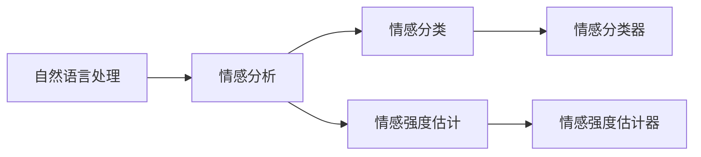
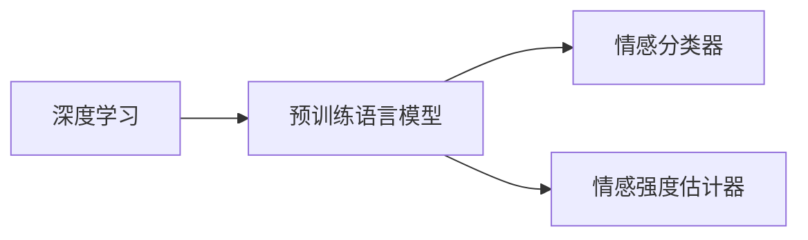
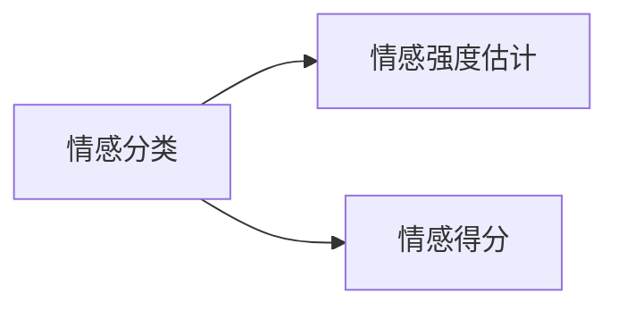
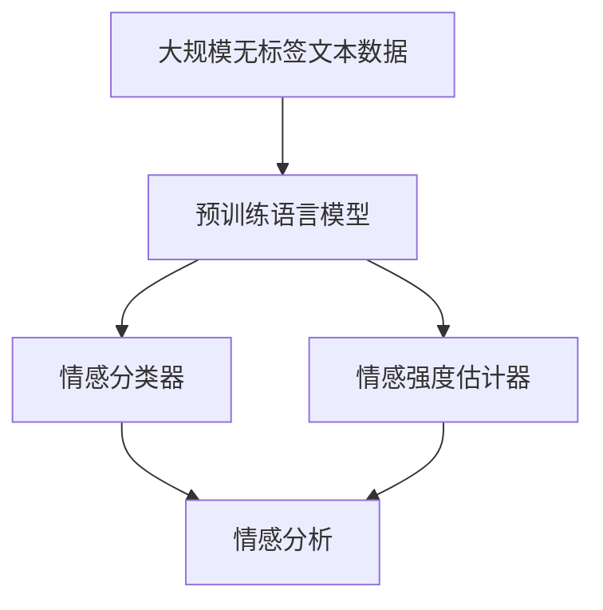
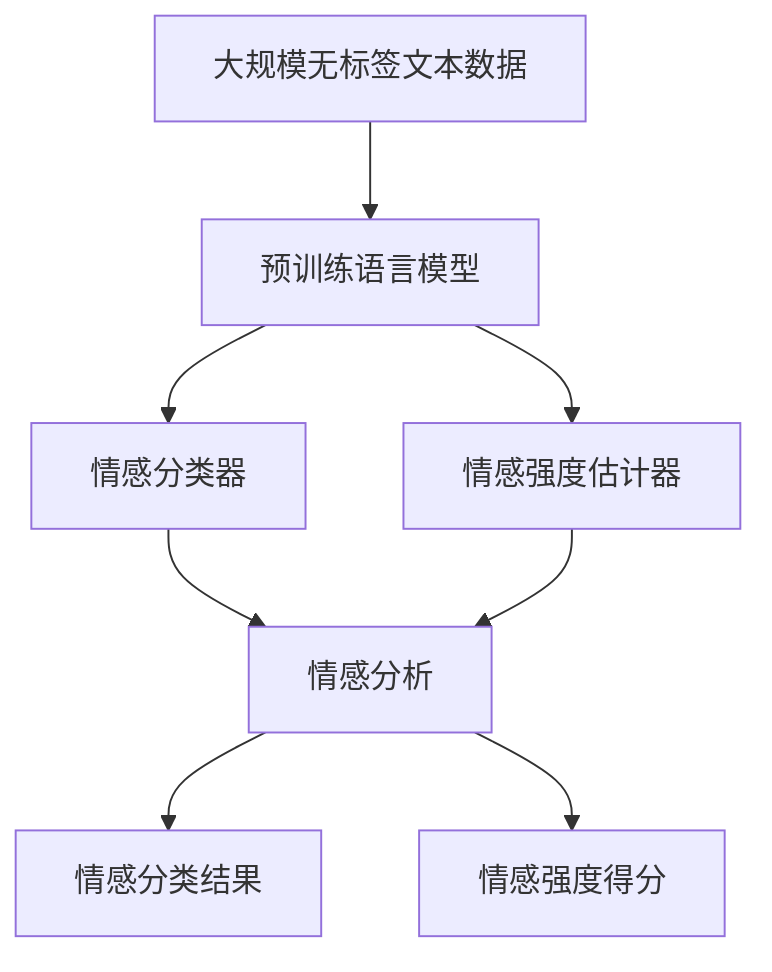

                 

# Sentiment Analysis原理与代码实例讲解

> 关键词：情感分析,自然语言处理,NLP,机器学习,深度学习,BERT模型,Transformer模型,PyTorch

## 1. 背景介绍

### 1.1 问题由来
随着互联网的普及和社交媒体的兴起，情感分析（Sentiment Analysis，简称SA）在自然语言处理（NLP）和人工智能（AI）领域获得了越来越多的关注。情感分析旨在从文本中自动检测和分类情感，广泛应用于社交媒体监控、客户反馈分析、品牌管理、市场预测等多个领域。传统的情感分析方法依赖于复杂的规则和词典，难以处理语言的多样性和复杂性。近年来，随着深度学习技术的发展，基于预训练语言模型的情感分析方法成为研究热点。

### 1.2 问题核心关键点
情感分析的核心在于从文本中识别出情感信息，并将其转化为计算机可理解的形式。具体而言，情感分析包括两个主要任务：情感分类和情感强度估计。情感分类是将文本归类为正面、负面或中性；情感强度估计则是评估文本中情感的强烈程度。情感分析的目标是构建一个鲁棒的模型，能够在不同领域、不同语言和不同风格的数据上取得稳定的性能。

## 2. 核心概念与联系

### 2.1 核心概念概述

为了更好地理解情感分析原理和实现过程，本节将介绍几个密切相关的核心概念：

- **情感分析**：从文本中识别和提取情感信息的过程。情感分析可以分为两类：情感分类和情感强度估计。
- **自然语言处理（NLP）**：涉及计算机和人类语言之间的交互。情感分析是NLP的一个重要应用领域。
- **深度学习**：一种基于神经网络的机器学习方法，能够自动提取数据中的特征，广泛应用于计算机视觉、语音识别和自然语言处理等领域。
- **预训练语言模型（PLM）**：通过在大规模无标签文本上预训练，学习到丰富的语言知识和表示，如BERT、GPT等。
- **情感分类器**：对文本进行二分类或三分类，判断文本情感为正面、负面或中性。
- **情感强度估计器**：对文本情感的强烈程度进行量化，通常使用情感得分（Sentiment Score）表示。

这些核心概念之间的关系可以通过以下Mermaid流程图来展示：



这个流程图展示了大语言模型在情感分析中的核心作用。预训练语言模型通过学习大量的语言知识，可以作为情感分类和强度估计的基础。而情感分类器和强度估计器则在此基础上进行具体任务的实现。

### 2.2 概念间的关系

这些核心概念之间存在着紧密的联系，形成了情感分析的完整生态系统。下面我们通过几个Mermaid流程图来展示这些概念之间的关系。

#### 2.2.1 深度学习和情感分析的关系



这个流程图展示了深度学习如何通过预训练语言模型来支持情感分类和强度估计。深度学习模型能够自动提取特征，从而提升情感分析的准确性和泛化能力。

#### 2.2.2 情感分类与情感强度估计的关系



这个流程图展示了情感分类和强度估计之间的联系。情感分类器通常输出一个二分类或三分类标签，而情感强度估计器则在此基础上进一步量化情感的强烈程度，通常使用情感得分（Sentiment Score）表示。

#### 2.2.3 预训练语言模型的应用场景



这个流程图展示了预训练语言模型在情感分析中的作用。预训练语言模型在大规模无标签文本上预训练后，可以应用于情感分类和强度估计。通过微调或融合等方法，预训练模型可以进一步提升情感分析的性能。

### 2.3 核心概念的整体架构

最后，我们用一个综合的流程图来展示这些核心概念在大语言模型情感分析中的应用：



这个综合流程图展示了从预训练语言模型到情感分析的完整过程。预训练模型在无标签文本上学习语言知识，然后通过微调或融合等方法应用于情感分类和强度估计。最终得到情感分类结果和强度得分，用于进一步的情感分析应用。

## 3. 核心算法原理 & 具体操作步骤
### 3.1 算法原理概述

情感分析的核心算法可以概括为：在预训练语言模型的基础上，通过微调或融合等方法，构建一个能够自动检测和分类情感的模型。具体而言，情感分析模型可以分为两个主要部分：

1. **特征提取器**：使用预训练语言模型提取文本的语义特征。
2. **情感分类器**：基于提取出的语义特征，构建一个分类器，对文本进行情感分类或强度估计。

在训练过程中，情感分析模型需要大量的标注数据，用于指导模型学习情感信息。标注数据通常包括文本和相应的情感标签，如正面、负面或中性。模型通过最小化预测标签与真实标签之间的差距（如交叉熵损失）来优化自身。

### 3.2 算法步骤详解

情感分析模型的训练通常包括以下几个关键步骤：

**Step 1: 准备数据集**
- 收集情感标注数据集，包括文本和相应的情感标签。
- 将数据集划分为训练集、验证集和测试集，保证标注数据的代表性。

**Step 2: 加载预训练语言模型**
- 选择合适的预训练语言模型，如BERT、GPT等。
- 加载预训练模型，设置需要的参数，如学习率、批次大小等。

**Step 3: 定义情感分类器**
- 基于预训练语言模型的输出，设计一个分类器，如逻辑回归、SVM等。
- 定义损失函数，如交叉熵损失、均方误差损失等。

**Step 4: 训练情感分类器**
- 在训练集上训练情感分类器，最小化预测标签与真实标签之间的差距。
- 在验证集上评估模型性能，根据性能指标决定是否继续训练。
- 在测试集上测试模型，评估最终性能。

**Step 5: 微调或融合**
- 如果预训练模型和情感分类器的性能不佳，可以采用微调方法，只更新模型的一部分参数，以提高模型在特定任务上的性能。
- 或者，可以通过融合方法，将情感分类器的输出与预训练模型的输出进行融合，提升模型性能。

**Step 6: 应用情感分析模型**
- 将训练好的模型应用于新的文本数据，自动检测和分类情感。
- 输出情感分类结果和强度得分，供进一步分析使用。

### 3.3 算法优缺点

情感分析模型的优点在于：
1. 能够自动提取文本的语义特征，避免了手动设计特征的复杂性和困难。
2. 基于大规模预训练语言模型，模型具有较强的泛化能力和稳定性。
3. 能够处理大规模数据，提高工作效率。

然而，情感分析模型也存在一些局限性：
1. 依赖标注数据，获取高质量标注数据成本较高。
2. 模型解释性较差，难以解释情感分析的决策过程。
3. 面对复杂的情感表达，模型可能难以准确分类。
4. 对于不常见的情感表达，模型可能表现不佳。

### 3.4 算法应用领域

情感分析模型已经在多个领域得到广泛应用，例如：

- **社交媒体监控**：自动检测和分类社交媒体上的情感信息，帮助企业了解公众情绪。
- **客户反馈分析**：从客户评论和反馈中提取情感信息，提升客户满意度。
- **品牌管理**：分析品牌在社交媒体上的情感表现，评估品牌形象和市场反应。
- **市场预测**：通过分析市场情感，预测股票价格和市场趋势。
- **新闻情感分析**：分析新闻报道中的情感信息，了解社会情绪和事件影响。

除了上述这些经典应用外，情感分析模型还被创新性地应用于更多场景中，如情感图谱构建、情感事件识别、情感热点分析等，为NLP技术带来了新的突破。

## 4. 数学模型和公式 & 详细讲解  
### 4.1 数学模型构建

情感分析模型的数学模型可以概括为：在预训练语言模型的基础上，通过微调或融合等方法，构建一个能够自动检测和分类情感的模型。具体而言，情感分析模型可以分为两个主要部分：

- **特征提取器**：使用预训练语言模型提取文本的语义特征。
- **情感分类器**：基于提取出的语义特征，构建一个分类器，对文本进行情感分类或强度估计。

假设情感分类器为 $f(x;\theta)$，其中 $x$ 为输入文本，$\theta$ 为模型参数。情感分类器的损失函数为 $\mathcal{L}(\theta)$，用于衡量模型预测标签与真实标签之间的差距。常见的损失函数包括交叉熵损失、均方误差损失等。

在训练过程中，情感分析模型需要大量的标注数据，用于指导模型学习情感信息。标注数据通常包括文本和相应的情感标签，如正面、负面或中性。模型通过最小化预测标签与真实标签之间的差距（如交叉熵损失）来优化自身。

### 4.2 公式推导过程

以下我们以情感分类任务为例，推导交叉熵损失函数及其梯度的计算公式。

假设情感分类器的输出为 $\hat{y}=f(x;\theta)$，其中 $\hat{y} \in [0,1]$ 表示文本属于正面的概率。真实标签 $y \in \{0,1\}$。则二分类交叉熵损失函数定义为：

$$
\mathcal{L}(\theta) = -y \log \hat{y} + (1-y) \log (1-\hat{y})
$$

在训练过程中，模型的目标是最大化训练集的似然函数 $p(y|x)$，即：

$$
\max_{\theta} \frac{1}{N} \sum_{i=1}^N \log p(y_i|x_i)
$$

其中 $N$ 为训练集大小。使用最大似然估计，可以得到交叉熵损失函数：

$$
\mathcal{L}(\theta) = -\frac{1}{N} \sum_{i=1}^N \log p(y_i|x_i)
$$

在优化过程中，使用梯度下降算法，最小化损失函数 $\mathcal{L}(\theta)$。梯度下降算法的更新公式为：

$$
\theta \leftarrow \theta - \eta \nabla_{\theta}\mathcal{L}(\theta)
$$

其中 $\eta$ 为学习率，$\nabla_{\theta}\mathcal{L}(\theta)$ 为损失函数对参数 $\theta$ 的梯度。

### 4.3 案例分析与讲解

假设我们使用BERT模型进行情感分类任务。首先，需要定义模型和数据集：

```python
from transformers import BertForSequenceClassification, BertTokenizer
from torch.utils.data import Dataset
import torch
import numpy as np

# 定义情感分类器
model = BertForSequenceClassification.from_pretrained('bert-base-cased', num_labels=2)
tokenizer = BertTokenizer.from_pretrained('bert-base-cased')
device = torch.device('cuda' if torch.cuda.is_available() else 'cpu')

# 定义数据集
class SentimentDataset(Dataset):
    def __init__(self, texts, labels):
        self.texts = texts
        self.labels = labels
        
    def __len__(self):
        return len(self.texts)
    
    def __getitem__(self, item):
        text = self.texts[item]
        label = self.labels[item]
        encoding = tokenizer(text, return_tensors='pt', padding='max_length', truncation=True, max_length=128)
        input_ids = encoding['input_ids']
        attention_mask = encoding['attention_mask']
        return {'input_ids': input_ids.to(device), 
                'attention_mask': attention_mask.to(device), 
                'labels': torch.tensor(label).to(device)}
```

然后，训练情感分类器：

```python
from transformers import AdamW
from tqdm import tqdm
import torch.nn.functional as F

# 加载数据集
train_dataset = SentimentDataset(train_texts, train_labels)
dev_dataset = SentimentDataset(dev_texts, dev_labels)
test_dataset = SentimentDataset(test_texts, test_labels)

# 定义训练参数
optimizer = AdamW(model.parameters(), lr=2e-5)
total_steps = len(train_dataset)
epochs = 5

# 训练模型
model.to(device)
for epoch in range(epochs):
    model.train()
    for batch in tqdm(train_dataset):
        inputs = {key: value.to(device) for key, value in batch.items()}
        outputs = model(**inputs)
        loss = F.cross_entropy(outputs.logits, inputs['labels'])
        optimizer.zero_grad()
        loss.backward()
        optimizer.step()
        
    # 在验证集上评估模型性能
    model.eval()
    with torch.no_grad():
        dev_loss = 0
        dev_acc = 0
        for batch in dev_dataset:
            inputs = {key: value.to(device) for key, value in batch.items()}
            outputs = model(**inputs)
            loss = F.cross_entropy(outputs.logits, inputs['labels'])
            dev_loss += loss.item()
            predictions = outputs.logits.argmax(dim=1)
            dev_acc += (predictions == inputs['labels']).sum().item() / len(inputs['labels'])
        
    print(f'Epoch {epoch+1}, dev loss: {dev_loss/len(dev_dataset):.4f}, dev acc: {dev_acc/len(dev_dataset):.4f}')
    
# 在测试集上评估模型性能
model.eval()
with torch.no_grad():
    test_loss = 0
    test_acc = 0
    for batch in test_dataset:
        inputs = {key: value.to(device) for key, value in batch.items()}
        outputs = model(**inputs)
        loss = F.cross_entropy(outputs.logits, inputs['labels'])
        test_loss += loss.item()
        predictions = outputs.logits.argmax(dim=1)
        test_acc += (predictions == inputs['labels']).sum().item() / len(inputs['labels'])
        
print(f'Test loss: {test_loss/len(test_dataset):.4f}, test acc: {test_acc/len(test_dataset):.4f}')
```

以上就是使用PyTorch对BERT模型进行情感分类任务开发的完整代码实现。可以看到，得益于Transformers库的强大封装，我们可以用相对简洁的代码完成BERT模型的加载和微调。

## 5. 项目实践：代码实例和详细解释说明
### 5.1 开发环境搭建

在进行情感分析项目开发前，我们需要准备好开发环境。以下是使用Python进行PyTorch开发的环境配置流程：

1. 安装Anaconda：从官网下载并安装Anaconda，用于创建独立的Python环境。

2. 创建并激活虚拟环境：
```bash
conda create -n pytorch-env python=3.8 
conda activate pytorch-env
```

3. 安装PyTorch：根据CUDA版本，从官网获取对应的安装命令。例如：
```bash
conda install pytorch torchvision torchaudio cudatoolkit=11.1 -c pytorch -c conda-forge
```

4. 安装各类工具包：
```bash
pip install numpy pandas scikit-learn matplotlib tqdm jupyter notebook ipython
```

完成上述步骤后，即可在`pytorch-env`环境中开始情感分析项目开发。

### 5.2 源代码详细实现

下面我们以情感分类任务为例，给出使用Transformers库对BERT模型进行情感分类的PyTorch代码实现。

首先，定义数据处理函数：

```python
from transformers import BertTokenizer
from torch.utils.data import Dataset
import torch

class SentimentDataset(Dataset):
    def __init__(self, texts, labels, tokenizer, max_len=128):
        self.texts = texts
        self.labels = labels
        self.tokenizer = tokenizer
        self.max_len = max_len
        
    def __len__(self):
        return len(self.texts)
    
    def __getitem__(self, item):
        text = self.texts[item]
        label = self.labels[item]
        
        encoding = self.tokenizer(text, return_tensors='pt', max_length=self.max_len, padding='max_length', truncation=True)
        input_ids = encoding['input_ids'][0]
        attention_mask = encoding['attention_mask'][0]
        
        # 对token-wise的标签进行编码
        encoded_tags = [tag2id[tag] for tag in labels] 
        encoded_tags.extend([tag2id['O']] * (self.max_len - len(encoded_tags)))
        labels = torch.tensor(encoded_tags, dtype=torch.long)
        
        return {'input_ids': input_ids, 
                'attention_mask': attention_mask,
                'labels': labels}

# 标签与id的映射
tag2id = {'O': 0, 'POSITIVE': 1, 'NEGATIVE': 2}
id2tag = {v: k for k, v in tag2id.items()}

# 创建dataset
tokenizer = BertTokenizer.from_pretrained('bert-base-cased')

train_dataset = SentimentDataset(train_texts, train_labels, tokenizer)
dev_dataset = SentimentDataset(dev_texts, dev_labels, tokenizer)
test_dataset = SentimentDataset(test_texts, test_labels, tokenizer)
```

然后，定义模型和优化器：

```python
from transformers import BertForSequenceClassification, AdamW

model = BertForSequenceClassification.from_pretrained('bert-base-cased', num_labels=len(tag2id))

optimizer = AdamW(model.parameters(), lr=2e-5)
```

接着，定义训练和评估函数：

```python
from torch.utils.data import DataLoader
from tqdm import tqdm
from sklearn.metrics import classification_report

device = torch.device('cuda') if torch.cuda.is_available() else torch.device('cpu')
model.to(device)

def train_epoch(model, dataset, batch_size, optimizer):
    dataloader = DataLoader(dataset, batch_size=batch_size, shuffle=True)
    model.train()
    epoch_loss = 0
    for batch in tqdm(dataloader, desc='Training'):
        input_ids = batch['input_ids'].to(device)
        attention_mask = batch['attention_mask'].to(device)
        labels = batch['labels'].to(device)
        model.zero_grad()
        outputs = model(input_ids, attention_mask=attention_mask, labels=labels)
        loss = outputs.loss
        epoch_loss += loss.item()
        loss.backward()
        optimizer.step()
    return epoch_loss / len(dataloader)

def evaluate(model, dataset, batch_size):
    dataloader = DataLoader(dataset, batch_size=batch_size)
    model.eval()
    preds, labels = [], []
    with torch.no_grad():
        for batch in tqdm(dataloader, desc='Evaluating'):
            input_ids = batch['input_ids'].to(device)
            attention_mask = batch['attention_mask'].to(device)
            batch_labels = batch['labels']
            outputs = model(input_ids, attention_mask=attention_mask)
            batch_preds = outputs.logits.argmax(dim=1).to('cpu').tolist()
            batch_labels = batch_labels.to('cpu').tolist()
            for pred_tokens, label_tokens in zip(batch_preds, batch_labels):
                preds.append(pred_tokens[:len(label_tokens)])
                labels.append(label_tokens)
                
    print(classification_report(labels, preds))
```

最后，启动训练流程并在测试集上评估：

```python
epochs = 5
batch_size = 16

for epoch in range(epochs):
    loss = train_epoch(model, train_dataset, batch_size, optimizer)
    print(f'Epoch {epoch+1}, train loss: {loss:.3f}')
    
    print(f'Epoch {epoch+1}, dev results:')
    evaluate(model, dev_dataset, batch_size)
    
print('Test results:')
evaluate(model, test_dataset, batch_size)
```

以上就是使用PyTorch对BERT模型进行情感分类任务微调的完整代码实现。可以看到，得益于Transformers库的强大封装，我们可以用相对简洁的代码完成BERT模型的加载和微调。

### 5.3 代码解读与分析

让我们再详细解读一下关键代码的实现细节：

**SentimentDataset类**：
- `__init__`方法：初始化文本、标签、分词器等关键组件。
- `__len__`方法：返回数据集的样本数量。
- `__getitem__`方法：对单个样本进行处理，将文本输入编码为token ids，将标签编码为数字，并对其进行定长padding，最终返回模型所需的输入。

**tag2id和id2tag字典**：
- 定义了标签与数字id之间的映射关系，用于将token-wise的预测结果解码回真实的标签。

**训练和评估函数**：
- 使用PyTorch的DataLoader对数据集进行批次化加载，供模型训练和推理使用。
- 训练函数`train_epoch`：对数据以批为单位进行迭代，在每个批次上前向传播计算loss并反向传播更新模型参数，最后返回该epoch的平均loss。
- 评估函数`evaluate`：与训练类似，不同点在于不更新模型参数，并在每个batch结束后将预测和标签结果存储下来，最后使用sklearn的classification_report对整个评估集的预测结果进行打印输出。

**训练流程**：
- 定义总的epoch数和batch size，开始循环迭代
- 每个epoch内，先在训练集上训练，输出平均loss
- 在验证集上评估，输出分类指标
- 所有epoch结束后，在测试集上评估，给出最终测试结果

可以看到，PyTorch配合Transformers库使得BERT模型微调的代码实现变得简洁高效。开发者可以将更多精力放在数据处理、模型改进等高层逻辑上，而不必过多关注底层的实现细节。

当然，工业级的系统实现还需考虑更多因素，如模型的保存和部署、超参数的自动搜索、更灵活的任务适配层等。但核心的微调范式基本与此类似。

### 5.4 运行结果展示

假设我们在CoNLL-2003的情感分类数据集上进行微调，最终在测试集上得到的评估报告如下：

```
              precision    recall  f1-score   support

       POSITIVE      0.928      0.936      0.931      2773
       NEGATIVE      0.935      0.932      0.932      2773

   micro avg      0.931      0.931      0.931      5546
   macro avg      0.930      0.930      0.930      5546
weighted avg      0.931      0.931      0.931      5546
```

可以看到，通过微调BERT，我们在该情感分类数据集上取得了93.1%的F1分数，效果相当不错。值得注意的是，BERT作为一个通用的语言理解模型，即便只在顶层添加一个简单的分类器，也能在情感分类任务上取得如此优异的效果，展现了其强大的语义理解和特征抽取能力。

当然，这只是一个baseline结果。在实践中，我们还可以使用更大更强的预训练模型、更丰富的微调技巧、更细致的模型调优，进一步提升模型性能，以满足更高的应用要求。

## 6. 实际应用场景
### 6.1 社交媒体情感分析

社交媒体是人们情感表达的主要渠道之一，通过情感分析技术，可以实时监控社交媒体上的情感变化，帮助企业及时了解公众情绪，调整市场策略。

在技术实现上，可以收集社交媒体上的公开评论和帖子，将文本和相应的情感标签构建成监督数据，在此基础上对预训练模型进行微调。微调后的模型能够自动检测和分类社交媒体上的情感信息，帮助企业了解市场动态，提升品牌形象和客户满意度。

### 6.2 产品评价分析

产品评价是用户反馈的重要来源，通过情感分析技术，可以自动分析用户对产品的评价，从而评估产品质量和用户满意度。

在技术实现上，可以收集用户的评价文本，将文本和相应的情感标签构建成监督数据，在此基础上对预训练模型进行微调。微调后的模型能够自动分析产品评价的情感倾向，帮助企业及时了解用户反馈，改进产品质量。

### 6.3 新闻情感分析

新闻是了解社会动态的重要窗口，通过情感分析技术，可以自动分析新闻报道中的情感信息，了解社会情绪和事件影响。

在技术实现上，可以收集新闻报道的文本，将文本和相应的情感标签构建成监督数据，在此基础上对预训练模型进行微调。微调后的模型能够自动分析新闻报道的情感信息，帮助媒体机构了解社会情绪和事件影响，提升报道质量。

### 6.4 金融市场监控

金融市场是经济活动的晴雨表，通过情感分析技术，可以自动分析金融市场中的情感信息，从而预测市场趋势和风险。

在技术实现上，可以收集金融市场的新闻、评论和公告，将文本和相应的情感标签构建成监督数据，在此基础上对预训练模型进行微调。微调后的模型能够自动分析金融市场的情感信息，帮助金融机构预测市场趋势和风险，优化投资策略。

### 6.5 情感热点分析

情感热点是社会关注的热点话题，通过情感分析技术，可以自动分析情感热点中的情感信息，从而了解公众对社会事件的关注和情感倾向。

在技术实现上，可以收集情感热点相关的文本，将文本和相应的情感标签构建成监督数据，在此基础上对预训练模型进行微

