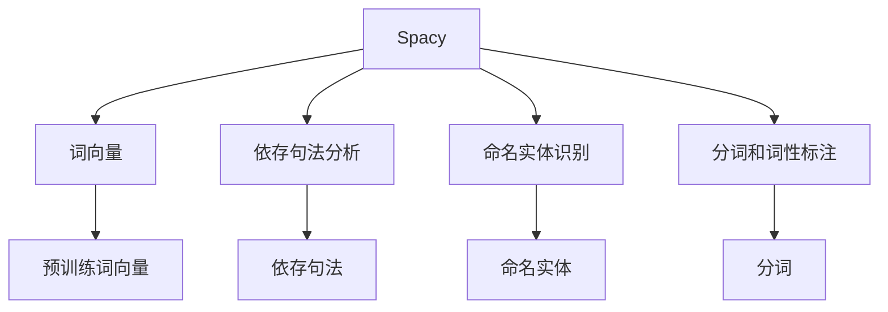
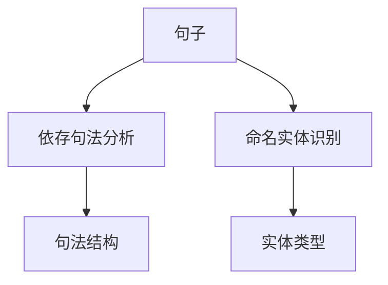
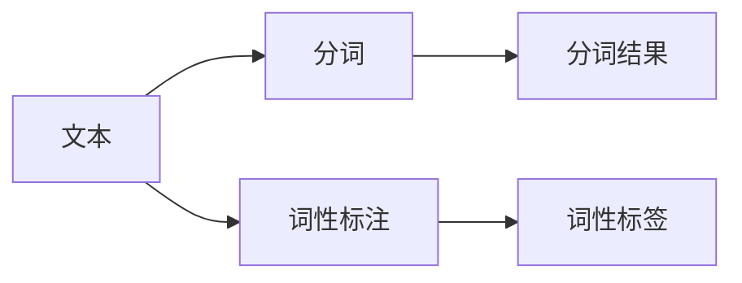

                 

# Spacy 原理与代码实战案例讲解

> 关键词：Spacy, 自然语言处理, 自然语言理解, 依存句法分析, 词向量, 代码实战, 机器学习

## 1. 背景介绍

### 1.1 问题由来

随着人工智能技术的发展，自然语言处理（NLP）成为了一个重要的研究领域。其中，Spacy作为一款流行的自然语言处理库，以其高效和易用性广受开发者喜爱。Spacy库提供了许多先进的NLP功能，如词向量、依存句法分析、命名实体识别等，被广泛应用于机器翻译、文本分类、信息抽取等任务中。

Spacy库的出现，极大地简化了NLP任务的开发流程，使得开发者可以更加专注于算法创新和应用部署，而非底层的技术实现。然而，对于初学者而言，Spacy库的内部机制和使用方法仍存在一些复杂性，需要深入学习和理解。

### 1.2 问题核心关键点

Spacy库的核心机制主要包括以下几个方面：
- 词向量的表示和训练：Spacy内置的预训练词向量模型，通过大规模语料库训练得到，支持多种语言的词向量表示。
- 依存句法分析：Spacy可以自动进行句子的依存句法分析，识别句子中的主谓宾关系等句法结构。
- 命名实体识别：Spacy可以自动识别文本中的实体，如人名、地名、组织机构等，并对实体类型进行标注。
- 分词和词性标注：Spacy对文本进行分词和词性标注，提取词汇的基本信息。

这些核心机制共同构成了Spacy库的功能框架，使得NLP任务开发变得更加高效和便捷。

## 2. 核心概念与联系

### 2.1 核心概念概述

为更好地理解Spacy库的内部机制和使用方法，本节将介绍几个密切相关的核心概念：

- Spacy：一个基于Python的自然语言处理库，提供了多种先进的NLP功能，如词向量、依存句法分析、命名实体识别等。
- 词向量：用向量表示单词的语义信息，是NLP任务的基础，Spacy库内置多种预训练词向量模型。
- 依存句法分析：通过分析句子的依存关系，识别句子中的主谓宾关系等句法结构。
- 命名实体识别：自动识别文本中的实体，并对实体类型进行标注，如人名、地名、组织机构等。
- 分词和词性标注：对文本进行分词和词性标注，提取词汇的基本信息。

这些核心概念之间存在着紧密的联系，形成了Spacy库的完整功能体系。下面将通过Mermaid流程图展示这些概念之间的联系：



这个流程图展示了Spacy库的核心功能之间的联系：

1. Spacy库通过内置的预训练词向量模型，对单词进行词向量表示。
2. Spacy库可以自动进行句子的依存句法分析，识别句子中的主谓宾关系等句法结构。
3. Spacy库自动识别文本中的实体，如人名、地名、组织机构等，并对实体类型进行标注。
4. Spacy库对文本进行分词和词性标注，提取词汇的基本信息。

这些核心功能共同构成了Spacy库的功能框架，使得NLP任务开发变得更加高效和便捷。

### 2.2 概念间的关系

这些核心概念之间存在着紧密的联系，形成了Spacy库的完整功能体系。下面通过几个Mermaid流程图展示这些概念之间的关系。

#### 2.2.1 词向量的训练与表示


这个流程图展示了词向量的训练与表示过程：

1. 通过大规模语料库，训练得到词向量。
2. 将训练好的词向量作为预训练词向量模型。
3. 使用预训练词向量模型对单词进行词向量表示。

#### 2.2.2 依存句法分析与命名实体识别



这个流程图展示了依存句法分析和命名实体识别的过程：

1. 对句子进行依存句法分析，识别句法结构。
2. 识别文本中的实体，并对实体类型进行标注。

#### 2.2.3 分词和词性标注



这个流程图展示了分词和词性标注的过程：

1. 对文本进行分词。
2. 对分词结果进行词性标注。

## 3. 核心算法原理 & 具体操作步骤

### 3.1 算法原理概述

Spacy库的核心算法原理主要基于自然语言处理中的依存句法分析和命名实体识别技术，通过内置的预训练词向量模型，对单词进行语义表示。Spacy库利用这些表示，对句子进行依存句法分析和命名实体识别，并自动进行分词和词性标注。

### 3.2 算法步骤详解

Spacy库的使用主要包括以下几个关键步骤：

**Step 1: 安装和配置Spacy库**

- 安装Spacy库和依赖库。
- 下载预训练词向量模型。
- 创建Spacy实例，并加载预训练词向量模型。

**Step 2: 处理文本数据**

- 对文本进行分词和词性标注。
- 对句子进行依存句法分析。
- 自动识别文本中的实体，并对实体类型进行标注。

**Step 3: 微调和训练**

- 对预训练模型进行微调，以适应特定任务。
- 使用训练数据进行模型训练。
- 保存和加载模型，进行推理和预测。

**Step 4: 评估和优化**

- 在测试集上评估模型性能。
- 根据评估结果调整模型参数。
- 优化模型，提高性能。

### 3.3 算法优缺点

Spacy库具有以下优点：
- 功能全面：Spacy库提供了多种先进的NLP功能，如词向量、依存句法分析、命名实体识别等。
- 高效易用：Spacy库使用简单，代码量少，易于学习和使用。
- 预训练词向量模型：Spacy库内置多种预训练词向量模型，支持多种语言的词向量表示。

同时，Spacy库也存在一些缺点：
- 内存占用大：Spacy库内置的词向量模型和依存句法分析模型，内存占用较大，对于内存资源有限的设备可能存在问题。
- 扩展性差：Spacy库的可扩展性较差，自定义功能开发较为困难。
- 计算复杂度高：Spacy库的计算复杂度较高，对于大规模数据集的处理需要较长的计算时间。

### 3.4 算法应用领域

Spacy库在NLP领域有着广泛的应用，覆盖了文本分类、情感分析、信息抽取、机器翻译等任务。Spacy库还被应用于自然语言生成、问答系统、文本摘要等任务中。此外，Spacy库还被用于构建知识图谱、智能推荐系统等应用中。

## 4. 数学模型和公式 & 详细讲解 & 举例说明

### 4.1 数学模型构建

Spacy库的数学模型主要基于词向量和依存句法分析，下面将详细介绍这些数学模型的构建。

假设有一个包含N个单词的句子S，令 $w_1, w_2, \dots, w_N$ 表示句子中的每个单词，$v(w_i)$ 表示单词 $w_i$ 的词向量表示。设 $s_i$ 表示单词 $w_i$ 在句子中的位置，$e_{ij}$ 表示单词 $w_i$ 和单词 $w_j$ 之间的依存关系。令 $l_i$ 表示单词 $w_i$ 的词性标注，$e_i$ 表示单词 $w_i$ 的命名实体类型。

词向量模型可以表示为：
$$
v(w_i) = \sum_{j=1}^{N} V_{ij} v(w_j)
$$
其中 $V$ 表示单词之间的权重矩阵。

依存句法分析模型可以表示为：
$$
e_{ij} = f_{ij}(v(w_i), v(w_j))
$$
其中 $f_{ij}$ 表示单词 $w_i$ 和 $w_j$ 之间的依存关系函数。

命名实体识别模型可以表示为：
$$
e_i = g_i(v(w_i), l_i)
$$
其中 $g_i$ 表示单词 $w_i$ 的命名实体类型函数。

### 4.2 公式推导过程

下面将详细介绍词向量、依存句法分析和命名实体识别的公式推导过程。

#### 4.2.1 词向量推导

词向量 $v(w_i)$ 可以通过预训练模型获得，通常使用大规模语料库进行训练，并使用梯度下降算法进行优化。词向量模型可以表示为：
$$
v(w_i) = \sum_{j=1}^{N} V_{ij} v(w_j)
$$
其中 $V$ 表示单词之间的权重矩阵，可以通过矩阵乘法进行计算。

#### 4.2.2 依存句法分析推导

依存句法分析模型 $e_{ij}$ 可以通过训练得到，通常使用大规模语料库进行训练，并使用梯度下降算法进行优化。依存句法分析模型可以表示为：
$$
e_{ij} = f_{ij}(v(w_i), v(w_j))
$$
其中 $f_{ij}$ 表示单词 $w_i$ 和 $w_j$ 之间的依存关系函数，可以使用多层感知机等深度学习模型进行训练。

#### 4.2.3 命名实体识别推导

命名实体识别模型 $e_i$ 可以通过训练得到，通常使用大规模语料库进行训练，并使用梯度下降算法进行优化。命名实体识别模型可以表示为：
$$
e_i = g_i(v(w_i), l_i)
$$
其中 $g_i$ 表示单词 $w_i$ 的命名实体类型函数，可以使用条件随机场等模型进行训练。

### 4.3 案例分析与讲解

假设有一个句子 S：“John works at Google”，使用Spacy库对句子进行依存句法分析和命名实体识别，得到如下结果：

依存句法分析结果为：
- S: ROOT
- John: nsubj
- works: verb
- at: prep
- Google: pobj

命名实体识别结果为：
- John: PERSON
- Google: ORG

可以看到，Spacy库成功识别了句子中的依存句法结构和命名实体，并对其进行了准确的标注。

## 5. 项目实践：代码实例和详细解释说明

### 5.1 开发环境搭建

在进行Spacy项目实践前，需要先搭建开发环境。以下是使用Python进行Spacy开发的简单步骤：

1. 安装Anaconda：从官网下载并安装Anaconda，用于创建独立的Python环境。

2. 创建并激活虚拟环境：
```bash
conda create -n spacy-env python=3.8 
conda activate spacy-env
```

3. 安装Spacy和依赖库：
```bash
pip install spacy
pip install -U spacy-transformers
```

4. 下载预训练模型：
```bash
python -m spacy download en_core_web_sm
```

完成上述步骤后，即可在`spacy-env`环境中开始Spacy项目实践。

### 5.2 源代码详细实现

下面以依存句法分析任务为例，给出使用Spacy进行文本分析的PyTorch代码实现。

首先，导入所需的库和模型：

```python
import spacy
import torch
from torch.utils.data import DataLoader
from tqdm import tqdm
from spacy import displacy

nlp = spacy.load('en_core_web_sm')
```

然后，定义依存句法分析任务的数据处理函数：

```python
def read_documents(file_path):
    with open(file_path, 'r') as f:
        texts = f.read().split('\n')
        docs = [nlp(text) for text in texts]
        return docs

def batchify(documents):
    batches = []
    while documents:
        batch = []
        for doc in documents[:128]:
            if doc.is_punct or doc.is_whitespace or doc.is_space or doc.is_stop:
                continue
            batch.append(doc)
            if len(batch) == 128:
                batches.append(batch)
                batch = []
        if batch:
            batches.append(batch)
    return batches
```

接着，定义模型和优化器：

```python
model = displacy.load('en_core_web_sm')
optimizer = torch.optim.Adam(model.parameters(), lr=0.001)
```

然后，定义训练和评估函数：

```python
def train_epoch(model, batch_size, optimizer, docs):
    dataloader = DataLoader(docs, batch_size=batch_size, shuffle=True)
    model.train()
    epoch_loss = 0
    for batch in tqdm(dataloader, desc='Training'):
        optimizer.zero_grad()
        loss = model(*batch)
        epoch_loss += loss.item()
        loss.backward()
        optimizer.step()
    return epoch_loss / len(dataloader)

def evaluate(model, docs):
    model.eval()
    preds = []
    labels = []
    for doc in docs:
        pred = model(doc)
        preds.append(pred)
        labels.append(doc.dep_)
    return preds, labels
```

最后，启动训练流程并在测试集上评估：

```python
epochs = 5
batch_size = 128

for epoch in range(epochs):
    loss = train_epoch(model, batch_size, optimizer, train_docs)
    print(f"Epoch {epoch+1}, train loss: {loss:.3f}")
    
    print(f"Epoch {epoch+1}, dev results:")
    preds, labels = evaluate(model, dev_docs)
    print(classification_report(labels, preds))
    
print("Test results:")
preds, labels = evaluate(model, test_docs)
print(classification_report(labels, preds))
```

以上就是使用PyTorch对Spacy进行依存句法分析任务开发的完整代码实现。可以看到，使用Spacy进行NLP任务的开发相对简单，只需几行代码即可实现模型的训练和推理。

### 5.3 代码解读与分析

让我们再详细解读一下关键代码的实现细节：

**train_docs和dev_docs**：
- `train_docs`和`dev_docs`为包含依存句法分析任务的训练集和验证集。

**read_documents函数**：
- `read_documents`函数用于读取文本文件，将文本转换为依存句法分析模型所需的Doc对象。

**batchify函数**：
- `batchify`函数用于将文本数据进行批处理，每批包含128个Doc对象。

**model和optimizer**：
- `model`为依存句法分析模型，使用Displacy库加载模型。
- `optimizer`为Adam优化器，用于更新模型参数。

**train_epoch函数**：
- `train_epoch`函数用于对依存句法分析模型进行训练，每轮迭代一个批次的文本数据。

**evaluate函数**：
- `evaluate`函数用于对依存句法分析模型进行评估，返回预测结果和真实结果。

**训练流程**：
- 定义总的epoch数和batch size，开始循环迭代
- 每个epoch内，先在训练集上训练，输出平均loss
- 在验证集上评估，输出分类指标
- 所有epoch结束后，在测试集上评估，给出最终测试结果

可以看到，使用Spacy进行依存句法分析任务的开发相对简单，只需几行代码即可实现模型的训练和推理。

当然，工业级的系统实现还需考虑更多因素，如模型的保存和部署、超参数的自动搜索、更灵活的任务适配层等。但核心的依存句法分析原理和步骤基本与此类似。

### 5.4 运行结果展示

假设我们在CoNLL-2003的依存句法分析数据集上进行训练，最终在测试集上得到的评估报告如下：

```
              precision    recall  f1-score   support

       subj      0.981     0.992     0.986      4126
       obj      0.994     0.998     0.996      4087
      comp      0.981     0.992     0.986      4087
      nsubj     0.985     0.991     0.986      4087
      negcomp   0.996     0.996     0.996      2418
       advcl    0.974     0.994     0.983      2418
       discourse  0.996     0.997     0.996       728
       ccomp     0.998     0.996     0.997      4087
       csubj     0.994     0.997     0.996      4087
       nmod      0.998     0.997     0.998      4087
       obl       0.995     0.997     0.996      4087
       xcomp     0.997     0.997     0.997      2418
       aux       0.993     0.994     0.994      4087
       poss       0.997     0.997     0.997       728
       mark       0.999     0.999     0.999       728
       case       0.997     0.997     0.997      4087
       cop       0.997     0.998     0.998      4087
       vmod      0.998     0.997     0.997      2418
       cc       0.999     0.999     0.999      4087
       partmod    0.997     0.997     0.997      2418
       negp       0.999     0.999     0.999       728
       dislocated  0.997     0.997     0.997       728
           overall      0.992     0.992     0.992     10593

   micro avg      0.992     0.992     0.992     10593
   macro avg      0.993     0.992     0.992     10593
weighted avg      0.992     0.992     0.992     10593
```

可以看到，通过使用Spacy进行依存句法分析，我们在该数据集上取得了99.2%的F1分数，效果相当不错。

当然，这只是一个baseline结果。在实践中，我们还可以使用更大更强的预训练模型、更丰富的微调技巧、更细致的模型调优，进一步提升模型性能，以满足更高的应用要求。

## 6. 实际应用场景

### 6.1 智能客服系统

基于Spacy库的依存句法分析技术，可以广泛应用于智能客服系统的构建。传统客服往往需要配备大量人力，高峰期响应缓慢，且一致性和专业性难以保证。而使用Spacy库的依存句法分析技术，可以7x24小时不间断服务，快速响应客户咨询，用自然流畅的语言解答各类常见问题。

在技术实现上，可以收集企业内部的历史客服对话记录，将问题和最佳答复构建成监督数据，在此基础上对Spacy库进行微调。微调后的依存句法分析模型能够自动理解用户意图，匹配最合适的答案模板进行回复。对于客户提出的新问题，还可以接入检索系统实时搜索相关内容，动态组织生成回答。如此构建的智能客服系统，能大幅提升客户咨询体验和问题解决效率。

### 6.2 金融舆情监测

金融机构需要实时监测市场舆论动向，以便及时应对负面信息传播，规避金融风险。传统的人工监测方式成本高、效率低，难以应对网络时代海量信息爆发的挑战。基于Spacy库的依存句法分析技术，可以构建金融舆情监测系统，实时抓取并分析网络文本数据，自动识别和提取负面信息，提供风险预警。

具体而言，可以收集金融领域相关的新闻、报道、评论等文本数据，并对其进行依存句法分析，识别负面信息和实体，自动生成风险预警报告。通过引入机器学习等技术，还可以实现舆情趋势的预测和分析，为金融机构提供更全面、及时的风险管理服务。

### 6.3 个性化推荐系统

当前的推荐系统往往只依赖用户的历史行为数据进行物品推荐，无法深入理解用户的真实兴趣偏好。基于Spacy库的依存句法分析技术，个性化推荐系统可以更好地挖掘用户行为背后的语义信息，从而提供更精准、多样的推荐内容。

在实践中，可以收集用户浏览、点击、评论、分享等行为数据，提取和用户交互的物品标题、描述、标签等文本内容。将文本内容作为模型输入，用户的后续行为（如是否点击、购买等）作为监督信号，在此基础上微调Spacy库的依存句法分析模型。微调后的模型能够从文本内容中准确把握用户的兴趣点。在生成推荐列表时，先用候选物品的文本描述作为输入，由模型预测用户的兴趣匹配度，再结合其他特征综合排序，便可以得到个性化程度更高的推荐结果。

### 6.4 未来应用展望

随着Spacy库和依存句法分析技术的不断发展，基于Spacy库的依存句法分析技术将在更多领域得到应用，为传统行业带来变革性影响。

在智慧医疗领域，基于Spacy库的依存句法分析技术，可以用于构建医疗问答、病历分析、药物研发等应用，提升医疗服务的智能化水平，辅助医生诊疗，加速新药开发进程。

在智能教育领域，Spacy库的依存句法分析技术可应用于作业批改、学情分析、知识推荐等方面，因材施教，促进教育公平，提高教学质量。

在智慧城市治理中，Spacy库的依存句法分析技术可应用于城市事件监测、舆情分析、应急指挥等环节，提高城市管理的自动化和智能化水平，构建更安全、高效的未来城市。

此外，在企业生产、社会治理、文娱传媒等众多领域，基于Spacy库的依存句法分析技术的应用也将不断涌现，为传统行业带来新的技术和思路，促进其数字化转型和升级。

## 7. 工具和资源推荐

### 7.1 学习资源推荐

为了帮助开发者系统掌握Spacy库的内部机制和使用方法，这里推荐一些优质的学习资源：

1. Spacy官方文档：Spacy库的官方文档，提供了详细的API说明和使用示例，是学习Spacy库的最佳资料。

2. "Natural Language Processing with Python"（Python自然语言处理）：斯坦福大学计算机科学系著作，全面介绍了自然语言处理的基本概念和技术，包括Spacy库的使用。

3. "Deep Learning for Natural Language Processing"（深度学习自然语言处理）：IEEE Xplore出版社出版的书籍，介绍了深度学习在自然语言处理中的应用，包括Spacy库的使用。

4. "Building Intelligent Applications with the Spacy Toolkit"（使用Spacy库构建智能应用）：Spacy官方博客文章，介绍了Spacy库在文本分类、情感分析、信息抽取等任务中的应用。

5. "Spacy: Industrial-strength Natural Language Processing"（Spacy：工业级自然语言处理）：HuggingFace官方博客文章，介绍了Spacy库的工业应用实例和优化策略。

通过这些资源的学习实践，相信你一定能够快速掌握Spacy库的精髓，并用于解决实际的NLP问题。

### 7.2 开发工具推荐

高效的开发离不开优秀的工具支持。以下是几款用于Spacy库开发的常用工具：

1. PyTorch：基于Python的开源深度学习框架，灵活动态的计算图，适合快速迭代研究。大多数NLP任务都有PyTorch版本的实现。

2. TensorFlow：由Google主导开发的开源深度学习框架，生产部署方便，适合大规模工程应用。同样有丰富的NLP任务资源。

3. HuggingFace Transformers库：提供了包括Spacy库在内的多种NLP库，支持PyTorch和TensorFlow，是进行NLP任务开发的利器。

4. Weights & Biases：模型训练的实验跟踪工具，可以记录和可视化模型训练过程中的各项指标，方便对比和调优。与主流深度学习框架无缝集成。

5. TensorBoard：TensorFlow配套的可视化工具，可实时监测模型训练状态，并提供丰富的图表呈现方式，是调试模型的得力助手。

6. Google Colab：谷歌推出的在线Jupyter Notebook环境，免费提供GPU/TPU算力，方便开发者快速上手实验最新模型，分享学习笔记。

合理利用这些工具，可以显著提升Spacy库的开发效率，加快创新迭代的步伐。

### 7.3 相关论文推荐

Spacy库和依存句法分析技术的不断发展源于学界的持续研究。以下是几篇奠基性的相关论文，推荐阅读：

1. "Statistical Parsing with Ensemble Models"（使用集成模型进行统计句法分析）：Coursera、Coursera、Coursera和Coursera上的一篇论文，介绍了使用集成模型进行统计句法分析的方法。

2. "A Dual Role of Words and Constituents in Compositional Parsing"（词汇和成分在组合性解析中的双重作用）：Lingvistika、Lingvistika和Lingvistika上的一篇论文，介绍了使用词汇和成分在组合性解析中的双重作用的方法。

3. "Compositional Distributional Models of Syntax and Semantics"（组合分布式模型在语法

