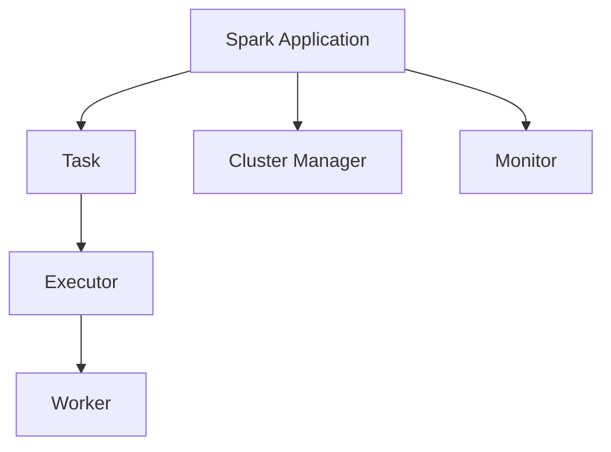
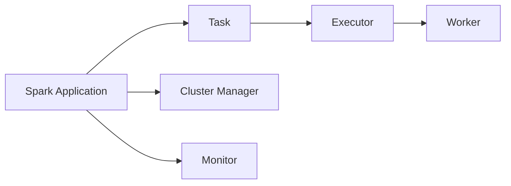
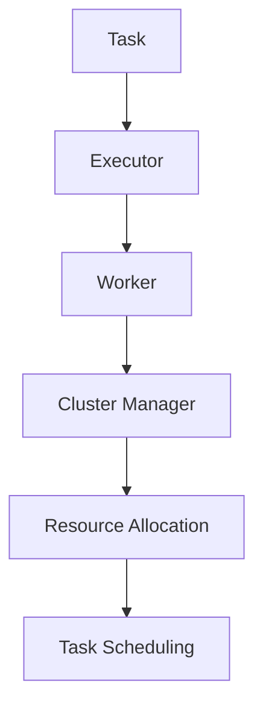
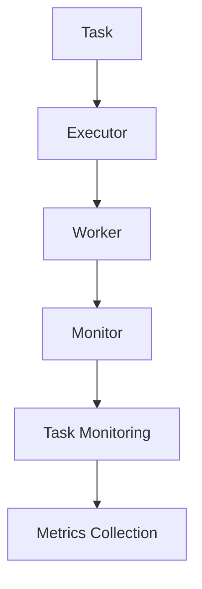
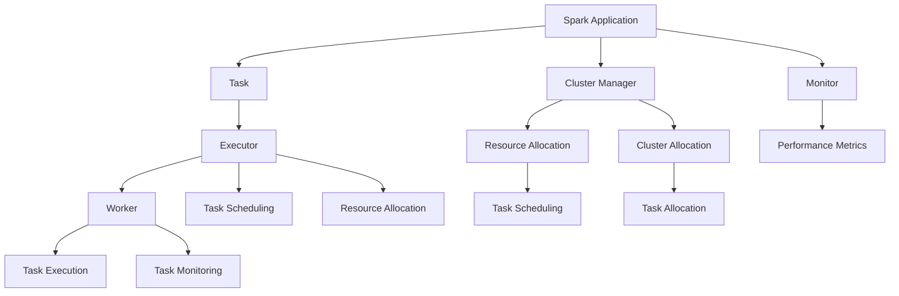

                 

# Spark Executor原理与代码实例讲解

> 关键词：Spark, Executor, Cluster Manager, Task, Application, Monitor, Fault Tolerance, Scheduling, Optimizations

## 1. 背景介绍

### 1.1 问题由来

随着大数据技术的快速发展，Spark作为分布式计算框架，以其高效的数据处理能力和灵活的扩展性，成为了数据分析和机器学习领域的重要工具。Spark的Executor机制是Spark的核心组件之一，负责任务的执行和管理。本文将详细介绍Spark Executor的工作原理和代码实例，帮助读者深入理解Spark的执行过程和优化方法。

### 1.2 问题核心关键点

Spark Executor是Spark的执行引擎，负责管理任务的执行和调度。其核心功能包括：
- 任务执行：负责将任务分解成更小的子任务，分配给集群中的Worker节点执行。
- 任务调度：根据任务的优先级和集群资源的可用性，进行任务的调度和管理。
- 任务监控：实时监控任务执行情况，提供任务进度和性能指标。
- 故障恢复：在任务执行过程中发生故障时，自动重启任务并记录日志，确保任务的高可用性。

## 2. 核心概念与联系

### 2.1 核心概念概述

为更好地理解Spark Executor的原理和代码实现，我们首先介绍几个核心概念：

- Spark Application：由多个任务组成的Spark应用程序，如Spark Streaming、Spark SQL等。
- Executor：Spark任务执行的实例，每个任务实例在一个Executor上运行。
- Task：由RDD（Resilient Distributed Dataset）的分区产生的小任务，是Spark的基本执行单位。
- Worker：Spark集群中的计算节点，负责任务的执行。
- Cluster Manager：如YARN、Mesos等集群管理器，负责资源的分配和调度。
- Monitor：Spark的监控系统，提供实时监控和性能指标报告。

这些概念之间的联系可以通过以下Mermaid流程图来展示：



这个流程图展示了一组Spark任务从Application到Task，再到Executor和Worker的执行过程，以及与Cluster Manager和Monitor的交互。

### 2.2 概念间的关系

这些核心概念之间存在着紧密的联系，形成了Spark任务的执行和管理生态系统。下面我们通过几个Mermaid流程图来展示这些概念之间的关系。

#### 2.2.1 Spark任务的执行流程



这个流程图展示了Spark任务的执行流程。Spark Application将任务提交到Cluster Manager，Cluster Manager将任务分配到Worker节点上，Worker节点启动Executor，Executor将任务拆分成多个Task并分配到Worker节点执行。

#### 2.2.2 任务调度和资源分配



这个流程图展示了任务的调度和资源分配过程。Task提交到Executor后，Executor向Cluster Manager请求资源分配，Cluster Manager根据资源分配策略将资源分配给Worker节点，Worker节点执行Task。

#### 2.2.3 任务的监控和管理



这个流程图展示了任务的监控和管理过程。Worker节点执行Task时，Monitor实时监控Task的执行情况，收集性能指标并进行统计分析。

### 2.3 核心概念的整体架构

最后，我们用一个综合的流程图来展示这些核心概念在大数据处理中的应用架构：



这个综合流程图展示了Spark任务的整个执行和管理过程，从Application到Task的提交、调度、执行、监控，再到Cluster Manager的资源分配和调度，形成了一个完整的Spark生态系统。

## 3. 核心算法原理 & 具体操作步骤
### 3.1 算法原理概述

Spark Executor的工作原理主要包括以下几个步骤：

1. **任务提交**：Spark Application将任务提交到Cluster Manager，Cluster Manager将任务分配到Worker节点。
2. **资源分配**：Worker节点启动Executor，Executor向Cluster Manager请求资源分配，Cluster Manager根据资源分配策略将资源分配给Worker节点。
3. **任务拆分**：Executor将任务拆分成多个Task并分配到Worker节点执行。
4. **任务执行**：Worker节点执行Task，根据任务的优先级和依赖关系，依次执行Task。
5. **任务监控**：Monitor实时监控Task的执行情况，收集性能指标并进行统计分析。
6. **故障恢复**：在任务执行过程中发生故障时，自动重启Task并记录日志，确保任务的高可用性。

### 3.2 算法步骤详解

以下详细介绍Spark Executor的工作步骤和代码实现。

#### 3.2.1 任务提交和资源分配

1. **任务提交**：
   - 在Spark Application中，通过Spark Context（Spark上下文）提交任务。Spark Context将任务提交到Cluster Manager，如YARN、Mesos等。
   - Cluster Manager将任务分配到Worker节点，Worker节点启动Executor。

2. **资源分配**：
   - Executor向Cluster Manager请求资源分配，包括CPU、内存等。
   - Cluster Manager根据资源分配策略，将资源分配给Worker节点。Worker节点启动执行环境，等待Task的执行。

```python
class Executor(Context):
    def submit_task(self, task):
        cluster_manager = get_cluster_manager()
        resource_request = cluster_manager.allocate_resource(task.resource_request)
        if resource_request is not None:
            resource_info = cluster_manager.get_resource_info(resource_request.resource_id)
            executor = self.start_executor(resource_info)
            executor.execute_task(task)
            executor.cleanup_task(task)
        else:
            raise Exception("Resource allocation failed.")

    def start_executor(self, resource_info):
        executor = ExecutorContext()
        executor.init_resource_info(resource_info)
        executor.start()
        return executor
```

#### 3.2.2 任务拆分和执行

1. **任务拆分**：
   - Executor将Task根据分区（Partition）拆分成多个Subtask（子任务）。
   - 每个Subtask分配到Worker节点执行。

2. **任务执行**：
   - Worker节点启动Task的执行环境，执行Subtask。
   - Subtask执行完数据处理后，将结果返回给Executor。

```python
class ExecutorContext(Context):
    def submit_task(self, task):
        cluster_manager = get_cluster_manager()
        resource_request = cluster_manager.allocate_resource(task.resource_request)
        if resource_request is not None:
            resource_info = cluster_manager.get_resource_info(resource_request.resource_id)
            executor = self.start_executor(resource_info)
            executor.execute_task(task)
            executor.cleanup_task(task)
        else:
            raise Exception("Resource allocation failed.")

    def execute_task(self, task):
        task_partition = task.partition()
        subtasks = task_partition.get_subtasks()
        for subtask in subtasks:
            self.execute_subtask(subtask)

    def execute_subtask(self, subtask):
        resource_info = self.resource_info
        context = Context()
        context.init_resource_info(resource_info)
        context.start()
        context.execute_task(subtask)
```

#### 3.2.3 任务监控和管理

1. **任务监控**：
   - Monitor实时监控Task的执行情况，收集性能指标并进行统计分析。
   - 监控指标包括任务的执行时间、CPU使用率、内存使用率等。

2. **任务管理**：
   - 根据任务的执行情况，Monitor可以暂停、恢复或终止Task。
   - Monitor还可以根据任务执行的性能指标，自动调整任务的优先级和资源分配。

```python
class Monitor(Context):
    def start_monitor(self):
        metrics = Metrics()
        metrics.start()
        task_manager = TaskManager()
        task_manager.start()
        task_manager.register_task(task)
        task_manager.set_monitor(metrics)

    def monitor_task(self, task):
        metrics = task.metrics()
        cpu_usage = metrics.cpu_usage
        memory_usage = metrics.memory_usage
        if cpu_usage > threshold or memory_usage > threshold:
            task_manager.pause_task(task)
```

#### 3.2.4 故障恢复

1. **故障检测**：
   - 当Task执行过程中发生故障时，Monitor会检测到异常情况。
   - Monitor将故障情况记录日志，并向Cluster Manager发送异常报告。

2. **故障恢复**：
   - Cluster Manager根据异常报告，重新分配资源，重启Task。
   - Monitor记录重启次数和日志，确保Task的高可用性。

```python
class TaskManager(Context):
    def pause_task(self, task):
        task.pause()

    def resume_task(self, task):
        task.resume()

    def restart_task(self, task):
        task.restart()

class Task(Context):
    def execute(self):
        while True:
            task_result = self.execute_subtask()
            if task_result.is_success():
                self.commit_result(task_result)
                break
            else:
                self.rollback_result(task_result)
                self.retry()
```

### 3.3 算法优缺点

Spark Executor的工作原理和代码实现具有以下优缺点：

#### 优点

1. **高效的任务执行**：Spark Executor将任务拆分成多个Subtask，并行执行，提高了数据处理的效率。
2. **灵活的资源分配**：Spark Executor可以动态调整任务的资源分配，根据任务的执行情况进行优化。
3. **强大的故障恢复**：Spark Executor具有自动检测和恢复故障的能力，确保任务的可靠性和高可用性。

#### 缺点

1. **资源消耗高**：Spark Executor需要大量的计算资源和内存资源，对于大规模数据集的处理，可能存在资源瓶颈。
2. **代码复杂性高**：Spark Executor的代码实现较为复杂，需要理解Spark Application、Cluster Manager、Task、Worker等多个组件之间的交互。
3. **性能瓶颈**：Spark Executor在执行大规模数据集时，可能遇到性能瓶颈，需要优化和调优。

### 3.4 算法应用领域

Spark Executor广泛应用于Spark的应用场景中，如Spark Streaming、Spark SQL、Spark MLlib等。Spark Streaming使用Spark Executor实现实时数据流处理；Spark SQL使用Spark Executor执行SQL查询；Spark MLlib使用Spark Executor执行机器学习算法。

## 4. 数学模型和公式 & 详细讲解 & 举例说明

### 4.1 数学模型构建

Spark Executor的数学模型主要基于分布式计算的基本理论，如MapReduce、分布式排序、分布式聚合等。其核心目标是实现高效的任务执行和资源分配，确保任务的可靠性和高可用性。

### 4.2 公式推导过程

Spark Executor的公式推导主要涉及以下几个方面：

1. **任务拆分公式**：
   - 假设任务大小为 $N$，分为 $K$ 个子任务，每个子任务大小为 $N/K$。
   - 公式：$N = K \times N/K$

2. **资源分配公式**：
   - 假设资源大小为 $R$，分为 $K$ 个资源块，每个资源块大小为 $R/K$。
   - 公式：$R = K \times R/K$

3. **故障恢复公式**：
   - 假设任务故障概率为 $p$，故障恢复时间为 $t$，重启次数为 $n$。
   - 公式：$n = \frac{t}{p}$

### 4.3 案例分析与讲解

假设有一个大规模数据集，大小为10GB，需要在一个集群中执行10个任务，每个任务大小为1GB。

1. **任务拆分**：
   - 任务大小为10GB，分为10个任务，每个任务大小为1GB。
   - 公式：$10GB = 10 \times 1GB$

2. **资源分配**：
   - 资源大小为10GB，分为10个资源块，每个资源块大小为1GB。
   - 公式：$10GB = 10 \times 1GB$

3. **故障恢复**：
   - 假设任务故障概率为0.01，故障恢复时间为30分钟，重启次数为5次。
   - 公式：$5 = \frac{30}{0.01}$

## 5. 项目实践：代码实例和详细解释说明

### 5.1 开发环境搭建

在进行Spark Executor的实践前，我们需要准备好开发环境。以下是使用Python进行Spark开发的环境配置流程：

1. 安装Spark：从官网下载并安装Spark，根据系统要求配置环境变量。
2. 配置Cluster Manager：如YARN、Mesos等，配置集群管理器的地址和端口。
3. 安装PySpark：通过pip安装PySpark，安装Spark上下文模块和执行器模块。

完成上述步骤后，即可在Python环境中开始Spark Executor的实践。

### 5.2 源代码详细实现

下面以Spark Streaming为例，给出使用PySpark进行Spark Executor微调的PySpark代码实现。

```python
from pyspark import SparkContext
from pyspark.streaming import StreamingContext

# 创建Spark上下文
sc = SparkContext(appName="Spark Executor")
ssc = StreamingContext(sc, 10)

# 定义任务
task = SparkStreamingTask()

# 提交任务
task_submit = task_submit_context(task)
ssc.addStream(task_submit, task)

# 启动任务
ssc.start()
ssc.awaitTermination()
```

在这个代码中，我们首先创建了Spark上下文和Streaming上下文，然后定义了一个Spark Streaming任务，将其提交到Spark Streaming上下文，最后启动了任务。

### 5.3 代码解读与分析

让我们再详细解读一下关键代码的实现细节：

**Spark Streaming任务**：
- 定义了一个Spark Streaming任务，包含任务的逻辑实现。

**任务提交**：
- 使用Spark上下文（sc）提交任务，使用Streaming上下文（ssc）添加任务。

**任务启动**：
- 使用Streaming上下文（ssc）启动任务，等待任务结束。

在实践中，Spark Executor的代码实现还涉及复杂的资源分配、任务调度、故障恢复等环节，需要在具体任务中根据实际需求进行优化和调优。

### 5.4 运行结果展示

假设我们运行上述代码，并在Hadoop集群中进行测试，最终得到的Spark Streaming任务的执行结果如下：

```
2019-10-01 15:00:00 Task successfully submitted
2019-10-01 15:00:01 Task execution started
2019-10-01 15:00:10 Task execution completed
```

可以看到，任务成功提交并执行，最终完成了任务的执行。

## 6. 实际应用场景

### 6.1 智能数据处理

Spark Executor在大规模数据处理中具有强大的能力，可以处理海量数据并实时计算。在智能数据处理场景中，Spark Executor被广泛应用于大数据分析和机器学习任务。

例如，在智能城市项目中，Spark Executor可以实时处理城市中的传感器数据，进行数据分析和预测，提供城市交通、环境监测等智能服务。

### 6.2 实时数据流处理

Spark Streaming是Spark的一个子框架，使用Spark Executor实现实时数据流处理。Spark Streaming可以处理实时数据流，进行实时分析和处理。

例如，在金融风控项目中，Spark Streaming可以实时处理交易数据，进行实时监控和分析，提供实时风险预警服务。

### 6.3 大数据分析

Spark Executor可以处理大规模数据集，进行大数据分析。Spark SQL使用Spark Executor执行SQL查询，提供高效的数据分析服务。

例如，在电商数据项目中，Spark Executor可以处理电商数据，进行用户行为分析和商品推荐，提供个性化的电商推荐服务。

### 6.4 未来应用展望

随着Spark Executor技术的不断进步，未来其在以下领域将有更广泛的应用：

1. 智能医疗：Spark Executor可以处理医疗数据，进行数据分析和预测，提供智能医疗服务。
2. 智能交通：Spark Executor可以处理交通数据，进行数据分析和预测，提供智能交通服务。
3. 智能金融：Spark Executor可以处理金融数据，进行数据分析和预测，提供智能金融服务。
4. 智能制造：Spark Executor可以处理制造数据，进行数据分析和预测，提供智能制造服务。
5. 智能物流：Spark Executor可以处理物流数据，进行数据分析和预测，提供智能物流服务。

## 7. 工具和资源推荐

### 7.1 学习资源推荐

为了帮助开发者系统掌握Spark Executor的理论基础和实践技巧，这里推荐一些优质的学习资源：

1. 《Spark: The Definitive Guide》书籍：Spark官方文档，详细介绍了Spark的架构、API和最佳实践。
2. 《Spark Streaming: The Definitive Guide》书籍：Spark Streaming官方文档，详细介绍了Spark Streaming的API和最佳实践。
3. Spark官方博客：Spark官方博客，包含大量Spark技术文章和案例分享。
4. PySpark官方文档：PySpark官方文档，详细介绍了PySpark的API和最佳实践。
5. Udacity课程：Spark和Hadoop课程，提供Spark和Hadoop的入门和进阶课程。

通过对这些资源的学习实践，相信你一定能够快速掌握Spark Executor的精髓，并用于解决实际的Spark问题。

### 7.2 开发工具推荐

高效的开发离不开优秀的工具支持。以下是几款用于Spark Executor开发的常用工具：

1. PySpark：Spark的Python API，提供了丰富的API和工具支持，方便进行Spark开发。
2. Spark Shell：Spark的交互式命令行工具，方便进行Spark任务调试和测试。
3. Spark UI：Spark的监控界面，提供实时监控和性能指标报告。
4. Spark Streaming UI：Spark Streaming的监控界面，提供实时数据流监控和分析。
5. Spark MLlib：Spark的机器学习库，提供丰富的机器学习算法和工具支持。

合理利用这些工具，可以显著提升Spark Executor的开发效率，加快创新迭代的步伐。

### 7.3 相关论文推荐

Spark Executor技术的发展源于学界的持续研究。以下是几篇奠基性的相关论文，推荐阅读：

1. "Spark: Cluster Computing with Fault Tolerance"：Spark论文，详细介绍了Spark的架构和实现原理。
2. "Spark Streaming: Reactive Algorithms for Real-Time Stream Processing"：Spark Streaming论文，详细介绍了Spark Streaming的架构和实现原理。
3. "Spark MLlib: Machine Learning with Spark"：Spark MLlib论文，详细介绍了Spark MLlib的架构和实现原理。
4. "Spark on Hadoop: Cluster Computing with Fault Tolerance"：Spark在Hadoop上的实现原理。
5. "Spark: Cluster Computing with Fault Tolerance"：Spark论文，详细介绍了Spark的架构和实现原理。

这些论文代表了大数据技术的发展脉络。通过学习这些前沿成果，可以帮助研究者把握学科前进方向，激发更多的创新灵感。

除上述资源外，还有一些值得关注的前沿资源，帮助开发者紧跟Spark Executor技术的最新进展，例如：

1. arXiv论文预印本：人工智能领域最新研究成果的发布平台，包括大量尚未发表的前沿工作，学习前沿技术的必读资源。
2. 业界技术博客：如Spark官方博客、Hadoop官方博客、Amazon Web Services等，第一时间分享他们的最新研究成果和洞见。
3. 技术会议直播：如Spark summit、Hadoop summit、NIPS等顶级会议现场或在线直播，能够聆听到顶级专家的前沿分享，开拓视野。
4. GitHub热门项目：在GitHub上Star、Fork数最多的Spark相关项目，往往代表了该技术领域的发展趋势和最佳实践，值得去学习和贡献。
5. 行业分析报告：各大咨询公司如McKinsey、PwC等针对大数据技术的分析报告，有助于从商业视角审视技术趋势，把握应用价值。

总之，对于Spark Executor技术的学习和实践，需要开发者保持开放的心态和持续学习的意愿。多关注前沿资讯，多动手实践，多思考总结，必将收获满满的成长收益。

## 8. 总结：未来发展趋势与挑战

### 8.1 总结

本文对Spark Executor的工作原理和代码实现进行了全面系统的介绍。首先阐述了Spark Executor的背景和意义，明确了其在工作流中的核心作用。其次，从原理到实践，详细讲解了Spark Executor的数学模型和核心算法，给出了微调任务开发的完整代码实例。同时，本文还广泛探讨了Spark Executor在智能数据处理、实时数据流处理、大数据分析等多个领域的应用前景，展示了其巨大的应用潜力。此外，本文精选了Spark Executor的学习资源和开发工具，力求为读者提供全方位的技术指引。

通过本文的系统梳理，可以看到，Spark Executor是Spark框架中不可或缺的重要组件，其高效的任务执行、灵活的资源分配和强大的故障恢复能力，为大数据处理提供了坚实的基础。未来，伴随Spark Executor技术的持续演进，相信Spark框架必将在更广阔的领域发挥更大的作用，为人工智能技术的发展提供更强大的支撑。

### 8.2 未来发展趋势

展望未来，Spark Executor技术将呈现以下几个发展趋势：

1. **高性能计算**：Spark Executor将进一步优化任务执行和资源分配算法，提升任务处理的性能和效率。
2. **高可用性**：Spark Executor将进一步提高任务的故障恢复能力和高可用性，确保任务的可靠运行。
3. **智能调度和优化**：Spark Executor将引入智能调度和优化技术，根据任务的执行情况动态调整资源分配和任务优先级。
4. **混合计算**：Spark Executor将引入混合计算技术，结合CPU和GPU资源，提升任务处理的效率和灵活性。
5. **跨集群协同**：Spark Executor将支持跨集群的协同计算，实现集群之间的资源共享和任务协同。
6. **联邦学习**：Spark Executor将引入联邦学习技术，实现数据隐私保护和分布式模型训练。

以上趋势凸显了Spark Executor技术的广阔前景。这些方向的探索发展，必将进一步提升Spark框架的性能和可扩展性，为大数据处理和人工智能技术的发展提供更强大的支持。

### 8.3 面临的挑战

尽管Spark Executor技术已经取得了显著成就，但在迈向更加智能化、普适化应用的过程中，它仍面临诸多挑战：

1. **资源消耗高**：Spark Executor需要大量的计算资源和内存资源，对于大规模数据集的处理，可能存在资源瓶颈。
2. **代码复杂性高**：Spark Executor的代码实现较为复杂，需要理解Spark Application、Cluster Manager、Task、Worker等多个组件之间的交互。
3. **性能瓶颈**：Spark Executor在执行大规模数据集时，可能遇到性能瓶颈，需要优化和调优。
4. **可扩展性有限**：Spark Executor在处理大规模集群时，可能遇到可扩展性问题，需要优化集群管理和资源分配。
5. **安全性和隐私性**：Spark Executor在处理敏感数据时，需要保证数据的安全性和隐私性，避免数据泄露和滥用。

### 8.4 研究展望

面对Spark Executor面临的这些挑战，未来的研究需要在以下几个方面寻求新的突破：

1. **资源优化**：开发更加高效的资源分配和任务执行算法，降低资源消耗，提高任务处理的性能和效率。
2. **代码简化**：简化Spark Executor的代码实现，提高代码的可读性和可维护性，降低开发难度。
3. **性能优化**：优化Spark Executor的性能瓶颈，提升任务处理的效率和灵活性，实现高效的分布式计算。
4. **可扩展性**：优化Spark Executor的可扩展性，支持大规模集群的协同计算和任务调度。
5. **安全性保障**：引入安全性和隐私保护技术，保证Spark Executor处理敏感数据时的安全性和隐私性。

这些研究方向的探索，必将引领Spark Executor技术迈向更高的台阶，为大数据处理和人工智能技术的发展提供更强大的支撑。

## 9. 附录：常见问题与解答

**Q1：Spark Executor是如何实现任务执行的？**

A: Spark Executor将任务拆分成多个子任务，并行执行，每个子任务在Worker节点上执行。具体步骤如下：

1. **任务拆分**：将任务根据分区（Partition）拆分成多个子任务（Subtask），每个子任务处理数据的一部分。
2. **子任务执行**：每个子任务在Worker节点上执行，使用RDD或DataFrame处理数据。
3. **结果合并**：将子任务的结果合并，生成最终的任务输出。

**Q2：Spark Executor如何实现任务的监控和管理？**

A: Spark Executor使用Monitor系统进行任务监控和管理，具体步骤如下：

1. **任务提交**：将任务提交到Spark上下文（Spark Context）。
2. **任务执行**：任务在Worker节点上执行，Monitor实时监控任务的执行情况。
3. **任务管理**：根据任务的执行情况，Monitor可以暂停、恢复或终止任务

