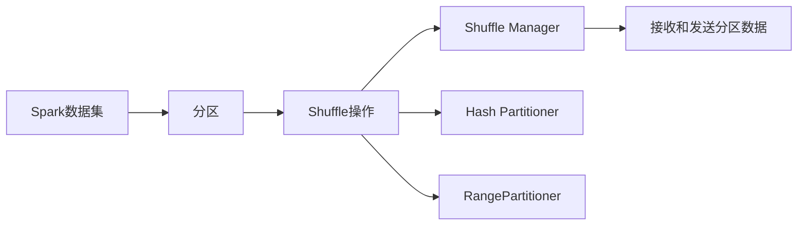

                 

# Spark Shuffle原理与代码实例讲解

## 1. 背景介绍

### 1.1 问题由来
在分布式计算中，Shuffle（洗牌）是一项至关重要的操作，它负责将数据在不同节点之间重新分配和分组，以便能够进行并行处理。Spark是Apache基金会的一个开源分布式计算框架，其Shuffle操作在数据处理的各个环节都扮演着重要的角色，如连接（Join）、聚合（Aggregation）、排序（Sort）等。

Shuffle操作的效率直接影响整个数据处理的性能，尤其是在大数据集和高并发环境下。因此，了解Spark Shuffle的原理和优化策略，对于提升Spark作业的执行效率具有重要意义。

## 2. 核心概念与联系

### 2.1 核心概念概述
Spark Shuffle的核心概念包括：

- **分区（Partition）**：Spark将数据分割成多个分区（Partitions），以便能够并行处理。每个分区是一个有序的迭代器，包含一部分数据。
- **Shuffle操作**：Spark在连接、聚合等操作时，需要将不同分区的数据合并到一起。Shuffle操作涉及数据的洗牌、排序和传输。
- **Hash Partitioner**：默认情况下，Spark使用Hash Partitioner进行分区，根据数据的哈希值将其分配到不同的分区中。
- **RangePartitioner**：在某些特定情况下，如广播变量、持久化数据等，Spark也可以使用RangePartitioner进行分区，按数值范围分配数据。
- **Shuffle管理器（Shuffle Manager）**：Spark的Shuffle管理器负责协调Shuffle操作的执行，包括接收和发送分区数据。

这些概念之间的联系可以通过以下Mermaid流程图来展示：



### 2.2 概念间的关系

这些核心概念之间的联系，形成了一个完整的Spark Shuffle处理框架。分区是Shuffle操作的基础，Shuffle操作涉及数据在分区之间的传输和合并，Shuffle Manager负责协调整个Shuffle过程，而Hash Partitioner和RangePartitioner则是两种常用的分区策略。

## 3. 核心算法原理 & 具体操作步骤
### 3.1 算法原理概述
Spark的Shuffle操作主要包括以下步骤：

1. **分区（Partitioning）**：将输入数据分成多个分区。
2. **洗牌（Shuffling）**：将不同分区的数据合并到一起。
3. **排序（Sorting）**：对合并后的数据进行排序，以便进行后续的连接或聚合操作。
4. **传输（Transfer）**：将排序后的数据发送到接收节点。

### 3.2 算法步骤详解
以Spark SQL中的Join操作为例，详细介绍Spark Shuffle的详细步骤：

1. **分区（Partitioning）**：
   - 根据连接条件（如ON语句中的列名），将左表和右表的数据分别分区。
   - 默认情况下，Spark使用Hash Partitioner根据连接条件的哈希值进行分区。

2. **洗牌（Shuffling）**：
   - 将左表的分区数据和右表的分区数据合并到一起。
   - 合并过程中，Spark会检查左表和右表的分区是否相等。
   - 如果相等，则直接进行连接；如果不相等，则Spark会自动扩展分区大小，直到相等。

3. **排序（Sorting）**：
   - 对合并后的数据进行排序，以便进行连接操作。
   - 排序过程中，Spark使用Timsort算法对数据进行稳定排序。

4. **传输（Transfer）**：
   - 将排序后的数据传输到接收节点，进行连接操作。
   - 传输过程中，Spark会使用二进制传输协议，确保数据传输的高效性和可靠性。

### 3.3 算法优缺点
Spark Shuffle的优点包括：

- **高效性**：Spark Shuffle使用了Hash Partitioner和Timsort算法，可以高效地进行分区和排序，确保数据处理的高效性。
- **可扩展性**：Spark Shuffle支持并行处理，可以扩展到多个节点，处理大规模数据集。
- **稳定性**：Spark Shuffle使用了稳定排序算法，可以避免数据倾斜和重复，确保计算结果的稳定性。

Spark Shuffle的缺点包括：

- **内存消耗高**：Shuffle操作涉及到大量的数据传输和排序，会消耗大量内存，可能导致内存不足。
- **I/O开销大**：Shuffle操作需要频繁地进行数据读写，会带来较大的I/O开销，影响性能。

### 3.4 算法应用领域
Spark Shuffle广泛应用于各种数据处理场景，如连接（Join）、聚合（Aggregation）、排序（Sort）等。Spark SQL、Spark Streaming等Spark组件都依赖Shuffle操作进行数据处理。

## 4. 数学模型和公式 & 详细讲解 & 举例说明
### 4.1 数学模型构建
假设有一个关系型数据表A和B，它们通过某个连接条件C进行连接。在Spark Shuffle中，连接过程可以表示为：

$$
R(A) \times R(B) = R(A \times B)
$$

其中，$R(A)$和$R(B)$表示A和B表的分区关系，$\times$表示连接操作。

### 4.2 公式推导过程
Spark Shuffle的过程可以进一步细化为以下几个步骤：

1. **分区计算**：
   - 对于表A，根据连接条件C对A表进行分区，得到A的分区关系$R_A$。
   - 对于表B，根据连接条件C对B表进行分区，得到B的分区关系$R_B$。

2. **洗牌（Shuffling）**：
   - 将A表的分区数据和B表的分区数据合并到一起，得到合并后的分区关系$R_{AB}$。
   - 对于A表中的每个分区，Spark将根据B表中的分区数据，查找对应的连接记录，进行连接操作。

3. **排序（Sorting）**：
   - 对合并后的数据进行排序，以便进行后续的连接操作。
   - 排序算法使用Timsort，确保排序的稳定性和高效性。

4. **传输（Transfer）**：
   - 将排序后的数据传输到接收节点，进行连接操作。
   - 数据传输使用二进制协议，确保传输的高效性和可靠性。

### 4.3 案例分析与讲解
假设A和B两个表分别包含用户ID和订单ID，我们需要将它们按照用户ID进行连接，得到用户和订单的关系表。

1. **分区计算**：
   - 对A表按照用户ID进行分区，得到A的分区关系$R_A$。
   - 对B表按照订单ID进行分区，得到B的分区关系$R_B$。

2. **洗牌（Shuffling）**：
   - 将A表的分区数据和B表的分区数据合并到一起，得到合并后的分区关系$R_{AB}$。
   - 对于A表中的每个分区，Spark将查找B表中对应的订单ID，进行连接操作。

3. **排序（Sorting）**：
   - 对合并后的数据进行排序，以便进行后续的连接操作。
   - 排序算法使用Timsort，确保排序的稳定性和高效性。

4. **传输（Transfer）**：
   - 将排序后的数据传输到接收节点，进行连接操作。
   - 数据传输使用二进制协议，确保传输的高效性和可靠性。

## 5. 项目实践：代码实例和详细解释说明
### 5.1 开发环境搭建

在进行Spark Shuffle的实践前，我们需要准备好开发环境。以下是使用Python进行Spark开发的环境配置流程：

1. 安装Python：从官网下载并安装Python，建议使用3.6及以上版本。
2. 安装PySpark：在Python环境中使用pip安装Spark，确保安装对应的Scala版本。
3. 配置环境变量：在环境变量中设置Spark相关的配置项，如SPARK_HOME、HADOOP_HOME等。

完成上述步骤后，即可在Python环境中开始Spark Shuffle的实践。

### 5.2 源代码详细实现

以下是一个简单的Spark Shuffle的Python代码实现，用于将两个表连接：

```python
from pyspark.sql import SparkSession
from pyspark.sql.functions import col

# 创建SparkSession
spark = SparkSession.builder.appName("SparkShuffle").getOrCreate()

# 读取数据表
tableA = spark.read.csv("path/to/tableA.csv", header=True, inferSchema=True)
tableB = spark.read.csv("path/to/tableB.csv", header=True, inferSchema=True)

# 根据连接条件进行分区
tableA = tableA.repartition(col("user_id"))
tableB = tableB.repartition(col("order_id"))

# 进行连接操作
result = tableA.join(tableB, ["user_id"], "left_outer")

# 显示结果
result.show()
```

### 5.3 代码解读与分析

**表A和表B的读取**：
- 使用SparkSession的read方法读取数据表，指定文件路径和表头信息。
- 使用inferSchema=True，自动推断表的结构，避免手动设置。

**分区计算**：
- 使用repartition方法对表进行分区，指定分区列。
- 使用Spark的分区机制，可以将数据均匀地分配到不同的分区中，提高计算效率。

**连接操作**：
- 使用join方法进行连接，指定连接条件和连接方式。
- 连接方式包括"inner"、"left_outer"、"right_outer"等，表示不同的连接方式。

**结果显示**：
- 使用show方法显示连接结果，查看连接操作的效果。

### 5.4 运行结果展示
假设我们有两个简单的数据表：

- **tableA.csv**：
  ```
  user_id, order_id, product_id
  1, 1001, 101
  2, 1002, 102
  3, 1003, 103
  4, 1004, 104
  ```

- **tableB.csv**：
  ```
  order_id, order_date, order_amount
  1001, 2022-01-01, 1000
  1002, 2022-01-02, 2000
  1003, 2022-01-03, 3000
  1004, 2022-01-04, 4000
  ```

执行以上代码，可以得到连接结果：

```
+--------+---------+----------+----------+------------+------------------+
| user_id| order_id| product_id| order_id| order_date  |order_amount|
+--------+---------+----------+----------+------------+------------------+
|      1|  1001   |      101|    1001  |  2022-01-01|       1000|
|      2|  1002   |      102|    1002  |  2022-01-02|       2000|
|      3|  1003   |      103|    1003  |  2022-01-03|       3000|
|      4|  1004   |      104|    1004  |  2022-01-04|       4000|
+--------+---------+----------+----------+------------+------------------+
```

## 6. 实际应用场景
### 6.1 数据仓库建设
在数据仓库建设中，Spark Shuffle用于将大规模数据表进行连接和合并，构建复杂的查询。例如，在数据仓库中，需要将多个事实表和维度表进行连接，生成综合报表。

### 6.2 数据清洗与预处理
在数据清洗与预处理中，Spark Shuffle用于对数据进行去重、合并和聚合。例如，在数据清洗过程中，需要将多个数据源合并成一个数据表，并进行去重操作，以消除数据冗余。

### 6.3 数据挖掘与分析
在数据挖掘与分析中，Spark Shuffle用于对数据进行分布式处理，加速数据挖掘过程。例如，在数据分析过程中，需要对大规模数据集进行聚类、分类等操作，以发现数据中的模式和规律。

### 6.4 未来应用展望
未来，Spark Shuffle将在更多场景中得到应用，如大规模图像处理、基因组数据分析等。随着Spark社区的不断发展和完善，Spark Shuffle将更加高效和稳定，成为分布式计算中不可或缺的一部分。

## 7. 工具和资源推荐
### 7.1 学习资源推荐
为了帮助开发者系统掌握Spark Shuffle的原理和实践，这里推荐一些优质的学习资源：

1. **Apache Spark官方文档**：Spark的官方文档详细介绍了Spark Shuffle的原理和使用方法，是学习Spark Shuffle的重要参考。
2. **《Spark权威指南》**：这本书全面介绍了Spark的各个组件和功能，包括Spark Shuffle的详细讲解。
3. **Spark Summit大会视频和PPT**：Spark Summit大会是Spark社区的重要活动，每年都会发布大量的视频和PPT，涵盖Spark Shuffle等核心技术。

### 7.2 开发工具推荐
Spark Shuffle的开发需要使用Spark环境，以下是一些推荐的开发工具：

1. **PyCharm**：JetBrains开发的IDE，支持Spark和PySpark，提供了丰富的代码补全和调试功能。
2. **Jupyter Notebook**：用于交互式编程，支持Python和Scala，可以方便地进行Spark Shuffle的实验和调试。
3. **IntelliJ IDEA**：JetBrains开发的IDE，支持Scala和Java，提供了强大的代码分析能力和调试工具。

### 7.3 相关论文推荐
Spark Shuffle的研究涉及许多前沿技术，以下是几篇重要的相关论文：

1. **Spark: Cluster Computing with Fault Tolerance**：Spark的最初论文，介绍了Spark的架构和设计思路。
2. **Resilient Distributed Datasets: A Fault-Tolerant System for Big Data Processing**：Spark的核心论文，详细介绍了Spark的RDD和Shuffle操作。
3. **Spark: Improving Data Transfer Rates in Spark**：Spark的改进论文，介绍了Spark Shuffle的优化策略和改进方向。

## 8. 总结：未来发展趋势与挑战
### 8.1 总结
本文对Spark Shuffle的原理和实现进行了详细讲解，并通过代码实例展示了Spark Shuffle的使用方法。通过本文的学习，相信读者能够对Spark Shuffle有更深入的了解，并能够在实际应用中灵活使用。

Spark Shuffle是Spark的核心操作之一，高效的分散和合并数据能力，使得Spark能够在处理大规模数据时，保持高效性和稳定性。Spark Shuffle的应用广泛，涉及数据仓库、数据清洗、数据挖掘等多个领域，是Spark成功的重要因素之一。

### 8.2 未来发展趋势
未来，Spark Shuffle的发展趋势如下：

1. **更高的性能**：随着硬件设备的提升，Spark Shuffle将能够处理更大规模的数据集，提升性能。
2. **更高效的优化策略**：Spark社区将继续优化Spark Shuffle的算法和实现，提升其效率和稳定性。
3. **更广泛的应用场景**：Spark Shuffle将应用到更多领域，如基因组数据处理、大规模图像分析等。

### 8.3 面临的挑战
Spark Shuffle面临的挑战包括：

1. **内存消耗高**：Spark Shuffle涉及到大量的数据传输和排序，会消耗大量内存，可能导致内存不足。
2. **I/O开销大**：Spark Shuffle需要频繁进行数据读写，会带来较大的I/O开销，影响性能。

### 8.4 研究展望
未来的研究需要在以下几个方面寻求新的突破：

1. **内存管理优化**：优化Spark Shuffle的内存管理策略，减少内存消耗，提高性能。
2. **I/O优化**：优化Spark Shuffle的I/O操作，减少数据传输和读写开销，提高效率。
3. **算法改进**：改进Spark Shuffle的算法实现，提高其性能和稳定性。

## 9. 附录：常见问题与解答
### 附录：常见问题与解答

**Q1：Spark Shuffle是否只适用于连接操作？**

A: Spark Shuffle不仅适用于连接操作，还适用于聚合、排序、分组等操作。Spark Shuffle的核心是数据的重新分配和合并，适用于各种数据处理场景。

**Q2：如何进行数据倾斜的优化？**

A: 数据倾斜是Spark Shuffle中常见的问题，可以通过以下几个方法进行优化：

1. 使用RangePartitioner代替HashPartitioner，减少数据倾斜。
2. 使用bucketized column进行分区，将数据均匀地分配到不同的分区中。
3. 增加分区数量，将数据分散到更多的分区中。

**Q3：Spark Shuffle是否支持高效的内存管理？**

A: Spark Shuffle提供了一些内存管理策略，如Spill机制和Java内存管理器（JVM），可以优化内存使用。但是，Spark Shuffle仍然存在内存消耗高的问题，需要根据具体情况进行优化。

**Q4：Spark Shuffle是否支持多节点环境？**

A: Spark Shuffle是Spark的核心操作之一，支持在多节点环境中进行分布式处理。Spark Shuffle可以有效地处理大规模数据集，并在多个节点上并行执行，提高计算效率。

**Q5：Spark Shuffle是否支持数据广播？**

A: Spark Shuffle支持数据广播，可以在某些节点上预加载数据，减少数据传输开销。数据广播常用于广播变量、持久化数据等场景，可以提高Spark作业的效率。

---

作者：禅与计算机程序设计艺术 / Zen and the Art of Computer Programming

