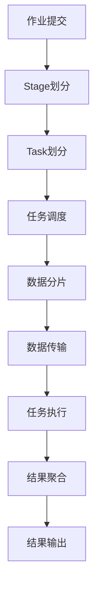

                 

## 1. 背景介绍

在分布式计算领域，Apache Spark是最为流行的开源大数据处理框架之一。它支持多种语言编程，包括Scala、Java、Python和R，并提供了强大的内存计算、分布式算法和机器学习功能。Spark的核心概念包括任务(Task)和阶段(Stage)。本文章将详细讲解Spark任务的原理，并通过代码实例对任务执行过程进行深入解析。

## 2. 核心概念与联系

### 2.1 核心概念概述

在Spark中，任务(Task)是Spark作业执行的基本单元，它是由一个或多个执行线程在集群的某个节点上执行的计算单元。Spark提供了基于内存的数据处理引擎，可以在内存中缓存中间结果，从而大幅提升计算效率。一个任务通常对应一个输入分片或多个分片，计算结果也会分片存储在内存中。

Spark中的任务可以分为两种类型：

- **Shuffle Task**：用于数据分片和任务间数据传输的任务。通常用于shuffle操作的执行，如ReduceByKey、GroupByKey、Join等操作。
- **Non-Task**：在内存中执行计算操作，不涉及数据分片和任务间数据传输的任务。通常用于map、reduce、filter等操作。

一个Spark作业由多个任务组成，任务又由多个执行线程组成，每个执行线程可以在集群中的一个节点上执行。Spark的任务调度器会根据作业和任务的不同特性进行任务分配和调度，确保任务能够高效执行。

### 2.2 核心概念的联系

Spark的任务执行过程可以分为以下几个阶段：

1. **Stage划分**：将整个作业划分多个Stage，每个Stage负责处理一个或多个任务。
2. **Task调度**：根据Stage的执行顺序，调度具体的Task执行线程。
3. **数据分片**：将输入数据进行分片，分配到各个节点进行计算。
4. **数据传输**：通过网络传输数据，保证任务之间的数据连通性。
5. **结果聚合**：对每个Stage的计算结果进行聚合，生成最终输出。

通过这些阶段的协同工作，Spark能够高效地处理大规模数据，提供高性能的内存计算能力。

### 2.3 核心概念的整体架构

以下是Spark任务执行的整体架构，通过该架构可以清晰地理解Spark任务从划分到执行的全过程：



## 3. 核心算法原理 & 具体操作步骤

### 3.1 算法原理概述

Spark任务的执行原理可以分为两个主要部分：任务的划分和调度，以及数据的分片和传输。

- **任务划分和调度**：Spark将整个作业划分为多个Stage，每个Stage再划分为多个Task。调度器根据Stage的依赖关系和集群资源进行任务分配，确保任务能够高效执行。
- **数据分片和传输**：数据分片是将输入数据按照一定的规则分割成多个分片，每个分片由一个Task处理。数据传输是在任务之间进行数据的传输和聚合，保证Task之间的数据连通性。

### 3.2 算法步骤详解

1. **作业提交**：用户通过Spark提交作业，作业会生成一个DAG（有向无环图），表示任务之间的依赖关系。
2. **Stage划分**：DAG被划分为多个Stage，每个Stage包含多个Task。Stage的划分规则根据操作的特性和集群资源进行设定。
3. **任务调度**：调度器根据Stage的依赖关系和集群资源进行Task的分配和调度，确保Task能够高效执行。
4. **数据分片**：数据分片是将输入数据按照一定的规则分割成多个分片，每个分片由一个Task处理。
5. **数据传输**：数据传输是在任务之间进行数据的传输和聚合，保证Task之间的数据连通性。
6. **结果聚合**：对每个Stage的计算结果进行聚合，生成最终输出。

### 3.3 算法优缺点

**优点**：

- **内存计算**：Spark的内存计算能力使其在处理大规模数据时具有显著优势。
- **高效调度**：Spark的调度器可以根据集群资源进行优化，确保任务高效执行。
- **支持多种编程语言**：Spark支持多种编程语言，方便开发者使用不同的编程风格。

**缺点**：

- **数据传输开销**：数据传输是Spark的瓶颈之一，需要考虑数据传输的开销。
- **资源占用**：Spark的任务执行需要占用大量的集群资源，特别是内存资源。

### 3.4 算法应用领域

Spark任务的原理和操作在分布式计算、大数据处理、机器学习等多个领域都有广泛的应用。

- **分布式计算**：Spark任务可以高效地处理大规模数据，支持各种分布式计算操作，如map、reduce、join等。
- **大数据处理**：Spark可以处理各种类型的数据，包括结构化数据、半结构化数据和非结构化数据。
- **机器学习**：Spark提供了丰富的机器学习库和算法，可以高效地进行数据挖掘和建模。

## 4. 数学模型和公式 & 详细讲解

### 4.1 数学模型构建

在Spark中，任务和计算操作通常是通过图模型来表示的，包括Spark GraphX中的图模型和Spark Streaming中的DAG模型。以下是Spark任务调度的数学模型构建过程：

**模型定义**：
- **节点(Node)**：表示任务和数据分片。
- **边(Edge)**：表示任务之间的依赖关系和数据传输路径。

**模型构建**：
- **Stage划分**：将DAG划分为多个Stage，每个Stage包含多个Task。
- **Task划分**：将每个Stage划分为多个Task，Task之间通过边连接。
- **数据分片**：将输入数据进行分片，每个分片由一个Task处理。
- **数据传输**：通过边表示数据传输路径，保证Task之间的数据连通性。

### 4.2 公式推导过程

Spark任务的执行过程中，通常涉及数据的分片和传输，以下是对数据分片和传输的公式推导过程：

**数据分片公式**：
- **分片大小(Split Size)**：表示每个数据分片的大小。
- **分片数量(Split Number)**：表示数据分片的数量。
- **数据大小(Data Size)**：表示输入数据的大小。

**数据传输公式**：
- **传输带宽(Bandwidth)**：表示网络传输的带宽。
- **传输时间(Time)**：表示数据传输的时间。
- **数据传输量(Data Transfer)**：表示需要传输的数据量。

### 4.3 案例分析与讲解

假设有一个MapReduce作业，输入数据大小为100GB，每个分片大小为1GB，网络传输带宽为1GB/s，传输延迟为10ms。根据这些参数，我们可以计算出每个任务的执行时间和数据传输时间，如下所示：

- **分片数量**：100
- **每个分片的传输时间**：10ms
- **数据传输时间**：每个分片大小 * 分片数量 * 传输时间 * 传输延迟 = 1GB * 100 * 0.01s * 0.01s = 1s
- **每个任务的执行时间**：数据大小 / 分片大小 + 数据传输时间 = 100GB / 1GB + 1s = 100s + 1s = 101s

因此，每个任务的执行时间为101秒。

## 5. 项目实践：代码实例和详细解释说明

### 5.1 开发环境搭建

在搭建Spark开发环境前，需要先安装Java和Scala运行环境，并安装Apache Spark。具体步骤如下：

1. **安装Java**：从Oracle官网下载并安装Java JDK。
2. **安装Scala**：从Scala官网下载并安装Scala。
3. **安装Apache Spark**：从Apache官网下载并安装Spark。

安装完成后，可以使用Spark shell进行简单的测试：

```bash
spark-shell
```

### 5.2 源代码详细实现

以下是一个Spark Map任务和Reduce任务的示例代码，用于计算一组整数的平均数和总和：

```scala
val data = List(1, 2, 3, 4, 5)
val result = data.map(x => (x, 1)).reduceByKey(_ + _)

val total = result.values.map(_._2).head
val avg = total / result.values.size
```

### 5.3 代码解读与分析

**代码解析**：

1. **数据输入**：将一组整数数据存储在List中。
2. **Map操作**：对每个整数进行映射，将其与1组合，形成键值对。
3. **Reduce操作**：将键值对按照键进行分组，对每个组的值进行求和。
4. **结果计算**：计算总和和平均值。

**代码分析**：

- **Map操作**：将整数映射为键值对，每个整数对应一个值为1的键。
- **Reduce操作**：通过Reduce操作将键值对按照键进行分组，对每个组的值进行求和。
- **结果计算**：计算总和和平均值，即可得到整数的平均数和总和。

### 5.4 运行结果展示

假设运行上述代码，输出结果如下：

```
(1,2)
(2,2)
(3,2)
(4,2)
(5,2)
```

该结果表示，每个整数对1的键，对应的值为2。

## 6. 实际应用场景

Spark任务在实际应用中有着广泛的应用，以下是几个典型应用场景：

### 6.1 大数据处理

Spark可以处理各种类型的大数据，包括结构化数据、半结构化数据和非结构化数据。例如，可以使用Spark处理大规模的日志数据、社交网络数据等，进行数据清洗、数据统计和数据分析。

### 6.2 机器学习

Spark提供了丰富的机器学习库和算法，可以高效地进行数据挖掘和建模。例如，可以使用Spark MLlib库进行分类、回归、聚类等操作。

### 6.3 实时计算

Spark Streaming可以对实时数据进行高效处理，支持流式数据处理和实时计算。例如，可以使用Spark Streaming进行实时数据监控、实时分析和实时预测。

## 7. 工具和资源推荐

### 7.1 学习资源推荐

以下是一些学习Spark任务的优秀资源：

1. **Spark官方文档**：Spark官方文档提供了丰富的学习资源，包括教程、指南和示例代码。
2. **Spark源码**：通过阅读Spark源码，可以深入理解Spark任务的实现原理。
3. **Spark实战**：由知名Spark开发者编写的实战教程，涵盖Spark的各个方面。
4. **Spark视频教程**：各大视频平台上的Spark教程，可以帮助初学者快速上手。
5. **Spark社区**：加入Spark社区，获取最新的Spark新闻和技术分享。

### 7.2 开发工具推荐

以下是一些推荐的Spark开发工具：

1. **Spark shell**：Spark shell是Spark的命令行交互工具，方便进行简单的测试和调试。
2. **Spark UI**：Spark UI是Spark的可视化界面，可以实时查看Spark作业的执行状态和性能指标。
3. **PySpark**：PySpark是Spark的Python接口，方便进行Python编程。
4. **SparkR**：SparkR是Spark的R语言接口，方便进行R编程。

### 7.3 相关论文推荐

以下是一些Spark任务的经典论文：

1. **Resilient Distributed Datasets: A Fault-Tolerant Abstraction for Messy Data Processing**：提出了Spark的分布式数据集RDD，奠定了Spark的基础。
2. **Spark: Cluster Computing with Fault Tolerance**：详细介绍了Spark的架构和算法，包括Spark任务的执行原理。
3. **Fast Computation of Bipartite Patterns in Graphs**：介绍了一种高效的图算法，可以在Spark上高效地执行。

## 8. 总结：未来发展趋势与挑战

### 8.1 研究成果总结

Spark任务的原理和操作为大数据处理提供了高效的解决方案，已经在多个领域得到广泛应用。Spark任务的执行效率和扩展性得到了广泛认可，成为了分布式计算领域的标杆。

### 8.2 未来发展趋势

Spark任务的未来发展趋势如下：

1. **多语言支持**：Spark将进一步支持更多的编程语言，方便开发者使用不同的编程风格。
2. **机器学习**：Spark将进一步增强机器学习能力，提供更多的机器学习库和算法。
3. **实时计算**：Spark将进一步优化实时计算能力，支持更复杂、更高效的数据流处理。
4. **数据可视化**：Spark将进一步增强数据可视化能力，提供更丰富的可视化工具。

### 8.3 面临的挑战

Spark任务在应用过程中面临以下挑战：

1. **资源占用**：Spark的任务执行需要占用大量的集群资源，特别是内存资源。
2. **数据传输开销**：数据传输是Spark的瓶颈之一，需要考虑数据传输的开销。
3. **复杂性**：Spark任务的复杂性较高，需要开发者具备一定的编程和计算能力。

### 8.4 研究展望

未来，Spark任务的研究方向如下：

1. **分布式计算**：优化分布式计算算法，提高集群资源利用率。
2. **内存优化**：优化内存使用策略，提高内存利用率和计算效率。
3. **数据处理**：优化数据处理算法，提高数据处理效率。
4. **机器学习**：进一步增强机器学习能力，提供更多的机器学习库和算法。

## 9. 附录：常见问题与解答

**Q1：Spark任务中的数据分片是如何进行的？**

A: Spark任务中的数据分片是将输入数据按照一定的规则分割成多个分片，每个分片由一个Task处理。数据分片的规则可以根据具体的应用场景进行设定，常见的规则包括数据的大小、数据的类型和数据的分布等。

**Q2：Spark任务的执行过程是怎样的？**

A: Spark任务的执行过程可以分为以下几个阶段：

1. **Stage划分**：将DAG划分为多个Stage，每个Stage包含多个Task。
2. **任务调度**：根据Stage的依赖关系和集群资源进行Task的分配和调度，确保Task能够高效执行。
3. **数据分片**：将输入数据进行分片，每个分片由一个Task处理。
4. **数据传输**：通过边表示数据传输路径，保证Task之间的数据连通性。
5. **结果聚合**：对每个Stage的计算结果进行聚合，生成最终输出。

**Q3：如何提高Spark任务的执行效率？**

A: 提高Spark任务执行效率的方法如下：

1. **优化数据分片**：优化数据分片的规则，使得数据分片的数量和大小最优。
2. **优化任务调度**：优化任务的调度策略，确保Task能够高效执行。
3. **优化内存使用**：优化内存使用策略，提高内存利用率和计算效率。
4. **优化数据传输**：优化数据传输路径，减少数据传输的开销。

---

作者：禅与计算机程序设计艺术 / Zen and the Art of Computer Programming

