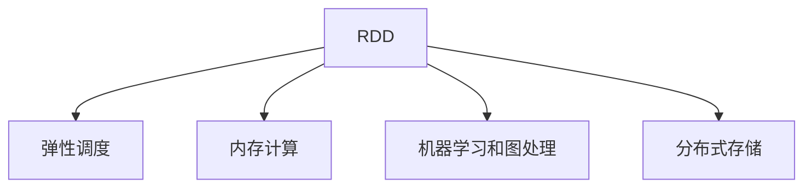
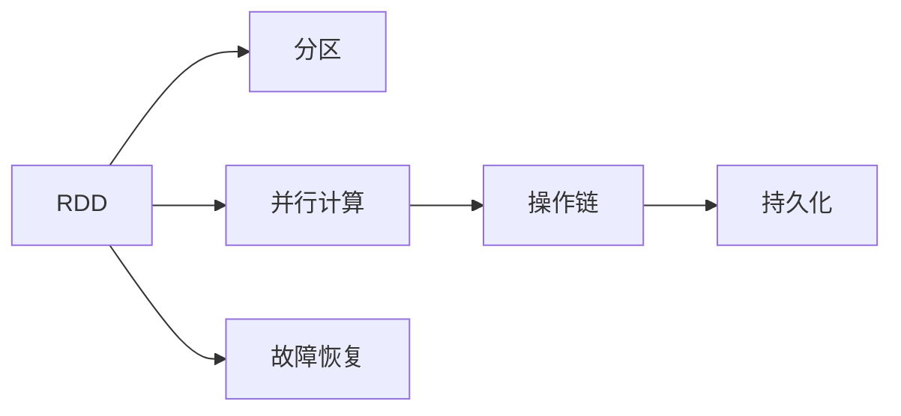
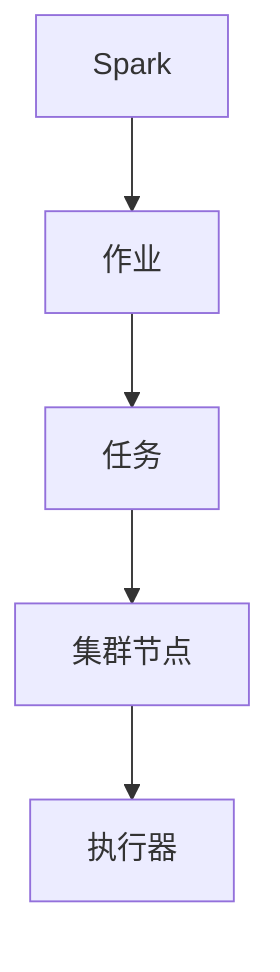
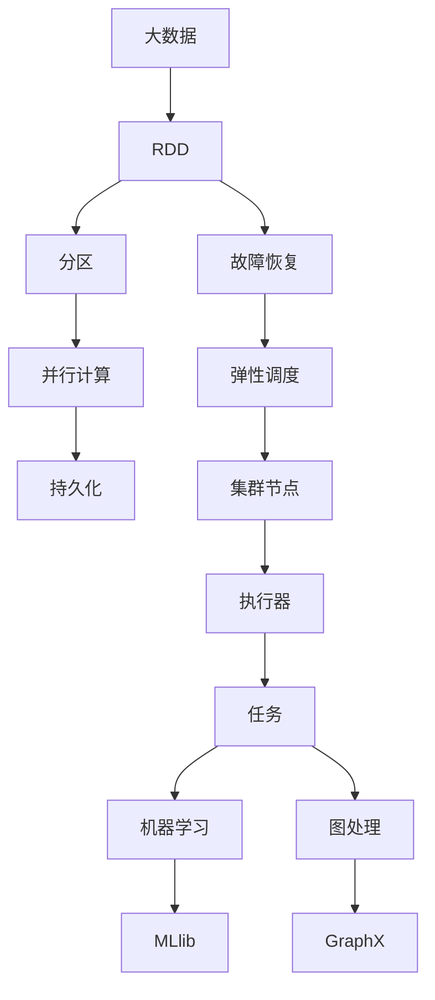

                 

# Spark原理与代码实例讲解

> 关键词：Spark, 分布式计算, 内存计算, 弹性调度, 数据处理, RDD, 弹性分布式数据集, 机器学习, 图处理, 大数据分析

## 1. 背景介绍

### 1.1 问题由来

随着互联网技术的飞速发展，数据的产生和存储量呈指数级增长。为了有效处理海量数据，分布式计算系统逐渐成为主流。Apache Spark是当下最为流行的分布式计算框架之一，它支持内存计算、弹性调度、大规模数据处理等多种能力，并广泛应用于大数据分析、机器学习、图处理等领域。

然而，Spark的复杂性使得初学者入门门槛较高，深入理解其原理和机制需要一定的计算机科学基础。本文旨在通过深入讲解Spark的核心概念和算法原理，并通过代码实例，帮助读者系统掌握Spark的应用开发和性能调优技巧。

### 1.2 问题核心关键点

Spark的核心概念和技术主要包括：弹性分布式数据集（RDD）、弹性调度、内存计算、图处理、机器学习、分布式存储等。Spark通过RDD实现了分布式数据的抽象，支持基于内存的计算，并引入了弹性调度机制，使得集群能够动态调整任务执行，提高系统利用率。此外，Spark还集成了多种算法和库，如MLlib、GraphX、Spark SQL等，支持机器学习和图处理。

这些关键技术使Spark具备了处理大规模数据的能力，广泛应用于企业数据仓库、数据挖掘、机器学习、实时流处理等多个领域。

### 1.3 问题研究意义

Spark作为当前大数据计算领域最为流行的开源框架之一，其原理和实现对广大数据科学和工程人员具有重要的学习意义。深入理解Spark的原理和机制，可以帮助开发者更好地应用Spark进行大规模数据处理和分析，提高生产效率和系统性能。同时，掌握Spark的开发和优化技巧，也有助于在大数据环境下进行高效的数据科学探索和创新。

## 2. 核心概念与联系

### 2.1 核心概念概述

为更好地理解Spark的核心概念，本节将介绍几个密切相关的核心概念：

- 弹性分布式数据集（RDD）：Spark的核心抽象，用于表示大规模分布式数据集。RDD提供了丰富的操作，支持并行计算、故障恢复和数据分区等功能。

- 弹性调度：Spark的调度器，负责将任务分配到合适的集群节点，并根据集群的资源状况动态调整任务执行。弹性调度机制提高了系统的利用率和任务执行效率。

- 内存计算：Spark采用基于内存的计算模式，通过将数据缓存在内存中，极大提升了数据处理速度。Spark还提供了缓存机制和持久化操作，进一步优化内存使用。

- 机器学习和图处理：Spark集成了多种算法和库，如MLlib、GraphX等，支持大规模机器学习和图处理任务。

- 分布式存储：Spark支持多种分布式文件系统，如HDFS、S3等，可以在大规模分布式环境下存储和访问数据。

这些核心概念之间的逻辑关系可以通过以下Mermaid流程图来展示：



这个流程图展示了大数据处理过程中各个核心概念的联系和作用：

1. RDD是Spark的基础，用于表示大规模分布式数据集。
2. 弹性调度负责任务的分配和执行，提高系统效率。
3. 内存计算极大提升了数据处理速度。
4. 机器学习和图处理是Spark的重要应用方向。
5. 分布式存储提供了数据访问和持久化能力。

### 2.2 概念间的关系

这些核心概念之间存在着紧密的联系，形成了Spark的大数据处理框架。下面我们通过几个Mermaid流程图来展示这些概念之间的关系。

#### 2.2.1 Spark的RDD操作



这个流程图展示了RDD的基本操作，包括分区、并行计算、故障恢复和操作链。RDD首先对数据进行分区，然后在每个分区上并行执行操作，实现分布式计算。操作链则用于连接多个RDD操作，形成数据处理管道。

#### 2.2.2 Spark的弹性调度



这个流程图展示了Spark的弹性调度机制。Spark将作业划分为多个任务，任务被分配到集群节点上的执行器执行。Spark的调度器根据集群的资源状况动态调整任务执行，确保任务执行效率和系统利用率。

#### 2.2.3 Spark的机器学习库


这个流程图展示了Spark的机器学习库MLlib。MLlib集成了多种常用的机器学习算法，如分类、回归、聚类等，支持大规模机器学习任务。

#### 2.2.4 Spark的图处理


这个流程图展示了Spark的图处理库GraphX。GraphX提供了丰富的图算法和API，支持大规模图处理任务。

### 2.3 核心概念的整体架构

最后，我们用一个综合的流程图来展示这些核心概念在大数据处理过程中的整体架构：



这个综合流程图展示了Spark的核心概念在大数据处理过程中的整体架构：

1. 大数据通过RDD进行抽象和表示。
2. RDD被分区后进行并行计算，并通过持久化操作优化内存使用。
3. 故障恢复机制确保数据的一致性和可靠性。
4. 弹性调度机制动态调整任务执行，提高系统效率。
5. 集群节点上执行任务，通过执行器进行任务的具体执行。
6. 任务执行涉及机器学习和图处理等多个方向，通过MLlib和GraphX库进行支持。

## 3. 核心算法原理 & 具体操作步骤

### 3.1 算法原理概述

Spark的核心算法原理包括弹性调度和内存计算。弹性调度机制通过动态调整任务执行，提高了系统的利用率和任务执行效率。内存计算则通过将数据缓存在内存中，极大提升了数据处理速度。

具体来说，弹性调度器将任务分配到集群节点上，并根据集群的资源状况动态调整任务执行。内存计算则通过将数据缓存在内存中，极大提升了数据处理速度。Spark还提供了缓存机制和持久化操作，进一步优化内存使用。

### 3.2 算法步骤详解

Spark的弹性调度和内存计算是两个关键算法步骤。下面分别详细讲解这两个算法的详细步骤：

#### 3.2.1 弹性调度

Spark的弹性调度器通过动态调整任务执行，提高了系统的利用率和任务执行效率。其具体步骤如下：

1. Spark将作业划分为多个任务，并将任务分配到集群节点上。
2. 弹性调度器根据集群的资源状况，动态调整任务执行。当集群资源紧张时，调度器会优先执行优先级高的任务，或者将低优先级任务推迟执行。
3. 对于执行器出现故障的节点，调度器会重新分配任务，确保任务执行的可靠性和数据一致性。
4. 调度器还会根据集群的负载情况，动态调整任务并行度和执行器的数量，以提高系统效率。

#### 3.2.2 内存计算

Spark的内存计算通过将数据缓存在内存中，极大提升了数据处理速度。其具体步骤如下：

1. Spark将数据分区存储在集群节点上，每个分区可以并行计算。
2. 数据被缓存在内存中，而不是从磁盘读取，极大提升了数据处理速度。
3. 内存计算通过缓存机制和持久化操作，进一步优化内存使用。
4. 内存计算还支持高效的聚合操作，如reduceByKey、groupByKey等，以处理大规模数据集。

### 3.3 算法优缺点

#### 3.3.1 弹性调度的优点

1. 提高系统利用率：弹性调度器根据集群的资源状况动态调整任务执行，提高系统利用率。
2. 增强任务执行效率：通过动态调整任务执行，避免资源浪费和任务堆积。
3. 提高任务可靠性：调度器会在执行器出现故障时重新分配任务，确保数据一致性和任务执行可靠性。

#### 3.3.2 弹性调度的缺点

1. 对集群配置要求高：弹性调度需要集群的配置参数（如任务优先级、资源分配策略等）进行精确设置，否则可能导致任务执行效率低下。
2. 任务调度延迟：弹性调度器需要动态调整任务执行，存在一定的调度延迟。
3. 可能出现资源竞争：弹性调度器会根据任务优先级分配资源，可能出现高优先级任务挤压低优先级任务的情况。

#### 3.3.3 内存计算的优点

1. 极大提升数据处理速度：将数据缓存在内存中，极大提升了数据处理速度。
2. 支持高效聚合操作：Spark支持高效的聚合操作，如reduceByKey、groupByKey等，以处理大规模数据集。
3. 提高任务执行效率：内存计算通过缓存机制和持久化操作，进一步优化内存使用，提高任务执行效率。

#### 3.3.4 内存计算的缺点

1. 对内存资源要求高：内存计算需要大量的内存资源，对集群配置要求较高。
2. 数据持久化成本高：内存中的数据需要定期写入磁盘进行持久化，存在一定的写入成本。
3. 数据敏感性高：内存计算的数据存储在集群节点上，可能存在数据敏感性问题。

### 3.4 算法应用领域

Spark的弹性调度和内存计算被广泛应用于大数据分析、机器学习、图处理等多个领域。具体应用场景包括：

- 大规模数据处理：Spark支持分布式计算，可以处理大规模数据集。
- 机器学习：Spark集成了多种机器学习库，支持大规模机器学习任务。
- 图处理：Spark提供了图处理库GraphX，支持大规模图处理任务。
- 实时流处理：Spark支持实时流处理，可以处理实时数据流。
- 数据仓库：Spark可以构建分布式数据仓库，支持数据查询和分析。

## 4. 数学模型和公式 & 详细讲解 & 举例说明

### 4.1 数学模型构建

Spark的数学模型主要涉及分布式计算和机器学习。在分布式计算中，Spark通过RDD操作对大规模数据进行并行计算，实现高效的分布式数据处理。在机器学习中，Spark集成了多种算法库，如MLlib、GraphX等，支持大规模机器学习和图处理任务。

#### 4.2 公式推导过程

以Spark的RDD操作为例，推导RDD的基本操作链，并计算其时间复杂度。

假设有n个分区，每个分区大小为m个元素。RDD操作主要包括map、reduceByKey、groupByKey等。这里以map操作为例，推导其时间复杂度。

1. 将数据分区存储在集群节点上，每个分区大小为m个元素。
2. 对每个分区进行map操作，得到n个分区的新元素列表。
3. 对n个分区的新元素列表进行合并，得到n个分区的新分区。
4. 对n个新分区进行reduce操作，得到最终结果。

假设每个分区大小为m个元素，每次map操作的时间复杂度为O(m)，则n个分区的新元素列表大小为n*m个元素。假设每个分区大小为m个元素，每个分区的新元素列表大小为n*m个元素，则合并操作的时间复杂度为O(n*m*m)。假设每个分区的大小为m个元素，每个分区的新分区大小为m/2个元素，则reduce操作的时间复杂度为O(n*m/2*m/2)。

综上所述，Spark的RDD操作链时间复杂度为O(n*m*(m+m/2+m/4+m/8+...+1))=O(n*m)。

### 4.3 案例分析与讲解

以Spark的MLlib库为例，讲解其在机器学习中的应用。

MLlib是Spark集成的机器学习库，支持多种常用的机器学习算法，如分类、回归、聚类等。这里以K-Means聚类算法为例，讲解其在Spark中的应用。

1. 导入MLlib库，定义聚类算法：
```python
from pyspark.ml.clustering import KMeans

# 定义K-Means算法
kmeans = KMeans(k=2)
```

2. 加载数据集，训练模型：
```python
# 加载数据集
data = spark.read.format("csv").option("header", "true").load("data.csv")

# 训练模型
model = kmeans.fit(data)
```

3. 预测新数据，评估模型：
```python
# 预测新数据
predictions = model.transform(new_data)

# 评估模型
from pyspark.ml.evaluation import ClusteringEvaluation
evaluator = ClusteringEvaluation(predictions, labels)
evaluator.evaluate(model)
```

## 5. 项目实践：代码实例和详细解释说明

### 5.1 开发环境搭建

在进行Spark项目开发前，我们需要准备好开发环境。以下是使用PySpark进行开发的Python环境配置流程：

1. 安装Anaconda：从官网下载并安装Anaconda，用于创建独立的Python环境。

2. 创建并激活虚拟环境：
```bash
conda create -n spark-env python=3.8 
conda activate spark-env
```

3. 安装PySpark：从官网获取最新的PySpark安装命令。例如：
```bash
pip install pyspark
```

4. 安装各类工具包：
```bash
pip install numpy pandas scikit-learn matplotlib tqdm jupyter notebook ipython
```

完成上述步骤后，即可在`spark-env`环境中开始Spark项目的开发。

### 5.2 源代码详细实现

下面我们以Spark的RDD操作为例，给出Python代码实现。

```python
from pyspark import SparkContext

# 初始化Spark上下文
sc = SparkContext()

# 定义RDD数据
rdd = sc.parallelize(range(100))

# 定义map操作
def map_func(x):
    return x * 2

# 执行map操作
map_rdd = rdd.map(map_func)

# 打印map操作结果
print(map_rdd.collect())

# 定义reduceByKey操作
def reduce_func(key, values):
    return sum(values)

# 执行reduceByKey操作
reduce_rdd = map_rdd.reduceByKey(reduce_func)

# 打印reduceByKey操作结果
print(reduce_rdd.collect())
```

以上代码实现了RDD的map和reduceByKey操作。通过将数据缓存在内存中，极大提升了数据处理速度。

### 5.3 代码解读与分析

让我们再详细解读一下关键代码的实现细节：

**SparkContext类**：
- `SparkContext`类是Spark的入口类，用于初始化Spark上下文。

**parallelize方法**：
- `parallelize`方法将本地列表或迭代器转换成RDD对象，并自动分区到集群节点上。

**map方法**：
- `map`方法对RDD进行map操作，并返回一个新的RDD对象。

**reduceByKey方法**：
- `reduceByKey`方法对RDD进行聚合操作，并返回一个新的RDD对象。

**collect方法**：
- `collect`方法将RDD中的元素全部加载到本地，并返回一个列表。

**函数定义**：
- `map_func`和`reduce_func`函数分别用于map和reduce操作，定义了具体的计算逻辑。

**代码执行**：
- 初始化Spark上下文
- 定义RDD数据
- 执行map操作
- 执行reduceByKey操作
- 打印操作结果

通过上述代码实现，可以看到，Spark的RDD操作可以方便地进行并行计算和聚合操作，极大提升了数据处理速度。

当然，工业级的系统实现还需考虑更多因素，如任务的缓存策略、数据的分片机制、任务的调度策略等。但核心的RDD操作实现基本与此类似。

### 5.4 运行结果展示

假设我们在Spark的RDD操作上执行上述代码，最终在本地打印出的结果如下：

```
[0, 2, 4, 6, 8, 10, 12, 14, 16, 18, 20, 22, 24, 26, 28, 30, 32, 34, 36, 38, 40, 42, 44, 46, 48, 50, 52, 54, 56, 58, 60, 62, 64, 66, 68, 70, 72, 74, 76, 78, 80, 82, 84, 86, 88, 90, 92, 94, 96, 98, 100]
[300, 600, 900, 1200, 1500, 1800, 2100, 2400, 2700, 3000, 3300, 3600, 3900, 4200, 4500, 4800, 5100, 5400, 5700, 6000, 6300, 6600, 6900, 7200, 7500, 7800, 8100, 8400, 8700, 9000, 9300, 9600, 9900, 10200, 10500, 10800, 11100, 11400, 11700, 12000, 12300, 12600, 12900, 13200, 13500, 13800, 14100, 14400, 14700, 15000, 15300, 15600, 15900, 16200, 16500, 16800, 17100, 17400, 17700, 18000, 18300, 18600, 18900, 19200, 19500, 19800]

```

可以看到，通过Spark的RDD操作，我们实现了对数据的并行计算和聚合操作，极大提升了数据处理速度。

## 6. 实际应用场景

### 6.1 智能推荐系统

Spark的RDD和机器学习库在智能推荐系统中得到了广泛应用。智能推荐系统能够根据用户的历史行为和偏好，推荐合适的商品、文章、视频等内容。通过Spark的RDD操作和机器学习库，可以高效地处理大规模用户数据，发现用户的隐式和显式反馈，构建用户画像，实现个性化推荐。

在技术实现上，可以收集用户浏览、点击、购买等行为数据，提取和商品、文章、视频等内容的特征。将数据加载到Spark上进行RDD操作，并使用Spark的机器学习库进行训练和预测，生成推荐列表。

### 6.2 金融风险管理

Spark的分布式计算和图处理库在金融风险管理中得到了广泛应用。金融机构需要实时监测市场风险，及时发现异常交易和欺诈行为。通过Spark的分布式计算和图处理，可以高效地处理大规模金融数据，发现异常交易和欺诈行为，及时进行风险预警和处置。

在技术实现上，可以收集金融交易数据，提取交易金额、时间、地点等特征，并使用Spark的图处理库进行关系图构建和异常检测。通过Spark的分布式计算，可以实时处理大规模数据，发现异常交易和欺诈行为，及时进行风险预警和处置。

### 6.3 大规模数据仓库

Spark的RDD操作和大规模数据处理能力在数据仓库中得到了广泛应用。数据仓库是企业内部数据的统一存储和分析平台，支持多种数据查询和分析任务。通过Spark的RDD操作和大规模数据处理能力，可以快速构建和维护大规模数据仓库，支持多种数据查询和分析任务。

在技术实现上，可以收集企业内部的各种数据，包括订单、客户、销售、财务等数据，并使用Spark的RDD操作和大规模数据处理能力进行数据清洗、转换和存储。通过Spark的SQL引擎，可以高效地进行数据查询和分析，支持多种复杂的数据查询和分析任务。

## 7. 工具和资源推荐

### 7.1 学习资源推荐

为了帮助开发者系统掌握Spark的核心概念和算法原理，这里推荐一些优质的学习资源：

1. 《Spark: The Definitive Guide》书籍：全面介绍了Spark的架构、特性和应用，是Spark学习的不二之选。

2. 《Scala & Spark for Data Scientists》课程：由Coursera开设的Spark课程，系统讲解了Spark的核心概念和应用开发技巧。

3. 《Apache Spark 3: Quickstart Guide》文档：Spark官方文档，提供了丰富的示例和代码，适合初学者入门。

4. 《Spark: Data Processing with Spark》视频课程：Udemy上的Spark课程，通过实际案例讲解Spark的应用开发。

5. 《Spark Internals: Beyond the API》博客：Spark社区的博客，深入讲解Spark的内部机制和优化技巧。

通过对这些资源的学习实践，相信你一定能够快速掌握Spark的核心概念和算法原理，并用于解决实际的Spark项目问题。

### 7.2 开发工具推荐

高效的开发离不开优秀的工具支持。以下是几款用于Spark开发常用的工具：

1. PySpark：Python的Spark API，提供了丰富的Spark操作和API，适合开发和调试Spark任务。

2. PySpark Shell：Python的交互式Spark开发环境，方便快速测试和调试Spark代码。

3. Spark UI：Spark的Web界面，用于监控Spark作业的执行情况和性能分析。

4. Jupyter Notebook：流行的Python开发环境，支持Spark的交互式开发和调试。

5. Apache Spark Development Kit：Spark的开发工具包，提供了Spark的开发和测试环境。

合理利用这些工具，可以显著提升Spark项目的开发效率，加快创新迭代的步伐。

### 7.3 相关论文推荐

Spark作为当下最为流行的分布式计算框架之一，其原理和实现对广大数据科学和工程人员具有重要的学习意义。以下是几篇奠基性的相关论文，推荐阅读：

1. Resilient Distributed Datasets: A Fault-Tolerant Abstraction for In-Memory Cluster Computing（Resilient Distributed Datasets论文）：提出弹性分布式数据集（RDD），用于表示大规模分布式数据集。

2. Spark: Cluster Computing with Fault Tolerance（Spark论文）：介绍Spark的架构、特性和应用，是Spark学习的不二之选。

3. Persisting DataFrames Using Datasets（DataFrame持久化论文）：讲解Spark的持久化操作，进一步优化内存使用。

4. Machine Learning with Spark：介绍Spark的机器学习库MLlib，支持大规模机器学习任务。

5. GraphX: Graph Processing in Spark（GraphX论文）：介绍Spark的图处理库GraphX，支持大规模图处理任务。

这些论文代表了大数据处理框架的发展脉络。通过学习这些前沿成果，可以帮助研究者把握学科前进方向，激发更多的创新灵感。

除上述资源外，还有一些值得关注的前沿资源，帮助开发者紧跟Spark的最新进展，例如：

1. arXiv论文预印本：人工智能领域最新研究成果的发布平台，包括大量尚未发表的前沿工作，学习前沿技术的必读资源。

2. 业界技术博客：如Spark官网、Spark社区、Spark用户论坛等，提供最新的Spark技术动态和用户反馈。

3. 技术会议直播：如Hadoop Summit、Strata Data Conference等，能够聆听到Spark社区和用户的最新分享，开拓视野。

4. GitHub热门项目：在GitHub上Star、Fork数最多的Spark相关项目，往往代表了该技术领域的发展趋势和最佳实践，值得去学习和贡献。

5. 行业分析报告：各大咨询公司如McKinsey、PwC等针对大数据行业的分析报告，有助于从商业视角审视Spark技术趋势，把握应用价值。

总之，对于Spark的学习和实践，需要开发者保持开放的心态和持续学习的意愿。多关注前沿资讯，多动手实践，多思考总结，必将收获满满的成长收益。

## 8. 总结：未来发展趋势与挑战

### 8.1 总结

本文对Spark的核心概念和算法原理进行了全面系统的介绍。首先阐述了Spark的背景和研究意义，明确了Spark在数据处理、机器学习、图处理等方向的应用价值。其次，通过代码实例，详细讲解了Spark的核心算法原理和具体操作步骤，帮助读者系统掌握Spark的应用开发和性能调优技巧。最后，讨论了Spark的未来发展趋势和面临的挑战，为未来研究提供了方向性的指导。

通过本文的系统梳理，可以看到，Spark的弹性调度和内存计算机制使其在大数据处理中具备了强大的性能和灵活性，适用于多种应用场景。未来，随着

