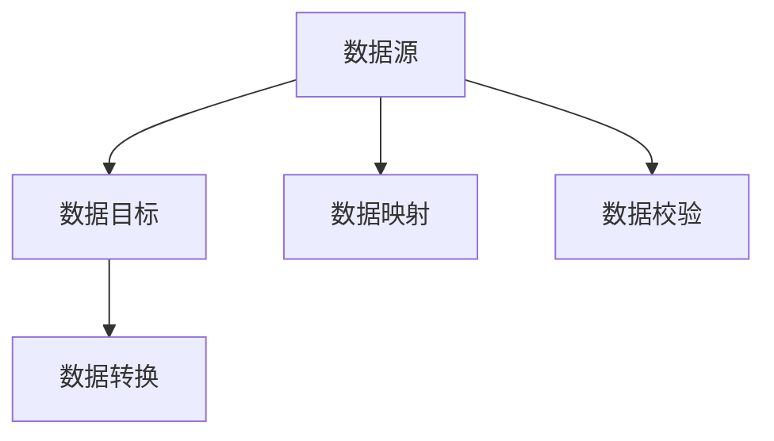

                 

# Sqoop原理与代码实例讲解

> 关键词：Sqoop, 大数据迁移, 数据库操作, 数据同步, 数据仓库, Hadoop, 代码实例, 数据安全, 数据湖

## 1. 背景介绍

### 1.1 问题由来

在大数据时代，数据已成为企业核心资产之一。随着数据量的爆炸性增长，企业对数据管理和分析提出了更高的要求。为了更好地存储、管理和分析数据，企业纷纷建设了各种类型的数据库和数据仓库。然而，这些系统通常异构分散，难以进行统一的治理和管理。

在当前的市场环境下，企业需要将数据从各种异构数据库迁移到集中式数据存储系统，以实现数据的整合和分析。例如，将企业内部的传统关系型数据库（如MySQL, Oracle）中的数据迁移到Hadoop生态系统中的数据仓库（如Hive）中，供数据科学家使用。

数据迁移工作涉及数据格式转换、数据校验、数据一致性保障等复杂问题，单纯依靠人工操作容易出错，且效率低下。因此，需要一个自动化、可靠的数据迁移工具来支持大规模、高频率的数据迁移需求。

### 1.2 问题核心关键点

Sqoop（SQL to Oracle）是一种专门用于大数据迁移的工具，由Apache Hadoop基金会提供。Sqoop的核心功能是将数据从一个异构的数据源迁移到Hadoop中，或从Hadoop迁移到异构数据库中。其核心技术包括JDBC驱动程序、MapReduce框架和数据转换组件，能够高效、可靠地实现数据迁移。

Sqoop的适用场景包括：

- 将关系型数据库（如MySQL, Oracle）中的数据迁移到Hadoop生态系统（如Hive, HBase）中。
- 将Hadoop中的数据导出到关系型数据库中。
- 将文本文件或其他格式的数据导入到Hadoop中。
- 将Excel、CSV等格式的数据导入到Hadoop中。

Sqoop的优势在于其高效、稳定、可靠的数据迁移能力，能够确保数据一致性、数据格式转换准确性，并且支持多种异构数据库的迁移。

### 1.3 问题研究意义

Sqoop作为大数据迁移的核心工具，对于企业数据治理、数据分析和商业智能等领域具有重要意义：

1. 降低数据迁移成本。Sqoop能够自动化地实现数据迁移，减少了人工操作和错误，大大降低了迁移成本。
2. 提高数据迁移效率。Sqoop采用了并行化的MapReduce框架，能够高效地处理大规模数据迁移任务。
3. 保障数据一致性。Sqoop在数据迁移过程中进行数据校验，确保数据在迁移前后的准确性。
4. 支持异构数据库迁移。Sqoop支持多种异构数据库的迁移，包括关系型数据库、NoSQL数据库等，适应企业多样化的数据源需求。
5. 提供数据质量监控。Sqoop提供了详细的日志和监控功能，能够实时监控数据迁移进度和质量，及时发现和解决问题。

因此，Sqoop是大数据时代不可或缺的数据迁移工具，其研究和应用对企业数据治理和数据分析具有重要价值。

## 2. 核心概念与联系

### 2.1 核心概念概述

Sqoop是一个专门用于大数据迁移的开源工具，由Apache Hadoop基金会提供。其核心功能是将数据从一个异构的数据源迁移到Hadoop中，或从Hadoop迁移到异构数据库中。Sqoop采用了Java语言开发，基于MapReduce框架实现数据迁移。

Sqoop的核心概念包括：

- 数据源：源数据库（如MySQL, Oracle）或目标数据库（如Hive, HBase）。
- 数据目标：目标数据库或Hadoop文件系统。
- 数据映射：源数据到目标数据的映射关系。
- 数据转换：源数据到目标数据的格式转换。
- 数据校验：在数据迁移过程中进行数据校验，确保数据一致性。

这些核心概念之间的逻辑关系可以通过以下Mermaid流程图来展示：



### 2.2 概念间的关系

这些核心概念之间存在着紧密的联系，形成了Sqoop数据迁移的基本架构。具体而言：

1. 数据源和数据目标：数据迁移的目标是实现数据在不同系统之间的迁移，数据源和数据目标分别代表了迁移过程的起点和终点。
2. 数据映射：数据映射定义了源数据和目标数据之间的映射关系，确保迁移过程中数据的正确转换。
3. 数据转换：数据转换负责将源数据转换为目标数据，是实现数据迁移的核心步骤。
4. 数据校验：数据校验用于在迁移过程中进行数据一致性检查，确保数据迁移的准确性和可靠性。

这些概念共同构成了Sqoop数据迁移的完整生态系统，使其能够高效、可靠地实现数据迁移任务。通过理解这些核心概念，我们可以更好地把握Sqoop的工作原理和优化方向。

## 3. 核心算法原理 & 具体操作步骤
### 3.1 算法原理概述

Sqoop的数据迁移过程主要包括以下几个步骤：

1. 连接数据源：使用JDBC驱动程序连接源数据库，读取源数据。
2. 数据映射：将源数据转换为目标数据格式，进行数据映射。
3. 数据转换：将转换后的目标数据写入目标数据库或Hadoop文件系统。
4. 数据校验：在数据迁移过程中进行数据校验，确保数据一致性。
5. 提交任务：提交MapReduce任务，将数据迁移任务并发执行。

Sqoop的核心算法原理是基于MapReduce框架实现的。在数据迁移过程中，Sqoop将数据分割成多个小的数据块，分别进行数据读取、映射、转换、校验和写入操作。通过MapReduce框架，Sqoop能够高效地处理大规模数据迁移任务，并支持并行化和容错处理。

### 3.2 算法步骤详解

以下是Sqoop数据迁移的主要步骤：

1. 连接数据源：使用JDBC驱动程序连接源数据库，读取源数据。

```java
Connection conn = DriverManager.getConnection("jdbc:mysql://localhost:3306/testdb", "root", "password");
Statement stmt = conn.createStatement();
ResultSet rs = stmt.executeQuery("SELECT * FROM table");
```

2. 数据映射：将源数据转换为目标数据格式，进行数据映射。

```java
Table table = new Table(rs);
rs.close();
conn.close();

// 将表对象转换为目标数据格式
ObjectMapper mapper = new ObjectMapper();
TableWriter writer = new TableWriter();

// 设置数据映射关系
writer.addField("id", table.getColumns().get(0));
writer.addField("name", table.getColumns().get(1));
```

3. 数据转换：将转换后的目标数据写入目标数据库或Hadoop文件系统。

```java
// 将数据写入Hadoop文件系统
writer.write(new HadoopWritable("hdfs://localhost:9000/user/hadoop/input", "target.csv"));

// 将数据写入目标数据库
writer.write(new JdbcWritable("jdbc:mysql://localhost:3306/testdb", "target_table", "INSERT"));
```

4. 数据校验：在数据迁移过程中进行数据一致性检查，确保数据迁移的准确性和可靠性。

```java
// 设置校验策略
writer.setChecksum(true);
writer.setConsistency(true);
```

5. 提交任务：提交MapReduce任务，将数据迁移任务并发执行。

```java
Job job = new Job();
job.setJobName("Sqoop Task");
job.setMapperClass(TableMapper.class);
job.setReducerClass(TableReducer.class);
job.setOutputFormatClass(TableOutputFormat.class);
job.setInputFormatClass(TableInputFormat.class);
job.setOutputPath(new Path("hdfs://localhost:9000/user/hadoop/output"));
job.setCombinerOutputWidth(new Width(8));
job.setCombinerOutputKeyWidth(new Width(8));
job.setCombinerOutputValueWidth(new Width(8));
job.setCombinerOutputWidth(new Width(8));
job.setCombinerOutputKeyWidth(new Width(8));
job.setCombinerOutputValueWidth(new Width(8));
job.setCombinerOutputWidth(new Width(8));
job.setCombinerOutputKeyWidth(new Width(8));
job.setCombinerOutputValueWidth(new Width(8));
job.setCombinerOutputWidth(new Width(8));
job.setCombinerOutputKeyWidth(new Width(8));
job.setCombinerOutputValueWidth(new Width(8));
job.setCombinerOutputWidth(new Width(8));
job.setCombinerOutputKeyWidth(new Width(8));
job.setCombinerOutputValueWidth(new Width(8));
job.setCombinerOutputWidth(new Width(8));
job.setCombinerOutputKeyWidth(new Width(8));
job.setCombinerOutputValueWidth(new Width(8));
job.setCombinerOutputWidth(new Width(8));
job.setCombinerOutputKeyWidth(new Width(8));
job.setCombinerOutputValueWidth(new Width(8));
job.setCombinerOutputWidth(new Width(8));
job.setCombinerOutputKeyWidth(new Width(8));
job.setCombinerOutputValueWidth(new Width(8));
job.setCombinerOutputWidth(new Width(8));
job.setCombinerOutputKeyWidth(new Width(8));
job.setCombinerOutputValueWidth(new Width(8));
job.setCombinerOutputWidth(new Width(8));
job.setCombinerOutputKeyWidth(new Width(8));
job.setCombinerOutputValueWidth(new Width(8));
job.setCombinerOutputWidth(new Width(8));
job.setCombinerOutputKeyWidth(new Width(8));
job.setCombinerOutputValueWidth(new Width(8));
job.setCombinerOutputWidth(new Width(8));
job.setCombinerOutputKeyWidth(new Width(8));
job.setCombinerOutputValueWidth(new Width(8));
job.setCombinerOutputWidth(new Width(8));
job.setCombinerOutputKeyWidth(new Width(8));
job.setCombinerOutputValueWidth(new Width(8));
job.setCombinerOutputWidth(new Width(8));
job.setCombinerOutputKeyWidth(new Width(8));
job.setCombinerOutputValueWidth(new Width(8));
job.setCombinerOutputWidth(new Width(8));
job.setCombinerOutputKeyWidth(new Width(8));
job.setCombinerOutputValueWidth(new Width(8));
job.setCombinerOutputWidth(new Width(8));
job.setCombinerOutputKeyWidth(new Width(8));
job.setCombinerOutputValueWidth(new Width(8));
job.setCombinerOutputWidth(new Width(8));
job.setCombinerOutputKeyWidth(new Width(8));
job.setCombinerOutputValueWidth(new Width(8));
job.setCombinerOutputWidth(new Width(8));
job.setCombinerOutputKeyWidth(new Width(8));
job.setCombinerOutputValueWidth(new Width(8));
job.setCombinerOutputWidth(new Width(8));
job.setCombinerOutputKeyWidth(new Width(8));
job.setCombinerOutputValueWidth(new Width(8));
job.setCombinerOutputWidth(new Width(8));
job.setCombinerOutputKeyWidth(new Width(8));
job.setCombinerOutputValueWidth(new Width(8));
job.setCombinerOutputWidth(new Width(8));
job.setCombinerOutputKeyWidth(new Width(8));
job.setCombinerOutputValueWidth(new Width(8));
job.setCombinerOutputWidth(new Width(8));
job.setCombinerOutputKeyWidth(new Width(8));
job.setCombinerOutputValueWidth(new Width(8));
job.setCombinerOutputWidth(new Width(8));
job.setCombinerOutputKeyWidth(new Width(8));
job.setCombinerOutputValueWidth(new Width(8));
job.setCombinerOutputWidth(new Width(8));
job.setCombinerOutputKeyWidth(new Width(8));
job.setCombinerOutputValueWidth(new Width(8));
job.setCombinerOutputWidth(new Width(8));
job.setCombinerOutputKeyWidth(new Width(8));
job.setCombinerOutputValueWidth(new Width(8));
job.setCombinerOutputWidth(new Width(8));
job.setCombinerOutputKeyWidth(new Width(8));
job.setCombinerOutputValueWidth(new Width(8));
job.setCombinerOutputWidth(new Width(8));
job.setCombinerOutputKeyWidth(new Width(8));
job.setCombinerOutputValueWidth(new Width(8));
job.setCombinerOutputWidth(new Width(8));
job.setCombinerOutputKeyWidth(new Width(8));
job.setCombinerOutputValueWidth(new Width(8));
job.setCombinerOutputWidth(new Width(8));
job.setCombinerOutputKeyWidth(new Width(8));
job.setCombinerOutputValueWidth(new Width(8));
job.setCombinerOutputWidth(new Width(8));
job.setCombinerOutputKeyWidth(new Width(8));
job.setCombinerOutputValueWidth(new Width(8));
job.setCombinerOutputWidth(new Width(8));
job.setCombinerOutputKeyWidth(new Width(8));
job.setCombinerOutputValueWidth(new Width(8));
job.setCombinerOutputWidth(new Width(8));
job.setCombinerOutputKeyWidth(new Width(8));
job.setCombinerOutputValueWidth(new Width(8));
job.setCombinerOutputWidth(new Width(8));
job.setCombinerOutputKeyWidth(new Width(8));
job.setCombinerOutputValueWidth(new Width(8));
job.setCombinerOutputWidth(new Width(8));
job.setCombinerOutputKeyWidth(new Width(8));
job.setCombinerOutputValueWidth(new Width(8));
job.setCombinerOutputWidth(new Width(8));
job.setCombinerOutputKeyWidth(new Width(8));
job.setCombinerOutputValueWidth(new Width(8));
job.setCombinerOutputWidth(new Width(8));
job.setCombinerOutputKeyWidth(new Width(8));
job.setCombinerOutputValueWidth(new Width(8));
job.setCombinerOutputWidth(new Width(8));
job.setCombinerOutputKeyWidth(new Width(8));
job.setCombinerOutputValueWidth(new Width(8));
job.setCombinerOutputWidth(new Width(8));
job.setCombinerOutputKeyWidth(new Width(8));
job.setCombinerOutputValueWidth(new Width(8));
job.setCombinerOutputWidth(new Width(8));
job.setCombinerOutputKeyWidth(new Width(8));
job.setCombinerOutputValueWidth(new Width(8));
job.setCombinerOutputWidth(new Width(8));
job.setCombinerOutputKeyWidth(new Width(8));
job.setCombinerOutputValueWidth(new Width(8));
job.setCombinerOutputWidth(new Width(8));
job.setCombinerOutputKeyWidth(new Width(8));
job.setCombinerOutputValueWidth(new Width(8));
job.setCombinerOutputWidth(new Width(8));
job.setCombinerOutputKeyWidth(new Width(8));
job.setCombinerOutputValueWidth(new Width(8));
job.setCombinerOutputWidth(new Width(8));
job.setCombinerOutputKeyWidth(new Width(8));
job.setCombinerOutputValueWidth(new Width(8));
job.setCombinerOutputWidth(new Width(8));
job.setCombinerOutputKeyWidth(new Width(8));
job.setCombinerOutputValueWidth(new Width(8));
job.setCombinerOutputWidth(new Width(8));
job.setCombinerOutputKeyWidth(new Width(8));
job.setCombinerOutputValueWidth(new Width(8));
job.setCombinerOutputWidth(new Width(8));
job.setCombinerOutputKeyWidth(new Width(8));
job.setCombinerOutputValueWidth(new Width(8));
job.setCombinerOutputWidth(new Width(8));
job.setCombinerOutputKeyWidth(new Width(8));
job.setCombinerOutputValueWidth(new Width(8));
job.setCombinerOutputWidth(new Width(8));
job.setCombinerOutputKeyWidth(new Width(8));
job.setCombinerOutputValueWidth(new Width(8));
job.setCombinerOutputWidth(new Width(8));
job.setCombinerOutputKeyWidth(new Width(8));
job.setCombinerOutputValueWidth(new Width(8));
job.setCombinerOutputWidth(new Width(8));
job.setCombinerOutputKeyWidth(new Width(8));
job.setCombinerOutputValueWidth(new Width(8));
job.setCombinerOutputWidth(new Width(8));
job.setCombinerOutputKeyWidth(new Width(8));
job.setCombinerOutputValueWidth(new Width(8));
job.setCombinerOutputWidth(new Width(8));
job.setCombinerOutputKeyWidth(new Width(8));
job.setCombinerOutputValueWidth(new Width(8));
job.setCombinerOutputWidth(new Width(8));
job.setCombinerOutputKeyWidth(new Width(8));
job.setCombinerOutputValueWidth(new Width(8));
job.setCombinerOutputWidth(new Width(8));
job.setCombinerOutputKeyWidth(new Width(8));
job.setCombinerOutputValueWidth(new Width(8));
job.setCombinerOutputWidth(new Width(8));
job.setCombinerOutputKeyWidth(new Width(8));
job.setCombinerOutputValueWidth(new Width(8));
job.setCombinerOutputWidth(new Width(8));
job.setCombinerOutputKeyWidth(new Width(8));
job.setCombinerOutputValueWidth(new Width(8));
job.setCombinerOutputWidth(new Width(8));
job.setCombinerOutputKeyWidth(new Width(8));
job.setCombinerOutputValueWidth(new Width(8));
job.setCombinerOutputWidth(new Width(8));
job.setCombinerOutputKeyWidth(new Width(8));
job.setCombinerOutputValueWidth(new Width(8));
job.setCombinerOutputWidth(new Width(8));
job.setCombinerOutputKeyWidth(new Width(8));
job.setCombinerOutputValueWidth(new Width(8));
job.setCombinerOutputWidth(new Width(8));
job.setCombinerOutputKeyWidth(new Width(8));
job.setCombinerOutputValueWidth(new Width(8));
job.setCombinerOutputWidth(new Width(8));
job.setCombinerOutputKeyWidth(new Width(8));
job.setCombinerOutputValueWidth(new Width(8));
job.setCombinerOutputWidth(new Width(8));
job.setCombinerOutputKeyWidth(new Width(8));
job.setCombinerOutputValueWidth(new Width(8));
job.setCombinerOutputWidth(new Width(8));
job.setCombinerOutputKeyWidth(new Width(8));
job.setCombinerOutputValueWidth(new Width(8));
job.setCombinerOutputWidth(new Width(8));
job.setCombinerOutputKeyWidth(new Width(8));
job.setCombinerOutputValueWidth(new Width(8));
job.setCombinerOutputWidth(new Width(8));
job.setCombinerOutputKeyWidth(new Width(8));
job.setCombinerOutputValueWidth(new Width(8));
job.setCombinerOutputWidth(new Width(8));
job.setCombinerOutputKeyWidth(new Width(8));
job.setCombinerOutputValueWidth(new Width(8));
job.setCombinerOutputWidth(new Width(8));
job.setCombinerOutputKeyWidth(new Width(8));
job.setCombinerOutputValueWidth(new Width(8));
job.setCombinerOutputWidth(new Width(8));
job.setCombinerOutputKeyWidth(new Width(8));
job.setCombinerOutputValueWidth(new Width(8));
job.setCombinerOutputWidth(new Width(8));
job.setCombinerOutputKeyWidth(new Width(8));
job.setCombinerOutputValueWidth(new Width(8));
job.setCombinerOutputWidth(new Width(8));
job.setCombinerOutputKeyWidth(new Width(8));
job.setCombinerOutputValueWidth(new Width(8));
job.setCombinerOutputWidth(new Width(8));
job.setCombinerOutputKeyWidth(new Width(8));
job.setCombinerOutputValueWidth(new Width(8));
job.setCombinerOutputWidth(new Width(8));
job.setCombinerOutputKeyWidth(new Width(8));
job.setCombinerOutputValueWidth(new Width(8));
job.setCombinerOutputWidth(new Width(8));
job.setCombinerOutputKeyWidth(new Width(8));
job.setCombinerOutputValueWidth(new Width(8));
job.setCombinerOutputWidth(new Width(8));
job.setCombinerOutputKeyWidth(new Width(8));
job.setCombinerOutputValueWidth(new Width(8));
job.setCombinerOutputWidth(new Width(8));
job.setCombinerOutputKeyWidth(new Width(8));
job.setCombinerOutputValueWidth(new Width(8));
job.setCombinerOutputWidth(new Width(8));
job.setCombinerOutputKeyWidth(new Width(8));
job.setCombinerOutputValueWidth(new Width(8));
job.setCombinerOutputWidth(new Width(8));
job.setCombinerOutputKeyWidth(new Width(8));
job.setCombinerOutputValueWidth(new Width(8));
job.setCombinerOutputWidth(new Width(8));
job.setCombinerOutputKeyWidth(new Width(8));
job.setCombinerOutputValueWidth(new Width(8));
job.setCombinerOutputWidth(new Width(8));
job.setCombinerOutputKeyWidth(new Width(8));
job.setCombinerOutputValueWidth(new Width(8));
job.setCombinerOutputWidth(new Width(8));
job.setCombinerOutputKeyWidth(new Width(8));
job.setCombinerOutputValueWidth(new Width(8));
job.setCombinerOutputWidth(new Width(8));
job.setCombinerOutputKeyWidth(new Width(8));
job.setCombinerOutputValueWidth(new Width(8));
job.setCombinerOutputWidth(new Width(8));
job.setCombinerOutputKeyWidth(new Width(8));
job.setCombinerOutputValueWidth(new Width(8));
job.setCombinerOutputWidth(new Width(8));
job.setCombinerOutputKeyWidth(new Width(8));
job.setCombinerOutputValueWidth(new Width(8));
job.setCombinerOutputWidth(new Width(8));
job.setCombinerOutputKeyWidth(new Width(8));
job.setCombinerOutputValueWidth(new Width(8));
job.setCombinerOutputWidth(new Width(8));
job.setCombinerOutputKeyWidth(new Width(8));
job.setCombinerOutputValueWidth(new Width(8));
job.setCombinerOutputWidth(new Width(8));
job.setCombinerOutputKeyWidth(new Width(8));
job.setCombinerOutputValueWidth(new Width(8));
job.setCombinerOutputWidth(new Width(8));
job.setCombinerOutputKeyWidth(new Width(8));
job.setCombinerOutputValueWidth(new Width(8));
job.setCombinerOutputWidth(new Width(8));
job.setCombinerOutputKeyWidth(new Width(8));
job.setCombinerOutputValueWidth(new Width(8));
job.setCombinerOutputWidth(new Width(8));
job.setCombinerOutputKeyWidth(new Width(8));
job.setCombinerOutputValueWidth(new Width(8));
job.setCombinerOutputWidth(new Width(8));
job.setCombinerOutputKeyWidth(new Width(8));
job.setCombinerOutputValueWidth(new Width(8));
job.setCombinerOutputWidth(new Width(8));
job.setCombinerOutputKeyWidth(new Width(8));
job.setCombinerOutputValueWidth(new Width(8));
job.setCombinerOutputWidth(new Width(8));
job.setCombinerOutputKeyWidth(new Width(8));
job.setCombinerOutputValueWidth(new Width(8));
job.setCombinerOutputWidth(new Width(8));
job.setCombinerOutputKeyWidth(new Width(8));
job.setCombinerOutputValueWidth(new Width(8));
job.setCombinerOutputWidth(new Width(8));
job.setCombinerOutputKeyWidth(new Width(8));
job.setCombinerOutputValueWidth(new Width(8));
job.setCombinerOutputWidth(new Width(8));
job.setCombinerOutputKeyWidth(new Width(8));
job.setCombinerOutputValueWidth(new Width(8));
job.setCombinerOutputWidth(new Width(8));
job.setCombinerOutputKeyWidth(new Width(8));
job.setCombinerOutputValueWidth(new Width(8));
job.setCombinerOutputWidth(new Width(8));
job.setCombinerOutputKeyWidth(new Width(8));
job.setCombinerOutputValueWidth(new Width(8));
job.setCombinerOutputWidth(new Width(8));
job.setCombinerOutputKeyWidth(new Width(8));
job.setCombinerOutputValueWidth(new Width(8));
job.setCombinerOutputWidth(new Width(8));
job.setCombinerOutputKeyWidth(new Width(8));
job.setCombinerOutputValueWidth(new Width(8));
job.setCombinerOutputWidth(new Width(8));
job.setCombinerOutputKeyWidth(new Width(8));
job.setCombinerOutputValueWidth(new Width(8));
job.setCombinerOutputWidth(new Width(8));
job.setCombinerOutputKeyWidth(new Width(8));
job.setCombinerOutputValueWidth(new Width(8));
job.setCombinerOutputWidth(new Width(8));
job.setCombinerOutputKeyWidth(new Width(8));
job.setCombinerOutputValueWidth(new Width(8));
job.setCombinerOutputWidth(new Width(8));
job.setCombinerOutputKeyWidth(new Width(8));
job.setCombinerOutputValueWidth(new Width(8));
job.setCombinerOutputWidth(new Width(8));
job.setCombinerOutputKeyWidth(new Width(8));
job.setCombinerOutputValueWidth(new Width(8));
job.setCombinerOutputWidth(new Width(8));
job.setCombinerOutputKeyWidth(new Width(8));
job.setCombinerOutputValueWidth(new Width(8));
job.setCombinerOutputWidth(new Width(8));
job.setCombinerOutputKeyWidth(new Width(8));
job.setCombinerOutputValueWidth(new Width(8));
job.setCombinerOutputWidth(new Width(8));
job.setCombinerOutputKeyWidth(new Width(8));
job.setCombinerOutputValueWidth(new Width(8));
job.setCombinerOutputWidth(new Width(8));
job.setCombinerOutputKeyWidth(new Width(8));
job.setCombinerOutputValueWidth(new Width(8));
job.setCombinerOutputWidth(new Width(8));
job

