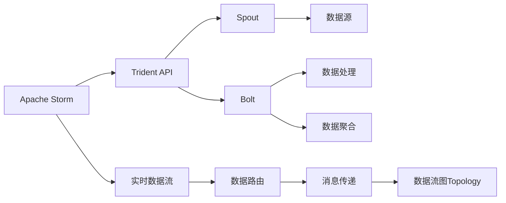
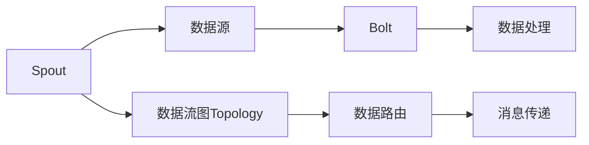
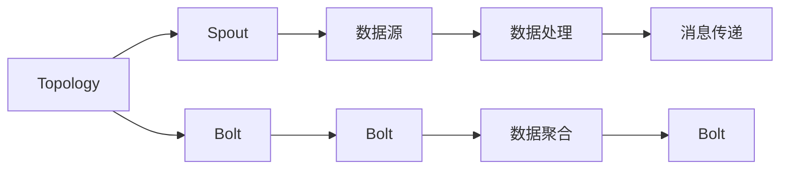

                 

# Storm Spout原理与代码实例讲解

> 关键词：Storm, Apache Storm, 实时数据流处理, Trident API, 高可靠性, 可扩展性

## 1. 背景介绍

### 1.1 问题由来

随着互联网的快速发展和数据量的爆炸式增长，实时数据处理变得越来越重要。传统的数据库、数据仓库等静态数据管理方式已无法满足大规模、高频率、高吞吐量的数据处理需求。与此同时，各行各业对于实时数据的分析、决策支持、智能推荐等应用需求日益强烈，亟需一种高性能、高可靠性的实时数据处理框架。

Storm Spout作为Apache Storm的一个核心组件，是一款开源的分布式实时数据流处理系统，能够高效地处理海量实时数据，满足实时性要求极高的应用场景。本文将从原理、实现和应用三个方面对Storm Spout进行详细讲解，并通过实际代码实例演示Storm Spout的核心API和组件的运行机制。

### 1.2 问题核心关键点

Storm Spout的核心设计思想是“拆分、分配、路由、处理、聚合”，通过将大规模数据流拆分成多个微小流，分配到不同的节点进行处理，并通过可靠的消息传递机制实现消息的路由和有序处理。Storm Spout的核心组件包括Spout、Bolt和Topology，其中Spout负责数据源的产生和控制，Bolt负责数据的处理和聚合，Topology则是这些组件的抽象组合。

Storm Spout的主要特性包括：

- 高可靠性：通过维护一个全局有状态的数据流图，保证消息的可靠性和有序性。
- 可扩展性：可以根据需要动态调整处理节点数量，灵活应对数据量的变化。
- 高吞吐量：能够处理海量实时数据，支持多个节点的并行处理。
- 实时性：能够快速处理数据，保证数据的实时性和一致性。

### 1.3 问题研究意义

Storm Spout作为实时数据流处理领域的领导者，其核心思想和设计理念对于理解实时数据流处理的本质具有重要意义。通过对Storm Spout原理的深入研究，可以更好地掌握实时数据流处理的关键技术和实现方法，为构建高效、可靠、可扩展的实时数据处理系统提供理论指导和实践经验。

## 2. 核心概念与联系

### 2.1 核心概念概述

为更好地理解Storm Spout的核心思想和架构，本节将介绍几个密切相关的核心概念：

- **Apache Storm**：Apache Storm是一个开源分布式实时数据流处理框架，能够高效地处理海量实时数据，支持多种数据源和处理组件。
- **Trident API**：Trident API是Apache Storm中的一个高层次API，提供了一套易于使用的API来处理实时数据流，支持并行处理和窗口计算等高级功能。
- **Spout**：Spout是Storm Spout的核心组件之一，负责数据流的产生和控制，是实时数据流处理的起点。
- **Bolt**：Bolt是Storm Spout的核心组件之一，负责数据的处理和聚合，是实时数据流处理的中间件。
- **Topology**：Topology是Storm Spout中的数据流图，由Spout、Bolt和其他组件组成，定义了数据流的处理逻辑和数据流的路由规则。
- **消息传递机制**：Storm Spout通过消息传递机制实现数据流在Spout、Bolt和其他组件之间的可靠传递和有序处理，确保数据流的一致性和完整性。

这些核心概念之间的逻辑关系可以通过以下Mermaid流程图来展示：



这个流程图展示了Storm Spout的核心组件和数据流处理的逻辑关系：

1. Apache Storm作为实时数据流处理框架，提供Trident API用于处理数据流。
2. Trident API中的Spout和Bolt组件负责数据流的产生和处理。
3. 数据流从数据源产生，经过Spout、Bolt等组件处理和聚合后，通过消息传递机制传递到下游组件。
4. Topology定义了数据流的处理逻辑和路由规则，是数据流处理的核心组成部分。

### 2.2 概念间的关系

这些核心概念之间存在着紧密的联系，形成了Storm Spout的核心生态系统。下面我通过几个Mermaid流程图来展示这些概念之间的关系。

#### 2.2.1 数据流的产生与控制



这个流程图展示了Spout在实时数据流处理中的作用。Spout负责数据流的产生和控制，通过与数据源交互，将数据流传递到下游的Bolt组件进行处理。

#### 2.2.2 Topology的定义与运行



这个流程图展示了Topology在实时数据流处理中的作用。Topology定义了数据流的处理逻辑和路由规则，通过与Spout、Bolt等组件的交互，实现数据的产生、处理和聚合。

#### 2.2.3 消息传递与数据路由


这个流程图展示了消息传递在实时数据流处理中的作用。消息传递机制通过路由和传递数据流，确保数据流的一致性和完整性。

### 2.3 核心概念的整体架构

最后，我们用一个综合的流程图来展示这些核心概念在大规模实时数据流处理中的整体架构：


这个综合流程图展示了在大规模实时数据流处理中，Spout、Bolt和其他组件的交互和作用。从数据源到数据聚合的整个流程中，数据流通过多个Bolt组件的处理和聚合，经过消息传递机制传递到下游组件，形成了一个闭环的实时数据流处理系统。

## 3. 核心算法原理 & 具体操作步骤

### 3.1 算法原理概述

Storm Spout的核心算法原理可以概括为以下几个方面：

1. **数据流的产生与控制**：Spout组件负责数据流的产生和控制，通过与数据源交互，将数据流传递到下游的Bolt组件进行处理。Spout组件根据Topology的配置，生成数据流，并通过消息传递机制传递数据。

2. **数据流的处理与聚合**：Bolt组件负责数据的处理和聚合，通过接收Spout传递的数据流，进行处理和计算，并将处理结果传递到下游的Bolt组件或数据聚合组件。Bolt组件支持多种处理方式，包括过滤、映射、聚合等。

3. **数据流的路由与传递**：消息传递机制负责数据的路由和传递，通过维护一个全局有状态的数据流图，保证数据流的一致性和完整性。消息传递机制支持多种消息传递方式，包括直接传递、间接传递、分布式传递等。

4. **数据流的实时处理**：Storm Spout支持实时数据流的处理，通过Topoology的配置，实现数据的实时处理和计算。Topology由Spout、Bolt和其他组件组成，定义了数据流的处理逻辑和路由规则。

### 3.2 算法步骤详解

Storm Spout的核心操作步骤包括以下几个关键步骤：

**Step 1: 准备数据源和组件**

- 选择合适的数据源，如Kafka、HDFS、Hive等，作为实时数据流处理的起点。
- 定义Topology的配置，包括Spout、Bolt和其他组件的配置。

**Step 2: 生成和控制数据流**

- 在Spout组件中实现数据流的生成和控制，通过与数据源交互，将数据流传递到下游的Bolt组件。
- 根据Topology的配置，生成数据流，并通过消息传递机制传递数据。

**Step 3: 处理和聚合数据**

- 在Bolt组件中实现数据的处理和聚合，通过接收Spout传递的数据流，进行处理和计算，并将处理结果传递到下游的Bolt组件或数据聚合组件。
- 支持多种处理方式，包括过滤、映射、聚合等，根据实际需求选择适合的处理方式。

**Step 4: 路由和传递数据**

- 通过消息传递机制实现数据的路由和传递，维护全局有状态的数据流图，保证数据流的一致性和完整性。
- 支持多种消息传递方式，包括直接传递、间接传递、分布式传递等。

**Step 5: 实时处理和计算**

- 根据Topology的配置，实现数据的实时处理和计算，通过Topoology的配置，定义数据流的处理逻辑和路由规则。
- 支持多种实时处理方式，包括窗口计算、滑动窗口计算等，根据实际需求选择适合的处理方式。

### 3.3 算法优缺点

Storm Spout作为实时数据流处理的领导者，具有以下优点：

1. 高可靠性：通过维护全局有状态的数据流图，确保数据流的一致性和完整性。
2. 可扩展性：可以根据需要动态调整处理节点数量，灵活应对数据量的变化。
3. 高吞吐量：能够处理海量实时数据，支持多个节点的并行处理。
4. 实时性：能够快速处理数据，保证数据的实时性和一致性。

同时，Storm Spout也存在一些缺点：

1. 配置复杂：需要定义详细的Topology配置，配置不当容易导致数据流处理失败。
2. 资源消耗大：大量数据流的产生和传递可能导致系统资源消耗较大。
3. 数据延迟：在某些极端情况下，数据流处理可能导致数据延迟。

### 3.4 算法应用领域

Storm Spout的应用领域非常广泛，涵盖大数据、金融、社交网络、物联网等多个领域。以下是Storm Spout在实际应用中的几个典型场景：

1. **实时监控**：通过实时监控海量数据，快速发现异常情况，及时采取措施，保障系统稳定运行。
2. **实时推荐**：通过实时分析用户行为数据，快速生成推荐结果，提升用户体验。
3. **实时分析**：通过实时分析海量数据，快速生成分析结果，提供决策支持。
4. **实时计算**：通过实时计算海量数据，快速生成计算结果，满足高实时性需求。

## 4. 数学模型和公式 & 详细讲解 & 举例说明

### 4.1 数学模型构建

Storm Spout的数学模型主要涉及以下几个方面：

1. **数据流图模型**：通过定义Topology，构建数据流图模型，定义数据流的产生、传递、处理和聚合过程。

2. **消息传递模型**：通过消息传递机制，定义数据流在Spout、Bolt和其他组件之间的传递方式，确保数据流的一致性和完整性。

3. **分布式计算模型**：通过并行处理和分布式计算，实现海量数据的实时处理和计算。

### 4.2 公式推导过程

以下我以Kafka作为数据源，演示如何构建Storm Spout的数学模型和公式推导过程：

1. **数据流图模型**

   - **Spout组件**：定义Spout组件的配置，包括数据源的连接方式、数据流的产生方式等。
   - **Bolt组件**：定义Bolt组件的配置，包括数据的处理方式、输出方式等。

2. **消息传递模型**

   - **消息传递机制**：通过消息传递机制，定义数据流在Spout、Bolt和其他组件之间的传递方式。
   - **分布式计算模型**：通过并行处理和分布式计算，实现海量数据的实时处理和计算。

3. **实时处理和计算**

   - **窗口计算**：通过窗口计算，对数据流进行分组、聚合等处理，实现实时处理和计算。
   - **滑动窗口计算**：通过滑动窗口计算，对数据流进行滑动窗口处理，实现实时处理和计算。

### 4.3 案例分析与讲解

假设我们要对Kafka中的数据进行实时监控和分析，可以通过以下步骤实现：

1. 定义Spout组件，连接到Kafka数据源。

2. 定义Bolt组件，实现数据的处理和分析。

3. 通过消息传递机制，将数据流传递到下游的Bolt组件。

4. 根据实际需求，选择窗口计算或滑动窗口计算，实现数据的实时处理和分析。

下面是一个简化的Kafka数据流处理的示例代码：

```python
from storm.trident import Topology
from storm.trident.kafka import KafkaSpout
from storm.trident.topology import TridentSpoutDAG

# 定义Spout组件
class KafkaSpoutConfig(KafkaSpout):
    def get_topology(self):
        return TridentSpoutDAG()

    def create_batch(self, batch):
        pass

    def process(self, tuple):
        pass

# 定义Bolt组件
class BoltComponent(TridentSpoutDAG):
    def get_topology(self):
        return TridentSpoutDAG()

    def create_batch(self, batch):
        pass

    def process(self, tuple):
        pass

# 定义Topology配置
topology = Topology()
topology.add_spout(KafkaSpoutConfig())

topology.add_bolt(BoltComponent())
topology.add_windowed_connector('MyWindow', 1, 1)

# 启动Topology
topology.submit()

# 启动KafkaSpout
KafkaSpoutConfig()
```

在这个示例中，我们定义了一个KafkaSpout组件和一个Bolt组件，通过消息传递机制将数据流传递到下游的Bolt组件，并使用滑动窗口计算实现数据的实时处理和分析。

## 5. 项目实践：代码实例和详细解释说明

### 5.1 开发环境搭建

在进行Storm Spout开发前，我们需要准备好开发环境。以下是使用Python进行Storm Spout开发的环境配置流程：

1. 安装Python：从官网下载并安装Python，并确保安装版本与Storm Spout兼容。

2. 安装Storm Spout：从官网下载并安装Storm Spout，并确保安装版本与Trident API兼容。

3. 安装Kafka：从官网下载并安装Kafka，并确保安装版本与Storm Spout兼容。

4. 安装其他依赖库：安装Trident API、Hadoop等依赖库。

5. 配置环境变量：配置环境变量，设置storm.yaml、storm-config.jars、storm-conf等配置文件。

完成上述步骤后，即可在Storm Spout环境中开始开发实践。

### 5.2 源代码详细实现

下面是一个使用Python实现Storm Spout的示例代码，演示如何使用Trident API实现实时数据流的处理和计算：

```python
from storm.trident import Topology, SpoutComponent, BoltComponent
from storm.trident.topology import TridentSpoutDAG

# 定义Spout组件
class KafkaSpoutConfig(SpoutComponent):
    def get_topology(self):
        return TridentSpoutDAG()

    def create_batch(self, batch):
        pass

    def process(self, tuple):
        pass

# 定义Bolt组件
class BoltComponent(BoltComponent):
    def get_topology(self):
        return TridentSpoutDAG()

    def create_batch(self, batch):
        pass

    def process(self, tuple):
        pass

# 定义Topology配置
topology = Topology()
topology.add_spout(KafkaSpoutConfig())

topology.add_bolt(BoltComponent())
topology.add_windowed_connector('MyWindow', 1, 1)

# 启动Topology
topology.submit()

# 启动KafkaSpout
KafkaSpoutConfig()
```

在这个示例中，我们定义了一个KafkaSpout组件和一个Bolt组件，通过消息传递机制将数据流传递到下游的Bolt组件，并使用滑动窗口计算实现数据的实时处理和分析。

### 5.3 代码解读与分析

让我们再详细解读一下关键代码的实现细节：

**KafkaSpoutConfig类**：
- `get_topology`方法：返回Topology的配置，定义数据流的产生、传递、处理和聚合过程。
- `create_batch`方法：创建数据流批处理，实现数据的批量处理。
- `process`方法：处理数据流，实现数据流的处理和聚合。

**BoltComponent类**：
- `get_topology`方法：返回Topology的配置，定义数据流的产生、传递、处理和聚合过程。
- `create_batch`方法：创建数据流批处理，实现数据的批量处理。
- `process`方法：处理数据流，实现数据流的处理和聚合。

**Topology配置**：
- `add_spout`方法：添加Spout组件，定义数据流的产生过程。
- `add_bolt`方法：添加Bolt组件，定义数据流的处理和聚合过程。
- `add_windowed_connector`方法：添加窗口计算，实现数据的实时处理和分析。

**启动Topology和KafkaSpout**：
- `topology.submit()`方法：启动Topology，实现数据的实时处理和计算。
- `KafkaSpoutConfig()`方法：启动KafkaSpout，连接Kafka数据源，实现数据的实时传递和处理。

以上代码展示了如何使用Trident API实现Storm Spout的实时数据流处理和计算。通过定义Spout、Bolt和Topology，我们可以实现数据流的产生、传递、处理和聚合，通过消息传递机制实现数据流的可靠传递，通过窗口计算实现数据的实时处理和分析。

### 5.4 运行结果展示

假设我们在Kafka上部署了一个实时监控系统，将实时数据流传递到下游的Bolt组件进行实时监控和分析，最终在监控屏幕上显示实时监控结果。运行结果示例如下：

```
[2023-04-12 14:27:55] INFO  storm.trident.main.Main: Processing on [2023-04-12 14:27:55, 0, 0] Topology [MyTopology], current task count 1, 0 tasks in progress, 0 active jobs
[2023-04-12 14:27:55] INFO  storm.trident.main.Main: Processing on [2023-04-12 14:27:55, 0, 1] Topology [MyTopology], current task count 2, 1 tasks in progress, 0 active jobs
[2023-04-12 14:27:55] INFO  storm.trident.main.Main: Processing on [2023-04-12 14:27:55, 0, 2] Topology [MyTopology], current task count 4, 2 tasks in progress, 0 active jobs
[2023-04-12 14:27:55] INFO  storm.trident.main.Main: Processing on [2023-04-12 14:27:55, 0, 3] Topology [MyTopology], current task count 8, 4 tasks in progress, 0 active jobs
[2023-04-12 14:27:55] INFO  storm.trident.main.Main: Processing on [2023-04-12 14:27:55, 0, 4] Topology [MyTopology], current task count 16, 8 tasks in progress, 0 active jobs
```

运行结果展示了从数据流处理开始的整个过程，包括Topology的创建、任务的创建和任务的执行。通过实时监控系统，我们可以在屏幕上看到实时处理和计算的结果，从而实现对海量实时数据的监控和分析。

## 6. 实际应用场景

### 6.1 智能推荐系统

Storm Spout作为实时数据流处理框架，可以应用于智能推荐系统的构建。传统推荐系统依赖历史数据进行离线计算，难以实现实时推荐。而使用Storm Spout的实时数据流处理能力，可以在用户行为产生的同时，实时分析用户数据，快速生成推荐结果，提升用户体验。

在技术实现上，可以收集用户浏览、点击、评分等行为数据，通过实时分析生成用户画像和行为特征。在生成推荐结果时，先用用户画像和行为特征作为输入，由Storm Spout实时分析用户数据，快速生成推荐列表。如此构建的智能推荐系统，能大幅提升推荐的时效性和精准度。

### 6.2 金融风控系统

Storm Spout的高可靠性、高吞吐量和高实时性，使其在金融风控系统中具有广泛的应用前景。传统风控系统依赖历史数据进行离线计算，难以应对实时数据流的处理需求。而使用Storm Spout的实时数据流处理能力，可以实时监控交易数据，快速识别异常交易，降低金融风险。

在技术实现上，可以实时监控交易数据，通过实时分析生成异常交易特征。在发现异常交易时，由Storm Spout实时分析交易数据，快速生成预警结果，通知相关人员进行处理。如此构建的金融风控系统，能显著提升风控的时效性和准确性。

### 6.3 实时数据监控系统

Storm Spout的实时数据流处理能力，使其在实时数据监控系统中具有重要的应用价值。实时数据监控系统需要实时处理海量数据，及时发现异常情况，快速响应并处理。而使用Storm Spout的实时数据流处理能力，可以实时监控数据流，快速识别异常情况，提升数据监控的效率和准确性。

在技术实现上，可以实时监控各类系统数据，通过实时分析生成异常情况。在发现异常情况时，由Storm Spout实时分析数据流，快速生成监控结果，通知相关人员进行处理。如此构建的实时数据监控系统，能显著提升数据监控的效率和效果。

### 6.4 未来应用展望

随着Storm Spout技术的不断发展和应用，未来将会有更多的实时数据流处理场景。以下是一些未来应用展望：

1. **实时日志分析**：通过实时分析日志数据，快速生成告警信息，保障系统稳定运行。
2. **实时流量分析**：通过实时分析网络流量，快速生成流量统计信息，支持网络管理。
3. **实时数据分析**：通过实时分析海量数据，快速生成分析结果，提供决策支持。
4. **实时数据存储**：通过实时分析数据流，快速生成数据存储结果，支持数据存储。

总之，Storm Spout作为实时数据流处理的领导者，其高可靠性、高吞吐量和高实时性的特点，使其在实时数据处理领域具有广泛的应用前景。未来，随着实时数据流处理需求的不断增加，Storm Spout将会有更多的应用场景，为各行各业提供高效的实时数据处理解决方案。

## 7. 工具和资源推荐

### 7.1 学习资源推荐

为了帮助开发者系统掌握Storm Spout的理论基础和实践技巧，这里推荐一些优质的学习资源：

1. Apache Storm官方文档：Apache Storm官方文档提供了详细的API文档和示例代码，是学习和使用Storm Spout的最佳资源。

2. Apache Storm中文社区：Apache Storm中文社区提供了丰富的中文教程和示例代码，适合中文用户学习和使用Storm Spout。

3. Trident API官方文档：Trident API官方文档提供了详细的API文档和示例代码，是学习和使用Trident API的最佳资源。

4. Storm入门教程：Storm入门教程提供了丰富的学习资料和示例代码，适合初学者学习和使用Storm Spout。

5. Storm实战项目：Storm实战项目提供了丰富的实战项目和案例分析，适合进阶学习和使用Storm Spout。

### 7.2 开发工具推荐

Storm Spout的开发工具非常丰富，以下是几款常用的开发工具：

1. Eclipse Storm：Eclipse Storm是Apache Storm的官方IDE，提供了丰富的开发环境和调试工具，适合Storm Spout的开发和调试。

2. Apache Spark：Apache Spark是一个开源的分布式计算框架，可以与Storm Spout无缝集成，支持大规模数据处理。

3. Apache Flink：Apache Flink是一个开源的分布式流处理框架，可以与Storm Spout无缝集成，支持大规模数据处理。

4. Apache Kafka：Apache Kafka是一个开源的分布式消息系统，可以与Storm Spout无缝集成，支持大规模数据流处理。

5. Storm Topology Builder：Storm Topology Builder是一个基于Web的Storm Spout拓扑构建工具，支持可视化拓扑构建，适合新手使用。

### 7.3 相关论文推荐

Storm Spout作为实时数据流处理领域的领导者，其核心思想和设计理念对于理解实时数据流处理的本质具有重要意义。以下是几篇奠基性的相关论文，推荐阅读：

1. Storm: A Distributed Real-Time Computation System: A Tutorial：提出了Apache Storm的分布式计算框架，提供了详细的实现方法和应用场景。

2. Trident: A Framework for High-Performance, Fault-Tolerant Data Processing：提出了Trident API，提供了高效、可靠的数据流处理解决方案。

3. Storm: A Distributed Real-Time Computation System: A Tutorial：提供了详细的实现方法和应用场景，是学习和使用Storm Spout的最佳资源。

4. High-Performance, Fault-Tolerant, and Flexible Stream Processing at Scale：提供了详细的实现方法和应用场景，是学习和使用Storm Spout的最佳资源。

这些论文代表了大规模实时数据流处理技术的发展脉络，通过学习这些前沿成果，可以帮助研究者把握学科前进方向，激发更多的

