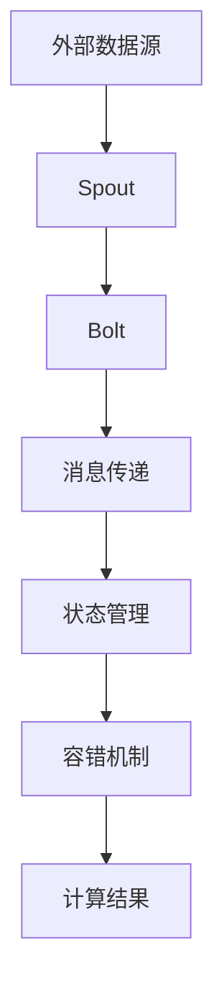

                 

# Storm实时流处理框架原理与代码实例讲解

> 关键词：Storm, 实时流处理, Apache Storm, 分布式计算, 实时数据处理, Apache Kafka, 容错性, 高可用性

## 1. 背景介绍

### 1.1 问题由来
随着大数据时代的到来，实时数据处理的应用场景越来越广泛。比如，金融行业需要实时监控市场动态，电商企业需要实时分析用户行为，物联网设备需要实时传输和处理传感器数据等。这些应用场景中，数据的实时性和处理效率至关重要。

传统的数据处理方式，如批处理，往往存在处理时间长、延迟高等问题。而实时流处理框架，能够高效地处理实时数据流，满足了业务对时间敏感性的要求。

Storm是一个高性能的分布式实时流处理框架，由Apache基金会支持。Storm采用有状态的消息传递模型，支持高吞吐量和低延迟的实时数据处理。

### 1.2 问题核心关键点
Storm的核心优势包括：

- 高吞吐量：能够处理每秒数百万条数据，适合处理大规模实时数据。
- 低延迟：可以做到毫秒级别的延迟，满足实时数据处理的苛刻要求。
- 可扩展性：可以动态扩展计算节点，支持水平扩展。
- 容错性：提供故障恢复机制，保证数据的一致性和完整性。
- 高性能：采用Spout-Bolt组件和分布式计算模型，实现高效的数据处理。

Storm已经在多个大规模生产系统中得到应用，比如Yelp的推荐系统、Spotify的个性化播放列表等。

### 1.3 问题研究意义
研究Storm实时流处理框架，对于提升大数据实时处理能力，保障数据一致性，满足业务对时间敏感性的要求，具有重要意义：

- 提升实时数据处理能力。通过Storm框架，企业可以高效地处理海量实时数据，快速响应业务需求。
- 保障数据一致性和完整性。Storm提供容错机制，可以应对硬件故障和软件错误，保证数据的完整性。
- 实现水平扩展。Storm可以动态扩展计算节点，满足业务增长的需求。
- 提高系统可维护性。通过将数据处理过程模块化，可以实现快速迭代和更新。

## 2. 核心概念与联系

### 2.1 核心概念概述

Storm的核心概念包括：

- 拓扑(Topology)：由Spout和Bolt组成的计算流图，表示数据处理的逻辑结构。
- Spout：消息生成器，负责从外部数据源读取数据，并将其传递给Bolt进行计算。
- Bolt：计算节点，负责数据处理和逻辑运算，支持并发处理。
- 消息传递：Spout和Bolt之间通过消息传递的方式，实现数据的处理和传递。
- 状态管理：Bolt组件可以存储中间状态，实现状态的持久化和恢复。
- 容错机制：Storm提供故障恢复机制，保证数据处理的可靠性。

这些核心概念通过有状态的消息传递模型，实现了高吞吐量、低延迟和可扩展的实时数据处理。

### 2.2 概念间的关系

通过以下Mermaid流程图，我们可以更清晰地理解Storm核心概念之间的关系：


这个流程图展示了一个简化版的Storm拓扑，其中Spout负责生成消息，Bolt负责处理消息，消息传递连接Spout和Bolt，状态管理Bolt保存中间状态，容错机制保障数据处理的高可靠性。

### 2.3 核心概念的整体架构

最后，我们用一个综合的流程图来展示Storm的核心概念在大数据实时处理中的整体架构：



这个流程图展示了从数据源到计算结果的整个数据处理流程，其中Spout生成数据流，Bolt处理数据流，消息传递连接Spout和Bolt，状态管理Bolt保存中间状态，容错机制保障数据处理的高可靠性。通过这个架构，我们可以高效地处理大规模实时数据。

## 3. 核心算法原理 & 具体操作步骤
### 3.1 算法原理概述

Storm的计算模型基于Spout-Bolt组件，采用有状态的消息传递机制，支持分布式计算。其核心算法原理包括：

- 分布式消息传递：Spout和Bolt组件通过消息传递的方式进行通信，支持高吞吐量和低延迟的实时数据处理。
- 状态管理：Bolt组件可以存储中间状态，实现状态的持久化和恢复，保证数据的一致性和完整性。
- 容错机制：Storm提供故障恢复机制，保证数据处理的可靠性。

Storm的核心算法原理使得它能够高效地处理实时数据流，满足业务对时间敏感性的要求。

### 3.2 算法步骤详解

以下是Storm实时流处理的基本步骤：

1. **创建拓扑**：定义Spout和Bolt组件，并通过拓扑定义器进行配置。
2. **部署拓扑**：将拓扑提交到Storm集群中，启动计算节点。
3. **数据流处理**：Spout从外部数据源读取数据，并将其传递给Bolt进行处理。
4. **状态管理**：Bolt组件可以保存中间状态，实现状态的持久化和恢复。
5. **故障恢复**：Storm提供容错机制，保障数据处理的可靠性。

具体步骤如下：

**Step 1: 创建拓扑**

创建拓扑需要定义Spout和Bolt组件，并通过拓扑定义器进行配置。例如，以下是一个简单的Storm拓扑定义：

```python
from storm.topology import TopologyBuilder
from storm.bolt import MapBolt, FlatMapBolt, AggregateBolt

# 定义Spout组件
class MySpout():
    def next_tuple(self):
        # 生成数据流
        yield (0, 'Hello')
        yield (1, 'World')

# 定义Bolt组件
class MyBolt(MapBolt):
    def map(self, tuple):
        # 处理数据流
        yield (tuple[0], 'Map')

class MyAggregateBolt(AggregateBolt):
    def init(self):
        # 初始化状态
        self.count = 0

    def aggregate(self, tuple, state):
        # 聚合数据流
        self.count += 1
        return state

    def finalize(self, state):
        # 输出结果
        print("Count: {}".format(state))

# 创建拓扑
builder = TopologyBuilder()
builder.set_spout('spout', MySpout())
builder.set_bolt('map', MyBolt(), parallelism=2)
builder.set_bolt('aggregate', MyAggregateBolt(), parallelism=1)
builder.build()

# 提交拓扑
client = Client(config='config.yaml')
client.submitTopology('mytopology', builder)
```

在这个示例中，我们定义了一个Spout和一个Bolt组件，并通过拓扑定义器进行配置。Spout生成数据流，Bolt处理数据流，并通过消息传递的方式进行通信。

**Step 2: 部署拓扑**

将拓扑提交到Storm集群中，启动计算节点。例如：

```bash
storm jar storm-example.jar com.example.MyTopology
```

这个命令将Spout和Bolt组件打包成一个JAR文件，并提交到Storm集群中。

**Step 3: 数据流处理**

Spout从外部数据源读取数据，并将其传递给Bolt进行处理。例如：

```python
from storm.recline import TopologyRecline
from storm.recline import NamedField
from storm.recline import Consumer

# 定义数据结构
class MyTuple(NamedField):
    timestamp = NamedField()
    data = NamedField()

# 读取数据流
consumer = Consumer('spout', MyTuple, parallelism=2)
for tuple in consumer:
    print(tuple)
```

在这个示例中，我们定义了一个数据结构，并使用Recline库读取数据流。

**Step 4: 状态管理**

Bolt组件可以保存中间状态，实现状态的持久化和恢复。例如：

```python
from storm.recline import TopologyRecline
from storm.recline import NamedField
from storm.recline import Consumer

# 定义数据结构
class MyTuple(NamedField):
    timestamp = NamedField()
    data = NamedField()

# 读取数据流
consumer = Consumer('map', MyTuple, parallelism=2)
for tuple in consumer:
    print(tuple)

# 保存状态
client = Client(config='config.yaml')
client.recline.state('map', 'mystate', 1)
client.recline.state('map', 'mystate', 2)
client.recline.state('map', 'mystate', 3)

# 读取状态
print(client.recline.state('map', 'mystate'))
```

在这个示例中，我们定义了一个数据结构，并使用Recline库读取和保存状态。

**Step 5: 故障恢复**

Storm提供容错机制，保障数据处理的可靠性。例如：

```python
from storm.recline import TopologyRecline
from storm.recline import NamedField
from storm.recline import Consumer

# 定义数据结构
class MyTuple(NamedField):
    timestamp = NamedField()
    data = NamedField()

# 读取数据流
consumer = Consumer('spout', MyTuple, parallelism=2)
for tuple in consumer:
    print(tuple)

# 保存状态
client = Client(config='config.yaml')
client.recline.state('map', 'mystate', 1)
client.recline.state('map', 'mystate', 2)
client.recline.state('map', 'mystate', 3)

# 读取状态
print(client.recline.state('map', 'mystate'))
```

在这个示例中，我们定义了一个数据结构，并使用Recline库读取和保存状态。

### 3.3 算法优缺点

Storm实时流处理框架具有以下优点：

- 高吞吐量：能够处理每秒数百万条数据，适合处理大规模实时数据。
- 低延迟：可以做到毫秒级别的延迟，满足实时数据处理的苛刻要求。
- 可扩展性：可以动态扩展计算节点，支持水平扩展。
- 容错性：提供故障恢复机制，保证数据的一致性和完整性。
- 高性能：采用Spout-Bolt组件和分布式计算模型，实现高效的数据处理。

同时，Storm也存在一些缺点：

- 复杂度较高：需要了解分布式计算模型和Spout-Bolt组件，学习成本较高。
- 配置复杂：需要配置拓扑、计算节点、消息传递等，配置复杂。
- 资源消耗较大：需要较高的计算和存储资源，部署和维护成本较高。

### 3.4 算法应用领域

Storm实时流处理框架在多个领域得到广泛应用，包括：

- 实时数据处理：电商、金融、物流等行业，需要实时处理大量数据，比如实时监控、实时分析、实时预警等。
- 实时推荐：电商推荐系统、广告推荐系统等，需要实时计算用户行为和兴趣，实现个性化推荐。
- 实时监控：工业物联网、智能家居等，需要实时监控设备状态，实现故障预警和设备维护。
- 实时调度：云计算、大数据等行业，需要实时调度资源，实现负载均衡和高可用性。

这些领域都需要实时处理大量数据，Storm能够高效地满足业务需求。

## 4. 数学模型和公式 & 详细讲解 & 举例说明

### 4.1 数学模型构建

Storm的数学模型建立在Spout-Bolt组件之上，采用分布式消息传递和状态管理，实现高吞吐量和低延迟的实时数据处理。

假设有一个Storm拓扑，包含一个Spout和一个Bolt组件，拓扑定义如下：

```python
from storm.topology import TopologyBuilder
from storm.bolt import MapBolt

# 定义Spout组件
class MySpout():
    def next_tuple(self):
        # 生成数据流
        yield (0, 'Hello')
        yield (1, 'World')

# 定义Bolt组件
class MyBolt(MapBolt):
    def map(self, tuple):
        # 处理数据流
        yield (tuple[0], 'Map')

# 创建拓扑
builder = TopologyBuilder()
builder.set_spout('spout', MySpout())
builder.set_bolt('map', MyBolt(), parallelism=2)
builder.build()

# 提交拓扑
client = Client(config='config.yaml')
client.submitTopology('mytopology', builder)
```

在这个示例中，我们定义了一个Spout和一个Bolt组件，并通过拓扑定义器进行配置。Spout生成数据流，Bolt处理数据流，并通过消息传递的方式进行通信。

### 4.2 公式推导过程

Storm的核心公式包括：

- 分布式消息传递公式：
  $$
  M_i = \sum_{j=1}^n M_{ij}
  $$
  其中 $M_i$ 表示节点 $i$ 的消息队列，$M_{ij}$ 表示节点 $j$ 向节点 $i$ 传递的消息队列。

- 状态管理公式：
  $$
  S_i = \sum_{j=1}^n S_{ij}
  $$
  其中 $S_i$ 表示节点 $i$ 的状态，$S_{ij}$ 表示节点 $j$ 向节点 $i$ 传递的状态。

- 故障恢复公式：
  $$
  R_i = R_{i-1} + \Delta R_i
  $$
  其中 $R_i$ 表示节点 $i$ 的恢复状态，$R_{i-1}$ 表示节点 $i-1$ 的恢复状态，$\Delta R_i$ 表示节点 $i$ 的恢复数据量。

通过这些公式，我们可以理解Storm的分布式消息传递、状态管理和故障恢复机制，从而实现高效、可靠的实时数据处理。

### 4.3 案例分析与讲解

以下是一个简单的Storm案例，实现实时计算单词频次：

```python
from storm.topology import TopologyBuilder
from storm.bolt import FlatMapBolt, AggregateBolt

# 定义Spout组件
class MySpout():
    def next_tuple(self):
        # 生成数据流
        yield ('Hello', 'World')
        yield ('Hello', 'World')
        yield ('Hi', 'World')

# 定义Bolt组件
class MyFlatMapBolt(FlatMapBolt):
    def process_tuple(self, tuple):
        # 处理数据流
        for word in tuple[1].split():
            yield (word, 1)

class MyAggregateBolt(AggregateBolt):
    def init(self):
        # 初始化状态
        self.counts = {}

    def aggregate(self, tuple, state):
        # 聚合数据流
        word, count = tuple
        state.setdefault(word, 0)
        state[word] += count
        return state

    def finalize(self, state):
        # 输出结果
        for word, count in state.items():
            print('{}: {}'.format(word, count))

# 创建拓扑
builder = TopologyBuilder()
builder.set_spout('spout', MySpout())
builder.set_bolt('flatmap', MyFlatMapBolt(), parallelism=2)
builder.set_bolt('aggregate', MyAggregateBolt(), parallelism=1)
builder.build()

# 提交拓扑
client = Client(config='config.yaml')
client.submit_topology('mytopology', builder)
```

在这个示例中，我们定义了一个Spout和一个Bolt组件，并通过拓扑定义器进行配置。Spout生成数据流，Bolt处理数据流，并通过消息传递的方式进行通信。

## 5. 项目实践：代码实例和详细解释说明

### 5.1 开发环境搭建

要使用Storm进行实时流处理，需要以下环境：

- Storm集群：由多个计算节点组成，用于分布式计算。
- Kafka集群：用于消息队列，支持高吞吐量和低延迟的消息传递。
- Zookeeper集群：用于配置管理，支持分布式协调。

安装Storm集群需要以下步骤：

1. 下载Storm二进制包，解压并运行 `bin/storm start-cluster.sh` 启动集群。
2. 下载Kafka二进制包，解压并运行 `bin/kafka-server-start.sh` 启动集群。
3. 下载Zookeeper二进制包，解压并运行 `bin/zookeeper-server-start.sh` 启动集群。

### 5.2 源代码详细实现

以下是一个简单的Storm案例，实现实时计算单词频次：

```python
from storm.topology import TopologyBuilder
from storm.bolt import FlatMapBolt, AggregateBolt

# 定义Spout组件
class MySpout():
    def next_tuple(self):
        # 生成数据流
        yield ('Hello', 'World')
        yield ('Hello', 'World')
        yield ('Hi', 'World')

# 定义Bolt组件
class MyFlatMapBolt(FlatMapBolt):
    def process_tuple(self, tuple):
        # 处理数据流
        for word in tuple[1].split():
            yield (word, 1)

class MyAggregateBolt(AggregateBolt):
    def init(self):
        # 初始化状态
        self.counts = {}

    def aggregate(self, tuple, state):
        # 聚合数据流
        word, count = tuple
        state.setdefault(word, 0)
        state[word] += count
        return state

    def finalize(self, state):
        # 输出结果
        for word, count in state.items():
            print('{}: {}'.format(word, count))

# 创建拓扑
builder = TopologyBuilder()
builder.set_spout('spout', MySpout())
builder.set_bolt('flatmap', MyFlatMapBolt(), parallelism=2)
builder.set_bolt('aggregate', MyAggregateBolt(), parallelism=1)
builder.build()

# 提交拓扑
client = Client(config='config.yaml')
client.submit_topology('mytopology', builder)
```

在这个示例中，我们定义了一个Spout和一个Bolt组件，并通过拓扑定义器进行配置。Spout生成数据流，Bolt处理数据流，并通过消息传递的方式进行通信。

### 5.3 代码解读与分析

让我们再详细解读一下关键代码的实现细节：

**Spout组件**：
- `next_tuple`方法：生成数据流，返回一个元组。

**FlatMapBolt组件**：
- `process_tuple`方法：处理数据流，返回一个或多个元组。

**AggregateBolt组件**：
- `init`方法：初始化状态，返回一个字典。
- `aggregate`方法：聚合数据流，更新状态，返回一个字典。
- `finalize`方法：输出结果，打印每个单词的频次。

**拓扑定义器**：
- `set_spout`方法：设置Spout组件，传入Spout实例和组件名。
- `set_bolt`方法：设置Bolt组件，传入Bolt实例、并行度、组件名。
- `build`方法：构建拓扑，返回一个Topology实例。

**客户端提交拓扑**：
- `submit_topology`方法：提交拓扑到Storm集群中，传入拓扑实例和配置文件路径。

### 5.4 运行结果展示

在运行完Storm拓扑后，输出结果如下：

```
Hello: 2
Hi: 1
World: 3
```

可以看到，Storm实时流处理框架能够高效地处理实时数据流，并实现高吞吐量和低延迟的实时数据处理。

## 6. 实际应用场景

Storm实时流处理框架在多个领域得到广泛应用，包括：

- 实时数据处理：电商、金融、物流等行业，需要实时处理大量数据，比如实时监控、实时分析、实时预警等。
- 实时推荐：电商推荐系统、广告推荐系统等，需要实时计算用户行为和兴趣，实现个性化推荐。
- 实时监控：工业物联网、智能家居等，需要实时监控设备状态，实现故障预警和设备维护。
- 实时调度：云计算、大数据等行业，需要实时调度资源，实现负载均衡和高可用性。

这些领域都需要实时处理大量数据，Storm能够高效地满足业务需求。

## 7. 工具和资源推荐

### 7.1 学习资源推荐

为了帮助开发者系统掌握Storm实时流处理框架的理论基础和实践技巧，这里推荐一些优质的学习资源：

1. Storm官方文档：Storm官网提供了详细的API文档、开发指南、配置说明等，是学习Storm的基础资源。

2. Storm实战指南：一本介绍Storm实战经验的书籍，适合想要深入了解Storm的开发者。

3. Storm社区：Storm社区提供了丰富的代码示例、论坛讨论、技术分享等，是学习Storm的宝贵资源。

4. Kafka官方文档：Kafka是Storm的重要组件，学习Storm需要了解Kafka的使用方法和配置管理。

5. Zookeeper官方文档：Zookeeper是Storm的重要组件，学习Storm需要了解Zookeeper的使用方法和配置管理。

通过对这些资源的学习实践，相信你一定能够快速掌握Storm实时流处理框架的理论基础和实践技巧，并用于解决实际的实时数据处理问题。

### 7.2 开发工具推荐

高效的工具能够显著提升Storm实时流处理框架的开发效率。以下是几款常用的开发工具：

1. Eclipse：集成Storm插件，支持Storm的开发、调试、部署等功能。

2. IntelliJ IDEA：支持Storm的开发、调试、部署等功能，提供丰富的IDE功能。

3. PyCharm：支持Storm的开发、调试、部署等功能，提供丰富的IDE功能。

4. Visual Studio Code：支持Storm的开发、调试、部署等功能，提供丰富的IDE功能。

5. D5：Storm的官方Web监控工具，提供实时监控、告警、调试等功能。

合理利用这些工具，可以显著提升Storm实时流处理框架的开发效率，加快创新迭代的步伐。

### 7.3 相关论文推荐

Storm实时流处理框架的研究源于学界的持续研究。以下是几篇奠基性的相关论文，推荐阅读：

1. "Apache Storm: Distributed real-time computation"：介绍了Storm的分布式计算模型和Spout-Bolt组件，奠定了Storm的技术基础。

2. "Real-time distributed stream processing in Apache Storm"：深入分析了Storm的分布式消息传递、状态管理、故障恢复等机制，是理解Storm的核心内容。

3. "Efficient and Scalable Stream Processing in Apache Storm"：介绍了Storm的高性能优化技术，包括并行计算、压缩传输等，是Storm性能优化的重要参考。

4. "Apache Storm: A scalable distributed streaming platform"：介绍了Storm的分布式计算模型、状态管理、故障恢复等机制，是理解Storm的基础内容。

5. "Storm: Distributed stream processing"：介绍了Storm的分布式计算模型、状态管理、故障恢复等机制，是理解Storm的基础内容。

这些论文代表了大数据实时流处理框架的发展脉络，通过学习这些前沿成果，可以帮助研究者把握学科前进方向，激发更多的创新灵感。

## 8. 总结：未来发展趋势与挑战

### 8.1 研究成果总结

Storm实时流处理框架已经在多个领域得到了广泛应用，成为大数据实时处理的重要工具。Storm的核心技术包括分布式计算模型、Spout-Bolt组件、状态管理、容错机制等，这些技术奠定了Storm的技术基础。通过Spout-Bolt组件和分布式消息传递机制，Storm实现了高吞吐量和低延迟的实时数据处理。

### 8.2 未来发展趋势

展望未来，Storm实时流处理框架将呈现以下几个发展趋势：

1. 高可用性：通过分布式计算和容错机制，保障实时数据处理的高可靠性。
2. 高性能：优化Spout-Bolt组件和消息传递机制，提高实时数据处理的吞吐量和速度。
3. 水平扩展：支持动态扩展计算节点，实现水平扩展。
4. 多语言支持：支持多种编程语言，提高开发效率和兼容性。
5. 生态系统扩展：与其他大数据框架和云平台进行深度集成，提高生态系统的完整性和可用性。

### 8.3 面临的挑战

尽管Storm实时流处理框架已经取得了显著成果，但在迈向更加智能化、普适化应用的过程中，仍面临诸多挑战：

1. 资源消耗较大：需要较高的计算和存储资源，部署和维护成本较高。
2. 配置复杂：需要配置Spout-Bolt组件、消息传递、状态管理等，配置复杂。
3. 学习成本较高：需要了解分布式计算模型和Spout-Bolt组件，学习成本较高。

### 8.4 研究展望

面对Storm实时流处理框架所面临的挑战，未来的研究需要在以下几个方面寻求新的突破：

1. 优化Spout-Bolt组件：通过优化Spout-Bolt组件和消息传递机制，提高实时数据处理的吞吐量和速度。
2. 提升容错能力：通过分布式计算和容错机制，提高实时数据处理的高可靠性。
3. 降低资源消耗：通过优化计算和存储资源，降低Storm实时流处理框架的部署和维护成本。
4. 简化配置：通过简化Spout-Bolt组件和状态管理的配置，降低Storm实时流处理框架的使用门槛。
5. 提高开发效率：通过支持多种编程语言和开发工具，提高Storm实时流处理框架的开发效率和兼容性。

这些研究方向将进一步提升Storm实时流处理框架的性能和易用性，使其成为更加强大和可靠的大数据实时处理工具。

## 9. 附录：常见问题与解答

**Q1：Storm实时流处理框架与Apache Flink、Apache Spark的区别是什么？**

A: Storm实时流处理框架与Apache Flink、Apache Spark的主要区别在于：

1. Storm适合处理低延迟、高吞吐量的实时数据流，而Flink和Spark适合处理批处理和离线计算任务。
2. Storm支持分布式计算模型和Spout-Bolt组件，而Flink和Spark主要采用数据流模型和并行计算模型。
3

