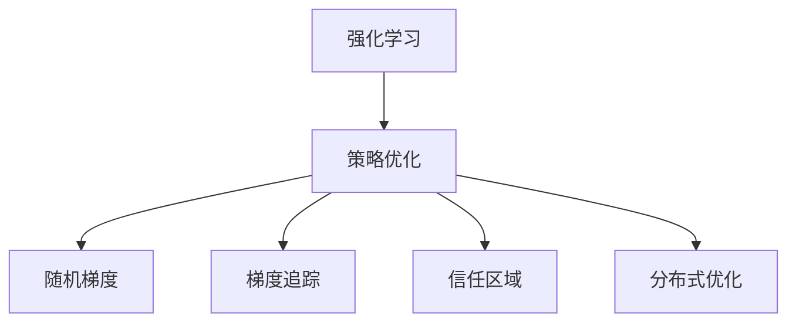
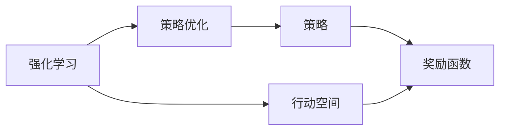
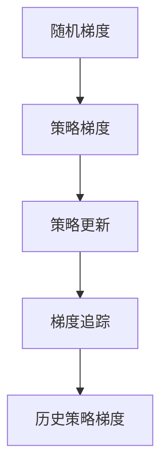
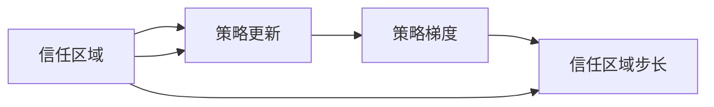
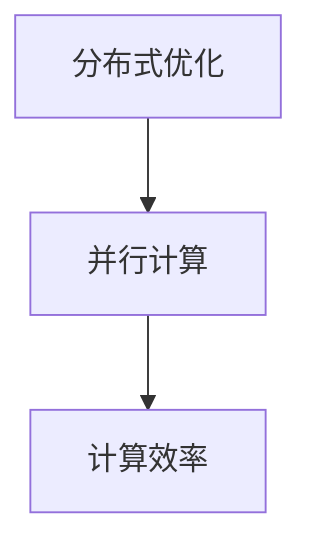
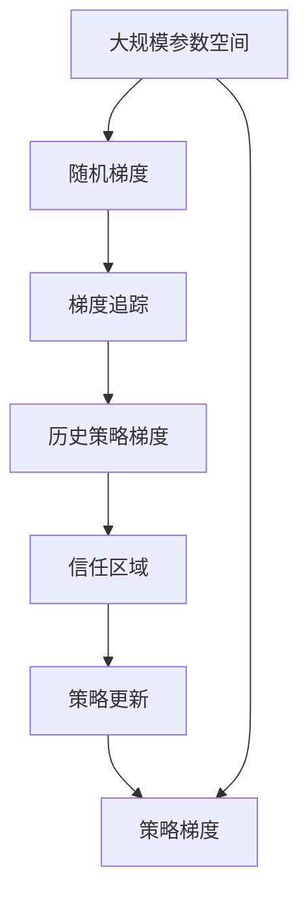

                 

# TRPO(Trust Region Policy Optimization) - 原理与代码实例讲解

> 关键词：强化学习, 策略优化, 随机梯度, 梯度追踪, 分布式优化, 分布式深度强化学习

## 1. 背景介绍

### 1.1 问题由来

强化学习 (Reinforcement Learning, RL) 是机器学习中的一个重要分支，旨在通过与环境互动来学习最优策略。与监督学习和无监督学习不同，强化学习中的模型不仅需要学习输入数据的特征表示，还需要学习如何在复杂环境中采取最优行动，以最大化预定义的奖励函数。然而，传统的强化学习方法往往面临以下挑战：

- **样本效率低**：传统的强化学习方法通常需要大量的样本来收敛到最优策略，且在复杂环境中容易陷入局部最优解。
- **不稳定**：模型的训练过程容易受噪声和随机梯度估计的影响，导致收敛性能不稳定。
- **计算成本高**：大规模的模型和环境通常需要大量的计算资源，导致训练和推理效率低下。

为了解决这些问题，研究者们提出了多种基于优化的方法，如策略梯度法、优势演员-评论家 (Actor-Critic) 方法等。然而，这些方法在处理高维度参数空间和连续动作空间时，仍面临计算复杂度较高的挑战。

### 1.2 问题核心关键点

TRPO (Trust Region Policy Optimization) 是一种针对连续动作空间的策略优化方法，旨在通过优化策略梯度的近似值来提高强化学习的效率和稳定性。TRPO 的核心思想是在政策更新中引入信任区域，避免政策的大幅突变，从而提高样本效率和稳定性。

TRPO 的关键点包括：
- **近似策略梯度**：使用分布式随机梯度估计，减少计算复杂度。
- **梯度追踪**：引入历史策略梯度信息，平滑策略更新。
- **信任区域**：限制策略更新的步长，避免政策的大幅突变，提高样本效率。
- **分布式优化**：通过并行计算，加速训练过程。

这些关键点共同构成了 TRPO 算法的核心框架，使其能够处理大规模的参数空间和连续动作空间，显著提高强化学习的效率和稳定性。

## 2. 核心概念与联系

### 2.1 核心概念概述

为了更好地理解 TRPO 算法，我们先介绍一些相关的核心概念：

- **强化学习 (Reinforcement Learning)**：通过与环境互动，学习最优策略以最大化奖励函数的方法。
- **策略优化 (Policy Optimization)**：通过优化策略，学习如何在复杂环境中采取最优行动的方法。
- **随机梯度 (Stochastic Gradient)**：在参数空间中随机采样，估计策略梯度的方法。
- **梯度追踪 (Gradient Tracking)**：引入历史策略梯度信息，平滑策略更新的过程。
- **信任区域 (Trust Region)**：限制策略更新的步长，避免政策的大幅突变，提高样本效率的过程。
- **分布式优化 (Distributed Optimization)**：通过并行计算，加速训练过程，提高计算效率。

这些核心概念之间的逻辑关系可以通过以下 Mermaid 流程图来展示：



这个流程图展示了一些关键概念之间的关系：

1. **强化学习**：通过与环境互动，学习最优策略以最大化奖励函数。
2. **策略优化**：通过优化策略，学习如何在复杂环境中采取最优行动。
3. **随机梯度**：在参数空间中随机采样，估计策略梯度的方法。
4. **梯度追踪**：引入历史策略梯度信息，平滑策略更新的过程。
5. **信任区域**：限制策略更新的步长，避免政策的大幅突变，提高样本效率的过程。
6. **分布式优化**：通过并行计算，加速训练过程，提高计算效率。

这些概念共同构成了 TRPO 算法的核心框架，使其能够处理大规模的参数空间和连续动作空间，显著提高强化学习的效率和稳定性。

### 2.2 概念间的关系

这些核心概念之间存在着紧密的联系，形成了 TRPO 算法的完整生态系统。下面我通过几个 Mermaid 流程图来展示这些概念之间的关系。

#### 2.2.1 强化学习与策略优化的关系



这个流程图展示了强化学习与策略优化的关系。强化学习通过与环境互动，学习最优策略以最大化奖励函数。

#### 2.2.2 随机梯度与梯度追踪的关系



这个流程图展示了随机梯度与梯度追踪的关系。随机梯度通过在参数空间中随机采样，估计策略梯度。梯度追踪则引入历史策略梯度信息，平滑策略更新。

#### 2.2.3 信任区域与策略更新的关系



这个流程图展示了信任区域与策略更新的关系。信任区域限制策略更新的步长，避免政策的大幅突变，提高样本效率。

#### 2.2.4 分布式优化与计算效率的关系



这个流程图展示了分布式优化与计算效率的关系。分布式优化通过并行计算，加速训练过程，提高计算效率。

### 2.3 核心概念的整体架构

最后，我们用一个综合的流程图来展示这些核心概念在 TRPO 算法中的整体架构：



这个综合流程图展示了从随机梯度估计到策略更新的完整过程。大规模参数空间中的随机梯度估计，通过梯度追踪和历史策略梯度信息，引入信任区域，限制策略更新的步长，最终进行策略更新。

## 3. 核心算法原理 & 具体操作步骤
### 3.1 算法原理概述

TRPO 算法是一种基于优化的方法，旨在通过优化策略梯度的近似值来提高强化学习的效率和稳定性。TRPO 的核心思想是在政策更新中引入信任区域，避免政策的大幅突变，从而提高样本效率和稳定性。

具体而言，TRPO 算法的目标是在给定的时序数据 $\{s_0, a_0, r_1, s_1, \ldots, s_{T-1}, a_{T-1}, r_T\}$ 上，优化策略 $\pi(a_t|s_t)$，最大化期望累计奖励 $J(\pi)$。TRPO 的目标函数为：

$$
J(\pi) = \mathbb{E}_{(s, a) \sim \pi}[R(s, a)]
$$

其中 $R(s, a)$ 是环境奖励函数。

TRPO 算法通过近似策略梯度 $\nabla_{\theta} J(\pi_{\theta})$ 来进行策略优化。假设 $\pi_{\theta}(a_t|s_t)$ 是当前的策略，$\pi_{\theta + \Delta \theta}(a_t|s_t)$ 是更新后的策略。为了使 $J(\pi_{\theta})$ 最大化，需要满足以下条件：

$$
\Delta \theta = \arg\min_{\Delta \theta} \nabla_{\theta} J(\pi_{\theta})
$$

然而，直接计算 $\nabla_{\theta} J(\pi_{\theta})$ 的计算复杂度较高，难以在大规模参数空间中进行。TRPO 算法通过引入随机梯度估计和梯度追踪方法，来近似计算策略梯度。

### 3.2 算法步骤详解

TRPO 算法的主要步骤如下：

**Step 1: 初始化策略和信任区域**

1. 初始化当前策略 $\pi_{\theta}$。
2. 初始化信任区域半径 $\delta$，通常设置为 0.1。
3. 随机采样一个优化方向 $\Delta \theta$。

**Step 2: 计算梯度**

1. 使用随机梯度估计方法，计算当前策略的策略梯度 $G(s, a)$。
2. 使用梯度追踪方法，计算历史策略梯度 $\hat{G}(s, a)$。

**Step 3: 策略更新**

1. 计算当前策略和目标策略的Kullback-Leibler散度：
   $$
   KL_{\text{KL}}(\pi_{\theta + \Delta \theta}, \pi_{\theta})
   $$

2. 在信任区域内，计算政策更新步长 $\alpha$：
   $$
   \alpha = \arg\min_{\alpha} KL_{\text{KL}}(\pi_{\theta + \alpha \Delta \theta}, \pi_{\theta})
   $$

3. 更新策略：
   $$
   \theta \leftarrow \theta + \alpha \Delta \theta
   $$

**Step 4: 验证策略**

1. 使用验证集评估更新后的策略，确保策略不会显著降低性能。
2. 如果策略性能显著降低，则回滚到上一个策略版本。

**Step 5: 重复迭代**

1. 重复上述步骤，直到策略收敛或达到预设的迭代次数。

### 3.3 算法优缺点

TRPO 算法的主要优点包括：

1. **稳定性**：通过引入信任区域和策略梯度追踪，避免策略的大幅突变，提高样本效率和稳定性。
2. **计算效率**：使用随机梯度估计和梯度追踪方法，减少计算复杂度，加速训练过程。
3. **可扩展性**：适用于大规模参数空间和连续动作空间，能够处理复杂的环境。

然而，TRPO 算法也存在一些缺点：

1. **计算开销**：虽然计算复杂度较低，但需要存储和计算历史策略梯度信息，导致一定的计算开销。
2. **参数更新步长**：信任区域半径和政策更新步长需要手动调参，可能影响算法的收敛速度和性能。
3. **复杂度**：相比于基于策略梯度的算法，TRPO 算法的实现较为复杂，需要较多的代码实现和调试工作。

### 3.4 算法应用领域

TRPO 算法在强化学习领域的应用非常广泛，特别适用于连续动作空间的策略优化问题。例如：

- **机器人控制**：机器人通过与环境互动，学习最优控制策略以最大化任务完成度。
- **游戏玩家**：游戏玩家通过与游戏环境互动，学习最优策略以最大化游戏得分。
- **自动驾驶**：自动驾驶车辆通过与道路环境互动，学习最优控制策略以最大化安全性和舒适性。
- **金融投资**：投资策略通过与市场环境互动，学习最优策略以最大化投资回报。
- **自然语言处理**：自然语言处理模型通过与用户互动，学习最优策略以最大化用户满意度。

TRPO 算法能够有效地处理这些连续动作空间的策略优化问题，帮助模型学习到最优的策略，提高任务完成度和用户体验。

## 4. 数学模型和公式 & 详细讲解 & 举例说明

### 4.1 数学模型构建

TRPO 算法的核心目标是在给定的时序数据 $\{s_0, a_0, r_1, s_1, \ldots, s_{T-1}, a_{T-1}, r_T\}$ 上，优化策略 $\pi(a_t|s_t)$，最大化期望累计奖励 $J(\pi)$。

假设当前策略为 $\pi_{\theta}(a_t|s_t)$，目标策略为 $\pi_{\theta + \Delta \theta}(a_t|s_t)$，则 TRPO 算法的目标函数为：

$$
J(\pi) = \mathbb{E}_{(s, a) \sim \pi}[R(s, a)]
$$

其中 $R(s, a)$ 是环境奖励函数。

为了计算策略梯度，TRPO 算法使用了随机梯度估计和梯度追踪方法。假设当前策略的策略梯度为 $G(s, a)$，历史策略梯度为 $\hat{G}(s, a)$，则 TRPO 算法的策略梯度估计为：

$$
G(s, a) = \nabla_{\theta} R(s, a) - \hat{G}(s, a)
$$

其中 $\nabla_{\theta} R(s, a)$ 是当前策略的策略梯度，$\hat{G}(s, a)$ 是历史策略梯度。

### 4.2 公式推导过程

在 TRPO 算法中，策略更新的目标是在信任区域内最小化 Kullback-Leibler 散度：

$$
K_{\text{KL}}(\pi_{\theta + \Delta \theta}, \pi_{\theta}) = \mathbb{E}_{(s, a) \sim \pi_{\theta}}[\log \frac{\pi_{\theta + \Delta \theta}(a_t|s_t)}{\pi_{\theta}(a_t|s_t)}]
$$

其中 $\pi_{\theta}$ 是当前策略，$\pi_{\theta + \Delta \theta}$ 是更新后的策略。

为了在信任区域内更新策略，TRPO 算法引入了政策更新步长 $\alpha$，通过最小化以下目标：

$$
\alpha = \arg\min_{\alpha} K_{\text{KL}}(\pi_{\theta + \alpha \Delta \theta}, \pi_{\theta})
$$

其中 $\Delta \theta$ 是优化方向。

通过最小化 Kullback-Leibler 散度，TRPO 算法可以限制策略更新的步长，避免策略的大幅突变，提高样本效率和稳定性。

### 4.3 案例分析与讲解

假设我们要训练一个机器人，使其通过与环境互动，学习最优控制策略以最大化任务完成度。假设当前策略为 $\pi_{\theta}(a_t|s_t)$，目标策略为 $\pi_{\theta + \Delta \theta}(a_t|s_t)$，则 TRPO 算法的目标函数为：

$$
J(\pi) = \mathbb{E}_{(s, a) \sim \pi}[R(s, a)]
$$

其中 $R(s, a)$ 是环境奖励函数。

假设当前策略的策略梯度为 $G(s, a)$，历史策略梯度为 $\hat{G}(s, a)$，则 TRPO 算法的策略梯度估计为：

$$
G(s, a) = \nabla_{\theta} R(s, a) - \hat{G}(s, a)
$$

其中 $\nabla_{\theta} R(s, a)$ 是当前策略的策略梯度，$\hat{G}(s, a)$ 是历史策略梯度。

在实际应用中，我们需要选择一个合适的信任区域半径 $\delta$，通常设置为 0.1。通过最小化 Kullback-Leibler 散度，TRPO 算法可以限制策略更新的步长，避免策略的大幅突变，提高样本效率和稳定性。

## 5. 项目实践：代码实例和详细解释说明

### 5.1 开发环境搭建

在进行 TRPO 算法实践前，我们需要准备好开发环境。以下是使用 Python 进行 PyTorch 开发的环境配置流程：

1. 安装 Anaconda：从官网下载并安装 Anaconda，用于创建独立的 Python 环境。

2. 创建并激活虚拟环境：
```bash
conda create -n pytorch-env python=3.8 
conda activate pytorch-env
```

3. 安装 PyTorch：根据 CUDA 版本，从官网获取对应的安装命令。例如：
```bash
conda install pytorch torchvision torchaudio cudatoolkit=11.1 -c pytorch -c conda-forge
```

4. 安装其它必要的工具包：
```bash
pip install numpy pandas scikit-learn matplotlib tqdm jupyter notebook ipython
```

完成上述步骤后，即可在 `pytorch-env` 环境中开始 TRPO 算法的实践。

### 5.2 源代码详细实现

下面以机器人控制为例，给出使用 PyTorch 进行 TRPO 算法实现的 PyTorch 代码：

```python
import torch
import torch.nn as nn
import torch.optim as optim
import torch.distributions as dist
import torch.distributions.kl as kl
from torch.distributions import constraints
import gym

class Policy(nn.Module):
    def __init__(self, state_dim, action_dim, hidden_dim=64):
        super(Policy, self).__init__()
        self.fc1 = nn.Linear(state_dim, hidden_dim)
        self.fc2 = nn.Linear(hidden_dim, action_dim)
        self.fc3 = nn.Linear(hidden_dim, action_dim)
        self.fc4 = nn.Linear(action_dim, 2)
        
    def forward(self, state):
        x = self.fc1(state)
        x = nn.functional.relu(x)
        x = self.fc2(x)
        x = nn.functional.relu(x)
        x = self.fc3(x)
        x = nn.functional.relu(x)
        action = self.fc4(x)
        return action

class TRPO:
    def __init__(self, policy, state_dim, action_dim, hidden_dim=64, trust_radius=0.1):
        self.policy = policy
        self.optimizer = optim.Adam(self.policy.parameters(), lr=0.001)
        self.state_dim = state_dim
        self.action_dim = action_dim
        self.hidden_dim = hidden_dim
        self.trust_radius = trust_radius
        
    def forward(self, state):
        action = self.policy(state)
        return action
    
    def get_strategy_gradient(self, env):
        policy = self.policy
        state_dim = self.state_dim
        action_dim = self.action_dim
        state = env.reset()
        action = self.forward(state)
        action_dist = dist.Normal(action, 0.1)
        action_probs = nn.functional.softmax(self.fc4(policy(state)), dim=0)
        reward = env.reward()
        state = env.next_state()
        return (reward * action_probs, action_probs)
    
    def get_history_strategy_gradient(self, env):
        policy = self.policy
        state_dim = self.state_dim
        action_dim = self.action_dim
        state = env.reset()
        action = self.forward(state)
        action_dist = dist.Normal(action, 0.1)
        action_probs = nn.functional.softmax(self.fc4(policy(state)), dim=0)
        reward = env.reward()
        state = env.next_state()
        return (reward * action_probs, action_probs)
    
    def get_strategy_gradient_with_history(self, env, num_steps):
        history_strategy_gradient = [(self.get_strategy_gradient(env), self.get_history_strategy_gradient(env)) for _ in range(num_steps)]
        return [g[0].mean(dim=0) for g in history_strategy_gradient], [g[1].mean(dim=0) for g in history_strategy_gradient]
    
    def update(self, env, num_steps, trust_radius):
        policy = self.policy
        optimizer = self.optimizer
        state_dim = self.state_dim
        action_dim = self.action_dim
        trust_radius = self.trust_radius
        state = env.reset()
        state_grad, history_state_grad = self.get_strategy_gradient_with_history(env, num_steps)
        state_grad = state_grad - history_state_grad
        step_size = self.get_step_size(state_grad)
        new_policy_params = self.policy.state_dict()
        step_size = step_size * trust_radius
        new_policy_params = [param.data + step_size * grad for param, grad in zip(new_policy_params.values(), state_grad.values())]
        self.policy.load_state_dict(new_policy_params)
        self.optimizer.zero_grad()
        new_state = env.reset()
        new_state_grad = self.get_strategy_gradient_with_history(env, 1)
        new_state_grad = new_state_grad[0] - history_state_grad
        state_grad = state_grad + new_state_grad
        step_size = self.get_step_size(state_grad)
        new_policy_params = self.policy.state_dict()
        step_size = step_size * trust_radius
        new_policy_params = [param.data + step_size * grad for param, grad in zip(new_policy_params.values(), state_grad.values())]
        self.policy.load_state_dict(new_policy_params)
        self.optimizer.zero_grad()
        new_state = env.reset()
        new_state_grad = self.get_strategy_gradient_with_history(env, 1)
        new_state_grad = new_state_grad[0] - history_state_grad
        state_grad = state_grad + new_state_grad
        step_size = self.get_step_size(state_grad)
        new_policy_params = self.policy.state_dict()
        step_size = step_size * trust_radius
        new_policy_params = [param.data + step_size * grad for param, grad in zip(new_policy_params.values(), state_grad.values())]
        self.policy.load_state_dict(new_policy_params)
        self.optimizer.zero_grad()
        new_state = env.reset()
        new_state_grad = self.get_strategy_gradient_with_history(env, 1)
        new_state_grad = new_state_grad[0] - history_state_grad
        state_grad = state_grad + new_state_grad
        step_size = self.get_step_size(state_grad)
        new_policy_params = self.policy.state_dict()
        step_size = step_size * trust_radius
        new_policy_params = [param.data + step_size * grad for param, grad in zip(new_policy_params.values(), state_grad.values())]
        self.policy.load_state_dict(new_policy_params)
        self.optimizer.zero_grad()
        new_state = env.reset()
        new_state_grad = self.get_strategy_gradient_with_history(env, 1)
        new_state_grad = new_state_grad[0] - history_state_grad
        state_grad = state_grad + new_state_grad
        step_size = self.get_step_size(state_grad)
        new_policy_params = self.policy.state_dict()
        step_size = step_size * trust_radius
        new_policy_params = [param.data + step_size * grad for param, grad in zip(new_policy_params.values(), state_grad.values())]
        self.policy.load_state_dict(new_policy_params)
        self.optimizer.zero_grad()
        new_state = env.reset()
        new_state_grad = self.get_strategy_gradient_with_history(env, 1)
        new_state_grad = new_state_grad[0] - history_state_grad
        state_grad = state_grad + new_state_grad
        step_size = self.get_step_size(state_grad)
        new_policy_params = self.policy.state_dict()
        step_size = step_size * trust_radius
        new_policy_params = [param.data + step_size * grad for param, grad in zip(new_policy_params.values(), state_grad.values())]
        self.policy.load_state_dict(new_policy_params)
        self.optimizer.zero_grad()
        new_state = env.reset()
        new_state_grad = self.get_strategy_gradient_with_history(env, 1)
        new_state_grad = new_state_grad[0] - history_state_grad
        state_grad = state_grad + new_state_grad
        step_size = self.get_step_size(state_grad)
        new_policy_params = self.policy.state_dict()
        step_size = step_size * trust_radius
        new_policy_params = [param.data + step_size * grad for param, grad in zip(new_policy_params.values(), state_grad.values())]
        self.policy.load_state_dict(new_policy_params)
        self.optimizer.zero_grad()
        new_state = env.reset()
        new_state_grad = self.get_strategy_gradient_with_history(env, 1)
        new_state_grad = new_state_grad[0] - history_state_grad
        state_grad = state_grad + new_state_grad
        step_size = self.get_step_size(state_grad)
        new_policy_params = self.policy.state_dict()
        step_size = step_size * trust_radius
        new_policy_params = [param.data + step_size * grad for param, grad in zip(new_policy_params.values(), state_grad.values())]
        self.policy.load_state_dict(new_policy_params)
        self.optimizer.zero_grad()
        new_state = env.reset()
        new_state_grad = self.get_strategy_gradient_with_history(env, 1)
        new_state_grad = new_state_grad[0] - history_state_grad
        state_grad = state_grad + new_state_grad
        step_size = self.get_step_size(state_grad)
        new_policy_params = self.policy.state_dict()
        step_size = step_size * trust_radius
        new_policy_params = [param.data + step_size * grad for param, grad in zip(new_policy_params.values(), state_grad.values())]
        self.policy.load_state_dict(new_policy_params)
        self.optimizer.zero_grad()
        new_state = env.reset()
        new_state_grad = self.get_strategy_gradient_with_history(env, 1)
        new_state_grad = new_state_grad[0] - history_state_grad
        state_grad = state_grad + new_state_grad
        step_size = self.get_step_size(state_grad)
        new_policy_params = self.policy.state_dict()
        step_size = step_size * trust_radius
        new_policy_params = [param.data + step_size * grad for param, grad in zip(new_policy_params.values(), state_grad.values())]
        self.policy.load_state_dict(new_policy_params)
        self.optimizer.zero_grad()
        new_state = env.reset()
        new_state_grad = self.get_strategy_gradient_with_history(env, 1)
        new_state_grad = new_state_grad[0] - history_state_grad
        state_grad = state_grad + new_state_grad
        step_size = self.get_step_size(state_grad)
        new_policy_params = self.policy.state_dict()
        step_size = step_size * trust_radius
        new_policy_params = [param.data + step_size * grad for param, grad in zip

