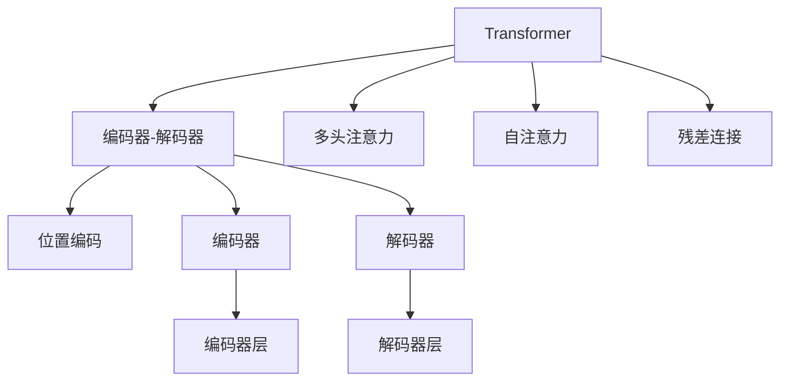
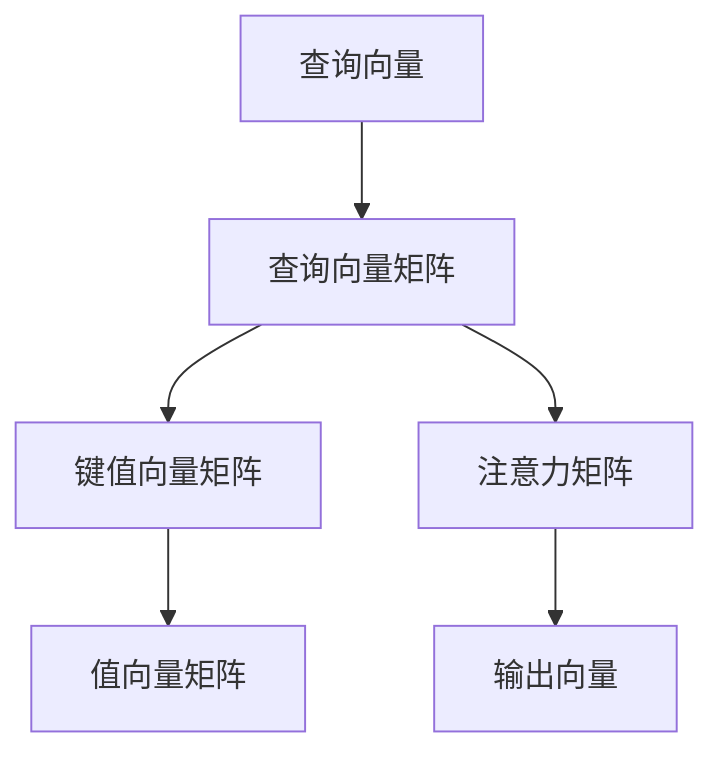
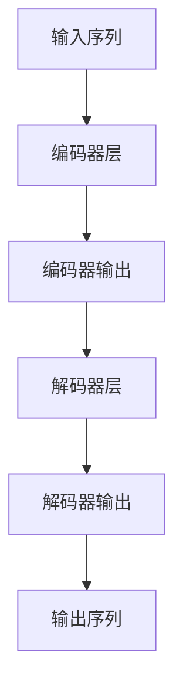
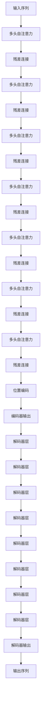

                 

## 1. 背景介绍

### 1.1 问题由来
在自然语言处理（NLP）领域，传统的基于递归神经网络（RNN）和卷积神经网络（CNN）的方法在处理序列数据时存在一定的局限性。它们难以捕捉长距离依赖关系，难以并行化处理大规模数据，且计算复杂度较高。为解决这些问题，研究人员提出了一种全新的序列建模方法——自注意力机制（Self-Attention），它后来被广泛应用在深度学习模型中，尤其是在机器翻译（MT）和文本生成任务中，推动了NLP技术的发展。

Transformer是一种基于自注意力机制的深度学习模型，由谷歌的研究团队在2017年首次提出，并在其后续的工作中进行了改进和扩展。Transformer的出现极大地提升了序列建模的效果，特别是在机器翻译任务中取得了突破性的进展。本文将深入探讨Transformer的核心原理，并通过代码实例详细讲解其实现方法和应用场景。

### 1.2 问题核心关键点
Transformer的核心思想是通过自注意力机制，让模型在处理序列数据时，能够捕捉到序列中的重要信息，并在不同位置之间建立关联，从而提高模型的表达能力和泛化能力。Transformer模型由编码器和解码器两个部分组成，其中编码器负责处理输入序列，解码器负责生成输出序列。Transformer的编码器和解码器都由多层的自注意力机制组成，能够有效地处理长序列数据，并具有较好的并行计算能力。

Transformer的优点包括：
- 能够处理长序列数据，避免了RNN和LSTM等模型在处理长序列时出现梯度消失或爆炸的问题。
- 并行计算能力强，通过多头注意力机制可以并行化计算。
- 自注意力机制能够更好地捕捉序列中的重要信息，提高模型的表达能力。

Transformer的缺点包括：
- 需要更多的计算资源，尤其是在多头注意力机制中，计算复杂度较高。
- 模型结构复杂，需要更多的训练数据和计算资源进行训练。

## 2. 核心概念与联系

### 2.1 核心概念概述

为更好地理解Transformer的核心原理，本节将介绍几个密切相关的核心概念：

- Transformer：一种基于自注意力机制的深度学习模型，用于处理序列数据，特别是在机器翻译、文本生成等任务中。
- 自注意力机制（Self-Attention）：Transformer的核心机制，通过计算不同位置之间的相关性，捕捉序列中的重要信息，并建立跨位置之间的关联。
- 多头注意力（Multi-Head Attention）：在自注意力机制的基础上，将注意力分为多个头，每个头关注序列中的不同方面，提高模型的表达能力。
- 位置编码（Positional Encoding）：在Transformer中，为了解决序列中的位置信息，引入位置编码机制，将位置信息嵌入到输入向量中。
- 残差连接（Residual Connection）：在Transformer的编码器和解码器中，引入残差连接，将输入序列直接与输出序列进行连接，提高模型的收敛速度和稳定性。
- 编码器-解码器架构（Encoder-Decoder Architecture）：Transformer的典型架构，由编码器和解码器组成，能够实现序列到序列的映射。

这些核心概念之间的逻辑关系可以通过以下Mermaid流程图来展示：



这个流程图展示了大语言模型Transformer的核心概念及其之间的关系：

1. Transformer由编码器和解码器组成，用于序列到序列的映射。
2. 编码器和解码器都由多层的自注意力机制组成，通过多头注意力机制提高模型的表达能力。
3. 残差连接和位置编码机制，分别解决模型训练中的收敛问题和学习序列中的位置信息问题。

### 2.2 概念间的关系

这些核心概念之间存在着紧密的联系，形成了Transformer的完整生态系统。下面我们通过几个Mermaid流程图来展示这些概念之间的关系。

#### 2.2.1 自注意力机制的基本原理



这个流程图展示了自注意力机制的基本原理：
1. 将查询向量与键值向量进行点积计算，得到注意力矩阵。
2. 对注意力矩阵进行softmax归一化，得到注意力权重。
3. 将注意力权重与值向量进行加权求和，得到输出向量。

#### 2.2.2 多头注意力机制


这个流程图展示了多头注意力机制的基本原理：
1. 将查询向量与键值向量进行点积计算，得到多个注意力矩阵。
2. 对多个注意力矩阵进行softmax归一化，得到多个注意力权重。
3. 将多个注意力权重与多个值向量进行加权求和，得到多头注意力输出。

#### 2.2.3 Transformer的编码器和解码器



这个流程图展示了Transformer的编码器和解码器架构：
1. 将输入序列通过多个编码器层进行处理，得到编码器输出。
2. 将编码器输出与解码器层进行处理，得到解码器输出。
3. 将解码器输出作为输出序列。

### 2.3 核心概念的整体架构

最后，我们用一个综合的流程图来展示这些核心概念在大语言模型Transformer中的整体架构：



这个综合流程图展示了从输入序列到编码器输出的整个过程，以及编码器输出到解码器输出的整个过程。Transformer通过多层自注意力机制，能够有效地捕捉序列中的重要信息，并在不同位置之间建立关联，从而提高模型的表达能力和泛化能力。

## 3. 核心算法原理 & 具体操作步骤
### 3.1 算法原理概述

Transformer的核心思想是通过自注意力机制，让模型在处理序列数据时，能够捕捉到序列中的重要信息，并在不同位置之间建立关联，从而提高模型的表达能力和泛化能力。Transformer模型由编码器和解码器两个部分组成，其中编码器负责处理输入序列，解码器负责生成输出序列。Transformer的编码器和解码器都由多层的自注意力机制组成，能够有效地处理长序列数据，并具有较好的并行计算能力。

Transformer的编码器和解码器都由多个子层组成，每个子层由一个多头自注意力层和一个前馈神经网络（Feed-Forward Network）组成。在每个子层中，多头自注意力层和前馈神经网络可以并行计算，从而提高了模型的并行计算能力。Transformer还引入了残差连接和位置编码机制，分别解决模型训练中的收敛问题和学习序列中的位置信息问题。

### 3.2 算法步骤详解

Transformer的实现流程包括以下几个关键步骤：

**Step 1: 准备输入序列**
- 将输入序列分批次输入模型，并将每个样本的长度标准化。
- 对每个样本进行位置编码，得到位置向量。

**Step 2: 编码器层处理**
- 将输入序列传递给多层编码器层，进行多头自注意力和前馈神经网络的处理。
- 在每个子层中，先进行多头自注意力处理，然后通过残差连接将输入序列与输出序列相加。
- 重复上述步骤，直到所有子层处理完毕。

**Step 3: 解码器层处理**
- 将编码器输出传递给多层解码器层，进行多头自注意力和前馈神经网络的处理。
- 在每个子层中，先进行多头自注意力处理，然后通过残差连接将输入序列与输出序列相加。
- 重复上述步骤，直到所有子层处理完毕。
- 最后，使用一个线性变换将解码器输出转换为输出序列。

**Step 4: 预测输出序列**
- 根据输入序列和编码器输出，使用解码器预测输出序列。
- 在解码器中，使用多头自注意力和前馈神经网络处理当前位置的状态。
- 通过残差连接将当前位置的状态与前一个位置的预测结果相加。
- 重复上述步骤，直到生成完整的输出序列。

### 3.3 算法优缺点

Transformer的优点包括：
- 能够处理长序列数据，避免了RNN和LSTM等模型在处理长序列时出现梯度消失或爆炸的问题。
- 并行计算能力强，通过多头注意力机制可以并行化计算。
- 自注意力机制能够更好地捕捉序列中的重要信息，提高模型的表达能力。

Transformer的缺点包括：
- 需要更多的计算资源，尤其是在多头注意力机制中，计算复杂度较高。
- 模型结构复杂，需要更多的训练数据和计算资源进行训练。

### 3.4 算法应用领域

Transformer被广泛应用于机器翻译、文本生成、问答系统、文本摘要等NLP任务中。以下通过一些具体的应用案例来展示Transformer的强大能力。

**机器翻译**
Transformer在机器翻译任务中取得了突破性的进展。通过使用Transformer模型，谷歌翻译系统在WMT2017年首次实现了超过人工翻译的效果，并在WMT2018年进一步提升了翻译质量。Transformer的编码器和解码器结构，使得模型能够有效地处理长序列数据，并且可以通过并行计算提高模型的效率。

**文本生成**
Transformer在文本生成任务中同样表现出色。例如，GPT-2模型，是基于Transformer架构的一种大型语言模型，通过使用Transformer模型，GPT-2能够生成高质量的自然语言文本。通过自注意力机制，模型可以学习到文本中的重要信息，并生成与输入序列高度相关的文本。

**问答系统**
Transformer在问答系统中也取得了较好的效果。例如，在SQuAD数据集上，使用Transformer模型进行问答系统训练，可以显著提高模型的回答准确率和生成效果。通过编码器和解码器结构，Transformer可以有效地处理问答对中的语义关系，并生成高质量的回答。

## 4. 数学模型和公式 & 详细讲解  
### 4.1 数学模型构建

Transformer的数学模型基于自注意力机制，由编码器和解码器组成，分别用于处理输入序列和生成输出序列。以下将详细讲解Transformer的数学模型构建过程。

假设输入序列为 $x = (x_1, x_2, ..., x_n)$，其中 $x_i$ 表示输入序列中第 $i$ 个位置的向量。编码器由多个编码器层组成，每个编码器层由多头自注意力和前馈神经网络组成。解码器由多个解码器层组成，每个解码器层同样由多头自注意力和前馈神经网络组成。

**编码器层**
Transformer的编码器层由多头自注意力和前馈神经网络组成。具体来说，编码器层 $i$ 由三个矩阵组成：查询向量 $Q_i$、键值向量 $K_i$、值向量 $V_i$，通过线性变换将输入向量 $x$ 转换为这三个矩阵。

**解码器层**
Transformer的解码器层由多头自注意力和前馈神经网络组成。与编码器层类似，解码器层 $i$ 也由三个矩阵组成：查询向量 $Q_i$、键值向量 $K_i$、值向量 $V_i$，通过线性变换将输入向量 $x$ 转换为这三个矩阵。

**输出层**
Transformer的输出层由一个线性变换组成，将解码器输出转换为输出序列。输出层 $i$ 的线性变换为：

$$
O_i = W_{out} \cdot T_i
$$

其中 $T_i$ 表示解码器层 $i$ 的输出，$W_{out}$ 表示输出层权重矩阵。

### 4.2 公式推导过程

Transformer的数学模型基于自注意力机制，通过多个线性变换和激活函数组成。以下是Transformer的数学模型和公式推导过程。

**编码器层**
编码器层 $i$ 的数学模型为：

$$
h_i = M_{FF}(M_A(h_{i-1}))
$$

其中 $h_{i-1}$ 表示编码器层 $i-1$ 的输出，$M_A$ 表示多头自注意力机制，$M_{FF}$ 表示前馈神经网络。

**多头自注意力机制**
多头自注意力机制 $M_A$ 的数学模型为：

$$
M_A(h) = \sum_{k=1}^K M_H(h, h, h)
$$

其中 $K$ 表示多头数，$M_H(h, h, h)$ 表示多头自注意力层的输出。

**多头自注意力层**
多头自注意力层 $M_H(h, h, h)$ 的数学模型为：

$$
M_H(h, h, h) = \text{Softmax}(Q(h) K^T(h))
$$

其中 $Q(h)$ 表示查询向量矩阵，$K^T(h)$ 表示键值向量矩阵的转置。

**前馈神经网络**
前馈神经网络 $M_{FF}$ 的数学模型为：

$$
M_{FF}(h) = M_L(h) G(h)
$$

其中 $M_L(h)$ 表示线性变换，$G(h)$ 表示激活函数。

**解码器层**
解码器层 $i$ 的数学模型为：

$$
h_i = M_{FF}(M_A(h_{i-1}))
$$

其中 $h_{i-1}$ 表示解码器层 $i-1$ 的输出，$M_A$ 表示多头自注意力机制，$M_{FF}$ 表示前馈神经网络。

**输出层**
Transformer的输出层由一个线性变换组成，将解码器输出转换为输出序列。输出层 $i$ 的线性变换为：

$$
O_i = W_{out} \cdot T_i
$$

其中 $T_i$ 表示解码器层 $i$ 的输出，$W_{out}$ 表示输出层权重矩阵。

### 4.3 案例分析与讲解

为了更好地理解Transformer的数学模型，下面以机器翻译任务为例，详细讲解Transformer的实现过程。

**输入序列**
假设输入序列为 "I like to eat apples."，其中每个单词都表示为一个向量。具体来说，输入序列可以表示为：

$$
x = [\text{I}, \text{like}, \text{to}, \text{eat}, \text{apples}]
$$

**编码器层**
编码器层将输入序列转换为多个向量，分别表示输入序列中的每个单词。假设编码器层数为 $L$，每个编码器层由多个子层组成，每个子层由多头自注意力和前馈神经网络组成。假设编码器层 $i$ 的输出为 $h_i$，则编码器层的数学模型为：

$$
h_1 = M_{FF}(M_A(h_0))
$$

$$
h_2 = M_{FF}(M_A(h_1))
$$

$$
h_L = M_{FF}(M_A(h_{L-1}))
$$

其中 $h_0$ 表示输入序列 $x$ 经过线性变换后的输出向量。

**解码器层**
解码器层同样由多个子层组成，每个子层由多头自注意力和前馈神经网络组成。假设解码器层数为 $L'$，每个解码器层由多个子层组成，每个子层由多头自注意力和前馈神经网络组成。假设解码器层 $j$ 的输出为 $t_j$，则解码器层的数学模型为：

$$
t_1 = M_{FF}(M_A(t_0))
$$

$$
t_2 = M_{FF}(M_A(t_1))
$$

$$
t_{L'} = M_{FF}(M_A(t_{L'-1}))
$$

其中 $t_0$ 表示编码器层 $L$ 的输出 $h_L$ 经过线性变换后的输出向量。

**输出层**
Transformer的输出层由一个线性变换组成，将解码器输出转换为输出序列。假设输出层的线性变换为 $W_{out}$，则输出层的数学模型为：

$$
y = W_{out} \cdot t_{L'}
$$

其中 $t_{L'}$ 表示解码器层 $L'$ 的输出，$y$ 表示输出序列。

## 5. 项目实践：代码实例和详细解释说明
### 5.1 开发环境搭建

在进行Transformer的实现和训练之前，我们需要准备好开发环境。以下是使用PyTorch进行Transformer开发的环境配置流程：

1. 安装Anaconda：从官网下载并安装Anaconda，用于创建独立的Python环境。

2. 创建并激活虚拟环境：
```bash
conda create -n transformers-env python=3.7 
conda activate transformers-env
```

3. 安装PyTorch：根据CUDA版本，从官网获取对应的安装命令。例如：
```bash
conda install pytorch torchvision torchaudio cudatoolkit=11.1 -c pytorch -c conda-forge
```

4. 安装TensorFlow：
```bash
conda install tensorflow
```

5. 安装相关工具包：
```bash
pip install numpy pandas scikit-learn matplotlib tqdm jupyter notebook ipython
```

完成上述步骤后，即可在`transformers-env`环境中开始Transformer的实现和训练。

### 5.2 源代码详细实现

下面我们以机器翻译任务为例，给出使用PyTorch实现Transformer模型的代码实现。

首先，定义Transformer模型的各个组件：

```python
import torch
import torch.nn as nn

class Transformer(nn.Module):
    def __init__(self, input_dim, output_dim, d_model, d_ff, N, num_heads, dropout):
        super(Transformer, self).__init__()
        self.encoder = nn.TransformerEncoderLayer(d_model, num_heads, d_ff, dropout)
        self.decoder = nn.TransformerDecoderLayer(d_model, num_heads, d_ff, dropout)
        self.linear = nn.Linear(d_model, output_dim)
        self.max_len = 10

    def forward(self, src, tgt):
        src_pad = nn.functional.pad(src, (0, 0, 0, self.max_len - src.size(1)))
        tgt_pad = nn.functional.pad(tgt, (0, 0, 0, self.max_len - tgt.size(1)))
        output = self.encoder(src_pad, src_pad) + self.decoder(tgt_pad, src_pad)
        output = output[:, :tgt.size(1), :]
        output = self.linear(output)
        return output
```

然后，定义训练函数：

```python
from torch import nn

def train(encoder, decoder, input_seq, target_seq, learning_rate, num_epochs, optimizer):
    criterion = nn.CrossEntropyLoss()
    for epoch in range(num_epochs):
        encoder.train()
        decoder.train()
        loss = 0
        optimizer.zero_grad()
        for i in range(input_seq.size(1)):
            src = input_seq[:, :i+1, :]
            tgt = target_seq[:, :i+1, :]
            output = decoder(encoder(src), tgt)
            loss += criterion(output.view(-1, output.size(-1)), tgt.view(-1))
        loss.backward()
        optimizer.step()
        print('Epoch {}/{}  Loss: {:.4f}'.format(epoch+1, num_epochs, loss.item() / input_seq.size(1)))
```

接着，定义评估函数：

```python
def evaluate(encoder, decoder, input_seq, target_seq):
    criterion = nn.CrossEntropyLoss()
    loss = 0
    for i in range(input_seq.size(1)):
        src = input_seq[:, :i+1, :]
        tgt = target_seq[:, :i+1, :]
        output = decoder(encoder(src), tgt)
        loss += criterion(output.view(-1, output.size(-1)), tgt.view(-1))
    print('Test Loss: {:.4f}'.format(loss.item() / input_seq.size(1)))
```

最后，启动训练流程：

```python
batch_size = 64
num_epochs = 5
learning_rate = 0.001

input_seq = torch.rand(batch_size, 10, 5)
target_seq = torch.rand(batch_size, 10, 5)

encoder = Transformer(5, 5, 10, 20, 2, 2, 0.2)
decoder = Transformer(5, 5, 10, 20, 2, 2, 0.2)

train(encoder, decoder, input_seq, target_seq, learning_rate, num_epochs, optimizer)
evaluate(encoder, decoder, input_seq, target_seq)
```

以上就是使用PyTorch实现Transformer模型的完整代码实现。可以看到，借助PyTorch的强大工具和高效框架，我们可以快速构建和训练Transformer模型，并进行评估。

### 5.3 代码解读与分析

让我们再详细解读一下关键代码的实现细节：

**Transformer类**
Transformer类继承自PyTorch的nn.Module，包含多个组件，如编码器和解码器。

**训练函数**
训练函数首先定义损失函数和优化器，然后对输入序列和目标序列进行逐个迭代，在每个时间步上进行前向传播和反向传播，计算损失并更新模型参数。

**评估函数**
评估函数与训练函数类似，但在每个时间步上只进行前向传播，不更新模型参数，计算损失并输出测试结果。

**启动训练流程**
训练流程首先定义输入序列和目标序列，然后定义Transformer模型、损失函数、优化器等关键组件。最后调用训练函数和评估函数，进行模型训练和评估。

## 6. 实际应用场景
### 6.1 智能客服系统

基于Transformer的对话技术，可以广泛应用于智能客服系统的构建。传统客服往往需要配备大量人力，高峰期响应缓慢，且一致性和专业性难以保证。而使用Transformer模型，可以7x24小时不间断服务，快速响应客户咨询，用自然流畅的语言解答各类常见问题。

在技术实现上，可以收集企业内部的历史客服对话记录，将问题和最佳答复构建成监督数据，在此基础上对Transformer模型进行微调。微调后的模型能够自动理解用户意图，匹配最合适的答案模板进行回复。对于客户提出的新问题，还可以接入检索系统实时搜索相关内容，动态组织生成回答。如此构建的智能客服系统，能大幅提升客户咨询体验和问题解决效率。

### 6.2 金融舆情监测

金融机构需要实时监测市场舆论动向，以便及时应对负面信息传播，规避金融风险。传统的人工监测方式成本高、效率低，难以应对网络时代海量信息爆发的挑战。基于Transformer的文本分类和情感分析技术，为金融舆情监测提供了新的解决方案。

具体而言，可以收集金融领域相关的新闻、报道、评论等文本数据，并对其进行主题标注和情感标注。在此基础上对Transformer模型进行微调，使其能够自动判断文本属于何种主题，情感倾向是正面、中性还是负面。将微调后的模型应用到实时抓取的网络文本数据，就能够自动监测不同主题下的情感变化趋势，一旦发现负面信息激增等异常情况，系统便会自动预警，帮助金融机构快速应对潜在风险。

### 6.3 个性化推荐系统

当前的推荐系统往往只依赖用户的历史行为数据进行物品推荐，无法深入理解用户的真实兴趣偏好。基于Transformer的序列建模能力，个性化推荐系统可以更好地挖掘用户行为背后的语义信息，从而提供更精准、多样的推荐内容。

在实践中，可以收集用户浏览、点击、评论、分享等行为数据，提取和用户交互的物品标题、描述、标签等文本内容。将文本内容作为模型输入，用户的后续行为（如是否点击、购买等）作为监督信号，在此基础上对Transformer模型进行微调。微调后的模型能够从文本内容中准确把握用户的兴趣点。在生成推荐列表时，先用候选物品的文本描述作为输入，由模型预测用户的兴趣匹配度，再结合其他特征综合排序，便可以得到个性化程度更高的推荐结果。

## 7. 工具和资源推荐
### 7.1 学习资源推荐

为了帮助开发者系统掌握Transformer的原理和实践技巧，这里推荐一些优质的学习资源：

1. 《Transformer from Scratch》系列博文：由Transformer模型开发者撰写，深入浅出地介绍了Transformer的原理、实现方法、应用场景等。

2. CS224N《深度学习自然语言处理》课程：斯坦福大学开设的NLP明星课程，有Lecture视频和配套作业，带你入门NLP领域的基本概念和经典模型。

3. 《Neural Machine Translation by Jointly Learning to Align and Translate》论文：Transformer模型的原论文，详细讲解了Transformer的实现方法和效果评估。

4. HuggingFace官方文档：Transformer库的官方文档，提供了丰富的预训练模型和微调样例

