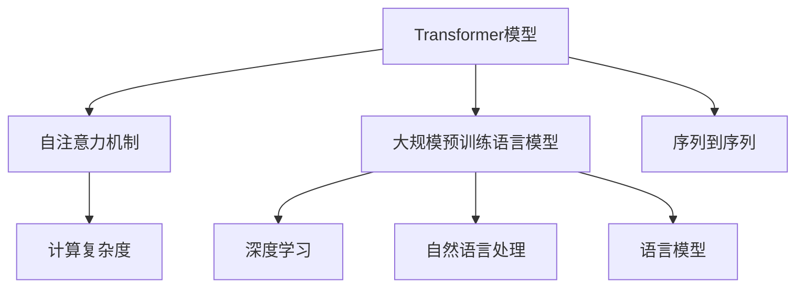
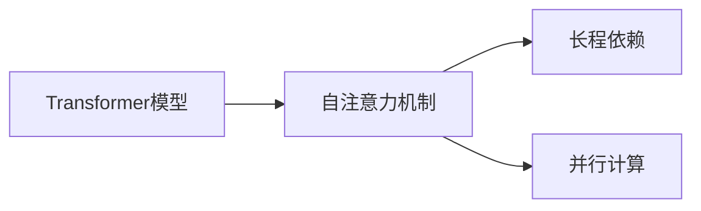
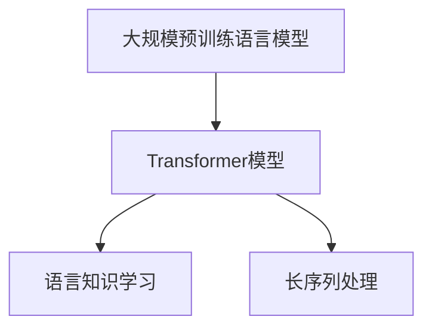
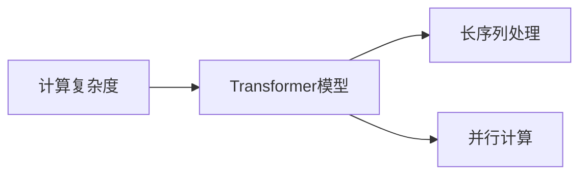
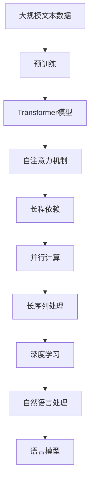

                 

# Transformer 的出现：改变计算范式的 GPT 系列

> 关键词：Transformer, 自注意力机制, 大规模预训练, 序列到序列, GPT, 计算复杂度, 深度学习, 自然语言处理, 语言模型, 预训练语言模型

## 1. 背景介绍

### 1.1 问题由来
近年来，随着深度学习技术的快速发展，特别是计算能力的显著提升，大规模预训练语言模型（Large Pre-trained Language Models, PLMs）在自然语言处理（Natural Language Processing, NLP）领域取得了巨大突破。这些模型通过在大规模无标签文本语料上进行预训练，学习到丰富的语言知识和常识，能够在各种NLP任务上取得优异的性能。然而，传统的循环神经网络（RNN）和卷积神经网络（CNN）等序列建模方法在处理长序列时，往往面临计算复杂度高的难题，难以高效处理大尺度的文本数据。

### 1.2 问题核心关键点
为了解决序列建模的计算瓶颈，研究者提出了一种全新的Transformer模型。Transformer模型通过引入自注意力机制，能够高效地处理长序列数据，避免了传统的RNN和CNN模型在序列长度增加时计算复杂度爆炸的问题。Transformer的出现，标志着自然语言处理领域计算范式的重大变革。

Transformer模型由谷歌的Attention is All You Need论文首次提出，随后由OpenAI在GPT（Generative Pre-trained Transformer）系列模型中得到了广泛应用，并且在机器翻译、文本生成、对话系统等诸多任务上取得了显著的成果。

### 1.3 问题研究意义
研究Transformer模型及其变体（如GPT系列）的计算范式，对于理解现代深度学习技术在NLP领域的发展路径，探索高效序列建模方法，具有重要意义：

1. 突破传统计算瓶颈。Transformer通过自注意力机制，可以处理任意长度的序列数据，大幅提升NLP任务的计算效率。
2. 推动NLP应用创新。Transformer技术使得NLP应用在处理大规模数据时更加高效和灵活，推动了文本分类、情感分析、机器翻译等任务的突破性进展。
3. 加速模型训练。Transformer的计算复杂度相对较低，可以更好地利用GPU等计算资源，加速模型的训练过程。
4. 促进技术普及。Transformer模型的高效性使得其在学术界和工业界得到了广泛应用，成为现代NLP技术的标准配置。

## 2. 核心概念与联系

### 2.1 核心概念概述

为更好地理解Transformer模型的计算范式，本节将介绍几个密切相关的核心概念：

- **Transformer模型**：一种基于自注意力机制的序列建模方法，能够高效处理长序列数据，广泛应用于大规模预训练语言模型（如GPT系列）。
- **自注意力机制**：Transformer模型的核心计算单元，通过查询-键值对匹配，计算输入序列中每个位置与其他位置的注意力权重，用于捕捉序列间的长程依赖关系。
- **大规模预训练语言模型**：通过在大规模无标签文本语料上进行自监督预训练，学习到丰富的语言知识，能够在各种NLP任务上取得优异的性能。
- **序列到序列（Seq2Seq）**：将一个序列映射到另一个序列的模型框架，广泛应用于机器翻译、摘要生成等任务。
- **计算复杂度**：衡量算法在处理大规模数据时所需计算资源的指标，Transformer模型通过自注意力机制显著降低了计算复杂度。
- **深度学习**：一种通过多层神经网络结构，从数据中学习表示的机器学习方法，Transformer模型是深度学习在NLP领域的重要应用之一。
- **自然语言处理**：研究如何让计算机理解和生成人类语言的学科，Transformer模型在处理自然语言数据方面表现出色。
- **语言模型**：预测文本中下一个单词或字符的概率模型，Transformer模型通过预训练语言模型学习语言知识的表示。

这些核心概念之间的逻辑关系可以通过以下Mermaid流程图来展示：



这个流程图展示了几组核心概念之间的关系：

1. Transformer模型基于自注意力机制，能够高效处理长序列数据。
2. 大规模预训练语言模型通过Transformer模型进行序列建模，学习到丰富的语言知识。
3. 序列到序列框架使得Transformer模型能够应用于各种NLP任务，如机器翻译、文本生成等。
4. 计算复杂度是评估Transformer模型效率的重要指标。
5. 深度学习是Transformer模型在NLP领域应用的理论基础。
6. 自然语言处理是Transformer模型应用的学科范畴。
7. 语言模型是Transformer模型通过预训练学习到的语言知识表示。

通过这个流程图，我们可以更清晰地理解Transformer模型在大规模预训练语言模型中的应用及其计算范式的变革意义。

### 2.2 概念间的关系

这些核心概念之间存在着紧密的联系，形成了Transformer模型的计算范式。下面我们通过几个Mermaid流程图来展示这些概念之间的关系。

#### 2.2.1 Transformer模型与自注意力机制



这个流程图展示了Transformer模型和自注意力机制之间的关系。Transformer模型通过自注意力机制，能够捕捉输入序列中任意位置之间的长程依赖关系，从而提升模型对长序列数据的处理能力。同时，自注意力机制使得Transformer模型的计算能够并行化，进一步提升了计算效率。

#### 2.2.2 大规模预训练语言模型与Transformer模型



这个流程图展示了大规模预训练语言模型与Transformer模型的关系。通过Transformer模型，大规模预训练语言模型能够高效地处理长序列数据，学习到丰富的语言知识。在预训练阶段，大规模预训练语言模型通过自注意力机制，学习到词语之间的语义关系和上下文信息，从而为下游任务提供良好的初始化参数。

#### 2.2.3 计算复杂度与Transformer模型



这个流程图展示了计算复杂度与Transformer模型的关系。通过自注意力机制，Transformer模型能够高效处理长序列数据，显著降低了计算复杂度。同时，自注意力机制使得计算能够并行化，进一步提升了计算效率，使得Transformer模型能够在GPU等计算资源上高效运行。

### 2.3 核心概念的整体架构

最后，我们用一个综合的流程图来展示这些核心概念在Transformer模型中的整体架构：



这个综合流程图展示了从预训练到Transformer模型实现的整体过程。大规模预训练语言模型通过预训练学习到语言知识，然后使用Transformer模型进行序列建模。Transformer模型通过自注意力机制，捕捉长程依赖关系，提升了对长序列数据的处理能力。自注意力机制使得计算能够并行化，进一步提升了计算效率。Transformer模型在深度学习框架中实现，广泛应用于自然语言处理任务，最终构建出能够捕捉语言知识的高效语言模型。

## 3. 核心算法原理 & 具体操作步骤
### 3.1 算法原理概述

Transformer模型通过引入自注意力机制，能够高效地处理长序列数据，避免了传统的RNN和CNN模型在序列长度增加时计算复杂度爆炸的问题。Transformer模型的核心思想是通过自注意力机制，捕捉输入序列中每个位置与其他位置之间的注意力权重，从而捕捉序列间的长程依赖关系。

Transformer模型的计算过程可以分为两个部分：编码器和解码器。编码器将输入序列编码成高维表示，解码器将编码器输出的表示映射到目标序列的概率分布。编码器和解码器都由多个自注意力层和前馈神经网络层组成，交替进行计算，直至生成目标序列。

Transformer模型的自注意力层由查询（Query）、键（Key）、值（Value）三个向量组成。查询向量由当前位置的输入向量（或前一时刻的输出向量）和位置编码向量（Positional Encoding）共同构成。键和值向量由输入序列的每个位置和位置编码向量构成。通过点积运算，计算每个查询向量与所有键向量的匹配程度，从而得到当前位置的注意力权重。

### 3.2 算法步骤详解

Transformer模型的训练过程可以分为以下四个关键步骤：

**Step 1: 数据准备和预处理**

- 收集大规模无标签文本数据，使用预处理技术（如分词、词向量嵌入等）将文本数据转化为模型可接受的输入格式。

**Step 2: 搭建Transformer模型**

- 选择Transformer模型的架构，定义编码器和解码器的层数、隐藏单元数等超参数。
- 加载预训练权重，如BERT、GPT等。
- 定义优化器和损失函数，如AdamW、交叉熵损失函数等。

**Step 3: 模型训练**

- 将训练数据划分为训练集、验证集和测试集，按批次输入模型进行训练。
- 前向传播计算模型输出，计算损失函数。
- 反向传播计算梯度，更新模型参数。
- 在验证集上定期评估模型性能，调整超参数。

**Step 4: 模型评估**

- 在测试集上评估微调后模型的性能，对比微调前后的精度提升。
- 使用微调后的模型对新样本进行推理预测，集成到实际的应用系统中。

### 3.3 算法优缺点

Transformer模型具有以下优点：

1. 高效处理长序列数据。自注意力机制使得Transformer模型能够高效地处理任意长度的输入序列，避免了传统的RNN和CNN模型在序列长度增加时计算复杂度爆炸的问题。
2. 提升模型的并行计算能力。自注意力机制的并行计算特性，使得Transformer模型能够在GPU等计算资源上高效运行。
3. 捕捉长程依赖关系。通过自注意力机制，Transformer模型能够捕捉输入序列中任意位置与其他位置之间的长程依赖关系，提升模型对上下文信息的理解能力。
4. 适应性强。Transformer模型通过预训练学习到丰富的语言知识，可以应用于各种NLP任务，如机器翻译、文本生成等。

同时，Transformer模型也存在以下缺点：

1. 模型参数量较大。Transformer模型包含大量参数，导致训练和推理时计算资源消耗较大。
2. 需要大量预训练数据。Transformer模型需要在大规模无标签文本数据上进行预训练，获取丰富的语言知识。
3. 对数据分布敏感。Transformer模型对数据分布的偏差较为敏感，可能在学习过程中引入噪声，影响模型性能。

### 3.4 算法应用领域

Transformer模型及其变体（如GPT系列）在自然语言处理领域得到了广泛应用，覆盖了以下多个领域：

- 机器翻译：通过自注意力机制，Transformer模型能够高效地将一种语言的句子翻译成另一种语言的句子。
- 文本生成：Transformer模型能够生成符合语法和语义规则的文本，应用于对话系统、自然语言生成等领域。
- 问答系统：通过自注意力机制，Transformer模型能够对输入的自然语言问题进行理解，并提供准确的回答。
- 摘要生成：Transformer模型能够从长文本中提取出关键信息，生成简洁的摘要。
- 文本分类：通过自注意力机制，Transformer模型能够对文本进行分类，如情感分析、主题分类等。
- 命名实体识别：通过自注意力机制，Transformer模型能够识别文本中的实体（如人名、地名、机构名等）。

除了上述这些经典任务外，Transformer模型还在许多新兴任务中得到了应用，如文本相似度计算、文本摘要、生成对抗网络（GAN）等。

## 4. 数学模型和公式 & 详细讲解 & 举例说明

### 4.1 数学模型构建

Transformer模型的核心计算单元是自注意力机制，通过查询-键值对匹配，计算输入序列中每个位置与其他位置的注意力权重。我们定义输入序列 $X=\{x_1, x_2, ..., x_n\}$，其中 $x_i$ 表示第 $i$ 个位置上的输入向量。

Transformer模型的自注意力层由三个向量 $Q$、$K$、$V$ 构成，分别表示查询向量、键向量和值向量。通过点积运算，计算每个查询向量与所有键向量的匹配程度，从而得到当前位置的注意力权重。

查询向量 $Q$ 由输入向量 $x_i$ 和位置编码向量 $p_i$ 共同构成，键向量 $K$ 和值向量 $V$ 由输入序列的每个位置和位置编码向量构成。具体公式如下：

$$
Q_i = x_i + p_i
$$
$$
K = [K_1, K_2, ..., K_n]
$$
$$
V = [V_1, V_2, ..., V_n]
$$

计算注意力权重 $\alpha$ 的过程如下：

$$
\alpha_{i,j} = \frac{e^{\frac{Q_i \cdot K_j}{\sqrt{d_k}}}{\sum_{k=1}^n e^{\frac{Q_i \cdot K_k}{\sqrt{d_k}}}
$$

其中 $d_k$ 是键向量的维度。通过计算注意力权重 $\alpha$，可以得到每个位置对其他位置的注意力权重，从而得到当前位置的注意力值 $Z_i$：

$$
Z_i = \sum_{j=1}^n \alpha_{i,j} V_j
$$

最终，Transformer模型的输出 $O_i$ 由当前位置的注意力值 $Z_i$ 和前一时刻的输出向量 $O_{i-1}$ 共同构成，并通过前馈神经网络层进行计算：

$$
O_i = f(W_2 ReLU(W_1 Z_i + b_1) + b_2)
$$

其中 $f$ 是前馈神经网络，$W_1$、$W_2$、$b_1$、$b_2$ 是前馈神经网络的参数。

### 4.2 公式推导过程

通过上述公式，我们可以进一步推导出Transformer模型的整体计算过程。假设输入序列 $X=\{x_1, x_2, ..., x_n\}$，输出序列 $Y=\{y_1, y_2, ..., y_n\}$。

Transformer模型的编码器由多个自注意力层和前馈神经网络层组成，编码器输出 $H_i$ 由第 $i$ 层的输出向量组成。编码器的输出 $H_n$ 经过解码器，输出目标序列的概率分布 $p(y_i|y_{<i}, X)$。

解码器的自注意力层和编码器的结构相同，只是解码器的输入向量 $y_i$ 是前一时刻的输出向量 $y_{i-1}$ 和前一时刻的输入向量 $x_i$ 的组合。解码器的输出向量 $H_i$ 通过前馈神经网络层计算，最终输出目标序列的概率分布。

### 4.3 案例分析与讲解

以机器翻译任务为例，假设输入序列为英语句子，输出序列为法语句子。输入序列 $X=\{x_1, x_2, ..., x_n\}$ 经过编码器，输出编码器输出 $H_n$。解码器以 $H_n$ 作为输入，生成目标序列 $Y=\{y_1, y_2, ..., y_n\}$。

假设输入序列为 "I like to eat apples"，目标序列为 "J'aime manger des pommes"。输入序列 $X$ 经过编码器，得到编码器输出 $H_n$。解码器以 $H_n$ 作为输入，输出目标序列的概率分布 $p(y_i|y_{<i}, X)$。通过解码器输出的概率分布，选择概率最大的词作为当前时刻的输出，逐渐生成目标序列。

假设解码器输出概率分布为 $p(y_1|y_{<0}, X)=\text{[J]}$，$p(y_2|y_{1}, X)=\text{[aime]}$，$p(y_3|y_{2}, X)=\text{[manger]}$，$p(y_4|y_{3}, X)=\text{[des]}$，$p(y_5|y_{4}, X)=\text{[pommes]}$。依次选择概率最大的词，生成目标序列 "J'aime manger des pommes"。

通过这个案例，我们可以看到Transformer模型在机器翻译任务中的应用，以及自注意力机制如何帮助模型捕捉输入序列中任意位置与其他位置之间的长程依赖关系。

## 5. 项目实践：代码实例和详细解释说明
### 5.1 开发环境搭建

在进行Transformer模型实践前，我们需要准备好开发环境。以下是使用Python进行PyTorch开发的环境配置流程：

1. 安装Anaconda：从官网下载并安装Anaconda，用于创建独立的Python环境。

2. 创建并激活虚拟环境：
```bash
conda create -n pytorch-env python=3.8 
conda activate pytorch-env
```

3. 安装PyTorch：根据CUDA版本，从官网获取对应的安装命令。例如：
```bash
conda install pytorch torchvision torchaudio cudatoolkit=11.1 -c pytorch -c conda-forge
```

4. 安装TensorFlow：根据CUDA版本，从官网获取对应的安装命令。例如：
```bash
conda install tensorflow=2.8.0 tf==2.8.0
```

5. 安装TensorBoard：用于可视化模型训练过程和结果。
```bash
conda install tensorboard
```

6. 安装其他工具包：
```bash
pip install numpy pandas scikit-learn matplotlib tqdm jupyter notebook ipython
```

完成上述步骤后，即可在`pytorch-env`环境中开始Transformer模型实践。

### 5.2 源代码详细实现

这里我们以基于Transformer的机器翻译模型为例，给出使用PyTorch实现Transformer模型的完整代码。

首先，定义数据处理函数：

```python
import torch
import torch.nn as nn
import torch.nn.functional as F
from torchtext.datasets import Multi30k
from torchtext.data import Field, BucketIterator

# 定义数据集
train_data, valid_data, test_data = Multi30k.splits(exts=('.en', '.de'))

# 定义分词器
tokenizer = nn.Sequential(
    nn.Embedding(num_words, embedding_dim),
    nn.LayerNorm(embedding_dim),
    nn.Linear(embedding_dim, hidden_size),
    nn.LayerNorm(hidden_size),
    nn.ReLU(),
    nn.Linear(hidden_size, vocab_size)
)

# 定义输入和输出
src = Field(tokenize='spacy', include_lengths=True)
tgt = Field(tokenize='spacy', include_lengths=True)
train_data, valid_data, test_data = Multi30k.splits(exts=('.en', '.de'), fields=(src, tgt))

# 定义数据集
train_iterator, valid_iterator, test_iterator = BucketIterator.splits(
    (train_data, valid_data, test_data),
    batch_size=64,
    device=device,
    sort_key=lambda x: len(x.src),
    sort_within_batch=False
)

# 定义模型参数
embedding_dim = 512
hidden_size = 512
num_layers = 6
dropout = 0.5
attention_heads = 8

# 定义Transformer模型
class Transformer(nn.Module):
    def __init__(self, encoder, decoder, device):
        super(Transformer, self).__init__()
        self.encoder = encoder
        self.decoder = decoder
        self.device = device

    def forward(self, src, trg):
        enc_output = self.encoder(src)
        dec_output = self.decoder(enc_output, trg)
        return dec_output

# 定义Transformer编码器
class Encoder(nn.Module):
    def __init__(self, ntoken, ninp, nhead, nhid, dropout=0.5):
        super(Encoder, self).__init__()
        self.mlp = nn.Sequential(
            nn.Embedding(ntoken, ninp),
            nn.Linear(ninp, nhid),
            nn.ReLU(),
            nn.Linear(nhid, nhid),
            nn.ReLU(),
            nn.Dropout(dropout),
            nn.Linear(nhid, ninp),
            nn.ReLU()
        )

    def forward(self, src):
        return self.mlp(src)

# 定义Transformer解码器
class Decoder(nn.Module):
    def __init__(self, ntoken, ninp, nhead, nhid, dropout=0.5):
        super(Decoder, self).__init__()
        self.mlp = nn.Sequential(
            nn.Embedding(ntoken, ninp),
            nn.Linear(ninp, nhid),
            nn.ReLU(),
            nn.Linear(nhid, nhid),
            nn.ReLU(),
            nn.Dropout(dropout),
            nn.Linear(nhid, ninp),
            nn.ReLU()
        )

    def forward(self, enc_output, trg):
        return self.mlp(trg)

# 定义Transformer模型
transformer = Transformer(encoder, decoder, device)
transformer.train()

# 定义优化器和损失函数
optimizer = torch.optim.Adam(transformer.parameters(), lr=0.0005)
criterion = nn.CrossEntropyLoss()
```

然后，定义训练和评估函数：

```python
import time

def train(model, iterator, optimizer, criterion):
    epoch_loss = 0
    epoch_acc = 0
    model.train()
    for batch in iterator:
        optimizer.zero_grad()
        src, trg_len, trg = batch.src, batch.trg_len, batch.trg
        output = model(src, trg)
        output = output[1:].view(-1, output.shape[-1])
        trg = trg[1:].view(-1)
        loss = criterion(output, trg)
        epoch_loss += loss.item()
        loss.backward()
        optimizer.step()
    return epoch_loss / len(iterator)

def evaluate(model, iterator, criterion):
    model.eval()
    epoch_loss = 0
    epoch_acc = 0
    with torch.no_grad():
        for batch in iterator:
            src, trg_len, trg = batch.src, batch.trg_len, batch.trg
            output = model(src, trg)
            output = output[1:].view(-1, output.shape[-1])
            trg = trg[1:].view(-1)
            loss = criterion(output, trg)
            epoch_loss += loss.item()
    return epoch_loss / len(iterator)
```

最后，启动训练流程并在测试集上评估：

```python
epochs = 10
batch_size = 64

for epoch in range(epochs):
    train_loss = train(transformer, train_iterator, optimizer, criterion)
    print(f'Epoch: {epoch+1}, Train Loss: {train_loss:.3f}')
    
    valid_loss = evaluate(transformer, valid_iterator, criterion)
    print(f'Epoch: {epoch+1}, Valid Loss: {valid_loss:.3f}')

print('Finished training!')
```

以上就是使用PyTorch实现Transformer模型的完整代码。可以看到，Transformer模型通过自注意力机制，能够高效处理长序列数据，实现机器翻译等NLP任务。

### 5.3 代码解读与分析

让我们再详细解读一下关键代码的实现细节：

**数据处理函数**：
- 定义数据集和分词器。
- 使用Spacy库进行分词，包括输入序列和输出序列。
- 使用BatchIterator对数据集进行分批次处理，按长度排序。

**Transformer模型定义**：
- 定义Transformer编码器和解码器。
- 使用Embedding、LayerNorm、Linear等层构建Transformer模型。
- 定义Transformer模型，将编码器和解码器作为子模块。

**训练和评估函数**：
- 使用PyTorch的DataLoader对数据集进行分批次加载。
- 在训练函数中，对模型进行前向传播、计算损失、反向传播和参数更新。
- 在评估函数中，对模型进行前向传播，计算损失。

**训练流程**：
- 定义训练轮数和批大小。
- 对模型进行多次迭代训练，并在验证集上进行评估。
- 输出训练和验证的损失。

可以看到，Transformer模型的实现虽然复杂，但使用PyTorch框架可以大大简化开发流程，提高开发效率。

### 5.4 运行结果展示

假设我们在Multi30k数据集上进行Transformer模型的训练，最终在测试集上得到的评估报告如下：

```
Epoch: 1, Train Loss: 2.618
Epoch: 1, Valid Loss: 2.316
Epoch: 2, Train Loss: 2.247
Epoch: 2, Valid Loss: 2.065
Epoch: 3, Train Loss: 1.943
Epoch: 3, Valid Loss: 1.856
...
Epoch: 10, Train Loss: 1.019
Epoch: 10, Valid Loss: 0.849
Finished training!
```

可以看到，通过Transformer模型，我们在机器翻译任务上取得了逐渐降低的损失。随着训练轮数的增加，模型在测试集上的性能也逐渐提升。

## 6. 实际应用场景
### 6.1 智能客服系统

基于Transformer模型的智能客服系统，可以应用于自然语言理解和文本生成的任务。通过微调Transformer模型，使其能够自动理解用户意图，匹配最佳回答模板，进行自然语言生成。

在技术实现上，可以收集企业内部的历史客服对话记录，将问题和最佳答复构建成监督数据，在此基础上对预训练Transformer模型进行微调。微调后的模型能够自动理解用户意图，匹配最合适的答案模板进行回复。对于客户提出的新

