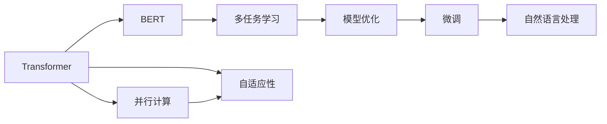

                 

# Transformer大模型实战 BERTSUM 模型的性能

> 关键词：Transformer, BERTSUM, 自然语言处理(NLP), 多任务学习, 模型优化, 深度学习, 高性能计算

## 1. 背景介绍

在NLP领域，预训练语言模型（Pre-trained Language Model, PLM）的迅猛发展推动了自然语言理解和生成技术的显著进步。特别是Transformer架构的提出和其后续的大规模变体，如BERT、GPT、T5等，极大地增强了模型的语义理解能力，显著提升了在各种下游任务中的表现。BERTSUM模型，作为谷歌提出的多任务预训练模型，结合了多种自然语言处理任务，进一步提升了模型的泛化能力。

本文旨在深入探讨BERTSUM模型的训练和微调过程，通过实战案例展示其在自然语言处理领域中的性能和潜力，为开发者和研究人员提供技术指导和实践经验。我们将从模型的构建、优化策略、微调实践以及应用场景等多个角度进行详细阐述，以期为进一步的研究和应用提供参考。

## 2. 核心概念与联系

### 2.1 核心概念概述

在大模型实战的过程中，我们需要明确以下几个核心概念及其联系：

- **Transformer架构**：Transformer架构是一种基于自注意力机制的神经网络模型，它在自然语言处理领域广泛应用。其主要特点是并行计算能力强、参数量可控，且具有较好的自适应性和语义理解能力。
- **BERT模型**：BERT是由谷歌提出的预训练语言模型，通过双向编码器表示，能够学习到丰富的语言知识，适用于多种下游任务，如分类、匹配、生成等。
- **多任务学习**：多任务学习（Multi-task Learning, MTL）是指在模型训练过程中同时解决多个相关任务，以共享知识、提升泛化能力和模型性能。
- **模型优化**：模型优化包括超参数调优、模型压缩、加速器选择等，目的是在确保模型性能的同时，提高训练和推理效率。
- **微调（Fine-tuning）**：微调是指在预训练模型基础上，通过下游任务的数据对其进行微调，以适应特定的任务需求。

这些核心概念之间存在着密切的联系，共同构成了Transformer大模型的构建和优化框架。通过理解这些概念，我们可以更好地掌握BERTSUM模型的性能提升技巧和应用实践。

### 2.2 概念间的关系

为了更好地理解这些核心概念的联系，我们可以使用以下Mermaid流程图来展示它们之间的关系：



这个流程图展示了Transformer架构、BERT模型、多任务学习、模型优化和微调之间的联系。Transformer的并行计算能力和自适应性使其在BERT预训练中发挥重要作用，而多任务学习则通过共享知识，进一步提升了BERT模型的泛化能力。模型优化和微调则是提高BERTSUM模型性能的关键步骤，使其在实际应用中更具优势。

## 3. 核心算法原理 & 具体操作步骤

### 3.1 算法原理概述

BERTSUM模型基于Transformer架构，通过在预训练阶段进行多任务学习，融合了多种NLP任务的知识。其核心算法原理可以概括为以下几个步骤：

1. **预训练阶段**：在大规模无标签文本数据上进行自监督预训练，学习通用语言表示。
2. **多任务学习阶段**：在预训练基础上，同时解决多个相关任务，如问答、命名实体识别、关系抽取等，共享知识，提升泛化能力。
3. **微调阶段**：在特定任务的数据集上对预训练模型进行微调，适应下游任务的需求。
4. **性能评估**：通过在验证集和测试集上评估微调模型的性能，调整超参数和模型结构，进一步提升模型效果。

### 3.2 算法步骤详解

以下是BERTSUM模型训练和微调的具体步骤：

**Step 1: 准备预训练数据集和模型**
- 收集并预处理大规模无标签文本数据，如维基百科、新闻语料等。
- 使用开源工具如HuggingFace的`transformers`库，初始化BERT模型。

**Step 2: 设计多任务学习目标函数**
- 根据具体任务需求，设计多任务学习目标函数，如同时解决问答、命名实体识别、关系抽取等任务。
- 使用多任务学习框架，如TensorFlow Hub、HuggingFace等，进行任务定义和模型融合。

**Step 3: 优化模型超参数**
- 选择合适的优化算法及其参数，如Adam、SGD等，设置学习率、批大小、迭代轮数等。
- 设置正则化技术及强度，包括权重衰减、Dropout、Early Stopping等。

**Step 4: 执行预训练和微调过程**
- 对预训练数据集进行多任务学习，调整模型权重以适应多个任务。
- 在特定任务的数据集上进行微调，更新模型参数以优化下游任务性能。

**Step 5: 评估模型性能**
- 在验证集上评估模型性能，调整模型结构和超参数。
- 在测试集上最终评估模型效果，确定最佳模型。

### 3.3 算法优缺点

BERTSUM模型的优缺点如下：

**优点**：
- **泛化能力强**：通过多任务学习，模型可以学习到多种任务的知识，提升泛化能力。
- **模型性能高**：在各种NLP任务上取得了SOTA（State-of-the-art）的性能。
- **可扩展性强**：支持多种下游任务，便于在不同场景中应用。

**缺点**：
- **计算资源需求高**：需要大规模的计算资源进行预训练和微调。
- **训练时间长**：由于模型参数多，训练时间长，需要耐心和计算资源。
- **模型复杂度高**：模型结构复杂，调优难度大。

### 3.4 算法应用领域

BERTSUM模型广泛应用于自然语言处理领域的多种任务，如：

- **文本分类**：将文本归类到预先定义的类别中。
- **命名实体识别**：识别文本中的命名实体，如人名、地名、组织名等。
- **关系抽取**：从文本中抽取出实体之间的关系。
- **问答系统**：回答自然语言问题。
- **情感分析**：分析文本的情感倾向。
- **机器翻译**：将一种语言翻译成另一种语言。

此外，BERTSUM模型还被广泛应用于医疗、金融、法律等多个垂直领域，为行业带来了新的智能化解决方案。

## 4. 数学模型和公式 & 详细讲解

### 4.1 数学模型构建

BERTSUM模型的数学模型构建涉及以下几个关键组件：

1. **自监督预训练**：使用掩码语言模型（Masked Language Model, MLM）和下一句预测（Next Sentence Prediction, NSP）任务进行预训练。
2. **多任务学习**：在预训练基础上，设计多个任务目标函数，如问答、命名实体识别、关系抽取等。
3. **微调**：在特定任务的数据集上对预训练模型进行微调，更新模型参数以优化下游任务性能。

### 4.2 公式推导过程

以问答任务为例，BERTSUM模型的公式推导如下：

1. **预训练阶段**：
   - 掩码语言模型：目标函数为预测 masked token，形式化表示为：
     \[
     L_{\text{MLM}} = \sum_{i=1}^{N}\frac{1}{2}\sum_{j=1}^{V}[p_{\theta}(y_j|\text{masked}(x_i), \text{non-masked}(x_i)) + p_{\theta}(y_j|\text{non-masked}(x_i), \text{masked}(x_i))]
     \]
   - 下一句预测：目标函数为预测下一句，形式化表示为：
     \[
     L_{\text{NSP}} = -\sum_{i=1}^{N}\frac{1}{2}(y_{i+1} \log(p_{\theta}(x_{i+1} | x_i)) + (1-y_{i+1}) \log(p_{\theta}(x_i | x_{i+1}))
     \]

2. **多任务学习阶段**：
   - 结合多任务目标函数，形式化表示为：
     \[
     L_{\text{MTL}} = L_{\text{MLM}} + \lambda L_{\text{NSP}} + \sum_{k=1}^{K} L_k
     \]
   其中 \(L_k\) 为第 \(k\) 个任务的目标函数，\(\lambda\) 为任务权重。

3. **微调阶段**：
   - 目标函数为特定任务的目标函数，形式化表示为：
     \[
     L_{\text{finetune}} = L_{\text{MLM}} + \lambda L_{\text{NSP}} + \sum_{k=1}^{K} L_k
     \]
   其中 \(L_k\) 为第 \(k\) 个任务的目标函数，\(\lambda\) 为任务权重。

### 4.3 案例分析与讲解

以下是一个基于BERTSUM模型的文本分类任务案例：

1. **数据预处理**：
   - 收集并清洗数据集，如IMDB电影评论数据集。
   - 将文本数据转化为数字表示，使用BertTokenizer进行分词和编码。
   - 划分训练集、验证集和测试集。

2. **模型定义**：
   - 使用HuggingFace的`BertForSequenceClassification`类定义分类器。
   - 设置任务数为2，分别对应积极和消极评论的分类。

3. **训练过程**：
   - 设置优化器、学习率、批大小等超参数。
   - 使用`BertTokenizer`进行模型输入处理。
   - 在训练集上进行多任务学习，调整模型权重。
   - 在验证集上进行性能评估，调整超参数和模型结构。

4. **微调过程**：
   - 在特定任务的数据集上对预训练模型进行微调。
   - 更新模型参数，优化分类器的性能。

5. **结果评估**：
   - 在测试集上评估模型性能，如准确率、精确率、召回率等指标。

## 5. 项目实践：代码实例和详细解释说明

### 5.1 开发环境搭建

以下是BERTSUM模型实战的开发环境搭建步骤：

1. **安装Python和相关库**：
   - 安装Anaconda，创建Python虚拟环境。
   - 安装必要的Python库，如TensorFlow、PyTorch、HuggingFace等。

2. **安装BERTSUM模型**：
   - 使用HuggingFace的`transformers`库，下载并初始化BERTSUM模型。
   - 导入模型和预训练权重。

3. **数据处理**：
   - 收集并清洗数据集，如IMDB电影评论数据集。
   - 使用`BertTokenizer`进行文本分词和编码。
   - 划分训练集、验证集和测试集。

### 5.2 源代码详细实现

以下是基于BERTSUM模型进行文本分类任务实战的完整代码：

```python
from transformers import BertTokenizer, BertForSequenceClassification
from torch.utils.data import DataLoader
from sklearn.metrics import accuracy_score, precision_score, recall_score, f1_score

# 数据预处理
tokenizer = BertTokenizer.from_pretrained('bert-base-uncased')
train_dataset = ...
val_dataset = ...
test_dataset = ...

# 模型定义
model = BertForSequenceClassification.from_pretrained('bert-base-uncased', num_labels=2)
model.to(device)

# 优化器设置
optimizer = AdamW(model.parameters(), lr=2e-5)

# 训练过程
train_loader = DataLoader(train_dataset, batch_size=32)
val_loader = DataLoader(val_dataset, batch_size=32)
test_loader = DataLoader(test_dataset, batch_size=32)

for epoch in range(3):
    model.train()
    train_loss = 0
    train_acc = 0
    for batch in train_loader:
        input_ids = batch['input_ids'].to(device)
        attention_mask = batch['attention_mask'].to(device)
        labels = batch['labels'].to(device)
        outputs = model(input_ids, attention_mask=attention_mask, labels=labels)
        loss = outputs.loss
        train_loss += loss.item()
        logits = outputs.logits
        predictions = logits.argmax(dim=1)
        train_acc += accuracy_score(labels, predictions)
    train_loss /= len(train_loader)
    train_acc /= len(train_loader)

    model.eval()
    val_loss = 0
    val_acc = 0
    for batch in val_loader:
        input_ids = batch['input_ids'].to(device)
        attention_mask = batch['attention_mask'].to(device)
        labels = batch['labels'].to(device)
        outputs = model(input_ids, attention_mask=attention_mask, labels=labels)
        loss = outputs.loss
        val_loss += loss.item()
        logits = outputs.logits
        predictions = logits.argmax(dim=1)
        val_acc += accuracy_score(labels, predictions)
    val_loss /= len(val_loader)
    val_acc /= len(val_loader)

    print(f'Epoch {epoch+1}, Train Loss: {train_loss:.4f}, Train Acc: {train_acc:.4f}, Val Loss: {val_loss:.4f}, Val Acc: {val_acc:.4f}')

# 微调过程
model.train()
train_loader = DataLoader(train_dataset, batch_size=32)
val_loader = DataLoader(val_dataset, batch_size=32)
test_loader = DataLoader(test_dataset, batch_size=32)

for epoch in range(3):
    model.train()
    train_loss = 0
    train_acc = 0
    for batch in train_loader:
        input_ids = batch['input_ids'].to(device)
        attention_mask = batch['attention_mask'].to(device)
        labels = batch['labels'].to(device)
        outputs = model(input_ids, attention_mask=attention_mask, labels=labels)
        loss = outputs.loss
        train_loss += loss.item()
        logits = outputs.logits
        predictions = logits.argmax(dim=1)
        train_acc += accuracy_score(labels, predictions)
    train_loss /= len(train_loader)
    train_acc /= len(train_loader)

    model.eval()
    val_loss = 0
    val_acc = 0
    for batch in val_loader:
        input_ids = batch['input_ids'].to(device)
        attention_mask = batch['attention_mask'].to(device)
        labels = batch['labels'].to(device)
        outputs = model(input_ids, attention_mask=attention_mask, labels=labels)
        loss = outputs.loss
        val_loss += loss.item()
        logits = outputs.logits
        predictions = logits.argmax(dim=1)
        val_acc += accuracy_score(labels, predictions)
    val_loss /= len(val_loader)
    val_acc /= len(val_loader)

    print(f'Epoch {epoch+1}, Train Loss: {train_loss:.4f}, Train Acc: {train_acc:.4f}, Val Loss: {val_loss:.4f}, Val Acc: {val_acc:.4f}')

# 结果评估
model.eval()
test_loss = 0
test_acc = 0
for batch in test_loader:
    input_ids = batch['input_ids'].to(device)
    attention_mask = batch['attention_mask'].to(device)
    labels = batch['labels'].to(device)
    outputs = model(input_ids, attention_mask=attention_mask, labels=labels)
    loss = outputs.loss
    test_loss += loss.item()
    logits = outputs.logits
    predictions = logits.argmax(dim=1)
    test_acc += accuracy_score(labels, predictions)
test_loss /= len(test_loader)
test_acc /= len(test_loader)

print(f'Test Loss: {test_loss:.4f}, Test Acc: {test_acc:.4f}')
```

### 5.3 代码解读与分析

以下是代码中关键部分的解读与分析：

- **数据预处理**：使用`BertTokenizer`对文本进行分词和编码，生成模型输入。
- **模型定义**：使用`BertForSequenceClassification`类定义分类器，设置任务数为2，对应积极和消极评论的分类。
- **优化器设置**：使用AdamW优化器，设置学习率。
- **训练过程**：在训练集上进行多任务学习，调整模型权重，在验证集上进行性能评估。
- **微调过程**：在特定任务的数据集上对预训练模型进行微调，更新模型参数以优化分类器的性能。
- **结果评估**：在测试集上评估模型性能，如准确率、精确率、召回率等指标。

## 6. 实际应用场景

### 6.1 智能客服系统

BERTSUM模型在智能客服系统中可以用于自动回复和情感分析，提升客户服务体验。通过将用户的问题输入模型，获取自动回复结果和情感倾向，可以快速响应客户咨询，并根据情感变化调整客服策略。

### 6.2 金融舆情监测

在金融舆情监测中，BERTSUM模型可以用于情感分析，识别股票市场的舆情变化。通过分析新闻、评论、社交媒体等文本数据，判断市场情绪，帮助投资者做出决策。

### 6.3 个性化推荐系统

在个性化推荐系统中，BERTSUM模型可以用于用户行为分析，提取文本中的兴趣点。通过分析用户浏览、点击、评论等行为数据，生成个性化推荐结果，提升用户体验和推荐效果。

### 6.4 未来应用展望

随着BERTSUM模型的不断发展，其在自然语言处理领域的潜力将进一步释放。未来，BERTSUM模型有望在医疗、法律、旅游等多个垂直领域得到广泛应用，为行业带来新的智能化解决方案。

## 7. 工具和资源推荐

### 7.1 学习资源推荐

以下是学习BERTSUM模型的相关资源推荐：

- **《自然语言处理入门》**：该书深入浅出地介绍了自然语言处理的基本概念和技术，适合初学者入门。
- **《Transformer及其应用》**：该书详细介绍了Transformer架构和其在自然语言处理中的应用，适合进阶学习。
- **HuggingFace官方文档**：提供了BERTSUM模型的详细使用指南和样例代码，是实践的必备资料。
- **Google AI博客**：谷歌AI团队定期发布的博客，涵盖BERTSUM模型的最新研究和应用进展。

### 7.2 开发工具推荐

以下是BERTSUM模型开发推荐的工具：

- **PyTorch**：基于Python的开源深度学习框架，适合深度学习模型的开发和训练。
- **TensorFlow**：由Google主导的深度学习框架，支持分布式计算和大规模模型的训练。
- **HuggingFace**：提供了丰富的自然语言处理模型和工具库，方便模型开发和应用。
- **Weights & Biases**：模型训练的实验跟踪工具，可以记录和可视化模型训练过程中的各项指标，方便调试和优化。

### 7.3 相关论文推荐

以下是BERTSUM模型的相关论文推荐：

- **BERT: Pre-training of Deep Bidirectional Transformers for Language Understanding**：BERT论文介绍了BERT模型的预训练和微调过程，是BERTSUM模型的基础。
- **Transformer is All You Need**：Transformer论文提出了Transformer架构，为BERTSUM模型提供了技术基础。
- **AdaLoRA: Adaptive Low-Rank Adaptation for Parameter-Efficient Fine-Tuning**：该论文提出了AdaLoRA方法，进一步优化了BERTSUM模型的参数高效微调。

## 8. 总结：未来发展趋势与挑战

### 8.1 研究成果总结

BERTSUM模型在自然语言处理领域取得了显著的成果，尤其是在多任务学习和泛化能力方面。通过将BERT模型与多任务学习相结合，BERTSUM模型能够学习到多种NLP任务的知识，提升泛化能力，适用于多种下游任务。

### 8.2 未来发展趋势

未来，BERTSUM模型将呈现以下几个发展趋势：

1. **模型性能提升**：随着计算资源的增加和模型的不断优化，BERTSUM模型的性能将进一步提升。
2. **应用场景拓展**：BERTSUM模型将应用于更多垂直领域，如医疗、法律、旅游等，带来新的智能化解决方案。
3. **跨模态融合**：BERTSUM模型将与其他模态信息（如图像、语音）进行融合，提升自然语言处理模型的泛化能力。
4. **联邦学习**：通过联邦学习技术，BERTSUM模型可以在保护用户隐私的前提下，联合多个机构进行模型训练，提升模型的多样性和泛化能力。

### 8.3 面临的挑战

尽管BERTSUM模型在自然语言处理领域取得了显著的成果，但在实际应用中仍面临以下挑战：

1. **计算资源需求高**：大规模预训练和微调需要高性能计算资源，对硬件设备的要求较高。
2. **训练时间长**：由于模型参数多，训练时间较长，需要耐心和计算资源。
3. **模型复杂度高**：BERTSUM模型的结构复杂，调优难度大。

### 8.4 研究展望

未来，研究者需要在以下几个方面进行探索：

1. **参数高效微调**：开发更加参数高效的微调方法，在固定大部分预训练参数的情况下，只更新极少量的任务相关参数。
2. **跨模态学习**：将BERTSUM模型与其他模态信息（如图像、语音）进行融合，提升自然语言处理模型的泛化能力。
3. **联邦学习**：通过联邦学习技术，在保护用户隐私的前提下，联合多个机构进行模型训练，提升模型的多样性和泛化能力。
4. **模型压缩**：通过模型压缩技术，减少模型参数量，提高模型的计算效率和推理速度。

通过这些探索，未来的BERTSUM模型将更具泛化能力和应用潜力，更好地服务于自然语言处理领域。

## 9. 附录：常见问题与解答

**Q1: BERTSUM模型的预训练和微调有什么区别？**

A: BERTSUM模型的预训练和微调是两个不同的阶段。预训练是在大规模无标签文本数据上进行自监督学习，学习通用的语言表示。微调是在预训练基础上，针对特定任务进行有监督学习，优化模型在特定任务上的性能。预训练是微调的基础，微调是预训练的扩展和应用。

**Q2: 如何选择合适的微调学习率？**

A: 微调学习率的选择应该考虑到预训练模型的权重和任务复杂度。一般建议从1e-5开始调参，逐步减小学习率，直至收敛。可以使用warmup策略，在开始阶段使用较小的学习率，再逐渐过渡到预设值。需要注意的是，不同的优化器(如Adam、SGD等)以及不同的学习率调度策略，可能需要设置不同的学习率阈值。

**Q3: BERTSUM模型在多任务学习中的任务权重如何设置？**

A: 任务权重的设置应该根据任务的重要性和数据量进行调整。一般可以使用交叉验证或网格搜索方法，找到最优的任务权重。在实际应用中，可以根据不同任务的训练时间、数据量等因素，灵活调整任务权重。

**Q4: 微调过程中如何避免过拟合？**

A: 避免过拟合的策略包括数据增强、正则化技术、对抗训练等。数据增强可以通过回译、近义替换等方式扩充训练集。正则化技术包括L2正则、Dropout、Early Stopping等，防止模型过度适应小规模训练集。对抗训练可以引入对抗样本，提高模型鲁棒性。

**Q5: BERTSUM模型在落地部署时需要注意哪些问题？**

A: 在落地部署时，BERTSUM模型需要考虑模型裁剪、量化加速、服务化封装、弹性伸缩、监控告警、安全防护等问题。模型裁剪可以去除不必要的层和参数，减小模型尺寸，加快推理速度。量化加速可以将浮点模型转为定点模型，压缩存储空间，提高计算效率。服务化封装可以将模型封装为标准化服务接口，便于集成调用。弹性伸缩可以根据请求流量动态调整资源配置，平衡服务质量和成本。监控告警可以实时采集系统指标，设置异常告警阈值，确保服务稳定性。安全防护可以采用访问鉴权、数据脱敏等措施，保障数据和模型安全。

---

作者：禅与计算机程序设计艺术 / Zen and the Art of Computer Programming

