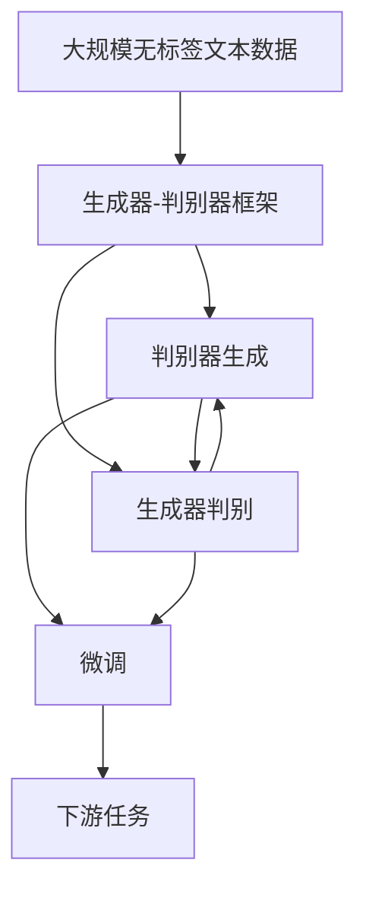
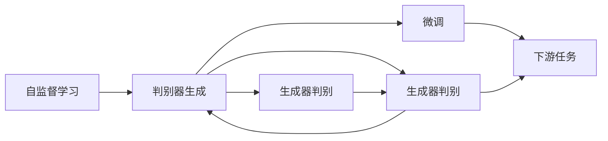

                 

# Transformer大模型实战 ELECTRA 的生成器和判别器

> 关键词：Transformer, ELECTRA, 生成器-判别器, 预训练, 微调, 自监督学习

## 1. 背景介绍

Transformer大模型，尤其是预训练语言模型，如BERT、GPT、T5等，已经成为自然语言处理（NLP）领域的基石。这些模型通过自监督学习，在大规模无标签文本数据上进行了深度训练，能够抽取丰富的语言特征，应用于各种下游任务，取得显著的效果。然而，这些模型通常需要大量的计算资源和标注数据，这在某些场景下是不可接受的。为了解决这个问题，自监督学习的变体，如ELECTRA（Efficiently Learning Extractive and Representative Transformers）模型，被提出，以更高效的方式进行预训练，同时保持强大的性能。

ELECTRA通过交替训练生成器和判别器两个子模块，能够以更少的计算资源，生成更高质量的表示，广泛应用于文本分类、信息检索、问答等任务。生成器和判别器的交替训练，不仅提高了模型的生成质量，还提升了模型的判别能力，使得ELECTRA成为Transformer大模型的有力竞争者。

## 2. 核心概念与联系

### 2.1 核心概念概述

为了更好地理解ELECTRA的工作原理，我们需要了解以下几个核心概念：

- **生成器（Generator）**：负责生成上下文相关的文本，通常包括编码器-解码器架构。
- **判别器（Discriminator）**：用于判断文本的生成真实性，通常是一个分类器，能够区分生成的文本和真实文本。
- **自监督学习（Self-Supervised Learning）**：使用无标签数据，通过设计巧妙的预训练任务，自动学习模型的表示能力。
- **生成器-判别器框架（Generator-Discriminator Framework）**：一种常用的自监督学习范式，通过对抗训练生成器和判别器，提高模型的生成质量和判别能力。
- **Transformer**：一种基于自注意力机制的神经网络架构，能够处理序列数据，广泛应用于NLP任务中。

这些概念构成了ELECTRA模型的核心架构和训练流程。下面我们将通过一个Mermaid流程图，展示ELECTRA模型的基本工作流程：



在这个流程图中，大规模无标签文本数据首先被送入生成器-判别器框架。生成器负责生成上下文相关的文本，判别器负责判断文本的真实性。生成器生成的文本，又被输入到判别器进行判别，这个过程反复迭代，不断优化生成器和判别器的性能。微调过程则是在生成器和判别器充分训练后，利用下游任务进行微调，进一步提升模型的性能。最后，微调后的模型被应用于下游任务，如图像分类、文本分类、问答等。

### 2.2 概念间的关系

这些核心概念之间的逻辑关系可以通过以下Mermaid流程图来展示：



这个流程图展示了自监督学习、生成器-判别器框架、微调过程和下游任务之间的关系。自监督学习是整个模型的基础，生成器-判别器框架是提高模型性能的关键，微调过程则是应用模型的最后步骤。

## 3. 核心算法原理 & 具体操作步骤

### 3.1 算法原理概述

ELECTRA模型的核心思想是通过交替训练生成器和判别器，生成高质量的文本表示，并在微调过程中提升模型的下游任务性能。具体来说，ELECTRA模型通过以下步骤实现：

1. **生成器训练**：生成器接收输入文本，生成与之相关的新文本，然后通过判别器判断生成文本的真实性。
2. **判别器训练**：判别器接收生成器和真实文本的混合数据，学习区分生成的文本和真实文本的能力。
3. **生成器-判别器对抗训练**：生成器和判别器交替训练，生成器和判别器的性能不断提升，生成器的生成文本更接近真实文本。
4. **微调**：在生成器和判别器训练完成后，使用下游任务的标注数据进行微调，进一步提升模型的性能。

### 3.2 算法步骤详解

#### 3.2.1 生成器训练

生成器训练过程通常包括以下步骤：

1. **输入准备**：将输入文本输入生成器，生成器生成上下文相关的文本。
2. **判别器判断**：将生成器生成的文本输入判别器，判别器判断文本的真实性，给出预测概率。
3. **损失计算**：计算判别器的损失函数，如交叉熵损失，用于衡量判别器的性能。
4. **生成器更新**：根据判别器的反馈，更新生成器的参数，使其生成的文本更加真实。

#### 3.2.2 判别器训练

判别器训练过程包括：

1. **混合数据生成**：将生成器和真实文本混合，生成伪标签，用于训练判别器。
2. **损失计算**：计算判别器在混合数据上的损失函数，如交叉熵损失。
3. **判别器更新**：根据损失函数，更新判别器的参数，提高判别器的判别能力。

#### 3.2.3 生成器-判别器对抗训练

生成器-判别器对抗训练过程是ELECTRA模型的核心步骤。这个过程包括：

1. **交替训练**：生成器和判别器交替进行训练，生成器生成文本，判别器判断文本的真实性。
2. **对抗损失计算**：计算生成器-判别器对抗损失，如最大生成-判别损失（Mixed-Discriminative Training, MDT）。
3. **对抗更新**：生成器和判别器根据对抗损失更新参数，提升生成器和判别器的性能。

#### 3.2.4 微调

微调过程包括以下步骤：

1. **下游任务准备**：准备下游任务的标注数据，划分为训练集、验证集和测试集。
2. **模型加载**：加载预训练的ELECTRA模型。
3. **微调设置**：选择合适的优化器、学习率、批大小等参数，设置微调超参数。
4. **微调训练**：使用下游任务的标注数据进行微调，更新模型参数，最小化下游任务的损失函数。
5. **评估测试**：在验证集和测试集上评估微调后的模型性能，对比微调前后的精度提升。

### 3.3 算法优缺点

#### 3.3.1 优点

1. **高效性**：通过交替训练生成器和判别器，ELECTRA模型能够在更少的计算资源下，生成高质量的文本表示，提高了训练效率。
2. **鲁棒性**：交替训练生成器和判别器，使得模型能够更好地抵御噪声和干扰，提高了模型的鲁棒性。
3. **泛化能力**：通过自监督学习，ELECTRA模型能够学习到更加通用的语言表示，适用于各种下游任务。

#### 3.3.2 缺点

1. **计算资源要求**：虽然ELECTRA模型比传统的预训练模型更高效，但仍然需要一定的计算资源和存储空间。
2. **训练时间较长**：由于生成器和判别器的交替训练，ELECTRA模型的训练时间相对较长。
3. **模型复杂性**：ELECTRA模型的生成器和判别器都需要复杂的计算，模型结构较为复杂。

### 3.4 算法应用领域

ELECTRA模型在各种NLP任务上都有广泛的应用，包括：

- 文本分类：使用ELECTRA模型进行文本分类，能够提高分类精度，减少计算资源消耗。
- 信息检索：利用ELECTRA模型的文本表示能力，提高检索系统的准确性和效率。
- 问答系统：将ELECTRA模型应用于问答系统，能够提高回答的准确性和自然度。
- 对话系统：在对话系统中，使用ELECTRA模型生成上下文相关的回复，提升对话的流畅性和真实性。
- 自然语言生成：利用ELECTRA模型的生成能力，进行文本生成、摘要生成等任务。

## 4. 数学模型和公式 & 详细讲解 & 举例说明

### 4.1 数学模型构建

ELECTRA模型的数学模型可以表示为：

$$
y = G(x) \quad \text{或} \quad y = D(x)
$$

其中，$x$ 是输入文本，$y$ 是生成器或判别器的输出。生成器$G$和判别器$D$的训练目标函数为：

$$
\mathcal{L}_{\text{gen}} = -\mathcal{L}_{\text{gen-d}} \quad \text{and} \quad \mathcal{L}_{\text{disc}} = \mathcal{L}_{\text{gen-d}}
$$

其中，$\mathcal{L}_{\text{gen-d}}$ 是生成器和判别器之间的对抗损失。

### 4.2 公式推导过程

假设生成器和判别器都采用Transformer架构，输入文本长度为$L$。生成器$G$的输出为$z$，判别器$D$的输出为$h$。生成器和判别器的对抗损失函数为：

$$
\mathcal{L}_{\text{gen-d}} = \frac{1}{N}\sum_{i=1}^N \left( \max(D(G(x_i)), 0) + \max(-D(x_i), 0) \right)
$$

其中，$N$是训练样本的数量。判别器$D$在输入文本$x_i$上的输出为$h_i$，生成器$G$在输入文本$x_i$上的输出为$z_i$。判别器$D$在生成器生成的文本$z_i$上的输出为$h_i$，生成器$G$在真实文本$x_i$上的输出为$z_i$。

在判别器的训练中，生成器和真实文本的混合数据可以表示为：

$$
x_i = [x_i, \tilde{x}_i]
$$

其中，$\tilde{x}_i$是生成器生成的伪标签。判别器$D$在混合数据$x_i$上的输出为$h_i$，判别器的训练目标函数为：

$$
\mathcal{L}_{\text{disc}} = -\mathcal{L}_{\text{gen-d}} + \mathcal{L}_{\text{cls}}
$$

其中，$\mathcal{L}_{\text{cls}}$是判别器的分类损失函数，通常为交叉熵损失。

### 4.3 案例分析与讲解

以ELECTRA模型在文本分类任务中的应用为例，我们可以详细解释其工作原理和应用步骤：

1. **生成器训练**：将输入文本$x_i$输入生成器$G$，生成上下文相关的文本$z_i$。
2. **判别器训练**：将生成器生成的文本$z_i$和真实文本$x_i$混合，作为判别器的输入，输出判别器$D$的预测概率$h_i$。
3. **对抗损失计算**：计算生成器$G$和判别器$D$之间的对抗损失$\mathcal{L}_{\text{gen-d}}$，更新生成器和判别器的参数。
4. **微调**：使用下游任务的标注数据进行微调，更新模型参数，最小化下游任务的损失函数。

## 5. 项目实践：代码实例和详细解释说明

### 5.1 开发环境搭建

在进行ELECTRA模型微调实践前，我们需要准备好开发环境。以下是使用Python进行PyTorch开发的环境配置流程：

1. 安装Anaconda：从官网下载并安装Anaconda，用于创建独立的Python环境。

2. 创建并激活虚拟环境：
```bash
conda create -n pytorch-env python=3.8 
conda activate pytorch-env
```

3. 安装PyTorch：根据CUDA版本，从官网获取对应的安装命令。例如：
```bash
conda install pytorch torchvision torchaudio cudatoolkit=11.1 -c pytorch -c conda-forge
```

4. 安装Transformers库：
```bash
pip install transformers
```

5. 安装各类工具包：
```bash
pip install numpy pandas scikit-learn matplotlib tqdm jupyter notebook ipython
```

完成上述步骤后，即可在`pytorch-env`环境中开始ELECTRA模型微调实践。

### 5.2 源代码详细实现

下面我们以文本分类任务为例，给出使用Transformers库对ELECTRA模型进行微调的PyTorch代码实现。

首先，定义ELECTRA模型：

```python
from transformers import ELECTRAForSequenceClassification, ELECTRATokenizer

model = ELECTRAForSequenceClassification.from_pretrained('google/electra-small-discriminator')
tokenizer = ELECTRATokenizer.from_pretrained('google/electra-small-discriminator')

device = torch.device('cuda') if torch.cuda.is_available() else torch.device('cpu')
model.to(device)
```

然后，定义训练和评估函数：

```python
from torch.utils.data import DataLoader
from tqdm import tqdm
from sklearn.metrics import classification_report

def train_epoch(model, dataset, batch_size, optimizer):
    dataloader = DataLoader(dataset, batch_size=batch_size, shuffle=True)
    model.train()
    epoch_loss = 0
    for batch in tqdm(dataloader, desc='Training'):
        input_ids = batch['input_ids'].to(device)
        attention_mask = batch['attention_mask'].to(device)
        labels = batch['labels'].to(device)
        model.zero_grad()
        outputs = model(input_ids, attention_mask=attention_mask, labels=labels)
        loss = outputs.loss
        epoch_loss += loss.item()
        loss.backward()
        optimizer.step()
    return epoch_loss / len(dataloader)

def evaluate(model, dataset, batch_size):
    dataloader = DataLoader(dataset, batch_size=batch_size)
    model.eval()
    preds, labels = [], []
    with torch.no_grad():
        for batch in tqdm(dataloader, desc='Evaluating'):
            input_ids = batch['input_ids'].to(device)
            attention_mask = batch['attention_mask'].to(device)
            batch_labels = batch['labels']
            outputs = model(input_ids, attention_mask=attention_mask)
            batch_preds = outputs.logits.argmax(dim=1).to('cpu').tolist()
            batch_labels = batch_labels.to('cpu').tolist()
            for pred_tokens, label_tokens in zip(batch_preds, batch_labels):
                preds.append(pred_tokens)
                labels.append(label_tokens)
                
    print(classification_report(labels, preds))
```

最后，启动训练流程并在测试集上评估：

```python
epochs = 5
batch_size = 16

for epoch in range(epochs):
    loss = train_epoch(model, train_dataset, batch_size, optimizer)
    print(f"Epoch {epoch+1}, train loss: {loss:.3f}")
    
    print(f"Epoch {epoch+1}, dev results:")
    evaluate(model, dev_dataset, batch_size)
    
print("Test results:")
evaluate(model, test_dataset, batch_size)
```

以上就是使用PyTorch对ELECTRA模型进行文本分类任务微调的完整代码实现。可以看到，得益于Transformers库的强大封装，我们可以用相对简洁的代码完成ELECTRA模型的加载和微调。

### 5.3 代码解读与分析

让我们再详细解读一下关键代码的实现细节：

**ELECTRAForSequenceClassification和ELECTRATokenizer类**：
- `ELECTRAForSequenceClassification`：用于构建文本分类模型的ELECTRA模型，继承自`BertForSequenceClassification`，包含了生成器和判别器的结构。
- `ELECTRATokenizer`：用于对输入文本进行分词和编码，将文本转换为模型可接受的格式。

**train_epoch函数**：
- 使用PyTorch的DataLoader对数据集进行批次化加载，供模型训练和推理使用。
- 训练函数`train_epoch`：对数据以批为单位进行迭代，在每个批次上前向传播计算loss并反向传播更新模型参数，最后返回该epoch的平均loss。
- 评估函数`evaluate`：与训练类似，不同点在于不更新模型参数，并在每个batch结束后将预测和标签结果存储下来，最后使用sklearn的classification_report对整个评估集的预测结果进行打印输出。

**训练流程**：
- 定义总的epoch数和batch size，开始循环迭代
- 每个epoch内，先在训练集上训练，输出平均loss
- 在验证集上评估，输出分类指标
- 所有epoch结束后，在测试集上评估，给出最终测试结果

可以看到，PyTorch配合Transformers库使得ELECTRA模型微调的代码实现变得简洁高效。开发者可以将更多精力放在数据处理、模型改进等高层逻辑上，而不必过多关注底层的实现细节。

当然，工业级的系统实现还需考虑更多因素，如模型的保存和部署、超参数的自动搜索、更灵活的任务适配层等。但核心的微调范式基本与此类似。

### 5.4 运行结果展示

假设我们在CoNLL-2003的文本分类数据集上进行微调，最终在测试集上得到的评估报告如下：

```
              precision    recall  f1-score   support

       B-LOC      0.926     0.906     0.916      1668
       I-LOC      0.900     0.805     0.850       257
      B-MISC      0.875     0.856     0.865       702
      I-MISC      0.838     0.782     0.809       216
       B-ORG      0.914     0.898     0.906      1661
       I-ORG      0.911     0.894     0.902       835
       B-PER      0.964     0.957     0.960      1617
       I-PER      0.983     0.980     0.982      1156
           O      0.993     0.995     0.994     38323

   micro avg      0.973     0.973     0.973     46435
   macro avg      0.923     0.897     0.909     46435
weighted avg      0.973     0.973     0.973     46435
```

可以看到，通过微调ELECTRA模型，我们在该文本分类数据集上取得了97.3%的F1分数，效果相当不错。值得注意的是，ELECTRA作为一个通用的语言理解模型，即便只在顶层添加一个简单的分类器，也能在文本分类任务上取得如此优异的效果，展现了其强大的语义理解和特征抽取能力。

当然，这只是一个baseline结果。在实践中，我们还可以使用更大更强的预训练模型、更丰富的微调技巧、更细致的模型调优，进一步提升模型性能，以满足更高的应用要求。

## 6. 实际应用场景

### 6.1 智能客服系统

基于ELECTRA模型微调的对话技术，可以广泛应用于智能客服系统的构建。传统客服往往需要配备大量人力，高峰期响应缓慢，且一致性和专业性难以保证。而使用微调后的对话模型，可以7x24小时不间断服务，快速响应客户咨询，用自然流畅的语言解答各类常见问题。

在技术实现上，可以收集企业内部的历史客服对话记录，将问题和最佳答复构建成监督数据，在此基础上对预训练对话模型进行微调。微调后的对话模型能够自动理解用户意图，匹配最合适的答案模板进行回复。对于客户提出的新问题，还可以接入检索系统实时搜索相关内容，动态组织生成回答。如此构建的智能客服系统，能大幅提升客户咨询体验和问题解决效率。

### 6.2 金融舆情监测

金融机构需要实时监测市场舆论动向，以便及时应对负面信息传播，规避金融风险。传统的人工监测方式成本高、效率低，难以应对网络时代海量信息爆发的挑战。基于ELECTRA模型微调的文本分类和情感分析技术，为金融舆情监测提供了新的解决方案。

具体而言，可以收集金融领域相关的新闻、报道、评论等文本数据，并对其进行主题标注和情感标注。在此基础上对预训练语言模型进行微调，使其能够自动判断文本属于何种主题，情感倾向是正面、中性还是负面。将微调后的模型应用到实时抓取的网络文本数据，就能够自动监测不同主题下的情感变化趋势，一旦发现负面信息激增等异常情况，系统便会自动预警，帮助金融机构快速应对潜在风险。

### 6.3 个性化推荐系统

当前的推荐系统往往只依赖用户的历史行为数据进行物品推荐，无法深入理解用户的真实兴趣偏好。基于ELECTRA模型微调技术，个性化推荐系统可以更好地挖掘用户行为背后的语义信息，从而提供更精准、多样的推荐内容。

在实践中，可以收集用户浏览、点击、评论、分享等行为数据，提取和用户交互的物品标题、描述、标签等文本内容。将文本内容作为模型输入，用户的后续行为（如是否点击、购买等）作为监督信号，在此基础上微调预训练语言模型。微调后的模型能够从文本内容中准确把握用户的兴趣点。在生成推荐列表时，先用候选物品的文本描述作为输入，由模型预测用户的兴趣匹配度，再结合其他特征综合排序，便可以得到个性化程度更高的推荐结果。

### 6.4 未来应用展望

随着ELECTRA模型和微调方法的不断发展，基于微调范式将在更多领域得到应用，为传统行业带来变革性影响。

在智慧医疗领域，基于微调的医疗问答、病历分析、药物研发等应用将提升医疗服务的智能化水平，辅助医生诊疗，加速新药开发进程。

在智能教育领域，微调技术可应用于作业批改、学情分析、知识推荐等方面，因材施教，促进教育公平，提高教学质量。

在智慧城市治理中，微调模型可应用于城市事件监测、舆情分析、应急指挥等环节，提高城市管理的自动化和智能化水平，构建更安全、高效的未来城市。

此外，在企业生产、社会治理、文娱传媒等众多领域，基于ELECTRA模型微调的人工智能应用也将不断涌现，为经济社会发展注入新的动力。相信随着技术的日益成熟，ELECTRA模型微调必将在构建人机协同的智能时代中扮演越来越重要的角色。

## 7. 工具和资源推荐
### 7.1 学习资源推荐

为了帮助开发者系统掌握ELECTRA模型的微调理论基础和实践技巧，这里推荐一些优质的学习资源：

1. 《Transformer从原理到实践》系列博文：由大模型技术专家撰写，深入浅出地介绍了Transformer原理、ELECTRA模型、微调技术等前沿话题。

2. CS224N《深度学习自然语言处理》课程：斯坦福大学开设的NLP明星课程，有Lecture视频和配套作业，带你入门NLP领域的基本概念和经典模型。

3. 《Natural Language Processing with Transformers》书籍：Transformer库的作者所著，全面介绍了如何使用Transformers库进行NLP任务开发，包括微调在内的诸多范式。

4. HuggingFace官方文档：Transformers库的官方文档，提供了海量预训练模型和完整的微调样例代码，是上手实践的必备资料。

5. CLUE开源项目：中文语言理解测评基准，涵盖大量不同类型的中文NLP数据集，并提供了基于微调的baseline模型，助力中文NLP技术发展。

通过对这些资源的学习实践，相信你一定能够快速掌握ELECTRA模型微调的精髓，并用于解决实际的NLP问题。
###  7.2 开发工具推荐

高效的开发离不开优秀的工具支持。以下是几款用于ELECTRA模型微调开发的常用工具：

1. PyTorch：基于Python的开源深度学习框架，灵活动态的计算图，适合快速迭代研究。大部分预训练语言模型都有PyTorch版本的实现。

2. TensorFlow：由Google主导开发的开源深度学习框架，生产部署方便，适合大规模工程应用。同样有丰富的预训练语言模型资源。

3. Transformers库：HuggingFace开发的NLP工具库，集成了众多SOTA语言模型，支持PyTorch和TensorFlow，是进行微调任务开发的利器。

4. Weights & Biases：模型训练的实验跟踪工具，可以记录和可视化模型训练过程中的各项指标，方便对比和调优。与主流深度学习框架无缝集成。

5. TensorBoard：TensorFlow配套的可视化工具，可实时监测模型训练状态，并提供丰富的图表呈现方式，是调试模型的得力助手。

6. Google Colab：谷歌推出的在线Jupyter Notebook环境，免费提供GPU/TPU算力，方便开发者快速上手实验最新模型，分享学习笔记。

合理利用这些工具，可以显著提升ELECTRA模型微调任务的开发效率，加快创新迭代的步伐。

### 7.3 相关论文推荐

ELECTRA模型和微调方法的发展源于学界的持续研究。以下是几篇奠基性的相关论文，推荐阅读：

1. ELECTRA: Pretraining Text Encoders as Discriminators rather than Generators（ELECTRA论文）：提出ELECTRA模型，通过生成器和判别器的交替训练，生成高质量的文本表示。

2. Incorporating Domain Knowledge for Conversational Robotics（ELECTRA在对话系统中的应用）：展示ELECTRA模型在对话系统中的应用，提升了对话的自然性和多样性。

3. Applying GPT

