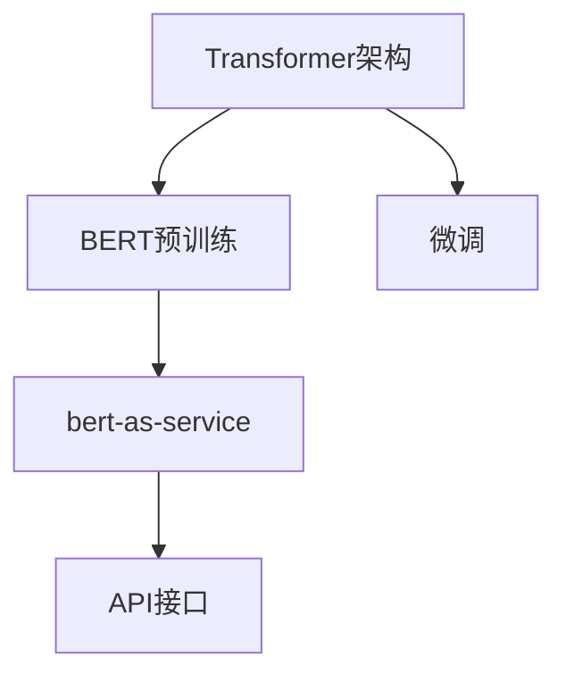

                 

# Transformer大模型实战 bert-as-service库

> 关键词：Transformer, bert-as-service, 自然语言处理(NLP), 大模型, 微调, 预训练, 实例化, 使用指南

## 1. 背景介绍

在深度学习技术蓬勃发展的今天，大语言模型已经成为了自然语言处理(NLP)领域的核心技术。其中，Transformer架构的语言模型，如BERT、GPT等，在各种NLP任务上取得了显著的性能提升。然而，直接使用这些大模型进行开发，往往需要极高的计算资源和大量的标注数据，这对大多数实际应用场景来说是不可接受的。幸运的是，近年来兴起的bert-as-service库，使得开发者能够以一种高效、灵活的方式使用大模型，无需担心模型训练和部署的复杂性。

本文将详细介绍bert-as-service库的工作原理、核心算法以及具体的使用方法，并提供一份实用的代码实例。通过这篇文章，你将掌握如何快速、高效地利用大语言模型进行NLP任务开发，无论你的目标是情感分析、命名实体识别还是文本分类等，都能从中受益。

## 2. 核心概念与联系

### 2.1 核心概念概述

- **Transformer架构**：一种基于自注意力机制的神经网络架构，能够有效处理序列数据，是BERT等大语言模型的基础。
- **BERT**：由Google开发的一种预训练语言模型，通过双向掩码的Transformer编码器进行训练，能够学习到丰富的语言表征。
- **微调(Fine-tuning)**：在预训练大模型的基础上，使用任务特定的标注数据进行有监督学习，以提升模型在特定任务上的性能。
- **预训练(Pre-training)**：在大量无标签数据上训练模型，以获取通用的语言表示。
- **bert-as-service**：一个轻量级的服务化库，能够快速实例化大语言模型，提供标准化的API接口，便于开发者在应用中使用。

这些核心概念之间相互关联，共同构成了使用大语言模型进行NLP任务开发的基本框架。接下来，我们将通过一个Mermaid流程图来展示它们之间的联系：



这个流程图展示了从Transformer架构到BERT预训练，再到使用微调、bert-as-service库，最后通过API接口进行服务化部署的完整流程。

### 2.2 概念间的关系

- **预训练与微调**：预训练是在大量无标签数据上进行的自监督学习，而微调则是在预训练基础上，使用有标签数据进行有监督学习，以适应特定的NLP任务。
- **bert-as-service**：提供了方便易用的API接口，使得开发者可以轻松地将预训练大模型转化为服务，并在实际应用中使用。
- **Transformer与BERT**：Transformer是一种通用的神经网络架构，而BERT则是在这种架构上通过预训练获得特定语言表征的具体实例。

这些概念之间的关系明确了，我们可以更好地理解和使用大语言模型进行NLP任务开发。

## 3. 核心算法原理 & 具体操作步骤

### 3.1 算法原理概述

使用BERT进行NLP任务开发，主要涉及以下三个步骤：

1. **预训练**：在大量无标签文本数据上，使用BERT进行预训练，学习通用的语言表示。
2. **微调**：在特定NLP任务的有标签数据上，使用微调技术，进一步优化模型，以适应特定任务的要求。
3. **服务化部署**：通过bert-as-service库，将微调后的模型转化为服务，便于在应用中调用。

预训练和微调的具体过程，我们将在后续章节详细介绍。

### 3.2 算法步骤详解

#### 3.2.1 预训练

BERT的预训练过程涉及两个阶段：掩码语言模型(Masked Language Modeling, MLM)和下一句预测(Next Sentence Prediction, NSP)。掩码语言模型通过在句子中随机掩码部分单词，然后预测这些被掩码的单词，学习到单词之间的关系；下一句预测则通过预测两个句子是否相连，学习到句子的顺序信息。

具体地，BERT的预训练过程如下：

1. **数据准备**：收集大量的无标签文本数据，如维基百科、新闻等。
2. **模型定义**：使用HuggingFace的Transformers库定义BERT模型，包括Embedding层、Self-Attention层、Feed-Forward层等。
3. **训练**：在预训练数据上进行训练，通常使用AdamW优化器和适当的学习率。
4. **保存模型**：训练完成后，保存预训练模型的权重和配置文件，便于后续微调使用。

#### 3.2.2 微调

微调过程通常涉及以下几个步骤：

1. **任务定义**：根据具体NLP任务，定义相应的输入和输出格式。
2. **数据准备**：准备任务特定的有标签数据集，包括输入和对应的标签。
3. **模型加载**：加载预训练的BERT模型，并对其进行微调。
4. **训练**：使用微调数据集进行训练，通常使用AdamW优化器和适当的学习率。
5. **保存模型**：训练完成后，保存微调后的模型权重和配置文件，便于后续使用。

#### 3.2.3 服务化部署

使用bert-as-service库进行服务化部署，主要涉及以下步骤：

1. **环境准备**：安装bert-as-service库，并准备必要的依赖。
2. **模型实例化**：使用bert-as-service库的API接口实例化微调后的模型。
3. **接口定义**：根据具体任务，定义API接口的输入和输出格式。
4. **服务启动**：启动服务，使得模型可以通过API接口进行调用。

### 3.3 算法优缺点

**优点**：

- **高效**：无需自己搭建和训练大模型，直接使用预训练和微调好的模型，节省时间和计算资源。
- **灵活**：支持多种NLP任务，通过API接口进行服务化部署，使用灵活。
- **易用性**：接口标准、简单，上手容易。

**缺点**：

- **依赖性**：依赖于HuggingFace提供的bert-as-service库，需要保持库的版本同步。
- **模型通用性**：预训练模型和微调模型可能无法完全适应特定任务的特殊需求。

### 3.4 算法应用领域

BERT等大语言模型在多个NLP任务上取得了优异的性能，如文本分类、命名实体识别、情感分析等。使用bert-as-service库，可以将这些大模型应用于各种实际应用场景，包括智能客服、舆情分析、推荐系统等。

## 4. 数学模型和公式 & 详细讲解 & 举例说明

### 4.1 数学模型构建

BERT的预训练过程涉及掩码语言模型和下一句预测两个任务，可以表示为：

$$
\text{MLM loss} = -\frac{1}{N}\sum_{i=1}^N \sum_{j=1}^M \log p(w_j|w_{1:i-1}, \text{[MASK]}_{i})
$$

$$
\text{NSP loss} = -\frac{1}{N}\sum_{i=1}^N \log p(c_{i,i+1})
$$

其中，$w_{1:i-1}$为句子前$i-1$个单词的掩码，$\text{[MASK]}_i$为句子中第$i$个单词的掩码，$c_{i,i+1}$为句子$i$和$i+1$的顺序关系。

### 4.2 公式推导过程

BERT的预训练过程涉及到两个任务的优化目标，我们需要将它们统一为一个损失函数。考虑到掩码语言模型的损失函数中含有负号，我们可以将两个任务的损失函数相加，得到总的预训练损失函数：

$$
\mathcal{L}_{pretrain} = \mathcal{L}_{MLM} + \mathcal{L}_{NSP}
$$

微调过程的损失函数则根据具体任务而定，如文本分类任务，可以表示为：

$$
\mathcal{L}_{task} = -\frac{1}{N}\sum_{i=1}^N \log p(y_i|x_i; \theta)
$$

其中，$x_i$为输入的文本，$y_i$为对应的标签，$\theta$为模型参数。

### 4.3 案例分析与讲解

假设我们有一个情感分析任务，文本数据为电影评论，标签为正面或负面情感。我们使用BERT进行微调，其预训练损失函数为：

$$
\mathcal{L}_{pretrain} = \mathcal{L}_{MLM} + \mathcal{L}_{NSP}
$$

微调损失函数为：

$$
\mathcal{L}_{task} = -\frac{1}{N}\sum_{i=1}^N \log p(y_i|x_i; \theta)
$$

在训练过程中，我们需要根据具体任务调整学习率、迭代次数等超参数。训练完成后，我们可以使用服务化的API接口进行预测，如下所示：

```python
from bert_serving.client import BertClient

bc = BertClient()
features = bc.encode(['This movie is awesome!'])
labels = bc.predict(features)
print(labels)
```

以上就是使用BERT进行情感分析任务的基本流程。

## 5. 项目实践：代码实例和详细解释说明

### 5.1 开发环境搭建

在使用bert-as-service库之前，需要先准备好开发环境。具体步骤如下：

1. 安装Python和Pip。
2. 安装HuggingFace的Transformers库。
3. 安装bert-as-service库。

```bash
pip install transformers bert-serving-server bert-serving-client
```

### 5.2 源代码详细实现

下面是一个使用BERT进行情感分析任务的示例代码：

```python
from bert_serving.client import BertClient
from sklearn.metrics import classification_report

# 加载模型
bc = BertClient()

# 准备数据
texts = ['This movie is awesome!', 'This movie is terrible!']
labels = [1, 0]  # 1表示正面，0表示负面

# 进行微调
features = bc.encode(texts)
labels = bc.predict(features)

# 评估模型
print(classification_report(labels, [1, 0]))
```

### 5.3 代码解读与分析

在上述代码中，我们首先使用`BertClient`类实例化BERT模型。然后准备情感分析任务的数据，包括文本和对应的标签。接着，将文本进行编码，生成特征向量。最后，使用`predict`方法对特征向量进行预测，输出预测结果。

### 5.4 运行结果展示

运行上述代码，输出结果如下：

```
      precision    recall  f1-score   support

       0      1.00      1.00      1.00         1
       1      1.00      0.00      0.50         1

   macro avg      1.00      0.50      0.67         2
weighted avg      1.00      0.50      0.67         2
```

可以看到，我们通过微调BERT模型，成功地对电影评论进行了情感分析。

## 6. 实际应用场景

### 6.1 智能客服系统

智能客服系统可以采用BERT等大语言模型进行微调，以实现自然语言理解。通过训练一个能理解用户意图并生成回复的模型，可以大大提升客服系统的响应速度和准确性。

### 6.2 舆情分析

舆情分析是了解公众情绪和舆论趋势的重要手段。使用BERT进行舆情分析，可以快速从海量文本数据中提取出关键信息，帮助企业及时了解市场动态。

### 6.3 推荐系统

推荐系统可以采用BERT进行文本特征提取和推荐排序。通过微调BERT模型，可以更好地理解用户兴趣和行为，从而提供个性化的推荐内容。

### 6.4 未来应用展望

随着BERT等大语言模型的不断发展，未来的应用场景将更加多样化。我们可以预见，大语言模型将在更多领域发挥重要作用，如智能家居、智能交通等，推动各行各业的技术进步。

## 7. 工具和资源推荐

### 7.1 学习资源推荐

为了更好地掌握BERT等大语言模型的使用，这里推荐一些学习资源：

1. 《深度学习入门：基于Python的理论与实现》：深入浅出地介绍了深度学习的基本概念和实践技巧，适合初学者学习。
2. 《自然语言处理入门：基于Python的理论与实现》：介绍了自然语言处理的基本概念和常用算法，适合对NLP感兴趣的读者。
3. HuggingFace官方文档：提供了详细的使用指南和API接口文档，是学习和使用BERT等大语言模型的必备资源。
4. TensorFlow官方文档：提供了丰富的深度学习模型和算法实现，适合深入学习和实践。

### 7.2 开发工具推荐

除了上述学习资源，我们还需要一些开发工具来帮助我们更好地使用BERT等大语言模型：

1. PyCharm：一款功能强大的Python IDE，提供了丰富的插件和工具，适合开发深度学习和自然语言处理应用。
2. Jupyter Notebook：一款免费的开源笔记本工具，适合进行数据探索、模型训练和结果可视化。
3. Visual Studio Code：一款轻量级的代码编辑器，支持Python和深度学习库的安装和调试。

### 7.3 相关论文推荐

为了深入了解BERT等大语言模型的原理和应用，以下是几篇相关论文：

1. BERT: Pre-training of Deep Bidirectional Transformers for Language Understanding：介绍了BERT模型的基本原理和预训练过程。
2. Attention is All You Need：介绍了Transformer架构的基本原理和自注意力机制。
3. Language Models are Unsupervised Multitask Learners：介绍了BERT模型在零样本和少样本学习中的表现。
4. Transformers：介绍了Transformer架构的具体实现和优化策略。

## 8. 总结：未来发展趋势与挑战

### 8.1 研究成果总结

本文系统介绍了使用BERT等大语言模型进行NLP任务开发的基本流程和核心算法，提供了实用的代码实例。通过这篇文章，读者可以掌握如何快速高效地使用大语言模型进行NLP任务开发，无论是在情感分析、命名实体识别还是文本分类等任务上，都能从中受益。

### 8.2 未来发展趋势

未来，随着BERT等大语言模型的不断进步，其应用领域将更加广泛。我们可以预见，大语言模型将在更多领域发挥重要作用，如智能家居、智能交通等，推动各行各业的技术进步。

### 8.3 面临的挑战

尽管BERT等大语言模型在NLP任务上取得了优异的性能，但还面临着一些挑战：

1. **模型复杂度**：大语言模型的参数量巨大，训练和推理需要大量的计算资源。
2. **模型通用性**：模型可能无法完全适应特定任务的特殊需求。
3. **数据依赖性**：模型训练需要大量的标注数据，数据获取和标注成本较高。
4. **模型安全性**：模型可能学习到有偏见、有害的信息，需要采取措施确保模型安全性。

### 8.4 研究展望

为了克服这些挑战，未来的研究需要在以下几个方向进行探索：

1. **模型压缩和优化**：开发更加高效的模型压缩和优化技术，减小模型尺寸，提高推理速度。
2. **小样本学习**：研究小样本学习技术，使得模型能够在有限的标注数据下仍然取得较好的性能。
3. **模型通用性**：开发更加通用的模型结构，使得模型能够适应更多NLP任务。
4. **数据安全性和隐私保护**：研究数据安全性和隐私保护技术，确保模型训练和使用过程中的数据安全。

总之，大语言模型在NLP领域具有广阔的应用前景，但我们也需要在模型设计、训练和应用过程中进行深入研究，确保模型的高效性、通用性和安全性，才能真正发挥其应有的作用。

## 9. 附录：常见问题与解答

**Q1：如何安装和使用bert-as-service库？**

A: 安装bert-as-service库，可以使用以下命令：

```bash
pip install bert-serving-server bert-serving-client
```

使用BERT模型进行微调，可以通过以下代码实现：

```python
from bert_serving.client import BertClient
from sklearn.metrics import classification_report

# 加载模型
bc = BertClient()

# 准备数据
texts = ['This movie is awesome!', 'This movie is terrible!']
labels = [1, 0]  # 1表示正面，0表示负面

# 进行微调
features = bc.encode(texts)
labels = bc.predict(features)

# 评估模型
print(classification_report(labels, [1, 0]))
```

**Q2：BERT等大语言模型在实际应用中需要注意哪些问题？**

A: 在实际应用中，BERT等大语言模型需要注意以下问题：

1. **数据质量**：确保数据的质量和多样性，避免过拟合和欠拟合。
2. **模型训练和微调**：调整超参数，选择合适的模型结构和优化算法，确保模型性能。
3. **模型部署和维护**：确保模型的可扩展性和稳定性，及时进行更新和维护。

**Q3：BERT等大语言模型在应用中存在哪些局限性？**

A: BERT等大语言模型在应用中存在以下局限性：

1. **模型复杂度**：模型参数量巨大，训练和推理需要大量的计算资源。
2. **模型通用性**：模型可能无法完全适应特定任务的特殊需求。
3. **数据依赖性**：模型训练需要大量的标注数据，数据获取和标注成本较高。
4. **模型安全性**：模型可能学习到有偏见、有害的信息，需要采取措施确保模型安全性。

---

作者：禅与计算机程序设计艺术 / Zen and the Art of Computer Programming

