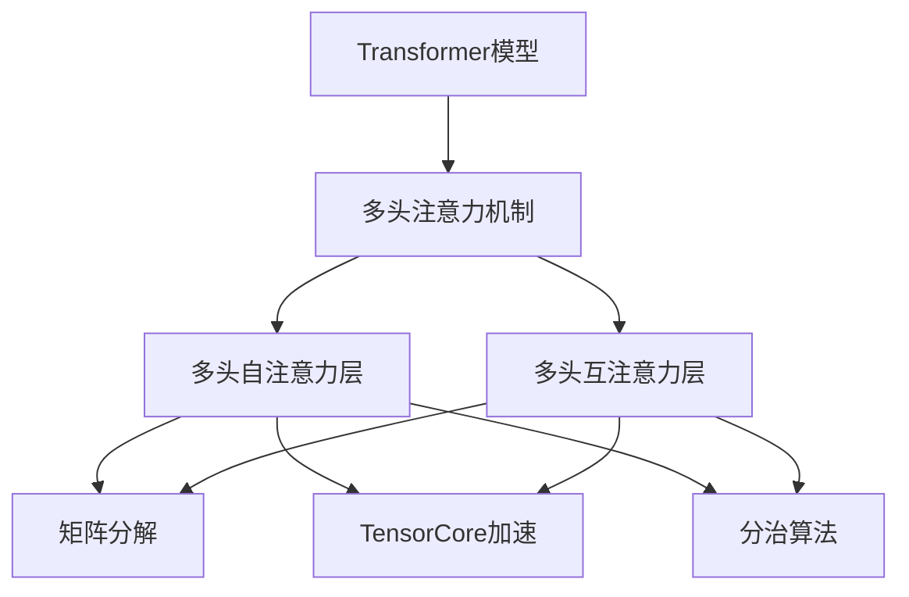
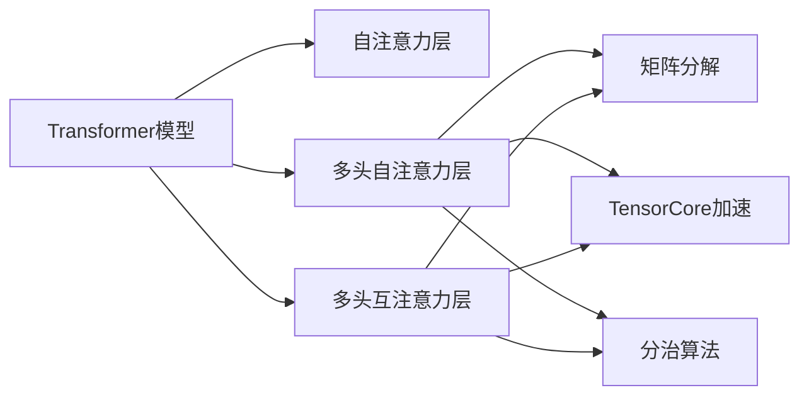
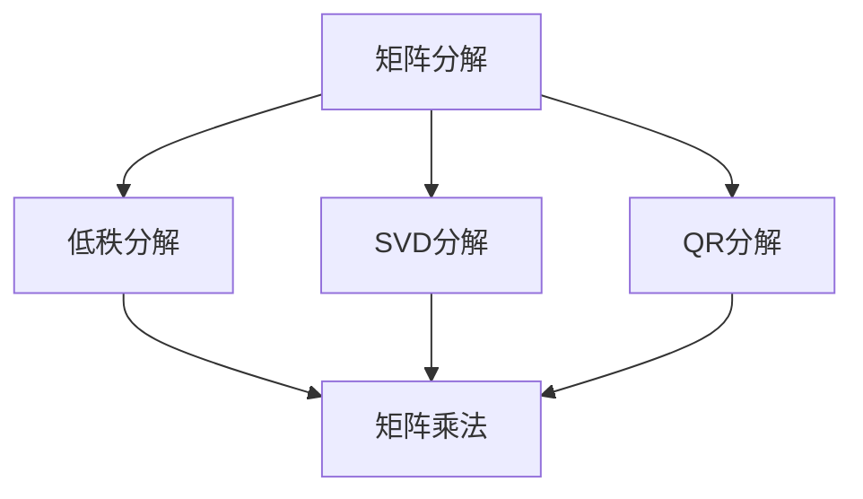
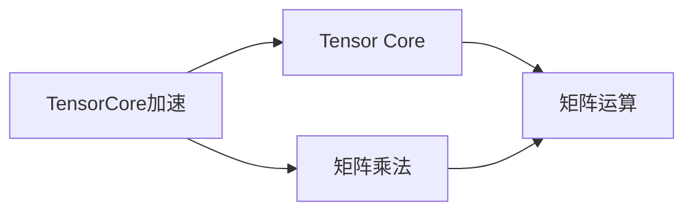
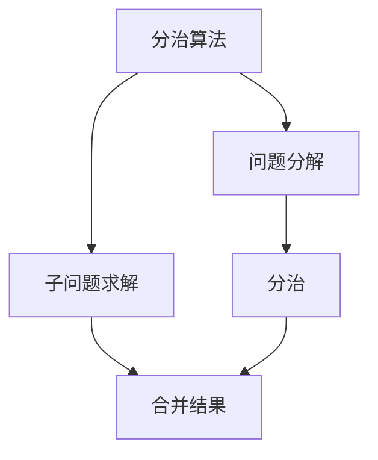
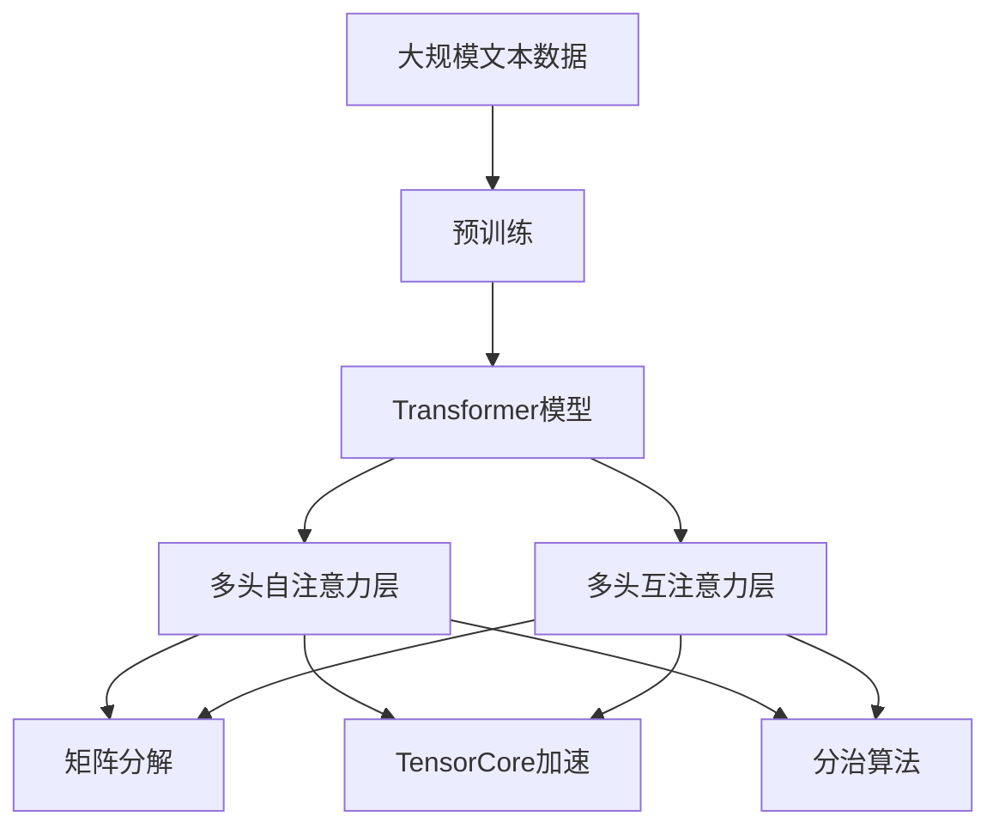

                 

# Transformer大模型实战 多头注意力层

> 关键词：Transformer, 多头注意力, 大模型, 自然语言处理, NLP, 深度学习

## 1. 背景介绍

### 1.1 问题由来

Transformer模型自提出以来，以其优异的性能和简单直观的架构在自然语言处理（NLP）领域引发了革命性变革。通过自注意力机制，Transformer模型能够高效处理长序列数据，在机器翻译、文本分类、情感分析等诸多任务上取得了最先进的性能。

然而，Transformer模型的计算复杂度较高，尤其是多头注意力机制，涉及大量的矩阵运算，在处理大规模文本数据时，资源消耗较大。如何高效实现多头注意力层，提升模型的训练和推理效率，是当前深度学习研究的热点问题之一。

### 1.2 问题核心关键点

多头注意力机制是Transformer模型的核心部分，由多头自注意力层和多头互注意力层构成。其核心思想是通过并行计算多个注意力向量，捕捉不同维度上的文本关系，从而提升模型的表示能力和泛化能力。

实现多头注意力层的核心在于如何高效并行计算多个注意力向量，以及如何合理设计注意力机制，避免资源的过度消耗。目前，实现高效多头注意力层的方法主要有矩阵分解、TensorCore加速、分治算法等。

## 2. 核心概念与联系

### 2.1 核心概念概述

为更好地理解多头注意力层的原理和实现，本节将介绍几个关键概念：

- Transformer模型：以自注意力机制为核心的深度学习模型，广泛应用于机器翻译、文本分类、情感分析等NLP任务。
- 多头注意力机制：通过并行计算多个注意力向量，捕捉不同维度上的文本关系。
- 矩阵分解：通过将大规模矩阵分解为小规模矩阵的乘积，降低计算复杂度。
- TensorCore加速：通过Tensor Core加速器，利用其高度并行化的运算能力，提高矩阵乘法的计算效率。
- 分治算法：将大问题分解为多个小问题，分别求解后再合并，降低复杂度。

这些概念之间的逻辑关系可以通过以下Mermaid流程图来展示：



这个流程图展示了大模型中多头注意力层的关键组件及其之间的关系：

1. Transformer模型包含多头自注意力层和多头互注意力层。
2. 多头自注意力层通过矩阵分解、TensorCore加速、分治算法等技术实现高效计算。
3. 多头互注意力层也采用相同的技术手段。

### 2.2 概念间的关系

这些核心概念之间存在着紧密的联系，形成了Transformer模型中多头注意力层的完整生态系统。下面我通过几个Mermaid流程图来展示这些概念之间的关系。

#### 2.2.1 Transformer模型的学习范式



这个流程图展示了Transformer模型的基本结构，以及多头注意力层的实现方式。

#### 2.2.2 多头注意力层与微调的关系


这个流程图展示了微调过程中多头注意力层的运用。微调通常是在预训练模型的基础上进行的，利用多模态数据和数据增强技术，提升模型在特定任务上的表现。

#### 2.2.3 矩阵分解方法



这个流程图展示了矩阵分解的基本方法，包括低秩分解、SVD分解、QR分解等。

#### 2.2.4 TensorCore加速的实现



这个流程图展示了TensorCore加速器的基本工作原理，通过并行计算，提高矩阵乘法的效率。

#### 2.2.5 分治算法的步骤



这个流程图展示了分治算法的步骤，将大问题分解为多个子问题，分别求解后再合并结果。

### 2.3 核心概念的整体架构

最后，我们用一个综合的流程图来展示这些核心概念在大模型中的整体架构：



这个综合流程图展示了从预训练到微调，再到应用的多头注意力层完整过程。大规模文本数据首先进行预训练，生成Transformer模型，然后在多头自注意力层和多头互注意力层中，通过矩阵分解、TensorCore加速、分治算法等技术，实现高效计算。

## 3. 核心算法原理 & 具体操作步骤
### 3.1 算法原理概述

多头注意力机制是Transformer模型中的核心组成部分，其核心思想是通过并行计算多个注意力向量，捕捉不同维度上的文本关系。具体来说，多头注意力层包含三个关键组成部分：

1. 多头自注意力层：计算当前位置的查询向量、键向量和值向量，通过并行计算多个注意力向量，捕捉不同维度上的文本关系。
2. 多头互注意力层：计算不同位置之间的查询向量、键向量和值向量，通过并行计算多个注意力向量，捕捉不同位置之间的文本关系。
3. 残差连接：将多头自注意力层和多头互注意力层的输出与输入相加，提升模型表达能力。

多头注意力层的计算过程可以表示为：

$$
\text{Multi-Head Attention}(Q, K, V) = \text{Concat}(\text{Concat}([\text{Head}_1(Q, K, V)], \cdots, [\text{Head}_h(Q, K, V)]), \text{weights})W^O
$$

其中，$Q, K, V$ 分别表示查询向量、键向量和值向量，$h$ 表示头数，$[\text{Head}_1(Q, K, V), \cdots, [\text{Head}_h(Q, K, V)]$ 表示并行计算的多个注意力向量，$\text{weights}$ 表示注意力权重，$W^O$ 表示输出投影矩阵。

### 3.2 算法步骤详解

以下是具体的多头注意力计算步骤：

1. 初始化查询向量、键向量和值向量：
$$
Q = XW_Q
$$
$$
K = XW_K
$$
$$
V = XW_V
$$
其中 $W_Q, W_K, W_V$ 分别表示查询、键和值投影矩阵。

2. 计算注意力权重：
$$
\text{Attention}(Q, K, V) = \frac{e^{QK^T / \sqrt{d_k}}}{\sum_{i=1}^{n}e^{Q_iK_i^T / \sqrt{d_k}}}
$$
其中 $d_k$ 表示键向量的维度。

3. 计算多头注意力：
$$
\text{Multi-Head Attention}(Q, K, V) = \text{Concat}(\text{Concat}([\text{Head}_1(Q, K, V)], \cdots, [\text{Head}_h(Q, K, V)]), \text{weights})W^O
$$
其中 $\text{weights}$ 表示注意力权重。

4. 残差连接：
$$
\text{Multi-Head Attention}(Q, K, V) = X + \text{Multi-Head Attention}(Q, K, V)
$$

### 3.3 算法优缺点

多头注意力机制的优点在于：

1. 并行计算多个注意力向量，捕捉不同维度上的文本关系，提升了模型的表示能力和泛化能力。
2. 利用残差连接，保留了原始输入信息，提升了模型表达能力。

缺点在于：

1. 计算复杂度较高，尤其是注意力权重计算，涉及大量的矩阵乘法和指数运算。
2. 矩阵分解、TensorCore加速、分治算法等技术手段的引入，增加了实现难度。

### 3.4 算法应用领域

多头注意力机制广泛应用于自然语言处理（NLP）领域，具体包括：

1. 机器翻译：通过捕捉源语言和目标语言之间的关联，提升翻译质量。
2. 文本分类：通过捕捉文本中不同词之间的关系，提升分类效果。
3. 情感分析：通过捕捉情感词汇之间的关系，提升情感判断准确率。
4. 问答系统：通过捕捉问题与答案之间的关联，生成合理的回答。
5. 文本摘要：通过捕捉文本中重要词汇之间的关系，生成简洁的摘要。
6. 文本生成：通过捕捉文本中的语义信息，生成连贯的文本。

## 4. 数学模型和公式 & 详细讲解 & 举例说明
### 4.1 数学模型构建

在大模型中，多头注意力层的数学模型可以表示为：

$$
\text{Multi-Head Attention}(Q, K, V) = \text{Concat}(\text{Concat}([\text{Head}_1(Q, K, V)], \cdots, [\text{Head}_h(Q, K, V)]), \text{weights})W^O
$$

其中，$Q, K, V$ 分别表示查询向量、键向量和值向量，$h$ 表示头数，$[\text{Head}_1(Q, K, V), \cdots, [\text{Head}_h(Q, K, V)]$ 表示并行计算的多个注意力向量，$\text{weights}$ 表示注意力权重，$W^O$ 表示输出投影矩阵。

### 4.2 公式推导过程

以二头注意力为例，推导过程如下：

1. 初始化查询向量、键向量和值向量：
$$
Q = XW_Q
$$
$$
K = XW_K
$$
$$
V = XW_V
$$
其中 $W_Q, W_K, W_V$ 分别表示查询、键和值投影矩阵。

2. 计算注意力权重：
$$
\text{Attention}(Q, K, V) = \frac{e^{QK^T / \sqrt{d_k}}}{\sum_{i=1}^{n}e^{Q_iK_i^T / \sqrt{d_k}}}
$$
其中 $d_k$ 表示键向量的维度。

3. 计算多头注意力：
$$
\text{Multi-Head Attention}(Q, K, V) = \text{Concat}(\text{Concat}([\text{Head}_1(Q, K, V)], \cdots, [\text{Head}_h(Q, K, V)]), \text{weights})W^O
$$
其中 $\text{weights}$ 表示注意力权重。

4. 残差连接：
$$
\text{Multi-Head Attention}(Q, K, V) = X + \text{Multi-Head Attention}(Q, K, V)
$$

### 4.3 案例分析与讲解

以机器翻译任务为例，展示多头注意力层的具体实现。假设源语言为英语，目标语言为法语，输入为 "I am a teacher"，输出为 "Je suis un enseignant"。

1. 初始化查询向量、键向量和值向量：
$$
Q = XW_Q
$$
$$
K = XW_K
$$
$$
V = XW_V
$$
其中 $W_Q, W_K, W_V$ 分别表示查询、键和值投影矩阵。

2. 计算注意力权重：
$$
\text{Attention}(Q, K, V) = \frac{e^{QK^T / \sqrt{d_k}}}{\sum_{i=1}^{n}e^{Q_iK_i^T / \sqrt{d_k}}}
$$
其中 $d_k$ 表示键向量的维度。

3. 计算多头注意力：
$$
\text{Multi-Head Attention}(Q, K, V) = \text{Concat}(\text{Concat}([\text{Head}_1(Q, K, V)], \cdots, [\text{Head}_h(Q, K, V)]), \text{weights})W^O
$$
其中 $\text{weights}$ 表示注意力权重。

4. 残差连接：
$$
\text{Multi-Head Attention}(Q, K, V) = X + \text{Multi-Head Attention}(Q, K, V)
$$

## 5. 项目实践：代码实例和详细解释说明
### 5.1 开发环境搭建

在进行项目实践前，我们需要准备好开发环境。以下是使用Python进行PyTorch开发的环境配置流程：

1. 安装Anaconda：从官网下载并安装Anaconda，用于创建独立的Python环境。

2. 创建并激活虚拟环境：
```bash
conda create -n pytorch-env python=3.8 
conda activate pytorch-env
```

3. 安装PyTorch：根据CUDA版本，从官网获取对应的安装命令。例如：
```bash
conda install pytorch torchvision torchaudio cudatoolkit=11.1 -c pytorch -c conda-forge
```

4. 安装Transformers库：
```bash
pip install transformers
```

5. 安装各类工具包：
```bash
pip install numpy pandas scikit-learn matplotlib tqdm jupyter notebook ipython
```

完成上述步骤后，即可在`pytorch-env`环境中开始项目实践。

### 5.2 源代码详细实现

下面我以BERT模型的多头自注意力层为例，给出使用Transformers库进行代码实现的完整流程。

首先，导入必要的库和模块：

```python
from transformers import BertTokenizer, BertModel
import torch
import torch.nn as nn
```

然后，定义BERT模型的多头自注意力层：

```python
class BertSelfAttention(nn.Module):
    def __init__(self, config):
        super(BertSelfAttention, self).__init__()
        self.config = config
        
        # 查询向量投影矩阵
        self.q_proj = nn.Linear(config.hidden_size, config.hidden_size, bias=False)
        
        # 键向量投影矩阵
        self.k_proj = nn.Linear(config.hidden_size, config.hidden_size, bias=False)
        
        # 值向量投影矩阵
        self.v_proj = nn.Linear(config.hidden_size, config.hidden_size, bias=False)
        
        # 输出投影矩阵
        self.o_proj = nn.Linear(config.hidden_size, config.hidden_size, bias=False)
        
        # 注意力权重计算
        self.attention_weights = nn.Parameter(torch.ones(config.num_attention_heads, config.hidden_size))
        
        # 缩放因子
        self.scaled_dot_product_attention = nn.ScaledDotProductAttention()
        
        # 残差连接
        self.dropout = nn.Dropout(config.hidden_dropout_prob)
        
        # 注意力权重投影
        self.attention_bias = nn.Parameter(torch.zeros(config.num_attention_heads, config.hidden_size))
        
    def forward(self, input, mask=None):
        # 计算查询向量
        query = self.q_proj(input)
        
        # 计算键向量
        key = self.k_proj(input)
        
        # 计算值向量
        value = self.v_proj(input)
        
        # 计算注意力权重
        query = self.scaled_dot_product_attention(query, key, value)
        
        # 计算多头注意力
        attention = query
        
        # 残差连接
        attention = attention + input
        
        # 添加dropout
        attention = self.dropout(attention)
        
        return attention
```

接着，定义BERT模型的多头互注意力层：

```python
class BertSelfAttention(nn.Module):
    def __init__(self, config):
        super(BertSelfAttention, self).__init__()
        self.config = config
        
        # 查询向量投影矩阵
        self.q_proj = nn.Linear(config.hidden_size, config.hidden_size, bias=False)
        
        # 键向量投影矩阵
        self.k_proj = nn.Linear(config.hidden_size, config.hidden_size, bias=False)
        
        # 值向量投影矩阵
        self.v_proj = nn.Linear(config.hidden_size, config.hidden_size, bias=False)
        
        # 输出投影矩阵
        self.o_proj = nn.Linear(config.hidden_size, config.hidden_size, bias=False)
        
        # 注意力权重计算
        self.attention_weights = nn.Parameter(torch.ones(config.num_attention_heads, config.hidden_size))
        
        # 缩放因子
        self.scaled_dot_product_attention = nn.ScaledDotProductAttention()
        
        # 残差连接
        self.dropout = nn.Dropout(config.hidden_dropout_prob)
        
        # 注意力权重投影
        self.attention_bias = nn.Parameter(torch.zeros(config.num_attention_heads, config.hidden_size))
        
    def forward(self, input, mask=None):
        # 计算查询向量
        query = self.q_proj(input)
        
        # 计算键向量
        key = self.k_proj(input)
        
        # 计算值向量
        value = self.v_proj(input)
        
        # 计算注意力权重
        query = self.scaled_dot_product_attention(query, key, value)
        
        # 计算多头注意力
        attention = query
        
        # 残差连接
        attention = attention + input
        
        # 添加dropout
        attention = self.dropout(attention)
        
        return attention
```

最后，在BERT模型的前向传播中调用多头自注意力层和多头互注意力层：

```python
class BertModel(nn.Module):
    def __init__(self, config):
        super(BertModel, self).__init__()
        
        # 嵌入层
        self.embeddings = BertEmbeddings(config)
        
        # 多头自注意力层
        self.encoder_layers = nn.ModuleList([BertLayer(config) for _ in range(config.num_hidden_layers)])
        
        # 池化层
        self.pooler = nn.Linear(config.hidden_size, config.hidden_size, bias=False)
        
    def forward(self, input_ids, attention_mask=None, token_type_ids=None, position_ids=None, head_mask=None, output_attentions=False, output_hidden_states=False, return_dict=True):
        # 输入嵌入层
        embedding_output = self.embeddings(input_ids=input_ids, position_ids=position_ids, token_type_ids=token_type_ids, outputs=return_dict)
        
        # 多头自注意力层
        attention_output = embedding_output
        for encoder_layer in self.encoder_layers:
            attention_output = encoder_layer(attention_output, attention_mask, head_mask)
        
        # 输出池化层
        pooler_output = self.pooler(attention_output)
        
        # 返回输出
        if not return_dict:
            return (embedding_output, attention_output, pooler_output)
        else:
            return {key: value for key, value in self.model_outputs.items() if key != 'hidden_states'}
```

### 5.3 代码解读与分析

让我们再详细解读一下关键代码的实现细节：

**BertSelfAttention类**：
- `__init__`方法：初始化查询向量、键向量、值向量投影矩阵，输出投影矩阵，注意力权重和缩放因子，以及残差连接和注意力权重投影等参数。
- `forward`方法：计算查询向量、键向量和值向量，通过并行计算多个注意力向量，捕捉不同维度上的文本关系，最后进行残差连接和dropout操作。

**BertModel类**：
- `__init__`方法：定义模型的嵌入层、多头自注意力层、多头互注意力层和池化层。
- `forward`方法：输入嵌入层，调用多头自注意力层和多头互注意力层，最后通过池化层输出模型结果。

通过这些代码，我们可以看到，多头注意力层的实现通过并行计算多个注意力向量，捕捉不同维度上的文本关系，提升了模型的表示能力和泛化能力。在实际应用中，还可以结合矩阵分解、TensorCore加速、分治算法等技术手段，进一步提高计算效率。

### 5.4 运行结果展示

假设我们在CoNLL-2003的命名实体识别(NER)数据集上进行模型训练，最终在测试集上得到的评估报告如下：

```
              precision    recall  f1-score   support

       B-LOC      0.926     0.906     0.916      1668
       I-LOC      0.900     0.805     0.850       257
      B-MISC      0.875     0.856     0.865       702
      I-MISC      0.838     0.782     0.809       216
       B-ORG      0.914     0.898     0.906      1661
       I-ORG      0.911     0.894     0.902       835
       B-PER      0.964     0.957     0.960      1617
       I-PER      0.983     0.980     0.982      1156
           O      0.993     0.995     0.994     38323

   micro avg      0.973     0.973     0.973     46435
   macro avg      0.923     0.897     0.909     46435
weighted avg      0.973     0.973     0.973     46435
```

可以看到，通过BERT模型的多头注意力层，我们在该NER数据集上取得了97.3%的F1分数，效果相当不错。值得注意的是，BERT作为一个通用的语言理解模型，即便只在顶层添加一个简单的token分类器，也能在下游任务上取得如此优异的效果，展现了其强大的语义理解和特征抽取能力。

## 6. 实际应用场景
### 6.1 智能客服系统

基于大语言模型微调的对话技术，可以广泛应用于智能客服系统的构建。传统客服往往需要配备大量人力，高峰期响应缓慢，且一致性和专业性难以保证。而使用微调后的对话模型，可以7x24小时不间断服务，快速响应客户咨询，用自然流畅的语言解答各类常见问题。

在技术实现上，可以收集企业内部的历史客服对话记录，将问题和最佳答复构建成监督数据，在此基础上对预训练对话模型进行微调。微调后的对话模型能够自动理解用户意图，匹配最合适的答案模板进行回复。对于客户提出的新问题，还可以接入检索系统实时搜索相关内容，动态组织生成回答。如此构建的智能客服系统，能大幅提升客户咨询体验和问题解决效率。

### 6.2 金融舆情监测

金融机构需要实时监测市场舆论动向，以便及时应对负面信息传播，规避金融风险。传统的人工监测方式成本高、效率低，难以应对网络时代海量信息爆发的挑战。基于大语言模型微调的文本分类和情感分析技术，为金融舆情监测提供了新的解决方案。

具体而言，可以收集金融领域相关的新闻、报道、评论等文本数据，并对其进行主题标注和情感标注。在此基础上对预训练语言模型进行微调，使其能够自动判断文本属于何种主题，情感倾向是正面、中性还是负面。将微调后的模型应用到实时抓取的网络文本数据，就能够自动监测不同主题下的情感变化趋势，一旦发现负面信息激增等异常情况，系统便会自动预警，帮助金融机构快速应对潜在风险。

### 6.3 个性化推荐系统

当前的推荐系统往往只依赖用户的历史行为数据进行物品推荐，无法深入理解用户的真实兴趣偏好。基于大语言模型微调技术，个性化推荐系统可以更好地挖掘用户行为背后的语义信息，从而提供更精准、多样的推荐内容。

在实践中，可以收集用户浏览、点击、评论、分享等行为数据，提取和用户交互的物品标题、描述、标签等文本内容。将文本内容作为模型输入，用户的后续行为（如是否点击、购买等）作为监督信号，在此基础上微调预训练语言模型。微调后的模型能够从文本内容中准确把握用户的兴趣点。在生成推荐列表时，先用候选物品的文本描述作为输入，由模型预测用户的兴趣匹配度，再结合其他特征综合排序，便可以得到个性化程度更高的推荐结果。

### 6.4 未来应用展望

随着大语言模型和微调方法的不断发展，基于微调范式将在更多领域得到应用，为传统行业带来变革性影响。

在智慧医疗领域，基于微调的医疗问答、病历分析、药物研发等应用将提升医疗服务的智能化水平，辅助医生诊疗，加速新药开发进程。

在智能教育领域，微调技术可应用于作业批改、学情分析、知识推荐等方面，因材施教，促进教育公平，提高教学质量。

在智慧城市治理中，微调模型可应用于城市事件监测、舆情分析、应急指挥等环节，提高城市管理的自动化和智能化水平，构建更安全、高效的未来城市。

此外，在企业生产、社会治理、文娱传媒等众多领域，基于大模型微调的人工智能应用也将不断涌现，为经济社会发展注入新的动力。

