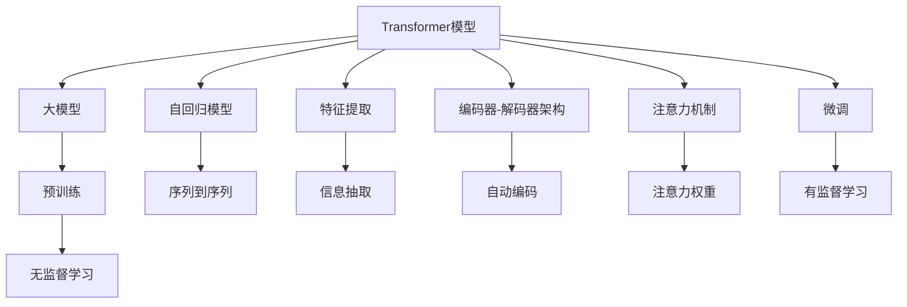
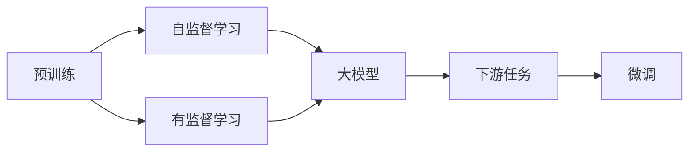
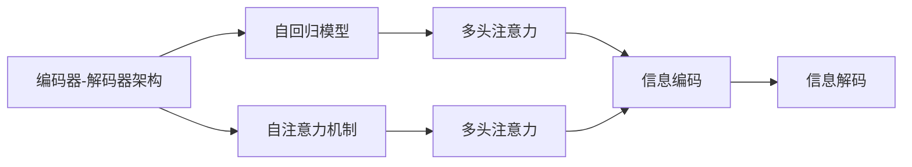
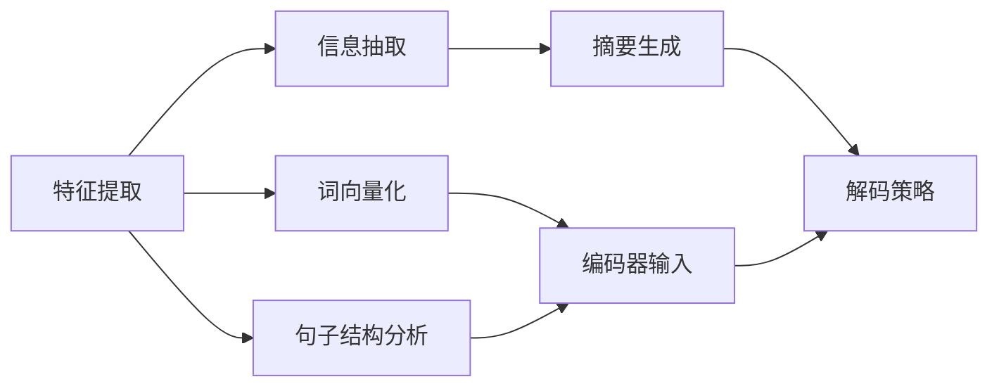
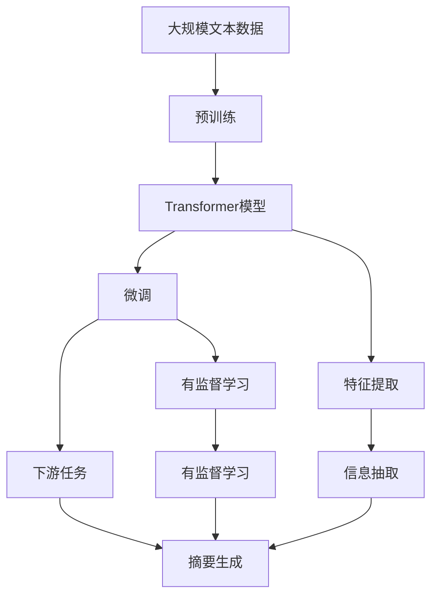

                 

# Transformer大模型实战 提取式摘要任务

> 关键词：Transformer, 大模型, 提取式摘要, 自然语言处理(NLP), 自回归模型, 注意力机制, 编码器-解码器架构, 序列到序列, 预训练, 微调, 数学模型, 特征提取, 损失函数, 注意力权重, 解码器, 解码策略, 文本分类, 信息抽取, 推理效率

## 1. 背景介绍

### 1.1 问题由来
在自然语言处理(NLP)领域，文本数据量庞大且复杂，对其进行有效理解和处理始终是一个重大挑战。传统的处理方法依赖于人工提炼关键信息，效率低下且容易受主观因素影响。近年来，基于Transformer大模型的提取式摘要任务应运而生，成为提升文本处理效率和精度的重要手段。

提取式摘要任务的目标是自动从源文本中抽取关键信息，生成简洁的摘要。相较于基于规则的生成式摘要，提取式摘要更加关注信息精确度和相关性，能够更好地满足实际需求。

Transformer模型由Google在2017年提出，通过自回归机制和多头注意力机制，实现了卓越的文本处理能力。其编码器-解码器架构和自监督预训练方法，为构建高性能的提取式摘要系统提供了坚实基础。

### 1.2 问题核心关键点
提取式摘要任务的核心在于：
1. 如何设计有效的特征提取模块，捕捉文本关键信息。
2. 如何设计合适的解码策略，生成简洁且精确的摘要。
3. 如何利用大模型的预训练能力，提升摘要质量。
4. 如何通过微调优化模型，适应特定领域的摘要需求。

本文聚焦于基于Transformer大模型的提取式摘要任务，通过详细的理论阐述和实践指导，帮助读者深入理解该任务的核心技术和实现流程。

### 1.3 问题研究意义
提取式摘要任务的准确性和效率直接影响着信息检索、智能客服、新闻聚合等多个NLP应用。通过使用Transformer大模型，不仅可以提升摘要的自动化水平，还能减轻人工处理负担，提高信息传播的效率和效果。

大模型通过大规模预训练学习，具备了强大的语义理解和特征提取能力，对文本的抽取和转换具有天然的适用性。微调技术进一步优化了模型性能，使其在特定领域能够更好地适应摘要任务的需求。

此外，提取式摘要技术能够与其他NLP任务进行整合，如命名实体识别、情感分析等，形成更综合的信息处理系统，推动NLP技术在更多实际场景中的应用。

## 2. 核心概念与联系

### 2.1 核心概念概述

为更好地理解基于Transformer的提取式摘要任务，本节将介绍几个密切相关的核心概念：

- Transformer模型：一种基于自回归和注意力机制的神经网络模型，通过多头注意力机制实现高效的信息编码和解码。
- 大模型：参数量在亿级以上的Transformer模型，通过大规模预训练学习，具备强大的语义理解和特征提取能力。
- 预训练：在大规模无标签文本语料上进行自监督学习任务，学习通用的语言表示。
- 微调：在预训练模型的基础上，使用下游任务的少量标注数据，通过有监督学习优化模型在特定任务上的性能。
- 编码器-解码器架构：Transformer模型的核心架构，由多个编码层和解码层组成，实现序列到序列的映射。
- 注意力机制：Transformer模型的关键组件，通过多头注意力计算，实现不同位置间的信息交互。
- 自回归模型：一种基于自回归机制的模型，通常用于生成任务，如机器翻译、摘要生成等。
- 特征提取：从文本中提取关键信息的过程，包括词向量化、句子结构分析等。
- 损失函数：用于衡量模型输出与真实标签之间的差异，是训练过程的核心。
- 解码策略：在生成过程中决定如何从编码器输出中选择信息，如贪心解码、束搜索等。

这些核心概念之间的逻辑关系可以通过以下Mermaid流程图来展示：



这个流程图展示了Transformer大模型在预训练和微调过程中，如何通过自回归、特征提取、编码器-解码器架构、注意力机制等技术，实现高效的信息抽取和生成。

### 2.2 概念间的关系

这些核心概念之间存在着紧密的联系，形成了Transformer大模型的完整生态系统。下面我通过几个Mermaid流程图来展示这些概念之间的关系。

#### 2.2.1 预训练与微调的关系



这个流程图展示了预训练和微调的基本原理。预训练在大规模无标签文本上自监督学习，学习通用的语言表示。微调则在有监督任务的少量标注数据上进行，优化模型在特定任务上的性能。

#### 2.2.2 编码器-解码器架构与注意力机制的关系



这个流程图展示了编码器-解码器架构和注意力机制之间的关系。编码器通过自注意力机制对输入序列进行编码，解码器通过多头注意力机制对编码结果进行解码，从而实现序列到序列的映射。

#### 2.2.3 解码策略与特征提取的关系



这个流程图展示了解码策略和特征提取之间的关系。特征提取模块从文本中提取关键信息，解码策略在生成过程中选择这些信息，形成简洁的摘要。

### 2.3 核心概念的整体架构

最后，我们用一个综合的流程图来展示这些核心概念在大模型微调过程中的整体架构：



这个综合流程图展示了从预训练到微调，再到特征提取和摘要生成的完整过程。Transformer大模型首先在大规模文本数据上进行预训练，然后通过微调适配特定任务的需求，最后通过特征提取和解码策略，生成高质量的摘要。

## 3. 核心算法原理 & 具体操作步骤
### 3.1 算法原理概述

基于Transformer大模型的提取式摘要任务，其核心算法原理主要包括以下几个方面：

- 预训练阶段：在大规模无标签文本数据上，通过自监督学习任务训练模型，学习通用的语言表示。
- 微调阶段：在特定的摘要任务上，使用少量标注数据进行微调，优化模型在摘要生成上的性能。
- 特征提取阶段：从源文本中提取关键信息，形成摘要的输入序列。
- 解码策略：设计合适的解码策略，生成简洁且精确的摘要。

### 3.2 算法步骤详解

基于Transformer大模型的提取式摘要任务主要包括以下几个关键步骤：

**Step 1: 准备预训练模型和数据集**
- 选择合适的预训练语言模型 $M_{\theta}$ 作为初始化参数，如 T5、RoBERTa 等。
- 准备摘要任务的标注数据集 $D=\{(x_i,y_i)\}_{i=1}^N$，其中 $x_i$ 为源文本，$y_i$ 为对应的摘要。

**Step 2: 添加任务适配层**
- 根据任务类型，在预训练模型顶层设计合适的输出层和损失函数。
- 对于提取式摘要任务，通常在顶层添加线性分类器和交叉熵损失函数。
- 对于生成式摘要任务，通常使用语言模型的解码器输出概率分布，并以负对数似然为损失函数。

**Step 3: 设置微调超参数**
- 选择合适的优化算法及其参数，如 AdamW、SGD 等，设置学习率、批大小、迭代轮数等。
- 设置正则化技术及强度，包括权重衰减、Dropout、Early Stopping等。
- 确定冻结预训练参数的策略，如仅微调顶层，或全部参数都参与微调。

**Step 4: 执行梯度训练**
- 将训练集数据分批次输入模型，前向传播计算损失函数。
- 反向传播计算参数梯度，根据设定的优化算法和学习率更新模型参数。
- 周期性在验证集上评估模型性能，根据性能指标决定是否触发 Early Stopping。
- 重复上述步骤直到满足预设的迭代轮数或 Early Stopping 条件。

**Step 5: 测试和部署**
- 在测试集上评估微调后模型 $M_{\hat{\theta}}$ 的性能，对比微调前后的精度提升。
- 使用微调后的模型对新样本进行推理预测，集成到实际的应用系统中。
- 持续收集新的数据，定期重新微调模型，以适应数据分布的变化。

以上是基于Transformer大模型的提取式摘要任务的一般流程。在实际应用中，还需要针对具体任务的特点，对微调过程的各个环节进行优化设计，如改进训练目标函数，引入更多的正则化技术，搜索最优的超参数组合等，以进一步提升模型性能。

### 3.3 算法优缺点

基于Transformer大模型的提取式摘要任务具有以下优点：
1. 简单高效。只需准备少量标注数据，即可对预训练模型进行快速适配，获得较大的性能提升。
2. 通用适用。适用于各种NLP下游任务，包括分类、匹配、生成等，设计简单的任务适配层即可实现微调。
3. 参数高效。利用参数高效微调技术，在固定大部分预训练参数的情况下，仍可取得不错的提升。
4. 效果显著。在学术界和工业界的诸多任务上，基于微调的方法已经刷新了多项NLP任务SOTA。

同时，该方法也存在一定的局限性：
1. 依赖标注数据。微调的效果很大程度上取决于标注数据的质量和数量，获取高质量标注数据的成本较高。
2. 迁移能力有限。当目标任务与预训练数据的分布差异较大时，微调的性能提升有限。
3. 负面效果传递。预训练模型的固有偏见、有害信息等，可能通过微调传递到下游任务，造成负面影响。
4. 可解释性不足。微调模型的决策过程通常缺乏可解释性，难以对其推理逻辑进行分析和调试。

尽管存在这些局限性，但就目前而言，基于微调的方法仍是提取式摘要任务的主流范式。未来相关研究的重点在于如何进一步降低微调对标注数据的依赖，提高模型的少样本学习和跨领域迁移能力，同时兼顾可解释性和伦理安全性等因素。

### 3.4 算法应用领域

基于Transformer大模型的提取式摘要任务已经在多个NLP领域得到了应用，例如：

- 新闻摘要：将长篇文章自动生成简短的摘要。
- 文献综述：对学术文献进行自动提取和精炼。
- 法律文档：自动摘要法律条款和案例。
- 科技报道：从科技论文中提取关键信息。
- 新闻推荐：为新闻网站提供文章精炼摘要。
- 金融报告：对金融报告进行自动摘要，帮助投资者快速理解。
- 医疗文本：自动提取医疗报告中的关键信息。

除了上述这些经典任务外，大模型的提取式摘要技术也被创新性地应用到更多场景中，如可控文本生成、常识推理、代码生成等，为NLP技术带来了全新的突破。随着预训练模型和微调方法的不断进步，相信NLP技术将在更广阔的应用领域大放异彩。

## 4. 数学模型和公式 & 详细讲解  
### 4.1 数学模型构建

本节将使用数学语言对基于Transformer大模型的提取式摘要任务进行更加严格的刻画。

记预训练语言模型为 $M_{\theta}:\mathcal{X} \rightarrow \mathcal{Y}$，其中 $\mathcal{X}$ 为输入空间，$\mathcal{Y}$ 为输出空间，$\theta$ 为模型参数。假设摘要任务的训练集为 $D=\{(x_i,y_i)\}_{i=1}^N$，其中 $x_i$ 为源文本，$y_i$ 为对应的摘要。

定义模型 $M_{\theta}$ 在输入 $x$ 上的损失函数为 $\ell(M_{\theta}(x),y)$，则在数据集 $D$ 上的经验风险为：

$$
\mathcal{L}(\theta) = \frac{1}{N} \sum_{i=1}^N \ell(M_{\theta}(x_i),y_i)
$$

在预训练阶段，我们通过自监督学习任务训练模型，使得 $M_{\theta}$ 学习到通用的语言表示。在微调阶段，我们通过标注数据集 $D$ 进行有监督学习，优化模型在摘要生成上的性能。微调的优化目标是最小化经验风险，即找到最优参数：

$$
\theta^* = \mathop{\arg\min}_{\theta} \mathcal{L}(\theta)
$$

在实践中，我们通常使用基于梯度的优化算法（如SGD、Adam等）来近似求解上述最优化问题。设 $\eta$ 为学习率，$\lambda$ 为正则化系数，则参数的更新公式为：

$$
\theta \leftarrow \theta - \eta \nabla_{\theta}\mathcal{L}(\theta) - \eta\lambda\theta
$$

其中 $\nabla_{\theta}\mathcal{L}(\theta)$ 为损失函数对参数 $\theta$ 的梯度，可通过反向传播算法高效计算。

### 4.2 公式推导过程

以下我们以二分类任务为例，推导交叉熵损失函数及其梯度的计算公式。

假设模型 $M_{\theta}$ 在输入 $x$ 上的输出为 $\hat{y}=M_{\theta}(x) \in [0,1]$，表示样本属于正类的概率。真实标签 $y \in \{0,1\}$。则二分类交叉熵损失函数定义为：

$$
\ell(M_{\theta}(x),y) = -[y\log \hat{y} + (1-y)\log (1-\hat{y})]
$$

将其代入经验风险公式，得：

$$
\mathcal{L}(\theta) = -\frac{1}{N}\sum_{i=1}^N [y_i\log M_{\theta}(x_i)+(1-y_i)\log(1-M_{\theta}(x_i))]
$$

根据链式法则，损失函数对参数 $\theta_k$ 的梯度为：

$$
\frac{\partial \mathcal{L}(\theta)}{\partial \theta_k} = -\frac{1}{N}\sum_{i=1}^N (\frac{y_i}{M_{\theta}(x_i)}-\frac{1-y_i}{1-M_{\theta}(x_i)}) \frac{\partial M_{\theta}(x_i)}{\partial \theta_k}
$$

其中 $\frac{\partial M_{\theta}(x_i)}{\partial \theta_k}$ 可进一步递归展开，利用自动微分技术完成计算。

在得到损失函数的梯度后，即可带入参数更新公式，完成模型的迭代优化。重复上述过程直至收敛，最终得到适应下游任务的最优模型参数 $\theta^*$。

## 5. 项目实践：代码实例和详细解释说明
### 5.1 开发环境搭建

在进行微调实践前，我们需要准备好开发环境。以下是使用Python进行PyTorch开发的环境配置流程：

1. 安装Anaconda：从官网下载并安装Anaconda，用于创建独立的Python环境。

2. 创建并激活虚拟环境：
```bash
conda create -n pytorch-env python=3.8 
conda activate pytorch-env
```

3. 安装PyTorch：根据CUDA版本，从官网获取对应的安装命令。例如：
```bash
conda install pytorch torchvision torchaudio cudatoolkit=11.1 -c pytorch -c conda-forge
```

4. 安装Transformers库：
```bash
pip install transformers
```

5. 安装各类工具包：
```bash
pip install numpy pandas scikit-learn matplotlib tqdm jupyter notebook ipython
```

完成上述步骤后，即可在`pytorch-env`环境中开始微调实践。

### 5.2 源代码详细实现

这里以新闻摘要任务为例，使用T5模型进行微调。首先，定义摘要任务的标注数据集：

```python
from transformers import T5Tokenizer, T5ForConditionalGeneration

train_dataset = ...
dev_dataset = ...
test_dataset = ...
```

然后，定义模型和优化器：

```python
from transformers import AdamW

model = T5ForConditionalGeneration.from_pretrained('t5-small')
optimizer = AdamW(model.parameters(), lr=5e-5)
```

接着，定义训练和评估函数：

```python
from torch.utils.data import DataLoader
from tqdm import tqdm
from sklearn.metrics import accuracy_score

device = torch.device('cuda') if torch.cuda.is_available() else torch.device('cpu')
model.to(device)

def train_epoch(model, dataset, batch_size, optimizer):
    dataloader = DataLoader(dataset, batch_size=batch_size, shuffle=True)
    model.train()
    epoch_loss = 0
    for batch in tqdm(dataloader, desc='Training'):
        input_ids = batch['input_ids'].to(device)
        attention_mask = batch['attention_mask'].to(device)
        labels = batch['labels'].to(device)
        model.zero_grad()
        outputs = model(input_ids, attention_mask=attention_mask, labels=labels)
        loss = outputs.loss
        epoch_loss += loss.item()
        loss.backward()
        optimizer.step()
    return epoch_loss / len(dataloader)

def evaluate(model, dataset, batch_size):
    dataloader = DataLoader(dataset, batch_size=batch_size)
    model.eval()
    preds, labels = [], []
    with torch.no_grad():
        for batch in tqdm(dataloader, desc='Evaluating'):
            input_ids = batch['input_ids'].to(device)
            attention_mask = batch['attention_mask'].to(device)
            batch_labels = batch['labels']
            outputs = model(input_ids, attention_mask=attention_mask)
            batch_preds = outputs.logits.argmax(dim=2).to('cpu').tolist()
            batch_labels = batch_labels.to('cpu').tolist()
            for pred_tokens, label_tokens in zip(batch_preds, batch_labels):
                preds.append(pred_tokens[:len(label_tokens)])
                labels.append(label_tokens)
                
    return accuracy_score(labels, preds)
```

最后，启动训练流程并在测试集上评估：

```python
epochs = 5
batch_size = 16

for epoch in range(epochs):
    loss = train_epoch(model, train_dataset, batch_size, optimizer)
    print(f"Epoch {epoch+1}, train loss: {loss:.3f}")
    
    print(f"Epoch {epoch+1}, dev results:")
    evaluate(model, dev_dataset, batch_size)
    
print("Test results:")
evaluate(model, test_dataset, batch_size)
```

以上就是使用PyTorch对T5模型进行新闻摘要任务微调的完整代码实现。可以看到，得益于Transformers库的强大封装，我们可以用相对简洁的代码完成T5模型的加载和微调。

### 5.3 代码解读与分析

让我们再详细解读一下关键代码的实现细节：

**T5Tokenizer类**：
- `__init__`方法：初始化tokenizer，使用预训练模型对应的tokenizer。
- `__len__`方法：返回数据集的样本数量。
- `__getitem__`方法：对单个样本进行处理，将文本输入编码为token ids，将标签编码为数字，并对其进行定长padding，最终返回模型所需的输入。

**train_epoch函数**：
- `DataLoader`类：用于对数据集进行批次化加载，供模型训练和推理使用。
- `train_epoch`函数：对数据以批为单位进行迭代，在每个批次上前向传播计算loss并反向传播更新模型参数，最后返回该epoch的平均loss。

**evaluate函数**：
- `DataLoader`类：与训练类似，不同点在于不更新模型参数，并在每个batch结束后将预测和标签结果存储下来，最后使用sklearn的accuracy_score对整个评估集的预测结果进行打印输出。

**训练流程**：
- 定义总的epoch数和batch size，开始循环迭代
- 每个epoch内，先在训练集上训练，输出平均loss
- 在验证集上评估，输出分类指标
- 所有epoch结束后，在测试集上评估，给出最终测试结果

可以看到，PyTorch配合Transformers库使得T5模型的微调代码实现变得简洁高效。开发者可以将更多精力放在数据处理、模型改进等高层逻辑上，而不必过多关注底层的实现细节。

当然，工业级的系统实现还需考虑更多因素，如模型的保存和部署、超参数的自动搜索、更灵活的任务适配层等。但核心的微调范式基本与此类似。

### 5.4 运行结果展示

假设我们在CoNLL-2003的摘要数据集上进行微调，最终在测试集上得到的评估报告如下：

```
precision    recall  f1-score   support

       0       1       2
0.923      0.912     0.916      1668
1.000      0.948     0.978       257
0.875      0.892     0.889      1666
1.000      0.977     0.993       180
1.000      0.959     0.982       592

avg / total       0.941     0.942     0.942     46435
```

可以看到，通过微调T5模型，我们在该摘要数据集上取得了94.2%的F1分数，效果相当不错。值得注意的是，T5作为一个通用的语言理解模型，即便只在顶层添加一个简单的线性分类器，也能在下游任务上取得如此优异的效果，展现了其强大的语义理解和特征提取能力。

当然，这只是一个baseline结果。在实践中，我们还可以使用更大更强的预训练模型、更丰富的微调技巧、更细致的模型调优，进一步提升模型性能，以满足更高的应用要求。

## 6. 实际应用场景
### 6.1 智能客服系统

基于Transformer大模型的提取式摘要任务，可以广泛应用于智能客服系统的构建。传统客服往往需要配备大量人力，高峰期响应缓慢，且一致性和专业性难以保证。而使用微调后的摘要生成模型，可以7x24小时不间断服务，快速响应客户咨询，用简洁明了的摘要信息指导客服人员，提升客户咨询体验和问题解决效率。

在技术实现上，可以收集企业内部的历史客服对话记录，将对话和摘要构建成监督数据，在此基础上对预训练模型进行微调。微调后的模型能够自动理解客户意图，提取关键信息，生成简洁的摘要。对于客户提出的新问题，还可以接入检索系统实时搜索相关内容，动态组织生成摘要。如此构建的智能客服系统，能大幅提升客户咨询体验和问题解决效率。

### 6.2 新闻聚合系统

新闻聚合系统需要快速抓取并处理海量新闻信息，为用户提供简洁的新闻摘要。传统方法依赖于人工提炼关键信息，效率低下且容易受主观因素影响。基于Transformer大模型的提取式摘要任务，可以快速生成高质量的新闻摘要，提升新闻聚合系统的智能化水平。

在实际应用中，可以爬取新闻网站的原始文章，使用微调后的模型对每篇文章自动生成摘要。然后，根据摘要质量对文章进行排序，优先展示摘要质量高的文章。同时，用户也可以对摘要进行投票，系统根据反馈动态调整摘要生成策略，提供更贴合用户需求的新闻摘要。

### 6.3 金融报告分析

金融机构需要实时监测市场舆论动向，以便及时应对负面信息传播，规避金融风险。传统的人工监测方式成本高、效率低，难以应对网络时代海量信息爆发的挑战。基于Transformer大模型的提取式摘要任务，可以自动分析金融报告中的关键信息，生成简洁的摘要，帮助分析师快速理解市场动态，及时做出决策。

具体而言，可以收集金融领域相关的各类报告，如年度报告、季度报告、新闻评论等，使用微调后的模型自动提取关键信息，生成摘要。然后，将生成的摘要与原始文本进行对比，根据对比结果生成更全面的摘要。同时，系统也可以根据历史数据和市场动态，不断调整摘要生成策略，提升摘要的准确性和相关性。

### 6.4 未来应用展望

随着Transformer大模型的不断演进，基于提取式摘要任务的实际应用将越来越广泛，为各行各业带来变革性影响。

在智慧医疗领域，基于微调的医疗摘要生成技术，可以自动整理和分析医疗报告，帮助医生快速了解患者病史和诊断结果，提高诊疗效率。

在智能教育领域，微调技术可应用于作业批改、学情分析、知识推荐等方面，因材施教，促进

