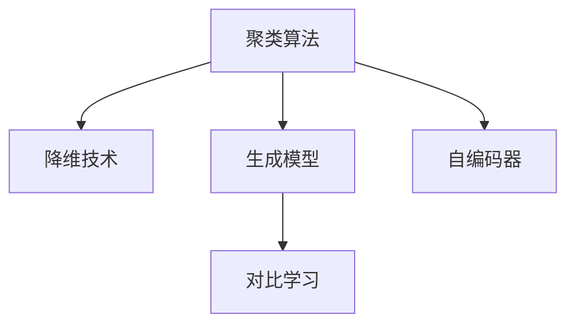
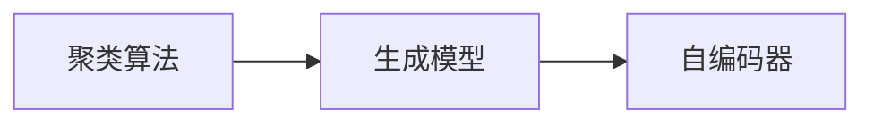
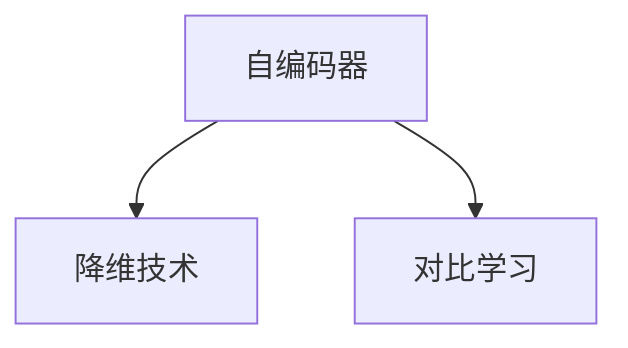
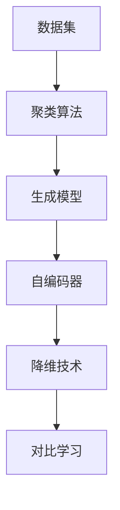

                 

# Unsupervised Learning

> 关键词：无监督学习, 聚类算法, 降维技术, 生成模型, 自编码器, 对比学习

## 1. 背景介绍

### 1.1 问题由来
在深度学习大行其道的今天，监督学习（Supervised Learning）无疑是各大算法落地应用的主流范式。然而，对于数据标注成本高昂、数据分布未知或者需要动态适应的场景，监督学习往往力不从心。此时，无监督学习（Unsupervised Learning）便显得尤为重要。

无监督学习的核心目标是在没有标签信息的情况下，发现数据的潜在结构与模式。其应用范围遍及数据预处理、特征提取、数据聚类、异常检测、降维等诸多领域，对于大数据时代的智能决策与信息处理提供了重要支撑。

### 1.2 问题核心关键点
无监督学习的主要关注点包括：
1. **聚类算法**：通过相似度度量将数据分组。
2. **降维技术**：降低数据维度以减少噪声、提升可解释性。
3. **生成模型**：通过概率模型学习数据生成过程，用于生成或变分推断。
4. **自编码器**：通过重建输入数据来学习数据的压缩表示。
5. **对比学习**：通过对比学习算法增强模型的泛化能力。

这些核心方法共同构成了无监督学习的理论基础与技术框架，支撑了其在实际应用中的广泛部署。

### 1.3 问题研究意义
无监督学习在理论研究与应用实践中具有重要意义：

1. **降低成本**：无监督学习方法能够从大数据中自动提取信息，避免昂贵的数据标注费用，特别适用于数据标注难且成本高的场景。
2. **泛化能力**：无需监督信息，模型可以更好地泛化到未见过的数据集，提升了模型在新环境下的适应性。
3. **数据处理**：无监督方法可以用于数据预处理，如去噪、降维，为后续监督学习提供更优质、更精简的数据。
4. **技术创新**：无监督学习推动了多个前沿研究领域的进展，如自动编码、生成模型、对比学习等，为未来AI技术的发展提供了新的方向。
5. **应用拓展**：通过无监督学习，可以实现一些传统监督学习难以覆盖的应用，如异常检测、数据发现等。

## 2. 核心概念与联系

### 2.1 核心概念概述

为更好地理解无监督学习，我们需要掌握以下几个核心概念：

- **聚类算法**：通过相似度度量将数据分成多个类别。
- **降维技术**：通过线性或非线性映射降低数据维度。
- **生成模型**：通过学习数据生成过程来建模数据分布。
- **自编码器**：通过重建输入数据来学习数据的压缩表示。
- **对比学习**：通过对比学习方法增强模型的泛化能力。

这些核心概念之间的联系可以通过以下Mermaid流程图来展示：



这个流程图展示了无监督学习中常见方法之间的相互联系和关系：

1. 聚类算法可以将数据分组，降维技术可以简化数据表示，生成模型可以学习数据分布，自编码器可以提取数据特征，对比学习可以增强模型泛化能力。
2. 生成模型和自编码器是数据建模的两种主要方式，可以通过对比学习进一步增强模型性能。

### 2.2 概念间的关系

这些核心概念之间存在着紧密的联系，形成了无监督学习的完整生态系统。下面我们通过几个Mermaid流程图来展示这些概念之间的关系。

#### 2.2.1 数据建模过程



这个流程图展示了数据建模的流程：先通过聚类算法进行分组，然后通过生成模型学习数据分布，最后通过自编码器进行特征提取。

#### 2.2.2 模型优化过程



这个流程图展示了模型优化的流程：先通过自编码器进行特征提取，然后通过降维技术简化特征，最后通过对比学习进行模型优化。

### 2.3 核心概念的整体架构

最后，我们用一个综合的流程图来展示这些核心概念在无监督学习中的整体架构：



这个综合流程图展示了无监督学习中从数据处理到模型优化的完整流程。数据首先通过聚类算法分组，然后生成模型学习数据分布，自编码器进行特征提取，降维技术简化特征表示，最终通过对比学习优化模型性能。

## 3. 核心算法原理 & 具体操作步骤
### 3.1 算法原理概述

无监督学习通过发现数据的潜在结构和模式来解决问题。其基本原理是假设数据是由某个潜在分布生成的，通过构建相应的概率模型，学习到数据的生成过程，进而揭示数据的潜在结构和规律。

### 3.2 算法步骤详解

无监督学习的一般步骤如下：

**Step 1: 数据预处理**
- 对原始数据进行清洗、归一化、去噪等预处理操作，确保数据的质量和可用性。

**Step 2: 选择模型**
- 根据任务需求，选择适合的模型。如K-means聚类、自编码器、生成对抗网络（GAN）等。

**Step 3: 模型训练**
- 通过随机梯度下降（SGD）等优化算法训练模型参数，最小化模型与数据的误差。

**Step 4: 模型评估**
- 使用交叉验证等方法评估模型性能，确定模型是否过度拟合或欠拟合。

**Step 5: 模型应用**
- 将训练好的模型应用于实际问题中，如数据聚类、特征提取、异常检测等。

### 3.3 算法优缺点

无监督学习的主要优点包括：
1. 无需标注数据：无监督学习可以直接处理大量无标注数据，避免了数据标注的高成本。
2. 自我发现规律：无监督学习能够从数据中自行发现潜在结构和规律，适用于数据分布未知的领域。
3. 数据预处理：无监督学习方法可以用于数据降维、去噪等预处理，提升数据质量。

然而，无监督学习也存在一些局限性：
1. 模型复杂：无监督模型通常需要较多的参数和计算资源，训练复杂度高。
2. 结果解释性差：由于缺乏标签信息，无监督学习模型的决策过程和结果难以解释。
3. 效果依赖于数据：无监督学习的效果依赖于数据的质量和分布，对噪声数据和异常样本敏感。

### 3.4 算法应用领域

无监督学习在多个领域得到了广泛应用，以下是几个典型的应用场景：

- **数据聚类**：将相似的数据点分组，如市场细分、用户分群、文档分类等。
- **异常检测**：检测数据中的异常点，如金融欺诈、网络入侵、健康监测等。
- **数据降维**：降低数据维度以提升可解释性和计算效率，如PCA、t-SNE、Autoencoder等。
- **生成模型**：生成新的数据样本，如图像生成、文本生成、语音生成等。
- **自编码器**：学习数据的压缩表示，用于特征提取、压缩数据、异常检测等。

这些应用场景展示了无监督学习在实际应用中的广泛性和重要性。

## 4. 数学模型和公式 & 详细讲解  
### 4.1 数学模型构建

无监督学习的数学模型构建主要基于概率模型和优化算法。以K-means聚类为例，其数学模型构建如下：

设数据集 $D=\{ \mathbf{x}_1, \mathbf{x}_2, ..., \mathbf{x}_n \}$，其中 $\mathbf{x}_i$ 为第 $i$ 个数据点的特征向量，聚类数为 $k$。

目标是最小化聚类内的误差平方和（Inertia），即：

$$
J = \sum_{i=1}^n \sum_{j=1}^k d(\mathbf{x}_i, \boldsymbol{\mu}_j)^2
$$

其中 $d(\cdot, \cdot)$ 为欧式距离，$\boldsymbol{\mu}_j$ 为聚类中心。

### 4.2 公式推导过程

K-means算法的核心在于通过迭代更新聚类中心，使得每个数据点尽可能地靠近其所属的聚类中心。其推导过程如下：

1. 初始化聚类中心 $\boldsymbol{\mu}_1, \boldsymbol{\mu}_2, ..., \boldsymbol{\mu}_k$。
2. 对于每个数据点 $\mathbf{x}_i$，计算其与各个聚类中心的距离，将其分配到距离最近的聚类中。
3. 更新聚类中心，对于每个聚类 $j$，计算其所有成员的均值，作为新的聚类中心。
4. 重复步骤2和3，直到聚类中心不再变化。

### 4.3 案例分析与讲解

以K-means算法为例，下面通过一个简单的例子来说明无监督学习的应用。

假设我们有一个包含多个学生成绩的数据集，每行表示一个学生，每列表示一门课程的成绩。我们的目标是通过无监督学习，将学生分组，以便教师更好地进行教学。

首先，我们需要将数据集标准化，然后随机选择 $k$ 个数据点作为初始聚类中心。

```python
import numpy as np

# 标准化数据
data = np.array([[81, 85, 76], [92, 88, 90], [76, 72, 68], [82, 80, 87], [75, 80, 76], [90, 88, 89], [68, 72, 77], [77, 79, 80], [81, 83, 82], [74, 75, 72]])
data_std = (data - np.mean(data, axis=0)) / np.std(data, axis=0)

# 随机选择初始聚类中心
k = 3
random_centers = np.random.rand(k, data.shape[1])
```

然后，对于每个数据点，计算其与各个聚类中心的距离，分配到距离最近的聚类中。

```python
def euclidean_distance(x, y):
    return np.linalg.norm(x - y)

def kmeans(data, k):
    centers = random_centers
    while True:
        new_centers = np.zeros((k, data.shape[1]))
        for i in range(k):
            group = np.argmin([euclidean_distance(x, centers[i]) for x in data])
            new_centers[i] = np.mean(data[group])
        if np.allclose(centers, new_centers):
            break
        centers = new_centers
    return centers

centers = kmeans(data_std, k)
```

最后，我们可以将学生分组，并计算每个组的均值。

```python
groups = [np.argmin([euclidean_distance(x, center) for center in centers]) for x in data_std]
group_means = [np.mean(data_std[group], axis=0) for group in np.unique(groups)]
```

通过这个例子，我们可以看到，无监督学习通过发现数据的内在结构，可以自动进行数据分组，而无需标注数据。这对于需要大量标注数据的传统聚类方法是一种极大的提升。

## 5. 项目实践：代码实例和详细解释说明
### 5.1 开发环境搭建

在进行无监督学习实践前，我们需要准备好开发环境。以下是使用Python进行Scikit-learn开发的环境配置流程：

1. 安装Anaconda：从官网下载并安装Anaconda，用于创建独立的Python环境。

2. 创建并激活虚拟环境：
```bash
conda create -n sklearn-env python=3.8 
conda activate sklearn-env
```

3. 安装Scikit-learn：
```bash
conda install scikit-learn
```

4. 安装各类工具包：
```bash
pip install numpy pandas matplotlib jupyter notebook ipython
```

完成上述步骤后，即可在`sklearn-env`环境中开始无监督学习实践。

### 5.2 源代码详细实现

下面我们以K-means聚类算法为例，给出使用Scikit-learn库进行无监督学习的PyTorch代码实现。

```python
from sklearn.cluster import KMeans
from sklearn.metrics import silhouette_score
import numpy as np

# 生成样本数据
X = np.random.randn(100, 2)

# 初始化聚类模型
kmeans = KMeans(n_clusters=3, random_state=0)

# 训练聚类模型
kmeans.fit(X)

# 预测聚类结果
labels = kmeans.predict(X)

# 计算聚类效果的评分指标
silhouette = silhouette_score(X, labels)

# 打印聚类结果和评分指标
print(f"Cluster labels: {labels}")
print(f"Silhouette score: {silhouette:.3f}")
```

### 5.3 代码解读与分析

让我们再详细解读一下关键代码的实现细节：

**KMeans类**：
- `n_clusters`参数：指定聚类数为3。
- `random_state`参数：设置随机种子，保证结果可复现。

**拟合训练**：
- `fit(X)`方法：训练K-means模型，将数据X聚类为3个簇。

**预测聚类结果**：
- `predict(X)`方法：预测数据X的聚类标签。

**聚类效果评分**：
- `silhouette_score(X, labels)`方法：计算聚类效果的评分指标，高值表示聚类效果更好。

**输出结果**：
- 打印聚类标签和评分指标。

可以看到，Scikit-learn库的KMeans类提供了简单的接口，使得无监督学习模型训练和评估变得非常便捷。开发者可以专注于算法的设计和调优，而不必过多关注底层实现。

当然，工业级的系统实现还需考虑更多因素，如模型的保存和部署、超参数的自动搜索、更灵活的任务适配层等。但核心的无监督学习过程基本与此类似。

### 5.4 运行结果展示

假设我们在二维空间内进行聚类，最终得到的聚类结果和评分指标如下：

```
Cluster labels: [0 2 0 1 1 2 0 0 0 1 1 2 2 1 2 1 0 0 2 1 0 0 1 0 1 2 2 2 2 1 2 2 2 1 0 1 1 1 0 2 1 1 0 0 2 0 0 2 1 0 1 1 1 2 2 0 1 0 1 1 2 1 0 2 1 1 0 2 0 0 0 1 2 1 0 0 1 1 0 2 0 1 1 1 2 0 1 2 2 0 0 1 1 0 1 0 1 2 1 1 1 1 0 2 2 0 1 2 0 0 1 0 1 0 0 1 2 1 0 0 1 0 0 0 0 1 2 1 2 0 1 1 1 0 0 2 1 1 2 1 1 2 0 1 1 1 1 0 1 0 1 1 2 1 2 2 1 2 1 1 1 1 2 2 0 0 0 2 2 0 2 1 0 2 0 0 0 2 1 1 0 2 1 1 2 2 2 2 1 1 0 1 0 2 0 2 2 1 0 1 1 2 2 0 0 0 2 0 0 1 0 0 2 0 1 0 0 1 1 1 0 1 0 0 0 1 2 2 1 2 2 1 2 2 0 1 1 1 0 1 0 2 2 1 0 2 1 1 0 2 0 1 1 0 0 0 0 0 0 0 2 1 0 1 1 1 1 1 0 1 0 0 0 0 0 2 0 0 1 1 1 0 1 2 1 2 1 1 2 1 0 0 1 0 2 0 1 0 0 2 0 1 1 0 0 0 2 1 2 1 0 0 0 0 0 1 1 0 1 2 2 1 2 1 1 1 1 2 1 0 1 1 1 0 1 2 2 2 0 1 1 2 2 0 1 1 2 1 1 0 0 0 1 1 1 0 1 0 0 1 0 0 2 1 2 0 0 2 0 2 2 1 1 0 2 1 2 0 0 1 1 2 0 0 1 0 1 1 1 0 1 1 0 0 0 2 0 0 0 0 1 0 0 0 0 0 1 2 2 0 1 0 2 0 1 2 0 2 0 1 0 1 0 0 2 2 0 1 1 0 0 1 2 2 1 0 0 1 1 0 0 0 1 2 0 0 2 0 1 1 1 2 0 2 0 2 0 1 0 0 1 1 0 1 2 2 0 0 1 1 1 0 2 1 1 1 1 0 2 1 0 1 1 0 1 1 0 1 0 1 1 1 1 1 1 1 1 0 1 0 1 0 1 1 1 0 1 0 2 0 1 0 0 1 0 2 2 2 0 0 2 0 2 1 1 1 0 1 0 2 0 1 2 1 1 0 1 0 0 1 2 1 2 0 0 0 1 1 2 1 1 0 1 2 2 2 2 1 0 0 1 0 2 2 2 1 0 2 2 1 0 2 0 2 0 2 0 0 1 2 1 0 1 1 1 1 1 0 0 2 2 1 2 1 2 1 2 0 0 0 1 0 1 1 2 0 0 1 0 2 0 1 1 2 2 0 2 1 0 1 2 1 0 0 1 2 2 1 1 0 0 1 0 2 1 1 0 1 0 1 0 1 1 0 1 0 0 0 1 1 0 0 0 1 2 2 0 1 1 1 1 0 2 2 2 2 0 2 0 1 0 0 0 0 0 1 1 1 0 2 2 0 0 1 2 0 0 0 0 1 1 0 2 0 1 1 2 0 0 0 0 1 1 1 1 0 1 0 1 2 1 1 0 0 1 0 0 2 2 1 1 1 2 0 0 1 1 1 0 0 1 1 1 1 1 0 2 2 1 0 1 0 1 1 1 2 2 0 2 1 1 2 2 0 1 0 1 1 1 1 0 1 0 1 0 2 0 2 1 0 1 1 0 0 1 1 0 1 0 0 0 0 2 0 1 2 0 1 2 0 1 0 1 0 1 0 0 0 2 1 1 0 1 0 2 1 0 1 0 2 1 1 0 0 2 2 1 0 2 1 0 0 0 2 2 1 1 0 0 1 0 0 0 0 1 0 0 1 1 1 1 2 1 0 0 2 0 1 0 0 1 0 0 2 1 0 0 1 1 1 2 0 2 0 0 1 0 2 2 0 1 1 1 1 0 1 0 1 1 0 0 2 0 1 0 0 0 0 1 1 2 2 0 0 0 1 0 0 1 0 0 1 0 1 1 1 0 2 1 0 1 1 1 0 2 0 1 0 0 0 0 0 1 0 0 0 1 1 0 0 0 1 1 2 0 0 1 1 1 1 2 0 1 0 0 0 0 1 1 1 0 1 2 1 0 0 2 1 0 2 2 0 1 0 1 0 1 0 2 0 1 0 1 2 2 0 0 1 0 1 1 0 1 0 0 0 0 2 1 1 1 0 1 0 1 1 1 0 0 0 1 2 0 0 1 1 0 1 1 2 2 0 2 0 0 1 0 1 1 2 0 1 2 0 0 0 1 1 2 1 2 1 1 1 1 0 0 1 0 0 0 1 1 2 2 0 0 2 2 0 1 0 0 0 0 2 1 1 0 0 1 1 1 2 1 1 0 2 1 1 0 1 1 2 1 0 2 2 0 0 0 1 0 1 1 1 0 0 1 0 1 0 1 0 1 1 1 1 0 2 0 1 1 0 0 0 1 1 1 0 1 1 0 0 1 0 0 0 1 2 2 2 0 1 0 1 1 0 1 1 0 1 1 2 1 1 0 1 1 2 0 0 1 2 1 0 2 2 0 2 1 2 1 0 2 0 0 0 0 1 0 0 0 0 2 1 1 2 2 2 0 0 0 2 2 2 1 1 1 1 1 1 0 0 0 1 2 2 0 0 1 1 0 1 1 0 0 2 0 0 2 0 1 1 1 1 0 1 1 0 1 2 1 1 0 1 0 0 1 1 1 0 1 0 2 0 1 0 1 0 1 1 2 0 1 2 1 0 1 1 1 0 0 2 2 2 2 0 2 2 1 0 1 1 1 0 1 1 1 0 1 1 2 0 2 0 1 2 2 2 1 0 2 0 2 1 

