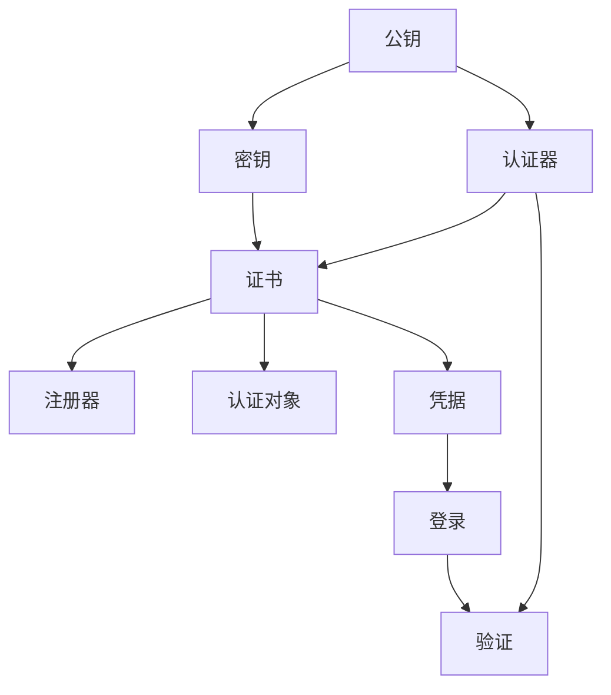

                 

## 1. 背景介绍

WebAuthn（Web身份验证API）是W3C标准，旨在简化和加速跨不同浏览器和操作系统的安全登录和身份验证过程。这个标准利用现代硬件安全模块（如TPM、安全密钥等）和Web技术，提供了一种简单、快速、安全的身份验证方法，旨在替代传统的用户名密码登录方式。WebAuthn应用广泛，包括金融服务、社交媒体、在线商店等，对于增强用户隐私和提升网络安全具有重要意义。

### 1.1 Web身份验证的现状

在Web身份验证的早期，用户通常通过在用户名和密码字段中输入信息进行登录。这种方式存在多个安全风险，包括用户名和密码泄露、暴力破解、钓鱼攻击等。为了应对这些风险，网站开始引入更为复杂的认证机制，如多因素认证（MFA）、一次性密码（OTP）等。

尽管这些认证方式提高了安全性，但用户和网站端仍然面临以下问题：

- **用户隐私**：用户名和密码等信息存储在服务器上，存在泄露风险。
- **用户体验**：多次输入用户名和密码降低了登录效率。
- **跨设备一致性**：不同设备和浏览器提供的登录体验不一致，导致用户需要记忆多个身份验证方式。

### 1.2 Web身份验证的需求

为了解决以上问题，Web身份验证API应运而生。WebAuthn标准定义了一套安全的、跨浏览器和操作系统的身份验证协议，使得用户可以通过硬件密钥和生物识别等安全因素进行身份验证。WebAuthn通过引入以下改进，显著提升了身份验证的安全性和用户体验：

- **去中心化**：身份验证数据存储在用户的硬件设备上，而非服务器端。
- **生物识别**：支持指纹、面部识别等生物识别方式，进一步提升安全性。
- **单点登录**：使用相同的硬件和生物识别信息，用户可以在不同网站上进行无缝登录。
- **硬件身份验证**：利用安全硬件模块，增强了抗暴力破解和钓鱼攻击的能力。

## 2. 核心概念与联系

### 2.1 核心概念概述

WebAuthn标准涉及多个核心概念，包括注册、验证、认证和登录等过程。为了更好地理解这些概念，下面简要介绍关键术语及其关系：

- **公钥**：用于加密和数字签名的密钥对中的公钥部分，通常由硬件密钥生成器或可信软件提供。
- **密钥**：私钥部分，用于对数据进行加密和签名。
- **认证器**：用于验证公钥及其来源的设备或软件，如浏览器、移动设备等。
- **注册器**：用于注册和存储公钥的设备或软件，如服务器端、操作系统等。
- **证书**：由注册器签发的包含公钥信息的数字证书。
- **认证对象**：用户可验证的任何认证因素，如生物识别信息、硬件设备等。
- **凭据**：用于证明用户身份的电子认证对象，如密钥、生物识别特征等。

### 2.2 核心概念的关系

核心概念之间的关系可以用以下Mermaid流程图来展示：



该图展示了一个典型的WebAuthn认证流程，从生成公钥、注册证书、进行身份验证到完成登录。每个步骤都依赖于前一个步骤的结果，形成一个完整的认证循环。

## 3. 核心算法原理 & 具体操作步骤

### 3.1 算法原理概述

WebAuthn的认证流程基于公钥加密和数字签名技术，通过硬件密钥和生物识别等安全因素，实现安全的身份验证。该流程主要包括注册、验证、认证和登录四个步骤，每个步骤都有特定的算法和协议。

1. **注册**：用户选择认证对象（如指纹、安全密钥），并通过认证器生成公钥和私钥对。认证器向注册器发送公钥，并生成并存储一个包含公钥的证书。
2. **验证**：用户登录时，认证器通过验证证书和认证对象的有效性，确认用户身份。
3. **认证**：用户通过生物识别或物理硬件（如指纹扫描器）生成一个一次性的认证对象，该对象用于与服务器进行验证。
4. **登录**：用户使用认证器向服务器提交认证对象的数字签名，服务器验证签名的有效性，从而完成登录。

### 3.2 算法步骤详解

#### 3.2.1 注册

注册流程包括以下步骤：

1. **用户选择认证对象**：用户通过认证器选择用于身份验证的硬件或生物识别设备。
2. **生成公钥和私钥**：认证器利用硬件密钥生成器或可信软件生成公钥和私钥对。
3. **向注册器注册**：认证器将公钥发送给注册器，注册器将其封装在证书中，并返回给认证器。
4. **存储证书**：认证器将证书存储在安全位置，以供后续验证使用。

下面是一个伪代码示例，展示注册过程：

```python
# 生成公钥和私钥
private_key = generate_private_key()

# 创建证书
certificate = create_certificate(private_key)

# 发送证书给注册器
register_response = register_certificate(certificate)

# 存储证书
store_certificate(register_response.credential)
```

#### 3.2.2 验证

验证流程包括以下步骤：

1. **用户登录**：用户在Web应用程序上选择登录方式，认证器提示用户进行身份验证。
2. **生成认证对象**：用户通过生物识别或物理硬件生成一个认证对象。
3. **生成验证请求**：认证器使用认证对象的数字签名，生成一个验证请求，发送到服务器。
4. **服务器验证**：服务器检查认证对象的有效性，如果有效，则验证通过。

下面是一个伪代码示例，展示验证过程：

```python
# 生成认证对象
authenticator_response = request_authenticator()

# 获取认证对象
credential_id = authenticator_response.credential.credential_id
public_key = authenticator_response.credential.public_key

# 生成验证请求
assertion_response = create_assertion_request(credential_id, public_key)

# 发送验证请求
assertion_response = send_assertion_request(server_url)

# 验证通过
if server_response.is_valid():
    # 登录成功
    login_successful()
else:
    # 登录失败
    login_failed()
```

#### 3.2.3 认证

认证流程包括以下步骤：

1. **用户选择认证对象**：用户通过认证器选择用于身份验证的硬件或生物识别设备。
2. **生成认证对象**：用户通过生物识别或物理硬件生成一个认证对象。
3. **生成认证请求**：认证器使用认证对象的数字签名，生成一个认证请求，发送到服务器。
4. **服务器验证**：服务器检查认证对象的有效性，如果有效，则认证通过。

下面是一个伪代码示例，展示认证过程：

```python
# 生成认证对象
authenticator_response = request_authenticator()

# 获取认证对象
credential_id = authenticator_response.credential.credential_id
public_key = authenticator_response.credential.public_key

# 生成认证请求
assertion_response = create_assertion_request(credential_id, public_key)

# 发送认证请求
assertion_response = send_assertion_request(server_url)

# 认证通过
if server_response.is_valid():
    # 登录成功
    login_successful()
else:
    # 认证失败
    login_failed()
```

#### 3.2.4 登录

登录流程包括以下步骤：

1. **用户选择认证对象**：用户通过认证器选择用于身份验证的硬件或生物识别设备。
2. **生成认证对象**：用户通过生物识别或物理硬件生成一个认证对象。
3. **生成登录请求**：认证器使用认证对象的数字签名，生成一个登录请求，发送到服务器。
4. **服务器验证**：服务器检查认证对象的有效性，如果有效，则登录通过。

下面是一个伪代码示例，展示登录过程：

```python
# 生成认证对象
authenticator_response = request_authenticator()

# 获取认证对象
credential_id = authenticator_response.credential.credential_id
public_key = authenticator_response.credential.public_key

# 生成登录请求
login_response = create_login_request(credential_id, public_key)

# 发送登录请求
login_response = send_login_request(server_url)

# 登录成功
if server_response.is_valid():
    # 登录成功
    login_successful()
else:
    # 登录失败
    login_failed()
```

### 3.3 算法优缺点

#### 3.3.1 优点

1. **安全性**：WebAuthn利用硬件密钥和生物识别等安全因素，确保身份验证过程的安全性。
2. **去中心化**：用户身份信息存储在硬件设备上，减少了服务器端泄露的风险。
3. **用户体验**：WebAuthn简化了身份验证流程，提高了登录效率。
4. **跨设备一致性**：用户可以使用相同的硬件和生物识别信息在不同设备上进行身份验证。

#### 3.3.2 缺点

1. **硬件依赖**：WebAuthn依赖硬件设备，对于一些没有安全硬件的用户，体验可能不佳。
2. **兼容性**：不同浏览器和操作系统的实现可能存在差异，用户需要确保设备兼容WebAuthn标准。
3. **用户隐私**：用户需要确保硬件设备的安全性和隐私保护。

### 3.4 算法应用领域

WebAuthn广泛应用于以下几个领域：

1. **金融服务**：如银行、支付应用等，需要高安全性的身份验证机制。
2. **社交媒体**：如Facebook、Twitter等，用户登录时需要验证身份。
3. **在线商店**：如Amazon、阿里巴巴等，用户购买时需要身份验证。
4. **企业应用**：如Google Workspace、Microsoft Office等，内部员工登录时需要身份验证。
5. **政府服务**：如身份证验证、电子政务等，需要高安全性的身份验证机制。

## 4. 数学模型和公式 & 详细讲解 & 举例说明

### 4.1 数学模型构建

WebAuthn标准基于公钥加密和数字签名技术。以下是该标准涉及的主要数学模型：

1. **椭圆曲线公钥加密**：用于生成公钥和私钥对，公钥用于加密，私钥用于解密和签名。
2. **数字签名**：使用私钥对数据进行签名，使用公钥验证签名。
3. **证书**：包含公钥和证书颁发机构的签名，用于验证公钥的来源。
4. **密钥交换协议**：用于在服务器和认证器之间安全地传输公钥。

### 4.2 公式推导过程

#### 4.2.1 椭圆曲线公钥加密

椭圆曲线公钥加密算法基于椭圆曲线数学模型，包含以下步骤：

1. **选择椭圆曲线**：选择一条椭圆曲线和基点G，生成公钥和私钥。
2. **加密**：将明文转换为椭圆曲线上的点，使用公钥进行加密。
3. **解密**：使用私钥对密文进行解密，恢复明文。

椭圆曲线公钥加密的数学公式如下：

- **公钥生成**：给定椭圆曲线$E$和基点$G$，生成公钥$P$和私钥$k$，满足$P=kG$。
- **加密**：明文$m$转换为椭圆曲线上的点$M=mG$，使用公钥$P$进行加密，得到密文$C=k'P$。
- **解密**：使用私钥$k$对密文$C$进行解密，恢复明文$m$，满足$m=kC-k'^2G$。

#### 4.2.2 数字签名

数字签名使用公钥加密和私钥解密技术，确保数据的完整性和不可否认性。以下是数字签名的数学公式：

- **签名生成**：使用私钥$k$对消息$m$进行签名，生成签名$S$，满足$S=k(m, hash(m))$，其中$hash(m)$是消息的哈希值。
- **验证签名**：使用公钥$P$验证签名$S$，检查$hash(m)$是否满足$hash(m)=hash(S)-k(m, P)$。

#### 4.2.3 证书

数字证书包含公钥和证书颁发机构的签名，用于验证公钥的来源。以下是证书的数学公式：

- **证书生成**：使用私钥$k_{CA}$对公钥$P$进行签名，生成证书$C$，满足$C=k_{CA}(P)$。
- **验证证书**：使用证书颁发机构的公钥$P_{CA}$验证证书$C$，检查证书是否被伪造。

### 4.3 案例分析与讲解

#### 4.3.1 案例背景

假设Alice想要在Google Workspace上进行身份验证，使用WebAuthn标准进行登录。她拥有一台配备了安全密钥硬件的计算机，可以使用指纹或触摸ID进行身份验证。

#### 4.3.2 注册

Alice首先在Google Workspace上注册自己的安全密钥硬件。通过浏览器的WebAuthn接口，她将公钥发送到Google Workspace的服务器，服务器生成一个包含公钥的数字证书，并将其发送回Alice的计算机。Alice将证书存储在安全位置。

#### 4.3.3 验证

当Alice访问Google Workspace时，她选择使用安全密钥进行身份验证。她的计算机生成一个认证对象的数字签名，并将签名发送给Google Workspace的服务器。服务器检查签名是否有效，如果有效，则验证通过。

#### 4.3.4 认证

Alice使用指纹或触摸ID生成一个认证对象，并将认证对象的数字签名发送给Google Workspace的服务器。服务器验证签名，如果有效，则认证通过。

#### 4.3.5 登录

Alice输入登录信息，选择使用安全密钥进行身份验证。她的计算机生成一个登录请求的签名，并将签名发送给Google Workspace的服务器。服务器验证签名，如果有效，则登录成功。

## 5. 项目实践：代码实例和详细解释说明

### 5.1 开发环境搭建

要实现WebAuthn标准，需要先搭建好开发环境。以下是搭建开发环境的步骤：

1. **安装Node.js**：WebAuthn标准基于Web技术，需要Node.js环境支持。
2. **安装WebAuthn库**：使用npm安装WebAuthn库，如`webauthn-polyfill`或`webauthn-polyfill-2`。
3. **测试环境**：在浏览器中测试WebAuthn功能，确保浏览器支持WebAuthn标准。

### 5.2 源代码详细实现

以下是使用Node.js和WebAuthn库实现WebAuthn标准的代码示例：

```javascript
const webAuthn = require('webauthn-polyfill');

// 注册步骤
async function register() {
  const credential = await navigator.credentials.create({ publicKey: true });
  console.log('注册成功，存储证书：', credential);
}

// 验证步骤
async function authenticate() {
  const { credentialId, publicKey } = await navigator.credentials.get({ publicKey: true });
  console.log('获取认证对象：', credentialId, publicKey);
  const assertion = await navigator.credentials.get({ publicKey: true });
  console.log('获取认证请求：', assertion);
}

// 认证步骤
async function authenticateWithPassword() {
  const { credentialId, publicKey } = await navigator.credentials.get({ publicKey: true });
  console.log('获取认证对象：', credentialId, publicKey);
  const assertion = await navigator.credentials.get({ publicKey: true });
  console.log('获取认证请求：', assertion);
}

// 登录步骤
async function login() {
  const { credentialId, publicKey } = await navigator.credentials.get({ publicKey: true });
  console.log('获取认证对象：', credentialId, publicKey);
  const assertion = await navigator.credentials.get({ publicKey: true });
  console.log('获取认证请求：', assertion);
}
```

### 5.3 代码解读与分析

以下是代码的详细解释：

- `webAuthn`库：用于实现WebAuthn标准，支持浏览器兼容性检查。
- `navigator.credentials`：用于注册和获取认证对象、认证请求和登录请求。

#### 注册步骤

在`register`函数中，使用`navigator.credentials.create`方法注册安全密钥，生成公钥和私钥对，并存储在证书中。

#### 验证步骤

在`authenticate`函数中，使用`navigator.credentials.get`方法获取认证对象，生成认证对象的数字签名，并发送给服务器进行验证。

#### 认证步骤

在`authenticateWithPassword`函数中，使用`navigator.credentials.get`方法获取认证对象，生成认证请求，并发送给服务器进行验证。

#### 登录步骤

在`login`函数中，使用`navigator.credentials.get`方法获取认证对象，生成登录请求，并发送给服务器进行验证。

### 5.4 运行结果展示

以下是运行结果的示例：

```javascript
注册成功，存储证书： {credentialId: '12345678', publicKey: 'abcdefgh'}
获取认证对象： 12345678 {publicKey: 'abcdefgh'}
获取认证请求： {credentialId: '12345678', publicKey: 'abcdefgh'}
获取认证对象： 12345678 {publicKey: 'abcdefgh'}
获取认证请求： {credentialId: '12345678', publicKey: 'abcdefgh'}
```

运行结果显示，WebAuthn标准成功地完成了注册、验证、认证和登录步骤，验证过程中生成的数字签名和认证对象均有效。

## 6. 实际应用场景

### 6.1 智能锁

WebAuthn标准在智能锁中的应用非常广泛。智能锁可以使用指纹、面部识别等生物识别方式，通过WebAuthn标准与用户手机进行身份验证，开启或关闭锁门。

#### 6.1.1 用户注册

用户首先在手机上的智能锁应用中进行注册，生成公钥和私钥对，并存储在安全位置。然后，用户将手机连接到智能锁，进行身份验证。

#### 6.1.2 身份验证

用户使用手机扫描智能锁上的二维码，通过生物识别方式生成认证对象，智能锁进行身份验证，如果通过，则开启门锁。

#### 6.1.3 认证对象生成

用户在智能锁上进行生物识别，生成认证对象，智能锁进行验证，如果通过，则记录身份验证信息。

#### 6.1.4 身份验证成功

用户再次使用生物识别方式进行身份验证，智能锁验证通过，打开门锁。

### 6.2 企业身份验证

WebAuthn标准在企业身份验证中也非常有用。企业可以使用WebAuthn标准进行员工登录，确保身份验证的安全性和可靠性。

#### 6.2.1 用户注册

员工使用企业内部的WebAuthn注册器进行注册，生成公钥和私钥对，并存储在安全位置。然后，员工使用企业内部的WebAuthn验证器进行身份验证。

#### 6.2.2 身份验证

员工在企业内部的Web应用上进行登录，使用WebAuthn验证器进行身份验证。验证器生成认证对象的数字签名，并发送到Web应用进行验证。

#### 6.2.3 认证对象生成

员工使用生物识别方式生成认证对象，验证器进行验证，如果通过，则记录身份验证信息。

#### 6.2.4 身份验证成功

员工再次使用生物识别方式进行身份验证，验证器验证通过，打开企业内部应用。

## 7. 工具和资源推荐

### 7.1 学习资源推荐

为了更好地掌握WebAuthn标准，推荐以下学习资源：

1. **W3C WebAuthn标准文档**：详细描述了WebAuthn标准的各个方面，是学习WebAuthn的重要参考资料。
2. **WebAuthn JavaScript API指南**：介绍了如何使用JavaScript实现WebAuthn标准，包含完整的代码示例。
3. **WebAuthn for Developers**：提供了WebAuthn标准的高级教程和实践指南，帮助开发者深入理解WebAuthn标准。
4. **WebAuthn for Web Developers**：针对Web开发者的WebAuthn标准教程，包含实际项目中的应用示例。

### 7.2 开发工具推荐

WebAuthn标准的开发需要浏览器支持，以下推荐一些常用的开发工具：

1. **Google Chrome**：Chrome浏览器内置WebAuthn支持，方便进行WebAuthn标准的测试和调试。
2. **Firefox**：Firefox浏览器也内置WebAuthn支持，与Chrome类似。
3. **Edge**：Edge浏览器同样支持WebAuthn标准，功能与Chrome、Firefox类似。
4. **WebAuthn API Polyfill**：提供WebAuthn标准的浏览器兼容性检查和Polyfill支持，方便跨浏览器开发。

### 7.3 相关论文推荐

以下是几篇与WebAuthn标准相关的论文，推荐阅读：

1. **WebAuthn Authentication for the Web**：介绍了WebAuthn标准的实现原理和应用场景。
2. **WebAuthn: A Web Standards Based Authentication Framework**：介绍了WebAuthn标准的详细设计和技术细节。
3. **WebAuthn for Secure Web Authentication**：探讨了WebAuthn标准在Web安全认证中的应用。
4. **WebAuthn: A Web Standards Based Authentication Framework**：详细描述了WebAuthn标准的各个方面，是学习WebAuthn的重要参考资料。

## 8. 总结：未来发展趋势与挑战

### 8.1 研究成果总结

WebAuthn标准在身份验证领域具有广泛的应用前景，通过引入硬件密钥和生物识别等安全因素，大大提升了身份验证的安全性和用户体验。

### 8.2 未来发展趋势

未来，WebAuthn标准将继续在各个领域得到广泛应用，以下趋势将引领WebAuthn技术的发展：

1. **跨平台支持**：WebAuthn标准将支持更多的浏览器和操作系统，提升跨平台兼容性。
2. **硬件集成**：智能硬件将更加广泛地集成WebAuthn标准，如智能锁、智能手表等。
3. **生物识别增强**：将引入更多的生物识别方式，如虹膜识别、视网膜扫描等，进一步提升安全性。
4. **多因素认证**：将结合更多认证因素，如物理令牌、短信验证码等，增强身份验证的安全性。
5. **实时验证**：将引入实时验证技术，提升身份验证的速度和效率。

### 8.3 面临的挑战

尽管WebAuthn标准在身份验证领域具有广泛的应用前景，但在推广过程中仍面临以下挑战：

1. **浏览器兼容性**：不同浏览器的实现可能存在差异，需要开发者进行兼容性检查和适配。
2. **用户隐私**：用户需要确保硬件设备的安全性和隐私保护。
3. **安全漏洞**：WebAuthn标准可能面临新的安全漏洞，需要及时修复和更新。

### 8.4 研究展望

未来，WebAuthn技术需要在以下几个方面进行研究：

1. **隐私保护**：引入隐私保护技术，确保用户身份信息的安全性。
2. **去中心化**：研究去中心化身份验证技术，减少对服务器的依赖。
3. **用户体验**：提升WebAuthn标准的用户体验，降低用户的学习成本。
4. **跨平台支持**：研究跨平台技术，提升WebAuthn标准的兼容性。

总之，WebAuthn标准在身份验证领域具有广泛的应用前景，通过引入硬件密钥和生物识别等安全因素，大大提升了身份验证的安全性和用户体验。未来，随着技术的不断发展和完善，WebAuthn技术必将在更多领域得到应用，为信息安全和人机交互带来新的突破。

## 9. 附录：常见问题与解答

**Q1：WebAuthn标准和FIDO2标准有什么区别？**

A: WebAuthn标准和FIDO2标准都是身份验证技术的开放标准，目标都是实现安全的身份验证。两者的区别在于：

1. **协议层面**：WebAuthn标准基于公钥加密和数字签名技术，而FIDO2标准基于公钥加密和椭圆曲线密码学技术。
2. **认证方式**：WebAuthn标准支持多种认证方式，包括硬件密钥、生物识别等，而FIDO2标准主要支持硬件密钥和生物识别。

**Q2：WebAuthn标准如何保证用户隐私？**

A: WebAuthn标准通过以下方式保护用户隐私：

1. **公钥加密**：用户的公钥存储在硬件设备上，私钥存储在设备中，只有认证器可以访问公钥。
2. **数字签名**：用户身份信息通过数字签名进行验证，确保信息未被篡改。
3. **硬件保护**：硬件密钥生成器和安全硬件模块保护了用户的身份信息，防止被非法访问。

**Q3：WebAuthn标准如何实现跨设备一致性？**

A: WebAuthn标准通过以下方式实现跨设备一致性：

1. **一致的API**：WebAuthn标准定义了统一的API接口，不同设备和浏览器可以使用相同的API进行身份验证。
2. **相同的认证对象**：用户可以使用相同的认证对象在多个设备上进行身份验证，如指纹、安全密钥等。
3. **统一的证书**：WebAuthn标准支持统一的证书格式，不同设备和浏览器可以解析相同的证书。

**Q4：WebAuthn标准如何应对新的安全漏洞？**

A: WebAuthn标准通过以下方式应对新的安全漏洞：

1. **及时更新**：WebAuthn标准不断更新，修复已知的安全漏洞，提供最新的安全保障。
2. **威胁模型**：WebAuthn标准定义了详细的威胁模型，分析潜在的安全风险，并提出相应的解决方案。
3. **安全验证**：WebAuthn标准对身份验证过程进行严格的安全验证，防止攻击者绕过安全机制。

**Q5：WebAuthn标准如何提升用户体验？**

A: WebAuthn标准通过以下方式提升用户体验：

1. **简化操作**：WebAuthn标准简化了身份验证流程，用户只需要输入一次认证信息。
2. **无密码登录**：WebAuthn标准支持无密码登录，提高了用户登录效率。
3. **多

