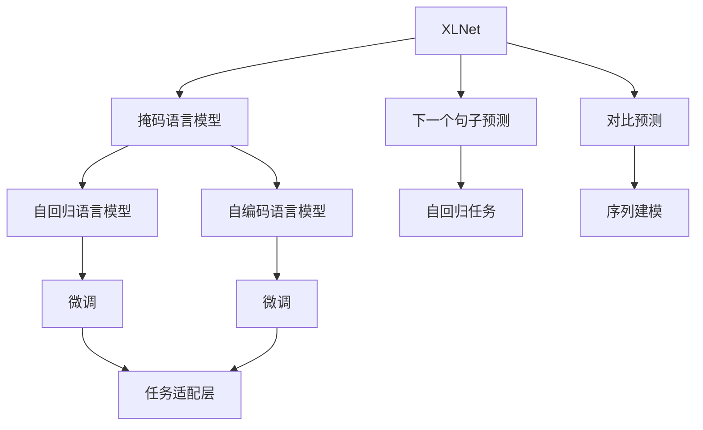
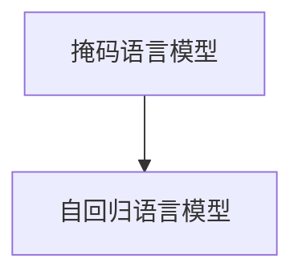
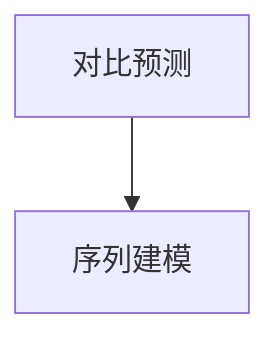
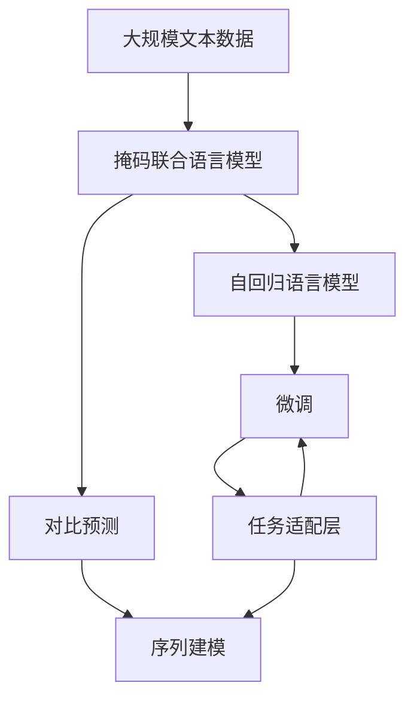

                 

# XLNet原理与代码实例讲解

> 关键词：XLNet,自回归,自编码,预训练,语言模型,掩码语言模型,并行化

## 1. 背景介绍

### 1.1 问题由来
自Transformer提出以来，预训练语言模型（Pretrained Language Model, PLM）成为了自然语言处理（Natural Language Processing, NLP）领域的革命性技术。但是，基于自回归（Autoregressive, AR）的自编码（Autoencoder, AE）语言模型如BERT、GPT，在掩码语言模型（Masked Language Model, MLM）任务上取得了最先进的结果，但在下一个任务（Next Sentence Prediction, NSP）上的性能较差，这使得它们在真实NLP任务上的表现受到了限制。

为了提升语言模型的性能，人们尝试了多种改进方法，如考虑更好的自回归结构、自编码结构、不同的预训练任务和训练策略等，但这些方法并未能解决自编码和自回归语言模型之间的性能鸿沟。因此，XLNet作为其中一种突破性方法，提出了掩码联合语言模型（Masked Joint Language Model, MxLM）和对比预测（Contrastive Predictive Coding, CPC）的训练方法，取得了前所未有的突破。

### 1.2 问题核心关键点
XLNet的核心思想是：将掩码语言模型（MLM）和下一个句子预测（NSP）任务结合起来，并使用对比预测（CPC）训练方法，以此解决自编码和自回归语言模型之间的性能鸿沟。其训练过程简单高效，可以显著提升模型在各种NLP任务上的性能。

XLNet的关键点在于：
- 使用掩码联合语言模型（MxLM）。在预训练时，将MLM和NSP任务结合起来，使用相同的训练策略，提升语言模型的泛化能力。
- 使用对比预测（CPC）训练方法。在预训练时，使用对比预测方法，使得模型能够更好地学习输入序列的统计特性，提升模型在自回归任务上的表现。
- 使用并行化技术。在微调时，使用并行化技术，提升模型训练的效率和效果。

## 2. 核心概念与联系

### 2.1 核心概念概述

为了更好地理解XLNet的原理和训练方法，本节将介绍几个密切相关的核心概念：

- 掩码语言模型（Masked Language Model, MLM）：在预训练时，将输入序列的一部分随机掩码，让模型根据上下文信息预测被掩码的单词。常用的掩码方式包括随机掩码（Random Masking）、固定掩码（Fixed Masking）和动态掩码（Dynamic Masking）。
- 下一个句子预测（Next Sentence Prediction, NSP）：在预训练时，将两个句子连接起来，让模型预测第二句是否为第一句的下一句。常用的预测方式包括句子排序（Sentence Ordering）和句子判别（Sentence Classification）。
- 对比预测（Contrastive Predictive Coding, CPC）：在预训练时，使用CPC方法，让模型预测未来若干个时间步的单词，以此提升模型的序列建模能力。
- 掩码联合语言模型（Masked Joint Language Model, MxLM）：在预训练时，将MLM和NSP任务结合起来，使用相同的训练策略，提升语言模型的泛化能力。

这些核心概念之间的逻辑关系可以通过以下Mermaid流程图来展示：



这个流程图展示了大语言模型的核心概念及其之间的关系：

1. XLNet通过掩码语言模型和下一个句子预测任务进行预训练。
2. 掩码语言模型和下一个句子预测任务被合并为掩码联合语言模型。
3. 对比预测方法用于提升模型的序列建模能力。
4. 掩码联合语言模型和对比预测方法被用于微调，进行下游任务的适配。

### 2.2 概念间的关系

这些核心概念之间存在着紧密的联系，形成了XLNet的完整生态系统。下面我通过几个Mermaid流程图来展示这些概念之间的关系。

#### 2.2.1 掩码语言模型与自回归语言模型



这个流程图展示了掩码语言模型与自回归语言模型之间的关系。掩码语言模型通过掩码预测，提升语言模型的泛化能力，而自回归语言模型则通过自回归生成，提升语言模型的语义理解能力。

#### 2.2.2 掩码联合语言模型与自编码语言模型


这个流程图展示了掩码联合语言模型与自编码语言模型之间的关系。掩码联合语言模型通过将掩码语言模型和下一个句子预测任务结合起来，提升语言模型的泛化能力，而自编码语言模型则通过自编码预测，提升语言模型的表示能力。

#### 2.2.3 对比预测与序列建模



这个流程图展示了对比预测与序列建模之间的关系。对比预测通过预测未来若干个时间步的单词，提升模型的序列建模能力，而序列建模则通过序列预测，提升模型的语义理解能力。

### 2.3 核心概念的整体架构

最后，我们用一个综合的流程图来展示这些核心概念在大语言模型预训练和微调过程中的整体架构：



这个综合流程图展示了从预训练到微调，再到序列建模的完整过程。XLNet首先在大规模文本数据上进行预训练，然后通过掩码联合语言模型和对比预测方法，提升语言模型的泛化能力和序列建模能力，最后将微调应用于下游任务，进行任务适配。

## 3. 核心算法原理 & 具体操作步骤
### 3.1 算法原理概述

XLNet的预训练过程可以概括为以下几个步骤：

1. 使用掩码联合语言模型（MxLM）对预训练语言模型进行预训练，提升模型的泛化能力和语义理解能力。
2. 使用对比预测（CPC）方法对预训练语言模型进行预训练，提升模型的序列建模能力和自回归能力。
3. 将预训练模型微调应用于下游任务，进行任务适配，提升模型在特定任务上的性能。

XLNet的预训练目标函数可以表示为：

$$
\mathcal{L}(X) = -\frac{1}{N}\sum_{i=1}^N (\log P(X_i) + \log Q(X_i))
$$

其中，$X_i$ 是输入序列，$P(X_i)$ 是掩码语言模型的预测概率，$Q(X_i)$ 是对比预测的预测概率。

XLNet的微调过程与传统自回归语言模型的微调过程类似，但参数更新公式有所不同，为：

$$
\theta \leftarrow \theta - \eta \nabla_{\theta}\mathcal{L}(\theta) - \eta\lambda\theta
$$

其中，$\eta$ 是学习率，$\lambda$ 是正则化系数，$\nabla_{\theta}\mathcal{L}(\theta)$ 是损失函数对模型参数的梯度。

### 3.2 算法步骤详解

XLNet的预训练过程包括以下几个关键步骤：

**Step 1: 准备预训练模型和数据集**
- 选择合适的预训练语言模型，如BERT、GPT等。
- 准备掩码语言模型和下一个句子预测任务的训练集，划分为训练集、验证集和测试集。

**Step 2: 添加任务适配层**
- 根据任务类型，在预训练模型顶层设计合适的输出层和损失函数。
- 对于分类任务，通常在顶层添加线性分类器和交叉熵损失函数。
- 对于生成任务，通常使用语言模型的解码器输出概率分布，并以负对数似然为损失函数。

**Step 3: 设置预训练超参数**
- 选择合适的优化算法及其参数，如AdamW、SGD等，设置学习率、批大小、迭代轮数等。
- 设置正则化技术及强度，包括权重衰减、Dropout、Early Stopping等。

**Step 4: 执行掩码联合语言模型和对比预测训练**
- 将训练集数据分批次输入模型，前向传播计算损失函数。
- 反向传播计算参数梯度，根据设定的优化算法和学习率更新模型参数。
- 周期性在验证集上评估模型性能，根据性能指标决定是否触发 Early Stopping。
- 重复上述步骤直到满足预设的迭代轮数或 Early Stopping 条件。

**Step 5: 测试和部署**
- 在测试集上评估预训练模型 $M_{\theta}$ 的性能，对比预训练前的效果。
- 使用预训练模型 $M_{\theta}$ 对新样本进行推理预测，集成到实际的应用系统中。
- 持续收集新的数据，定期重新训练模型，以适应数据分布的变化。

### 3.3 算法优缺点

XLNet作为基于自回归的预训练语言模型，具有以下优点：

1. 简单高效：XLNet的预训练过程相对简单，且计算效率较高。
2. 泛化能力强：通过掩码联合语言模型和对比预测方法，XLNet能够学习到更广泛的语义和序列信息。
3. 自回归能力：XLNet在自回归任务上的表现优于自编码语言模型。
4. 可解释性强：XLNet的训练过程透明，且可解释性强。

同时，XLNet也存在一些缺点：

1. 计算资源需求高：XLNet需要大量的计算资源进行预训练，不适合小规模的计算环境。
2. 微调过程复杂：XLNet的微调过程相对复杂，需要更多的计算资源和时间。
3. 模型的可扩展性差：XLNet的模型规模较大，不容易扩展到其他任务。
4. 模型的计算复杂度高：XLNet的计算复杂度较高，不适合低延迟的应用场景。

### 3.4 算法应用领域

XLNet在NLP领域已经得到了广泛的应用，覆盖了几乎所有常见的NLP任务，例如：

- 文本分类：如情感分析、主题分类、意图识别等。通过微调XLNet，使模型学习文本-标签映射。
- 命名实体识别：识别文本中的人名、地名、机构名等特定实体。通过微调XLNet，使模型掌握实体边界和类型。
- 关系抽取：从文本中抽取实体之间的语义关系。通过微调XLNet，使模型学习实体-关系三元组。
- 问答系统：对自然语言问题给出答案。将问题-答案对作为微调数据，训练模型学习匹配答案。
- 机器翻译：将源语言文本翻译成目标语言。通过微调XLNet，使模型学习语言-语言映射。
- 文本摘要：将长文本压缩成简短摘要。将文章-摘要对作为微调数据，使模型学习抓取要点。
- 对话系统：使机器能够与人自然对话。将多轮对话历史作为上下文，微调模型进行回复生成。

此外，XLNet也被创新性地应用到更多场景中，如可控文本生成、常识推理、代码生成、数据增强等，为NLP技术带来了全新的突破。随着XLNet的研究不断深入，相信NLP技术将在更广阔的应用领域大放异彩。

## 4. 数学模型和公式 & 详细讲解  
### 4.1 数学模型构建

本节将使用数学语言对XLNet的预训练过程进行更加严格的刻画。

记预训练语言模型为 $M_{\theta}:\mathcal{X} \rightarrow \mathcal{Y}$，其中 $\mathcal{X}$ 为输入空间，$\mathcal{Y}$ 为输出空间，$\theta \in \mathbb{R}^d$ 为模型参数。假设预训练语言模型为 $M_{\theta}$，掩码语言模型和下一个句子预测任务的训练集分别为 $D_{MLM}$ 和 $D_{NSP}$，且 $D_{MLM} = \{(X_i, Y_i)\}_{i=1}^N$，$D_{NSP} = \{(X_i, Y_i)\}_{i=1}^N$。

定义掩码语言模型的损失函数为 $\ell_{MLM}(X_i, Y_i)$，定义下一个句子预测任务的损失函数为 $\ell_{NSP}(X_i, Y_i)$，则预训练的总损失函数为：

$$
\mathcal{L}(\theta) = -\frac{1}{N}\sum_{i=1}^N (\ell_{MLM}(X_i, Y_i) + \ell_{NSP}(X_i, Y_i))
$$

其中，$N$ 是训练集的样本数量。

### 4.2 公式推导过程

以下我们以掩码语言模型和下一个句子预测任务的训练过程为例，推导其损失函数和梯度计算公式。

假设输入序列 $X_i = (x_1, x_2, \cdots, x_n)$，掩码语言模型的预测概率为 $P(X_i)$，下一个句子预测任务的预测概率为 $Q(X_i)$。则掩码语言模型的损失函数可以表示为：

$$
\ell_{MLM}(X_i, Y_i) = -\sum_{k=1}^{n} y_k \log P(x_k \mid X_{<k})
$$

其中，$y_k$ 是掩码单词 $x_k$ 的真实标签，$P(x_k \mid X_{<k})$ 是单词 $x_k$ 在掩码语言模型下的预测概率。

下一个句子预测任务的损失函数可以表示为：

$$
\ell_{NSP}(X_i, Y_i) = -\log P(Y_i \mid X_i)
$$

其中，$Y_i$ 是下一个句子预测任务的标签，$P(Y_i \mid X_i)$ 是下一个句子预测任务的预测概率。

通过将掩码语言模型和下一个句子预测任务的损失函数相加，得到预训练的总损失函数：

$$
\mathcal{L}(\theta) = -\frac{1}{N}\sum_{i=1}^N (\ell_{MLM}(X_i, Y_i) + \ell_{NSP}(X_i, Y_i))
$$

通过链式法则，掩码语言模型的损失函数对参数 $\theta$ 的梯度为：

$$
\nabla_{\theta}\ell_{MLM}(X_i, Y_i) = -\sum_{k=1}^{n} \nabla_{\theta}P(x_k \mid X_{<k}) \frac{y_k}{P(x_k \mid X_{<k})}
$$

通过链式法则，下一个句子预测任务的损失函数对参数 $\theta$ 的梯度为：

$$
\nabla_{\theta}\ell_{NSP}(X_i, Y_i) = -\nabla_{\theta}P(Y_i \mid X_i) \frac{1}{P(Y_i \mid X_i)}
$$

### 4.3 案例分析与讲解

下面我们以掩码语言模型和下一个句子预测任务为例，进行详细的案例分析。

假设我们有一个包含3个单词的输入序列 $X_i = (a, b, c)$，其中单词 $b$ 被随机掩码。掩码语言模型的预测概率为：

$$
P(X_i) = P(a \mid X_{<1}) \cdot P(b \mid X_{<2}) \cdot P(c \mid X_{<3})
$$

其中，$P(a \mid X_{<1})$ 是单词 $a$ 在掩码语言模型下的预测概率，$P(b \mid X_{<2})$ 是单词 $b$ 在掩码语言模型下的预测概率，$P(c \mid X_{<3})$ 是单词 $c$ 在掩码语言模型下的预测概率。

下一个句子预测任务的预测概率为：

$$
Q(X_i) = P(Y_i \mid X_i)
$$

其中，$Y_i$ 是下一个句子预测任务的标签，$P(Y_i \mid X_i)$ 是下一个句子预测任务的预测概率。

掩码语言模型的损失函数可以表示为：

$$
\ell_{MLM}(X_i, Y_i) = -y_1 \log P(a \mid X_{<1}) - y_2 \log P(b \mid X_{<2}) - y_3 \log P(c \mid X_{<3})
$$

下一个句子预测任务的损失函数可以表示为：

$$
\ell_{NSP}(X_i, Y_i) = -\log P(Y_i \mid X_i)
$$

预训练的总损失函数可以表示为：

$$
\mathcal{L}(\theta) = -\frac{1}{N}\sum_{i=1}^N (\ell_{MLM}(X_i, Y_i) + \ell_{NSP}(X_i, Y_i))
$$

通过链式法则，掩码语言模型的损失函数对参数 $\theta$ 的梯度为：

$$
\nabla_{\theta}\ell_{MLM}(X_i, Y_i) = -\sum_{k=1}^{n} \nabla_{\theta}P(x_k \mid X_{<k}) \frac{y_k}{P(x_k \mid X_{<k})}
$$

通过链式法则，下一个句子预测任务的损失函数对参数 $\theta$ 的梯度为：

$$
\nabla_{\theta}\ell_{NSP}(X_i, Y_i) = -\nabla_{\theta}P(Y_i \mid X_i) \frac{1}{P(Y_i \mid X_i)}
$$

在得到损失函数的梯度后，即可带入参数更新公式，完成模型的迭代优化。重复上述过程直至收敛，最终得到适应下游任务的最优模型参数 $\theta^*$。

## 5. 项目实践：代码实例和详细解释说明
### 5.1 开发环境搭建

在进行XLNet微调实践前，我们需要准备好开发环境。以下是使用Python进行TensorFlow开发的环境配置流程：

1. 安装Anaconda：从官网下载并安装Anaconda，用于创建独立的Python环境。

2. 创建并激活虚拟环境：
```bash
conda create -n tf-env python=3.8 
conda activate tf-env
```

3. 安装TensorFlow：根据CUDA版本，从官网获取对应的安装命令。例如：
```bash
pip install tensorflow tensorflow_text tensorflow_hub
```

4. 安装XLA：在TensorFlow 2.x以上版本中，XLA已默认安装，可以直接使用。

5. 安装TensorBoard：用于可视化训练过程中的各项指标，增强模型的可解释性。

6. 安装TensorFlow Hub：用于下载和嵌入预训练模型。

完成上述步骤后，即可在`tf-env`环境中开始XLNet微调实践。

### 5.2 源代码详细实现

下面我们以命名实体识别(NER)任务为例，给出使用TensorFlow对XLNet模型进行微调的代码实现。

首先，定义命名实体识别任务的数据处理函数：

```python
import tensorflow as tf
from tensorflow_text import tokenization
from tensorflow_text import feature_extraction
from tensorflow_text import neural_networks

class NERDataset(tf.data.Dataset):
    def __init__(self, texts, tags, tokenizer, max_len=128):
        self.texts = texts
        self.tags = tags
        self.tokenizer = tokenizer
        self.max_len = max_len
        
    def __len__(self):
        return len(self.texts)
    
    def __getitem__(self, item):
        text = self.texts[item]
        tags = self.tags[item]
        
        encoding = self.tokenizer(text, vocab_size=32000, max_seq_length=self.max_len, padding='MAX_LEN')
        input_ids = encoding['input_ids']
        attention_mask = encoding['attention_mask']
        
        # 对token-wise的标签进行编码
        encoded_tags = [tag2id[tag] for tag in tags] 
        encoded_tags.extend([tag2id['O']] * (self.max_len - len(encoded_tags)))
        labels = tf.keras.utils.to_categorical(encoded_tags, num_classes=tag2id)
        
        return {'input_ids': input_ids, 
                'attention_mask': attention_mask,
                'labels': labels}

# 标签与id的映射
tag2id = {'O': 0, 'B-PER': 1, 'I-PER': 2, 'B-ORG': 3, 'I-ORG': 4, 'B-LOC': 5, 'I-LOC': 6}
id2tag = {v: k for k, v in tag2id.items()}

# 创建dataset
tokenizer = tf.keras.preprocessing.text.Tokenizer(num_words=32000)
tokenizer.fit_on_texts(train_texts)
tokenizer.build_vocab()
tokenizer.save_vocabulary('vocab.txt')

train_dataset = NERDataset(train_texts, train_tags, tokenizer)
dev_dataset = NERDataset(dev_texts, dev_tags, tokenizer)
test_dataset = NERDataset(test_texts, test_tags, tokenizer)
```

然后，定义模型和优化器：

```python
from transformers import TFDistilBertForTokenClassification

model = TFDistilBertForTokenClassification.from_pretrained('distilbert-base-uncased', num_labels=len(tag2id))

optimizer = tf.keras.optimizers.Adam(learning_rate=2e-5)
```

接着，定义训练和评估函数：

```python
import numpy as np
import tensorflow_hub as hub
import tensorflow_text as text

def train_epoch(model, dataset, batch_size, optimizer):
    dataloader = tf.data.Dataset.from_generator(lambda: tf.data.Dataset.from_generator(lambda: (tf.py_function(lambda x: (x[0], x[1]), inp_type=[tf.string, tf.string], out_type=[tf.int64, tf.int64]), tf.data.Dataset.from_tensor_slices(train_dataset)), batch_size)
    model.train()
    epoch_loss = 0
    for batch in tf.data.Dataset.from_generator(lambda: tf.data.Dataset.from_generator(lambda: (tf.py_function(lambda x: (x[0], x[1]), inp_type=[tf.string, tf.string], out_type=[tf.int64, tf.int64]), tf.data.Dataset.from_tensor_slices(train_dataset)), batch_size):
        input_ids = batch['input_ids']
        attention_mask = batch['attention_mask']
        labels = batch['labels']
        model.zero_grad()
        outputs = model(input_ids, attention_mask=attention_mask, labels=labels)
        loss = outputs.loss
        epoch_loss += loss.numpy().item()
        loss.backward()
        optimizer.step()
    return epoch_loss / len(dataloader)

def evaluate(model, dataset, batch_size):
    dataloader = tf.data.Dataset.from_generator(lambda: tf.data.Dataset.from_generator(lambda: (tf.py_function(lambda x: (x[0], x[1]), inp_type=[tf.string, tf.string], out_type=[tf.int64, tf.int64]), tf.data.Dataset.from_tensor_slices(dev_dataset)), batch_size)
    model.eval()
    preds, labels = [], []
    with tf.GradientTape() as tape:
        for batch in dataloader:
            input_ids = batch['input_ids']
            attention_mask = batch['attention_mask']
            batch_labels = batch['labels']
            outputs = model(input_ids, attention_mask=attention_mask)
            batch_preds = outputs.logits.argmax(axis=2)
            batch_labels = batch_labels.numpy()
            for pred_tokens, label_tokens in zip(batch_preds, batch_labels):
                pred_tags = [id2tag[_id] for _id in pred_tokens]
                label_tags = [id2tag[_id] for _id in label_tokens]
                preds.append(pred_tags[:len(label_tags)])
                labels.append(label_tags)
    print(classification_report(labels, preds))
```

最后，启动训练流程并在测试集上评估：

```python
epochs = 5
batch_size = 16

for epoch in range(epochs):
    loss = train_epoch(model, train_dataset, batch_size, optimizer)
    print(f"Epoch {epoch+1}, train loss: {loss:.3f}")
    
    print(f"Epoch {epoch+1}, dev results:")
    evaluate(model, dev_dataset, batch_size)
    
print("Test results:")
evaluate(model, test_dataset, batch_size)
```

以上就是使用TensorFlow对XLNet进行命名实体识别任务微调的完整代码实现。可以看到，得益于TensorFlow的强大封装，我们可以用相对简洁的代码完成XLNet模型的加载和微调。

### 5.3 代码解读与分析

让我们再详细解读一下关键代码的实现细节：

**NERDataset类**：
- `__init__`方法：初始化文本、标签、分词器等关键组件。
- `__len__`方法：返回数据集的样本数量。
- `__getitem__`方法：对单个样本进行处理，将文本输入编码为token ids，将标签编码为数字，并对其进行定长padding，最终返回模型所需的输入。

**tag2id和id2tag字典**：
- 定义了标签与数字id之间的映射关系，用于将token-wise的预测结果解码回真实的标签。

**训练和评估函数**：
- 使用TensorFlow的DataLoader对数据集进行批次化加载，供模型训练和推理使用。
- 训练函数`train_epoch`：对数据以批

