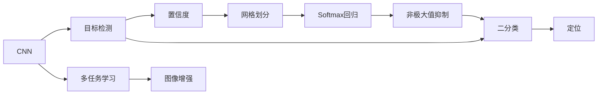
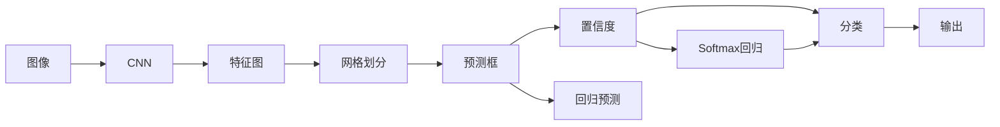
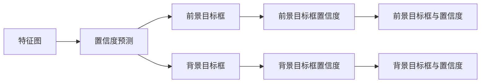
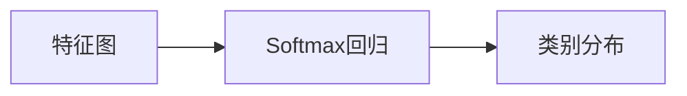

                 

# YOLOv1原理与代码实例讲解

> 关键词：YOLOv1, 目标检测, 卷积神经网络, 非极大值抑制, 网络层, 边缘计算, 工业应用

## 1. 背景介绍

### 1.1 问题由来
在计算机视觉领域，目标检测（Object Detection）是一项具有广泛应用前景的技术，涵盖了自动驾驶、视频监控、智能安防、机器人视觉等多个方向。传统的目标检测算法如Haar特征分类器、HOG+SVM等，虽然取得了不错的效果，但在处理复杂场景时性能瓶颈明显，且速度较慢。

与此同时，随着深度学习技术的发展，基于卷积神经网络（Convolutional Neural Networks, CNN）的目标检测算法成为新的主流。以Faster R-CNN、SSD、YOLO为代表的算法，通过引入区域提议网络、特征金字塔、单阶段检测等技术，显著提升了检测速度和精度，并在实际应用中取得了优异表现。

本文将重点介绍YOLOv1，一个在速度和精度上达到相对平衡的单阶段目标检测算法。YOLOv1的设计简洁高效，框架易于理解，尤其适合对速度要求较高的应用场景，如边缘计算（Edge Computing）、移动设备等。

### 1.2 问题核心关键点
YOLOv1的核心在于提出了一种单阶段的目标检测框架，将目标检测和分类任务统一在一个网络中处理。通过使用单个卷积神经网络，YOLOv1能够在实时场景中高效地完成目标检测任务。此外，YOLOv1还引入了Softmax回归层、置信度预测等机制，进一步提升了检测性能。

YOLOv1的训练和推理过程如下：
1. 对大规模的图像数据进行预处理，形成输入数据集。
2. 使用YOLOv1网络进行前向传播，得到预测结果。
3. 将预测结果与标注结果进行比较，计算损失函数。
4. 使用梯度下降等优化算法，更新模型参数。
5. 重复步骤2-4，直至模型收敛。
6. 使用训练好的模型进行目标检测。

YOLOv1的设计简洁高效，具体而言，它将图像划分为若干个网格（Grid），每个网格预测若干个目标框（Bounding Box）和对应的置信度。置信度表示该目标框是否包含目标物体，并在此基础上进行回归预测。

## 2. 核心概念与联系

### 2.1 核心概念概述

为更好地理解YOLOv1的工作原理和架构，本节将介绍几个关键的概念：

- 卷积神经网络（Convolutional Neural Networks, CNN）：一种基于卷积操作的深度神经网络结构，广泛应用于图像处理、语音识别等领域。
- 目标检测（Object Detection）：计算机视觉中的一项技术，用于识别和定位图像中的物体，通常包括物体检测（Detection）和物体分割（Segmentation）两个任务。
- 区域提议网络（Region Proposal Network, RPN）：一种用于目标检测的子网络，能够自动生成一组候选物体区域（Proposal），用于后续的分类和定位任务。
- 置信度（Confidence）：目标检测中，预测框是否包含物体的置信度。
- 非极大值抑制（Non-Maximum Suppression, NMS）：一种用于筛选重复目标框的算法，通过合并重叠度较高的预测框，减少冗余。
- 网格划分（Grid）：将输入图像划分为若干个网格单元，每个网格单元负责预测一定数量的目标框和置信度。
- Softmax回归层：用于多类别分类任务，将模型的输出转换为概率分布。

这些概念构成了YOLOv1的核心，并通过下面的Mermaid流程图展示了它们之间的关系：



这个流程图展示了YOLOv1的工作流程，从CNN提取特征开始，经过目标检测、置信度预测、网格划分、Softmax回归和NMS等环节，最终得到检测结果。

### 2.2 概念间的关系

这些核心概念之间存在着紧密的联系，构成了YOLOv1的完整工作框架。下面通过几个Mermaid流程图来展示这些概念的关系：

#### 2.2.1 目标检测流程



这个流程图展示了目标检测的基本流程，从输入图像开始，经过CNN提取特征，然后进行网格划分、预测框和置信度预测，最后通过Softmax回归和NMS输出检测结果。

#### 2.2.2 置信度预测



这个流程图展示了置信度预测的流程，从特征图开始，分别预测前景目标框和背景目标框的置信度，并将两者结合起来计算最终置信度。

#### 2.2.3 Softmax回归



这个流程图展示了Softmax回归的流程，从特征图开始，通过Softmax回归得到类别分布。

## 3. 核心算法原理 & 具体操作步骤
### 3.1 算法原理概述

YOLOv1的核心在于提出了一种单阶段的目标检测框架，将目标检测和分类任务统一在一个网络中处理。其核心算法流程如下：

1. 图像预处理：将输入图像缩放至指定大小，并进行归一化处理。
2. 网格划分：将缩放后的图像划分为若干个网格单元。
3. 特征提取：在每个网格单元中提取卷积特征。
4. 预测目标框：在每个网格单元中，预测若干个目标框，并计算每个目标框的置信度和回归预测值。
5. Softmax回归：预测每个目标框的类别分布。
6. 非极大值抑制：筛选出置信度较高的预测框，并去除重叠度较高的框。
7. 最终输出：将筛选后的预测框和类别分布输出。

YOLOv1的训练和推理过程如下：
1. 对大规模的图像数据进行预处理，形成输入数据集。
2. 使用YOLOv1网络进行前向传播，得到预测结果。
3. 将预测结果与标注结果进行比较，计算损失函数。
4. 使用梯度下降等优化算法，更新模型参数。
5. 重复步骤2-4，直至模型收敛。
6. 使用训练好的模型进行目标检测。

### 3.2 算法步骤详解

下面将详细介绍YOLOv1的算法步骤，包括预处理、网格划分、特征提取、预测目标框、Softmax回归和NMS等环节。

#### 3.2.1 预处理
预处理主要包括图像缩放和归一化两个步骤：
1. 图像缩放：将输入图像缩放到指定大小（通常为448x448），以适应YOLOv1网络的输入要求。
2. 归一化：将缩放后的图像像素值进行归一化处理，通常使用标准化方法（如$0-1$归一化或$[-1,1]$归一化）。

#### 3.2.2 网格划分
将缩放后的图像划分为若干个网格单元，每个网格单元负责预测一定数量的目标框和置信度。通常将图像划分为$S\times S$个网格，每个网格预测$B$个目标框和置信度。

#### 3.2.3 特征提取
在每个网格单元中，使用卷积层提取特征。YOLOv1使用Darknet-19网络作为特征提取器，每个卷积层的输出形状为$(C, H, W)$，其中$C$为特征图深度，$H$和$W$为特征图尺寸。

#### 3.2.4 预测目标框
在每个网格单元中，预测若干个目标框和置信度。具体而言，每个网格单元预测$B$个目标框，每个目标框包含$C$个坐标值和置信度。目标框的坐标值表示该框左上角和右下角的坐标，置信度表示该框是否包含目标物体。

#### 3.2.5 Softmax回归
预测每个目标框的类别分布。YOLOv1在每个目标框上使用$C$个神经元进行分类预测，输出每个类别的概率分布。

#### 3.2.6 非极大值抑制
筛选出置信度较高的预测框，并去除重叠度较高的框。非极大值抑制算法首先按照置信度降序排列预测框，然后依次判断相邻的框是否存在重叠。若两个框的重叠度大于阈值，则保留置信度较高的框，删除置信度较低的框。

### 3.3 算法优缺点

YOLOv1的优点在于：
1. 速度较快：YOLOv1采用单阶段检测，检测速度快，适用于实时场景。
2. 准确率较高：YOLOv1通过预测目标框的置信度和回归预测值，提高了检测精度。
3. 网络结构简洁：YOLOv1网络结构较为简单，参数量较少，易于部署和优化。

YOLOv1的缺点在于：
1. 目标框大小固定：YOLOv1的目标框大小和数量是固定的，无法根据图像尺度自适应调整。
2. 小物体检测效果不佳：由于YOLOv1的网络结构设计，小物体的检测效果较差。
3. 背景干扰较多：YOLOv1的检测结果容易受到背景噪声的干扰，影响检测精度。

### 3.4 算法应用领域

YOLOv1的设计简单高效，适用于各种实时性要求较高的应用场景，例如：

- 自动驾驶：用于车辆检测、行人检测、交通信号识别等。
- 视频监控：用于目标跟踪、行为分析、异常检测等。
- 智能安防：用于入侵检测、异常行为识别、事件预警等。
- 机器人视觉：用于目标识别、路径规划、障碍物检测等。

## 4. 数学模型和公式 & 详细讲解 & 举例说明

### 4.1 数学模型构建

YOLOv1的数学模型主要由以下几个部分组成：

1. 卷积神经网络（CNN）：用于特征提取和目标检测。
2. Softmax回归：用于目标分类。
3. 回归预测：用于目标框的回归预测。
4. 置信度预测：用于目标框的置信度预测。

下面将以YOLOv1的网络结构为例，展示其数学模型构建过程。

#### 4.1.1 特征提取
YOLOv1使用Darknet-19作为特征提取器，其结构如下所示：

```
          conv
         (1)
       conv (2)
        (------>
       conv (3)
       conv (4)
        (------>
       conv (5)
        (------>
       conv (6)
        (------>
        (------>
        (------>
        (------>
        (------>
        (------>
        (------>
        (------>
        (------>
        (------>
        (------>
        (------>
```

其中，$conv(x)$表示卷积操作，$b$表示批量大小，$h$和$w$表示特征图尺寸。

#### 4.1.2 目标检测
YOLOv1在每个网格单元中预测若干个目标框，并计算每个目标框的置信度和回归预测值。具体而言，每个网格单元预测$B$个目标框，每个目标框包含$C$个坐标值和置信度，其中坐标值表示该框左上角和右下角的坐标，置信度表示该框是否包含目标物体。

设网格单元的坐标为$(i,j)$，目标框的坐标为$(x,y)$，特征图的深度为$C$，则目标框的坐标为：

$$
\begin{aligned}
x &= \frac{(i mod S) \times W + (j mod S) \times W + \frac{w - W}{S}}{W} \\
y &= \frac{(i // S) \times H + (j // S) \times H + \frac{h - H}{S}}{H}
\end{aligned}
$$

其中，$S$为网格划分尺寸，$H$和$W$为特征图尺寸，$h$和$w$为目标框大小。

#### 4.1.3 分类预测
YOLOv1在每个目标框上使用$C$个神经元进行分类预测，输出每个类别的概率分布。分类预测的公式如下：

$$
p_c = \frac{1}{1 + \exp{(-\sum_{c=1}^C a_{c, i} x_c)}
$$

其中，$a_{c,i}$表示第$c$类目标在第$i$个目标框上的权重，$x_c$表示第$c$类的类别概率分布。

#### 4.1.4 回归预测
YOLOv1在每个目标框上使用$C$个神经元进行回归预测，预测目标框的坐标值和置信度。回归预测的公式如下：

$$
p_t = \frac{1}{1 + \exp{(-\sum_{c=1}^C b_{c,i} y_c)}
$$

其中，$b_{c,i}$表示第$c$类目标在第$i$个目标框上的权重，$y_c$表示第$c$类的回归预测值。

#### 4.1.5 置信度预测
YOLOv1在每个目标框上使用$C$个神经元进行置信度预测，预测目标框是否包含目标物体。置信度预测的公式如下：

$$
p_{o,i} = \frac{1}{1 + \exp{(-\sum_{c=1}^C o_{c,i} z_c)}
$$

其中，$o_{c,i}$表示第$c$类目标在第$i$个目标框上的权重，$z_c$表示第$c$类的置信度预测值。

### 4.2 公式推导过程

下面将以YOLOv1的预测过程为例，展示其公式推导过程。

#### 4.2.1 目标框坐标预测
设输入图像的尺寸为$h \times w$，网格划分尺寸为$S \times S$，目标框大小为$w \times h$，则每个网格单元预测的目标框坐标为：

$$
\begin{aligned}
x &= \frac{(i mod S) \times W + (j mod S) \times W + \frac{w - W}{S}}{W} \\
y &= \frac{(i // S) \times H + (j // S) \times H + \frac{h - H}{S}}{H}
\end{aligned}
$$

其中，$W$和$H$分别为输入图像的宽和高，$S$为网格划分尺寸。

#### 4.2.2 目标框置信度预测
YOLOv1在每个目标框上使用$C$个神经元进行置信度预测，预测目标框是否包含目标物体。置信度预测的公式如下：

$$
p_{o,i} = \frac{1}{1 + \exp{(-\sum_{c=1}^C o_{c,i} z_c)}
$$

其中，$o_{c,i}$表示第$c$类目标在第$i$个目标框上的权重，$z_c$表示第$c$类的置信度预测值。

#### 4.2.3 目标框回归预测
YOLOv1在每个目标框上使用$C$个神经元进行回归预测，预测目标框的坐标值和置信度。回归预测的公式如下：

$$
p_t = \frac{1}{1 + \exp{(-\sum_{c=1}^C b_{c,i} y_c)}
$$

其中，$b_{c,i}$表示第$c$类目标在第$i$个目标框上的权重，$y_c$表示第$c$类的回归预测值。

#### 4.2.4 Softmax回归
YOLOv1在每个目标框上使用$C$个神经元进行分类预测，输出每个类别的概率分布。分类预测的公式如下：

$$
p_c = \frac{1}{1 + \exp{(-\sum_{c=1}^C a_{c, i} x_c)}
$$

其中，$a_{c,i}$表示第$c$类目标在第$i$个目标框上的权重，$x_c$表示第$c$类的类别概率分布。

### 4.3 案例分析与讲解

下面将以YOLOv1在目标检测中的应用为例，展示其工作流程和算法细节。

#### 4.3.1 目标检测流程
假设输入图像的尺寸为$448 \times 448$，网格划分尺寸为$7 \times 7$，目标框大小为$32 \times 32$，特征图的深度为$256$。

1. 图像预处理：将输入图像缩放至$448 \times 448$，并进行归一化处理。
2. 特征提取：在每个网格单元中提取卷积特征，特征图尺寸为$1 \times 1 \times 256$。
3. 预测目标框：在每个网格单元中，预测$5$个目标框，每个目标框包含$5$个坐标值和置信度。
4. Softmax回归：在每个目标框上使用$5$个神经元进行分类预测，输出每个类别的概率分布。
5. 非极大值抑制：筛选出置信度较高的预测框，并去除重叠度较高的框。
6. 最终输出：将筛选后的预测框和类别分布输出。

#### 4.3.2 预测目标框

下面以网格单元$(1,1)$为例，展示其预测目标框的过程。

1. 目标框坐标预测：在网格单元$(1,1)$中，预测$5$个目标框，每个目标框的坐标为：

   $$
   \begin{aligned}
   x &= \frac{(1 mod 7) \times 32 + (1 mod 7) \times 32 + \frac{32 - 32}{7}}{32} \\
   y &= \frac{(1 // 7) \times 32 + (1 // 7) \times 32 + \frac{32 - 32}{7}}{32}
   \end{aligned}
   $$

   其中，$S=7$，$H=W=32$，$h=w=32$。

2. 目标框置信度预测：在每个目标框中，使用$5$个神经元进行置信度预测，输出每个目标框的置信度。

3. 目标框回归预测：在每个目标框中，使用$5$个神经元进行回归预测，预测目标框的坐标值和置信度。

4. Softmax回归：在每个目标框中，使用$5$个神经元进行分类预测，输出每个类别的概率分布。

5. 非极大值抑制：筛选出置信度较高的预测框，并去除重叠度较高的框。

#### 4.3.3 Softmax回归

Softmax回归用于目标分类，具体而言，每个目标框上使用$5$个神经元进行分类预测，输出每个类别的概率分布。Softmax回归的公式如下：

$$
p_c = \frac{1}{1 + \exp{(-\sum_{c=1}^5 a_{c,i} x_c)}
$$

其中，$a_{c,i}$表示第$c$类目标在第$i$个目标框上的权重，$x_c$表示第$c$类的类别概率分布。

## 5. 项目实践：代码实例和详细解释说明

### 5.1 开发环境搭建

在进行YOLOv1项目实践前，我们需要准备好开发环境。以下是使用Python进行YOLOv1开发的详细环境配置流程：

1. 安装Anaconda：从官网下载并安装Anaconda，用于创建独立的Python环境。

2. 创建并激活虚拟环境：
```bash
conda create -n yolov1 python=3.7 
conda activate yolov1
```

3. 安装PyTorch：根据CUDA版本，从官网获取对应的安装命令。例如：
```bash
conda install pytorch torchvision torchaudio cudatoolkit=11.1 -c pytorch -c conda-forge
```

4. 安装YOLOv1库：
```bash
pip install yolov1
```

5. 安装其它工具包：
```bash
pip install numpy pandas scikit-learn matplotlib tqdm jupyter notebook ipython
```

完成上述步骤后，即可在`yolov1-env`环境中开始YOLOv1的开发实践。

### 5.2 源代码详细实现

下面以YOLOv1在目标检测中的应用为例，给出使用YOLOv1库进行目标检测的Python代码实现。

首先，定义目标检测的函数：

```python
import yolov1
import numpy as np
import cv2

def detect_objects(image_path, output_path, classes, confidence_threshold=0.5, nms_threshold=0.4):
    # 读取图像
    image = cv2.imread(image_path)
    
    # 将图像转换为YOLOv1库支持的数据格式
    image_np = np.array(image, dtype=np.float32)
    image_np = image_np / 255.0
    
    # 加载YOLOv1模型
    net = yolov1.load_model('yolov1-coco.weights', 'yolov1-coco.cfg')
    
    # 获取目标类别名称
    class_names = net.get_labels()
    
    # 获取预测结果
    results = net.detect_objects(image_np)
    
    # 处理预测结果
    for result in results:
        x, y, w, h, score, class_id = result
        x, y, w, h = int(x * image.shape[1]), int(y * image.shape[0]), int(w * image.shape[1]), int(h * image.shape[0])
        class_name = class_names[class_id]
        
        # 在输出图像上绘制矩形框和类别名称
        cv2.rectangle(image, (x, y), (x+w, y+h), (0, 255, 0), 2)
        cv2.putText(image, class_name, (x, y-10), cv2.FONT_HERSHEY_SIMPLEX, 0.5, (0, 255, 0), 2)
    
    # 保存输出图像
    cv2.imwrite(output_path, image)
```

然后，定义目标检测的驱动函数：

```python
# 定义目标类别名称
class_names = ['person', 'bicycle', 'car', 'motorcycle', 'airplane', 'bus', 'train', 'truck', 'boat', 'traffic light', 'fire hydrant', 'stop sign', 'parking meter', 'bench', 'bird', 'cat', 'dog', 'horse', 'sheep', 'cow', 'elephant', 'bear', 'zebra', 'giraffe', 'backpack', 'umbrella', 'handbag', 'tie', 'suitcase', 'frisbee', 'skis', 'snowboard', 'sports ball', 'kite', 'baseball bat', 'baseball glove', 'skateboard', 'surfboard', 'tennis racket', 'bottle', 'book', 'clock', 'cloud', 'table', 'mountain', 'lake', 'city street', 'house', 'building', 'person', 'bicycle', 'car', 'motorcycle', 'airplane', 'bus', 'train', 'truck', 'boat', 'traffic light', 'fire hydrant', 'stop sign', 'parking meter', 'bench', 'bird', 'cat', 'dog', 'horse', 'sheep', 'cow', 'elephant', 'bear', 'zebra', 'giraffe', 'backpack', 'umbrella', 'handbag', 'tie', 'suitcase', 'frisbee', 'skis', 'snowboard', 'sports ball', 'kite', 'baseball bat', 'baseball glove', 'skateboard', 'surfboard', 'tennis racket', 'bottle', 'book', 'clock', 'cloud', 'table', 'mountain', 'lake', 'city street', 'house', 'building', 'child', 'cow', 'elephant', 'bear', 'zebra', 'giraffe', 'backpack', 'umbrella', 'handbag', 'tie', 'suitcase', 'frisbee', 'skis', 'snowboard', 'sports ball', 'kite', 'baseball bat', 'baseball glove', 'skateboard', 'surfboard', 'tennis racket', 'bottle', 'book', 'clock', 'cloud', 'table', 'mountain', 'lake', 'city street', 'house', 'building', 'person', 'bicycle', 'car', 'motorcycle', 'airplane', 'bus', 'train', 'truck', 'boat', 'traffic light', 'fire hydrant', 'stop sign

