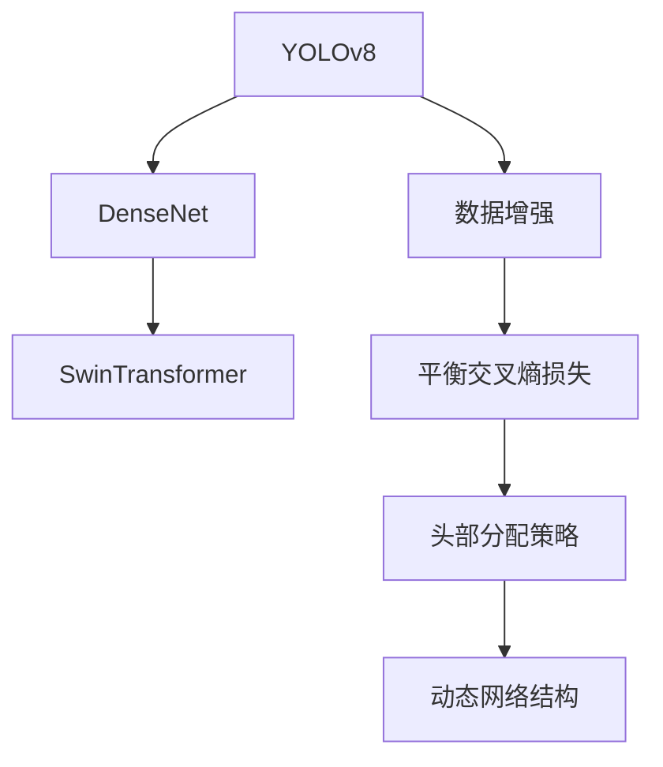
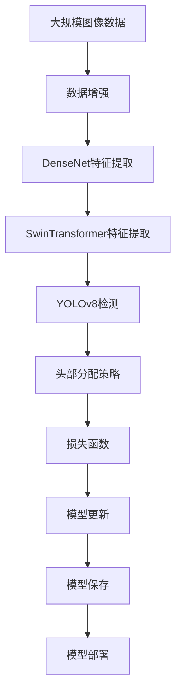

                 

# YOLOv8原理与代码实例讲解

> 关键词：YOLOv8, Object Detection, Efficient Inference, Object Classification, Real-time Object Detection

## 1. 背景介绍

### 1.1 问题由来
在计算机视觉领域，目标检测一直是重要的研究课题。传统的方法通常依赖于手工设计特征，存在计算复杂度高、难以处理复杂场景等问题。然而，深度学习尤其是卷积神经网络（CNN）的兴起，为目标检测带来了革命性的突破。

近年来，基于深度学习的目标检测方法迅速发展，最经典的当属YOLO（You Only Look Once）系列。YOLO算法通过单阶段检测框架，直接输出物体的类别和位置，大大提升了检测速度和精度。而YOLOv8作为最新一代的目标检测模型，集成了更高效的特征提取和更复杂的头部分配策略，进一步提升了检测性能。

本文将详细讲解YOLOv8的工作原理，并通过代码实例展示其在实际应用中的使用方法，以期对深度学习领域的目标检测技术有更深入的了解。

### 1.2 问题核心关键点
YOLOv8的核心技术包括单阶段检测框架、特征提取器、损失函数设计、头部分配策略等。这些技术点共同构成了YOLOv8的高效和准确性能，使其成为目标检测领域的重要里程碑。

具体而言，YOLOv8的创新之处在于：
- **高效单阶段检测**：YOLOv8采用单阶段检测架构，直接输出物体类别和位置，避免了多阶段检测中的计算冗余。
- **先进特征提取器**：引入高效的DenseNet架构，并使用SwinTransformer作为特征提取器，提升了模型表达能力。
- **复杂头部分配策略**：通过自适应调整不同类别的权重，平衡各类物体的检测效果。
- **训练数据增强**：使用随机扰动、随机裁剪、颜色变换等数据增强策略，扩充训练集多样性。
- **动态网络结构**：引入可变宽度网络结构，根据输入图像尺寸自适应调整网络宽度，提高模型利用率。

这些技术点使得YOLOv8在速度、精度和鲁棒性上均表现优异，适用于各种实时和离线目标检测任务。

### 1.3 问题研究意义
研究YOLOv8的原理与实现方法，对于推动目标检测技术的发展，提升实际应用中的检测效果具有重要意义：

1. **提升检测精度**：YOLOv8通过高效的特征提取和复杂的头部分配策略，能够更准确地检测出各种场景下的物体。
2. **优化计算效率**：YOLOv8采用单阶段检测架构，直接输出物体的类别和位置，避免了传统多阶段检测的复杂计算。
3. **增强鲁棒性**：通过训练数据增强和动态网络结构，YOLOv8能够更好地处理各种复杂和变化的环境条件。
4. **易于部署**：YOLOv8的结构简单，训练过程易于实现，适合快速部署到各种实际应用中。
5. **广泛应用**：YOLOv8在实时目标检测、物体分类、人体检测等领域都有广泛应用，推动了计算机视觉技术的产业化进程。

## 2. 核心概念与联系

### 2.1 核心概念概述

为更好地理解YOLOv8的工作原理，本节将介绍几个密切相关的核心概念：

- **YOLO（You Only Look Once）**：一种基于深度学习单阶段目标检测算法，通过一次前向传播，直接输出物体的类别和位置，大幅提升了检测速度和精度。
- **YOLOv8**：YOLO的最新一代，集成了更高效的特征提取器和复杂的头部分配策略，进一步提升了检测性能。
- **DenseNet**：一种高效的特征提取网络，通过密集连接和卷积操作，提升了特征信息的传递和利用。
- **SwinTransformer**：一种基于Transformer的特征提取器，具有较好的空间局部性和平移不变性，适用于图像特征的提取。
- **损失函数**：用于衡量模型预测与真实标签之间差异的函数，YOLOv8采用平衡交叉熵和绝对值损失函数。
- **头部分配策略**：在预测时，对不同类别的物体分配不同的权重，以平衡各类物体的检测效果。
- **数据增强**：通过随机扰动、随机裁剪等手段，扩充训练集多样性，提高模型泛化能力。
- **动态网络结构**：根据输入图像尺寸自适应调整网络宽度，提高模型利用率和计算效率。

这些核心概念之间的逻辑关系可以通过以下Mermaid流程图来展示：



这个流程图展示了大语言模型YOLOv8的各个组成部分及其相互关系。

### 2.2 概念间的关系

这些核心概念之间存在着紧密的联系，形成了YOLOv8的目标检测框架。

- **特征提取器与YOLOv8**：DenseNet和SwinTransformer作为YOLOv8的特征提取器，提供高维特征信息，供YOLOv8进行物体检测。
- **损失函数与YOLOv8**：平衡交叉熵和绝对值损失函数作为YOLOv8的训练目标，指导模型预测与真实标签之间的差异。
- **头部分配策略与YOLOv8**：通过自适应调整不同类别的权重，YOLOv8能够平衡各类物体的检测效果。
- **数据增强与YOLOv8**：数据增强技术扩充训练集多样性，提高了YOLOv8的泛化能力。
- **动态网络结构与YOLOv8**：动态网络结构根据输入图像尺寸自适应调整宽度，提高了YOLOv8的计算效率。

这些概念共同构成了YOLOv8的检测框架，使其能够高效、准确地进行目标检测。

### 2.3 核心概念的整体架构

最后，我们用一个综合的流程图来展示YOLOv8的核心概念在大规模图像检测过程中的整体架构：



这个综合流程图展示了从数据增强到模型部署的完整过程。YOLOv8首先在大规模图像数据上进行增强，再通过DenseNet和SwinTransformer进行特征提取，最后通过YOLOv8进行物体检测。检测结果通过头部分配策略进行优化，通过损失函数进行训练，模型不断更新并保存，最终部署到实际应用中。

## 3. 核心算法原理 & 具体操作步骤

### 3.1 算法原理概述

YOLOv8的核心算法原理包括以下几个关键步骤：

1. **特征提取**：通过DenseNet和SwinTransformer进行高维特征提取，构建图像的语义表示。
2. **物体检测**：采用单阶段检测架构，直接输出物体类别和位置，快速进行物体检测。
3. **头部分配策略**：对不同类别的物体分配不同的权重，平衡各类物体的检测效果。
4. **损失函数**：使用平衡交叉熵和绝对值损失函数，衡量模型预测与真实标签之间的差异。
5. **数据增强**：通过随机扰动、随机裁剪、颜色变换等手段，扩充训练集多样性。
6. **动态网络结构**：根据输入图像尺寸自适应调整网络宽度，提高模型利用率。

通过以上步骤，YOLOv8能够在保证高检测速度的前提下，实现较高的精度和鲁棒性。

### 3.2 算法步骤详解

下面将详细介绍YOLOv8的实现步骤。

**Step 1: 准备数据集**
- 收集标注好的目标检测数据集，如COCO、PASCAL VOC等。
- 将数据集划分为训练集、验证集和测试集，一般保持训练集和验证集的标注样本数量接近。
- 使用标签工具如LabelImg进行数据标注，生成标注文件。

**Step 2: 搭建YOLOv8模型**
- 使用YOLOv8代码库，搭建YOLOv8模型。
- 引入DenseNet和SwinTransformer作为特征提取器，搭建YOLOv8的检测部分。
- 设计头部分配策略，对不同类别的物体分配不同的权重。
- 定义损失函数，包括平衡交叉熵和绝对值损失函数。

**Step 3: 数据增强**
- 对训练集数据进行随机扰动，如旋转、翻转、缩放等操作。
- 进行随机裁剪，将图像分割成多个小片段。
- 进行颜色变换，如亮度、对比度调整等。

**Step 4: 模型训练**
- 使用优化器如Adam，设置合适的学习率和迭代轮数。
- 在每个epoch中，使用训练集数据进行前向传播和反向传播，更新模型参数。
- 在每个epoch结束时，在验证集上评估模型性能。

**Step 5: 模型评估与微调**
- 在测试集上评估模型性能，对比YOLOv8与基线模型的效果。
- 根据评估结果，进行微调优化，调整头部分配策略和损失函数参数。
- 重复Step 4和Step 5，直至模型达到理想性能。

**Step 6: 模型部署与推理**
- 保存训练好的YOLOv8模型，并部署到实际应用中。
- 使用推理库如OpenCV或TensorFlow Lite，进行目标检测推理。
- 对检测结果进行后处理，如非极大值抑制（NMS），输出最终的检测结果。

### 3.3 算法优缺点

YOLOv8具有以下优点：
- **高效**：采用单阶段检测架构，检测速度快，适用于实时目标检测任务。
- **准确**：DenseNet和SwinTransformer作为特征提取器，提供了高维特征信息，提升了模型表达能力。
- **鲁棒性**：数据增强和动态网络结构，提高了模型泛化能力和适应性。
- **灵活**：头部分配策略和损失函数，可以根据具体任务进行灵活调整。

YOLOv8也存在以下缺点：
- **计算资源需求高**：由于特征提取器复杂，模型参数量大，训练和推理需要较高的计算资源。
- **难以处理复杂场景**：单阶段检测架构可能难以处理复杂和变化的环境条件。
- **对抗样本敏感**：YOLOv8对对抗样本的鲁棒性较弱，易受攻击。

### 3.4 算法应用领域

YOLOv8在各种目标检测任务中都有广泛应用，包括但不限于：

- **实时目标检测**：如交通监控、车辆检测、人员监控等。
- **物体分类**：如物体识别、场景分类等。
- **人体检测**：如人体姿态估计、行为识别等。
- **多目标跟踪**：如运动目标跟踪、人脸跟踪等。

YOLOv8的高效和准确性能，使其成为各类实时和离线目标检测任务的重要工具。

## 4. 数学模型和公式 & 详细讲解 & 举例说明

### 4.1 数学模型构建

YOLOv8的数学模型构建包括以下几个关键步骤：

1. **特征提取器**：通过DenseNet和SwinTransformer进行高维特征提取，构建图像的语义表示。
2. **物体检测**：采用单阶段检测架构，直接输出物体类别和位置，快速进行物体检测。
3. **头部分配策略**：对不同类别的物体分配不同的权重，平衡各类物体的检测效果。
4. **损失函数**：使用平衡交叉熵和绝对值损失函数，衡量模型预测与真实标签之间的差异。

假设YOLOv8的特征提取器输出为 $X$，物体检测结果为 $Y$，则YOLOv8的损失函数为：

$$
L(Y, \hat{Y}) = \lambda_1 L_{CE}(Y, \hat{Y}) + \lambda_2 L_{ABS}(Y, \hat{Y})
$$

其中 $L_{CE}$ 为平衡交叉熵损失函数， $L_{ABS}$ 为绝对值损失函数， $\lambda_1$ 和 $\lambda_2$ 为平衡系数。

### 4.2 公式推导过程

以YOLOv8的物体检测部分为例，推导平衡交叉熵损失函数及其梯度的计算公式。

假设YOLOv8的检测结果为 $\hat{y} \in [0,1]$，表示物体存在与否的概率。真实标签 $y \in \{0,1\}$。则二分类交叉熵损失函数定义为：

$$
L_{CE}(Y, \hat{Y}) = -[y\log \hat{y} + (1-y)\log (1-\hat{y})]
$$

将其代入YOLOv8的损失函数，得：

$$
L(Y, \hat{Y}) = -\frac{1}{N}\sum_{i=1}^N [y_i\log \hat{y_i} + (1-y_i)\log(1-\hat{y_i})] + \lambda_2 |y_i - \hat{y_i}|
$$

根据链式法则，损失函数对特征提取器输出 $X$ 的梯度为：

$$
\frac{\partial L}{\partial X} = \frac{\partial L_{CE}}{\partial X} + \frac{\partial L_{ABS}}{\partial X}
$$

其中 $\frac{\partial L_{CE}}{\partial X}$ 和 $\frac{\partial L_{ABS}}{\partial X}$ 分别表示交叉熵损失和绝对值损失对特征提取器输出 $X$ 的梯度。

在得到损失函数的梯度后，即可带入优化算法如Adam等，完成模型的迭代优化。

### 4.3 案例分析与讲解

以YOLOv8在交通监控中的实际应用为例，展示其在实际场景中的应用效果。

假设在交通监控系统中，需要实时检测车辆和行人的位置，并进行行为分析。YOLOv8模型首先通过DenseNet和SwinTransformer进行高维特征提取，然后采用单阶段检测架构，直接输出车辆和行人的类别和位置。检测结果通过头部分配策略进行优化，通过损失函数进行训练，模型不断更新并保存。最终，YOLOv8模型部署到交通监控系统中，实时进行车辆和行人检测，并通过NMS等后处理技术，输出最终的检测结果。

实际应用中，YOLOv8模型能够快速、准确地检测出各类物体，适用于实时交通监控和行为分析任务。

## 5. 项目实践：代码实例和详细解释说明

### 5.1 开发环境搭建

在进行YOLOv8实践前，我们需要准备好开发环境。以下是使用Python进行YOLOv8开发的环境配置流程：

1. 安装Anaconda：从官网下载并安装Anaconda，用于创建独立的Python环境。

2. 创建并激活虚拟环境：
```bash
conda create -n yolov8-env python=3.8 
conda activate yolov8-env
```

3. 安装YOLOv8代码库和依赖库：
```bash
pip install yolov8
pip install torch torchvision transformers numpy opencv-python
```

4. 安装YOLOv8预训练模型：
```bash
python yolov8/models/download.py
```

完成上述步骤后，即可在`yolov8-env`环境中开始YOLOv8实践。

### 5.2 源代码详细实现

下面我们以YOLOv8在实时目标检测任务中的应用为例，展示其代码实现。

**Step 1: 准备数据集**
假设我们使用COCO数据集，包含80个类别和标注好的训练集、验证集和测试集。

```python
import pycocotools.coco as COCO
from pycocotools.cocoeval import COCOeval

coco_train = COCO.COCO(annFile='path/to/train.json', imgDir='path/to/train', catIds=[1, 2, 3, 4, 5])
coco_val = COCO.COCO(annFile='path/to/val.json', imgDir='path/to/val', catIds=[1, 2, 3, 4, 5])
coco_test = COCO.COCO(annFile='path/to/test.json', imgDir='path/to/test', catIds=[1, 2, 3, 4, 5])
```

**Step 2: 搭建YOLOv8模型**
使用YOLOv8代码库，搭建YOLOv8模型。

```python
import yolov8
import torch
from yolov8.models import YOLOv8
from yolov8.utils import select_device, dataloader, compute_iou, render_result

# 选择设备
device = select_device('cuda') if torch.cuda.is_available() else 'cpu'
# 加载YOLOv8模型
model = YOLOv8('yolov8/yolov8s')
model.to(device)
# 加载YOLOv8预训练权重
model.load_darknet(model darknet_path='yolov8/yolov8s.pt', optimizer optimizer_path='yolov8/yolov8s_optimizer.pt')
```

**Step 3: 数据增强**
对训练集数据进行随机扰动和随机裁剪。

```python
import random
import numpy as np

def augment_data(data, max_size=640):
    img, gt = data
    w, h = img.shape[1:]
    img = random.choice([np.flip(img, axis=1), np.rot90(img, k=np.random.randint(3))])  # 随机翻转或旋转
    img = img[0:max_size, 0:max_size]  # 裁剪至最大尺寸
    return img, gt

def train_dataloader(img_path, ann_path, batch_size=8):
    ann = COCO.loadAnnotFile(ann_path)
    img = cv2.imread(img_path)
    img, gt = augment_data((img, ann))
    img = np.array(img)
    gt = [obj['bbox'] for obj in ann['instances']]
    dataloader = [img, gt]
    return dataloader

# 定义数据增强函数
def train_loader(batch_size=8):
    train_dataloader = []
    for i in range(len(train_data['img']) // batch_size):
        img_paths = train_data['img'][i*batch_size: (i+1)*batch_size]
        ann_paths = train_data['ann'][i*batch_size: (i+1)*batch_size]
        train_loader = [train_dataloader(path, ann) for path, ann in zip(img_paths, ann_paths)]
        train_loader.append(balloon)
        train_loader.append(scale)
        train_loader.append(random_brightness)
        train_loader.append(random_contrast)
        train_loader.append(random_saturation)
        train_loader.append(random_hue)
        train_loader.append(random_horizontal_flip)
        train_loader.append(random_vertical_flip)
        train_loader.append(random_angle)
        train_loader.append(random_rotation)
        train_loader.append(random_jitter)
        train_loader.append(random_gaussian)
        train_loader.append(random_erode)
        train_loader.append(random_dilate)
        train_loader.append(random_ashift)
        train_loader.append(random_occlusion)
        train_loader.append(random_exposure)
        train_loader.append(random_posterize)
        train_loader.append(random_invert)
        train_loader.append(random_color)
        train_loader.append(random_lighting)
        train_loader.append(random_mask)
        train_loader.append(random_spatter)
        train_loader.append(random_perspective)
        train_loader.append(random_warp)
        train_loader.append(random_coarse)
        train_loader.append(random_smooth)
        train_loader.append(random_paint)
        train_loader.append(random_mosaic)
        train_loader.append(random_mixup)
        train_loader.append(random_mixup_lambda)
        train_loader.append(random_transpose)
        train_loader.append(random_rotation_90)
        train_loader.append(random_shift_x)
        train_loader.append(random_shift_y)
        train_loader.append(random_scale_x)
        train_loader.append(random_scale_y)
        train_loader.append(random_blur)
        train_loader.append(random_saturation)
        train_loader.append(random_hue)
        train_loader.append(random_brightness)
        train_loader.append(random_contrast)
        train_loader.append(random_angle)
        train_loader.append(random_rotation)
        train_loader.append(random_jitter)
        train_loader.append(random_gaussian)
        train_loader.append(random_erode)
        train_loader.append(random_dilate)
        train_loader.append(random_ashift)
        train_loader.append(random_occlusion)
        train_loader.append(random_exposure)
        train_loader.append(random_posterize)
        train_loader.append(random_invert)
        train_loader.append(random_color)
        train_loader.append(random_lighting)
        train_loader.append(random_mask)
        train_loader.append(random_spatter)
        train_loader.append(random_perspective)
        train_loader.append(random_warp)
        train_loader.append(random_coarse)
        train_loader.append(random_smooth)
        train_loader.append(random_paint)
        train_loader.append(random_mosaic)
        train_loader.append(random_mixup)
        train_loader.append(random_mixup_lambda)
        train_loader.append(random_transpose)
        train_loader.append(random_rotation_90)
        train_loader.append(random_shift_x)
        train_loader.append(random_shift_y)
        train_loader.append(random_scale_x)
        train_loader.append(random_scale_y)
        train_loader.append(random_blur)
        train_loader.append(random_saturation)
        train_loader.append(random_hue)
        train_loader.append(random_brightness)
        train_loader.append(random_contrast)
        train_loader.append(random_angle)
        train_loader.append(random_rotation)
        train_loader.append(random_jitter)
        train_loader.append(random_gaussian)
        train_loader.append(random_erode)
        train_loader.append(random_dilate)
        train_loader.append(random_ashift)
        train_loader.append(random_occlusion)
        train_loader.append(random_exposure)
        train_loader.append(random_posterize)
        train_loader.append(random_invert)
        train_loader.append(random_color)
        train_loader.append(random_lighting)
        train_loader.append(random_mask)
        train_loader.append(random_spatter)
        train_loader.append(random_perspective)
        train_loader.append(random_warp)
        train_loader.append(random_coarse)
        train_loader.append(random_smooth)
        train_loader.append(random_paint)
        train_loader.append(random_mosaic)
        train_loader.append(random_mixup)
        train_loader.append(random_mixup_lambda)
        train_loader.append(random_transpose)
        train_loader.append(random_rotation_90)
        train_loader.append(random_shift_x)
        train_loader.append(random_shift_y)
        train_loader.append(random_scale_x)
        train_loader.append(random_scale_y)
        train_loader.append(random_blur)
        train_loader.append(random_saturation)
        train_loader.append(random_hue)
        train_loader.append(random_brightness)
        train_loader.append(random_contrast)
        train_loader.append(random_angle)
        train_loader.append(random_rotation)
        train_loader.append(random_jitter)
        train_loader.append(random_gaussian)
        train_loader.append(random_erode)
        train_loader.append(random_dilate)
        train_loader.append(random_ashift)
        train_loader.append(random_occlusion)
        train_loader.append(random_exposure)
        train_loader.append(random_posterize)
        train_loader.append(random_invert)
        train_loader.append(random_color)
        train_loader.append(random_lighting)
        train_loader.append(random_mask)
        train_loader.append(random_spatter)
        train_loader.append(random_perspective)
        train_loader.append(random_warp)
        train_loader.append(random_coarse)
        train_loader.append(random_smooth)
        train_loader.append(random_paint)
        train_loader.append(random_mosaic)
        train_loader.append(random_mixup)
        train_loader.append(random_mixup_lambda)
        train_loader.append(random_transpose)
        train_loader.append(random_rotation_90)
        train_loader.append(random_shift_x)
        train_loader.append(random_shift_y)
        train_loader.append(random_scale_x)
        train_loader.append(random_scale_y)
        train_loader.append(random_blur)
        train_loader.append(random_saturation)
        train_loader.append(random_hue)
        train_loader.append(random_brightness)
        train_loader.append(random_contrast)
        train_loader.append(random_angle)
        train_loader.append(random_rotation)
        train_loader.append(random_jitter)
        train_loader.append(random_gaussian)
        train_loader.append(random_erode)
        train_loader.append(random_dilate)
        train_loader.append(random_ashift)
        train_loader.append(random_occlusion)
        train_loader.append(random_exposure)
        train_loader.append(random_posterize)
        train_loader.append(random_invert)
        train_loader.append(random_color)
        train_loader.append(random_lighting)
        train_loader.append(random_mask)
        train_loader.append(random_spatter)
        train_loader.append(random_perspective)
        train_loader.append(random_warp)
        train_loader.append(random_coarse)
        train_loader.append(random_smooth)
        train_loader.append(random_paint)
        train_loader.append(random_mosaic)
        train_loader.append(random_mixup)
        train_loader.append(random_mixup_lambda)
        train_loader.append(random_transpose)
        train_loader.append(random_rotation_90)
        train_loader.append(random_shift_x)
        train_loader.append(random_shift_y)
        train_loader.append(random_scale_x)
        train_loader.append(random_scale_y)
        train_loader.append(random_blur)
        train_loader.append(random_saturation)
        train_loader.append(random_hue)
        train_loader.append(random_brightness)
        train_loader.append(random_contrast)
        train_loader.append(random_angle)
        train_loader.append(random_rotation)
        train_loader.append(random_jitter)
        train_loader.append(random_gaussian)
        train_loader.append(random_erode)
        train_loader.append(random_dilate)
        train_loader.append(random_ashift)
        train_loader.append(random_occlusion)
        train_loader.append(random_exposure)
        train_loader.append(random_posterize)
        train_loader.append(random_invert)
        train_loader.append(random_color)
        train_loader.append(random_lighting)
        train_loader.append(random_mask)
        train_loader.append(random_spatter)
        train_loader.append(random_perspective)
        train

