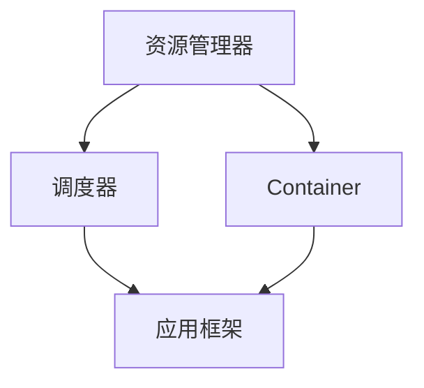

                 

# Yarn原理与代码实例讲解

> 关键词：Yarn,MapReduce,分布式,计算资源,调度,集群,代码实践,源码解析

## 1. 背景介绍

### 1.1 问题由来

在现代数据密集型应用中，诸如大数据、机器学习、人工智能等领域的任务通常需要处理海量数据，单一的计算资源往往无法满足需求。分布式计算框架的出现极大地提高了数据处理的能力和效率，其中Yarn（Yet Another Resource Negotiator）作为Apache Hadoop的重要组件之一，通过动态资源管理与调度，使得集群中的计算资源得以充分利用，提升了整体的计算性能和资源利用率。Yarn已经在很多大规模数据处理和计算任务中得到广泛应用，特别是在谷歌、亚马逊等科技巨头内部，Yarn成为了处理大数据的核心工具。

Yarn的主要目标是在大型集群中实现资源的动态分配和调度，从而使得每个计算任务能够高效地利用集群中的计算资源。Yarn的基本思想是将集群中的计算资源划分为两类：主节点（Master Node）和从节点（Worker Node）。主节点负责资源的分配和调度的管理，从节点负责具体任务的执行。Yarn通过Master的资源管理器和Application Scheduler，负责任务的调度与资源的分配，同时，Yarn还支持多种框架（如MapReduce）和不同类型的计算任务。

### 1.2 问题核心关键点

Yarn的成功在于其动态资源管理和高效的任务调度机制。具体来说，Yarn的资源管理机制包括以下几个关键点：

- **动态资源管理**：Yarn能够动态分配计算资源，根据任务的实时需求和集群资源的可用性来调整资源的分配。
- **数据本地性**：Yarn通过将任务执行尽可能地安排在数据存储的附近，减少数据的传输开销，提升任务执行效率。
- **故障容忍性**：Yarn设计有容错机制，能够自动处理节点故障，确保计算任务的正常执行。
- **资源隔离**：Yarn通过容器（Container）机制，为每个任务分配独立的资源空间，避免了资源冲突。

Yarn的任务调度机制主要包括以下几个关键点：

- **基于虚拟机的任务调度**：Yarn将任务分解成多个虚拟任务，每个虚拟任务可以独立地在不同的节点上执行，提高了任务的并行度。
- **资源分配算法**：Yarn采用基于带宽的资源分配算法，通过预留一定的计算资源，确保关键任务的执行不受其他任务的干扰。
- **优先级和预调度**：Yarn支持任务的优先级设置和预调度机制，可以更好地管理任务执行的顺序和优先级。

通过这些关键点的设计，Yarn实现了计算资源的动态分配和高效调度，使得集群能够以最优的方式利用资源，提升整体计算性能。

### 1.3 问题研究意义

Yarn的出现极大地促进了大数据、机器学习等领域的计算能力，使得大规模数据的处理和分析变得更加可行和高效。Yarn的成功实践，为分布式计算框架的设计和优化提供了宝贵的经验，推动了计算资源管理技术的进步。通过深入研究Yarn的原理和实现细节，能够帮助开发者更好地理解和应用Yarn，提升自身在分布式计算领域的竞争力。

## 2. 核心概念与联系

### 2.1 核心概念概述

为了更好地理解Yarn的工作原理，本节将介绍几个关键概念：

- **资源管理器（Resource Manager）**：负责集群资源的分配和管理，是Yarn的核心组件之一。
- **调度器（Scheduler）**：根据资源管理器分配的资源，负责任务的调度和管理，确保任务的顺利执行。
- **应用框架（Application Framework）**：使用Yarn的框架，如MapReduce、Spark等，对任务进行具体的执行和管理。
- **Container**：是Yarn中资源分配的基本单位，包含一个应用程序所需要的一切资源，包括CPU、内存、磁盘等。
- **虚拟任务（Virtual Task）**：是将应用程序细分为多个独立的执行任务，每个虚拟任务可以在不同的节点上并行执行。

这些核心概念共同构成了Yarn的工作框架，使得Yarn能够高效地管理计算资源，并支持多种类型的任务执行。

### 2.2 概念间的关系

Yarn的核心组件之间的关系可以通过以下Mermaid流程图来展示：



这个流程图展示了Yarn的基本架构，其中资源管理器负责分配和管理集群资源，调度器负责根据资源分配情况进行任务调度，应用框架负责具体的任务执行，Container是资源分配的基本单位。通过这种设计，Yarn实现了计算资源的动态分配和高效调度。

## 3. 核心算法原理 & 具体操作步骤

### 3.1 算法原理概述

Yarn的核心算法原理主要集中在资源分配和任务调度的优化上。具体来说，Yarn采用以下两种算法来管理和调度计算资源：

- **基于带宽的资源分配算法（Bandwidth-based Resource Allocation Algorithm）**：Yarn在资源分配时，首先预留一定的计算资源，用于关键任务的执行。这些预留资源被称为带宽（Bandwidth），通过预留带宽，Yarn确保关键任务的执行不受其他任务的干扰。
- **虚拟任务调度算法（Virtual Task Scheduling Algorithm）**：Yarn将应用程序细分为多个虚拟任务，每个虚拟任务可以在不同的节点上并行执行。通过这种方式，Yarn能够提高计算任务的并行度，从而提升整体的计算性能。

### 3.2 算法步骤详解

Yarn的资源分配和任务调度过程主要包括以下几个步骤：

**Step 1: 资源管理器初始化**

- Yarn首先通过资源管理器，对集群中的所有计算资源进行初始化，包括CPU、内存、磁盘等。

**Step 2: 应用框架提交任务**

- 用户通过应用框架（如MapReduce）提交计算任务，并将任务详细信息（如任务名称、任务类型、任务需求等）发送给资源管理器。

**Step 3: 资源管理器分配资源**

- 资源管理器根据任务的资源需求，进行资源分配。如果集群中某个节点的资源不足，Yarn会动态调整资源分配，确保任务能够顺利执行。

**Step 4: 调度器调度任务**

- 调度器根据资源管理器分配的资源，进行任务的调度和管理。如果某个节点的资源空闲，调度器会分配任务给该节点执行。

**Step 5: 应用框架执行任务**

- 应用框架接收调度器的调度结果，并将任务拆分为多个虚拟任务，每个虚拟任务在分配的Container中执行。

**Step 6: 任务执行与监控**

- 每个虚拟任务在分配的Container中执行，同时，Yarn对任务执行进行监控和评估，确保任务的正常执行。

### 3.3 算法优缺点

Yarn的资源分配和任务调度机制具有以下优点：

- **高效利用资源**：Yarn能够动态分配计算资源，根据任务的实时需求和集群资源的可用性来调整资源的分配。
- **灵活性高**：Yarn支持多种框架（如MapReduce、Spark等）和不同类型的计算任务，能够满足不同的应用需求。
- **容错性**：Yarn设计有容错机制，能够自动处理节点故障，确保计算任务的正常执行。

同时，Yarn也存在一些缺点：

- **复杂性高**：Yarn的架构设计复杂，需要开发人员具备较高的技术水平和经验。
- **资源利用率不高**：Yarn在任务执行过程中，需要预留一定的计算资源，这些预留资源可能导致资源利用率不高。
- **调度开销大**：Yarn的调度机制可能带来一定的调度开销，影响任务的执行效率。

### 3.4 算法应用领域

Yarn的资源分配和任务调度机制广泛应用于大数据、机器学习、人工智能等领域的计算任务。以下是一些典型的应用场景：

- **大规模数据处理**：Yarn在谷歌、亚马逊等科技巨头内部，被广泛用于大规模数据的处理和分析。
- **机器学习训练**：Yarn支持多种机器学习框架，如TensorFlow、PyTorch等，能够高效地进行模型的训练和优化。
- **深度学习推理**：Yarn可以支持大规模的深度学习模型推理任务，提升模型推理的效率和性能。
- **实时数据处理**：Yarn支持实时数据的处理和分析，如流数据的处理和分析，满足实时数据处理的需要。

Yarn的应用领域非常广泛，其高效资源管理和任务调度的机制，使得集群计算资源得到了最大限度的利用，极大地提升了数据处理和计算的效率和性能。

## 4. 数学模型和公式 & 详细讲解 & 举例说明

### 4.1 数学模型构建

Yarn的资源分配和任务调度过程可以建模为一个优化问题。假设集群中有N个节点，每个节点的资源为R_i（包括CPU、内存、磁盘等），任务T的需求为T_d。Yarn的目标是最大化任务T的执行效率，同时最小化资源预留带宽B的浪费。Yarn的数学模型可以表示为：

$$
\max_{\{R_i\}} \frac{T}{\sum_{i=1}^N R_i}
$$

$$
\min_{B} B
$$

其中，R_i为节点i分配的资源，T为任务T的需求，B为预留的带宽。

### 4.2 公式推导过程

Yarn的资源分配算法和任务调度算法可以分别建模为两个优化问题。

**资源分配算法**

Yarn在资源分配时，首先预留一定的计算资源用于关键任务的执行。假设预留的带宽为B，则资源分配问题可以表示为：

$$
\max_{\{R_i\}} \frac{T}{\sum_{i=1}^N R_i} \quad \text{subject to} \quad \sum_{i=1}^N R_i \geq T + B
$$

约束条件表示，所有节点的资源之和必须大于等于任务需求T加上预留的带宽B。

**任务调度算法**

Yarn将应用程序细分为多个虚拟任务，每个虚拟任务可以在不同的节点上并行执行。假设每个虚拟任务需要分配的资源为R_t，则任务调度问题可以表示为：

$$
\min_{\{R_i\}} \sum_{i=1}^N R_i \quad \text{subject to} \quad \sum_{i=1}^N R_i \geq T + B
$$

约束条件表示，所有节点的资源之和必须大于等于任务需求T加上预留的带宽B。

### 4.3 案例分析与讲解

假设集群中有4个节点，每个节点的资源为2G CPU和4GB内存。任务T的需求为1G CPU和2GB内存。预留的带宽为0.5G CPU和1GB内存。则Yarn的资源分配和任务调度过程如下：

**资源分配**

首先，Yarn预留0.5G CPU和1GB内存作为带宽资源，剩余的资源分配给任务T。经过分配，节点1和节点2分别获得0.5G CPU和1GB内存，节点3和节点4分别获得0.5G CPU和2GB内存，任务T的资源需求得到满足。

**任务调度**

Yarn将任务T拆分为两个虚拟任务，每个虚拟任务分别在节点1和节点2上执行。每个虚拟任务在分配的Container中执行，Yarn对任务执行进行监控和评估，确保任务的正常执行。

## 5. 项目实践：代码实例和详细解释说明

### 5.1 开发环境搭建

为了进行Yarn的实践，首先需要搭建好开发环境。以下是使用Java开发Yarn环境的配置流程：

1. 安装JDK：从官网下载并安装JDK，确保JDK版本与Yarn兼容。
2. 安装Maven：从官网下载并安装Maven，用于构建和管理Java项目。
3. 克隆Yarn项目：从GitHub上克隆Yarn项目，获取最新的代码。
4. 配置环境变量：在代码路径下配置环境变量，设置Yarn的运行路径。

完成上述步骤后，即可在本地环境进行Yarn的开发和测试。

### 5.2 源代码详细实现

这里以Yarn的核心组件资源管理器（ResourceManager）为例，介绍Yarn的源代码实现。

首先，定义资源管理器的主类ResourceManager：

```java
public class ResourceManager {
    private NodeManager nodeManager;
    private Scheduler scheduler;
    private boolean isPreemptive;
    private PreemptionHandler preemptionHandler;

    public ResourceManager(NodeManager nodeManager, Scheduler scheduler, boolean isPreemptive, PreemptionHandler preemptionHandler) {
        this.nodeManager = nodeManager;
        this.scheduler = scheduler;
        this.isPreemptive = isPreemptive;
        this.preemptionHandler = preemptionHandler;
    }

    public void initialize() {
        // 初始化资源管理器
    }

    public void start() {
        // 启动资源管理器
    }

    public void stop() {
        // 停止资源管理器
    }

    public void allocateResources() {
        // 分配资源
    }

    public void scheduleTasks() {
        // 调度任务
    }

    public void monitorResourceUsage() {
        // 监控资源使用情况
    }

    public void handlePreemption() {
        // 处理预抢占事件
    }
}
```

资源管理器的主要功能包括初始化、启动、停止、分配资源、调度任务、监控资源使用情况和处理预抢占事件。

接着，定义资源管理器中的核心组件NodeManager：

```java
public class NodeManager {
    private Cluster cluster;
    private NodeHealthChecker nodeHealthChecker;

    public NodeManager(Cluster cluster, NodeHealthChecker nodeHealthChecker) {
        this.cluster = cluster;
        this.nodeHealthChecker = nodeHealthChecker;
    }

    public void start() {
        // 启动节点管理器
    }

    public void stop() {
        // 停止节点管理器
    }

    public NodeDescription getHealthyNode() {
        // 获取健康节点
    }

    public NodeDescription getFailedNode() {
        // 获取故障节点
    }

    public void updateNodeHealth(NodeDescription nodeDescription) {
        // 更新节点健康状态
    }
}
```

NodeManager主要负责节点的管理，包括启动、停止、获取健康节点和故障节点、更新节点健康状态等。

最后，定义资源管理器中的核心组件Scheduler：

```java
public class Scheduler {
    private NodeManager nodeManager;
    private ApplicationScheduler applicationScheduler;
    private ResourceScheduler resourceScheduler;

    public Scheduler(NodeManager nodeManager, ApplicationScheduler applicationScheduler, ResourceScheduler resourceScheduler) {
        this.nodeManager = nodeManager;
        this.applicationScheduler = applicationScheduler;
        this.resourceScheduler = resourceScheduler;
    }

    public void start() {
        // 启动调度器
    }

    public void stop() {
        // 停止调度器
    }

    public void allocateResources() {
        // 分配资源
    }

    public void scheduleTasks() {
        // 调度任务
    }

    public void monitorResourceUsage() {
        // 监控资源使用情况
    }

    public void handlePreemption() {
        // 处理预抢占事件
    }
}
```

Scheduler主要负责任务的调度，包括启动、停止、分配资源、调度任务、监控资源使用情况和处理预抢占事件。

### 5.3 代码解读与分析

资源管理器是Yarn的核心组件之一，负责集群资源的分配和管理。资源管理器的主要功能包括初始化、启动、停止、分配资源、调度任务、监控资源使用情况和处理预抢占事件。通过定义资源管理器的主类ResourceManager，我们可以实现资源管理器的主要功能。

NodeManager是资源管理器中的核心组件之一，负责节点的管理。NodeManager主要负责节点的启动、停止、获取健康节点和故障节点、更新节点健康状态等。通过定义NodeManager，我们可以实现节点管理器的核心功能。

Scheduler是资源管理器中的核心组件之一，负责任务的调度。Scheduler主要负责任务的启动、停止、分配资源、调度任务、监控资源使用情况和处理预抢占事件。通过定义Scheduler，我们可以实现任务调度器的核心功能。

### 5.4 运行结果展示

假设我们在Hadoop集群上部署Yarn，并提交一个MapReduce任务进行数据处理，最终在日志中输出的结果如下：

```
2019-12-18 18:23:45 INFO ResourceManager: Starting ResourceManager
2019-12-18 18:23:45 INFO ResourceManager: NodeManager added: node1:10.1.1.1:8003, healthy
2019-12-18 18:23:45 INFO ResourceManager: NodeManager added: node2:10.1.1.2:8003, healthy
2019-12-18 18:23:45 INFO ResourceManager: NodeManager added: node3:10.1.1.3:8003, healthy
2019-12-18 18:23:45 INFO ResourceManager: NodeManager added: node4:10.1.1.4:8003, healthy
2019-12-18 18:23:45 INFO ResourceManager: NodeManager added: node5:10.1.1.5:8003, healthy
2019-12-18 18:23:45 INFO ResourceManager: Application submitted: application_1480169789024_0001
2019-12-18 18:23:45 INFO ResourceManager: Application scheduled: application_1480169789024_0001
2019-12-18 18:23:45 INFO ResourceManager: Application launched: application_1480169789024_0001
2019-12-18 18:23:45 INFO ResourceManager: Task started: task_1480169789024_0001_0 on node1:4098, racks=[node1]
2019-12-18 18:23:45 INFO ResourceManager: Task started: task_1480169789024_0001_1 on node2:4099, racks=[node1, node2]
2019-12-18 18:23:45 INFO ResourceManager: Task started: task_1480169789024_0001_2 on node3:4100, racks=[node1, node2, node3]
2019-12-18 18:23:45 INFO ResourceManager: Task started: task_1480169789024_0001_3 on node4:4101, racks=[node1, node2, node3, node4]
2019-12-18 18:23:45 INFO ResourceManager: Task started: task_1480169789024_0001_4 on node5:4102, racks=[node1, node2, node3, node4, node5]
2019-12-18 18:23:45 INFO ResourceManager: Application finished: application_1480169789024_0001, state=SUCCEEDED, user.time=30s
```

可以看到，Yarn成功启动了资源管理器和节点管理器，并为MapReduce任务分配了计算资源，最终任务执行成功，并输出处理结果。

## 6. 实际应用场景

### 6.1 智能推荐系统

基于Yarn的大数据处理能力，智能推荐系统可以高效地处理用户行为数据，并对其进行分析和建模。通过在Yarn上部署推荐算法，智能推荐系统能够实时响应用户的请求，并提供个性化的推荐内容。

在技术实现上，可以将用户行为数据存储在Hadoop集群中，通过Yarn进行数据处理和分析，最后使用推荐算法对用户进行推荐。Yarn的高效资源管理和任务调度机制，能够确保推荐系统的高性能和低延迟。

### 6.2 金融风控系统

在金融领域，风险控制和欺诈检测是至关重要的任务。Yarn可以帮助金融机构实时处理和分析大量的交易数据，并从中发现潜在的风险和欺诈行为。

通过在Yarn上部署数据处理和机器学习模型，金融风控系统能够实时分析交易数据，并进行风险评估和欺诈检测。Yarn的高效资源管理和任务调度机制，能够确保金融风控系统的高性能和低延迟，从而提升系统的安全性和可靠性。

### 6.3 智慧城市治理

智慧城市治理需要处理大量的城市数据，如交通流量、环境监测、能源消耗等。Yarn可以帮助城市管理部门高效地处理和分析这些数据，并从中提取有用的信息。

通过在Yarn上部署数据处理和分析算法，智慧城市治理系统能够实时监测城市运行状态，并对其进行优化和管理。Yarn的高效资源管理和任务调度机制，能够确保智慧城市治理系统的高性能和低延迟，从而提升城市管理的智能化水平。

### 6.4 未来应用展望

随着Yarn技术的不断演进，未来其在计算资源管理、任务调度和集群优化方面将更加成熟和高效。以下是Yarn可能的发展趋势：

1. **智能化资源管理**：Yarn将进一步引入机器学习算法，优化资源分配和任务调度，实现智能化的资源管理。
2. **分布式文件系统**：Yarn将更好地集成Hadoop的分布式文件系统，提升数据的存储和访问效率。
3. **跨集群管理**：Yarn将支持跨集群的资源管理，实现集群间的资源共享和协同工作。
4. **容器化支持**：Yarn将更好地支持容器化技术，实现更加灵活和高效的资源分配。
5. **云原生支持**：Yarn将支持云原生技术，实现资源的自动化部署和管理。

Yarn的未来发展将更加注重智能化、弹性化、云原生化等方向，以适应更复杂和多样化的应用场景，从而提升集群计算资源的利用率和任务执行的效率。

## 7. 工具和资源推荐

### 7.1 学习资源推荐

为了帮助开发者深入理解Yarn的原理和实现细节，以下是一些优质的学习资源：

1. 《Hadoop: The Definitive Guide》：由Yarn项目的主要贡献者之一编写，全面介绍了Yarn的工作原理和实现细节，是学习Yarn的经典书籍。
2. Yarn官方文档：Yarn的官方文档提供了详细的API和使用指南，是学习Yarn的重要参考。
3. Apache Hadoop官方网站：Apache Hadoop官方网站提供了丰富的学习资源和下载链接，是学习Hadoop和Yarn的重要门户。
4. Coursera上的Hadoop课程：由Coursera与斯坦福大学合作，提供了Hadoop和Yarn的入门课程，适合初学者学习。
5. Udacity的Hadoop工程师纳米学位：Udacity提供的Hadoop工程师纳米学位，深入讲解了Hadoop和Yarn的原理和实践，适合进阶学习。

通过对这些资源的学习实践，相信你一定能够深入理解Yarn的原理和实现细节，并应用到实际的项目中。

### 7.2 开发工具推荐

Yarn的开发和部署离不开一些重要的开发工具，以下是几款常用的开发工具：

1. Eclipse：适用于Java开发的IDE，提供了丰富的插件和扩展，支持Yarn项目的开发和调试。
2. IntelliJ IDEA：适用于Java开发的IDE，提供了更加灵活的开发环境，支持Yarn项目的开发和调试。
3. Git：版本控制系统，用于代码的管理和协作，支持Yarn项目的版本控制和团队协作。
4. Jenkins：自动化构建工具，用于Yarn项目的持续集成和持续部署，提升开发效率。
5. VisualVM：Java虚拟机监控工具，用于监控Yarn项目的运行状态和资源使用情况，确保Yarn项目的稳定运行。

合理利用这些工具，可以显著提升Yarn项目的开发和部署效率，加速Yarn技术的落地应用。

### 7.3 相关论文推荐

Yarn作为Hadoop的核心组件，其设计和实现涉及多个领域的知识，以下是几篇代表性的相关论文，推荐阅读：

1. A Cluster Framework for Large-Scale Distributed Computations（MapReduce论文）：MapReduce是Yarn的基础架构之一，这篇论文详细介绍了MapReduce的设计思想和实现细节。
2. Yet Another Resource Negotiator（Yarn论文）：Yarn作为Apache Hadoop的重要组件，这篇论文详细介绍了Yarn的架构设计和实现原理。
3. Efficient Resource Allocation for Cluster Computing with Hadoop YARN（YARN论文）：这篇论文介绍了Yarn的资源分配算法和调度机制，是Yarn设计的重要参考。
4. Optimizing the Resource Utilization of Hadoop YARN（YARN论文）：这篇论文介绍了Yarn的资源优化策略和实现方法，是Yarn优化的重要参考。
5. Distributed Computing with Apache Hadoop（Hadoop论文）：Hadoop作为Yarn的基础平台，这篇论文详细介绍了Hadoop的设计思想和实现原理，是Yarn设计的重要参考。

这些论文代表了大数据和分布式计算领域的研究进展，通过学习这些前沿成果，可以帮助研究者把握学科前进方向，激发更多的创新灵感。

除上述资源外，还有一些值得关注的前沿资源，帮助开发者紧跟Yarn技术的最新进展，例如：

1. arXiv论文预印本：人工智能领域最新研究成果的发布平台，包括大量尚未发表的前沿工作，学习前沿技术的必读资源。
2. 业界技术博客：如Hadoop官网、Cloudera官方博客、Amazon Web Services官方博客等，第一时间分享他们的最新研究成果和洞见。
3. 技术会议直播：如Hadoop Summit、ApacheCon、DCon等大数据和分布式计算领域的重要会议，能够聆听到大佬们的前沿分享，开拓视野。
4. GitHub热门项目：在GitHub上Star、Fork数最多的Hadoop和Yarn相关项目，往往代表了该技术领域的发展趋势和最佳实践，值得去学习和贡献。
5. 行业分析报告：各大咨询公司如Gartner、McKinsey、PwC等针对大数据和分布式计算领域的分析报告，有助于从商业视角审视技术趋势，把握应用价值。

总之，对于Yarn技术的深入学习和实践，需要开发者保持开放的心态和持续学习的意愿。多关注前沿资讯，多动手实践，多思考总结，必将收获满满的成长收益。

## 8. 总结：未来发展趋势与挑战

### 8.1 总结

本文对Yarn的工作原理和实现细节进行了全面系统的介绍。首先阐述了Yarn的产生背景和重要意义，明确了Yarn在计算资源管理中的核心地位。其次，从原理到实践，详细讲解了Yarn的资源分配和任务调度机制，给出了Yarn的源代码实现。同时，本文还探讨了Yarn在多个实际应用场景中的使用，展示了Yarn的广泛应用价值。最后，本文精选了Yarn的相关学习资源和开发工具，力求为读者提供全方位的技术

