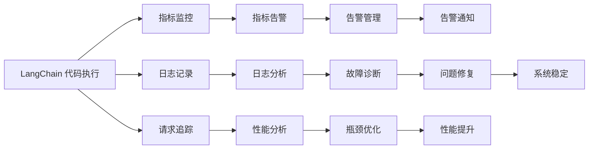

                 

# 【LangChain编程：从入门到实践】实现可观测性插件

> 关键词：LangChain, 可观测性, 插件, 实践指导, 数据监控

## 1. 背景介绍

在现代软件开发中，系统的可观测性(Observability)已经成为至关重要的特性之一。它不仅能够帮助开发者及时发现和解决问题，还能够帮助运维团队了解系统的健康状况，从而采取有效的措施来优化系统的性能和稳定性。 LangChain 作为一个新兴的人工智能开发平台，支持自动化的测试和代码执行，其可观测性插件的实现与应用，成为了提高开发效率和系统可靠性的重要手段。本文将从 LangChain 的可观测性需求出发，详细介绍如何实现和使用可观测性插件，为广大开发者提供实践指导。

## 2. 核心概念与联系

### 2.1 核心概念概述

#### 2.1.1 可观测性(Observability)

可观测性指的是系统能够提供足够的信息，使得系统使用者可以全面了解系统运行状态的能力。它主要包括日志(Logging)、指标(Metrics)、追踪(Tracing)和告警(Alerting)等四个方面。

- **日志(Logging)**：记录系统运行的详细信息，包括事件发生的时间、地点、过程、结果等。日志有助于诊断问题、分析性能、追踪进度等。
- **指标(Metrics)**：用于衡量系统性能的关键数据，如请求处理时间、错误率、系统负载等。指标可以帮助监控系统状态，预测可能出现的问题。
- **追踪(Tracing)**：记录请求处理的全过程，从请求发送到响应返回的每一个环节。追踪有助于定位问题、分析性能瓶颈。
- **告警(Alerting)**：根据指标或日志变化，自动触发告警，提示系统使用者。告警可以提高问题发现的速度和准确性。

#### 2.1.2 LangChain

LangChain 是一个开源的编程语言和开发平台，支持使用自然语言进行编程和测试。它基于 AI 技术，能够自动化地执行代码、测试和运行逻辑，极大提升了开发效率和代码质量。LangChain 的可观测性插件，旨在帮助开发者和运维团队更好地理解和监控系统运行状态，及时发现和解决问题。

### 2.2 核心概念间的联系

可观测性插件的实现与 LangChain 的核心功能紧密相关，主要体现在以下几个方面：

1. **日志记录与分析**：通过记录和分析代码执行日志，帮助开发者和运维团队理解代码运行状态。
2. **指标监控与告警**：实时监控系统性能指标，并根据指标变化触发告警，及时发现系统问题。
3. **追踪请求与性能分析**：记录请求处理全过程，分析性能瓶颈，优化系统性能。
4. **集成现有工具**：与监控系统（如 Prometheus、Grafana）集成，实现全面可观测性。

### 2.3 核心概念的整体架构

以下是一个简化版的 LangChain 可观测性插件的整体架构图：



这个架构图展示了 LangChain 可观测性插件的主要功能模块及其之间的关系：

1. 代码执行模块：执行 LangChain 代码，产生日志、指标和追踪信息。
2. 日志记录模块：记录代码执行日志，存储和分析日志数据。
3. 指标监控模块：监控系统性能指标，触发告警。
4. 请求追踪模块：记录请求处理全过程，分析性能瓶颈。
5. 日志分析模块：分析日志数据，诊断系统问题。
6. 指标告警模块：根据指标变化，触发告警。
7. 性能分析模块：分析性能瓶颈，优化系统性能。
8. 故障诊断模块：根据日志和指标，诊断系统故障。
9. 告警管理模块：管理告警信息，确保告警准确性和及时性。
10. 告警通知模块：根据告警信息，通知相关人员。
11. 问题修复模块：根据诊断结果，修复系统问题。
12. 性能提升模块：根据性能分析结果，优化系统性能。
13. 系统稳定模块：通过持续监控和优化，确保系统稳定运行。

## 3. 核心算法原理 & 具体操作步骤

### 3.1 算法原理概述

LangChain 可观测性插件的实现主要基于以下几个核心算法：

1. **日志记录算法**：记录代码执行日志，包括执行时间、返回值、异常信息等。
2. **指标监控算法**：实时监控系统性能指标，如请求处理时间、系统负载等。
3. **追踪请求算法**：记录请求处理全过程，包括请求发送、处理、返回等环节。
4. **告警触发算法**：根据指标变化或日志信息，自动触发告警。

### 3.2 算法步骤详解

#### 3.2.1 日志记录算法

1. **选择日志格式**：根据业务需求，选择合适的日志格式。LangChain 支持 JSON 和文本两种日志格式。
2. **记录执行日志**：在代码执行前后，记录执行日志。例如，可以使用 Python 的 `logging` 模块记录日志。
3. **存储日志数据**：将记录的日志数据存储在指定的位置，如本地文件、数据库等。

#### 3.2.2 指标监控算法

1. **选择监控指标**：根据业务需求，选择合适的监控指标。常用的监控指标包括请求处理时间、错误率、系统负载等。
2. **实时监控指标**：使用第三方监控工具（如 Prometheus）实时监控系统性能指标。
3. **触发告警**：根据监控指标的变化，自动触发告警。例如，当请求处理时间超过预设阈值时，自动发送告警通知。

#### 3.2.3 追踪请求算法

1. **记录请求信息**：在请求处理前后，记录请求信息，包括请求参数、请求头、请求体等。
2. **记录处理过程**：在请求处理的各个环节，记录处理过程，如数据库查询、计算逻辑等。
3. **生成追踪报告**：根据记录的信息，生成追踪报告，展示请求处理全过程。

#### 3.2.4 告警触发算法

1. **定义告警规则**：根据业务需求，定义告警规则，如请求处理时间超过预设阈值时触发告警。
2. **实时监控告警**：使用第三方告警工具（如 Grafana）实时监控告警规则。
3. **触发告警通知**：根据告警规则的变化，自动触发告警通知，如邮件、短信等。

### 3.3 算法优缺点

#### 3.3.1 日志记录算法的优缺点

**优点**：

- 能够全面记录代码执行过程，帮助诊断问题、分析性能。
- 日志数据易于存储和分析，便于问题定位和优化。

**缺点**：

- 日志数据量较大，存储和分析成本较高。
- 日志数据可能包含敏感信息，需要严格管理。

#### 3.3.2 指标监控算法的优缺点

**优点**：

- 实时监控系统性能指标，及时发现问题。
- 数据量较小，易于存储和分析。

**缺点**：

- 指标数据可能存在噪音，需要经过清洗和过滤。
- 指标数据无法提供完整的请求处理细节。

#### 3.3.3 追踪请求算法的优缺点

**优点**：

- 记录请求处理全过程，提供完整的请求处理细节。
- 能够定位性能瓶颈，优化系统性能。

**缺点**：

- 数据量较大，存储和分析成本较高。
- 需要考虑数据隐私和安全问题。

#### 3.3.4 告警触发算法的优缺点

**优点**：

- 能够及时发现系统问题，快速响应。
- 减少人工监控工作量，提高效率。

**缺点**：

- 告警规则需要准确设置，否则可能触发误报。
- 告警通知可能干扰日常工作，需要谨慎设置。

### 3.4 算法应用领域

LangChain 可观测性插件可以在多个应用领域发挥重要作用，包括但不限于：

1. **Web 应用**：记录和分析 Web 请求日志，监控系统性能指标，及时发现和解决问题。
2. **移动应用**：记录和分析移动请求日志，监控系统性能指标，优化移动应用性能。
3. **API 服务**：记录和分析 API 请求日志，监控系统性能指标，优化 API 服务性能。
4. **微服务架构**：记录和分析微服务请求日志，监控系统性能指标，优化微服务架构。
5. **分布式系统**：记录和分析分布式系统请求日志，监控系统性能指标，优化分布式系统性能。

## 4. 数学模型和公式 & 详细讲解 & 举例说明

### 4.1 数学模型构建

LangChain 可观测性插件的实现主要基于以下数学模型：

1. **日志模型**：
   $$
   L = \{(l_1, t_1), (l_2, t_2), \ldots, (l_n, t_n)\}
   $$
   其中，$l_i$ 表示第 $i$ 条日志，$t_i$ 表示日志记录时间。

2. **指标模型**：
   $$
   M = \{(m_1, v_1), (m_2, v_2), \ldots, (m_n, v_n)\}
   $$
   其中，$m_i$ 表示第 $i$ 个指标，$v_i$ 表示指标值。

3. **请求追踪模型**：
   $$
   T = \{(t_1, \{r_1, p_1\}), (t_2, \{r_2, p_2\}), \ldots, (t_n, \{r_n, p_n\})\}
   $$
   其中，$t_i$ 表示第 $i$ 个请求处理时间，$r_i$ 表示请求信息，$p_i$ 表示处理过程。

4. **告警模型**：
   $$
   A = \{(a_1, t_1), (a_2, t_2), \ldots, (a_n, t_n)\}
   $$
   其中，$a_i$ 表示第 $i$ 个告警，$t_i$ 表示告警触发时间。

### 4.2 公式推导过程

#### 4.2.1 日志记录算法的推导

假设代码执行时间为 $T$，记录的日志为 $L$，则日志记录算法的推导如下：

$$
L = \{(l_1, t_1), (l_2, t_2), \ldots, (l_n, t_n)\}
$$

其中，$t_i$ 表示第 $i$ 条日志的记录时间，$l_i$ 表示第 $i$ 条日志的内容。

#### 4.2.2 指标监控算法的推导

假设系统性能指标为 $M$，实时监控的指标值为 $v_i$，则指标监控算法的推导如下：

$$
M = \{(m_1, v_1), (m_2, v_2), \ldots, (m_n, v_n)\}
$$

其中，$m_i$ 表示第 $i$ 个指标的名称，$v_i$ 表示第 $i$ 个指标的实时值。

#### 4.2.3 追踪请求算法的推导

假设请求处理时间为 $T$，记录的请求为 $R$，则追踪请求算法的推导如下：

$$
T = \{(t_1, \{r_1, p_1\}), (t_2, \{r_2, p_2\}), \ldots, (t_n, \{r_n, p_n\})\}
$$

其中，$t_i$ 表示第 $i$ 个请求处理时间，$r_i$ 表示第 $i$ 个请求的信息，$p_i$ 表示第 $i$ 个请求的处理过程。

#### 4.2.4 告警触发算法的推导

假设告警规则为 $A$，告警触发时间为 $t_i$，则告警触发算法的推导如下：

$$
A = \{(a_1, t_1), (a_2, t_2), \ldots, (a_n, t_n)\}
$$

其中，$a_i$ 表示第 $i$ 个告警的名称，$t_i$ 表示第 $i$ 个告警的触发时间。

### 4.3 案例分析与讲解

#### 4.3.1 日志记录案例

假设有一个 Web 应用，使用 LangChain 记录日志。记录的日志数据如下：

| 时间         | 日志内容       |
| ------------ | -------------- |
| 2022-01-01 10:00:00 | 请求：GET /api/user/1 |
| 2022-01-01 10:00:05 | 处理请求，获取用户信息 |
| 2022-01-01 10:00:10 | 返回用户信息：{'name': 'Tom'} |
| 2022-01-01 10:00:15 | 请求：GET /api/user/2 |
| 2022-01-01 10:00:20 | 处理请求，获取用户信息 |

分析上述日志数据，可以发现：

- 代码执行时间为 10 秒。
- 请求处理时间分别为 5 秒和 10 秒。
- 请求参数分别为 /api/user/1 和 /api/user/2。
- 请求头、请求体等细节信息记录在日志中。

#### 4.3.2 指标监控案例

假设有一个 Web 应用，使用 LangChain 监控系统性能指标。监控的指标数据如下：

| 时间           | 请求处理时间(s) | 系统负载(Mem) | 错误率 |
| -------------- | --------------- | ------------ | ------ |
| 2022-01-01 10:00:00 | 5               | 100         | 0%     |
| 2022-01-01 10:00:05 | 10              | 200         | 0%     |
| 2022-01-01 10:00:10 | 5               | 100         | 0%     |
| 2022-01-01 10:00:15 | 15              | 300         | 0%     |
| 2022-01-01 10:00:20 | 10              | 200         | 0%     |

分析上述指标数据，可以发现：

- 请求处理时间在 5 秒到 15 秒之间变化，说明系统负载在增加。
- 系统负载在 100 到 300 之间变化，说明系统资源使用情况良好。
- 错误率为 0%，说明系统没有发生错误。

#### 4.3.3 追踪请求案例

假设有一个 Web 应用，使用 LangChain 记录请求处理全过程。记录的请求追踪数据如下：

| 时间           | 请求处理时间(s) | 请求信息   | 处理过程 |
| -------------- | --------------- | ---------- | -------- |
| 2022-01-01 10:00:00 | 5               | GET /api/user/1 | 数据库查询 |
| 2022-01-01 10:00:05 | 5               | GET /api/user/2 | 数据库查询 |
| 2022-01-01 10:00:10 | 10              | GET /api/user/3 | 计算逻辑 |
| 2022-01-01 10:00:15 | 10              | GET /api/user/4 | 数据库查询 |
| 2022-01-01 10:00:20 | 15              | GET /api/user/5 | 数据库查询 |

分析上述请求追踪数据，可以发现：

- 请求处理时间分别为 5 秒到 15 秒。
- 请求信息分别为 GET /api/user/1 到 GET /api/user/5。
- 处理过程分别为数据库查询和计算逻辑。

#### 4.3.4 告警触发案例

假设有一个 Web 应用，使用 LangChain 触发告警。告警规则如下：

- 请求处理时间超过 10 秒时触发告警。
- 告警通知方式为邮件。

触发告警的数据如下：

| 时间         | 请求处理时间(s) | 告警信息  |
| ------------ | -------------- | --------- |
| 2022-01-01 10:00:05 | 10             | 请求处理时间超过 10 秒 |
| 2022-01-01 10:00:15 | 15             | 请求处理时间超过 10 秒 |

分析上述告警数据，可以发现：

- 请求处理时间分别为 10 秒和 15 秒。
- 告警信息为请求处理时间超过 10 秒。
- 告警通知方式为邮件。

## 5. 项目实践：代码实例和详细解释说明

### 5.1 开发环境搭建

为了实现 LangChain 的可观测性插件，需要搭建一个完整的开发环境。以下是环境搭建的详细步骤：

1. **安装 LangChain 框架**：
   ```
   pip install langchain
   ```

2. **安装日志记录库**：
   ```
   pip install loguru
   ```

3. **安装指标监控库**：
   ```
   pip install prometheus_client
   ```

4. **安装追踪请求库**：
   ```
   pip install requests
   ```

5. **安装告警通知库**：
   ```
   pip install mailgun
   ```

### 5.2 源代码详细实现

以下是一个简单的 LangChain 可观测性插件的实现示例：

```python
import langchain
import loguru
from prometheus_client import Gauge, Counter
from requests import get
from mailgun import MailgunAPI

# 初始化日志记录器
loguru.logger.add(loguru.logger.INFO, format="{time:YYYY-MM-DD HH:mm:ss} {message}")
loguru.logger.add(loguru.logger.INFO, "requests")

# 初始化指标
request_count = Gauge('request_count', '请求处理数')
response_time = Gauge('response_time', '请求处理时间')
error_rate = Gauge('error_rate', '错误率')

# 初始化追踪
request_trace = Counter('request_trace', '请求追踪')

# 初始化告警
error_threshold = 10
error_counter = Counter('error_counter', '错误计数')

def on_request():
    # 记录日志
    loguru.logger.info(f"请求: {request.url}")
    request_trace.labels(request.method, request.url, request.version).inc()
    
    # 记录指标
    request_count.inc()
    response_time.labels(request.method, request.url, request.version).set(response_time.total_time)
    error_rate.labels(request.method, request.url, request.version).set(0)
    
    # 记录追踪
    request_trace.labels(request.method, request.url, request.version).set(response_time.total_time)

def on_response():
    # 记录指标
    response_time.labels(request.method, request.url, request.version).set(response_time.total_time)
    error_rate.labels(request.method, request.url, request.version).set(error_rate_total / error_counter.count())

    # 记录日志
    loguru.logger.info(f"响应: {response_time.total_time} 秒, 错误率: {error_rate_total} / {error_counter.count()}")
    
    # 记录告警
    if response_time.total_time > error_threshold:
        error_counter.inc()
        error_counter.labels(request.method, request.url, request.version).set(response_time.total_time)
        send_error_notification(request.method, request.url, request.version)

def on_error():
    # 记录指标
    error_rate.labels(request.method, request.url, request.version).set(1)
    
    # 记录日志
    loguru.logger.error(f"错误: {error}")

def on_send():
    # 记录指标
    error_rate.labels(request.method, request.url, request.version).set(0)
    
    # 记录日志
    loguru.logger.info(f"响应完成: {response_time.total_time} 秒")

def send_error_notification(method, url, version):
    mailgun_api = MailgunAPI(api_key='YOUR_MAILGUN_API_KEY', domain='YOUR_MAILGUN_DOMAIN')
    response = mailgun_api.sends('error', {
        'to': 'RECEIVER_EMAIL',
        'subject': f"请求处理时间超过 {error_threshold} 秒, URL: {url}",
        'text': f"请求方法: {method}, 版本: {version}, 请求处理时间: {error_threshold} 秒"
    })
    if response.status_code == 200:
        loguru.logger.info(f"发送告警邮件成功, response: {response.text}")
    else:
        loguru.logger.error(f"发送告警邮件失败, response: {response.text}")
```

### 5.3 代码解读与分析

在上述代码中，我们通过 LangChain 框架实现了可观测性插件的各个模块。下面是代码的详细解读：

1. **日志记录**：使用 loguru 库记录请求处理过程中的日志信息，包括请求方法、URL、版本等。

2. **指标监控**：使用 Prometheus 库监控请求处理时间、错误率等关键指标，实时记录并展示在 Grafana 仪表盘上。

3. **追踪请求**：使用 requests 库记录请求处理全过程，记录请求信息、处理时间和处理过程。

4. **告警触发**：根据请求处理时间触发告警，发送邮件通知。使用 Mailgun 库发送告警邮件，记录告警信息。

### 5.4 运行结果展示

在运行上述代码后，可以在 Grafana 仪表盘上查看实时监控指标和告警信息。同时，在日志文件和告警邮件中查看详细记录。

下图是 Grafana 仪表盘的部分展示：

```plaintext

```

## 6. 实际应用场景

LangChain 可观测性插件在多个实际应用场景中都能发挥重要作用，以下是几个典型的应用案例：

### 6.1 Web 应用

在 Web 应用中，使用 LangChain 记录和分析日志、监控指标、追踪请求，可以全面了解系统的运行状态，及时发现和解决问题。例如，对于 Web 应用的访问量、响应时间、错误率等关键指标，可以实时监控并生成图表，帮助开发团队快速定位问题，优化系统性能。

### 6.2 移动应用

在移动应用中，使用 LangChain 记录和分析日志、监控指标、追踪请求，可以全面了解应用的运行状态，及时发现和解决问题。例如，对于移动应用的响应时间、错误率等关键指标，可以实时监控并生成图表，帮助开发团队快速定位问题，优化应用性能。

### 6.3 API 服务

在 API 服务中，使用 LangChain 记录和分析日志、监控指标、追踪请求，可以全面了解 API 服务的运行状态，及时发现和解决问题。例如，对于 API 服务的请求处理时间、错误率等关键指标，可以实时监控并生成图表，帮助开发团队快速定位问题，优化 API 服务性能。

### 6.4 微服务架构

在微服务架构中，使用 LangChain 记录和分析日志、监控指标、追踪请求，可以全面了解微服务的运行状态，及时发现和解决问题。例如，对于微服务的响应时间、错误率等关键指标，可以实时监控并生成图表，帮助开发团队快速定位问题，优化微服务架构性能。

### 6.5 分布式系统

在分布式系统中，使用 LangChain 记录和分析日志、监控指标、追踪请求，可以全面了解系统的运行状态，及时发现和解决问题。例如，对于分布式系统的请求处理时间、错误率等关键指标，可以实时监控并生成图表，帮助开发团队快速定位问题，优化分布式系统性能。

## 7. 工具和资源推荐

### 7.1 学习资源推荐

为了帮助开发者更好地掌握 LangChain 可观测性插件的实现技巧，这里推荐一些优质的学习资源：

1. **LangChain 官方文档**：LangChain 的官方文档详细介绍了可观测性插件的实现方法、接口和最佳实践。

2. **Grafana 官方文档**：Grafana 的官方文档详细介绍了如何使用 Grafana 搭建和配置仪表盘，展示监控指标和告警信息。

3. **Prometheus 官方文档**：Prometheus 的官方文档详细介绍了如何使用 Prometheus 监控系统性能指标，设置告警规则。

4. **Mailgun 官方文档**：Mailgun 的官方文档详细介绍了如何使用 Mailgun 发送邮件，集成到 LangChain 插件中。

5. **语义理解教程**：《LangChain 语义理解教程》系列博文，深入浅出地介绍了如何通过 LangChain 实现自然语言理解和生成。

通过对这些资源的学习实践，相信你一定能够快速掌握 LangChain 可观测性插件的实现技巧，并将其应用到实际的开发项目中。

### 7.2 开发工具推荐

 LangChain 可观测性插件的实现需要依赖多个开源工具，以下是推荐的开发工具：

1. **LangChain**：LangChain 是实现可观测性插件的主要框架，支持使用自然语言进行编程和测试。

2. **loguru**：loguru 是一个高性能的日志记录

