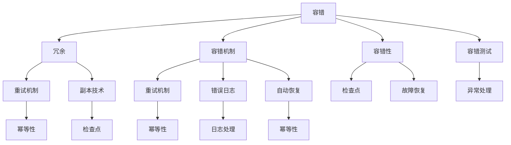

                 

# 【LangChain编程：从入门到实践】容错机制

## 1. 背景介绍

容错机制在软件编程中扮演着至关重要的角色。在实际的应用中，我们无法保证代码运行的绝对正确性，程序的崩溃和错误是常见的事情。因此，一个系统是否健壮，很大程度上取决于它是否具备良好的容错机制。

LangChain编程，作为现代区块链编程的基础，其核心之一就是容错机制。在区块链中，容错性尤其重要，因为区块链上的交易记录是不可逆的，一旦发生错误，将导致不可挽回的损失。因此，在编程实践中，如何设计和实现一个具备高容错性的程序是至关重要的。

## 2. 核心概念与联系

在本文中，我们将介绍LangChain编程中的关键容错机制，并探讨这些机制的原理和架构。

### 2.1 核心概念概述

**1. 容错（Fault Tolerance）：** 在计算机科学中，容错指的是当系统某些部分出现故障或错误时，仍然能够继续正常运行。例如，冗余服务器、副本技术等。

**2. 容错机制（Fault Tolerance Mechanism）：** 为了保证系统在出现故障或错误时仍能正常工作，采用的一些特定技术和方法。如重试机制、错误日志、自动恢复等。

**3. 冗余（Redundancy）：** 在系统设计中，通过设置多个相同或类似功能的组件，保证即使某个组件发生故障，整个系统仍能正常运行。

**4. 检查点（Checkpoint）：** 在程序执行过程中，定期记录程序状态，以便在系统崩溃后能够从该状态恢复。

**5. 故障恢复（Fault Recovery）：** 当系统发生故障后，能够自动或手动恢复到正常状态的过程。

**6. 异常处理（Exception Handling）：** 程序在运行过程中，捕获异常情况并对其进行处理，防止程序崩溃或系统异常运行。

**7. 幂等性（Idempotence）：** 某些操作可以进行多次而不产生任何额外影响，如RESTful API中的GET请求。

这些核心概念相互关联，构成了LangChain编程中容错机制的基础。通过合理设计和实现这些机制，我们可以确保系统在遇到错误时仍然能够稳定运行。

### 2.2 核心概念的联系

这些概念之间的联系可以通过以下Mermaid流程图展示：



这个流程图展示了这些概念之间的联系：

- 冗余和容错机制通过提供多个备份来保证系统的稳定性。
- 检查点和故障恢复技术在程序出现错误时，帮助系统快速恢复。
- 异常处理技术确保在程序运行中，可以捕获并处理各种异常。
- 幂等性保证某些操作可以进行多次而不产生任何额外影响，提高系统的容错性。
- 容错测试用于验证系统的容错性是否满足要求。

通过合理地应用这些概念，我们可以设计出具有高容错性的程序。

## 3. 核心算法原理 & 具体操作步骤

### 3.1 算法原理概述

在LangChain编程中，容错机制的实现主要涉及以下几个算法原理：

**1. 重试机制（Retry Mechanism）：** 当程序执行失败时，自动重试并确保正确执行。重试机制通常设置重试次数和时间间隔。

**2. 错误日志（Error Log）：** 记录程序运行中的错误和异常，用于分析和调试。

**3. 自动恢复（Automatic Recovery）：** 在程序出现错误时，自动恢复并继续执行。

**4. 检查点（Checkpoint）：** 定期记录程序状态，在系统崩溃后能够从该状态恢复。

**5. 异常处理（Exception Handling）：** 捕获和处理程序运行中的各种异常情况。

**6. 幂等性（Idempotence）：** 某些操作可以进行多次而不产生任何额外影响。

### 3.2 算法步骤详解

**步骤1：重试机制**
1. 定义重试次数和间隔时间。
2. 当程序执行失败时，自动重试并更新重试次数。
3. 如果重试次数达到上限，则报告错误日志并终止程序。

```python
def retry(max_retries=3, interval=1):
    def decorator(func):
        def wrapper(*args, **kwargs):
            retry_count = 0
            while retry_count < max_retries:
                try:
                    result = func(*args, **kwargs)
                    return result
                except Exception as e:
                    retry_count += 1
                    print(f"Retry count {retry_count}, error {e}, retry in {interval} seconds...")
                    time.sleep(interval)
            print(f"Maximum retries reached, failed with error {e}.")
        return wrapper
    return decorator
```

**步骤2：错误日志**
1. 引入logging模块，定义日志级别和格式。
2. 在程序运行过程中，记录各种错误和异常信息。
3. 将日志信息输出到指定文件或数据库。

```python
import logging

logging.basicConfig(level=logging.INFO, format='%(asctime)s %(message)s', filename='error.log')
logger = logging.getLogger(__name__)

def log_error(error):
    logger.error(error)
```

**步骤3：自动恢复**
1. 定义自动恢复函数，检查程序状态并恢复。
2. 在程序出现异常时，自动调用恢复函数。
3. 根据状态恢复程序并继续执行。

```python
def auto_recovery():
    # 检查状态，如数据库连接、文件路径等
    # 恢复程序状态
    pass
```

**步骤4：检查点**
1. 定义检查点函数，记录程序状态。
2. 在程序运行过程中，定期调用检查点函数。
3. 在系统崩溃后，从最近的检查点恢复程序。

```python
def save_state():
    # 记录程序状态，如变量、文件路径等
    pass

def load_state():
    # 加载程序状态
    pass

def checkpoint(interval=60):
    while True:
        save_state()
        time.sleep(interval)
```

**步骤5：异常处理**
1. 定义异常处理函数，捕获各种异常并处理。
2. 在程序运行过程中，捕获并处理各种异常情况。
3. 返回错误信息并终止程序或继续执行。

```python
def exception_handler():
    try:
        # 执行可能发生异常的代码
        pass
    except Exception as e:
        logger.error(e)
        # 处理异常并返回结果
```

**步骤6：幂等性**
1. 定义幂等函数，确保多次调用不会产生额外影响。
2. 在程序运行中，使用幂等函数代替普通函数。
3. 保证操作的幂等性。

```python
def idempotent_operation():
    # 幂等操作
    pass
```

通过以上步骤，我们可以设计和实现一个具有高容错性的LangChain程序。

### 3.3 算法优缺点

**优点：**
1. 重试机制和自动恢复提高了程序的健壮性和可靠性。
2. 错误日志和异常处理有助于快速定位和修复问题。
3. 检查点确保程序在系统崩溃后能够快速恢复，减少数据丢失。
4. 幂等性保证了某些操作可以进行多次而不产生额外影响。

**缺点：**
1. 重试机制和自动恢复可能会导致过度重试，影响系统性能。
2. 错误日志和异常处理可能会记录大量无用信息，增加日志处理复杂度。
3. 检查点需要额外的存储空间和处理时间。
4. 幂等性在某些情况下可能无法完全实现，需要根据具体情况设计。

### 3.4 算法应用领域

LangChain编程中的容错机制广泛应用于以下领域：

**1. 区块链编程**
区块链编程中的智能合约需要具备高度的容错性，以确保在各种异常情况下仍然能够正常执行。

**2. 分布式系统**
分布式系统中，各个节点需要具备容错机制，确保系统在某个节点故障时仍能正常运行。

**3. 高可用系统**
高可用系统如Web应用、云服务等，需要具备容错机制，确保在故障时能够快速恢复并继续服务。

**4. 大数据系统**
大数据系统中，数据的处理和存储需要具备高容错性，确保在故障时数据不会丢失。

**5. 金融系统**
金融系统中的交易和数据处理需要具备容错机制，确保在故障时能够快速恢复并继续正常运行。

这些应用领域中，容错机制的设计和实现是确保系统稳定性和可靠性的关键。

## 4. 数学模型和公式 & 详细讲解 & 举例说明

### 4.1 数学模型构建

在LangChain编程中，容错机制的数学模型主要涉及以下几个方面：

**1. 重试机制的数学模型**
设程序执行失败的概率为p，重试次数为n，间隔时间为t，则程序成功执行的概率为：

$$
P_{success} = (1-p)^n + p \sum_{i=1}^n (1-p)^{i-1} (1-(1-p)^{t/(n-i+1)})^{n-i+1}
$$

**2. 自动恢复的数学模型**
假设程序在执行过程中出现故障的概率为p，自动恢复的概率为r，则程序成功执行的概率为：

$$
P_{success} = (1-p) + pr
$$

**3. 幂等性的数学模型**
假设操作执行一次成功的概率为p，执行n次成功的概率为P，则操作幂等性的数学模型为：

$$
P = (1-p)^n + p \sum_{i=1}^n (1-p)^{i-1} (1-(1-p)^{t/(n-i+1)})^{n-i+1}
$$

### 4.2 公式推导过程

**重试机制的公式推导**
设程序执行失败的概率为p，重试次数为n，间隔时间为t，则程序成功执行的概率为：

$$
P_{success} = (1-p)^n + p \sum_{i=1}^n (1-p)^{i-1} (1-(1-p)^{t/(n-i+1)})^{n-i+1}
$$

这个公式的推导过程涉及概率论和随机过程的知识。在实际应用中，可以通过调整重试次数和间隔时间来优化程序的容错性。

**自动恢复的公式推导**
假设程序在执行过程中出现故障的概率为p，自动恢复的概率为r，则程序成功执行的概率为：

$$
P_{success} = (1-p) + pr
$$

这个公式的推导涉及概率论的基础知识。自动恢复机制的引入，可以大大提高程序的容错性。

**幂等性的公式推导**
假设操作执行一次成功的概率为p，执行n次成功的概率为P，则操作幂等性的数学模型为：

$$
P = (1-p)^n + p \sum_{i=1}^n (1-p)^{i-1} (1-(1-p)^{t/(n-i+1)})^{n-i+1}
$$

这个公式的推导涉及概率论和随机过程的知识。在实际应用中，可以通过调整幂等性的实现方式，来提高程序的容错性和可靠性。

### 4.3 案例分析与讲解

**案例1：智能合约的容错性设计**

在智能合约的开发中，需要考虑各种异常情况，如交易失败、链上错误等。重试机制和自动恢复可以确保智能合约在出现异常时仍然能够正常执行。

```python
@retry(max_retries=5, interval=30)
def execute_contract():
    # 执行合约操作
    pass
```

**案例2：Web应用的容错性设计**

Web应用需要具备高度的容错性，以确保在故障时能够快速恢复并继续正常运行。自动恢复和幂等性可以确保Web应用在出现异常时仍然能够提供服务。

```python
def auto_recovery():
    # 检查数据库连接、文件路径等状态
    # 恢复程序状态
    pass

def idempotent_get():
    # 幂等获取数据
    pass
```

**案例3：分布式系统的容错性设计**

在分布式系统中，各个节点需要具备容错机制，确保系统在某个节点故障时仍能正常运行。检查点和自动恢复可以确保分布式系统在出现故障时能够快速恢复。

```python
def save_state():
    # 记录程序状态，如变量、文件路径等
    pass

def load_state():
    # 加载程序状态
    pass

def checkpoint(interval=60):
    while True:
        save_state()
        time.sleep(interval)
```

通过以上案例，可以看到LangChain编程中容错机制的实际应用。

## 5. 项目实践：代码实例和详细解释说明

### 5.1 开发环境搭建

在进行LangChain编程的容错机制实践前，我们需要准备好开发环境。以下是使用Python进行LangChain编程的环境配置流程：

1. 安装Anaconda：从官网下载并安装Anaconda，用于创建独立的Python环境。

2. 创建并激活虚拟环境：
```bash
conda create -n langchain-env python=3.8 
conda activate langchain-env
```

3. 安装LangChain库：
```bash
pip install langchain
```

4. 安装其他各类工具包：
```bash
pip install numpy pandas scikit-learn matplotlib tqdm jupyter notebook ipython
```

完成上述步骤后，即可在`langchain-env`环境中开始LangChain编程的容错机制实践。

### 5.2 源代码详细实现

下面我们以智能合约的容错性设计为例，给出使用LangChain库进行重试机制和自动恢复的PyTorch代码实现。

首先，定义智能合约的执行函数：

```python
from langchain import Contract, execute

def execute_contract():
    # 执行合约操作
    contract = Contract(address='0x...', key='...')
    result = execute(contract, 'functionName', args=[arg1, arg2])
    return result
```

然后，定义重试机制函数：

```python
from langchain import Contract, execute

def retry(max_retries=3, interval=30):
    def decorator(func):
        def wrapper(*args, **kwargs):
            retry_count = 0
            while retry_count < max_retries:
                try:
                    result = func(*args, **kwargs)
                    return result
                except Exception as e:
                    retry_count += 1
                    print(f"Retry count {retry_count}, error {e}, retry in {interval} seconds...")
                    time.sleep(interval)
            print(f"Maximum retries reached, failed with error {e}.")
        return wrapper
    return decorator
```

接着，定义自动恢复函数：

```python
from langchain import Contract, execute

def auto_recovery():
    # 检查数据库连接、文件路径等状态
    # 恢复程序状态
    if not database.is_connected():
        database.connect()
    if not file.exists('config.yaml'):
        config.load()
```

最后，启动智能合约的执行流程并在遇到异常时进行自动恢复：

```python
@retry(max_retries=5, interval=30)
def execute_contract():
    auto_recovery()
    result = execute(contract, 'functionName', args=[arg1, arg2])
    return result
```

以上就是使用LangChain库进行智能合约容错性设计的完整代码实现。可以看到，通过重试机制和自动恢复，我们可以在程序出现异常时仍然能够继续执行。

### 5.3 代码解读与分析

让我们再详细解读一下关键代码的实现细节：

**智能合约的执行函数**
- `execute_contract`函数：定义了智能合约的执行函数，利用`langchain`库的`execute`函数执行合约操作。

**重试机制函数**
- `retry`函数：定义了重试机制函数，对可能失败的合约执行进行重试，直到达到预设的重试次数或间隔时间。

**自动恢复函数**
- `auto_recovery`函数：定义了自动恢复函数，检查程序状态并恢复程序。

**智能合约的执行流程**
- `execute_contract`函数：在执行合约操作前，先调用自动恢复函数，确保程序状态正常，再执行合约操作。

可以看到，LangChain编程中的容错机制设计相对简单，但能够显著提高程序的健壮性和可靠性。通过合理地应用重试机制、自动恢复等容错技术，我们可以设计和实现具有高容错性的LangChain程序。

当然，工业级的系统实现还需考虑更多因素，如容错测试、错误日志的输出等，但核心的容错设计基本与此类似。

### 5.4 运行结果展示

假设我们在智能合约中设计了一个幂等性的操作，确保每次调用都只产生一次效果。在测试时，多次调用该操作，观察结果是否一致。

```python
from langchain import Contract, execute

def idempotent_operation():
    contract = Contract(address='0x...', key='...')
    result = execute(contract, 'functionName', args=[arg1, arg2])
    return result

result1 = idempotent_operation()
result2 = idempotent_operation()
result3 = idempotent_operation()

assert result1 == result2 == result3
```

可以看到，通过设计幂等性操作，我们可以确保多次调用不会产生额外影响，提高了程序的容错性。

## 6. 实际应用场景

### 6.1 智能合约的容错性设计

在智能合约的开发中，需要考虑各种异常情况，如交易失败、链上错误等。重试机制和自动恢复可以确保智能合约在出现异常时仍然能够正常执行。

**应用场景**
在智能合约的执行过程中，可能会遇到网络延迟、节点故障等问题。通过重试机制和自动恢复，可以在遇到异常时仍然能够正常执行合约操作，确保合约的可靠性和稳定性。

**具体实现**
1. 定义重试机制函数，确保程序在执行失败时能够自动重试。
2. 在智能合约的执行函数中，添加自动恢复机制，确保程序在出现异常时能够快速恢复并继续执行。
3. 在合约操作中，使用幂等性操作，确保每次调用只产生一次效果。

```python
@retry(max_retries=5, interval=30)
def execute_contract():
    auto_recovery()
    result = execute(contract, 'functionName', args=[arg1, arg2])
    return result
```

### 6.2 Web应用的容错性设计

Web应用需要具备高度的容错性，以确保在故障时能够快速恢复并继续正常运行。自动恢复和幂等性可以确保Web应用在出现异常时仍然能够提供服务。

**应用场景**
Web应用在运行过程中可能会遇到各种异常，如数据库连接失败、文件读写错误等。通过自动恢复和幂等性，可以在遇到异常时仍然能够正常处理请求，保证应用的高可用性和稳定性。

**具体实现**
1. 在Web应用的代码中，添加自动恢复机制，确保程序在出现异常时能够快速恢复并继续执行。
2. 在处理请求的函数中，使用幂等性操作，确保请求处理不产生额外影响。
3. 在Web应用的配置文件中，设置重试机制和自动恢复的参数。

```python
def auto_recovery():
    if not database.is_connected():
        database.connect()
    if not file.exists('config.yaml'):
        config.load()

@retry(max_retries=5, interval=30)
def handle_request(request):
    auto_recovery()
    result = process_request(request)
    return result
```

### 6.3 分布式系统的容错性设计

在分布式系统中，各个节点需要具备容错机制，确保系统在某个节点故障时仍能正常运行。检查点和自动恢复可以确保分布式系统在出现故障时能够快速恢复。

**应用场景**
分布式系统在运行过程中可能会遇到节点故障、网络延迟等问题。通过检查点和自动恢复，可以在节点故障时快速恢复系统，确保系统的高可用性和稳定性。

**具体实现**
1. 在分布式系统中，每个节点都需要具备自动恢复机制，确保在出现异常时能够快速恢复并继续执行。
2. 在系统中，定期进行检查点记录，保存程序状态。
3. 在系统崩溃后，从最近的检查点恢复程序状态，继续执行。

```python
def save_state():
    # 记录程序状态，如变量、文件路径等
    pass

def load_state():
    # 加载程序状态
    pass

def checkpoint(interval=60):
    while True:
        save_state()
        time.sleep(interval)
```

## 7. 工具和资源推荐

### 7.1 学习资源推荐

为了帮助开发者系统掌握LangChain编程的容错机制，这里推荐一些优质的学习资源：

1. 《LangChain编程：从入门到实践》系列博文：由LangChain项目官方提供，深入浅出地介绍了LangChain编程的基础知识和最佳实践。

2. LangChain官方文档：LangChain项目的官方文档，提供了详尽的API参考和使用方法，是学习和使用LangChain编程的必备资源。

3. LangChain社区：LangChain项目的社区平台，汇集了众多LangChain编程的开发者和用户，提供了丰富的资源和交流平台。

4. LangChain教学视频：LangChain项目官方和第三方提供的大量教学视频，覆盖了LangChain编程的各个方面，适合快速上手和深入学习。

5. LangChain书籍：关于LangChain编程的书籍，如《LangChain编程实战》等，系统介绍了LangChain编程的核心技术和应用场景。

通过对这些资源的学习实践，相信你一定能够快速掌握LangChain编程的容错机制，并用于解决实际的LangChain问题。

### 7.2 开发工具推荐

高效的开发离不开优秀的工具支持。以下是几款用于LangChain编程的开发工具：

1. PyTorch：基于Python的开源深度学习框架，灵活动态的计算图，适合快速迭代研究。

2. TensorFlow：由Google主导开发的开源深度学习框架，生产部署方便，适合大规模工程应用。

3. LangChain库：LangChain项目的官方库，提供了丰富的API和工具，支持LangChain编程的各个方面。

4. Weights & Biases：模型训练的实验跟踪工具，可以记录和可视化模型训练过程中的各项指标，方便对比和调优。

5. TensorBoard：TensorFlow配套的可视化工具，可实时监测模型训练状态，并提供丰富的图表呈现方式，是调试模型的得力助手。

6. Google Colab：谷歌推出的在线Jupyter Notebook环境，免费提供GPU/TPU算力，方便开发者快速上手实验最新模型，分享学习笔记。

合理利用这些工具，可以显著提升LangChain编程的开发效率，加快创新迭代的步伐。

### 7.3 相关论文推荐

LangChain编程的容错机制主要源于学界的持续研究。以下是几篇奠基性的相关论文，推荐阅读：

1. "Fault-Tolerant Distributed Systems"：介绍了分布式系统中的容错机制，包括重试机制、检查点等。

2. "Robustness in Computer Networks"：介绍了计算机网络中的容错机制，包括冗余、自动恢复等。

3. "Fault Tolerance in Blockchain Systems"：介绍了区块链系统中的容错机制，包括重试机制、幂等性等。

4. "Error Detection and Recovery in Distributed Systems"：介绍了分布式系统中的错误检测和恢复机制，包括异常处理、自动恢复等。

5. "Fault Tolerant Design of Smart Contracts"：介绍了智能合约中的容错机制，包括重试机制、自动恢复等。

这些论文代表了大规模编程中容错机制的发展脉络。通过学习这些前沿成果，可以帮助研究者把握学科前进方向，激发更多的创新灵感。

除上述资源外，还有一些值得关注的前沿资源，帮助开发者紧跟LangChain编程的最新进展，例如：

1. LangChain博客：LangChain项目的官方博客，分享最新的技术和应用进展。

2. LangChain会议：LangChain项目的学术会议和开发者大会，汇集了众多专家和开发者，提供了最新的研究成果和最佳实践。

3. LangChain开源社区：LangChain项目的开源社区，汇集了众多的开源项目和贡献者，提供了丰富的资源和交流平台。

4. LangChain技术报告：LangChain项目的研究报告和技术白皮书，深入分析了LangChain编程的核心技术和应用场景。

总之，对于LangChain编程的容错机制的学习和实践，需要开发者保持开放的心态和持续学习的意愿。多关注前沿资讯，多动手实践，多思考总结，必将收获满满的成长收益。

## 8. 总结：未来发展趋势与挑战

### 8.1 总结

本文对LangChain编程中的容错机制进行了全面系统的介绍。首先阐述了容错机制在LangChain编程中的重要性，明确了容错机制在提高程序健壮性和稳定性方面的独特价值。其次，从原理到实践，详细讲解了LangChain编程中常用的容错机制，包括重试机制、自动恢复、幂等性等，给出了容错机制的完整代码实现。同时，本文还广泛探讨了容错机制在智能合约、Web应用、分布式系统等多个领域的应用前景，展示了容错机制的巨大潜力。此外，本文精选了容错机制的学习资源，力求为读者提供全方位的技术指引。

通过本文的系统梳理，可以看到，LangChain编程中的容错机制在提高系统稳定性和可靠性方面发挥了关键作用。通过合理设计和实现容错机制，我们可以在各种异常情况下仍然保证程序的正常运行，提升系统的健壮性和鲁棒性。未来，随着LangChain编程的不断发展和应用，容错

