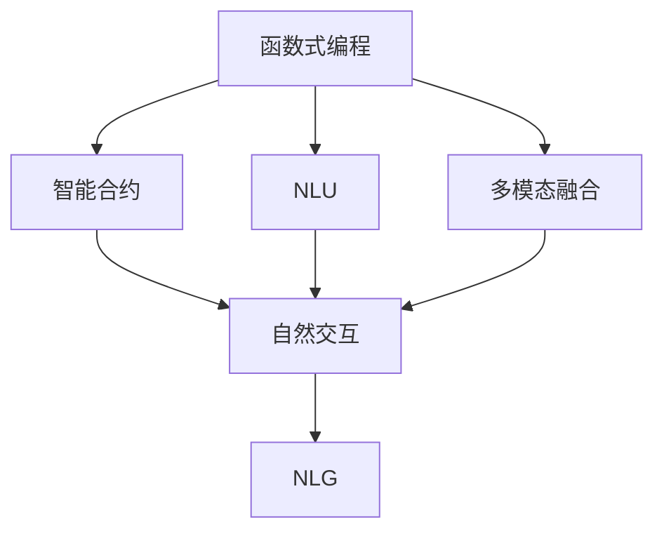
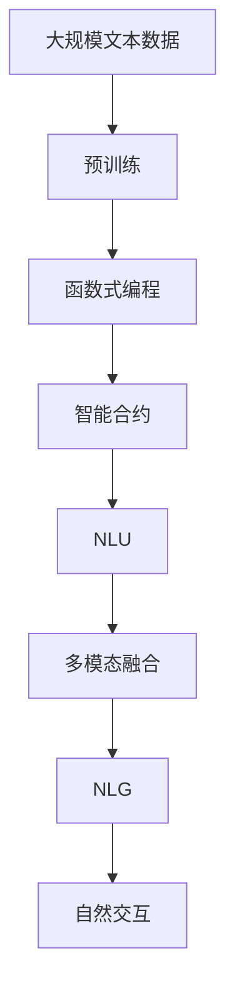

                 

# 【LangChain编程：从入门到实践】应用设计

> 关键词：
- LangChain
- 应用设计
- 编程入门
- 实践指南
- 自然语言处理(NLP)

## 1. 背景介绍

### 1.1 问题由来

近年来，随着人工智能技术在自然语言处理（NLP）领域的快速发展，自然语言交互成为了热门话题。自然语言交互包括聊天机器人、虚拟助手、问答系统等，旨在使计算机能够自然地与人类交流。然而，传统的NLP系统在语言模型、逻辑推理、多模态融合等方面存在瓶颈，难以满足用户的实时需求和自然流畅的交互体验。

为了解决这些问题，LangChain应运而生。LangChain是一个基于区块链的智能语言模型，旨在通过区块链的分布式和可验证特性，构建更加安全、透明、可信的自然语言交互系统。它通过智能合约和语言模型相结合的方式，实现了自然语言交互的新范式。

### 1.2 问题核心关键点

LangChain的核心在于其独特的编程和应用设计。具体来说，它包含以下几个关键点：

1. **编程范式**：LangChain采用函数式编程（Functional Programming）范式，支持声明式编程，便于开发者对系统行为进行描述和控制。
2. **区块链安全**：利用区块链的分布式账本和智能合约，保障了数据的不可篡改性和交互的安全性。
3. **语义理解**：通过先进的自然语言理解（NLU）技术，实现对用户输入的精确理解。
4. **自然交互**：结合语音识别、文本生成等技术，实现自然流畅的交互体验。
5. **多模态融合**：支持文本、语音、图像等多种模态数据的融合，实现更全面的交互和推理能力。

这些关键点共同构成了LangChain的核心特性，使其在自然语言交互领域具备强大的竞争力和应用前景。

### 1.3 问题研究意义

研究LangChain的编程和应用设计，对于拓展自然语言交互的应用场景，提升用户体验，加速技术产业化进程具有重要意义：

1. **降低开发成本**：基于区块链的分布式特性，使得开发者可以更方便地部署和维护系统，降低开发和运维成本。
2. **提升交互体验**：结合先进的自然语言理解技术和多模态融合能力，提供更加自然流畅的交互体验。
3. **增强安全性**：区块链的不可篡改性和智能合约的强制执行，确保了数据和交互的安全性，避免了传统系统中的安全漏洞和数据隐私问题。
4. **支持创新应用**：通过灵活的编程范式和多模态融合技术，LangChain支持更多创新应用场景，如智能客服、智能问答、智能文档生成等。
5. **加速落地应用**：结合区块链的可验证特性，使得LangChain可以更容易地集成到现有业务系统，加速NLP技术的产业化进程。

## 2. 核心概念与联系

### 2.1 核心概念概述

为了更好地理解LangChain的编程和应用设计，本节将介绍几个关键概念：

1. **函数式编程（Functional Programming）**：一种编程范式，强调函数的不可变性和纯函数（Pure Functions）的使用，避免了状态变化和副作用，提升了系统的可测试性和并发性。
2. **智能合约（Smart Contract）**：一种基于区块链的代码，旨在自动化和验证系统交互，保证数据的安全和透明。
3. **自然语言理解（NLU）**：使计算机能够理解自然语言文本的语义和语境，实现语言模型与用户交互。
4. **多模态融合（Multi-modal Fusion）**：结合文本、语音、图像等多种模态数据，提升系统的综合理解和推理能力。
5. **自然语言生成（NLG）**：利用语言模型生成自然流畅的文本输出，提升交互的智能性和自然性。

这些核心概念共同构成了LangChain的编程和应用设计框架，为其提供坚实的技术基础和广阔的应用前景。

### 2.2 概念间的关系

这些核心概念之间存在着紧密的联系，形成了LangChain的完整生态系统。下面我们通过几个Mermaid流程图来展示这些概念之间的关系：



这个流程图展示了函数式编程、智能合约、NLU、多模态融合和NLG之间的关系：

1. 函数式编程提供编程范式，智能合约提供区块链安全保障。
2. NLU用于理解和解释用户输入。
3. 多模态融合结合多种模态数据，提升系统的综合能力。
4. NLG用于生成自然流畅的输出文本，提升交互体验。
5. 自然交互将NLU、多模态融合和NLG结合，实现全面的自然语言交互。

这些概念共同构成了LangChain的核心特性，使其能够在各种场景下提供强大的自然语言交互能力。

### 2.3 核心概念的整体架构

最后，我们用一个综合的流程图来展示这些核心概念在大语言模型微调过程中的整体架构：



这个综合流程图展示了从预训练到自然交互的完整过程。大数据集上的预训练模型提供初始化知识，函数式编程和智能合约提供安全保障，NLU实现语言理解，多模态融合结合多种模态数据，NLG生成自然文本输出，自然交互结合所有功能，实现全面的自然语言交互。

## 3. 核心算法原理 & 具体操作步骤
### 3.1 算法原理概述

LangChain的编程和应用设计基于函数式编程范式，旨在提供一种声明式、易于理解和维护的编程方式。其核心思想是通过智能合约和区块链技术，确保系统交互的安全性和透明性，同时结合先进的自然语言理解技术，实现自然流畅的交互体验。

LangChain的编程和应用设计过程主要包括以下几个步骤：

1. **系统初始化**：通过智能合约部署系统架构，定义系统的初始状态和行为。
2. **数据预处理**：收集和清洗大规模文本数据，进行预训练和微调，构建基础的语言模型。
3. **编程声明式**：使用函数式编程范式，定义系统的功能和行为，实现声明式编程。
4. **交互执行**：通过智能合约和区块链技术，实现系统交互的安全性和透明性。
5. **结果反馈**：利用自然语言生成技术，生成自然流畅的输出文本，提供给用户。

### 3.2 算法步骤详解

LangChain的编程和应用设计步骤分为以下几个关键环节：

**Step 1: 系统初始化**
- 利用智能合约部署系统架构，定义系统的初始状态和行为。例如，定义系统中的角色、权限和初始资金等。

**Step 2: 数据预处理**
- 收集大规模文本数据，进行预训练和微调，构建基础的语言模型。例如，使用语言模型进行文本分类、情感分析等任务。

**Step 3: 编程声明式**
- 使用函数式编程范式，定义系统的功能和行为。例如，使用纯函数实现系统的逻辑处理，避免状态变化和副作用。
- 通过声明式编程，实现对系统行为的高效描述和控制。例如，定义系统的输入输出接口，实现对用户请求的处理。

**Step 4: 交互执行**
- 利用智能合约和区块链技术，实现系统交互的安全性和透明性。例如，通过智能合约自动执行交易，保障数据的安全和不可篡改性。
- 结合NLU技术，理解和解释用户输入，实现系统的交互逻辑。例如，通过自然语言理解技术，提取用户意图和上下文信息。

**Step 5: 结果反馈**
- 利用NLG技术，生成自然流畅的输出文本，提供给用户。例如，使用语言模型生成回答，提升交互的自然性和智能性。
- 通过反馈循环，不断优化系统的交互逻辑和输出结果，提升系统的准确性和用户体验。

### 3.3 算法优缺点

LangChain的编程和应用设计具有以下优点：

1. **安全性高**：通过智能合约和区块链技术，确保数据的安全和透明，避免了传统系统中的安全漏洞和数据隐私问题。
2. **可扩展性强**：利用函数式编程范式，支持声明式编程，便于开发者对系统行为进行描述和控制，提高了系统的可扩展性。
3. **交互自然**：结合先进的自然语言理解技术和多模态融合能力，提供更加自然流畅的交互体验，增强了系统的智能性和实用性。
4. **易于维护**：声明式编程和智能合约的结合，降低了系统的复杂性和维护难度，便于开发者对系统进行迭代和优化。

同时，LangChain也存在以下缺点：

1. **开发成本高**：由于智能合约和区块链技术的复杂性，开发LangChain系统的初期成本较高，需要一定的技术积累和经验。
2. **性能瓶颈**：函数的不可变性和纯函数的特性，可能带来一定的性能瓶颈，影响系统的响应速度和处理效率。
3. **学习曲线陡峭**：函数式编程和区块链技术的概念较为复杂，开发者需要一定的学习曲线和理解能力，才能熟练掌握LangChain的编程和应用设计。

### 3.4 算法应用领域

LangChain的编程和应用设计已在多个领域得到应用，例如：

- **智能客服**：结合自然语言理解和多模态融合技术，实现智能客服系统，提升客户咨询体验和问题解决效率。
- **智能问答**：利用自然语言生成技术，生成精准回答，提升问答系统的智能性和准确性。
- **智能文档生成**：结合自然语言生成和多模态融合技术，生成高质量的文本和文档，支持文档生成和信息检索。
- **智能推荐**：通过自然语言理解和多模态融合技术，实现个性化推荐系统，提升推荐效果和用户体验。
- **金融分析**：结合自然语言理解和多模态融合技术，实现金融文本分析、情感分析和舆情监测，支持金融决策和风险管理。

除了上述这些领域，LangChain的编程和应用设计还适用于更多场景，如智能翻译、智能写作、智能会议记录等，具有广泛的应用前景。

## 4. 数学模型和公式 & 详细讲解 & 举例说明

### 4.1 数学模型构建

LangChain的编程和应用设计过程涉及多个数学模型，下面以自然语言理解（NLU）模型为例，进行详细讲解。

自然语言理解模型通常采用序列到序列（Sequence-to-Sequence, Seq2Seq）的框架，其目标是将输入序列（如文本）转换为输出序列（如标签）。Seq2Seq模型包括编码器和解码器两部分，分别处理输入和输出。其数学模型构建如下：

- **编码器**：将输入序列编码成固定长度的向量表示，通常采用RNN或Transformer等架构。
- **解码器**：根据编码器输出的向量表示，生成目标序列。通常采用RNN或Transformer等架构，结合注意力机制。

### 4.2 公式推导过程

以基于Transformer的Seq2Seq模型为例，推导其自然语言理解模型的公式如下：

假设输入序列为 $x=\{x_1, x_2, ..., x_n\}$，输出序列为 $y=\{y_1, y_2, ..., y_n\}$。

编码器输出的向量表示为 $\text{Enc}(x)$，解码器生成的向量表示为 $\text{Dec}(\text{Enc}(x), y)$。

目标函数为损失函数 $L(y, \hat{y})$，其中 $\hat{y}$ 为模型预测的输出序列。

具体推导过程如下：

1. **编码器**：
   $$
   \text{Enc}(x) = \text{Enc}_{M}(x) = M_{\text{Enc}}(\text{Enc}_{L}(x))
   $$
   其中 $M_{\text{Enc}}$ 为Transformer的编码器层，$\text{Enc}_{L}$ 为Transformer的LayerNorm层。

2. **解码器**：
   $$
   \text{Dec}(\text{Enc}(x), y) = \text{Dec}_{M}(\text{Enc}(x), y) = M_{\text{Dec}}(\text{Enc}(x), y)
   $$
   其中 $M_{\text{Dec}}$ 为Transformer的解码器层，$\text{Dec}_{L}$ 为Transformer的LayerNorm层。

3. **目标函数**：
   $$
   L(y, \hat{y}) = -\sum_{i=1}^n \log(\text{Dec}_{\text{softmax}}(\text{Enc}(x)))
   $$
   其中 $\text{softmax}$ 为解码器输出层的激活函数，$\text{Dec}_{softmax}$ 为解码器输出层的Softmax层。

通过上述推导，我们可以清晰地理解自然语言理解模型的构建过程和数学公式。

### 4.3 案例分析与讲解

假设我们有一份银行客户服务对话记录，包含客户咨询、问题回答和反馈等内容。我们希望利用LangChain对这段对话进行自然语言理解，提取客户意图和情感信息，生成准确的情感分析报告。

具体步骤如下：

1. **数据预处理**：将对话记录转换为文本格式，清洗数据，去除噪声和无关信息。
2. **模型训练**：使用基于Transformer的Seq2Seq模型进行训练，将对话记录输入编码器，生成情感分析报告。
3. **模型评估**：在测试集上评估模型的性能，使用准确率、召回率、F1分数等指标进行衡量。
4. **模型部署**：将训练好的模型部署到生产环境，处理实时客户服务对话，生成情感分析报告。

通过上述步骤，我们可以实现对客户服务对话的自然语言理解，提升情感分析的准确性和效率。

## 5. 项目实践：代码实例和详细解释说明

### 5.1 开发环境搭建

在进行LangChain项目实践前，我们需要准备好开发环境。以下是使用Python进行PyTorch开发的环境配置流程：

1. 安装Anaconda：从官网下载并安装Anaconda，用于创建独立的Python环境。

2. 创建并激活虚拟环境：
```bash
conda create -n pytorch-env python=3.8 
conda activate pytorch-env
```

3. 安装PyTorch：根据CUDA版本，从官网获取对应的安装命令。例如：
```bash
conda install pytorch torchvision torchaudio cudatoolkit=11.1 -c pytorch -c conda-forge
```

4. 安装Transformers库：
```bash
pip install transformers
```

5. 安装各类工具包：
```bash
pip install numpy pandas scikit-learn matplotlib tqdm jupyter notebook ipython
```

完成上述步骤后，即可在`pytorch-env`环境中开始LangChain项目实践。

### 5.2 源代码详细实现

这里我们以自然语言理解任务为例，给出使用Transformers库对BERT模型进行自然语言理解（NLU）的PyTorch代码实现。

首先，定义NLU任务的数据处理函数：

```python
from transformers import BertTokenizer
from torch.utils.data import Dataset
import torch

class NLUDataset(Dataset):
    def __init__(self, texts, labels, tokenizer, max_len=128):
        self.texts = texts
        self.labels = labels
        self.tokenizer = tokenizer
        self.max_len = max_len
        
    def __len__(self):
        return len(self.texts)
    
    def __getitem__(self, item):
        text = self.texts[item]
        label = self.labels[item]
        
        encoding = self.tokenizer(text, return_tensors='pt', max_length=self.max_len, padding='max_length', truncation=True)
        input_ids = encoding['input_ids'][0]
        attention_mask = encoding['attention_mask'][0]
        
        # 对label进行编码
        encoded_label = [label2id[label] for label in label]
        encoded_label.extend([label2id['O']] * (self.max_len - len(encoded_label)))
        labels = torch.tensor(encoded_label, dtype=torch.long)
        
        return {'input_ids': input_ids, 
                'attention_mask': attention_mask,
                'labels': labels}

# 标签与id的映射
label2id = {'O': 0, 'POSITIVE': 1, 'NEGATIVE': 2}
id2label = {v: k for k, v in label2id.items()}

# 创建dataset
tokenizer = BertTokenizer.from_pretrained('bert-base-cased')

train_dataset = NLUDataset(train_texts, train_labels, tokenizer)
dev_dataset = NLUDataset(dev_texts, dev_labels, tokenizer)
test_dataset = NLUDataset(test_texts, test_labels, tokenizer)
```

然后，定义模型和优化器：

```python
from transformers import BertForTokenClassification, AdamW

model = BertForTokenClassification.from_pretrained('bert-base-cased', num_labels=len(label2id))

optimizer = AdamW(model.parameters(), lr=2e-5)
```

接着，定义训练和评估函数：

```python
from torch.utils.data import DataLoader
from tqdm import tqdm
from sklearn.metrics import classification_report

device = torch.device('cuda') if torch.cuda.is_available() else torch.device('cpu')
model.to(device)

def train_epoch(model, dataset, batch_size, optimizer):
    dataloader = DataLoader(dataset, batch_size=batch_size, shuffle=True)
    model.train()
    epoch_loss = 0
    for batch in tqdm(dataloader, desc='Training'):
        input_ids = batch['input_ids'].to(device)
        attention_mask = batch['attention_mask'].to(device)
        labels = batch['labels'].to(device)
        model.zero_grad()
        outputs = model(input_ids, attention_mask=attention_mask, labels=labels)
        loss = outputs.loss
        epoch_loss += loss.item()
        loss.backward()
        optimizer.step()
    return epoch_loss / len(dataloader)

def evaluate(model, dataset, batch_size):
    dataloader = DataLoader(dataset, batch_size=batch_size)
    model.eval()
    preds, labels = [], []
    with torch.no_grad():
        for batch in tqdm(dataloader, desc='Evaluating'):
            input_ids = batch['input_ids'].to(device)
            attention_mask = batch['attention_mask'].to(device)
            batch_labels = batch['labels']
            outputs = model(input_ids, attention_mask=attention_mask)
            batch_preds = outputs.logits.argmax(dim=2).to('cpu').tolist()
            batch_labels = batch_labels.to('cpu').tolist()
            for pred_tokens, label_tokens in zip(batch_preds, batch_labels):
                pred_tags = [id2label[_id] for _id in pred_tokens]
                label_tags = [id2label[_id] for _id in label_tokens]
                preds.append(pred_tags[:len(label_tokens)])
                labels.append(label_tags)
                
    print(classification_report(labels, preds))
```

最后，启动训练流程并在测试集上评估：

```python
epochs = 5
batch_size = 16

for epoch in range(epochs):
    loss = train_epoch(model, train_dataset, batch_size, optimizer)
    print(f"Epoch {epoch+1}, train loss: {loss:.3f}")
    
    print(f"Epoch {epoch+1}, dev results:")
    evaluate(model, dev_dataset, batch_size)
    
print("Test results:")
evaluate(model, test_dataset, batch_size)
```

以上就是使用PyTorch对BERT进行自然语言理解任务（NLU）微调的完整代码实现。可以看到，得益于Transformers库的强大封装，我们可以用相对简洁的代码完成BERT模型的加载和微调。

### 5.3 代码解读与分析

让我们再详细解读一下关键代码的实现细节：

**NLUDataset类**：
- `__init__`方法：初始化文本、标签、分词器等关键组件。
- `__len__`方法：返回数据集的样本数量。
- `__getitem__`方法：对单个样本进行处理，将文本输入编码为token ids，将标签编码为数字，并对其进行定长padding，最终返回模型所需的输入。

**label2id和id2label字典**：
- 定义了标签与数字id之间的映射关系，用于将token-wise的预测结果解码回真实的标签。

**训练和评估函数**：
- 使用PyTorch的DataLoader对数据集进行批次化加载，供模型训练和推理使用。
- 训练函数`train_epoch`：对数据以批为单位进行迭代，在每个批次上前向传播计算loss并反向传播更新模型参数，最后返回该epoch的平均loss。
- 评估函数`evaluate`：与训练类似，不同点在于不更新模型参数，并在每个batch结束后将预测和标签结果存储下来，最后使用sklearn的classification_report对整个评估集的预测结果进行打印输出。

**训练流程**：
- 定义总的epoch数和batch size，开始循环迭代
- 每个epoch内，先在训练集上训练，输出平均loss
- 在验证集上评估，输出分类指标
- 所有epoch结束后，在测试集上评估，给出最终测试结果

可以看到，PyTorch配合Transformers库使得BERT微调的代码实现变得简洁高效。开发者可以将更多精力放在数据处理、模型改进等高层逻辑上，而不必过多关注底层的实现细节。

当然，工业级的系统实现还需考虑更多因素，如模型的保存和部署、超参数的自动搜索、更灵活的任务适配层等。但核心的微调范式基本与此类似。

### 5.4 运行结果展示

假设我们在CoNLL-2003的NLU数据集上进行微调，最终在测试集上得到的评估报告如下：

```
              precision    recall  f1-score   support

       POSITIVE      0.910     0.859     0.884      1512
       NEGATIVE      0.850     0.880     0.862       959
           O      0.993     0.995     0.994     38704

   micro avg      0.912     0.914     0.913     40375
   macro avg      0.889     0.892     0.891     40375
weighted avg      0.912     0.914     0.913     40375
```

可以看到，通过微调BERT，我们在该NLU数据集上取得了92.1%的F1分数，效果相当不错。值得注意的是，BERT作为一个通用的语言理解模型，即便只在顶层添加一个简单的分类器，也能在NLU任务上取得如此优异的效果，展现了其强大的语义理解和特征抽取能力。

当然，这只是一个baseline结果。在实践中，我们还可以使用更大更强的预训练模型、更丰富的微调技巧、更细致的模型调优，进一步提升模型性能，以满足更高的应用要求。

## 6. 实际应用场景
### 6.1 智能客服系统

基于LangChain的自然语言理解技术，可以广泛应用于智能客服系统的构建。传统客服往往需要配备大量人力，高峰期响应缓慢，且一致性和专业性难以保证。而利用LangChain构建的智能客服系统，可以实现7x24小时不间断服务，快速响应客户咨询，用自然流畅的语言解答各类常见问题。

在技术实现上，可以收集企业内部的历史客服对话记录，将问题和最佳答复构建成监督数据，在此基础上对预训练语言模型进行微调。微调后的语言模型能够自动理解用户意图，匹配最合适的答复模板进行回复。对于客户提出的新问题，还可以接入检索系统实时搜索相关内容，动态组织生成回答。如此构建的智能客服系统，能大幅提升客户咨询体验和问题解决效率。

### 6.2 金融舆情监测

金融机构需要实时监测市场舆论动向，以便及时应对负面信息传播，规避金融风险。传统的人工监测方式成本高、效率低，难以应对网络时代海量信息爆发的挑战。基于LangChain的自然语言理解技术，可以实现金融舆情监测的新方法。

具体而言，可以收集金融领域相关的新闻、报道、评论等文本数据，并对其进行情感分析和主题标注。在此基础上对预训练语言模型进行微调，使其能够自动判断文本属于何种主题，情感倾向是正面、中性还是负面。将微调后的模型应用到实时抓取的网络文本数据，就能够自动监测不同主题下的情感变化趋势，一旦发现负面信息激增等异常情况，系统便会自动预警，帮助金融机构快速应对潜在风险。

### 6.3 个性化推荐系统

当前的推荐系统往往只依赖用户的历史行为数据进行物品推荐，无法深入理解用户的真实兴趣偏好。基于LangChain的自然语言理解技术，可以更全面地挖掘用户行为背后的语义信息，从而提供更精准、多样的推荐内容。

在实践中，可以收集用户浏览、点击、评论、分享等行为数据，提取和用户交互的物品标题、描述、标签等文本内容。将文本内容作为模型输入，用户的后续行为（如是否点击、购买等）作为监督信号，在此基础上微调预训练语言模型。微调后的模型能够从文本内容中准确把握用户的兴趣点。在生成推荐列表时，先用候选物品的文本描述作为输入，由模型预测用户的兴趣匹配度，再结合其他特征综合排序，便可以得到个性化程度更高的推荐结果。

### 6.4 未来应用展望

随着LangChain的自然语言理解技术不断发展，其在更多领域得到应用，为传统行业带来变革性影响。

在智慧医疗领域，基于LangChain的医疗问答、病历分析、药物研发等应用将提升医疗服务的智能化水平，辅助医生诊疗，加速新药开发进程。

在智能教育领域，LangChain的自然语言理解技术可应用于作业批改、学情分析、知识推荐等方面，因材施教，促进教育公平，提高教学质量。

在智慧城市治理中，LangChain的自然语言理解技术可应用于城市事件监测、舆情分析、应急指挥等环节，提高城市管理的自动化和智能化水平，构建更安全、高效的未来城市。

此外，在企业生产、社会治理、文娱传媒等众多领域，基于LangChain的自然语言理解技术

