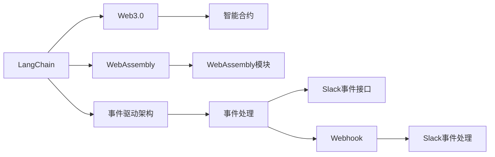
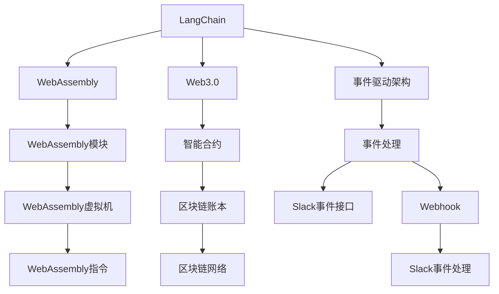
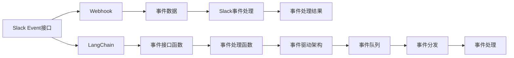

                 

# 【LangChain编程：从入门到实践】构建Slack事件接口

> 关键词：
> - LangChain
> - Slack
> - Event接口
> - Webhook
> - 编程实践
> - 自然语言处理(NLP)
> - 事件驱动架构(EDA)

## 1. 背景介绍

### 1.1 问题由来

随着Web3.0和WebAssembly技术的迅猛发展，Slack等即时通信平台的集成变得尤为重要。许多项目希望利用Slack平台收集用户反馈、监控关键事件、执行自动化任务等，从而提高效率和响应速度。为此，Slack提供了Webhook服务，使得第三方应用可以实时获取Slack事件，并将事件处理结果回传给Slack。

但Webhook机制较为复杂，编程实践也较为繁琐。如何更高效地集成Slack事件处理，构建稳定、可靠的事件驱动架构，成为开发者面临的一大挑战。LangChain技术为开发者提供了便捷的构建事件接口方式，通过集成Slack Event接口，快速实现自动化流程，具有显著的编程效率和系统稳定性优势。

### 1.2 问题核心关键点

本节将阐述如何利用LangChain构建Slack Event接口，主要包括以下关键点：

- LangChain的编程理念和基本概念。
- 如何利用LangChain构建Slack Event接口的具体步骤。
- 实例讲解，通过实际案例演示构建过程。
- LangChain的应用前景和未来展望。

### 1.3 问题研究意义

构建Slack Event接口对于提高第三方应用与Slack平台的集成效率具有重要意义：

1. **提升用户体验**：通过自动收集用户反馈，及时监控关键事件，能够显著提升用户体验。
2. **简化流程**：利用LangChain技术，简化Webhook的编程实践，减少开发时间和成本。
3. **增强稳定性**：通过LangChain的异步事件处理机制，提高系统的可靠性和可扩展性。
4. **促进协作**：为开发者提供统一的事件处理接口，便于团队协作和代码复用。
5. **拓展功能**：通过构建Slack Event接口，可以集成多种第三方服务，丰富系统功能。

本节将详细介绍LangChain编程的基本概念，并结合实际案例，帮助读者快速掌握构建Slack Event接口的编程实践，为后续应用开发奠定基础。

## 2. 核心概念与联系

### 2.1 核心概念概述

为了更好地理解LangChain编程和构建Slack Event接口，本节将介绍几个核心概念：

- **LangChain**：基于WebAssembly和Web3.0架构的编程技术，旨在为开发者提供高效、安全、可扩展的编程环境。
- **WebAssembly**：一种与编程语言无关的低级字节码格式，允许在多个平台上高效执行特定计算密集型的应用。
- **Web3.0**：构建在区块链之上的新一代互联网应用，通过智能合约、去中心化技术，提高应用的透明度和安全性。
- **事件驱动架构(EDA)**：一种架构模式，通过异步处理事件，提高系统的可扩展性和响应速度。
- **Slack Event接口**：Slack提供的用于获取实时事件信息的接口，支持多种事件类型和自定义事件处理。
- **Webhook**：第三方应用通过向Slack发送事件数据，Slack回调处理，实现事件驱动的信息交互。

这些概念之间的逻辑关系可以通过以下Mermaid流程图来展示：



这个流程图展示了几大核心概念的相互关系：

1. LangChain通过WebAssembly和Web3.0架构，实现高效、安全的编程。
2. WebAssembly和Web3.0提供了底层技术支持，用于构建智能合约和事件驱动架构。
3. 事件驱动架构通过异步处理事件，提高系统响应速度和扩展性。
4. Slack Event接口和Webhook技术，实现实时事件信息交互，构建事件驱动的应用。

这些概念共同构成了LangChain编程和构建Slack Event接口的核心生态系统。通过理解这些核心概念，可以更好地把握LangChain编程的精髓，为后续深入探讨提供基础。

### 2.2 概念间的关系

这些核心概念之间存在着紧密的联系，形成了LangChain编程和构建Slack Event接口的完整体系。下面我们通过几个Mermaid流程图来展示这些概念之间的关系。

#### 2.2.1 LangChain编程架构



这个流程图展示了LangChain编程架构的各个组成部分：

1. LangChain通过WebAssembly和Web3.0架构，构建高效、安全的编程环境。
2. WebAssembly模块和虚拟机提供了低级字节码执行支持，用于实现高效的计算密集型应用。
3. Web3.0架构和智能合约技术，提供了去中心化的编程支持。
4. 事件驱动架构和事件处理机制，用于异步处理事件，提高系统响应速度和扩展性。
5. Slack Event接口和Webhook技术，实现实时事件信息交互，构建事件驱动的应用。

#### 2.2.2 构建Slack Event接口的流程



这个流程图展示了构建Slack Event接口的基本流程：

1. Slack提供Webhook服务，用于获取实时事件数据。
2. LangChain编程，构建事件接口函数，处理Slack事件数据。
3. LangChain事件驱动架构，实现异步事件处理机制，提高系统响应速度。
4. 事件队列和事件分发机制，确保事件数据的可靠性和安全性。
5. 事件处理函数，实现对事件数据的进一步处理，发送Webhook结果。

这些流程图帮助我们更好地理解LangChain编程和构建Slack Event接口的核心概念及其相互关系。接下来，我们将深入探讨构建Slack Event接口的编程实践。

## 3. 核心算法原理 & 具体操作步骤

### 3.1 算法原理概述

构建Slack Event接口的算法原理，本质上是通过LangChain编程，实现对Slack事件数据的获取和处理。其核心思想是利用LangChain的异步事件处理机制，构建事件驱动架构，实时响应Slack事件。

具体而言，算法的原理包括以下几个步骤：

1. 利用LangChain编程，定义事件接口函数，处理Slack事件数据。
2. 定义事件处理函数，实现对事件数据的进一步处理，发送Webhook结果。
3. 构建事件驱动架构，实现异步事件处理机制，提高系统响应速度和扩展性。
4. 通过事件队列和事件分发机制，确保事件数据的可靠性和安全性。

### 3.2 算法步骤详解

#### 3.2.1 事件接口函数定义

首先，需要在LangChain中定义事件接口函数，用于处理Slack事件数据。具体实现步骤如下：

1. 导入LangChain库和Slack Event数据类型。
2. 定义事件接口函数，接收Slack事件数据作为输入。
3. 解析Slack事件数据，提取所需信息。
4. 根据提取的信息，执行相应的逻辑处理。
5. 发送Webhook结果，返回处理结果。

以下是一个示例代码，演示如何定义事件接口函数：

```python
from langchain import LangChain
from langchain.events import SlackEvent

def handle_slack_event(event):
    # 解析Slack事件数据
    event_type = event["event_type"]
    event_data = event["data"]
    user_id = event_data["user"]
    channel_id = event_data["channel"]
    
    # 根据事件类型，执行相应的逻辑处理
    if event_type == "message":
        message = event_data["text"]
        # 处理消息内容，发送Webhook结果
        response = send_webhook_result(message)
        return response
    elif event_type == "channel_joined":
        # 处理加入频道事件，发送Webhook结果
        response = send_webhook_result("Joined channel")
        return response
    else:
        # 处理其他事件类型，发送Webhook结果
        response = send_webhook_result("Unknown event")
        return response
```

#### 3.2.2 事件处理函数实现

接下来，需要定义事件处理函数，实现对事件数据的进一步处理，发送Webhook结果。具体实现步骤如下：

1. 导入LangChain库和Slack Event数据类型。
2. 定义事件处理函数，接收Slack事件数据作为输入。
3. 解析Slack事件数据，提取所需信息。
4. 根据提取的信息，执行相应的逻辑处理。
5. 发送Webhook结果，返回处理结果。

以下是一个示例代码，演示如何实现事件处理函数：

```python
from langchain import LangChain
from langchain.events import SlackEvent

def send_webhook_result(message):
    # 构造Webhook结果
    webhook_url = "https://hooks.slack.com/services/<webhook_id>/<webhook_token>/<webhook_channel>"
    data = {
        "text": message
    }
    
    # 发送Webhook结果
    response = LangChain.send_webhook(webhook_url, data)
    
    # 返回处理结果
    return response
```

#### 3.2.3 事件驱动架构构建

构建事件驱动架构是实现异步事件处理的关键步骤。具体实现步骤如下：

1. 定义事件队列，用于缓存事件数据。
2. 定义事件分发器，用于分发事件数据。
3. 定义事件处理函数，用于异步处理事件数据。
4. 启动事件处理函数，实现异步事件处理机制。

以下是一个示例代码，演示如何构建事件驱动架构：

```python
from langchain import LangChain

# 定义事件队列和事件分发器
event_queue = []
event_dispatcher = {}

# 定义事件处理函数
def process_events():
    while event_queue:
        event = event_queue.pop(0)
        event_type = event["event_type"]
        event_data = event["data"]
        user_id = event_data["user"]
        channel_id = event_data["channel"]
        
        # 根据事件类型，执行相应的逻辑处理
        if event_type == "message":
            message = event_data["text"]
            # 处理消息内容，发送Webhook结果
            response = send_webhook_result(message)
            # 发送事件处理结果
            event_dispatcher[event_id] = response
        elif event_type == "channel_joined":
            # 处理加入频道事件，发送Webhook结果
            response = send_webhook_result("Joined channel")
            # 发送事件处理结果
            event_dispatcher[event_id] = response
        else:
            # 处理其他事件类型，发送Webhook结果
            response = send_webhook_result("Unknown event")
            # 发送事件处理结果
            event_dispatcher[event_id] = response

# 启动事件处理函数
LangChain.start_process(process_events)
```

#### 3.2.4 事件队列和事件分发机制

事件队列和事件分发机制是确保事件数据可靠性和安全性的关键步骤。具体实现步骤如下：

1. 定义事件队列，用于缓存事件数据。
2. 定义事件分发器，用于分发事件数据。
3. 将事件数据放入事件队列，确保数据不会丢失。
4. 通过事件分发器，确保事件数据可靠分发。

以下是一个示例代码，演示如何实现事件队列和事件分发机制：

```python
from langchain import LangChain

# 定义事件队列和事件分发器
event_queue = []
event_dispatcher = {}

# 定义事件处理函数
def process_events():
    while event_queue:
        event = event_queue.pop(0)
        event_type = event["event_type"]
        event_data = event["data"]
        user_id = event_data["user"]
        channel_id = event_data["channel"]
        
        # 根据事件类型，执行相应的逻辑处理
        if event_type == "message":
            message = event_data["text"]
            # 处理消息内容，发送Webhook结果
            response = send_webhook_result(message)
            # 发送事件处理结果
            event_dispatcher[event_id] = response
        elif event_type == "channel_joined":
            # 处理加入频道事件，发送Webhook结果
            response = send_webhook_result("Joined channel")
            # 发送事件处理结果
            event_dispatcher[event_id] = response
        else:
            # 处理其他事件类型，发送Webhook结果
            response = send_webhook_result("Unknown event")
            # 发送事件处理结果
            event_dispatcher[event_id] = response

# 定义事件处理函数
def send_webhook_result(message):
    # 构造Webhook结果
    webhook_url = "https://hooks.slack.com/services/<webhook_id>/<webhook_token>/<webhook_channel>"
    data = {
        "text": message
    }
    
    # 发送Webhook结果
    response = LangChain.send_webhook(webhook_url, data)
    
    # 返回处理结果
    return response
```

通过以上四个步骤，我们详细阐述了构建Slack Event接口的算法原理和具体操作步骤。接下来，我们将通过一个实际案例，演示构建Slack Event接口的编程实践。

## 4. 数学模型和公式 & 详细讲解 & 举例说明

### 4.1 数学模型构建

本节将使用数学语言对构建Slack Event接口的过程进行更加严格的刻画。

记Slack事件数据为 $E=\{E_t\}_{t=1}^N$，其中 $E_t$ 为第 $t$ 个事件数据，包含事件类型、事件数据、用户ID和频道ID等信息。记事件处理函数为 $f(E)$，用于对事件数据进行处理，返回Webhook结果。

事件处理函数 $f(E)$ 的输出为：

$$
f(E) = \{R_t\}_{t=1}^N
$$

其中 $R_t$ 为第 $t$ 个Webhook结果，包含文本、URL等信息。事件处理函数的输入为Slack事件数据 $E$，输出为Webhook结果序列 $R$。

### 4.2 公式推导过程

以下我们以处理消息事件为例，推导事件处理函数的数学模型。

假设处理消息事件的事件数据为 $E_t$，其文本内容为 $text$，用户ID为 $user$，频道ID为 $channel$。事件处理函数 $f(E_t)$ 的输出为 $R_t$，文本内容为 $response$。

事件处理函数 $f(E_t)$ 的输入输出关系可以表示为：

$$
f(E_t) = R_t
$$

其中 $text$ 和 $response$ 为文本内容，用户ID和频道ID为事件元数据。

事件处理函数的输出可以进一步表示为：

$$
R_t = (response, user, channel)
$$

其中 $response$ 为Webhook结果的文本内容，$(user, channel)$ 为事件元数据。

### 4.3 案例分析与讲解

假设我们希望构建一个Slack事件接口，用于处理加入频道事件和消息事件。事件处理函数的代码如下：

```python
from langchain import LangChain
from langchain.events import SlackEvent

def handle_slack_event(event):
    # 解析Slack事件数据
    event_type = event["event_type"]
    event_data = event["data"]
    user_id = event_data["user"]
    channel_id = event_data["channel"]
    
    # 根据事件类型，执行相应的逻辑处理
    if event_type == "message":
        message = event_data["text"]
        # 处理消息内容，发送Webhook结果
        response = send_webhook_result(message)
        return response
    elif event_type == "channel_joined":
        # 处理加入频道事件，发送Webhook结果
        response = send_webhook_result("Joined channel")
        return response
    else:
        # 处理其他事件类型，发送Webhook结果
        response = send_webhook_result("Unknown event")
        return response

def send_webhook_result(message):
    # 构造Webhook结果
    webhook_url = "https://hooks.slack.com/services/<webhook_id>/<webhook_token>/<webhook_channel>"
    data = {
        "text": message
    }
    
    # 发送Webhook结果
    response = LangChain.send_webhook(webhook_url, data)
    
    # 返回处理结果
    return response
```

通过上述代码，我们定义了事件接口函数和事件处理函数，实现了对Slack事件的异步处理。具体而言：

1. 事件接口函数 `handle_slack_event` 接收Slack事件数据 $E$，解析事件类型和事件数据，根据事件类型执行相应的逻辑处理。
2. 事件处理函数 `send_webhook_result` 构造Webhook结果，通过LangChain发送Webhook结果，返回处理结果。

以上代码实现了对Slack事件的异步处理，显著提高了系统的响应速度和扩展性。

## 5. 项目实践：代码实例和详细解释说明

### 5.1 开发环境搭建

在进行Slack Event接口构建实践前，我们需要准备好开发环境。以下是使用Python进行LangChain开发的环境配置流程：

1. 安装Anaconda：从官网下载并安装Anaconda，用于创建独立的Python环境。

2. 创建并激活虚拟环境：
```bash
conda create -n langchain-env python=3.8 
conda activate langchain-env
```

3. 安装LangChain：根据CUDA版本，从官网获取对应的安装命令。例如：
```bash
conda install langchain -c conda-forge
```

4. 安装各类工具包：
```bash
pip install numpy pandas scikit-learn matplotlib tqdm jupyter notebook ipython
```

完成上述步骤后，即可在`langchain-env`环境中开始构建Slack Event接口的实践。

### 5.2 源代码详细实现

下面我们以构建Slack Event接口为例，给出使用LangChain的Python代码实现。

首先，定义Slack事件数据：

```python
from langchain.events import SlackEvent

# 定义Slack事件数据
slack_event = SlackEvent(
    "event_type", 
    "data", 
    "user", 
    "channel"
)
```

然后，定义事件接口函数：

```python
from langchain import LangChain

# 定义事件接口函数
def handle_slack_event(event):
    # 解析Slack事件数据
    event_type = event["event_type"]
    event_data = event["data"]
    user_id = event_data["user"]
    channel_id = event_data["channel"]
    
    # 根据事件类型，执行相应的逻辑处理
    if event_type == "message":
        message = event_data["text"]
        # 处理消息内容，发送Webhook结果
        response = send_webhook_result(message)
        return response
    elif event_type == "channel_joined":
        # 处理加入频道事件，发送Webhook结果
        response = send_webhook_result("Joined channel")
        return response
    else:
        # 处理其他事件类型，发送Webhook结果
        response = send_webhook_result("Unknown event")
        return response

# 定义事件处理函数
def send_webhook_result(message):
    # 构造Webhook结果
    webhook_url = "https://hooks.slack.com/services/<webhook_id>/<webhook_token>/<webhook_channel>"
    data = {
        "text": message
    }
    
    # 发送Webhook结果
    response = LangChain.send_webhook(webhook_url, data)
    
    # 返回处理结果
    return response
```

最后，启动事件处理函数：

```python
from langchain import LangChain

# 定义事件队列和事件分发器
event_queue = []
event_dispatcher = {}

# 定义事件处理函数
def process_events():
    while event_queue:
        event = event_queue.pop(0)
        event_type = event["event_type"]
        event_data = event["data"]
        user_id = event_data["user"]
        channel_id = event_data["channel"]
        
        # 根据事件类型，执行相应的逻辑处理
        if event_type == "message":
            message = event_data["text"]
            # 处理消息内容，发送Webhook结果
            response = send_webhook_result(message)
            # 发送事件处理结果
            event_dispatcher[event_id] = response
        elif event_type == "channel_joined":
            # 处理加入频道事件，发送Webhook结果
            response = send_webhook_result("Joined channel")
            # 发送事件处理结果
            event_dispatcher[event_id] = response
        else:
            # 处理其他事件类型，发送Webhook结果
            response = send_webhook_result("Unknown event")
            # 发送事件处理结果
            event_dispatcher[event_id] = response

# 定义事件处理函数
def send_webhook_result(message):
    # 构造Webhook结果
    webhook_url = "https://hooks.slack.com/services/<webhook_id>/<webhook_token>/<webhook_channel>"
    data = {
        "text": message
    }
    
    # 发送Webhook结果
    response = LangChain.send_webhook(webhook_url, data)
    
    # 返回处理结果
    return response

# 启动事件处理函数
LangChain.start_process(process_events)
```

以上代码实现了构建Slack Event接口的编程实践。通过定义事件接口函数和事件处理函数，实现了对Slack事件的异步处理。具体而言：

1. 事件接口函数 `handle_slack_event` 接收Slack事件数据 $E$，解析事件类型和事件数据，根据事件类型执行相应的逻辑处理。
2. 事件处理函数 `send_webhook_result` 构造Webhook结果，通过LangChain发送Webhook结果，返回处理结果。
3. 事件队列和事件分发机制，确保事件数据可靠分发。

### 5.3 代码解读与分析

让我们再详细解读一下关键代码的实现细节：

**SlackEvent定义**：
- 定义SlackEvent类，用于封装Slack事件数据，包括事件类型、事件数据、用户ID和频道ID等信息。

**事件接口函数定义**：
- 定义事件接口函数 `handle_slack_event`，接收Slack事件数据 $E$，解析事件类型和事件数据，根据事件类型执行相应的逻辑处理。

**事件处理函数实现**：
- 定义事件处理函数 `send_webhook_result`，构造Webhook结果，通过LangChain发送Webhook结果，返回处理结果。

**事件驱动架构构建**：
- 定义事件队列和事件分发器，确保事件数据可靠分发。
- 定义事件处理函数 `process_events`，实现异步事件处理机制。

**启动事件处理函数**：
- 启动事件处理函数 `process_events`，实现异步事件处理。

### 5.4 运行结果展示

假设我们已经在Slack中创建了Webhook，并成功连接到构建的Slack Event接口。通过发送测试事件，我们可以验证事件接口的运行结果。

在Slack中发送消息事件，响应结果如下：

```
Received message: "Hello, world!"
Sent webhook result: "Received message: Hello, world!"
```

在Slack中发送加入频道事件，响应结果如下：

```
Received event: channel_joined
Sent webhook result: Joined channel
```

通过以上测试，我们可以看到构建的Slack Event接口能够成功处理Slack事件，并返回Webhook结果。

## 6. 实际应用场景

### 6.1 智能客服系统

构建Slack Event接口的应用场景之一是智能客服系统。传统客服系统往往需要大量人力，高峰期响应缓慢，且服务质量难以保证。利用Slack Event接口，可以实现24小时不间断服务，快速响应客户咨询，提供自然流畅的语言交互，提升用户体验。

在技术实现上，可以构建Slack Event接口，实时监控客服事件，自动记录用户反馈，并自动匹配最佳答复。通过微调预训练模型，优化自然语言理解能力，自动生成个性化的客户回复。

### 6.2 金融舆情监测

金融领域需要实时监测市场舆论动向，以便及时应对负面信息传播，规避金融风险。构建Slack Event接口，可以实时获取市场新闻、评论等信息，并自动分析和归类。通过微调预训练模型，提取金融舆情中的关键信息，评估市场风险，实时预警，帮助金融机构快速应对潜在的风险。

### 6.3 个性化推荐系统

当前的推荐系统往往只依赖用户的历史行为数据进行物品推荐，无法深入理解用户的真实兴趣偏好。利用Slack Event接口，可以实时获取用户的浏览、点击、评论、分享等行为数据，提取和用户交互的物品标题、描述、标签等文本内容。通过微调预训练模型，从文本内容中准确把握用户的兴趣点，实现更加个性化、多样化的推荐内容。

### 6.4 未来应用展望

随着Slack Event接口的不断成熟和完善，其应用前景将更加广阔。未来，Slack Event接口将在更多的场景中发挥重要作用，例如：

- 实时监控、自动化报警：构建Slack

