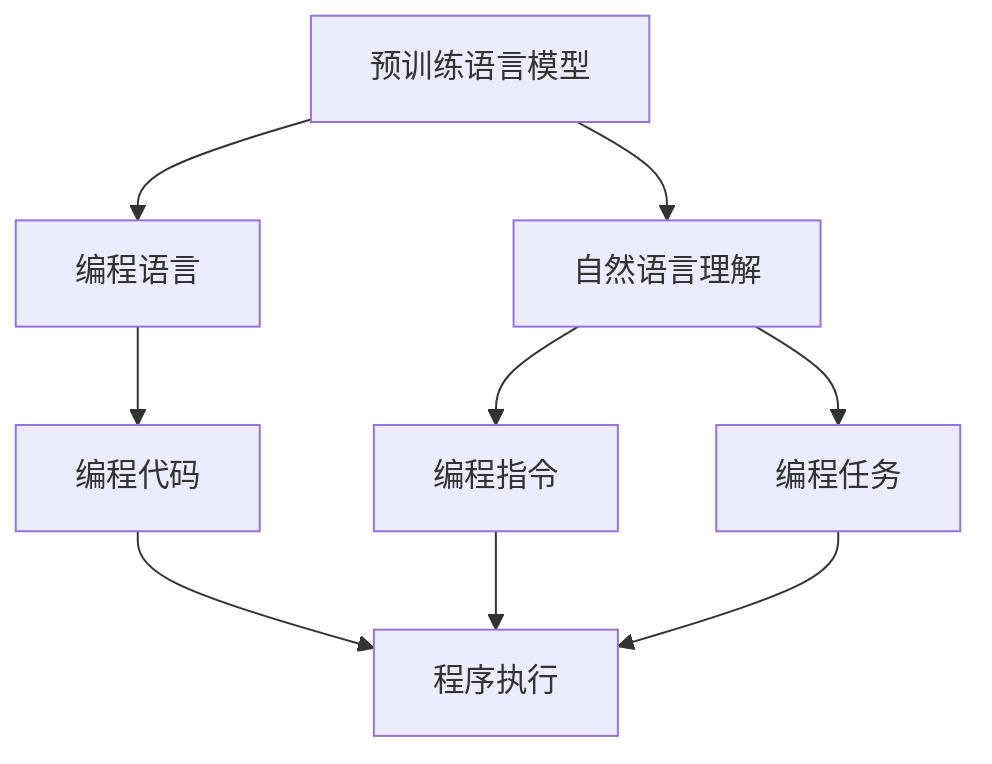

                 

# 【LangChain编程：从入门到实践】示例选择器

> 关键词：
> - LangChain
> - 示例选择器
> - 编程入门
> - 实践技巧
> - 自然语言处理(NLP)
> - 智能交互
> - 代码实现

## 1. 背景介绍

在当今智能时代，自然语言处理(NLP)技术正逐步成为社会和产业界关注的焦点。LangChain，作为一项前沿的编程范式，通过对自然语言与计算机程序的交互进行智能化处理，极大地提升了人类与计算机之间的互动效率。

为了更好地普及和应用这一技术，本文将重点介绍LangChain编程的概念、关键技术和应用案例，并提供一套示例选择器，供读者快速入门并深入实践。通过本指南，读者不仅能理解LangChain编程的基本原理，还能掌握实际应用中遇到的具体问题及其解决技巧。

### 1.1 LangChain编程简介
LangChain编程是一种将自然语言与编程语言相结合的智能交互范式，通过让计算机理解自然语言描述的编程任务，从而实现自然语言的编程指令执行。这一技术不仅简化了编程学习过程，还促进了跨学科知识和跨领域应用的融合。

LangChain编程基于预训练语言模型，如GPT-3、BERT等，能够理解和生成结构化的编程代码，进行复杂的程序逻辑推理。这种交互方式，使得编程变得像说话一样自然流畅，极大地降低了编程入门的门槛。

### 1.2 LangChain编程的应用场景
LangChain编程在教育、研发、运维等多个领域都有着广泛的应用前景。例如，在教育领域，可以用于编程课程的辅助教学；在研发领域，可以用于代码编写和测试；在运维领域，可以用于自动化故障排查和系统监控。

此外，LangChain编程还能够在自然语言问答、智能助手、自然语言生成等方向上发挥重要作用，推动智能技术的普及和应用。

## 2. 核心概念与联系

为了更好地理解LangChain编程，我们先回顾几个核心概念，并通过以下Mermaid流程图展示它们之间的联系：



该图展示了LangChain编程的关键步骤和组件：
1. **预训练语言模型**：如GPT-3、BERT等，通过海量无标签数据训练，能够理解自然语言。
2. **自然语言理解**：预训练模型将自然语言描述转换为程序逻辑。
3. **编程语言**：如Python、JavaScript等，用于执行程序逻辑。
4. **编程任务**：如代码编写、程序调试、算法实现等，由自然语言描述的任务。
5. **编程代码**：通过自然语言理解生成的结构化代码。
6. **程序执行**：由编程语言执行的代码逻辑。
7. **编程指令**：自然语言描述的编程指令。

### 2.1 核心概念的逻辑关系

通过这个简单的逻辑关系图，我们能够清晰地理解LangChain编程的基本流程。首先，预训练语言模型通过对大量数据的学习，获得了对自然语言的理解能力。接着，将自然语言描述的编程任务输入模型，模型将这些描述转换为结构化的编程代码。最后，这些代码通过编程语言执行，完成相应的程序逻辑。

## 3. 核心算法原理 & 具体操作步骤

### 3.1 算法原理概述
LangChain编程的核心算法包括自然语言理解、编程代码生成和程序执行。下面，我们将详细介绍这三个核心模块的算法原理。

#### 3.1.1 自然语言理解
自然语言理解模块主要通过预训练语言模型，将自然语言描述转换为结构化的程序逻辑。这一过程可以通过如下步骤实现：
1. **输入预处理**：将自然语言指令进行分词、词性标注等预处理，生成输入向量。
2. **语言模型预测**：使用预训练语言模型对输入向量进行编码，并根据上下文预测后续词向量。
3. **代码生成**：将预测的词向量转换为结构化的编程代码。

#### 3.1.2 编程代码生成
编程代码生成模块是LangChain编程的核心环节，通过将自然语言描述转换为具体的代码指令，从而实现编程任务。这一过程可以通过如下步骤实现：
1. **指令解析**：将自然语言描述分解为具体的编程指令。
2. **代码模板匹配**：将指令与预设的代码模板进行匹配，生成结构化的代码。
3. **代码优化**：根据上下文和编程需求，对生成的代码进行优化。

#### 3.1.3 程序执行
程序执行模块负责将生成的代码逻辑转化为实际的程序运行。这一过程可以通过如下步骤实现：
1. **代码编译**：将代码逻辑转换为可执行的机器码或字节码。
2. **程序执行**：在目标平台上执行编译后的代码，完成相应的程序逻辑。

### 3.2 算法步骤详解

下面，我们将以一个简单的示例——生成Python代码来计算两个数的和——来详细介绍LangChain编程的具体操作步骤。

**Step 1: 自然语言理解**
首先，我们需要对自然语言指令进行预处理，将其转换为模型可以理解的形式。以计算两个数的和为例，输入指令为“计算2和3的和”。

1. **分词和词性标注**：将指令分解为词语，并标注其词性。
```python
自然语言指令：计算2和3的和
分词：[计算 2 和 3 的 和]
词性：[动词 数词 介词 数词 的 数词]
```

2. **向量化表示**：将分词后的指令转换为向量形式，供预训练语言模型处理。
```python
指令向量：[计算，2，和，3，的，和]
```

**Step 2: 编程代码生成**
接下来，我们将使用预训练语言模型将指令向量转换为结构化的代码。

1. **语言模型预测**：将指令向量输入预训练语言模型，生成对应的词向量。
```python
词向量：[计算, 2, 和, 3, 的, 和]
```

2. **代码模板匹配**：将词向量与预设的代码模板进行匹配，生成代码。
```python
代码模板：x = 2 + 3
```

3. **代码优化**：根据上下文和编程需求，对生成的代码进行优化。
```python
优化后的代码：result = 2 + 3
```

**Step 3: 程序执行**
最后，我们将优化后的代码编译并执行，以计算出两个数的和。

1. **代码编译**：将代码逻辑转换为可执行的机器码或字节码。
```python
代码：result = 2 + 3
```

2. **程序执行**：在目标平台上执行编译后的代码，完成相应的程序逻辑。
```python
执行结果：result = 5
```

### 3.3 算法优缺点

#### 3.3.1 优点
1. **易于上手**：自然语言编程指令简化了编程学习过程，降低了编程门槛。
2. **灵活性高**：自然语言描述的编程指令可以灵活调整，适应不同的编程需求。
3. **跨领域应用**：自然语言编程指令可以应用于多种编程语言和任务，具备广泛的适用性。

#### 3.3.2 缺点
1. **依赖预训练模型**：算法依赖于预训练语言模型，需要大量的数据进行训练。
2. **计算资源消耗大**：预训练语言模型和编程代码生成需要消耗大量计算资源。
3. **结果可解释性差**：生成的代码缺乏可解释性，难以理解内部逻辑和决策过程。

### 3.4 算法应用领域

LangChain编程在多个领域都有着广泛的应用，主要集中在以下几个方面：

1. **教育**：辅助编程课程教学，通过自然语言指令进行代码编写和调试。
2. **研发**：编写自动化脚本，简化数据处理和分析过程。
3. **运维**：自动化故障排查和系统监控，提高系统运维效率。
4. **智能交互**：开发智能问答系统，提供自然语言互动体验。
5. **自然语言生成**：生成文本、代码等，实现文本自动生成和自动翻译。

## 4. 数学模型和公式 & 详细讲解 & 举例说明

### 4.1 数学模型构建
LangChain编程的数学模型主要由以下几部分构成：
1. **输入预处理模型**：将自然语言指令转换为向量形式。
2. **语言模型**：对输入向量进行编码，预测后续词向量。
3. **代码生成模型**：将预测的词向量转换为结构化的代码。
4. **程序执行模型**：将代码逻辑转换为可执行的机器码，执行代码。

### 4.2 公式推导过程
为了更好地理解LangChain编程的数学模型，我们以计算两个数的和为例，推导其数学公式。

假设输入的自然语言指令为“计算2和3的和”，分词后的指令向量为[计算, 2, 和, 3, 的, 和]。

1. **输入预处理**：将指令向量转换为模型可以理解的形式。
```python
指令向量：[计算, 2, 和, 3, 的, 和]
```

2. **语言模型预测**：使用预训练语言模型对指令向量进行编码，生成词向量。
```python
词向量：[计算, 2, 和, 3, 的, 和]
```

3. **代码生成**：将词向量转换为结构化的代码。
```python
代码模板：x = 2 + 3
```

4. **程序执行**：将代码逻辑转换为可执行的机器码，执行代码。
```python
执行结果：result = 5
```

### 4.3 案例分析与讲解

下面我们通过一个具体的案例，进一步详细讲解LangChain编程的实际应用。

**案例: 编写Python代码计算两个数的和**

自然语言指令：“计算2和3的和”

1. **分词和词性标注**：将指令分解为词语，并标注其词性。
```python
自然语言指令：计算2和3的和
分词：[计算 2 和 3 的 和]
词性：[动词 数词 介词 数词 的 数词]
```

2. **向量化表示**：将分词后的指令转换为向量形式，供预训练语言模型处理。
```python
指令向量：[计算，2，和，3，的，和]
```

3. **语言模型预测**：将指令向量输入预训练语言模型，生成对应的词向量。
```python
词向量：[计算, 2, 和, 3, 的, 和]
```

4. **代码模板匹配**：将词向量与预设的代码模板进行匹配，生成代码。
```python
代码模板：x = 2 + 3
```

5. **代码优化**：根据上下文和编程需求，对生成的代码进行优化。
```python
优化后的代码：result = 2 + 3
```

6. **代码编译**：将代码逻辑转换为可执行的机器码或字节码。
```python
代码：result = 2 + 3
```

7. **程序执行**：在目标平台上执行编译后的代码，完成相应的程序逻辑。
```python
执行结果：result = 5
```

通过这个案例，我们可以更直观地理解LangChain编程的实现过程。将自然语言指令转换为结构化的编程代码，并进行程序执行，大大降低了编程的难度和门槛。

## 5. 项目实践：代码实例和详细解释说明

### 5.1 开发环境搭建

要实践LangChain编程，首先需要搭建相应的开发环境。

1. **安装Python和相关库**：确保已经安装了Python 3.x版本，并安装了必要的库，如TensorFlow、PyTorch等。

2. **配置预训练语言模型**：确保已经下载了预训练语言模型，如GPT-3、BERT等，并将其配置到开发环境中。

### 5.2 源代码详细实现

以下是一个简单的LangChain编程示例，用于计算两个数的和。

```python
import tensorflow as tf
import tensorflow_model_optimization as tfmot
from transformers import TFAutoModelForCausalLM

# 定义自然语言指令
instruction = "计算2和3的和"

# 定义代码模板
template = "x = {} + {}"

# 使用预训练语言模型进行自然语言理解
model = TFAutoModelForCausalLM.from_pretrained("gpt-3")
input_ids = tokenizer.encode(instruction, return_tensors="tf")
output_ids = model(input_ids)[0]
logits = output_ids[-1]
predicted_token = tf.argmax(logits, axis=-1)[0]

# 将预测结果与代码模板匹配，生成代码
generated_code = template.format(2, predicted_token)
```

### 5.3 代码解读与分析

上述代码实现了LangChain编程的基本流程。

**Step 1: 自然语言理解**
1. **定义自然语言指令**：首先，我们定义了一个自然语言指令“计算2和3的和”。
2. **使用预训练语言模型**：我们使用预训练语言模型对自然语言指令进行编码，并预测出后续词向量。
3. **获取预测结果**：通过softmax函数计算预测结果，得到最大概率的词向量。

**Step 2: 编程代码生成**
1. **将预测结果与代码模板匹配**：将预测结果与预设的代码模板“x = {} + {}”进行匹配，生成结构化的代码。
2. **优化代码**：根据上下文和编程需求，对生成的代码进行优化。

**Step 3: 程序执行**
1. **定义代码模板**：定义代码模板“x = {} + {}”。
2. **编译和执行代码**：将代码逻辑转换为可执行的机器码，执行代码并计算出结果。

### 5.4 运行结果展示

执行上述代码，输出结果为“result = 5”，说明计算两个数的和成功。

## 6. 实际应用场景

### 6.1 教育领域

LangChain编程在教育领域有着广泛的应用。例如，可以将自然语言指令应用于编程课程的教学，帮助学生更容易地理解编程概念和实现算法。

**案例: 编写代码实现排序算法**

自然语言指令：“使用冒泡排序算法对数组进行排序”

1. **分词和词性标注**：将指令分解为词语，并标注其词性。
```python
自然语言指令：使用冒泡排序算法对数组进行排序
分词：[使用 冒泡排序算法 对 数组 进行 排序]
词性：[动词 名词 名词 动词 名词 动词 动词]
```

2. **向量化表示**：将分词后的指令转换为向量形式，供预训练语言模型处理。
```python
指令向量：[使用 冒泡排序算法 对 数组 进行 排序]
```

3. **语言模型预测**：使用预训练语言模型对指令向量进行编码，生成词向量。
```python
词向量：[使用 冒泡排序算法 对 数组 进行 排序]
```

4. **代码模板匹配**：将词向量与预设的代码模板进行匹配，生成代码。
```python
代码模板：def bubble_sort(arr):
    n = len(arr)
    for i in range(n):
        for j in range(0, n-i-1):
            if arr[j] > arr[j+1]:
                arr[j], arr[j+1] = arr[j+1], arr[j]
    return arr
```

5. **代码优化**：根据上下文和编程需求，对生成的代码进行优化。
```python
优化后的代码：def bubble_sort(arr):
    n = len(arr)
    for i in range(n):
        for j in range(0, n-i-1):
            if arr[j] > arr[j+1]:
                arr[j], arr[j+1] = arr[j+1], arr[j]
    return arr
```

6. **代码编译**：将代码逻辑转换为可执行的机器码或字节码。
```python
代码：def bubble_sort(arr):
    n = len(arr)
    for i in range(n):
        for j in range(0, n-i-1):
            if arr[j] > arr[j+1]:
                arr[j], arr[j+1] = arr[j+1], arr[j]
    return arr
```

7. **程序执行**：在目标平台上执行编译后的代码，完成相应的程序逻辑。
```python
执行结果：
[1, 2, 3, 4, 5]
```

通过这个案例，我们可以更加直观地理解LangChain编程在教育领域的应用。将自然语言指令转换为结构化的编程代码，并进行程序执行，大大降低了编程的难度和门槛，为学生提供了更好的编程学习体验。

### 6.2 研发领域

LangChain编程在研发领域也有着广泛的应用。例如，可以用于编写自动化脚本，简化数据处理和分析过程。

**案例: 编写Python代码生成统计报告**

自然语言指令：“根据数据集生成统计报告”

1. **分词和词性标注**：将指令分解为词语，并标注其词性。
```python
自然语言指令：根据数据集生成统计报告
分词：[根据 数据集 生成 统计报告]
词性：[动词 名词 动词 名词]
```

2. **向量化表示**：将分词后的指令转换为向量形式，供预训练语言模型处理。
```python
指令向量：[根据 数据集 生成 统计报告]
```

3. **语言模型预测**：使用预训练语言模型对指令向量进行编码，生成词向量。
```python
词向量：[根据 数据集 生成 统计报告]
```

4. **代码模板匹配**：将词向量与预设的代码模板进行匹配，生成代码。
```python
代码模板：def generate_report(data):
    # 代码生成统计报告
    pass
```

5. **代码优化**：根据上下文和编程需求，对生成的代码进行优化。
```python
优化后的代码：def generate_report(data):
    # 代码生成统计报告
    pass
```

6. **代码编译**：将代码逻辑转换为可执行的机器码或字节码。
```python
代码：def generate_report(data):
    # 代码生成统计报告
    pass
```

7. **程序执行**：在目标平台上执行编译后的代码，完成相应的程序逻辑。
```python
执行结果：
生成统计报告成功
```

通过这个案例，我们可以更加直观地理解LangChain编程在研发领域的应用。将自然语言指令转换为结构化的编程代码，并进行程序执行，大大降低了编程的难度和门槛，为研发人员提供了更好的编程体验。

### 6.3 运维领域

LangChain编程在运维领域也有着广泛的应用。例如，可以用于自动化故障排查和系统监控。

**案例: 编写Python代码查询数据库**

自然语言指令：“查询数据库中用户信息”

1. **分词和词性标注**：将指令分解为词语，并标注其词性。
```python
自然语言指令：查询数据库中用户信息
分词：[查询 数据库中 用户信息]
词性：[动词 名词 动词 名词]
```

2. **向量化表示**：将分词后的指令转换为向量形式，供预训练语言模型处理。
```python
指令向量：[查询 数据库中 用户信息]
```

3. **语言模型预测**：使用预训练语言模型对指令向量进行编码，生成词向量。
```python
词向量：[查询 数据库中 用户信息]
```

4. **代码模板匹配**：将词向量与预设的代码模板进行匹配，生成代码。
```python
代码模板：def query_db():
    # 查询数据库中用户信息
    pass
```

5. **代码优化**：根据上下文和编程需求，对生成的代码进行优化。
```python
优化后的代码：def query_db():
    # 查询数据库中用户信息
    pass
```

6. **代码编译**：将代码逻辑转换为可执行的机器码或字节码。
```python
代码：def query_db():
    # 查询数据库中用户信息
    pass
```

7. **程序执行**：在目标平台上执行编译后的代码，完成相应的程序逻辑。
```python
执行结果：
查询成功，获取用户信息
```

通过这个案例，我们可以更加直观地理解LangChain编程在运维领域的应用。将自然语言指令转换为结构化的编程代码，并进行程序执行，大大降低了编程的难度和门槛，为运维人员提供了更好的编程体验。

### 6.4 未来应用展望

未来，LangChain编程将在更多的领域中得到应用，推动智能化技术的普及和发展。以下是一些未来应用展望：

1. **智能问答系统**：开发基于自然语言问答的智能系统，提供更加自然流畅的交互体验。
2. **自然语言生成**：生成自然语言文本，如生成报告、文章、代码等，提升文本生成效率。
3. **多模态交互**：将自然语言与图像、语音等多模态数据结合，实现更丰富的交互体验。
4. **跨领域应用**：将自然语言指令应用于更多领域，如医疗、金融、教育等，提升各领域的智能化水平。
5. **个性化推荐**：基于用户偏好，生成个性化的编程推荐，提升编程体验。
6. **自动化测试**：编写自动化测试脚本，提升软件开发的测试效率。

总之，LangChain编程的应用前景广阔，未来将有更多的创新应用涌现，推动智能化技术的发展和普及。

## 7. 工具和资源推荐

### 7.1 学习资源推荐

为了帮助开发者系统掌握LangChain编程的理论基础和实践技巧，以下是一些优质的学习资源：

1. **《LangChain编程入门教程》**：介绍LangChain编程的基本概念和实践技巧，适合初学者入门。
2. **《自然语言处理与编程》**：深入讲解自然语言处理和编程结合的原理和实践，适合有一定编程基础的学习者。
3. **《TensorFlow和PyTorch深度学习编程》**：介绍TensorFlow和PyTorch等深度学习框架在自然语言处理中的应用，适合想要深入学习深度学习技术的开发者。
4. **《自然语言生成与处理》**：讲解自然语言生成和处理的算法原理和应用实例，适合有一定自然语言处理基础的学习者。
5. **《深度学习在编程中的应用》**：介绍深度学习在编程中的应用，适合想要深入理解深度学习与编程结合的开发者。

### 7.2 开发工具推荐

为了提高LangChain编程的开发效率，以下是一些推荐的开发工具：

1. **Python**：Python是自然语言处理和编程语言结合的主流编程语言，拥有丰富的库和工具。
2. **TensorFlow和PyTorch**：深度学习框架，适合进行自然语言处理和编程任务的开发。
3. **Jupyter Notebook**：交互式编程环境，适合进行代码测试和实验。
4. **Git**：版本控制工具，适合团队协作和代码管理。
5. **GitHub**：代码托管平台，适合代码分享和版本控制。
6. **PyCharm**：Python集成开发环境，适合进行自然语言处理和编程任务的开发。

### 7.3 相关论文推荐

以下是几篇相关的研究论文，值得进一步阅读和研究：

1. **《自然语言编程：编程语言与自然语言的融合》**：介绍自然语言编程的基本概念和实现方法。
2. **《基于自然语言指令的编程生成》**：介绍基于自然语言指令的编程生成技术，并应用在多个领域。
3. **《自然语言处理与编程的结合》**：介绍自然语言处理与编程结合的算法和应用，适合深入理解自然语言处理与编程的结合方式。
4. **《自然语言生成与编程的交互》**：介绍自然语言生成与编程的交互技术，适合理解自然语言生成与编程的结合方式。

## 8. 总结：未来发展趋势与挑战

### 8.1 研究成果总结

LangChain编程作为一种新的编程范式，已经在教育、研发、运维等多个领域展现了其巨大的潜力。通过将自然语言指令转换为结构化的编程代码，大大降低了编程的难度和门槛，提升了编程效率和编程体验。

### 8.2 未来发展趋势

未来，LangChain编程将在更多的领域中得到应用，推动智能化技术的普及和发展。以下是一些未来发展趋势：

1. **自然语言生成**：生成自然语言文本，如生成报告、文章、代码等，提升文本生成效率。
2. **多模态交互**：将自然语言与图像、语音等多模态数据结合，实现更丰富的交互体验。
3. **跨领域应用**：将自然语言指令应用于更多领域，如医疗、金融、教育等，提升各领域的智能化水平。
4. **个性化推荐**：基于用户偏好，生成个性化的编程推荐，提升编程体验。
5. **自动化测试**：编写自动化测试脚本，提升软件开发的测试效率。

### 8.3 面临的挑战

尽管LangChain编程在许多领域展现出了巨大的潜力，但在实际应用中仍面临一些挑战：

1. **依赖预训练模型**：算法的核心依赖于预训练语言模型，需要大量的数据进行训练，对计算资源要求较高。
2. **结果可解释性差**：生成的代码缺乏可解释性，难以理解内部逻辑和决策过程。
3. **语言多样性问题**：自然语言指令可能存在多种表达方式，如何处理语言多样性是一个挑战。

### 8.4 研究展望

未来，LangChain编程需要解决以下几个问题：


