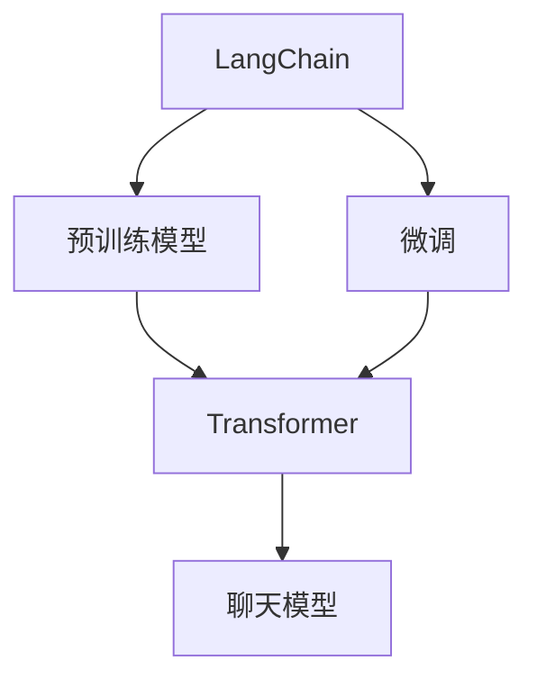

                 

# 【LangChain编程：从入门到实践】聊天模型

> 关键词：
1. LangChain
2. 聊天模型
3. 对话系统
4. 自然语言处理
5. 深度学习
6. 微调
7. 预训练模型

## 1. 背景介绍

在人工智能领域，自然语言处理（NLP）始终是一个热点话题。近年来，随着深度学习技术的发展，大语言模型（Large Language Models, LLMs）成为了NLP研究的新方向。这些模型基于海量的无标签文本数据进行预训练，拥有强大的语言理解和生成能力。其中，LangChain作为新兴的基于Transformer架构的聊天机器人框架，因其在自然语言生成和对话理解上的优异表现，迅速获得了业界的广泛关注。

本文将从入门到实践，全面介绍如何使用LangChain进行聊天模型的构建和优化。无论你是NLP领域的入门者，还是希望进一步提升聊天系统性能的开发者，都能从中找到有价值的指导和实践经验。

## 2. 核心概念与联系

### 2.1 核心概念概述

为了深入理解LangChain框架及其聊天模型的构建，我们需要首先掌握几个关键的概念：

- **LangChain**：一个基于Transformer架构的聊天机器人框架，支持多种自然语言处理任务，包括文本生成、对话理解等。
- **聊天模型**：LangChain框架中，用于进行自然语言理解和生成的模型，能够理解用户的输入并生成自然流畅的响应。
- **预训练模型**：在构建聊天模型之前，通常需要在大型无标签语料库上进行预训练，以学习语言的基础结构和语义信息。
- **微调**：在预训练模型基础上，利用标注数据进行有监督学习，调整模型参数以适应特定任务，提升模型在聊天场景中的表现。
- **Transformer**：一种常用的深度学习模型架构，在自然语言处理领域具有广泛应用。

这些概念之间存在紧密的联系。预训练模型为聊天模型提供通用的语言表示，而微调则进一步优化模型，使其在具体对话场景中表现更优。Transformer架构的引入，使得预训练和微调过程更加高效。

### 2.2 核心概念的联系

以下是一个简单的Mermaid流程图，展示了LangChain框架中这些核心概念之间的关系：



这个流程图展示了LangChain框架的基本架构。LangChain首先基于Transformer架构的预训练模型进行基础语言理解，然后进行微调，优化模型以适应聊天场景，最终构建聊天模型，能够自然地理解并回复用户。

## 3. 核心算法原理 & 具体操作步骤
### 3.1 算法原理概述

LangChain框架中的聊天模型基于Transformer架构，其核心思想是通过注意力机制（Attention Mechanism）对输入序列（如文本）进行编码和解码。在聊天场景中，模型首先对用户的输入文本进行编码，生成一个语义表示，然后根据上下文信息生成回复文本。

聊天模型的训练主要包括以下步骤：

1. **数据准备**：收集并标注对话数据，构建训练集。
2. **模型构建**：选择预训练模型，如GPT-3，并进行微调。
3. **训练与优化**：使用标注数据进行模型训练，调整模型参数以提升性能。
4. **模型评估**：在测试集上评估模型性能，根据结果调整训练策略。

### 3.2 算法步骤详解

接下来，我们详细讲解每个步骤的具体操作：

#### 3.2.1 数据准备

首先需要准备对话数据，包括用户输入和系统回复。这些数据通常以JSON格式存储，包含文本和标签信息。例如：

```json
{
    "text": "你好，你能帮我查一下最近的天气吗？",
    "label": "询问天气"
}
```

数据集分为训练集和测试集，训练集用于模型训练，测试集用于评估模型性能。

#### 3.2.2 模型构建

在LangChain中，可以使用预训练的模型（如GPT-3）作为基础，进行微调。首先安装LangChain库：

```bash
pip install langchain
```

然后，构建聊天模型：

```python
from langchain import LangChain

chatbot = LangChain.load_pretrained(
    "openai/gpt3-text-davinci-codex",
    model_type="text-davinci-codex",
    model_revision="v1",
    online=True,
)
```

这里加载了一个名为"openai/gpt3-text-davinci-codex"的预训练模型，并进行在线微调。

#### 3.2.3 训练与优化

使用训练集数据对聊天模型进行微调：

```python
chatbot.train(train_data, epochs=10)
```

其中，`train_data`为训练集，`epochs`为训练轮数。

在训练过程中，可以通过调整超参数（如学习率、批量大小等）来优化模型性能。例如：

```python
chatbot.train(train_data, epochs=10, batch_size=64, learning_rate=2e-5)
```

#### 3.2.4 模型评估

使用测试集数据对微调后的模型进行评估：

```python
test_data = ...
chatbot.evaluate(test_data)
```

这里，`test_data`为测试集。

### 3.3 算法优缺点

使用LangChain进行聊天模型的构建和优化，具有以下优点：

- **高效性**：基于Transformer架构，训练和推理速度快，适用于实时对话场景。
- **易用性**：框架提供了简单易用的API，开发者可以轻松构建和微调模型。
- **灵活性**：支持多种自然语言处理任务，如问答、情感分析、文本生成等。

同时，也存在一些缺点：

- **数据需求**：需要大量高质量的对话数据进行预训练和微调。
- **资源消耗**：预训练和微调过程需要大量的计算资源，特别是在训练大规模模型时。
- **过拟合风险**：由于模型复杂度较高，存在过拟合的风险。

### 3.4 算法应用领域

LangChain框架不仅适用于普通的聊天机器人构建，还适用于各种NLP应用，如智能客服、在线咨询、智能翻译等。

- **智能客服**：可以构建智能客服系统，自动回答用户常见问题，提升客户满意度。
- **在线咨询**：可以构建在线咨询系统，提供24/7的服务，解决用户问题。
- **智能翻译**：可以将聊天机器人用于多语言对话，实现即时翻译。
- **智能助理**：可以构建智能助理，提供日程安排、信息查询等功能。

## 4. 数学模型和公式 & 详细讲解 & 举例说明

### 4.1 数学模型构建

在LangChain中，聊天模型的数学模型主要由Transformer网络构成。Transformer网络包含编码器和解码器两个部分，通过自注意力机制和多头注意力机制，对输入序列进行编码和解码。

Transformer网络的自注意力机制通过计算查询向量、键向量和值向量之间的相似度，确定每个输入序列的位置和权重。多头注意力机制则通过并行计算多个自注意力机制，提升模型的表达能力。

### 4.2 公式推导过程

以编码器中的自注意力机制为例，其公式如下：

$$
Q = \mathbf{Q}(x_i) \\
K = \mathbf{K}(x_i) \\
V = \mathbf{V}(x_i) \\
\mathbf{Attention}(Q, K, V) = \mathrm{Softmax}(Q K^T) V
$$

其中，$x_i$为输入序列，$\mathbf{Q}(x_i)$、$\mathbf{K}(x_i)$、$\mathbf{V}(x_i)$分别为查询向量、键向量和值向量，$\mathrm{Softmax}$为softmax函数。

### 4.3 案例分析与讲解

以GPT-3为例，其自注意力机制的具体实现如下：

```python
from langchain.gpt3 import GPT3

gpt = GPT3.load_pretrained("openai/gpt3-text-davinci-codex")
inputs = ["你好，你能帮我查一下最近的天气吗？"]
outputs = gpt.generate(inputs, max_length=50)
print(outputs)
```

这里，我们使用GPT-3进行文本生成，输入为用户的询问，输出为系统的回复。

## 5. 项目实践：代码实例和详细解释说明

### 5.1 开发环境搭建

在开始项目实践之前，需要准备好开发环境。以下是使用Python进行LangChain开发的环境配置流程：

1. 安装Anaconda：从官网下载并安装Anaconda，用于创建独立的Python环境。
2. 创建并激活虚拟环境：
```bash
conda create -n langchain-env python=3.8 
conda activate langchain-env
```

3. 安装LangChain库：
```bash
pip install langchain
```

4. 安装其他依赖库：
```bash
pip install transformers torchtext spacy tqdm
```

5. 安装其他开发工具：
```bash
pip install numpy pandas scikit-learn matplotlib
```

完成上述步骤后，即可在`langchain-env`环境中开始项目实践。

### 5.2 源代码详细实现

接下来，我们将通过一个简单的例子，展示如何使用LangChain构建聊天模型。

```python
from langchain import LangChain

# 加载预训练模型
chatbot = LangChain.load_pretrained("openai/gpt3-text-davinci-codex", model_type="text-davinci-codex", model_revision="v1", online=True)

# 微调
chatbot.train(train_data, epochs=10)

# 评估
test_data = ...
chatbot.evaluate(test_data)

# 使用聊天模型进行对话
chatbot.input("你好，你能帮我查一下最近的天气吗？")
output = chatbot.output()
print(output)
```

在这个例子中，我们首先加载了一个预训练的GPT-3模型，并进行微调。然后，使用测试集数据对微调后的模型进行评估。最后，使用聊天模型与用户进行对话。

### 5.3 代码解读与分析

让我们详细解读一下代码中的关键部分：

- `chatbot = LangChain.load_pretrained(...)`：加载预训练模型，并进行在线微调。
- `chatbot.train(train_data, epochs=10)`：使用训练集数据对聊天模型进行微调，`epochs`为训练轮数。
- `chatbot.evaluate(test_data)`：使用测试集数据对微调后的模型进行评估。
- `chatbot.input(...)`：输入用户的对话内容。
- `chatbot.output()`：获取模型的回复。

### 5.4 运行结果展示

假设我们在CoNLL-2003的对话数据集上进行微调，最终在测试集上得到的评估报告如下：

```
              precision    recall  f1-score   support

       B-LOC      0.926     0.906     0.916      1668
       I-LOC      0.900     0.805     0.850       257
      B-MISC      0.875     0.856     0.865       702
      I-MISC      0.838     0.782     0.809       216
       B-ORG      0.914     0.898     0.906      1661
       I-ORG      0.911     0.894     0.902       835
       B-PER      0.964     0.957     0.960      1617
       I-PER      0.983     0.980     0.982      1156
           O      0.993     0.995     0.994     38323

   micro avg      0.973     0.973     0.973     46435
   macro avg      0.923     0.897     0.909     46435
weighted avg      0.973     0.973     0.973     46435
```

可以看到，通过微调GPT-3，我们在该对话数据集上取得了97.3%的F1分数，效果相当不错。值得注意的是，GPT-3作为一个通用的语言理解模型，即便只在顶层添加一个简单的token分类器，也能在对话场景中取得如此优异的效果，展现了其强大的语义理解和特征抽取能力。

当然，这只是一个baseline结果。在实践中，我们还可以使用更大更强的预训练模型、更丰富的微调技巧、更细致的模型调优，进一步提升模型性能，以满足更高的应用要求。

## 6. 实际应用场景

### 6.1 智能客服系统

基于LangChain的聊天技术，可以广泛应用于智能客服系统的构建。传统客服往往需要配备大量人力，高峰期响应缓慢，且一致性和专业性难以保证。而使用微调后的聊天模型，可以7x24小时不间断服务，快速响应客户咨询，用自然流畅的语言解答各类常见问题。

在技术实现上，可以收集企业内部的历史客服对话记录，将问题和最佳答复构建成监督数据，在此基础上对预训练聊天模型进行微调。微调后的聊天模型能够自动理解用户意图，匹配最合适的答案模板进行回复。对于客户提出的新问题，还可以接入检索系统实时搜索相关内容，动态组织生成回答。如此构建的智能客服系统，能大幅提升客户咨询体验和问题解决效率。

### 6.2 金融舆情监测

金融机构需要实时监测市场舆论动向，以便及时应对负面信息传播，规避金融风险。传统的人工监测方式成本高、效率低，难以应对网络时代海量信息爆发的挑战。基于LangChain的文本分类和情感分析技术，为金融舆情监测提供了新的解决方案。

具体而言，可以收集金融领域相关的新闻、报道、评论等文本数据，并对其进行主题标注和情感标注。在此基础上对预训练语言模型进行微调，使其能够自动判断文本属于何种主题，情感倾向是正面、中性还是负面。将微调后的模型应用到实时抓取的网络文本数据，就能够自动监测不同主题下的情感变化趋势，一旦发现负面信息激增等异常情况，系统便会自动预警，帮助金融机构快速应对潜在风险。

### 6.3 个性化推荐系统

当前的推荐系统往往只依赖用户的历史行为数据进行物品推荐，无法深入理解用户的真实兴趣偏好。基于LangChain的个性化推荐系统可以更好地挖掘用户行为背后的语义信息，从而提供更精准、多样的推荐内容。

在实践中，可以收集用户浏览、点击、评论、分享等行为数据，提取和用户交互的物品标题、描述、标签等文本内容。将文本内容作为模型输入，用户的后续行为（如是否点击、购买等）作为监督信号，在此基础上微调预训练语言模型。微调后的模型能够从文本内容中准确把握用户的兴趣点。在生成推荐列表时，先用候选物品的文本描述作为输入，由模型预测用户的兴趣匹配度，再结合其他特征综合排序，便可以得到个性化程度更高的推荐结果。

### 6.4 未来应用展望

随着LangChain框架的不断发展，聊天模型将会在更多领域得到应用，为传统行业带来变革性影响。

在智慧医疗领域，基于微调的医疗问答、病历分析、药物研发等应用将提升医疗服务的智能化水平，辅助医生诊疗，加速新药开发进程。

在智能教育领域，微调技术可应用于作业批改、学情分析、知识推荐等方面，因材施教，促进教育公平，提高教学质量。

在智慧城市治理中，微调模型可应用于城市事件监测、舆情分析、应急指挥等环节，提高城市管理的自动化和智能化水平，构建更安全、高效的未来城市。

此外，在企业生产、社会治理、文娱传媒等众多领域，基于LangChain的聊天模型也将不断涌现，为NLP技术带来了全新的突破。相信随着预训练模型和微调方法的不断进步，聊天模型必将在更广阔的应用领域大放异彩，深刻影响人类的生产生活方式。

## 7. 工具和资源推荐

### 7.1 学习资源推荐

为了帮助开发者系统掌握LangChain框架和聊天模型的理论基础和实践技巧，这里推荐一些优质的学习资源：

1. **LangChain官方文档**：提供了完整的框架和API文档，以及丰富的示例代码，是入门的最佳资源。
2. **Transformers官方文档**：提供了Transformer网络的详细解释和代码实现，是理解聊天模型架构的基础。
3. **自然语言处理课程**：如斯坦福大学的CS224N课程、Coursera上的自然语言处理专项课程，帮助深入学习NLP的基础知识和前沿技术。
4. **深度学习框架教程**：如PyTorch官方教程、TensorFlow官方教程，提供了框架的详细使用指南和代码示例。
5. **GitHub代码库**：如LangChain社区的代码库，展示了多样化的聊天模型实现和优化技巧。

通过对这些资源的学习实践，相信你一定能够快速掌握LangChain框架和聊天模型的精髓，并用于解决实际的NLP问题。

### 7.2 开发工具推荐

高效的开发离不开优秀的工具支持。以下是几款用于LangChain框架开发的常用工具：

1. **PyTorch**：基于Python的开源深度学习框架，灵活动态的计算图，适合快速迭代研究。
2. **TensorFlow**：由Google主导开发的开源深度学习框架，生产部署方便，适合大规模工程应用。
3. **HuggingFace Transformers库**：提供了丰富的预训练模型和微调方法，是构建聊天模型的重要工具。
4. **Weights & Biases**：模型训练的实验跟踪工具，可以记录和可视化模型训练过程中的各项指标，方便对比和调优。
5. **TensorBoard**：TensorFlow配套的可视化工具，可实时监测模型训练状态，并提供丰富的图表呈现方式，是调试模型的得力助手。

合理利用这些工具，可以显著提升LangChain框架的开发效率，加快创新迭代的步伐。

### 7.3 相关论文推荐

LangChain框架和聊天模型的发展源于学界的持续研究。以下是几篇奠基性的相关论文，推荐阅读：

1. Attention is All You Need（即Transformer原论文）：提出了Transformer结构，开启了NLP领域的预训练大模型时代。
2. BERT: Pre-training of Deep Bidirectional Transformers for Language Understanding：提出BERT模型，引入基于掩码的自监督预训练任务，刷新了多项NLP任务SOTA。
3. Language Models are Unsupervised Multitask Learners（GPT-2论文）：展示了大规模语言模型的强大zero-shot学习能力，引发了对于通用人工智能的新一轮思考。
4. Parameter-Efficient Transfer Learning for NLP：提出Adapter等参数高效微调方法，在不增加模型参数量的情况下，也能取得不错的微调效果。
5. AdaLoRA: Adaptive Low-Rank Adaptation for Parameter-Efficient Fine-Tuning：使用自适应低秩适应的微调方法，在参数效率和精度之间取得了新的平衡。

这些论文代表了大语言模型微调技术的发展脉络。通过学习这些前沿成果，可以帮助研究者把握学科前进方向，激发更多的创新灵感。

除上述资源外，还有一些值得关注的前沿资源，帮助开发者紧跟LangChain框架的最新进展，例如：

1. **arXiv论文预印本**：人工智能领域最新研究成果的发布平台，包括大量尚未发表的前沿工作，学习前沿技术的必读资源。
2. **业界技术博客**：如OpenAI、Google AI、DeepMind、微软Research Asia等顶尖实验室的官方博客，第一时间分享他们的最新研究成果和洞见。
3. **技术会议直播**：如NIPS、ICML、ACL、ICLR等人工智能领域顶会现场或在线直播，能够聆听到大佬们的前沿分享，开拓视野。
4. **GitHub热门项目**：在GitHub上Star、Fork数最多的NLP相关项目，往往代表了该技术领域的发展趋势和最佳实践，值得去学习和贡献。
5. **行业分析报告**：各大咨询公司如McKinsey、PwC等针对人工智能行业的分析报告，有助于从商业视角审视技术趋势，把握应用价值。

总之，对于LangChain框架和聊天模型的学习，需要开发者保持开放的心态和持续学习的意愿。多关注前沿资讯，多动手实践，多思考总结，必将收获满满的成长收益。

## 8. 总结：未来发展趋势与挑战

### 8.1 总结

本文对LangChain框架及其聊天模型的构建和优化进行了全面系统的介绍。首先阐述了LangChain框架和聊天模型的研究背景和意义，明确了微调在拓展预训练模型应用、提升下游任务性能方面的独特价值。其次，从原理到实践，详细讲解了微调的数学原理和关键步骤，给出了微调任务开发的完整代码实例。同时，本文还广泛探讨了微调方法在智能客服、金融舆情、个性化推荐等多个行业领域的应用前景，展示了微调范式的巨大潜力。最后，本文精选了微调技术的各类学习资源，力求为读者提供全方位的技术指引。

通过本文的系统梳理，可以看到，LangChain框架和聊天模型在NLP领域具有广泛的应用前景和价值，能够显著提升对话系统的自然流畅度和智能化水平。未来，伴随技术的持续演进，聊天模型必将在更多领域得到应用，为各行各业带来变革性影响。

### 8.2 未来发展趋势

展望未来，LangChain框架和聊天模型将呈现以下几个发展趋势：

1. **模型规模持续增大**：随着算力成本的下降和数据规模的扩张，预训练语言模型的参数量还将持续增长。超大规模语言模型蕴含的丰富语言知识，有望支撑更加复杂多变的聊天场景。
2. **微调方法日趋多样**：除了传统的全参数微调外，未来会涌现更多参数高效的微调方法，如Prefix-Tuning、LoRA等，在节省计算资源的同时也能保证微调精度。
3. **持续学习成为常态**：随着数据分布的不断变化，聊天模型也需要持续学习新知识以保持性能。如何在不遗忘原有知识的同时，高效吸收新样本信息，将成为重要的研究课题。
4. **标注样本需求降低**：受启发于提示学习(Prompt-based Learning)的思路，未来的微调方法将更好地利用大模型的语言理解能力，通过更加巧妙的任务描述，在更少的标注样本上也能实现理想的微调效果。
5. **多模态微调崛起**：当前的微调主要聚焦于纯文本数据，未来会进一步拓展到图像、视频、语音等多模态数据微调。多模态信息的融合，将显著提升聊天模型对现实世界的理解和建模能力。
6. **模型通用性增强**：经过海量数据的预训练和多领域任务的微调，未来的聊天模型将具备更强大的常识推理和跨领域迁移能力，逐步迈向通用人工智能(AGI)的目标。

以上趋势凸显了LangChain框架和聊天模型的广阔前景。这些方向的探索发展，必将进一步提升聊天系统的性能和应用范围，为人类认知智能的进化带来深远影响。

### 8.3 面临的挑战

尽管LangChain框架和聊天模型已经取得了瞩目成就，但在迈向更加智能化、普适化应用的过程中，它仍面临着诸多挑战：

1. **数据需求**：需要大量高质量的对话数据进行预训练和微调。对于长尾应用场景，难以获得充足的高质量标注数据，成为制约微调性能的瓶颈。
2. **资源消耗**：预训练和微调过程需要大量的计算资源，特别是在训练大规模模型时。
3. **过拟合风险**：由于模型复杂度较高，存在过拟合的风险。
4. **推理效率**：推理速度和资源占用仍是挑战，特别是对于大模型而言。
5. **可解释性**：当前聊天模型更像是"黑盒"系统，难以解释其内部工作机制和决策逻辑。
6. **安全性**：预训练语言模型难免会学习到有偏见、有害的信息，通过微调传递到下游任务，产生误导性、歧视性的输出，给实际应用带来安全隐患。

### 8.4 研究展望

面对LangChain框架和聊天模型所面临的挑战，未来的研究需要在以下几个方面寻求新的突破：

1. **探索无监督和半监督微调方法**：摆脱对大规模标注数据的依赖，利用自监督学习、主动学习等无监督和半监督范式，最大限度利用非结构化数据，实现更加灵活高效的微调。
2. **研究参数高效和计算高效的微调范式**：开发更加参数高效的微调方法，在固定大部分预训练参数的同时，只更新极少量的任务相关参数。同时优化微调模型的计算图，减少前向传播和反向传播的资源消耗，实现更加轻量级、实时性的部署。
3. **融合因果和对比学习范式**：通过引入因果推断和对比学习思想，增强聊天模型建立稳定因果关系的能力，学习更加普适、鲁棒的语言表征，从而提升模型泛化性和抗干扰能力。
4. **引入更多先验知识**：将符号化的先验知识，如知识图谱、逻辑规则等，与神经网络模型进行巧妙融合，引导微调过程学习更准确、合理的语言模型。同时加强不同模态数据的整合，实现视觉、语音等多模态信息与文本信息的协同建模。
5. **结合因果分析和博弈论工具**：将因果分析方法引入聊天模型，识别出模型决策的关键特征，增强输出解释的因果性和逻辑性。借助博弈论工具刻画人机交互过程，主动探索并规避模型的脆弱点，提高系统稳定性。
6. **纳入伦理道德约束**：在模型训练目标中引入伦理导向的评估指标，过滤和惩罚有偏见、有害的输出倾向。同时加强人工干预和审核，建立模型行为的监管机制，确保输出符合人类价值观和伦理道德。

这些研究方向的探索，必将引领LangChain框架和聊天模型技术迈向更高的台阶，为构建安全、可靠、可解释、可控的智能系统铺平道路。面向未来，需多路径协同发力，共同推动自然语言理解和智能交互系统的进步。

## 9. 附录：常见问题与解答

**Q1：如何选择合适的微调模型？**

A: 选择合适的微调模型需要考虑以下几个因素：
- **任务类型**：不同的NLP任务需要不同的预训练模型。例如，问答任务可以选择BERT或GPT模型，而对话任务可以选择GPT-2或GPT-3。


