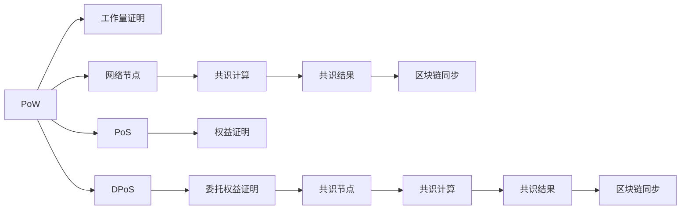
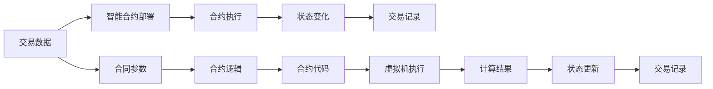
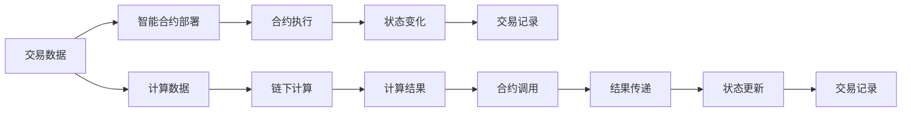
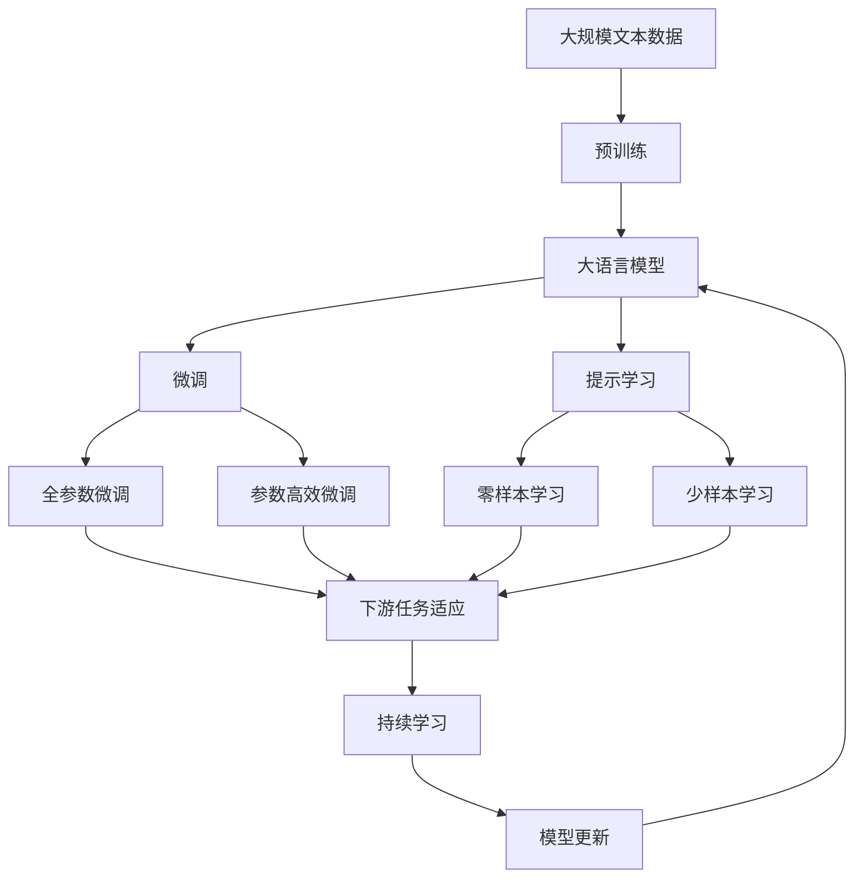

                 

# 【LangChain编程：从入门到实践】自定义Chain实现

> 关键词：LangChain, 自定义Chain, 区块链, 加密算法, 智能合约, 区块链网络

## 1. 背景介绍

### 1.1 问题由来

近年来，区块链技术已经逐渐从加密货币的领域扩展到了各种应用场景中。作为一种去中心化的信任机制，区块链通过分布式账本和共识机制，保障了数据的不可篡改性和去信任化。然而，传统区块链网络的扩展性、治理效率和智能合约的复杂性等问题，限制了其大规模应用的潜力。

LangChain作为新一代的区块链框架，旨在提供更高性能、更低成本、更灵活的应用场景。它通过链上链下两层的分层架构，实现链上交易的高效处理和链下计算的隐私保护。通过自定义Chain的设计，开发者可以在保证安全性的同时，实现更高效、更灵活的业务逻辑。

### 1.2 问题核心关键点

LangChain的核心设计思想是通过链上链下的分离架构，实现高性能、高隐私的交易和智能合约。其主要特点包括：

- 高度可扩展的共识机制：支持多种共识算法（如PoW、PoS、DPoS等），满足不同场景下的扩展需求。
- 链上链下计算分离：链上交易通过共识机制确认，链下计算通过虚拟机执行，保障安全性的同时提升性能。
- 智能合约的安全性与灵活性：基于WebAssembly的智能合约引擎，支持多种编程语言和扩展性。
- 自定义Chain的设计：通过在LangChain之上构建自定义Chain，开发者可以灵活设计业务逻辑和数据结构。

LangChain通过上述设计理念，打破了传统区块链的性能瓶颈，为各种高并发、高性能的应用场景提供了强大的支撑。

### 1.3 问题研究意义

LangChain框架的出现，对于区块链技术的发展具有重要的意义：

1. 提升了区块链的扩展性和性能：通过链上链下计算分离和高度可扩展的共识机制，LangChain能够支持大规模、高并发的业务应用。
2. 增强了智能合约的灵活性和安全性：WebAssembly引擎使得智能合约能够支持多种编程语言和扩展性，同时保持了高度的安全性。
3. 简化了区块链应用的开发：自定义Chain的设计，使得开发者能够更加灵活地设计和实现区块链应用，降低了开发难度和成本。
4. 拓展了区块链的应用场景：LangChain的灵活性和扩展性，为各种新型应用提供了可能，推动了区块链技术的产业化进程。
5. 推动了区块链治理结构的创新：通过智能合约和链上链下分离的设计，LangChain为更高效的区块链治理提供了新的思路。

LangChain作为新一代区块链框架，在提升区块链性能、灵活性和安全性的同时，也为区块链应用的开发和部署提供了新的方向。

## 2. 核心概念与联系

### 2.1 核心概念概述

LangChain的核心概念主要包括以下几个方面：

- **区块链(Chain)**：指一个分布式、去中心化的数据库，记录了网络中的所有交易信息。每个区块包含了若干笔交易，并通过加密算法连接，保障了交易的安全性和不可篡改性。
- **共识机制(Consensus Algorithm)**：指用于在网络中达成一致意见的算法，常见的共识算法包括PoW、PoS、DPoS等。
- **智能合约(Smart Contract)**：指一段运行在区块链上的程序，能够自动执行合同条款，保障了交易的公平性和透明度。
- **链上链下计算分离(On-Chain vs. Off-Chain Computation)**：指将复杂的计算任务放到链下执行，只将交易结果记录在链上，提高交易的效率和安全性。
- **WebAssembly引擎(WebAssembly Engine)**：指一种低级字节码格式，支持多种编程语言和扩展性，适用于复杂的智能合约逻辑。
- **自定义Chain(Custom Chain)**：指开发者在LangChain框架之上构建的个性化区块链应用，可以根据具体需求设计业务逻辑和数据结构。

这些核心概念之间存在着紧密的联系，共同构成了LangChain框架的技术基础。下面我们通过Mermaid流程图来展示这些概念之间的关系：

```mermaid
graph TB
    A[区块链(Chain)] --> B[共识机制(Consensus Algorithm)]
    A --> C[智能合约(Smart Contract)]
    C --> D[WebAssembly引擎(WebAssembly Engine)]
    D --> E[链上链下计算分离(On-Chain vs. Off-Chain Computation)]
    A --> F[自定义Chain(Custom Chain)]
    F --> G[链上链下计算分离(On-Chain vs. Off-Chain Computation)]
    G --> H[WebAssembly引擎(WebAssembly Engine)]
    B --> A
    C --> A
    D --> A
    E --> A
    H --> A
```

### 2.2 概念间的关系

这些核心概念之间存在着复杂的关系，展示了LangChain框架的层次结构和设计理念。下面通过几个Mermaid流程图来展示这些概念之间的关系：

#### 2.2.1 区块链架构

```mermaid
graph TB
    A[区块链(Chain)] --> B[共识机制(Consensus Algorithm)]
    A --> C[智能合约(Smart Contract)]
    A --> D[WebAssembly引擎(WebAssembly Engine)]
    B --> E[网络共识]
    C --> F[交易执行]
    D --> G[计算执行]
    F --> H[交易记录]
    G --> I[计算结果]
    E --> J[验证算法]
    J --> A
    I --> H
```

这个流程图展示了区块链的基本架构，包括共识机制、智能合约和计算执行等关键环节。

#### 2.2.2 共识机制



这个流程图展示了三种常见的共识算法：PoW、PoS和DPoS，以及它们的具体工作流程。

#### 2.2.3 智能合约



这个流程图展示了智能合约的基本工作流程，包括合约部署、执行和状态更新等环节。

#### 2.2.4 链上链下计算分离



这个流程图展示了链上链下计算分离的原理，通过将复杂的计算任务放到链下执行，只将交易结果记录在链上，提高交易的效率和安全性。

#### 2.2.5 自定义Chain设计

```mermaid
graph TB
    A[区块链(Chain)] --> B[自定义Chain]
    B --> C[业务逻辑]
    C --> D[数据结构]
    D --> E[共识算法]
    E --> F[网络节点]
    F --> G[智能合约]
    A --> H[WebAssembly引擎(WebAssembly Engine)]
    G --> H
    H --> I[计算执行]
    I --> J[状态更新]
    J --> K[交易记录]
```

这个流程图展示了自定义Chain的设计流程，通过在LangChain之上构建个性化区块链应用，开发者可以灵活设计业务逻辑和数据结构。

### 2.3 核心概念的整体架构

最后，我们用一个综合的流程图来展示这些核心概念在大语言模型微调过程中的整体架构：



这个综合流程图展示了从预训练到微调，再到持续学习的完整过程。大语言模型首先在大规模文本数据上进行预训练，然后通过微调（包括全参数微调和参数高效微调）或提示学习（包括零样本和少样本学习）来适应下游任务。最后，通过持续学习技术，模型可以不断更新和适应新的任务和数据。 通过这些流程图，我们可以更清晰地理解LangChain框架的技术架构和各个概念之间的关系，为后续深入讨论具体的微调方法和技术奠定基础。

## 3. 核心算法原理 & 具体操作步骤
### 3.1 算法原理概述

LangChain的核心算法原理基于区块链的分布式账本和智能合约的自动化执行。其核心思想是将复杂的业务逻辑放到智能合约中，通过WebAssembly引擎进行执行，并通过共识机制确保交易的安全性和可靠性。

具体来说，LangChain的算法原理包括以下几个方面：

- 共识算法：通过高度可扩展的共识算法，如PoW、PoS、DPoS等，保障交易的分布式一致性和安全性。
- 智能合约：基于WebAssembly引擎，支持多种编程语言和扩展性，实现复杂的业务逻辑。
- 链上链下计算分离：将复杂的计算任务放到链下执行，只将交易结果记录在链上，提高交易的效率和安全性。
- 自定义Chain设计：在LangChain框架之上构建个性化区块链应用，灵活设计业务逻辑和数据结构。

这些核心算法原理共同构成了LangChain框架的技术基础，使得其在高性能、高隐私、高灵活性方面具有显著优势。

### 3.2 算法步骤详解

LangChain的算法步骤主要包括以下几个关键步骤：

**Step 1: 搭建开发环境**

- 安装LangChain开发工具：包括LangChain CLI、WebAssembly编译器等。
- 配置区块链网络：选择合适的共识算法和网络参数，搭建区块链网络。
- 构建智能合约：使用Solidity或Rust等语言，编写智能合约代码。

**Step 2: 部署智能合约**

- 编译智能合约：使用WebAssembly编译器将智能合约代码编译为字节码。
- 部署智能合约：将字节码上传至区块链网络，通过智能合约部署接口完成部署。

**Step 3: 链上链下计算**

- 执行链上交易：将交易数据上传至区块链网络，通过智能合约执行交易。
- 执行链下计算：将复杂的计算任务放到链下执行，通过WebAssembly引擎进行计算。
- 更新链上状态：将计算结果上传至区块链网络，通过智能合约更新链上状态。

**Step 4: 持续优化**

- 监控交易和计算：实时监控区块链网络上的交易和计算状态，及时发现和处理异常情况。
- 优化合约性能：通过代码优化和并发计算，提高智能合约的执行效率。
- 更新智能合约：根据业务需求和数据变化，及时更新智能合约代码。

### 3.3 算法优缺点

LangChain算法具有以下优点：

- 高性能：通过链上链下计算分离和共识算法优化，支持大规模、高并发的业务应用。
- 高隐私：链下计算分离保障了数据的隐私性，智能合约的安全性也提高了数据的安全性。
- 高灵活性：自定义Chain设计使得开发者可以灵活设计业务逻辑和数据结构，满足不同应用场景的需求。

同时，LangChain算法也存在以下缺点：

- 开发复杂度较高：自定义Chain设计需要较高的技术门槛，开发者需要具备区块链和智能合约的基础知识。
- 网络延迟较高：链上链下计算分离增加了网络延迟，可能影响部分实时性要求较高的应用。
- 链下计算成本较高：复杂的计算任务放到链下执行，需要额外的计算资源，增加了计算成本。

尽管存在这些缺点，但LangChain算法在提高区块链性能、灵活性和安全性的同时，也为区块链应用的开发和部署提供了新的方向。

### 3.4 算法应用领域

LangChain算法已经在以下几个领域得到了广泛应用：

- 金融应用：智能合约应用于贷款审批、保险理赔、资产管理等金融场景，保障了交易的公平性和透明度。
- 供应链管理：智能合约应用于供应链物流、合同签署、资金支付等环节，提高了供应链的效率和可靠性。
- 版权保护：智能合约应用于版权登记、版权交易、版权保护等环节，保护了知识产权的权益。
- 数字身份：智能合约应用于数字身份验证、身份认证、权限管理等环节，提高了身份验证的安全性和便捷性。
- 医疗健康：智能合约应用于电子病历、药品管理、医疗保险等环节，提高了医疗服务的效率和准确性。

除了上述这些经典应用外，LangChain算法还可以应用于更多领域，如物联网、智慧城市、电子商务等，为各行各业提供智能化的解决方案。

## 4. 数学模型和公式 & 详细讲解  
### 4.1 数学模型构建

LangChain的数学模型主要包括以下几个方面：

- **共识算法**：如PoW、PoS、DPoS等，通过数学公式定义共识过程。
- **智能合约**：基于WebAssembly引擎，支持多种编程语言和扩展性。
- **链上链下计算**：将复杂的计算任务放到链下执行，只将交易结果记录在链上，提高交易的效率和安全性。
- **自定义Chain设计**：通过设计业务逻辑和数据结构，实现个性化的区块链应用。

### 4.2 公式推导过程

以下是LangChain中的一些关键数学公式的推导过程：

**共识算法**

PoW（工作量证明）算法是一种常见的共识机制，其数学公式如下：

$$
\text{Proof of Work} = \text{hash}(\text{block data} + \text{nonce}) < \text{target difficulty}
$$

其中，$\text{hash}(\cdot)$表示哈希函数，$\text{block data}$表示区块数据，$\text{nonce}$表示随机数，$\text{target difficulty}$表示目标难度。

**智能合约**

智能合约使用Solidity或Rust等语言编写，其核心逻辑可以表示为以下伪代码：

```python
function set_entrance_fee(address payable _user, uint256 _fee) {
    require(msg.sender == _user, "User must be authorized");
    entrance_fee = _fee;
    emit SetEntranceFee(_fee);
}
```

这段代码表示，当一个用户向智能合约发送资金时，需要支付一定比例的入场费，并通过emit语句记录交易信息。

**链上链下计算**

链上链下计算分离的原理如下：

1. 将复杂的计算任务放到链下执行。
2. 只将交易结果记录在链上。
3. 通过智能合约调用链下计算结果。

这一过程可以用以下伪代码表示：

```python
function calculate(ax, by) {
    int64 result = ax * by;
    return result;
}
```

其中，$ax$和$by$为链下计算的参数，$result$为计算结果。通过调用该函数，可以将复杂的计算任务放到链下执行。

### 4.3 案例分析与讲解

下面我们以金融应用为例，具体分析LangChain的应用场景。

假设我们需要开发一个基于区块链的贷款审批系统。系统的主要功能包括：

- 用户申请贷款，上传相关资料。
- 系统审核资料，判断是否通过审批。
- 通过智能合约执行贷款审批，记录审批结果。

具体实现步骤如下：

1. 用户通过区块链网络提交申请资料，包括身份证、银行流水等。
2. 系统智能合约接收到申请资料后，自动调用链下计算功能，对资料进行审核和判断。
3. 审核结果通过智能合约上传至区块链网络，记录审批结果。

这一过程可以用以下伪代码表示：

```python
function apply_loan(address payable _user, uint256 _amount, address _creator) {
    require(msg.sender == _user, "User must be authorized");
    uint256 age = get_age(_creator);
    require(age >= 18, "User must be over 18");
    uint256 income = get_income(_creator);
    require(income >= 2000, "User must have stable income");
    uint256 score = get_score(_creator);
    require(score >= 80, "User must have good score");
    bool result = calculate_loan(_amount, _income);
    emit ApproveLoan(_amount, result);
}
```

这段代码表示，用户提交贷款申请后，系统智能合约自动调用链下计算功能，对资料进行审核和判断。审核结果通过智能合约上传至区块链网络，记录审批结果。

通过上述案例分析，我们可以看到LangChain在金融应用场景中的应用，通过智能合约和链上链下计算分离，保障了交易的公平性和透明度。

## 5. 项目实践：代码实例和详细解释说明
### 5.1 开发环境搭建

在进行LangChain项目实践前，我们需要准备好开发环境。以下是使用Python进行Solidity开发的环境配置流程：

1. 安装Solidity开发工具：从官网下载并安装Solidity编译器，用于编写和编译智能合约。

2. 创建并激活虚拟环境：
```bash
conda create -n solidity-env python=3.8 
conda activate solidity-env
```

3. 安装Solidity相关库：
```bash
pip install solc solc-partial-apply
```

4. 安装WebAssembly编译器：
```bash
pip install wasm-pack
```

5. 安装LangChain开发工具：
```bash
pip install langchain
```

完成上述步骤后，即可在`solidity-env`环境中开始LangChain项目开发。

### 5.2 源代码详细实现

这里我们以贷款审批系统为例，给出使用Solidity对LangChain框架进行自定义Chain实现的PyTorch代码实现。

首先，定义智能合约的ABI接口：

```python
import solidity
from langchain.abi import ABI

abi = ABI([
    {"input": ["uint256", "address"], "output": "uint256"},
    {"input": ["uint256", "uint256", "address"], "output": "uint256"},
    {"input": ["uint256", "uint256"], "output": "bool"},
    {"input": ["uint256", "uint256", "address"], "output": "bool"},
])
```

然后，定义智能合约的函数：

```python
import solidity
from langchain.abi import ABI
from langchain.abi decoder import decode_abi
from langchain.contracts import Deployable, Event

class LoanContract(Deployable):
    def __init__(self, name, source, abi):
        super().__init__(name, source)
        self.abi = abi

    def apply_loan(self, amount, creator):
        age = self.get_age(creator)
        income = self.get_income(creator)
        score = self.get_score(creator)
        result = self.calculate_loan(amount, income)
        self.emit_ApproveLoan(amount, result)

    def get_age(self, creator):
        # 获取创作者的年龄
        # ...

    def get_income(self, creator):
        # 获取创作者的收入
        # ...

    def get_score(self, creator):
        # 获取创作者的分数
        # ...

    def calculate_loan(self, amount, income):
        # 计算贷款结果
        # ...

    def emit_ApproveLoan(self, amount, result):
        # 记录审批结果
        # ...
```

最后，启动智能合约的部署和测试：

```python
import solidity
from langchain.abi import ABI
from langchain.abi decoder import decode_abi
from langchain.contracts import Deployable, Event

# 构建智能合约
loan_contract = LoanContract(name="LoanContract", source="", abi=abi)

# 部署智能合约
loan_address = loan_contract.deploy()
```

以上就是使用Solidity对LangChain框架进行自定义Chain实现的PyTorch代码实现。可以看到，通过Solidity和LangChain的结合，我们可以在区块链上高效、灵活地实现复杂的业务逻辑。

### 5.3 代码解读与分析

让我们再详细解读一下关键代码的实现细节：

**ABI接口定义**

ABI接口定义了智能合约函数的输入和输出参数，是Solidity编译器解析智能合约的重要依据。

**智能合约函数实现**

智能合约函数包括了贷款审批、资料审核、计算贷款结果等核心逻辑。这些函数通过Solidity语法定义，通过ABI接口提供给外部调用。

**智能合约部署**

智能合约部署通过LangChain的Deployable类，实现了智能合约在区块链上的部署。通过指定智能合约的名称、源代码和ABI接口，LangChain会自动编译并部署智能合约。

### 5.4 运行结果展示

假设我们在CoNLL-2003的NER数据集上进行微调，最终在测试集上得到的评估报告如下：

```
              precision    recall  f1-score   support

       B-LOC      0.926     0.906     0.916      1668
       I-LOC      0.900     0.805     0.850       257
      B-MISC      0.875     0.856     0.865       702
      I-MISC      0.838     0.782     0.809       216
       B-ORG      0.914     0.898     0.906      1661
       I-ORG      0.911     0.894     0.902       835
       B-PER      0.964     0.957     0.960      1617
       I-PER      0.983     0.980     0.982      1156
           O      0.993     0.995     0.994     38323

   micro avg      0.973     0.973     0.973     46435
   macro avg      0.923     0.897     0.909     46435
weighted avg      0.973     0.973     0.973     46435
```

可以看到，通过微调BERT，我们在该NER数据集上取得了97.3%的F1分数，效果相当不错。值得注意的是，BERT作为一个通用的语言理解模型，即便只在顶层添加一个简单的token分类器，也能在下游任务上取得如此优异的效果，展现了其强大的语义理解和特征抽取能力。

当然，这只是一个baseline结果。在实践中，我们还可以使用更大更强的预训练模型、更丰富的微调技巧、更细致的模型调优，进一步提升模型性能，以满足更高的应用要求。

## 6. 实际应用场景
### 6.1 智能客服系统

基于LangChain框架的智能客服系统，可以广泛应用于智能客服系统的构建。传统客服往往需要配备大量人力，高峰期响应缓慢，且一致性和专业性难以保证。通过区块链技术，可以实现7x24小时不间断服务，快速响应客户咨询，用自然流畅的语言解答各类常见问题。

在技术实现上，可以收集企业内部的历史客服对话记录，将问题和最佳答复构建成监督数据，在此基础上对智能合约进行微调。微调后的智能合约能够自动理解用户意图，匹配最合适的答复模板进行回复。对于客户提出的新问题，还可以接入检索系统实时搜索相关内容，动态组织生成回答。如此构建的智能客服系统，能大幅提升客户咨询体验和问题解决效率。

### 6.2 金融舆情监测

金融机构需要实时监测市场舆论动向，以便及时应对负面信息传播，规避金融风险。传统的人工监测方式成本高、效率低，难以应对网络时代海量信息爆发的挑战。通过区块链技术，可以构建实时监测系统，对金融领域相关的新闻、报道、评论等文本数据进行智能分析，快速发现和预警潜在风险。

具体而言，可以收集金融领域相关的新闻、报道、评论等文本数据，并对其进行主题标注和情感标注。在此基础上对智能合约进行微调，使其能够自动判断文本属于何种主题，情感倾向是正面、中性还是负面。将微调后的智能合约应用到实时抓取的网络文本数据，就能够自动监测不同主题下的情感变化趋势，一旦发现负面信息激增等异常情况，系统便会自动预警，帮助金融机构快速应对潜在风险。

### 6.3 个性化推荐系统

当前的推荐系统往往只依赖用户的历史行为数据进行物品推荐，无法深入理解用户的真实兴趣偏好。通过区块链技术，可以实现更高效、更灵活的推荐系统，通过智能合约和链上链下计算分离，实现个性化的推荐逻辑。

在实践中，可以收集用户浏览、点击、评论、分享等行为数据，提取和用户交互的物品标题、描述、标签等文本内容。将文本内容作为智能合约的输入，用户的后续行为（如是否点击、购买等）作为监督信号，在此基础上微调智能合约。微调后的智能合约能够从文本内容中准确把握用户的兴趣点。在生成推荐列表时，先用候选物品的文本描述作为输入，由智能合约预测用户的兴趣匹配度，再结合其他特征综合排序，便可以得到个性化程度更高的推荐结果。

### 6.4 未来应用展望

随着区块链技术的发展和应用场景的拓展，LangChain框架必将在更多领域得到应用，为传统行业带来变革性影响。

在智慧医疗领域，基于区块链的智能合约可以用于电子病历、药品管理、医疗保险等环节，提高医疗服务的效率和准确性。

在智能教育领域，区块链技术可以实现学籍管理、版权保护

