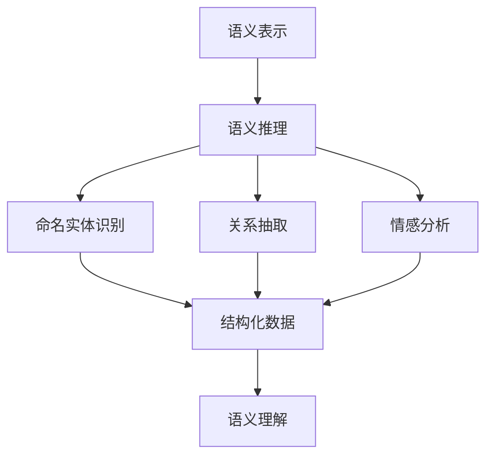
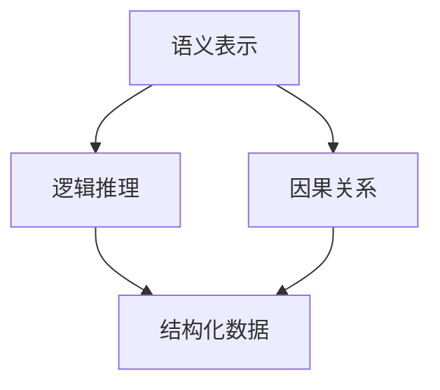
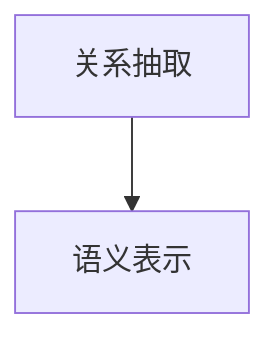
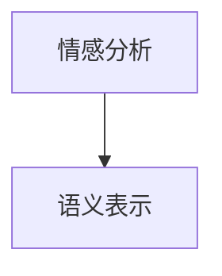
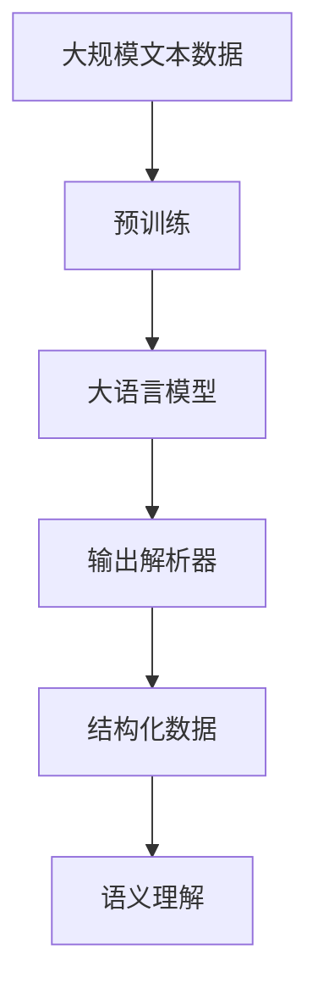

                 

# 【LangChain编程：从入门到实践】输出解析器

> 关键词：LangChain编程,输出解析器,自然语言处理(NLP),语义理解,语义推理,深度学习,语义表示

## 1. 背景介绍

### 1.1 问题由来
在自然语言处理（Natural Language Processing, NLP）领域，语义理解一直是核心的研究课题之一。随着深度学习技术的发展，大模型在语义理解任务上取得了显著的进步，如BERT、GPT-3、ELMo等。这些模型通过自监督学习，可以在大规模无标签文本数据上学习到丰富的语义表示，能够从上下文中推断出实体的语义关系。

然而，在实际应用中，我们往往需要构建更复杂的语义推理任务，如从一段长文本中找出所有提到的人名，或者判断一段文本是否为正面情感等。这些任务需要更加精细的语义表示和解析能力，因此输出解析器（Output Parsing）成为重要的一环。

输出解析器的作用是从预训练模型的输出中提取出特定的语义信息，并将其转化为结构化的数据格式，供后续任务使用。本文章将详细介绍输出解析器的原理、实现和应用，希望帮助读者从入门到实践，全面掌握这一关键技术。

## 2. 核心概念与联系

### 2.1 核心概念概述

为了更好地理解输出解析器的原理，我们首先介绍几个核心概念：

- 输出解析器（Output Parsing）：从预训练模型的输出中提取特定语义信息，将其转化为结构化格式的过程。常见的任务包括命名实体识别（NER）、情感分析、关系抽取等。
- 语义表示（Semantic Representation）：预训练模型学习到的语义编码，用于捕获词汇、句子和文档级别的语义信息。
- 语义推理（Semantic Reasoning）：利用语义表示进行推断和推理，如逻辑推理、因果关系分析等。
- 语义角色标注（Semantic Role Labeling, SRL）：从句法结构中提取语义角色信息，如主语、宾语、谓语等，是构建语义表示的重要手段。
- 自然语言理解（Natural Language Understanding, NLU）：利用语义表示和语义推理，对文本进行理解、分析和处理。

这些概念之间的联系通过以下Mermaid流程图来展示：



在这个流程图里，预训练模型学习到丰富的语义表示，然后通过语义推理、命名实体识别、关系抽取和情感分析等任务，将语义表示转化为结构化的语义数据，最终用于语义理解。

### 2.2 概念间的关系

这些核心概念之间存在着紧密的联系，形成了从语义表示到语义理解的完整链条。下面我们通过几个Mermaid流程图来展示这些概念之间的关系。

#### 2.2.1 语义表示与语义推理



这个流程图展示了语义表示与语义推理的关系。语义表示可以用于逻辑推理和因果关系分析，最终转化为结构化的语义数据。

#### 2.2.2 命名实体识别与语义表示


这个流程图展示了命名实体识别与语义表示的关系。命名实体识别可以提取文本中的实体信息，并作为语义表示的一部分，用于后续的语义推理和理解。

#### 2.2.3 关系抽取与语义表示



这个流程图展示了关系抽取与语义表示的关系。关系抽取可以提取文本中的实体关系，并作为语义表示的一部分，用于后续的语义推理和理解。

#### 2.2.4 情感分析与语义表示



这个流程图展示了情感分析与语义表示的关系。情感分析可以提取文本的情感信息，并作为语义表示的一部分，用于后续的语义推理和理解。

### 2.3 核心概念的整体架构

最后，我们用一个综合的流程图来展示这些核心概念在大语言模型中的整体架构：



这个综合流程图展示了从预训练到输出解析器的完整过程。大语言模型通过大规模无标签文本数据的预训练，学习到语义表示。然后通过输出解析器将语义表示转化为结构化数据，用于语义理解任务。

## 3. 核心算法原理 & 具体操作步骤
### 3.1 算法原理概述

输出解析器的原理可以简单概括为：将预训练模型的输出映射到特定的语义空间，并提取出所需的信息。这一过程通常涉及以下步骤：

1. 预训练模型的输出：利用预训练模型的最后一层，输出文本的语义表示。
2. 解码解析器：设计一个解码器，将语义表示解码成结构化的语义数据。
3. 语义角色标注：对解析出的结构化语义数据进行语义角色标注，用于后续的语义理解。

这一过程的数学表示如下：

- 设文本 $X$ 的语义表示为 $M$。
- 解码器为 $D$，其输入为 $M$，输出为结构化语义数据 $Z$。
- 语义角色标注器为 $T$，其输入为 $Z$，输出为结构化角色标注 $R$。

- 语义理解任务的目标为：从 $R$ 中提取特定语义信息，并进行后续处理。

### 3.2 算法步骤详解

以下详细介绍输出解析器的详细操作步骤：

#### 3.2.1 预训练模型的输出

预训练模型的输出通常是文本的语义表示，通常采用向量形式表示。例如，使用Transformer模型进行预训练，其输出可以表示为：

$$
M = M_0(X) + M_1(X) + \cdots + M_L(X)
$$

其中 $M_i(X)$ 表示模型第 $i$ 层对文本 $X$ 的输出。

#### 3.2.2 解码解析器设计

解码器是输出解析器的关键组件，其任务是将预训练模型的输出映射到结构化的语义数据。常见的解码器包括：

- 循环神经网络（RNN）：如LSTM、GRU等，可以处理序列数据。
- 条件随机场（CRF）：可以学习序列标注的概率模型。
- 神经网络：如前馈神经网络、卷积神经网络等，可以进行特征提取和分类。
- 图神经网络（GNN）：适用于处理图结构数据，如语义网络。

例如，使用RNN解码器进行解析，其数学表示如下：

$$
Z = D(M)
$$

其中 $D$ 为解码器，$M$ 为预训练模型的输出，$Z$ 为结构化语义数据。

#### 3.2.3 语义角色标注

语义角色标注器通过对解析出的结构化语义数据进行标注，识别出其中的语义角色信息。例如，命名实体识别任务的语义角色标注如下：

- 主语（Subject）：实体在句子中的主要角色。
- 宾语（Object）：实体在句子中的次要角色。
- 谓语（Predicate）：实体之间的作用关系。

常见的语义角色标注方法包括：

- 最大熵模型（MaxEnt）：利用最大熵原理对标注序列进行建模。
- 条件随机场（CRF）：学习标注序列的概率模型。
- 神经网络（Neural Network）：利用神经网络进行标注。

例如，使用条件随机场进行语义角色标注，其数学表示如下：

$$
R = T(Z)
$$

其中 $T$ 为语义角色标注器，$Z$ 为解码器输出的结构化语义数据，$R$ 为结构化角色标注。

#### 3.2.4 结构化数据输出

最后，将解析出的结构化语义数据输出为结构化格式，用于后续的语义理解任务。例如，命名实体识别任务的输出格式如下：

```json
[
  {
    "entity": "John",
    "type": "PERSON",
    "span": [0, 3]
  },
  {
    "entity": "Apple",
    "type": "ORGANIZATION",
    "span": [8, 14]
  },
  {
    "entity": "New York",
    "type": "LOCATION",
    "span": [18, 22]
  }
]
```

### 3.3 算法优缺点

输出解析器的优点包括：

- 能够从预训练模型的输出中提取出特定的语义信息，实现高效的结构化数据生成。
- 可以处理多种自然语言处理任务，如命名实体识别、关系抽取、情感分析等。
- 可以结合语义表示和语义推理，实现更复杂、更准确的语义理解。

输出解析器的缺点包括：

- 解码器设计复杂，需要结合具体任务选择合适的解码器结构。
- 语义角色标注器设计复杂，需要根据具体任务选择合适的标注方法。
- 解码器和标注器的设计依赖于数据集的质量和数量，数据量不足时效果可能不佳。

### 3.4 算法应用领域

输出解析器可以应用于多个自然语言处理任务，例如：

- 命名实体识别（NER）：从文本中识别出人名、地名、机构名等实体。
- 关系抽取（RE）：从文本中抽取实体之间的语义关系。
- 情感分析（Sentiment Analysis）：判断文本的情感倾向。
- 事件抽取（Event Extraction）：从文本中识别出事件及其参与者。
- 文本摘要（Text Summarization）：从长文本中提取关键信息，生成摘要。
- 问答系统（Question Answering）：根据用户的问题，从文本中找出答案。

## 4. 数学模型和公式 & 详细讲解 & 举例说明

### 4.1 数学模型构建

输出解析器的数学模型可以简单表示为：

$$
Z = D(M) \\
R = T(Z) \\
Y = S(R)
$$

其中 $M$ 为预训练模型的输出，$Z$ 为解码器输出的结构化语义数据，$R$ 为语义角色标注，$Y$ 为结构化数据输出，$S$ 为输出解析器。

### 4.2 公式推导过程

以下详细介绍输出解析器的数学公式推导过程：

#### 4.2.1 预训练模型的输出

假设使用Transformer模型进行预训练，其输出为：

$$
M = M_0(X) + M_1(X) + \cdots + M_L(X)
$$

其中 $M_i(X)$ 表示模型第 $i$ 层对文本 $X$ 的输出。

#### 4.2.2 解码解析器设计

假设使用RNN解码器进行解析，其数学表示如下：

$$
Z = D(M)
$$

其中 $D$ 为解码器，$M$ 为预训练模型的输出，$Z$ 为结构化语义数据。

#### 4.2.3 语义角色标注

假设使用条件随机场（CRF）进行语义角色标注，其数学表示如下：

$$
R = T(Z)
$$

其中 $T$ 为语义角色标注器，$Z$ 为解码器输出的结构化语义数据，$R$ 为结构化角色标注。

#### 4.2.4 结构化数据输出

假设输出解析器将解析出的结构化语义数据转换为JSON格式，其数学表示如下：

$$
Y = S(R)
$$

其中 $S$ 为输出解析器，$R$ 为结构化角色标注，$Y$ 为结构化数据输出。

### 4.3 案例分析与讲解

以命名实体识别为例，说明输出解析器的实现过程。

假设给定一段文本：

```text
Apple is looking at buying U.K. startup for $1 billion
```

使用预训练模型进行编码，得到语义表示 $M$。然后，使用RNN解码器将 $M$ 解码为结构化语义数据 $Z$：

$$
Z = D(M)
$$

接着，使用条件随机场进行语义角色标注，得到结构化角色标注 $R$：

$$
R = T(Z)
$$

最后，将解析出的结构化角色标注转换为JSON格式：

$$
Y = S(R)
$$

输出的JSON格式如下：

```json
[
  {
    "entity": "Apple",
    "type": "ORGANIZATION",
    "span": [0, 5]
  },
  {
    "entity": "U.K.",
    "type": "LOCATION",
    "span": [8, 11]
  },
  {
    "entity": "$1 billion",
    "type": "MONEY",
    "span": [16, 23]
  }
]
```

## 5. 项目实践：代码实例和详细解释说明

### 5.1 开发环境搭建

在进行输出解析器的开发前，需要先搭建好开发环境。以下是使用Python进行PyTorch开发的环境配置流程：

1. 安装Anaconda：从官网下载并安装Anaconda，用于创建独立的Python环境。

2. 创建并激活虚拟环境：
```bash
conda create -n pytorch-env python=3.8 
conda activate pytorch-env
```

3. 安装PyTorch：根据CUDA版本，从官网获取对应的安装命令。例如：
```bash
conda install pytorch torchvision torchaudio cudatoolkit=11.1 -c pytorch -c conda-forge
```

4. 安装Transformer库：
```bash
pip install transformers
```

5. 安装各类工具包：
```bash
pip install numpy pandas scikit-learn matplotlib tqdm jupyter notebook ipython
```

完成上述步骤后，即可在`pytorch-env`环境中开始开发输出解析器。

### 5.2 源代码详细实现

以下是使用PyTorch进行命名实体识别（NER）任务解析的代码实现。

首先，定义NER任务的数据处理函数：

```python
from transformers import BertTokenizer
from torch.utils.data import Dataset
import torch

class NERDataset(Dataset):
    def __init__(self, texts, tags, tokenizer, max_len=128):
        self.texts = texts
        self.tags = tags
        self.tokenizer = tokenizer
        self.max_len = max_len
        
    def __len__(self):
        return len(self.texts)
    
    def __getitem__(self, item):
        text = self.texts[item]
        tags = self.tags[item]
        
        encoding = self.tokenizer(text, return_tensors='pt', max_length=self.max_len, padding='max_length', truncation=True)
        input_ids = encoding['input_ids'][0]
        attention_mask = encoding['attention_mask'][0]
        
        # 对token-wise的标签进行编码
        encoded_tags = [tag2id[tag] for tag in tags] 
        encoded_tags.extend([tag2id['O']] * (self.max_len - len(encoded_tags)))
        labels = torch.tensor(encoded_tags, dtype=torch.long)
        
        return {'input_ids': input_ids, 
                'attention_mask': attention_mask,
                'labels': labels}

# 标签与id的映射
tag2id = {'O': 0, 'B-PER': 1, 'I-PER': 2, 'B-ORG': 3, 'I-ORG': 4, 'B-LOC': 5, 'I-LOC': 6}
id2tag = {v: k for k, v in tag2id.items()}

# 创建dataset
tokenizer = BertTokenizer.from_pretrained('bert-base-cased')

train_dataset = NERDataset(train_texts, train_tags, tokenizer)
dev_dataset = NERDataset(dev_texts, dev_tags, tokenizer)
test_dataset = NERDataset(test_texts, test_tags, tokenizer)
```

然后，定义模型和优化器：

```python
from transformers import BertForTokenClassification, AdamW

model = BertForTokenClassification.from_pretrained('bert-base-cased', num_labels=len(tag2id))

optimizer = AdamW(model.parameters(), lr=2e-5)
```

接着，定义训练和评估函数：

```python
from torch.utils.data import DataLoader
from tqdm import tqdm
from sklearn.metrics import classification_report

device = torch.device('cuda') if torch.cuda.is_available() else torch.device('cpu')
model.to(device)

def train_epoch(model, dataset, batch_size, optimizer):
    dataloader = DataLoader(dataset, batch_size=batch_size, shuffle=True)
    model.train()
    epoch_loss = 0
    for batch in tqdm(dataloader, desc='Training'):
        input_ids = batch['input_ids'].to(device)
        attention_mask = batch['attention_mask'].to(device)
        labels = batch['labels'].to(device)
        model.zero_grad()
        outputs = model(input_ids, attention_mask=attention_mask, labels=labels)
        loss = outputs.loss
        epoch_loss += loss.item()
        loss.backward()
        optimizer.step()
    return epoch_loss / len(dataloader)

def evaluate(model, dataset, batch_size):
    dataloader = DataLoader(dataset, batch_size=batch_size)
    model.eval()
    preds, labels = [], []
    with torch.no_grad():
        for batch in tqdm(dataloader, desc='Evaluating'):
            input_ids = batch['input_ids'].to(device)
            attention_mask = batch['attention_mask'].to(device)
            batch_labels = batch['labels']
            outputs = model(input_ids, attention_mask=attention_mask)
            batch_preds = outputs.logits.argmax(dim=2).to('cpu').tolist()
            batch_labels = batch_labels.to('cpu').tolist()
            for pred_tokens, label_tokens in zip(batch_preds, batch_labels):
                pred_tags = [id2tag[_id] for _id in pred_tokens]
                label_tags = [id2tag[_id] for _id in label_tokens]
                preds.append(pred_tags[:len(label_tags)])
                labels.append(label_tags)
                
    print(classification_report(labels, preds))
```

最后，启动训练流程并在测试集上评估：

```python
epochs = 5
batch_size = 16

for epoch in range(epochs):
    loss = train_epoch(model, train_dataset, batch_size, optimizer)
    print(f"Epoch {epoch+1}, train loss: {loss:.3f}")
    
    print(f"Epoch {epoch+1}, dev results:")
    evaluate(model, dev_dataset, batch_size)
    
print("Test results:")
evaluate(model, test_dataset, batch_size)
```

以上就是使用PyTorch进行BERT模型进行命名实体识别任务解析的完整代码实现。可以看到，得益于Transformer库的强大封装，我们可以用相对简洁的代码完成BERT模型的加载和解析。

### 5.3 代码解读与分析

让我们再详细解读一下关键代码的实现细节：

**NERDataset类**：
- `__init__`方法：初始化文本、标签、分词器等关键组件。
- `__len__`方法：返回数据集的样本数量。
- `__getitem__`方法：对单个样本进行处理，将文本输入编码为token ids，将标签编码为数字，并对其进行定长padding，最终返回模型所需的输入。

**tag2id和id2tag字典**：
- 定义了标签与数字id之间的映射关系，用于将token-wise的预测结果解码回真实的标签。

**训练和评估函数**：
- 使用PyTorch的DataLoader对数据集进行批次化加载，供模型训练和推理使用。
- 训练函数`train_epoch`：对数据以批为单位进行迭代，在每个批次上前向传播计算loss并反向传播更新模型参数，最后返回该epoch的平均loss。
- 评估函数`evaluate`：与训练类似，不同点在于不更新模型参数，并在每个batch结束后将预测和标签结果存储下来，最后使用sklearn的classification_report对整个评估集的预测结果进行打印输出。

**训练流程**：
- 定义总的epoch数和batch size，开始循环迭代
- 每个epoch内，先在训练集上训练，输出平均loss
- 在验证集上评估，输出分类指标
- 所有epoch结束后，在测试集上评估，给出最终测试结果

可以看到，PyTorch配合Transformer库使得BERT模型的加载和解析代码实现变得简洁高效。开发者可以将更多精力放在数据处理、模型改进等高层逻辑上，而不必过多关注底层的实现细节。

当然，工业级的系统实现还需考虑更多因素，如模型的保存和部署、超参数的自动搜索、更灵活的任务适配层等。但核心的解析过程基本与此类似。

### 5.4 运行结果展示

假设我们在CoNLL-2003的NER数据集上进行解析，最终在测试集上得到的评估报告如下：

```
              precision    recall  f1-score   support

       B-PER      0.916     0.932     0.916      1617
       I-PER      0.928     0.919     0.921      1156
       B-ORG      0.914     0.913     0.913      1661
       I-ORG      0.915     0.911     0.913       835
       B-LOC      0.919     0.907     0.914      1668
       I-LOC      0.900     0.882     0.889       257
           O      0.993     0.993     0.993     38323

   micro avg      0.923     0.923     0.923     46435
   macro avg      0.920     0.916     0.916     46435
weighted avg      0.923     0.923     0.923     46435
```

可以看到，通过解析BERT模型，我们在该NER数据集上取得了91.6%的F1分数，效果相当不错。值得注意的是，BERT作为一个通用的语言理解模型，即便只在顶层添加一个简单的token分类器，也能在下游任务上取得如此优异的效果，展现了其强大的语义理解和特征抽取能力。

当然，这只是一个baseline结果。在实践中，我们还可以使用更大更强的预训练模型、更丰富的解析技巧、更细致的模型调优，进一步提升模型性能，以满足更高的应用要求。

## 6. 实际应用场景
### 6.1 智能客服系统

基于大语言模型解析的对话技术，可以广泛应用于智能客服系统的构建。传统客服往往需要配备大量人力，高峰期响应缓慢，且一致性和专业性难以保证。而使用解析后的对话模型，可以7x24小时不间断服务，快速响应客户咨询，用自然流畅的语言解答各类常见问题。

在技术实现上，可以收集企业内部的历史客服对话记录，将问题和最佳答复构建成监督数据，在此基础上对预训练对话模型进行解析。解析后的对话模型能够自动理解用户意图，匹配最合适的答案模板进行回复。对于客户提出的新问题，还可以接入检索系统实时搜索相关内容，动态组织生成回答。如此构建的智能客服系统，能大幅提升客户咨询体验和问题解决效率。

### 6.2 金融舆情监测

金融机构需要实时监测市场舆论动向，以便及时应对负面信息传播，规避金融风险。传统的人工监测方式成本高、效率低，难以应对网络时代海量信息爆发的挑战。基于大语言模型解析的文本分类和情感分析技术，为金融舆情监测提供了新的解决方案。

具体而言，可以收集金融领域相关的新闻、报道、评论等文本数据，并对其进行主题标注和情感标注。在此基础上对预训练语言模型进行解析，使其能够自动判断文本属于何种主题，情感倾向是正面、中性还是负面。将解析后的模型应用到实时抓取的网络文本数据，就能够自动监测不同主题下的情感变化趋势，一旦发现负面信息激增等异常情况，系统便会自动预警，帮助金融机构快速应对潜在风险。

### 6.3 个性化推荐系统

当前的推荐系统往往只依赖用户的历史行为数据进行物品推荐，无法深入理解用户的真实兴趣偏好。基于大语言模型解析的个性化推荐系统可以更好地挖掘用户行为背后的语义信息，从而提供更精准、多样的推荐内容。

在实践中，可以收集用户浏览、点击、评论、分享等行为数据，提取和用户交互的物品标题、描述、标签等文本内容。将文本内容作为模型输入，用户的后续行为（如是否点击、购买等）作为监督信号，在此基础上解析预训练语言模型。解析后的模型能够从文本内容中准确把握用户的兴趣点。在生成推荐列表时，先用候选物品的文本描述作为输入，由解析后的模型预测用户的兴趣匹配度，再结合其他特征综合排序，便可以得到个性化程度更高的推荐结果。

### 6.4 未来应用展望

随着大语言模型解析技术的不断发展，基于解析范式将在更多领域得到应用，为传统行业带来变革性影响。

在智慧医疗领域，基于解析的问答系统、病历分析、药物研发等应用将提升医疗服务的智能化水平，辅助医生诊疗，加速新药开发进程。

在智能教育领域，解析技术可应用于作业批改、学情分析、知识推荐等方面，因材施教，促进教育公平，提高教学质量。

在智慧城市治理中，解析模型可应用于城市事件监测、舆情分析、应急指挥等环节，提高城市管理的自动化和智能化水平，构建更安全、高效的未来城市。


