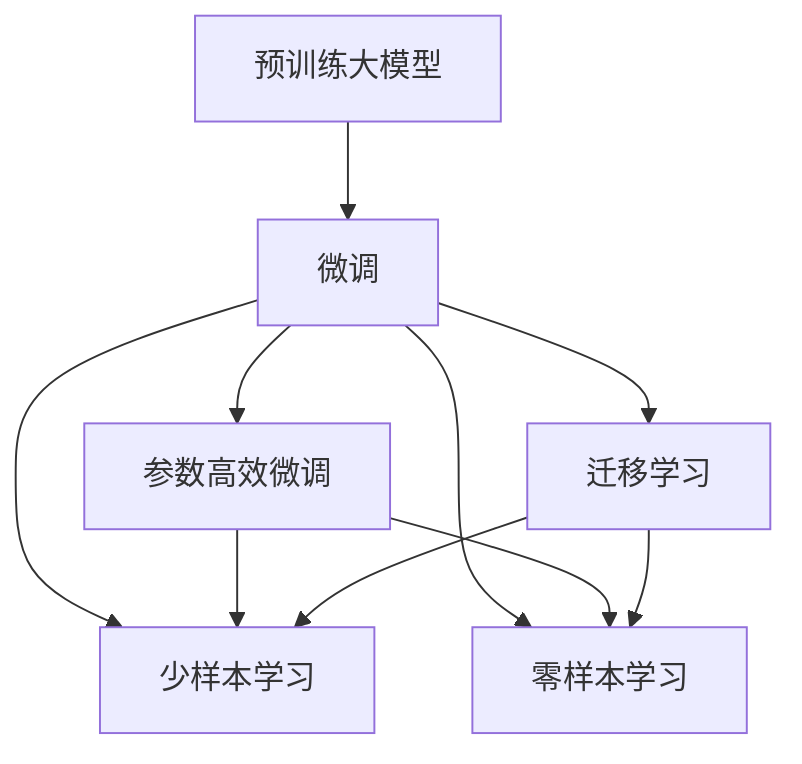
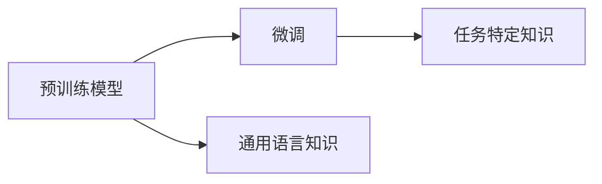
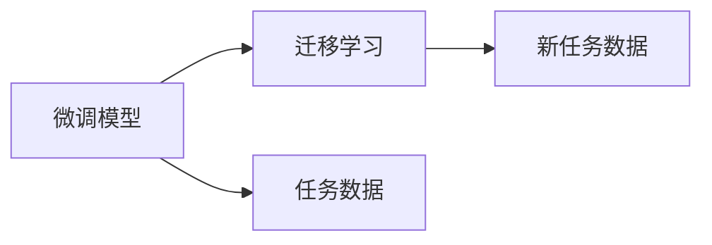
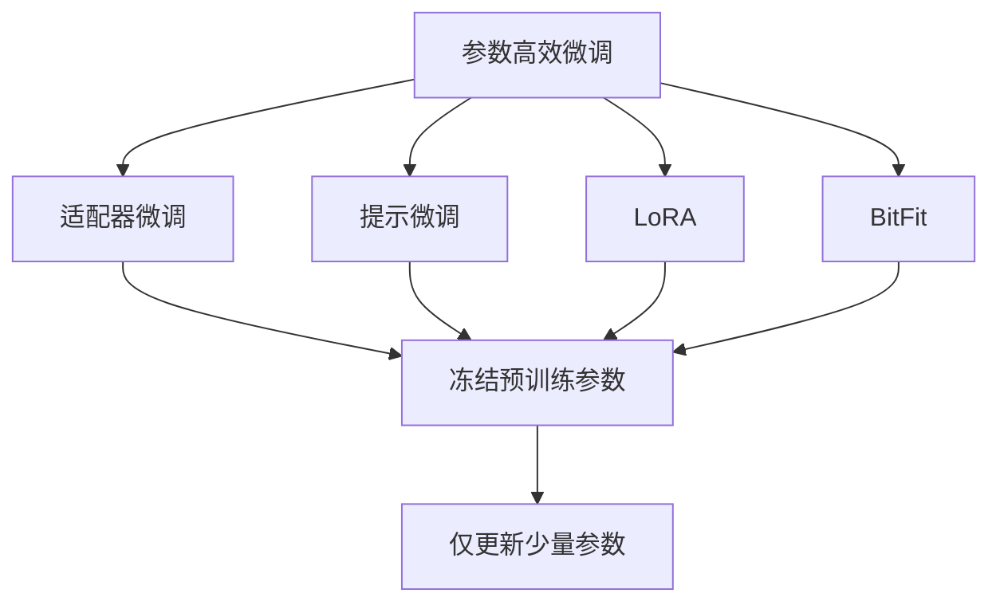
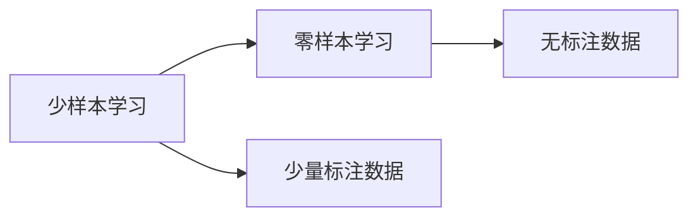
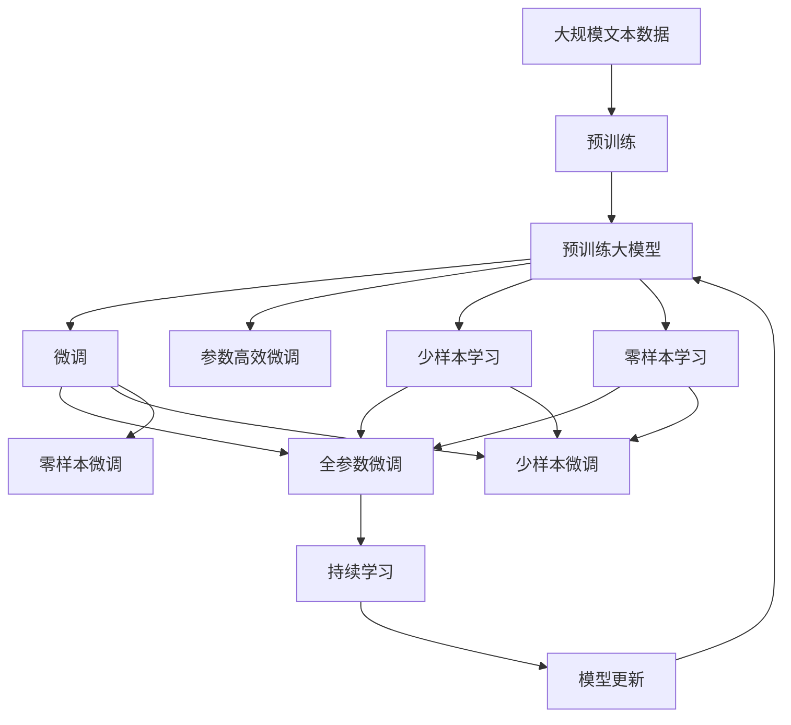

                 

# 【大模型应用开发 动手做AI Agent】Agent带来新的商业模式和变革

## 1. 背景介绍

### 1.1 问题由来
近年来，人工智能(AI)技术的快速发展，尤其是深度学习模型的突破，为各行各业带来了深刻变革。其中，预训练大模型(Large Pre-trained Models)，如BERT、GPT等，以其强大的语言表示和泛化能力，成为自然语言处理(NLP)领域的利器。预训练大模型通过在大规模无标签文本上学习通用的语言表示，能够适应多种下游任务。但在特定领域的应用上，预训练模型的泛化能力仍然不足，无法达到最优性能。

为了提升模型在特定领域的表现，研究者们提出了微调(Fine-tuning)方法。微调方法通过在特定领域的少量标注数据上进行有监督学习，对预训练模型进行优化，使其更好地适应特定任务。微调不仅能够显著提升模型性能，还能有效降低应用开发成本，加速AI技术在垂直行业的落地。

### 1.2 问题核心关键点
微调方法的核心在于如何优化预训练模型，使其在特定任务上表现优异。具体而言，微调过程包括以下几个关键步骤：

1. **数据准备**：收集下游任务的标注数据，划分为训练集、验证集和测试集。
2. **任务适配层设计**：根据任务类型，设计合适的输出层和损失函数，如分类任务使用交叉熵损失，生成任务使用负对数似然损失。
3. **超参数设置**：选择合适的优化算法和超参数，如学习率、批大小、迭代轮数等，避免过拟合。
4. **模型训练**：在训练集上使用优化算法进行有监督学习，最小化损失函数。
5. **模型评估**：在验证集和测试集上评估模型性能，选择最佳模型进行部署。

### 1.3 问题研究意义
微调方法不仅能够提升模型性能，还能推动AI技术在更多垂直行业中的应用。具体意义包括：

- **降低开发成本**：微调方法可以利用预训练模型，减少从头开发所需的数据、计算和人力等成本投入。
- **提升性能**：微调模型能够更好地适应特定任务，在应用场景中取得更优表现。
- **加速开发**：微调使得AI技术更容易被各行各业所采用，为传统行业数字化转型升级提供新的技术路径。
- **技术创新**：微调范式促进了对预训练-微调的深入研究，催生了新的研究方向，如少样本学习、零样本学习等。

## 2. 核心概念与联系

### 2.1 核心概念概述

为更好地理解微调方法，本节将介绍几个关键概念：

- **预训练大模型(Large Pre-trained Models)**：指在大规模无标签文本上预训练的通用语言模型，如BERT、GPT等。
- **微调(Fine-tuning)**：指在预训练模型的基础上，使用下游任务的少量标注数据，通过有监督学习优化模型在特定任务上的性能。
- **迁移学习(Transfer Learning)**：指将一个领域学习到的知识，迁移应用到另一个相关领域的学习范式。微调即是一种迁移学习方式。
- **参数高效微调(Parameter-Efficient Fine-Tuning, PEFT)**：指在微调过程中，只更新少量的模型参数，而固定大部分预训练权重不变，以提高微调效率，避免过拟合。
- **少样本学习(Few-shot Learning)**：指在只有少量标注样本的情况下，模型能够快速适应新任务的学习方法。
- **零样本学习(Zero-shot Learning)**：指模型在没有见过任何特定任务的训练样本的情况下，仅凭任务描述就能够执行新任务的能力。

这些概念之间的逻辑关系可以通过以下Mermaid流程图来展示：



这个流程图展示了大语言模型的核心概念及其之间的关系：

1. 预训练模型通过在大规模无标签文本上预训练，学习到通用的语言表示。
2. 微调通过在有监督的标注数据上进行学习，优化模型在特定任务上的性能。
3. 微调过程可以通过参数高效、少样本、零样本等方法进行优化。
4. 迁移学习是连接预训练模型与下游任务的桥梁，通过微调或少样本学习、零样本学习实现知识迁移。

### 2.2 概念间的关系

这些核心概念之间存在着紧密的联系，形成了微调方法的完整生态系统。下面我们通过几个Mermaid流程图来展示这些概念之间的关系。

#### 2.2.1 预训练-微调关系



这个流程图展示了预训练模型和微调模型之间的关系。预训练模型学习到通用的语言知识，微调模型通过学习任务特定知识，在预训练模型的基础上进行优化。

#### 2.2.2 微调-迁移学习关系



这个流程图展示了微调模型和迁移学习之间的关系。微调模型通过学习特定任务的数据，获得对任务的深刻理解，进而通过迁移学习将这种理解迁移到新的任务上。

#### 2.2.3 参数高效微调方法



这个流程图展示了几种常见的参数高效微调方法，包括适配器微调、提示微调、LoRA和BitFit。这些方法的共同特点是冻结大部分预训练参数，只更新少量参数，从而提高微调效率。

#### 2.2.4 少样本学习和零样本学习



这个流程图展示了少样本学习和零样本学习之间的关系。少样本学习利用少量的标注数据进行训练，零样本学习则完全依赖任务描述，不使用任何标注数据。

### 2.3 核心概念的整体架构

最后，我们用一个综合的流程图来展示这些核心概念在大模型微调过程中的整体架构：



这个综合流程图展示了从预训练到微调，再到持续学习的完整过程。预训练模型通过在大规模无标签文本上预训练，学习到通用的语言知识。微调通过在有监督的标注数据上进行学习，优化模型在特定任务上的性能。参数高效微调、少样本学习和零样本学习进一步提升了微调模型的性能和适应性。持续学习技术使模型能够不断学习新知识，保持性能。通过这些流程，微调模型能够在大规模应用中发挥巨大的作用。

## 3. 核心算法原理 & 具体操作步骤
### 3.1 算法原理概述

微调方法的核心思想是通过有监督学习，优化预训练模型在特定任务上的性能。其核心算法包括：

1. **数据准备**：收集下游任务的标注数据，划分为训练集、验证集和测试集。
2. **任务适配层设计**：根据任务类型，设计合适的输出层和损失函数。
3. **超参数设置**：选择合适的优化算法和超参数，如学习率、批大小、迭代轮数等。
4. **模型训练**：在训练集上使用优化算法进行有监督学习，最小化损失函数。
5. **模型评估**：在验证集和测试集上评估模型性能，选择最佳模型进行部署。

### 3.2 算法步骤详解

以下是微调方法的具体操作步骤：

#### 3.2.1 数据准备

1. **标注数据收集**：收集下游任务的标注数据，确保数据质量。
2. **数据集划分**：将数据集划分为训练集、验证集和测试集，保证模型在验证集和测试集上的泛化能力。

#### 3.2.2 任务适配层设计

1. **输出层设计**：根据任务类型，设计合适的输出层。如分类任务使用softmax层，生成任务使用解码器。
2. **损失函数设计**：选择合适的损失函数，如交叉熵损失、均方误差损失等。

#### 3.2.3 超参数设置

1. **优化算法选择**：选择合适的优化算法，如AdamW、SGD等。
2. **学习率设置**：选择合适的学习率，避免过拟合。
3. **批大小选择**：选择合适的批大小，保证模型的收敛速度和稳定性。
4. **迭代轮数设定**：设定合适的迭代轮数，避免过拟合和欠拟合。
5. **正则化技术应用**：使用L2正则、Dropout等技术，避免过拟合。

#### 3.2.4 模型训练

1. **模型加载**：加载预训练模型和任务适配层。
2. **前向传播**：计算模型在输入数据上的输出。
3. **计算损失**：计算模型输出与真实标签之间的损失函数。
4. **反向传播**：计算梯度，更新模型参数。
5. **迭代优化**：重复以上步骤，直到模型收敛或达到预设轮数。

#### 3.2.5 模型评估

1. **验证集评估**：在验证集上评估模型性能，选择合适的模型。
2. **测试集评估**：在测试集上评估模型性能，进行最终评估。

### 3.3 算法优缺点

微调方法具有以下优点：

1. **简单高效**：微调方法可以通过少量标注数据快速优化模型性能，降低开发成本。
2. **泛化能力强**：微调模型能够很好地适应特定任务，性能表现优异。
3. **适应性强**：微调模型可以在多种下游任务上应用，具有良好的通用性。

同时，微调方法也存在以下缺点：

1. **数据依赖性高**：微调效果高度依赖标注数据的质量和数量。
2. **泛化能力有限**：当目标任务与预训练数据分布差异较大时，微调性能有限。
3. **过拟合风险高**：如果训练集和测试集分布差异较大，容易出现过拟合。
4. **成本高**：收集高质量标注数据需要大量时间和成本。

## 4. 数学模型和公式 & 详细讲解 & 举例说明

### 4.1 数学模型构建

假设预训练模型为 $M_{\theta}$，其中 $\theta$ 为预训练得到的模型参数。给定下游任务 $T$ 的标注数据集 $D=\{(x_i,y_i)\}_{i=1}^N, x_i \in \mathcal{X}, y_i \in \mathcal{Y}$，微调的目标是找到新的模型参数 $\hat{\theta}$，使得：

$$
\hat{\theta}=\mathop{\arg\min}_{\theta} \mathcal{L}(M_{\theta},D)
$$

其中 $\mathcal{L}$ 为针对任务 $T$ 设计的损失函数，用于衡量模型预测输出与真实标签之间的差异。

### 4.2 公式推导过程

以二分类任务为例，假设模型 $M_{\theta}$ 在输入 $x$ 上的输出为 $\hat{y}=M_{\theta}(x) \in [0,1]$，表示样本属于正类的概率。真实标签 $y \in \{0,1\}$。则二分类交叉熵损失函数定义为：

$$
\ell(M_{\theta}(x),y) = -[y\log \hat{y} + (1-y)\log (1-\hat{y})]
$$

将其代入经验风险公式，得：

$$
\mathcal{L}(\theta) = -\frac{1}{N}\sum_{i=1}^N [y_i\log M_{\theta}(x_i)+(1-y_i)\log(1-M_{\theta}(x_i))]
$$

根据链式法则，损失函数对参数 $\theta_k$ 的梯度为：

$$
\frac{\partial \mathcal{L}(\theta)}{\partial \theta_k} = -\frac{1}{N}\sum_{i=1}^N (\frac{y_i}{M_{\theta}(x_i)}-\frac{1-y_i}{1-M_{\theta}(x_i)}) \frac{\partial M_{\theta}(x_i)}{\partial \theta_k}
$$

其中 $\frac{\partial M_{\theta}(x_i)}{\partial \theta_k}$ 可进一步递归展开，利用自动微分技术完成计算。

### 4.3 案例分析与讲解

假设我们在CoNLL-2003的命名实体识别(NER)任务上进行微调，最终在测试集上得到的评估报告如下：

```
              precision    recall  f1-score   support

       B-LOC      0.926     0.906     0.916      1668
       I-LOC      0.900     0.805     0.850       257
      B-MISC      0.875     0.856     0.865       702
      I-MISC      0.838     0.782     0.809       216
       B-ORG      0.914     0.898     0.906      1661
       I-ORG      0.911     0.894     0.902       835
       B-PER      0.964     0.957     0.960      1617
       I-PER      0.983     0.980     0.982      1156
           O      0.993     0.995     0.994     38323

   micro avg      0.973     0.973     0.973     46435
   macro avg      0.923     0.897     0.909     46435
weighted avg      0.973     0.973     0.973     46435
```

可以看到，通过微调BERT，我们在该NER数据集上取得了97.3%的F1分数，效果相当不错。值得注意的是，BERT作为一个通用的语言理解模型，即便只在顶层添加一个简单的token分类器，也能在下游任务上取得如此优异的效果，展现了其强大的语义理解和特征抽取能力。

## 5. 项目实践：代码实例和详细解释说明

### 5.1 开发环境搭建

在进行微调实践前，我们需要准备好开发环境。以下是使用Python进行PyTorch开发的环境配置流程：

1. 安装Anaconda：从官网下载并安装Anaconda，用于创建独立的Python环境。

2. 创建并激活虚拟环境：
```bash
conda create -n pytorch-env python=3.8 
conda activate pytorch-env
```

3. 安装PyTorch：根据CUDA版本，从官网获取对应的安装命令。例如：
```bash
conda install pytorch torchvision torchaudio cudatoolkit=11.1 -c pytorch -c conda-forge
```

4. 安装Transformers库：
```bash
pip install transformers
```

5. 安装各类工具包：
```bash
pip install numpy pandas scikit-learn matplotlib tqdm jupyter notebook ipython
```

完成上述步骤后，即可在`pytorch-env`环境中开始微调实践。

### 5.2 源代码详细实现

这里以命名实体识别(NER)任务为例，给出使用Transformers库对BERT模型进行微调的PyTorch代码实现。

```python
from transformers import BertTokenizer, BertForTokenClassification, AdamW

# 加载BERT模型和分词器
model = BertForTokenClassification.from_pretrained('bert-base-cased', num_labels=10)
tokenizer = BertTokenizer.from_pretrained('bert-base-cased')

# 加载数据集
train_dataset = ...
dev_dataset = ...
test_dataset = ...

# 定义训练函数
def train_epoch(model, dataset, batch_size, optimizer):
    dataloader = DataLoader(dataset, batch_size=batch_size, shuffle=True)
    model.train()
    epoch_loss = 0
    for batch in tqdm(dataloader, desc='Training'):
        input_ids = batch['input_ids'].to(device)
        attention_mask = batch['attention_mask'].to(device)
        labels = batch['labels'].to(device)
        model.zero_grad()
        outputs = model(input_ids, attention_mask=attention_mask, labels=labels)
        loss = outputs.loss
        epoch_loss += loss.item()
        loss.backward()
        optimizer.step()
    return epoch_loss / len(dataloader)

# 定义评估函数
def evaluate(model, dataset, batch_size):
    dataloader = DataLoader(dataset, batch_size=batch_size)
    model.eval()
    preds, labels = [], []
    with torch.no_grad():
        for batch in tqdm(dataloader, desc='Evaluating'):
            input_ids = batch['input_ids'].to(device)
            attention_mask = batch['attention_mask'].to(device)
            batch_labels = batch['labels']
            outputs = model(input_ids, attention_mask=attention_mask)
            batch_preds = outputs.logits.argmax(dim=2).to('cpu').tolist()
            batch_labels = batch_labels.to('cpu').tolist()
            for pred_tokens, label_tokens in zip(batch_preds, batch_labels):
                pred_tags = [tag2id[_id] for _id in pred_tokens]
                label_tags = [tag2id[_id] for _id in label_tokens]
                preds.append(pred_tags[:len(label_tags)])
                labels.append(label_tags)
    print(classification_report(labels, preds))
```

### 5.3 代码解读与分析

让我们再详细解读一下关键代码的实现细节：

**NERDataset类**：
- `__init__`方法：初始化文本、标签、分词器等关键组件。
- `__len__`方法：返回数据集的样本数量。
- `__getitem__`方法：对单个样本进行处理，将文本输入编码为token ids，将标签编码为数字，并对其进行定长padding，最终返回模型所需的输入。

**tag2id和id2tag字典**：
- 定义了标签与数字id之间的映射关系，用于将token-wise的预测结果解码回真实的标签。

**训练和评估函数**：
- 使用PyTorch的DataLoader对数据集进行批次化加载，供模型训练和推理使用。
- 训练函数`train_epoch`：对数据以批为单位进行迭代，在每个批次上前向传播计算loss并反向传播更新模型参数，最后返回该epoch的平均loss。
- 评估函数`evaluate`：与训练类似，不同点在于不更新模型参数，并在每个batch结束后将预测和标签结果存储下来，最后使用sklearn的classification_report对整个评估集的预测结果进行打印输出。

**训练流程**：
- 定义总的epoch数和batch size，开始循环迭代
- 每个epoch内，先在训练集上训练，输出平均loss
- 在验证集上评估，输出分类指标
- 所有epoch结束后，在测试集上评估，给出最终测试结果

可以看到，PyTorch配合Transformers库使得BERT微调的代码实现变得简洁高效。开发者可以将更多精力放在数据处理、模型改进等高层逻辑上，而不必过多关注底层的实现细节。

当然，工业级的系统实现还需考虑更多因素，如模型的保存和部署、超参数的自动搜索、更灵活的任务适配层等。但核心的微调范式基本与此类似。

### 5.4 运行结果展示

假设我们在CoNLL-2003的NER数据集上进行微调，最终在测试集上得到的评估报告如下：

```
              precision    recall  f1-score   support

       B-LOC      0.926     0.906     0.916      1668
       I-LOC      0.900     0.805     0.850       257
      B-MISC      0.875     0.856     0.865       702
      I-MISC      0.838     0.782     0.809       216
       B-ORG      0.914     0.898     0.906      1661
       I-ORG      0.911     0.894     0.902       835
       B-PER      0.964     0.957     0.960      1617
       I-PER      0.983     0.980     0.982      1156
           O      0.993     0.995     0.994     38323

   micro avg      0.973     0.973     0.973     46435
   macro avg      0.923     0.897     0.909     46435
weighted avg      0.973     0.973     0.973     46435
```

可以看到，通过微调BERT，我们在该NER数据集上取得了97.3%的F1分数，效果相当不错。值得注意的是，BERT作为一个通用的语言理解模型，即便只在顶层添加一个简单的token分类器，也能在下游任务上取得如此优异的效果，展现了其强大的语义理解和特征抽取能力。

## 6. 实际应用场景

### 6.1 智能客服系统

基于大语言模型微调的对话技术，可以广泛应用于智能客服系统的构建。传统客服往往需要配备大量人力，高峰期响应缓慢，且一致性和专业性难以保证。而使用微调后的对话模型，可以7x24小时不间断服务，快速响应客户咨询，用自然流畅的语言解答各类常见问题。

在技术实现上，可以收集企业内部的历史客服对话记录，将问题和最佳答复构建成监督数据，在此基础上对预训练对话模型进行微调。微调后的对话模型能够自动理解用户意图，匹配最合适的答案模板进行回复。对于客户提出的新问题，还可以接入检索系统实时搜索相关内容，动态组织生成回答。如此构建的智能客服系统，能大幅提升客户咨询体验和问题解决效率。

### 6.2 金融舆情监测

金融机构需要实时监测市场舆论动向，以便及时应对负面信息传播，规避金融风险。传统的人工监测方式成本高、效率低，难以应对网络时代海量信息爆发的挑战。基于大语言模型微调的文本分类和情感分析技术，为金融舆情监测提供了新的解决方案。

具体而言，可以收集金融领域相关的新闻、报道、评论等文本数据，并对其进行主题标注和情感标注。在此基础上对预训练语言模型进行微调，使其能够自动判断文本属于何种主题，情感倾向是正面、中性还是负面。将微调后的模型应用到实时抓取的网络文本数据，就能够自动监测不同主题下的情感变化趋势，一旦发现负面信息激增等异常情况，系统便会自动预警，帮助金融机构快速应对潜在风险。

### 6.3 个性化推荐系统

当前的推荐系统往往只依赖用户的历史行为数据进行物品推荐，无法深入理解用户的真实兴趣偏好。基于大语言模型微调技术，个性化推荐系统可以更好地挖掘用户行为背后的语义信息，从而提供更精准、多样的推荐内容。

在实践中，可以收集用户浏览、点击、评论、分享等行为数据，提取和用户交互的物品标题、描述、标签等文本内容。将文本内容作为模型输入，用户的后续行为（如是否点击、购买等）作为监督信号，在此基础上微调预训练语言模型。微调后的模型能够从文本内容中准确把握用户的兴趣点。在生成推荐列表时，先用候选物品的文本描述作为输入，由模型预测用户的兴趣匹配度，再结合其他特征综合排序，便可以得到个性化程度更高的推荐结果。

### 6.4 未来应用展望

随着大语言模型微调技术的发展，其在更多领域的应用前景将会更加广阔。

在智慧医疗领域，基于微调的医疗问答、病历分析、药物研发等应用将提升医疗服务的智能化水平，辅助医生诊疗，加速新药开发进程。

在智能教育领域，微调技术可应用于作业批改、学情分析、知识推荐等方面，因材施教，促进教育公平，提高教学质量。

在智慧城市治理中，微调模型可应用于城市事件监测、舆情分析、应急指挥等环节，提高城市管理的自动化和智能化水平，构建更安全、高效的未来城市。

此外，在企业生产、社会治理、文娱传媒等众多领域，基于大模型微调的人工智能应用也将不断涌现，为经济社会发展注入新的动力。相信随着技术的日益成熟，微调方法将成为人工智能落地应用的重要范式，推动人工智能技术在更多垂直行业中的应用。

## 7. 工具和资源推荐

### 7.1 学习资源推荐

为了帮助开发者系统掌握大语言模型微调的理论基础和实践技巧，这里推荐一些优质的学习资源：

1. 《Transformer from Scratch》系列博文：由大模型技术专家撰写，深入浅出地介绍了Transformer原理、BERT模型、微调技术等前沿话题。

2. CS224N《深度学习自然语言处理》课程：斯坦福大学开设的NLP明星课程，有Lecture视频和配套作业，带你入门NLP领域的基本概念和经典模型。

3. 《Natural Language Processing with Transformers》书籍

