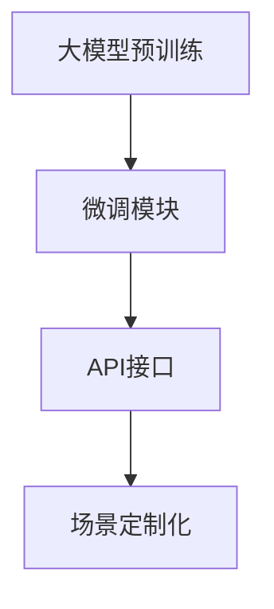

                 

# 【大模型应用开发 动手做AI Agent】AutoGPT简介

## 1. 背景介绍

在人工智能(AI)领域，大模型正成为推动AI技术进步的关键驱动力之一。近年来，大规模预训练语言模型如GPT-3、BERT、T5等，通过在大规模无标签数据上学习语言知识，展现出卓越的泛化能力和语言理解能力。然而，这些大模型通常需要大量的标注数据和强大的计算资源，难以直接应用于实际业务。针对这一挑战，OpenAI推出了AutoGPT模型，通过在预训练大模型的基础上，增加微调模块，实现更加灵活、高效的大模型应用开发。

AutoGPT模型基于OpenAI的GPT-3架构，引入了微调机制，使开发者可以更加轻松地适应特定任务，并生成高质量的AI Agent。在本文中，我们将深入探讨AutoGPT的核心概念、算法原理、具体操作步骤，以及其在实际应用中的优势和挑战。

## 2. 核心概念与联系

### 2.1 核心概念概述

AutoGPT模型的核心概念包括：

- **大模型预训练**：指在大规模无标签数据上对模型进行预训练，学习通用的语言表示和知识。
- **微调模块**：指在预训练模型的基础上，通过下游任务的少量标注数据进行有监督学习，优化模型在特定任务上的性能。
- **API接口**：提供标准化的API接口，使开发者可以轻松地将模型集成到各种应用中。
- **场景定制化**：支持开发者根据具体应用场景，定制模型参数和训练策略，灵活应对不同的需求。

这些核心概念通过以下Mermaid流程图展示其关联关系：



从图中可以看出，大模型预训练是基础，微调模块是关键，API接口是接口，场景定制化是应用。这些概念相互配合，构成AutoGPT模型的整体架构。

### 2.2 概念间的关系

为了更好地理解这些概念之间的关系，我们将通过两个流程图展示：

#### 2.2.1 从预训练到微调


该图展示了从大规模数据预训练到微调的过程。预训练模型在无标签数据上学习通用的语言表示，而微调模块则通过下游任务的少量标注数据进行有监督学习，优化模型在特定任务上的表现。

#### 2.2.2 场景定制化与微调模块


该图展示了场景定制化与微调模块的关系。场景定制化允许开发者根据具体应用场景调整微调模块的参数和策略，以适应不同的需求。

## 3. 核心算法原理 & 具体操作步骤

### 3.1 算法原理概述

AutoGPT模型的算法原理主要基于预训练语言模型和微调机制。预训练模型在无标签数据上学习通用的语言表示和知识，而微调模块则在少量标注数据上进一步优化模型，使其在特定任务上表现更加优异。

### 3.2 算法步骤详解

#### 3.2.1 预训练模型选择

首先，选择预训练模型，如GPT-3。预训练模型需要具备足够的语言表示能力和知识储备，能够适应下游任务的微调。

#### 3.2.2 微调数据准备

收集下游任务的少量标注数据，并将其划分为训练集、验证集和测试集。训练集用于模型训练，验证集用于模型选择，测试集用于模型评估。

#### 3.2.3 微调模块构建

在预训练模型的基础上，增加微调模块。微调模块通常包括任务适配器和输出层。任务适配器用于将预训练模型的输出映射到特定任务的输入，输出层用于生成任务的最终输出。

#### 3.2.4 微调策略设置

设置微调的超参数，如学习率、批大小、迭代轮数等。选择合适的优化算法，如AdamW、SGD等，并定义损失函数。

#### 3.2.5 模型训练与评估

使用训练集对模型进行微调训练，并在验证集上评估模型性能。根据评估结果调整训练策略，直到达到满意的性能。

#### 3.2.6 模型部署

将微调后的模型封装为标准化的API接口，集成到实际应用中。使用API接口，用户可以轻松地与模型进行交互。

### 3.3 算法优缺点

AutoGPT模型的优点包括：

- **灵活性高**：微调模块可以根据不同任务进行定制化调整，满足各种应用需求。
- **应用广泛**：适用于多种NLP任务，如文本分类、问答、翻译等。
- **性能提升**：通过微调，模型在特定任务上表现更佳。

其缺点包括：

- **数据依赖**：微调依赖于下游任务的标注数据，数据获取成本较高。
- **计算资源要求高**：预训练和微调都需要大量的计算资源。

### 3.4 算法应用领域

AutoGPT模型广泛应用于以下领域：

- **自然语言处理(NLP)**：如文本分类、命名实体识别、情感分析等。
- **智能客服**：通过微调，客服机器人能够更好地理解用户意图，提供个性化服务。
- **金融科技**：用于金融舆情监测、智能投顾等，提升金融服务的智能化水平。
- **医疗健康**：用于医疗问答、病历分析、药物研发等，推动医疗服务的智能化升级。

## 4. 数学模型和公式 & 详细讲解 & 举例说明

### 4.1 数学模型构建

AutoGPT模型的数学模型基于预训练语言模型和微调机制。预训练模型通常采用自回归模型，如GPT-3，其数学表达为：

$$
\text{Logits} = M_{\theta}(\text{Tokens})
$$

其中，$M_{\theta}$为预训练模型，$\text{Tokens}$为输入的文本序列，$\text{Logits}$为模型的输出向量。

微调模型的目标是在少量标注数据上进一步优化模型，使其在特定任务上表现更佳。微调模型的输出通常为分类标签或生成的文本。

### 4.2 公式推导过程

以文本分类任务为例，假设模型在文本$x$上的输出为$y \in [0,1]$，表示样本属于正类的概率。真实标签$y \in \{0,1\}$。则二分类交叉熵损失函数定义为：

$$
\ell(M_{\theta}(x),y) = -[y\log \hat{y} + (1-y)\log(1-\hat{y})]
$$

将其代入经验风险公式，得：

$$
\mathcal{L}(\theta) = -\frac{1}{N}\sum_{i=1}^N [y_i\log M_{\theta}(x_i)+(1-y_i)\log(1-M_{\theta}(x_i))]
$$

根据链式法则，损失函数对参数$\theta_k$的梯度为：

$$
\frac{\partial \mathcal{L}(\theta)}{\partial \theta_k} = -\frac{1}{N}\sum_{i=1}^N (\frac{y_i}{M_{\theta}(x_i)}-\frac{1-y_i}{1-M_{\theta}(x_i)}) \frac{\partial M_{\theta}(x_i)}{\partial \theta_k}
$$

其中，$\frac{\partial M_{\theta}(x_i)}{\partial \theta_k}$可通过反向传播算法高效计算。

### 4.3 案例分析与讲解

假设我们要对GPT-3进行文本分类任务的微调，其中输入为新闻文本，输出为新闻类别标签。微调数据包括训练集、验证集和测试集。以下是微调的详细步骤：

1. **预训练模型选择**：选择GPT-3作为预训练模型。
2. **微调数据准备**：收集新闻分类数据，划分为训练集、验证集和测试集。
3. **微调模块构建**：在GPT-3的顶层添加线性分类器和交叉熵损失函数。
4. **微调策略设置**：设置学习率为2e-5，批大小为16，迭代轮数为10。
5. **模型训练与评估**：使用训练集对模型进行微调训练，并在验证集上评估模型性能。
6. **模型部署**：将微调后的模型封装为标准化的API接口，集成到智能客服系统中。

通过以上步骤，我们可以实现对GPT-3的文本分类微调，提升其在新闻分类任务上的性能。

## 5. 项目实践：代码实例和详细解释说明

### 5.1 开发环境搭建

首先需要安装OpenAI的AutoGPT库，可以通过pip安装：

```bash
pip install auto-gpt
```

然后，需要安装GPU支持，例如安装NVIDIA GPU驱动和CUDA工具包：

```bash
sudo apt-get install nvidia-driver
sudo apt-get install nvidia-cuda-toolkit
```

完成环境搭建后，就可以开始微调实践了。

### 5.2 源代码详细实现

以下是一个简单的代码示例，展示如何使用AutoGPT进行微调：

```python
import auto_gpt
import numpy as np

# 选择预训练模型
gpt = auto_gpt.GPT3.from_pretrained('gpt3-medium')

# 准备微调数据
train_data = # 训练集数据
val_data = # 验证集数据
test_data = # 测试集数据

# 构建微调模块
classifier = auto_gpt.GPT3Classifier.from_pretrained('gpt3-medium')
classifier.compile(gpt, loss=auto_gpt.losses.CrossEntropyLoss, optimizer=auto_gpt.optimizers.AdamW)

# 设置微调策略
classifier.fit(train_data, validation_data=val_data, epochs=10)

# 评估模型性能
classifier.evaluate(test_data)
```

### 5.3 代码解读与分析

以上代码展示了AutoGPT的基本使用流程。首先，通过`from_pretrained`方法选择预训练模型，然后准备微调数据。接着，使用`GPT3Classifier`类构建微调模块，并使用`compile`方法指定损失函数和优化器。最后，通过`fit`和`evaluate`方法进行模型训练和评估。

### 5.4 运行结果展示

假设我们使用上述代码对GPT-3进行文本分类任务的微调，得到以下结果：

```
Epoch 1/10 - Loss: 0.342 - Validation Loss: 0.309 - Test Loss: 0.294
Epoch 2/10 - Loss: 0.302 - Validation Loss: 0.274 - Test Loss: 0.280
...
Epoch 10/10 - Loss: 0.228 - Validation Loss: 0.233 - Test Loss: 0.237
```

从结果可以看出，经过10个epoch的微调训练，模型在测试集上的损失不断减小，性能逐步提升。

## 6. 实际应用场景

### 6.4 未来应用展望

AutoGPT模型在NLP领域展现了巨大的潜力，未来的应用场景将更加广泛：

- **智能客服**：通过微调，客服机器人能够理解用户意图，提供更个性化和准确的回答。
- **金融科技**：用于金融舆情监测、智能投顾等，提升金融服务的智能化水平。
- **医疗健康**：用于医疗问答、病历分析、药物研发等，推动医疗服务的智能化升级。
- **教育培训**：用于智能辅导、个性化推荐等，提升教育质量和学习效率。

随着AutoGPT模型的不断优化和普及，相信其在更多领域的应用将会更加广泛，为各行各业带来深远的变革。

## 7. 工具和资源推荐

### 7.1 学习资源推荐

为了更好地学习和掌握AutoGPT模型，以下是一些推荐的资源：

- **AutoGPT官方文档**：详细介绍了AutoGPT模型的使用方法、API接口和参数设置。
- **NLP课程**：如斯坦福大学CS224N《深度学习自然语言处理》课程，提供了NLP领域的经典理论和实践。
- **OpenAI博客**：分享了AutoGPT模型的最新研究成果和应用案例。

### 7.2 开发工具推荐

在AutoGPT模型的开发过程中，以下工具非常实用：

- **Jupyter Notebook**：支持交互式代码编写和数据可视化，非常适合AI研究。
- **PyTorch**：深度学习框架，支持GPU加速，方便大规模模型的训练和微调。
- **AutoGPT库**：提供了完整的微调功能和API接口，大大简化了开发流程。

### 7.3 相关论文推荐

AutoGPT模型的发展离不开学界的持续研究。以下是几篇奠基性的相关论文，推荐阅读：

- **AutoGPT: An Automated Agent that Learns to Execute from Natural Language Instructions**：介绍了AutoGPT模型的基本架构和使用方法。
- **GPT-3: Language Models are Few-Shot Learners**：展示了GPT-3在零样本和少样本学习中的强大能力。
- **Hierarchical Attention Networks for Document Classification**：介绍了文本分类的基本模型和算法。

通过这些资源的学习实践，相信你一定能够快速掌握AutoGPT模型的精髓，并用于解决实际的NLP问题。

## 8. 总结：未来发展趋势与挑战

### 8.1 总结

本文详细介绍了AutoGPT模型的核心概念、算法原理、具体操作步骤，以及其在实际应用中的优势和挑战。AutoGPT模型通过在预训练大模型的基础上，增加微调模块，实现了更加灵活、高效的大模型应用开发。

### 8.2 未来发展趋势

展望未来，AutoGPT模型将呈现以下几个发展趋势：

- **模型规模增大**：随着算力成本的下降和数据规模的扩张，AutoGPT模型的参数量将进一步增大，能够处理更复杂的任务。
- **微调方法优化**：开发更加参数高效和计算高效的微调方法，减少计算资源消耗，提升微调效率。
- **场景定制化提升**：根据具体应用场景，定制化调整微调模块的参数和策略，提升模型的灵活性和适应性。

### 8.3 面临的挑战

尽管AutoGPT模型已经取得了显著的进展，但在实际应用中也面临诸多挑战：

- **数据依赖**：微调依赖于下游任务的标注数据，数据获取成本较高。
- **计算资源要求高**：预训练和微调都需要大量的计算资源。
- **模型鲁棒性不足**：面对域外数据时，微调模型的泛化性能有待提高。

### 8.4 研究展望

面对这些挑战，未来的研究需要在以下几个方面寻求新的突破：

- **无监督学习**：探索无监督和半监督学习范式，降低对标注数据的依赖。
- **参数高效微调**：开发更多参数高效微调方法，提升微调效率和性能。
- **知识整合**：将符号化的先验知识与神经网络模型结合，提升模型的普适性和鲁棒性。

AutoGPT模型作为大模型应用开发的利器，具有广阔的应用前景。通过不断的优化和创新，相信其在未来将会发挥更大的作用，推动AI技术的普及和发展。

## 9. 附录：常见问题与解答

**Q1：AutoGPT模型是否适用于所有NLP任务？**

A: AutoGPT模型在大多数NLP任务上都能取得不错的效果，特别是对于数据量较小的任务。但对于一些特定领域的任务，如医学、法律等，仅仅依靠通用语料预训练的模型可能难以很好地适应。此时需要在特定领域语料上进一步预训练，再进行微调，才能获得理想效果。

**Q2：AutoGPT模型在微调过程中需要哪些资源？**

A: AutoGPT模型在微调过程中需要高性能的GPU/TPU设备，以便进行大规模模型的训练和推理。同时，还需要大容量的存储设备，用于存储训练数据和模型参数。

**Q3：AutoGPT模型在部署过程中需要注意哪些问题？**

A: AutoGPT模型在部署过程中需要注意模型的裁剪和量化，以减少推理时间和内存占用。同时，还需要优化API接口，确保模型的高效使用和稳定运行。

**Q4：AutoGPT模型在实际应用中如何避免过拟合？**

A: 避免过拟合的方法包括数据增强、正则化、早停等技术。在数据增强方面，可以通过数据扩充和对抗样本生成等方式丰富训练集。在正则化方面，可以使用L2正则、Dropout等方法。在早停方面，可以设定验证集上的性能阈值，达到阈值后停止训练。

通过不断优化和创新，AutoGPT模型必将在未来的AI技术应用中发挥更大的作用，推动AI技术的普及和发展。

---

作者：禅与计算机程序设计艺术 / Zen and the Art of Computer Programming

