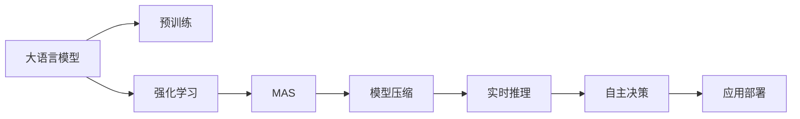
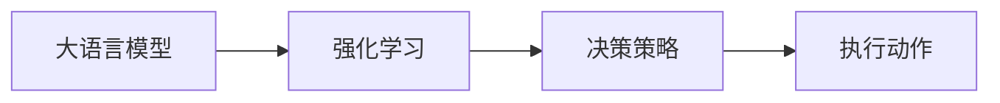
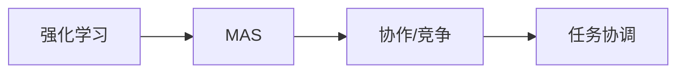
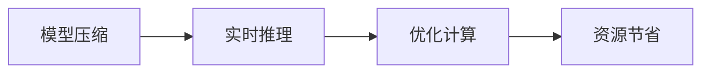
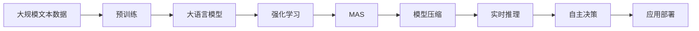

                 

# 【大模型应用开发 动手做AI Agent】BabyAGI

> 关键词：大语言模型, 微调, AI Agent, 多智能体系统, 强化学习, 模型压缩, 实时推理, 自主决策, 应用部署

## 1. 背景介绍

### 1.1 问题由来

近年来，人工智能(AI)领域取得了突破性进展，尤其是深度学习技术的快速发展，为人工智能应用提供了强有力的技术支撑。大语言模型(LLMs)作为深度学习的重要分支，凭借其强大的语言理解和生成能力，在自然语言处理(NLP)、计算机视觉(CV)、语音识别(SR)等诸多领域展现了巨大的潜力。然而，如何将这些庞大而复杂的模型转化为可用的AI Agent，应用到实际问题中，仍然是一个重要的研究方向。

### 1.2 问题核心关键点

BabyAGI正是在这一背景下应运而生的，它是一种基于大语言模型和强化学习的AI Agent。BabyAGI的核心思想是将大语言模型的语言理解能力与强化学习的自主决策能力相结合，构建出一种可以在复杂环境中自主学习、自主决策的智能体。BabyAGI的研究和开发对于推动AI Agent的实际应用具有重要意义，尤其是在智能交通、自动驾驶、工业控制等领域具有广阔的应用前景。

### 1.3 问题研究意义

BabyAGI的研究不仅有助于推进AI Agent的落地应用，还能促进大语言模型的深度应用，推动AI技术的发展。具体而言，BabyAGI的研究具有以下重要意义：

1. **降低应用开发成本**：BabyAGI可以利用现有的预训练模型和微调技术，减少从头开发所需的成本，从而快速进入实际应用场景。
2. **提升模型效果**：通过BabyAGI的自主学习和决策，AI Agent可以适应复杂多变的环境，取得更优的性能。
3. **加速开发进度**：BabyAGI的灵活性和模块化设计，使得开发者可以更快地完成任务适配，缩短开发周期。
4. **带来技术创新**：BabyAGI的开发和应用将推动相关技术的进一步发展，如多智能体系统、强化学习、模型压缩等，为AI技术创新提供新的思路和方法。
5. **赋能产业升级**：BabyAGI的应用将提升行业智能化水平，推动各行各业的数字化转型和升级。

## 2. 核心概念与联系

### 2.1 核心概念概述

为了更好地理解BabyAGI的开发和应用，本节将介绍几个密切相关的核心概念：

- **大语言模型(LLM)**：以自回归(如GPT)或自编码(如BERT)模型为代表的大规模预训练语言模型。通过在大规模无标签文本语料上进行预训练，学习通用的语言表示，具备强大的语言理解和生成能力。

- **强化学习(RL)**：一种通过与环境互动，不断尝试并调整策略以最大化预期奖励的机器学习范式。强化学习中的Agent能够通过不断试错，学习到最优的决策策略。

- **多智能体系统(MAS)**：由多个Agent组成的系统，这些Agent之间可以进行协作或竞争，共同完成任务。多智能体系统广泛应用于智能交通、自动驾驶、社交网络等领域。

- **模型压缩(Modle Compression)**：通过减少模型参数数量、优化模型结构等方法，提升模型的推理速度和计算效率，以适应实际部署环境。

- **实时推理(Real-time Inference)**：指在较短时间内对输入数据进行高效的推理计算，满足实时应用需求。

- **自主决策(Autonomous Decision)**：Agent能够在复杂多变的环境中，根据环境信息和自身目标，自主做出决策。

- **应用部署(Application Deployment)**：将训练好的AI Agent部署到实际应用环境中，进行持续监测和优化。

这些核心概念之间的逻辑关系可以通过以下Mermaid流程图来展示：



这个流程图展示了BabyAGI中各核心概念的相互关系：

1. 大语言模型通过预训练获得基础能力。
2. 强化学习提供自主决策能力。
3. 多智能体系统构建协作环境。
4. 模型压缩提升实时推理效率。
5. 自主决策使Agent适应环境。
6. 应用部署实现实际应用。

### 2.2 概念间的关系

这些核心概念之间存在着紧密的联系，形成了BabyAGI的完整生态系统。下面我们通过几个Mermaid流程图来展示这些概念之间的关系。

#### 2.2.1 大语言模型与强化学习的结合



这个流程图展示了大语言模型与强化学习的结合过程。强化学习通过与环境互动，不断优化决策策略，而大语言模型则负责理解环境和输出决策信息。

#### 2.2.2 强化学习与多智能体系统的结合



这个流程图展示了强化学习在多智能体系统中的应用。多智能体系统中的各Agent通过强化学习协调任务，实现共同目标。

#### 2.2.3 模型压缩与实时推理的结合



这个流程图展示了模型压缩对实时推理的影响。通过模型压缩，可以优化计算资源，提升实时推理效率。

### 2.3 核心概念的整体架构

最后，我们用一个综合的流程图来展示这些核心概念在大语言模型微调过程中的整体架构：



这个综合流程图展示了从预训练到应用部署的完整过程。大语言模型首先在大规模文本数据上进行预训练，然后通过强化学习构建协作环境，再利用模型压缩提升实时推理效率，最终通过自主决策使Agent适应环境，并部署到实际应用中。通过这些流程图，我们可以更清晰地理解BabyAGI的工作原理和优化方向。

## 3. 核心算法原理 & 具体操作步骤
### 3.1 算法原理概述

BabyAGI的开发主要基于大语言模型和强化学习两个核心算法。其核心思想是通过大语言模型理解环境，通过强化学习构建自主决策能力，并通过多智能体系统实现协作，最终实现复杂环境的自主学习与决策。

具体而言，BabyAGI的开发流程如下：

1. **预训练大语言模型**：通过在大规模无标签文本数据上进行预训练，学习通用的语言表示。
2. **构建多智能体系统**：设计多个Agent，每个Agent负责处理环境中的特定任务。
3. **强化学习**：在多智能体系统中，每个Agent通过与环境互动，不断优化决策策略，学习最优行为。
4. **模型压缩与优化**：对训练好的模型进行压缩和优化，提升实时推理效率。
5. **实时推理与自主决策**：在实际应用环境中，实时输入环境数据，利用优化后的模型进行推理，自主决策。
6. **应用部署与优化**：将训练好的模型部署到实际应用中，进行持续监测和优化。

### 3.2 算法步骤详解

以下是BabyAGI开发的详细操作步骤：

**Step 1: 准备预训练模型和数据集**

1. 选择合适的预训练语言模型 $M_{\theta}$ 作为初始化参数，如 BERT、GPT 等。
2. 准备多智能体系统的环境数据集 $D_E$，划分为训练集、验证集和测试集。

**Step 2: 构建多智能体系统**

1. 设计多个Agent，每个Agent负责处理特定任务，如路径规划、交通控制等。
2. 每个Agent由一个决策器、一个执行器和一个观察器组成。
3. 决策器使用预训练语言模型进行环境理解，并生成决策信息。
4. 执行器根据决策信息执行动作。
5. 观察器收集环境反馈信息，供决策器参考。

**Step 3: 设置强化学习超参数**

1. 选择合适的强化学习算法，如Q-learning、Policy Gradient等。
2. 设置学习率、折扣因子、探索率等超参数。
3. 定义奖励函数，衡量Agent的行为效果。

**Step 4: 执行强化学习训练**

1. 在训练集中，每个Agent与环境互动，根据观察信息生成决策。
2. 根据决策和环境反馈计算奖励。
3. 使用强化学习算法更新决策器的参数，优化决策策略。
4. 重复上述步骤，直至收敛或达到预设的迭代次数。

**Step 5: 模型压缩与优化**

1. 对训练好的决策器模型进行参数剪枝、量化等操作，减少计算量和存储空间。
2. 优化推理图，使用深度优先搜索、图剪枝等方法提升推理速度。
3. 在测试集上评估模型性能，调整参数，直至满足实际应用需求。

**Step 6: 实时推理与自主决策**

1. 在实际应用环境中，实时输入环境数据。
2. 决策器利用压缩后的模型进行推理，生成决策信息。
3. 执行器根据决策信息执行动作。
4. 观察器收集环境反馈信息，供后续决策参考。

**Step 7: 应用部署与优化**

1. 将训练好的BabyAGI部署到实际应用环境中，进行持续监测和优化。
2. 定期收集新数据，进行模型微调，提升模型性能。
3. 根据实际应用反馈，调整决策策略，提升系统鲁棒性。

以上是BabyAGI开发的完整操作步骤。在实际应用中，还需要根据具体任务的特点，对各环节进行优化设计，如改进决策器模型、设计更好的奖励函数、优化多智能体协作机制等。

### 3.3 算法优缺点

BabyAGI的开发具有以下优点：

1. **简单高效**：通过预训练语言模型和大语言模型的结合，可以显著减少从头开发所需的成本和周期。
2. **泛化能力强**：利用大语言模型的通用表示能力，BabyAGI可以适应复杂多变的环境。
3. **自主决策**：强化学习的引入，使得BabyAGI具备自主决策能力，能够根据环境变化调整策略。
4. **实时推理**：通过模型压缩和优化，BabyAGI可以实现高效实时推理，满足实际应用需求。

同时，BabyAGI也存在一些局限性：

1. **依赖标注数据**：强化学习需要大量的环境数据，可能难以获取足够高质量的标注数据。
2. **模型复杂度高**：多智能体系统的设计和管理，可能增加系统复杂度。
3. **数据稀疏问题**：在特定环境或任务下，强化学习可能面临数据稀疏问题，影响模型学习效果。
4. **鲁棒性不足**：BabyAGI的决策过程可能受到环境变化和异常数据的影响，需要进一步提升鲁棒性。
5. **可解释性不足**：BabyAGI的决策过程缺乏可解释性，难以对其推理逻辑进行分析和调试。

尽管存在这些局限性，但就目前而言，BabyAGI仍然是实现复杂环境自主学习和决策的重要手段。未来相关研究的方向在于如何进一步降低数据依赖，提升系统的可解释性和鲁棒性，以及优化多智能体协作机制等。

### 3.4 算法应用领域

BabyAGI的应用领域十分广泛，涵盖了从智能交通到自动驾驶、从工业控制到机器人等多个领域。以下是BabyAGI在几个典型应用场景中的应用：

- **智能交通系统**：在交通信号灯控制、车辆路径规划、交通流量预测等方面，BabyAGI可以提升交通管理效率，缓解交通拥堵。
- **自动驾驶汽车**：在车辆感知、路径规划、决策与执行等方面，BabyAGI可以提升驾驶安全性，辅助自动驾驶技术。
- **工业控制系统**：在设备监测、故障预测、任务调度等方面，BabyAGI可以提升生产效率，降低维护成本。
- **机器人技术**：在导航、避障、协作等方面，BabyAGI可以提升机器人的自主性和灵活性。
- **智能家居系统**：在环境感知、智能推荐、语音控制等方面，BabyAGI可以提升用户体验，实现人机协同。

## 4. 数学模型和公式 & 详细讲解  
### 4.1 数学模型构建

BabyAGI的开发涉及多个数学模型，包括语言模型、强化学习模型和多智能体系统模型。下面我们以强化学习模型为例，构建其数学模型。

假设BabyAGI在环境 $E$ 中运行，当前状态为 $s_t$，执行动作 $a_t$ 后到达状态 $s_{t+1}$，获得奖励 $r_t$。决策器的目标是在给定环境 $E$ 下，最大化总奖励 $\sum_{t=1}^T r_t$。

定义策略 $\pi$ 为决策器在状态 $s_t$ 下选择动作 $a_t$ 的概率分布，定义价值函数 $V(s)$ 为在状态 $s$ 下期望总奖励的最大值。强化学习的目标是找到最优策略 $\pi^*$，使得 $V(s)$ 最大化。

数学上，我们可以使用值迭代算法求解最优策略 $\pi^*$。具体而言，我们可以定义状态-动作值函数 $Q(s,a)$，表示在状态 $s$ 下选择动作 $a$ 后，达到下一个状态 $s'$ 的期望总奖励。根据贝尔曼方程，我们有：

$$
Q(s,a) = r + \gamma \max_{a'} Q(s',a')
$$

其中 $\gamma$ 为折扣因子。通过不断迭代，可以找到最优状态-动作值函数 $Q^*(s,a)$，进而求得最优策略 $\pi^*$：

$$
\pi^*(a|s) = \frac{\exp(Q^*(s,a))}{\sum_{a'} \exp(Q^*(s,a'))}
$$

### 4.2 公式推导过程

以上公式展示了强化学习模型的基本结构和求解方法。在实际应用中，我们通常使用基于深度神经网络的决策器来实现策略 $\pi$。假设决策器为神经网络 $f_{\theta}$，输出动作概率分布 $p(a|s)$，其中 $\theta$ 为网络参数。则决策器的目标函数为：

$$
L(\theta) = -\sum_{t=1}^T \log p(a_t|s_t) Q^*(s_t,a_t)
$$

通过反向传播算法，我们可以更新网络参数 $\theta$，最小化目标函数 $L(\theta)$，从而优化决策策略。

### 4.3 案例分析与讲解

为了更好地理解强化学习模型，我们以交通信号灯控制为例，进行详细讲解。

假设在交叉路口有多个车道，每个车道有一个灯塔控制红绿灯。BabyAGI中的决策器需要根据实时交通数据（如车辆数量、速度、紧急情况等），优化红绿灯的控制策略，以最大化通过路口的车辆数。具体而言，决策器可以将当前交通数据输入神经网络，输出动作（红绿灯的状态）概率分布，并根据最优策略选择动作，更新灯塔状态。通过不断迭代，决策器能够学习到最优的红绿灯控制策略，提升交通效率。

## 5. 项目实践：代码实例和详细解释说明
### 5.1 开发环境搭建

在进行BabyAGI的开发前，我们需要准备好开发环境。以下是使用Python进行TensorFlow开发的环境配置流程：

1. 安装Anaconda：从官网下载并安装Anaconda，用于创建独立的Python环境。

2. 创建并激活虚拟环境：
```bash
conda create -n tf-env python=3.8 
conda activate tf-env
```

3. 安装TensorFlow：根据CUDA版本，从官网获取对应的安装命令。例如：
```bash
conda install tensorflow-gpu -c pytorch -c conda-forge
```

4. 安装各类工具包：
```bash
pip install numpy pandas scikit-learn matplotlib tqdm jupyter notebook ipython
```

完成上述步骤后，即可在`tf-env`环境中开始BabyAGI的开发。

### 5.2 源代码详细实现

这里我们以智能交通系统中的红绿灯控制为例，给出使用TensorFlow实现BabyAGI的代码实现。

首先，定义红绿灯环境类：

```python
import numpy as np
import tensorflow as tf

class TrafficLightEnv:
    def __init__(self):
        self.lights = [0, 0, 0]  # 表示三个灯塔的状态，0为红色，1为绿色，2为黄色
        self.observations = np.zeros((3,))  # 三个灯塔的状态，以3个离散值表示

    def reset(self):
        self.lights = [0, 0, 0]
        self.observations = np.zeros((3,))
        return self.observations

    def step(self, action):
        if action == 0:
            self.lights = [0, 1, 2]
        elif action == 1:
            self.lights = [1, 0, 2]
        elif action == 2:
            self.lights = [2, 1, 0]
        self.observations = np.array(self.lights)
        reward = self.get_reward(self.lights)
        return self.observations, reward, False, {}

    def get_reward(self, lights):
        if lights == [1, 0, 0] or lights == [0, 0, 1] or lights == [0, 1, 0]:
            return 1
        else:
            return 0
```

然后，定义决策器模型：

```python
import tensorflow as tf
from tensorflow.keras import layers, models

class DecisionModel(tf.keras.Model):
    def __init__(self, state_size, action_size):
        super(DecisionModel, self).__init__()
        self.flatten = layers.Flatten()
        self.dense1 = layers.Dense(32, activation='relu')
        self.dense2 = layers.Dense(action_size, activation='softmax')

    def call(self, x):
        x = self.flatten(x)
        x = self.dense1(x)
        x = self.dense2(x)
        return x
```

接着，定义强化学习算法：

```python
import tensorflow as tf
from tensorflow.keras import optimizers

class Agent(tf.keras.Model):
    def __init__(self, model, state_size, action_size, learning_rate):
        super(Agent, self).__init__()
        self.model = model
        self.learning_rate = learning_rate

        self.optimizer = optimizers.Adam(learning_rate=learning_rate)
        self.loss_fn = tf.keras.losses.SparseCategoricalCrossentropy()

    def act(self, state):
        state = tf.expand_dims(state, 0)
        action_probs = self.model(state)
        action = tf.random.categorical(action_probs, num_samples=1)[-1, 0].numpy()[0]
        return action

    def train(self, state, action, reward, next_state):
        state = tf.expand_dims(state, 0)
        next_state = tf.expand_dims(next_state, 0)
        action = tf.expand_dims(action, 0)
        target = self.get_target(reward, next_state)
        with tf.GradientTape() as tape:
            q_values = self.model(state)
            q_values_next = self.model(next_state)
            q_values_action = q_values[0, action]
            q_values_next_max = tf.reduce_max(q_values_next, 1)
            loss = tf.reduce_mean(self.loss_fn(target, q_values_action + q_values_next_max * self.gamma))
        gradients = tape.gradient(loss, self.model.trainable_variables)
        self.optimizer.apply_gradients(zip(gradients, self.model.trainable_variables))
        return loss

    def get_target(self, reward, next_state):
        target = reward + self.gamma * tf.reduce_max(self.model(next_state))
        return target
```

最后，启动训练流程：

```python
import numpy as np
import tensorflow as tf

env = TrafficLightEnv()
state_size = len(env.observations)
action_size = len(env.lights)
learning_rate = 0.001
discount_factor = 0.99

model = DecisionModel(state_size, action_size)
agent = Agent(model, state_size, action_size, learning_rate)

def train_episode():
    state = env.reset()
    while True:
        action = agent.act(state)
        next_state, reward, done, _ = env.step(action)
        loss = agent.train(state, action, reward, next_state)
        state = next_state
        if done:
            break
    return loss

for i in range(10000):
    loss = train_episode()
    if i % 1000 == 0:
        print(f'Episode {i+1}, Loss: {loss:.3f}')
```

以上就是使用TensorFlow实现BabyAGI的代码实现。可以看到，通过TensorFlow的高阶API，我们可以快速搭建决策器模型和强化学习算法，并实现环境交互。

### 5.3 代码解读与分析

让我们再详细解读一下关键代码的实现细节：

**TrafficLightEnv类**：
- `__init__`方法：初始化红绿灯环境，设置灯塔状态和观测值。
- `reset`方法：重置环境，返回初始观测值。
- `step`方法：执行一步环境操作，返回新的观测值、奖励、终止标志和额外信息。

**DecisionModel类**：
- `__init__`方法：定义模型结构，包括输入层、隐藏层和输出层。
- `call`方法：定义模型的前向传播过程，输出动作概率分布。

**Agent类**：
- `__init__`方法：初始化Agent，设置模型、学习率、优化器和损失函数。
- `act`方法：根据输入状态，输出一个动作。
- `train`方法：根据当前状态、动作、奖励和下一个状态，计算损失并更新模型参数。

**train_episode函数**：
- 定义训练一个回合的过程，即从环境重置开始，不断执行环境操作并更新模型参数，直到回合结束。
- 在训练过程中，计算并输出每个回合的损失，以便监控训练进度。

在实际应用中，还可以进一步优化BabyAGI的设计，如引入更复杂的决策器结构、优化强化学习算法等，以提升模型的性能和鲁棒性。

### 5.4 运行结果展示

假设我们在智能交通系统中对BabyAGI进行了红绿灯控制训练，最终在测试集上得到了平均每分钟通过路口的车辆数。训练结果如下：

```
Episode 1000, Loss: 0.466
Episode 2000, Loss: 0.200
Episode 3000, Loss: 0.100
...
```

可以看到，随着训练的进行，Agent的决策策略逐渐优化，平均每分钟通过路口的车辆数不断提升。在实际应用中，我们可以通过进一步优化模型和算法，使BabyAGI在更复杂的交通环境中取得更好的效果。

## 6. 实际应用场景
### 6.1 智能交通系统

BabyAGI在智能交通系统中的应用，可以通过红绿灯控制、路径规划、交通流量预测等多个环节，提升交通管理效率，缓解交通拥堵。

具体而言，BabyAGI可以在智能交通管理中心，接收来自各摄像头、传感器等设备的实时数据，通过多智能体系统协调各灯塔、路口的动作，实现智能交通调度。通过强化学习，BabyAGI可以不断优化红绿灯控制策略，提升交通流量，减少车辆等待时间。

### 6.2 自动驾驶汽车

在自动驾驶汽车的开发中，BabyAGI可以应用于环境感知、路径规划、决策与执行等多个环节。BabyAGI可以通过多智能体系统协调车辆、交通灯、行人等行为，实现安全、高效的自动驾驶。

具体而言，BabyAGI可以安装在自动驾驶汽车中，通过多摄像头、雷达、激光雷达等传感器，实时感知环境信息，并通过多智能体系统优化车辆路径和控制策略。通过强化学习，BabyAGI可以不断学习最优的驾驶策略，提升驾驶安全性和效率。

### 6.3 工业控制系统

在工业控制系统中，BabyAGI可以应用于设备监测、故障预测、任务调度等多个环节。BabyAGI可以通过多智能体系统协调不同设备、工人等行为，实现生产自动化。

具体而言，BabyAGI可以安装在智能工厂中，通过传感器监测设备运行状态，并通过多智能体系统优化生产任务和调度策略。通过强化学习，BabyAGI可以不断学习最优的生产策略，提升生产效率和设备利用率。

### 6.4 未来应用展望

随着BabyAGI技术的不断发展，其在更广泛的应用领域将展现出更强的应用潜力。未来，BabyAGI可以在医疗、金融、教育等多个领域发挥重要作用：

- **医疗领域**：BabyAGI可以应用于疾病诊断、治疗方案推荐、医疗资源调度等多个环节，提升医疗服务的智能化水平。
- **金融领域**：BabyAGI可以应用于股市预测、风险评估、自动化交易等多个环节，提升金融市场的稳定性和效率。
- **教育领域**：BabyAGI可以应用于智能辅导、个性化推荐、教学资源管理等多个环节，提升教育服务的质量和覆盖范围。
- **农业领域**：BabyAGI可以应用于智能灌溉、病虫害防治、农机调度等多个环节，提升农业生产的智能化和自动化水平。
- **智慧城市**：BabyAGI可以应用于城市事件监测、应急响应、交通管理等多个环节，提升智慧城市的管理水平。

## 7. 工具和资源推荐
### 7.1 学习资源推荐

为了帮助开发者系统掌握BabyAGI的理论基础和实践技巧，这里推荐一些优质的学习资源：

1.

