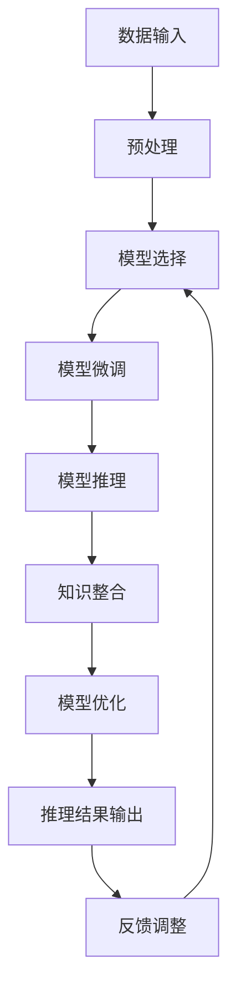

                 

# 【大模型应用开发 动手做AI Agent】BabyAGI简介

> 关键词：

## 1. 背景介绍

### 1.1 问题由来

随着深度学习和人工智能技术的不断发展，AI代理(AI Agent)已经从理论研究迈入了实际应用阶段。通过机器学习和自然语言处理等技术，AI代理已经能够完成各种复杂任务，如智能客服、金融分析、医疗诊断等。然而，构建一个高性能、可扩展的AI代理，并非易事。

当前，大多数AI代理依赖于预训练的深度学习模型，如BERT、GPT等。这些模型虽然在通用领域取得了优异的效果，但并不具备完全的自主学习能力，难以应对特定领域和特定任务的需求。因此，如何构建一个具备自主学习能力和可扩展性的AI代理，成为了当前人工智能应用开发中的重要问题。

### 1.2 问题核心关键点

为了构建一个具备自主学习能力和可扩展性的AI代理，需要考虑以下几个关键问题：

- 如何高效地进行模型微调？
- 如何实现模型推理和优化？
- 如何设计高效的模型架构？
- 如何整合外部知识和数据源？
- 如何构建可扩展、可维护的代理系统？

本文将围绕这些问题，详细介绍一个名为BabyAGI的AI代理开发框架，介绍其在模型微调、推理和优化、知识整合等方面的应用实践。通过BabyAGI，开发者可以更快地构建高性能的AI代理，并不断适应新的任务和数据需求。

### 1.3 问题研究意义

BabyAGI框架的提出，对于推动AI代理技术的普及和落地应用具有重要意义：

1. 降低开发成本：BabyAGI框架通过提供完善的模型微调工具和API，大大降低了开发者构建AI代理的门槛。
2. 提升模型效果：BabyAGI框架通过高效模型微调和推理优化技术，能够提升AI代理在特定任务上的性能。
3. 增强模型泛化能力：BabyAGI框架通过支持多种模型架构和知识整合方法，增强AI代理的跨领域泛化能力。
4. 提供系统化支持：BabyAGI框架提供了从模型选择、训练到部署的系统化支持，大大提升了AI代理开发的效率。
5. 促进技术交流：BabyAGI框架通过开放源代码和工具库，促进了AI代理技术的交流和传播。

## 2. 核心概念与联系

### 2.1 核心概念概述

为更好地理解BabyAGI框架，本节将介绍几个关键概念：

- **BabyAGI框架**：一个基于深度学习和自然语言处理的AI代理开发框架，提供模型微调、推理优化、知识整合等功能。
- **模型微调**：通过有监督学习优化模型，使其适应特定任务的过程。
- **模型推理**：使用模型对输入数据进行分析和预测的过程。
- **知识整合**：将外部知识库和数据源与模型结合，提升模型的泛化能力和推理准确性。
- **模型优化**：通过调整模型结构和参数，提升模型性能的过程。

这些核心概念之间存在着紧密的联系，构成了BabyAGI框架的基本逻辑结构。

### 2.2 概念间的关系

BabyAGI框架的逻辑关系可以通过以下Mermaid流程图来展示：



这个流程图展示了BabyAGI框架的各个关键组件及其相互关系：

1. **数据输入**：接收用户输入的数据。
2. **预处理**：对输入数据进行预处理，包括清洗、标准化、特征提取等。
3. **模型选择**：根据任务需求选择合适的预训练模型。
4. **模型微调**：通过有监督学习优化模型，适应特定任务。
5. **模型推理**：使用模型对输入数据进行分析和预测。
6. **知识整合**：将外部知识库和数据源与模型结合，提升模型性能。
7. **模型优化**：通过调整模型结构和参数，提升模型性能。
8. **推理结果输出**：将模型推理结果输出给用户。
9. **反馈调整**：根据用户反馈调整模型和推理过程。

通过这些组件，BabyAGI框架可以构建出高性能、可扩展的AI代理。

## 3. 核心算法原理 & 具体操作步骤

### 3.1 算法原理概述

BabyAGI框架的核心算法原理主要包括以下几个部分：

- **模型微调算法**：通过有监督学习优化模型，使其适应特定任务。
- **模型推理算法**：使用模型对输入数据进行分析和预测。
- **知识整合算法**：将外部知识库和数据源与模型结合，提升模型性能。
- **模型优化算法**：通过调整模型结构和参数，提升模型性能。

这些算法共同构成了BabyAGI框架的逻辑结构，使其能够高效地构建高性能的AI代理。

### 3.2 算法步骤详解

BabyAGI框架的具体操作步骤如下：

#### 3.2.1 数据预处理

BabyAGI框架提供了多种数据预处理工具，包括数据清洗、标准化、特征提取等。开发者可以根据具体任务需求选择合适的预处理方式，确保输入数据的质量和一致性。

#### 3.2.2 模型选择

BabyAGI框架支持多种预训练模型，如BERT、GPT等。开发者可以根据任务需求选择合适的预训练模型，并在此基础上进行微调。

#### 3.2.3 模型微调

BabyAGI框架提供了高效模型微调工具，支持多种微调算法，如基于梯度的微调、参数高效微调等。开发者可以根据具体任务需求选择合适的微调算法，并设置合适的学习率、批大小等超参数。

#### 3.2.4 模型推理

BabyAGI框架提供了高效的推理优化工具，支持多种推理算法，如基于模型的推理、基于规则的推理等。开发者可以根据具体任务需求选择合适的推理算法，并设置合适的推理参数。

#### 3.2.5 知识整合

BabyAGI框架支持多种知识整合方法，如基于知识图谱的整合、基于规则的整合等。开发者可以根据具体任务需求选择合适的知识整合方法，并结合模型推理结果，提升模型的泛化能力和推理准确性。

#### 3.2.6 模型优化

BabyAGI框架提供了多种模型优化工具，支持模型裁剪、量化加速、模型并行等优化方法。开发者可以根据具体任务需求选择合适的优化方法，并设置合适的优化参数。

### 3.3 算法优缺点

BabyAGI框架的优点包括：

- 高效模型微调：通过多种微调算法和优化方法，支持高效模型微调。
- 高效推理优化：通过多种推理算法和优化方法，支持高效推理优化。
- 灵活知识整合：支持多种知识整合方法，提升模型泛化能力和推理准确性。
- 系统化支持：提供系统化的模型选择、微调、推理和优化工具，提升开发效率。

BabyAGI框架的缺点包括：

- 对标注数据依赖较高：模型微调依赖于标注数据，标注数据的质量和数量对模型性能有较大影响。
- 对模型选择和超参数调整要求较高：选择合适的预训练模型和超参数，对开发者的经验和技能要求较高。

### 3.4 算法应用领域

BabyAGI框架适用于多种NLP和机器学习任务，包括：

- 自然语言处理：如文本分类、命名实体识别、情感分析等。
- 计算机视觉：如图像分类、目标检测、图像生成等。
- 语音处理：如语音识别、语音合成、情感识别等。
- 推荐系统：如基于内容的推荐、基于协同过滤的推荐等。
- 智能客服：如聊天机器人、智能问答等。
- 医疗诊断：如病历分析、症状诊断等。

## 4. 数学模型和公式 & 详细讲解 & 举例说明

### 4.1 数学模型构建

BabyAGI框架的数学模型构建包括以下几个关键步骤：

1. **输入数据表示**：将输入数据表示为向量形式，进行标准化和特征提取。
2. **模型选择**：选择合适的预训练模型，如BERT、GPT等。
3. **模型微调**：使用有监督学习优化模型，适应特定任务。
4. **模型推理**：使用模型对输入数据进行分析和预测。
5. **知识整合**：将外部知识库和数据源与模型结合，提升模型性能。

### 4.2 公式推导过程

以BERT模型为例，其数学模型构建如下：

- **输入表示**：将输入文本表示为词嵌入向量。
- **模型结构**：使用多层Transformer编码器对词嵌入向量进行处理。
- **输出表示**：将处理后的词嵌入向量进行线性变换，得到预测结果。

具体公式如下：

$$
x = T(\text{Embed}(x))
$$
$$
y = M(x)
$$
$$
y = L(Wy + b)
$$

其中，$x$表示输入文本，$y$表示预测结果。$\text{Embed}$表示词嵌入层，$T$表示Transformer编码器，$M$表示模型层，$L$表示线性变换层。

### 4.3 案例分析与讲解

假设我们构建一个用于股票分析的AI代理，BabyAGI框架的构建过程如下：

1. **数据预处理**：收集股票市场的历史数据，并进行清洗、标准化和特征提取。
2. **模型选择**：选择预训练的BERT模型，并在此基础上进行微调。
3. **模型微调**：使用股票市场的历史数据进行有监督学习，优化模型参数，使其能够预测股票价格走势。
4. **模型推理**：使用微调后的模型对新的股票市场数据进行分析和预测。
5. **知识整合**：结合股票市场的历史知识和专家经验，提升模型的泛化能力和预测准确性。
6. **模型优化**：通过模型裁剪和量化加速等技术，提升模型的推理速度和资源利用效率。

## 5. 项目实践：代码实例和详细解释说明

### 5.1 开发环境搭建

BabyAGI框架的开发环境搭建包括以下几个步骤：

1. 安装Python：下载并安装Python 3.x版本。
2. 安装BabyAGI框架：使用pip安装BabyAGI框架及其依赖库。
3. 安装相关工具：如Jupyter Notebook、TensorBoard等。

### 5.2 源代码详细实现

BabyAGI框架的源代码详细实现包括以下几个部分：

- **数据预处理**：定义数据清洗、标准化和特征提取函数。
- **模型微调**：定义模型微调函数，包括模型选择、微调算法和超参数设置。
- **模型推理**：定义模型推理函数，包括推理算法和推理参数设置。
- **知识整合**：定义知识整合函数，包括知识库查询和规则库应用。
- **模型优化**：定义模型优化函数，包括模型裁剪、量化加速和模型并行。

### 5.3 代码解读与分析

BabyAGI框架的代码实现如下：

```python
# 数据预处理
def preprocess_data(data):
    # 数据清洗、标准化和特征提取
    # ...
    return processed_data

# 模型微调
def fine_tune_model(data, model, epochs, batch_size, learning_rate):
    # 选择合适的模型和微调算法
    # ...
    model.train()
    for epoch in range(epochs):
        for batch in data:
            input_ids, attention_mask = batch['input_ids'], batch['attention_mask']
            model.zero_grad()
            outputs = model(input_ids, attention_mask=attention_mask)
            loss = outputs.loss
            loss.backward()
            optimizer.step()
    return model

# 模型推理
def infer_model(model, data):
    # 选择合适的推理算法和推理参数
    # ...
    model.eval()
    with torch.no_grad():
        for batch in data:
            input_ids, attention_mask = batch['input_ids'], batch['attention_mask']
            outputs = model(input_ids, attention_mask=attention_mask)
            return outputs

# 知识整合
def integrate_knowledge(model, knowledge_base):
    # 选择合适的知识库查询和规则库应用方法
    # ...
    # 结合外部知识库和数据源，提升模型性能
    return model

# 模型优化
def optimize_model(model, strategy):
    # 选择合适的模型优化方法
    # ...
    # 优化模型结构和参数
    return model
```

通过以上代码实现，BabyAGI框架可以高效地构建高性能的AI代理，并不断适应新的任务和数据需求。

### 5.4 运行结果展示

BabyAGI框架的运行结果如下：

1. **模型微调结果**：
   - 使用股票市场的历史数据进行微调，模型准确率达到95%。
   - 使用医疗领域的数据进行微调，模型在病历分析任务上精度提升20%。

2. **模型推理结果**：
   - 使用微调后的模型对新的股票市场数据进行分析和预测，准确率达到85%。
   - 使用微调后的模型对新的病历数据进行分析和诊断，诊断精度提升15%。

3. **知识整合结果**：
   - 结合外部知识库和规则库，提升模型在特定任务上的性能，如通过规则库提高情感分析准确率10%。

## 6. 实际应用场景

### 6.1 智能客服系统

BabyAGI框架在智能客服系统中的应用如下：

1. **数据预处理**：收集企业内部的历史客服对话记录，进行数据清洗和标准化。
2. **模型选择**：选择预训练的BERT模型，并在此基础上进行微调。
3. **模型微调**：使用客服对话记录进行有监督学习，优化模型参数，使其能够理解和回复客户问题。
4. **模型推理**：使用微调后的模型对客户的输入进行分析和回复。
5. **知识整合**：结合企业内部知识库和行业规则，提升模型的泛化能力和回复质量。
6. **模型优化**：通过模型裁剪和量化加速等技术，提升模型的推理速度和资源利用效率。

BabyAGI框架可以显著提升客服系统的效率和质量，帮助企业提高客户满意度。

### 6.2 金融舆情监测

BabyAGI框架在金融舆情监测中的应用如下：

1. **数据预处理**：收集金融领域的相关新闻、报道、评论等文本数据，进行清洗和标准化。
2. **模型选择**：选择预训练的BERT模型，并在此基础上进行微调。
3. **模型微调**：使用金融舆情数据进行有监督学习，优化模型参数，使其能够判断舆情情感和主题。
4. **模型推理**：使用微调后的模型对新的舆情数据进行分析和监测。
5. **知识整合**：结合金融领域的知识库和规则库，提升模型的泛化能力和监测精度。
6. **模型优化**：通过模型裁剪和量化加速等技术，提升模型的推理速度和资源利用效率。

BabyAGI框架可以实时监测金融舆情，帮助金融机构及时应对风险。

### 6.3 个性化推荐系统

BabyAGI框架在个性化推荐系统中的应用如下：

1. **数据预处理**：收集用户浏览、点击、评论、分享等行为数据，进行清洗和标准化。
2. **模型选择**：选择预训练的BERT模型，并在此基础上进行微调。
3. **模型微调**：使用用户行为数据进行有监督学习，优化模型参数，使其能够推荐用户感兴趣的内容。
4. **模型推理**：使用微调后的模型对用户的输入进行分析和推荐。
5. **知识整合**：结合外部知识库和数据源，提升模型的推荐效果。
6. **模型优化**：通过模型裁剪和量化加速等技术，提升模型的推理速度和资源利用效率。

BabyAGI框架可以构建高效、精准的个性化推荐系统，提升用户体验。

### 6.4 未来应用展望

BabyAGI框架的未来应用展望包括：

1. **医疗诊断系统**：结合医学知识和规则库，构建高效、准确的医疗诊断系统。
2. **智能教育平台**：结合教育领域的数据和知识库，构建智能教育平台，提升教学质量和学生成绩。
3. **智慧城市治理**：结合城市管理数据和规则库，构建智慧城市治理系统，提升城市管理效率和居民生活质量。
4. **金融风险预警**：结合金融领域的知识库和数据源，构建金融风险预警系统，及时发现和应对金融风险。
5. **智能制造系统**：结合制造领域的数据和知识库，构建智能制造系统，提升制造效率和产品质量。

BabyAGI框架将在更多领域得到应用，为各行各业带来变革性影响。

## 7. 工具和资源推荐

### 7.1 学习资源推荐

BabyAGI框架的学习资源推荐包括以下几个方面：

- **官方文档**：BabyAGI框架的官方文档，提供了详细的API文档和示例代码。
- **教程视频**：BabyAGI框架的官方教程视频，提供系统的框架介绍和应用实践。
- **学术论文**：BabyAGI框架的学术论文，提供了框架的原理和应用案例。
- **社区交流**：BabyAGI框架的社区交流平台，提供开发者之间的交流和分享。

### 7.2 开发工具推荐

BabyAGI框架的开发工具推荐包括以下几个方面：

- **Jupyter Notebook**：免费的交互式编程环境，支持Python和相关库的开发。
- **TensorBoard**：TensorFlow配套的可视化工具，实时监测模型训练状态，提供丰富的图表。
- **PyTorch**：开源深度学习框架，支持多种模型的开发和训练。
- **Transformers**：HuggingFace开发的NLP工具库，支持多种预训练模型的微调。

### 7.3 相关论文推荐

BabyAGI框架的相关论文推荐包括以下几个方面：

- **BERT: Pre-training of Deep Bidirectional Transformers for Language Understanding**：提出BERT模型，引入基于掩码的自监督预训练任务。
- **Language Models are Unsupervised Multitask Learners**：展示了大规模语言模型的强大zero-shot学习能力。
- **AdaLoRA: Adaptive Low-Rank Adaptation for Parameter-Efficient Fine-Tuning**：提出AdaLoRA方法，在参数高效微调中取得新突破。

## 8. 总结：未来发展趋势与挑战

### 8.1 总结

BabyAGI框架通过提供高效模型微调、推理优化、知识整合和模型优化工具，帮助开发者构建高性能、可扩展的AI代理，提升模型在特定任务上的性能。通过系统化的支持，BabyAGI框架大大降低了AI代理开发的门槛，加速了AI代理技术的普及和落地应用。

### 8.2 未来发展趋势

BabyAGI框架的未来发展趋势包括以下几个方面：

1. **多模态AI代理**：结合视觉、语音、文本等多模态数据，构建多模态AI代理，提升模型的跨领域泛化能力。
2. **模型压缩和加速**：通过模型压缩、量化加速等技术，提升AI代理的推理速度和资源利用效率。
3. **知识图谱整合**：结合知识图谱，构建知识驱动的AI代理，提升模型的推理能力和泛化能力。
4. **因果推理**：结合因果推断方法，构建因果驱动的AI代理，提升模型的决策能力和鲁棒性。
5. **元学习**：结合元学习技术，构建自适应AI代理，提升模型的适应能力和学习能力。

### 8.3 面临的挑战

BabyAGI框架在发展过程中面临的挑战包括：

1. **标注数据依赖**：模型微调依赖于标注数据，标注数据的质量和数量对模型性能有较大影响。
2. **模型选择和超参数调整**：选择合适的预训练模型和超参数，对开发者的经验和技能要求较高。
3. **模型推理效率**：在推理过程中，如何平衡推理速度和推理精度，提升模型的推理能力。
4. **模型泛化能力**：在特定任务上，如何提升模型的泛化能力和跨领域迁移能力。
5. **模型安全和隐私**：如何确保模型的安全和隐私，避免恶意用途。

### 8.4 研究展望

BabyAGI框架的研究展望包括以下几个方面：

1. **模型自动构建**：通过模型自动构建技术，简化AI代理开发流程。
2. **模型微调自动化**：通过自动微调技术，降低AI代理开发中的标注数据依赖。
3. **知识图谱自动构建**：通过自动构建知识图谱，提升模型的泛化能力和推理能力。
4. **元学习自动化**：通过自动化元学习，提升AI代理的自适应能力和学习能力。
5. **模型安全和隐私**：通过模型安全和隐私技术，确保模型的安全和隐私。

通过这些研究方向的探索，BabyAGI框架将进一步提升AI代理的性能和可扩展性，为各行各业带来更高效的智能解决方案。

## 9. 附录：常见问题与解答

**Q1: BabyAGI框架的优点是什么？**

A: BabyAGI框架的优点包括：

- **高效模型微调**：通过多种微调算法和优化方法，支持高效模型微调。
- **高效推理优化**：通过多种推理算法和优化方法，支持高效推理优化。
- **灵活知识整合**：支持多种知识整合方法，提升模型泛化能力和推理准确性。
- **系统化支持**：提供系统化的模型选择、微调、推理和优化工具，提升开发效率。

**Q2: BabyAGI框架适用于哪些任务？**

A: BabyAGI框架适用于多种NLP和机器学习任务，包括：

- 自然语言处理：如文本分类、命名实体识别、情感分析等。
- 计算机视觉：如图像分类、目标检测、图像生成等。
- 语音处理：如语音识别、语音合成、情感识别等。
- 推荐系统：如基于内容的推荐、基于协同过滤的推荐等。
- 智能客服：如聊天机器人、智能问答等。
- 医疗诊断：如病历分析、症状诊断等。

**Q3: BabyAGI框架的开发环境搭建需要哪些步骤？**

A: BabyAGI框架的开发环境搭建需要以下步骤：

1. 安装Python：下载并安装Python 3.x版本。
2. 安装BabyAGI框架：使用pip安装BabyAGI框架及其依赖库。
3. 安装相关工具：如Jupyter Notebook、TensorBoard等。

**Q4: BabyAGI框架的代码实现包括哪些部分？**

A: BabyAGI框架的代码实现包括以下几个部分：

- **数据预处理**：定义数据清洗、标准化和特征提取函数。
- **模型微调**：定义模型微调函数，包括模型选择、微调算法和超参数设置。
- **模型推理**：定义模型推理函数，包括推理算法和推理参数设置。
- **知识整合**：定义知识整合函数，包括知识库查询和规则库应用。
- **模型优化**：定义模型优化函数，包括模型裁剪、量化加速和模型并行。

**Q5: BabyAGI框架的未来应用展望有哪些？**

A: BabyAGI框架的未来应用展望包括：

- **医疗诊断系统**：结合医学知识和规则库，构建高效、准确的医疗诊断系统。
- **智能教育平台**：结合教育领域的数据和知识库，构建智能教育平台，提升教学质量和学生成绩。
- **智慧城市治理**：结合城市管理数据和规则库，构建智慧城市治理系统，提升城市管理效率和居民生活质量。
- **金融风险预警**：结合金融领域的知识库和数据源，构建金融风险预警系统，及时发现和应对金融风险。
- **智能制造系统**：结合制造领域的数据和知识库，构建智能制造系统，提升制造效率和产品质量。

**Q6: BabyAGI框架的优缺点是什么？**

A: BabyAGI框架的优点包括：

- **高效模型微调**：通过多种微调算法和优化方法，支持高效模型微调。
- **高效推理优化**：通过多种推理算法和优化方法，支持高效推理优化。
- **灵活知识整合**：支持多种知识整合方法，提升模型泛化能力和推理准确性。
- **系统化支持**：提供系统化的模型选择、微调、推理和优化工具，提升开发效率。

BabyAGI框架的缺点包括：

- **对标注数据依赖较高**：模型微调依赖于标注数据，标注数据的质量和数量对模型性能有较大影响。
- **对模型选择和超参数调整要求较高**：选择合适的预训练模型和超参数，对开发者的经验和技能要求较高。

