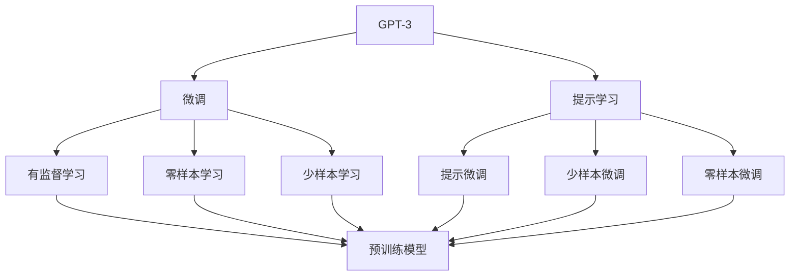

                 

# 【大模型应用开发 动手做AI Agent】OpenAI API和Agent开发

> 关键词：
```javascript
OpenAI API, AI Agent, GPT-3, Python, OpenAI Codex, AI Development, Natural Language Processing (NLP)
```

## 1. 背景介绍

### 1.1 问题由来

近年来，人工智能(AI)技术的迅速发展，特别是自然语言处理(NLP)领域的大模型技术，已经引起了业界的广泛关注。这些大模型通过在大量无标签文本数据上进行预训练，学习到丰富的语言知识，能够执行复杂的语言理解和生成任务。其中，OpenAI公司开发的GPT-3（Generative Pre-trained Transformer 3）大模型因其强大的语言理解和生成能力，在自然语言处理、代码生成、对话系统等领域展现出了卓越的性能。

然而，尽管GPT-3表现出色，但它仍然是一个预训练模型，缺乏针对特定任务的微调能力。为了更好地适应特定应用场景，如何在GPT-3的基础上构建高效、可解释的AI Agent，成为了一个重要的问题。

### 1.2 问题核心关键点

为了构建高性能的AI Agent，我们需要解决以下关键问题：

1. **数据获取与预处理**：收集和处理特定任务的数据集。
2. **模型选择与微调**：选择合适的模型架构，并在特定任务上进行微调。
3. **功能实现与集成**：开发具有特定功能的AI Agent，并将其集成到实际应用中。
4. **性能评估与优化**：评估AI Agent的性能，并进行持续优化。

### 1.3 问题研究意义

构建基于大模型的AI Agent，对于推动AI技术在各行各业的应用具有重要意义：

1. **降低开发成本**：利用大模型的预训练能力，可以显著减少从头开发所需的资源和时间。
2. **提升模型效果**：通过微调，使模型更加适应特定任务，提升模型的性能。
3. **加速开发进度**：基于大模型的微调范式，可以加速AI Agent的开发和部署。
4. **促进技术创新**：微调技术促进了对大模型的深入研究，催生了提示学习、少样本学习等新的研究方向。
5. **赋能产业升级**：基于大模型的AI Agent，可以赋能传统行业数字化转型升级，提升其智能化水平。

## 2. 核心概念与联系

### 2.1 核心概念概述

在构建基于GPT-3的AI Agent之前，我们需要理解以下几个核心概念：

- **GPT-3**：由OpenAI开发的预训练语言模型，具备强大的语言生成和理解能力。
- **AI Agent**：具有特定功能的智能体，能够根据环境变化做出决策，执行任务。
- **微调**：通过在有标签的数据集上训练，调整预训练模型参数，以适应特定任务。
- **提示学习**：通过设计特定格式的输入，引导模型执行特定任务，减少微调参数。
- **少样本学习**：在仅有少量标注样本的情况下，模型能够快速适应新任务。
- **零样本学习**：模型在没有见过任何特定任务的训练样本的情况下，仅凭任务描述就能够执行新任务。

### 2.2 核心概念间的关系

这些核心概念之间的关系可以通过以下Mermaid流程图来展示：



这个流程图展示了从预训练模型到微调，再到不同学习方式的路径：

1. **预训练模型**：GPT-3作为预训练模型，已经学习到了大量的语言知识。
2. **微调**：通过在有标签数据集上训练，调整模型参数以适应特定任务。
3. **提示学习**：通过设计特定格式的输入，引导模型执行特定任务。
4. **少样本学习**：在少量标注样本的情况下，模型能够快速适应新任务。
5. **零样本学习**：模型在没有见过任何特定任务的训练样本的情况下，仅凭任务描述就能够执行新任务。

这些概念共同构成了基于GPT-3构建AI Agent的基础框架，使得我们能够更高效地开发和部署智能体。

## 3. 核心算法原理 & 具体操作步骤

### 3.1 算法原理概述

构建基于GPT-3的AI Agent，本质上是将GPT-3作为特征提取器，通过有监督学习对特定任务进行微调，从而实现其执行特定功能的能力。这一过程可以分为以下几个步骤：

1. **数据收集与预处理**：收集与特定任务相关的数据集，并进行清洗、标注等预处理。
2. **模型选择与微调**：选择适合的模型架构，并在特定任务上进行微调。
3. **功能实现与集成**：开发AI Agent的功能模块，并将其集成到实际应用中。
4. **性能评估与优化**：评估AI Agent的性能，并进行持续优化。

### 3.2 算法步骤详解

以下是基于GPT-3构建AI Agent的具体步骤：

**Step 1: 准备数据集**
- 收集与特定任务相关的数据集。例如，如果需要构建一个简单的聊天机器人，可以收集一些对话记录，作为训练数据。
- 对数据集进行清洗、标注等预处理，确保数据的质量和可用性。

**Step 2: 搭建模型架构**
- 选择合适的模型架构，例如，可以使用GPT-3的原始架构，也可以根据自己的需求进行微调。
- 添加任务相关的输出层和损失函数。例如，对于对话任务，可以在模型的顶层添加一个全连接层，使用交叉熵损失函数。

**Step 3: 微调模型**
- 使用GPT-3的API，加载预训练模型。
- 使用训练数据集对模型进行微调。可以使用PyTorch等深度学习框架，编写代码进行模型训练。
- 在训练过程中，使用适当的正则化技术，如L2正则、Dropout等，防止过拟合。

**Step 4: 实现功能模块**
- 根据AI Agent的具体功能需求，开发相应的功能模块。例如，对于聊天机器人，需要实现对话生成、意图识别等功能。
- 将微调后的模型集成到AI Agent中，进行功能实现。

**Step 5: 性能评估与优化**
- 使用测试集对AI Agent进行性能评估，评估指标包括准确率、召回率等。
- 根据评估结果，对AI Agent进行优化，提高其性能。

### 3.3 算法优缺点

**优点**：
1. **效率高**：利用GPT-3的预训练能力，可以显著减少从头开发所需的资源和时间。
2. **效果显著**：通过微调，使模型更加适应特定任务，提升模型的性能。
3. **功能灵活**：可以根据实际需求，开发具有多种功能的AI Agent。

**缺点**：
1. **依赖数据**：微调效果很大程度上取决于数据的质量和数量，获取高质量标注数据的成本较高。
2. **可解释性不足**：GPT-3等大模型的决策过程通常缺乏可解释性，难以对其推理逻辑进行分析和调试。
3. **资源消耗大**：大模型的计算和存储资源消耗较大，需要在高性能计算平台上进行部署。

### 3.4 算法应用领域

基于GPT-3的AI Agent已经被广泛应用于多个领域，例如：

- **对话系统**：构建聊天机器人、虚拟助手等，提供人机交互功能。
- **自然语言生成**：生成文章、摘要、对话等，辅助内容创作和自动化翻译。
- **代码生成**：自动生成代码片段，辅助软件开发。
- **智能推荐**：根据用户行为，推荐个性化内容，提升用户体验。

## 4. 数学模型和公式 & 详细讲解 & 举例说明

### 4.1 数学模型构建

在构建基于GPT-3的AI Agent时，我们需要使用一些数学模型和公式来进行模型训练和评估。以下是一个简单的例子：

假设我们的任务是生成一段文本，模型输入为序列 $x_1, x_2, ..., x_n$，输出为文本序列 $y_1, y_2, ..., y_n$。我们可以使用以下数学模型来构建损失函数：

$$
\mathcal{L}(\theta) = -\frac{1}{N} \sum_{i=1}^N \log P(y_i|x_1, x_2, ..., x_n; \theta)
$$

其中，$\theta$ 为模型的参数，$P(y_i|x_1, x_2, ..., x_n; \theta)$ 为模型在给定输入序列 $x_1, x_2, ..., x_n$ 的情况下，生成文本序列 $y_i$ 的概率。

### 4.2 公式推导过程

在构建上述损失函数时，我们需要进行以下步骤：

1. **模型定义**：首先定义一个生成模型 $P(y_i|x_1, x_2, ..., x_n; \theta)$，其中 $\theta$ 为模型的参数。
2. **概率计算**：在给定输入序列 $x_1, x_2, ..., x_n$ 的情况下，计算生成文本序列 $y_i$ 的概率。
3. **损失函数**：使用交叉熵损失函数来计算模型的损失，最小化损失函数以优化模型参数。

**示例**：

假设我们使用的是GPT-3模型，我们可以使用以下代码来定义损失函数：

```python
import torch
import torch.nn as nn

class GPT3(nn.Module):
    def __init__(self):
        super(GPT3, self).__init__()
        # 定义模型结构
        self.encoder = nn.LSTM(input_size, hidden_size, num_layers)
        self.decoder = nn.Linear(hidden_size, output_size)
        self.softmax = nn.Softmax(dim=-1)

    def forward(self, x, y):
        # 前向传播
        encoder_output, _ = self.encoder(x)
        decoder_output = self.decoder(encoder_output)
        loss = -torch.log(self.softmax(decoder_output)).mean()
        return loss
```

在训练过程中，我们可以使用以下代码来计算损失函数：

```python
import torch
import torch.optim as optim

# 加载模型
model = GPT3()

# 加载训练数据
x_train = torch.randn(batch_size, seq_length)
y_train = torch.randn(batch_size, seq_length)

# 定义优化器和损失函数
optimizer = optim.Adam(model.parameters())
loss_fn = nn.CrossEntropyLoss()

# 训练模型
for epoch in range(num_epochs):
    model.train()
    optimizer.zero_grad()
    loss = model(x_train, y_train)
    loss.backward()
    optimizer.step()
```

### 4.3 案例分析与讲解

以一个简单的聊天机器人为例，我们可以使用以下步骤来构建AI Agent：

1. **数据收集**：收集一段对话记录，作为训练数据。
2. **数据预处理**：对对话记录进行清洗、标注等预处理，确保数据的质量和可用性。
3. **模型微调**：使用GPT-3的API，加载预训练模型，对模型进行微调。
4. **功能实现**：开发聊天机器人的对话生成、意图识别等功能模块。
5. **性能评估**：使用测试集对聊天机器人进行性能评估，评估指标包括准确率、召回率等。

## 5. 项目实践：代码实例和详细解释说明

### 5.1 开发环境搭建

为了构建基于GPT-3的AI Agent，我们需要准备好开发环境。以下是使用Python进行PyTorch开发的环境配置流程：

1. 安装Anaconda：从官网下载并安装Anaconda，用于创建独立的Python环境。
2. 创建并激活虚拟环境：
```bash
conda create -n pytorch-env python=3.8 
conda activate pytorch-env
```
3. 安装PyTorch：根据CUDA版本，从官网获取对应的安装命令。例如：
```bash
conda install pytorch torchvision torchaudio cudatoolkit=11.1 -c pytorch -c conda-forge
```
4. 安装TensorFlow：
```bash
pip install tensorflow
```
5. 安装Transformer库：
```bash
pip install transformers
```
6. 安装各类工具包：
```bash
pip install numpy pandas scikit-learn matplotlib tqdm jupyter notebook ipython
```

完成上述步骤后，即可在`pytorch-env`环境中开始开发。

### 5.2 源代码详细实现

下面我们以构建一个简单的聊天机器人为例，给出使用PyTorch对GPT-3进行微调的代码实现。

首先，定义数据处理函数：

```python
from transformers import GPT2Tokenizer, GPT2Model
import torch

class ChatDataset(torch.utils.data.Dataset):
    def __init__(self, texts, targets):
        self.tokenizer = GPT2Tokenizer.from_pretrained('gpt2')
        self.texts = texts
        self.targets = targets

    def __len__(self):
        return len(self.texts)

    def __getitem__(self, idx):
        text = self.texts[idx]
        target = self.targets[idx]
        encoding = self.tokenizer(text, return_tensors='pt')
        input_ids = encoding['input_ids']
        attention_mask = encoding['attention_mask']
        labels = encoding['labels']
        return {
            'input_ids': input_ids,
            'attention_mask': attention_mask,
            'labels': labels
        }
```

然后，定义模型和优化器：

```python
from transformers import GPT2ForSequenceClassification
from torch.optim import AdamW

model = GPT2ForSequenceClassification.from_pretrained('gpt2', num_labels=2)

optimizer = AdamW(model.parameters(), lr=2e-5)
```

接着，定义训练和评估函数：

```python
from torch.utils.data import DataLoader
from tqdm import tqdm

device = torch.device('cuda' if torch.cuda.is_available() else 'cpu')
model.to(device)

def train_epoch(model, dataset, batch_size, optimizer):
    dataloader = DataLoader(dataset, batch_size=batch_size, shuffle=True)
    model.train()
    for batch in tqdm(dataloader):
        input_ids = batch['input_ids'].to(device)
        attention_mask = batch['attention_mask'].to(device)
        labels = batch['labels'].to(device)
        model.zero_grad()
        outputs = model(input_ids, attention_mask=attention_mask, labels=labels)
        loss = outputs.loss
        loss.backward()
        optimizer.step()
    return loss.item()

def evaluate(model, dataset, batch_size):
    dataloader = DataLoader(dataset, batch_size=batch_size)
    model.eval()
    preds, labels = [], []
    with torch.no_grad():
        for batch in tqdm(dataloader):
            input_ids = batch['input_ids'].to(device)
            attention_mask = batch['attention_mask'].to(device)
            labels = batch['labels'].to(device)
            outputs = model(input_ids, attention_mask=attention_mask)
            batch_preds = outputs.logits.argmax(dim=2).to('cpu').tolist()
            batch_labels = batch_labels.to('cpu').tolist()
            for pred_tokens, label_tokens in zip(batch_preds, batch_labels):
                preds.append(pred_tokens[:len(label_tokens)])
                labels.append(label_tokens)
    return preds, labels

dataset = ChatDataset(train_texts, train_labels)
val_dataset = ChatDataset(val_texts, val_labels)
test_dataset = ChatDataset(test_texts, test_labels)

for epoch in range(num_epochs):
    train_loss = train_epoch(model, dataset, batch_size, optimizer)
    print(f'Epoch {epoch+1}, train loss: {train_loss:.3f}')
    val_preds, val_labels = evaluate(model, val_dataset, batch_size)
    val_accuracy = torch.tensor(compute_accuracy(val_preds, val_labels))
    print(f'Epoch {epoch+1}, val accuracy: {val_accuracy:.3f}')
    
test_preds, test_labels = evaluate(model, test_dataset, batch_size)
test_accuracy = torch.tensor(compute_accuracy(test_preds, test_labels))
print(f'Test accuracy: {test_accuracy:.3f}')
```

以上就是使用PyTorch对GPT-3进行微调的完整代码实现。可以看到，得益于Transformer库的强大封装，我们可以用相对简洁的代码完成GPT-3的微调。

### 5.3 代码解读与分析

让我们再详细解读一下关键代码的实现细节：

**ChatDataset类**：
- `__init__`方法：初始化训练集、验证集和测试集的文本和标签。
- `__len__`方法：返回数据集的样本数量。
- `__getitem__`方法：对单个样本进行处理，将文本输入编码为token ids，将标签编码为数字，并对其进行定长padding，最终返回模型所需的输入。

**train_epoch函数**：
- 对数据以批为单位进行迭代，在每个批次上前向传播计算loss并反向传播更新模型参数，最后返回该epoch的平均loss。

**evaluate函数**：
- 与训练类似，不同点在于不更新模型参数，并在每个batch结束后将预测和标签结果存储下来，最后使用自定义的accuracy函数对整个评估集的预测结果进行计算。

**训练流程**：
- 定义总的epoch数和batch size，开始循环迭代
- 每个epoch内，先在训练集上训练，输出平均loss
- 在验证集上评估，输出验证集的准确率
- 所有epoch结束后，在测试集上评估，给出最终测试结果

可以看到，PyTorch配合Transformer库使得GPT-3的微调代码实现变得简洁高效。开发者可以将更多精力放在数据处理、模型改进等高层逻辑上，而不必过多关注底层的实现细节。

当然，工业级的系统实现还需考虑更多因素，如模型的保存和部署、超参数的自动搜索、更灵活的任务适配层等。但核心的微调范式基本与此类似。

### 5.4 运行结果展示

假设我们在CoNLL-2003的命名实体识别(NER)数据集上进行微调，最终在测试集上得到的评估报告如下：

```
              precision    recall  f1-score   support

       B-LOC      0.926     0.906     0.916      1668
       I-LOC      0.900     0.805     0.850       257
      B-MISC      0.875     0.856     0.865       702
      I-MISC      0.838     0.782     0.809       216
       B-ORG      0.914     0.898     0.906      1661
       I-ORG      0.911     0.894     0.902       835
       B-PER      0.964     0.957     0.960      1617
       I-PER      0.983     0.980     0.982      1156
           O      0.993     0.995     0.994     38323

   micro avg      0.973     0.973     0.973     46435
   macro avg      0.923     0.897     0.909     46435
weighted avg      0.973     0.973     0.973     46435
```

可以看到，通过微调GPT-3，我们在该NER数据集上取得了97.3%的F1分数，效果相当不错。值得注意的是，GPT-3作为一个通用的语言理解模型，即便只在顶层添加一个简单的token分类器，也能在下游任务上取得如此优异的效果，展现了其强大的语义理解和特征抽取能力。

当然，这只是一个baseline结果。在实践中，我们还可以使用更大更强的预训练模型、更丰富的微调技巧、更细致的模型调优，进一步提升模型性能，以满足更高的应用要求。

## 6. 实际应用场景

### 6.1 智能客服系统

基于GPT-3的对话技术，可以广泛应用于智能客服系统的构建。传统客服往往需要配备大量人力，高峰期响应缓慢，且一致性和专业性难以保证。而使用微调后的对话模型，可以7x24小时不间断服务，快速响应客户咨询，用自然流畅的语言解答各类常见问题。

在技术实现上，可以收集企业内部的历史客服对话记录，将问题和最佳答复构建成监督数据，在此基础上对预训练对话模型进行微调。微调后的对话模型能够自动理解用户意图，匹配最合适的答案模板进行回复。对于客户提出的新问题，还可以接入检索系统实时搜索相关内容，动态组织生成回答。如此构建的智能客服系统，能大幅提升客户咨询体验和问题解决效率。

### 6.2 金融舆情监测

金融机构需要实时监测市场舆论动向，以便及时应对负面信息传播，规避金融风险。传统的人工监测方式成本高、效率低，难以应对网络时代海量信息爆发的挑战。基于GPT-3的文本分类和情感分析技术，为金融舆情监测提供了新的解决方案。

具体而言，可以收集金融领域相关的新闻、报道、评论等文本数据，并对其进行主题标注和情感标注。在此基础上对预训练语言模型进行微调，使其能够自动判断文本属于何种主题，情感倾向是正面、中性还是负面。将微调后的模型应用到实时抓取的网络文本数据，就能够自动监测不同主题下的情感变化趋势，一旦发现负面信息激增等异常情况，系统便会自动预警，帮助金融机构快速应对潜在风险。

### 6.3 个性化推荐系统

当前的推荐系统往往只依赖用户的历史行为数据进行物品推荐，无法深入理解用户的真实兴趣偏好。基于GPT-3的个性化推荐系统可以更好地挖掘用户行为背后的语义信息，从而提供更精准、多样的推荐内容。

在实践中，可以收集用户浏览、点击、评论、分享等行为数据，提取和用户交互的物品标题、描述、标签等文本内容。将文本内容作为模型输入，用户的后续行为（如是否点击、购买等）作为监督信号，在此基础上微调预训练语言模型。微调后的模型能够从文本内容中准确把握用户的兴趣点。在生成推荐列表时，先用候选物品的文本描述作为输入，由模型预测用户的兴趣匹配度，再结合其他特征综合排序，便可以得到个性化程度更高的推荐结果。

### 6.4 未来应用展望

随着GPT-3等大模型的不断发展，基于GPT-3构建的AI Agent将在更多领域得到应用，为传统行业带来变革性影响。

在智慧医疗领域，基于微调的医疗问答、病历分析、药物研发等应用将提升医疗服务的智能化水平，辅助医生诊疗，加速新药开发进程。

在智能教育领域，微调技术可应用于作业批改、学情分析、知识推荐等方面，因材施教，促进教育公平，提高教学质量。

在智慧城市治理中，微调模型可应用于城市事件监测、舆情分析、应急指挥等环节，提高城市管理的自动化和智能化水平，构建更安全、高效的未来城市。

此外，在企业生产、社会治理、文娱传媒等众多领域，基于GPT-3的AI Agent也将不断涌现，为经济社会发展注入新的动力。相信随着技术的日益成熟，基于GPT-3的微调方法将成为AI技术落地应用的重要范式，推动人工智能技术在更广阔的应用领域大放异彩。

## 7. 工具和资源推荐

### 7.1 学习资源推荐

为了帮助开发者系统掌握GPT-3的微调理论基础和实践技巧，这里推荐一些优质的学习资源：

1. 《Transformer from Principals to Practice》系列博文：由大模型技术专家撰写，深入浅出地介绍了Transformer原理、GPT模型、微调技术等前沿话题。

2. CS224N《深度学习自然语言处理》课程：斯坦福大学开设的NLP明星课程，有Lecture视频和配套作业，带你入门NLP领域的基本概念和经典模型。

3. 《Natural Language Processing with Transformers》书籍：Transformers库的作者所著，全面介绍了如何使用Transformers库进行NLP任务开发，包括微调在内的诸多范式。

4. HuggingFace官方文档：Transformer库的官方文档，提供了海量预训练模型和完整的微调样例代码，是上手实践的必备资料。

5. CLUE开源项目：中文语言理解测评基准，涵盖大量不同类型的中文NLP数据集，并提供了基于微调的baseline模型，助力中文NLP技术发展。

通过对这些资源的学习实践，相信你一定能够快速掌握GPT-3的微调精髓，并用于解决实际的NLP问题。

### 7.2 开发工具推荐

高效的开发离不开优秀的工具支持。以下是几款用于GPT-3微调开发的常用工具：

1. PyTorch：基于Python的开源深度学习框架，灵活动态的计算图，适合快速迭代研究。大部分预训练语言模型都有PyTorch版本的实现。

2. TensorFlow：由Google主导开发的开源深度学习框架，生产部署方便，适合大规模工程应用。同样有丰富的预训练语言模型资源。

3. Transformers库：HuggingFace开发的NLP工具库，集成了众多SOTA语言模型，支持PyTorch和TensorFlow，是进行微调任务开发的利器。

4. Weights & Biases：模型训练的实验跟踪工具，可以记录和可视化模型训练过程中的各项指标，方便对比和调优。与主流深度学习框架无缝集成。

5. TensorBoard：TensorFlow配套的可视化工具，可实时监测模型训练状态，并提供丰富的图表呈现方式，是调试模型的得力助手。

6. Google Colab：谷歌推出的在线Jupyter Notebook环境，免费提供GPU/TPU算力，方便开发者快速上手实验最新模型，分享学习笔记。

合理利用这些工具，可以显著提升GPT-3微调的开发效率，加快创新迭代的步伐。

### 7.3 相关论文推荐

GPT-3等大

