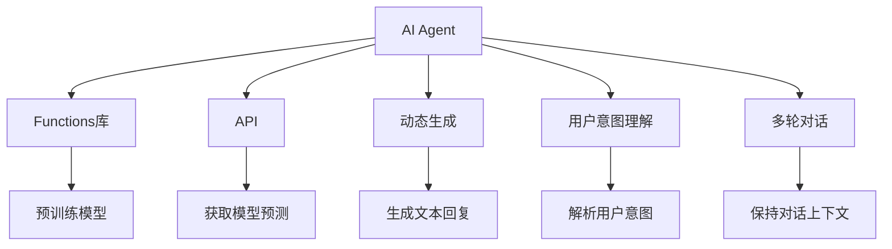
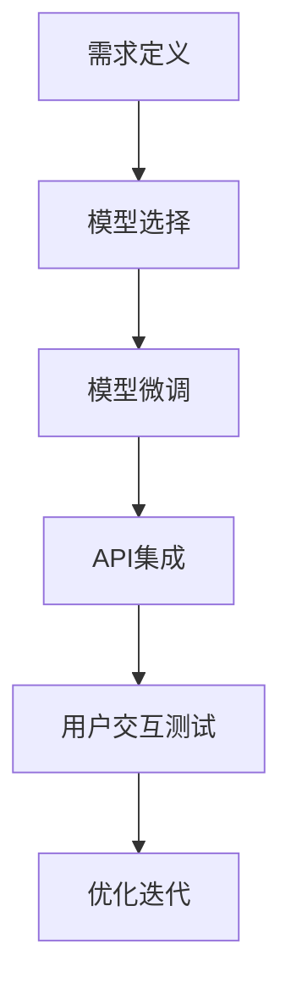

                 

# 【大模型应用开发 动手做AI Agent】OpenAI中的Functions

> 关键词：大模型应用开发, AI Agent, OpenAI, Functions, API, 模型微调, 动态生成, 用户意图理解, 多轮对话

## 1. 背景介绍

### 1.1 问题由来
随着深度学习技术的快速发展，AI agent在自然语言处理(NLP)和计算机视觉(CV)等领域的应用日益广泛。AI agent通过模拟人类的认知智能行为，可以自动完成各种智能交互任务，如问答、翻译、聊天、推荐等。而在众多AI agent技术中，OpenAI的Functions库因其灵活性、易用性和高效性，成为了当前领域内备受关注的研究方向。

Functions库基于OpenAI的GPT-3模型，提供了丰富的自然语言处理API，可以用于用户意图理解、动态生成、多轮对话等多种场景。开发者可以基于Functions库，构建高性能、高可扩展的AI agent，实现高效率的应用开发。本文将详细介绍OpenAI的Functions库，涵盖其核心概念、实现原理和实践方法，帮助读者深入理解AI agent开发的关键技术。

### 1.2 问题核心关键点
本节将介绍OpenAI Functions库的三个核心关键点：

1. 核心概念：包括AI agent、Functions库、API等。
2. 实现原理：包括动态生成、用户意图理解、多轮对话等。
3. 应用场景：包括问答、翻译、推荐、聊天等。

通过这些关键点的深入探讨，读者将能够更好地理解AI agent的开发流程和技术实现细节。

### 1.3 问题研究意义
了解OpenAI Functions库的核心概念、实现原理和应用场景，对于开发高性能、高可扩展的AI agent具有重要意义：

1. 提高开发效率：通过使用Functions库，可以快速构建各种AI agent，减少从零开始的开发工作量。
2. 提升应用性能：Functions库基于最新的大模型技术，能够在各种NLP和CV任务中取得优异的性能。
3. 降低技术门槛：Functions库提供了丰富的API和文档，降低了技术入门的门槛。
4. 增强交互体验：通过动态生成和多轮对话技术，提升用户交互体验，提高AI agent的智能化水平。
5. 推动技术普及：Functions库的开源特性，使得更多人可以参与到AI agent技术的开发和应用中。

## 2. 核心概念与联系

### 2.1 核心概念概述

为更好地理解OpenAI Functions库的开发流程，本节将介绍几个关键核心概念：

1. **AI Agent**：指模拟人类认知智能行为，用于执行各种智能交互任务的计算机程序或系统。AI agent通常基于自然语言处理技术，能够理解人类语言并生成自然语言响应。

2. **Functions库**：OpenAI提供的API开发平台，用于构建高性能、高可扩展的AI agent。Functions库封装了大模型技术，支持动态生成、用户意图理解、多轮对话等功能。

3. **API**：开放接口，用于不同软件系统之间的通信。OpenAI Functions库提供的API可以用于获取模型预测、动态生成文本等操作。

4. **动态生成**：指AI agent能够根据用户输入的文本，生成与之对应的文本回复。动态生成技术使得AI agent能够更加智能地回应用户，提升交互体验。

5. **用户意图理解**：指AI agent能够理解用户输入文本的真实意图，基于此意图生成响应。理解用户意图是构建高效AI agent的基础。

6. **多轮对话**：指AI agent能够通过多次文本交互，逐步获取更多信息并生成准确回应。多轮对话技术可以大幅提升AI agent的智能水平。

这些核心概念之间的逻辑关系可以通过以下Mermaid流程图来展示：



这个流程图展示了大模型应用开发中各个核心概念的相互关系：

1. AI agent通过Functions库调用API，获取预训练模型的预测。
2. 动态生成技术用于根据用户输入生成回复。
3. 用户意图理解技术用于解析用户意图，确保生成的回复符合用户真实需求。
4. 多轮对话技术用于维持对话上下文，确保对话连贯性和准确性。
5. Functions库封装了预训练模型，为AI agent提供强大的自然语言处理能力。

### 2.2 概念间的关系

这些核心概念之间存在着紧密的联系，形成了OpenAI Functions库的应用生态系统。下面我们通过几个Mermaid流程图来展示这些概念之间的关系。

#### 2.2.1 AI agent的开发流程



这个流程图展示了AI agent开发的基本流程：

1. 根据需求定义AI agent的任务和功能。
2. 选择适合的预训练模型，进行微调以适应特定任务。
3. 集成Functions库的API，实现动态生成、用户意图理解、多轮对话等核心功能。
4. 进行用户交互测试，收集反馈，优化AI agent的性能。
5. 不断迭代改进，提升AI agent的智能水平。

#### 2.2.2 Functions库的应用范围

```mermaid
graph LR
    A[函数] --> B[API]
    B --> C[动态生成]
    B --> D[用户意图理解]
    B --> E[多轮对话]
    C --> F[问答]
    C --> G[翻译]
    D --> H[情感分析]
    E --> I[推荐]
    F --> J[客服]
    G --> K[新闻]
    H --> L[评论]
    I --> M[电商]
    J --> N[健康]
    K --> O[体育]
    L --> P[法律]
    M --> Q[娱乐]
    N --> R[教育]
    O --> S[科技]
    P --> T[环境]
    Q --> U[游戏]
    R --> V[文化]
    S --> W[交通]
    T --> X[旅游]
    U --> Y[音乐]
    V --> Z[历史]
    W --> AA[旅游]
    X --> AB[艺术]
    Y --> AC[舞蹈]
    Z --> AD[美术]
    AA --> AE[酒店]
    AB --> AF[餐厅]
    AC --> AG[演出]
    AD --> AH[展览]
    AE --> AI[商务]
    AF --> AJ[美食]
    AG --> AK[电影]
    AH --> AL[展览]
    AI --> AM[商务]
    AJ --> AN[美食]
    AK --> AO[电影]
    AL --> AP[展览]
    AM --> AQ[商务]
    AN --> AR[美食]
    AO --> AS[电影]
    AP --> AT[展览]
    AQ --> AU[商务]
    AR --> AV[美食]
    AS --> AW[电影]
    AT --> AX[展览]
    AU --> AY[商务]
    AV --> AZ[美食]
    AW --> BA[电影]
    AX --> BB[展览]
    AY --> BC[商务]
    AZ --> BD[美食]
    BA --> BE[酒店]
    BB --> BF[餐厅]
    BC --> BG[演出]
    BD --> BH[展览]
    BE --> BI[商务]
    BF --> BJ[美食]
    BG --> BK[电影]
    BH --> BL[展览]
    BI --> BM[商务]
    BJ --> BN[美食]
    BK --> BO[电影]
    BL --> BM[展览]
    BM --> BO[商务]
    BN --> BP[美食]
    BO --> BQ[电影]
    BP --> BR[展览]
    BQ --> BS[商务]
    BR --> BT[美食]
    BS --> BU[电影]
    BT --> BV[展览]
    BU --> BW[商务]
    BV --> BX[美食]
    BW --> BY[电影]
    BX --> BZ[展览]
    BY --> CA[酒店]
    BZ --> CB[餐厅]
    CA --> CC[演出]
    CB --> CD[展览]
    CC --> CE[商务]
    CD --> CF[美食]
    CE --> CG[电影]
    CF --> CH[展览]
    CE --> CI[商务]
    CF --> CJ[美食]
    CG --> CK[电影]
    CH --> CI[展览]
    CI --> CK[商务]
    CJ --> CK[美食]
    CK --> CL[电影]
    CL --> CM[展览]
    CM --> CN[商务]
    CN --> CO[美食]
    CO --> CP[电影]
    CP --> CQ[展览]
    CQ --> CR[商务]
    CR --> CS[美食]
    CS --> CT[电影]
    CT --> CU[展览]
    CU --> CV[商务]
    CV --> CW[美食]
    CW --> CZ[电影]
    CZ --> DA[酒店]
    DA --> DB[餐厅]
    DB --> DC[演出]
    DC --> DD[展览]
    DD --> DE[商务]
    DE --> DF[美食]
    DF --> DG[电影]
    DG --> DH[展览]
    DE --> DI[商务]
    DF --> DJ[美食]
    DG --> DK[电影]
    DH --> DI[展览]
    DI --> DK[商务]
    DJ --> DK[美食]
    DK --> DL[电影]
    DL --> DM[展览]
    DM --> DN[商务]
    DN --> DO[美食]
    DO --> DP[电影]
    DP --> DQ[展览]
    DQ --> DR[商务]
    DR --> DS[美食]
    DS --> DT[电影]
    DT --> DU[展览]
    DU --> DV[商务]
    DV --> DW[美食]
    DW --> DX[电影]
    DX --> DY[展览]
    DY --> DZ[商务]
    DZ --> EA[酒店]
    EA --> EB[餐厅]
    EB --> EC[演出]
    EC --> ED[展览]
    ED --> EE[商务]
    EE --> EF[美食]
    EF --> EG[电影]
    EG --> EH[展览]
    EE --> EI[商务]
    EF --> EJ[美食]
    EG --> EK[电影]
    EH --> EI[展览]
    EI --> EK[商务]
    EJ --> EK[美食]
    EK --> EL[电影]
    EL --> EM[展览]
    EM --> EN[商务]
    EN --> EO[美食]
    EO --> EP[电影]
    EP --> EQ[展览]
    EQ --> ER[商务]
    ER --> ES[美食]
    ES --> ET[电影]
    ET --> EU[展览]
    EU --> EV[商务]
    EV --> EW[美食]
    EW --> EX[电影]
    EX --> EY[展览]
    EY --> EZ[商务]
    EZ --> FA[酒店]
    FA --> FB[餐厅]
    FB --> FC[演出]
    FC --> FD[展览]
    FD --> FE[商务]
    FE --> FF[美食]
    FF --> FG[电影]
    FG --> FH[展览]
    FE --> FI[商务]
    FF --> FJ[美食]
    FG --> FK[电影]
    FH --> FI[展览]
    FI --> FK[商务]
    FJ --> FK[美食]
    FK --> FL[电影]
    FL --> FM[展览]
    FM --> FN[商务]
    FN --> FO[美食]
    FO --> FP[电影]
    FP --> FQ[展览]
    FQ --> FR[商务]
    FR --> FS[美食]
    FS --> FT[电影]
    FT --> FU[展览]
    FU --> FV[商务]
    FV --> FW[美食]
    FW --> FX[电影]
    FX --> FY[展览]
    FY --> FZ[商务]
    FZ --> GA[酒店]
    GA --> GB[餐厅]
    GB --> GC[演出]
    GC --> GD[展览]
    GD --> GE[商务]
    GE --> GF[美食]
    GF --> GG[电影]
    GG --> GH[展览]
    GE --> GI[商务]
    GF --> GJ[美食]
    GG --> GK[电影]
    GH --> GI[展览]
    GI --> GK[商务]
    GJ --> GK[美食]
    GK --> GL[电影]
    GL --> GM[展览]
    GM --> GN[商务]
    GN --> GO[美食]
    GO --> GP[电影]
    GP --> GQ[展览]
    GQ --> GR[商务]
    GR --> GS[美食]
    GS --> GT[电影]
    GT --> GU[展览]
    GU --> GV[商务]
    GV --> GW[美食]
    GW --> GX[电影]
    GX --> GY[展览]
    GY --> GZ[商务]
    GZ --> HA[酒店]
    HA --> HB[餐厅]
    HB --> HC[演出]
    HC --> HD[展览]
    HD --> HE[商务]
    HE --> HF[美食]
    HF --> HG[电影]
    HG --> HH[展览]
    HE --> HI[商务]
    HF --> HJ[美食]
    HG --> HK[电影]
    HH --> HI[展览]
    HI --> HK[商务]
    HJ --> HK[美食]
    HK --> HL[电影]
    HL --> HM[展览]
    HM --> HN[商务]
    HN --> HO[美食]
    HO --> HP[电影]
    HP --> HQ[展览]
    HQ --> HR[商务]
    HR --> HS[美食]
    HS --> HT[电影]
    HT --> HU[展览]
    HU --> HV[商务]
    HV --> HW[美食]
    HW --> HX[电影]
    HX --> HY[展览]
    HY --> HZ[商务]
    HZ --> IA[酒店]
    IA --> IB[餐厅]
    IB --> IC[演出]
    IC --> ID[展览]
    ID --> IE[商务]
    IE --> IF[美食]
    IF --> IG[电影]
    IG --> IH[展览]
    IE --> II[商务]
    IF --> IJ[美食]
    IG --> IK[电影]
    IH --> II[展览]
    II --> IK[商务]
    IJ --> IK[美食]
    IK --> IL[电影]
    IL --> IM[展览]
    IM --> IN[商务]
    IN --> IO[美食]
    IO --> IP[电影]
    IP --> IQ[展览]
    IQ --> IR[商务]
    IR --> IS[美食]
    IS --> IT[电影]
    IT --> IU[展览]
    IU --> IV[商务]
    IV --> IW[美食]
    IW --> IX[电影]
    IX --> IY[展览]
    IY --> IZ[商务]
    IZ --> JA[酒店]
    JA --> JB[餐厅]
    JB --> JC[演出]
    JC --> JD[展览]
    JD --> JE[商务]
    JE --> JF[美食]
    JF --> JG[电影]
    JG --> JH[展览]
    JE --> JI[商务]
    JF --> JJ[美食]
    JG --> JK[电影]
    JH --> JI[展览]
    JI --> JK[商务]
    JJ --> JK[美食]
    JK --> JL[电影]
    JL --> JM[展览]
    JM --> JN[商务]
    JN --> JO[美食]
    JO --> JP[电影]
    JP --> JQ[展览]
    JQ --> JR[商务]
    JR --> JS[美食]
    JS --> JT[电影]
    JT --> JU[展览]
    JU --> JV[商务]
    JV --> JW[美食]
    JW --> JX[电影]
    JX --> JY[展览]
    JY --> JZ[商务]
    JZ --> KA[酒店]
    KA --> KB[餐厅]
    KB --> KC[演出]
    KC --> KD[展览]
    KD --> KE[商务]
    KE --> KF[美食]
    KF --> KG[电影]
    KG --> KH[展览]
    KE --> KI[商务]
    KF --> KJ[美食]
    KG --> KK[电影]
    KH --> KI[展览]
    KI --> KK[商务]
    KJ --> KK[美食]
    KK --> KL[电影]
    KL --> KM[展览]
    KM --> KN[商务]
    KN --> KO[美食]
    KO --> KP[电影]
    KP --> KQ[展览]
    KQ --> KR[商务]
    KR --> KS[美食]
    KS --> KT[电影]
    KT --> KU[展览]
    KU --> KV[商务]
    KV --> KW[美食]
    KW --> KX[电影]
    KX --> KY[展览]
    KY --> KZ[商务]
    KZ --> LA[酒店]
    LA --> LB[餐厅]
    LB --> LC[演出]
    LC --> LD[展览]
    LD --> LE[商务]
    LE --> LF[美食]
    LF --> LG[电影]
    LG --> LH[展览]
    LE --> LI[商务]
    LF --> LJ[美食]
    LG --> LK[电影]
    LH --> LI[展览]
    LI --> LK[商务]
    LJ --> LK[美食]
    LK --> LL[电影]
    LL --> LM[展览]
    LM --> LN[商务]
    LN --> LO[美食]
    LO --> LP[电影]
    LP --> LQ[展览]
    LQ --> LR[商务]
    LR --> LS[美食]
    LS --> LT[电影]
    LT --> LU[展览]
    LU --> LV[商务]
    LV --> LW[美食]
    LW --> LX[电影]
    LX --> LY[展览]
    LY --> LZ[商务]
    LZ --> MA[酒店]
    MA --> MB[餐厅]
    MB --> MC[演出]
    MC --> MD[展览]
    MD --> ME[商务]
    ME --> MF[美食]
    MF --> MG[电影]
    MG --> MH[展览]
    ME --> MI[商务]
    MF --> MJ[美食]
    MG --> MK[电影]
    MH --> MI[展览]
    MI --> MK[商务]
    MJ --> MK[美食]
    MK --> ML[电影]
    ML --> MM[展览]
    MM --> MN[商务]
    MN --> MO[美食]
    MO --> MP[电影]
    MP --> MQ[展览]
    MQ --> MR[商务]
    MR --> MS[美食]
    MS --> MT[电影]
    MT --> MU[展览]
    MU --> MV[商务]
    MV --> MW[美食]
    MW --> MX[电影]
    MX --> MY[展览]
    MY --> MZ[商务]
    MZ --> NA[酒店]
    NA --> NB[餐厅]
    NB --> NC[演出]
    NC --> ND[展览]
    ND --> NE[商务]
    NE --> NF[美食]
    NF --> NG[电影]
    NG --> NH[展览]
    NE --> NI[商务]
    NF --> NJ[美食]
    NG --> NK[电影]
    NH --> NI[展览]
    NI --> NK[商务]
    NJ --> NK[美食]
    NK --> NL[电影]
    NL --> NM[展览]
    NM --> NN[商务]
    NN --> NO[美食]
    NO --> NP[电影]
    NP --> NQ[展览]
    NQ --> NR[商务]
    NR --> NS[美食]
    NS --> NT[电影]
    NT --> NU[展览]
    NU --> NV[商务]
    NV --> NW[美食]
    NW --> NX[电影]
    NX --> NY[展览]
    NY --> NZ[商务]
    NZ --> OA[酒店]
    OA --> OB[餐厅]
    OB --> OC[演出]
    OC --> OD[展览]
    OD --> OE[商务]
    OE --> OF[美食]
    OF --> OG[电影]
    OG --> OH[展览]
    OE --> OI[商务]
    OF --> OJ[美食]
    OG --> OK[电影]
    OH --> OI[展览]
    OI --> OK[商务]
    OJ --> OK[美食]
    OK --> OL[电影]
    OL --> OM[展览]
    OM --> ON[商务]
    ON --> OO[美食]
    OO --> OP[电影]
    OP --> OQ[展览]
    OQ --> OR[商务]
    OR --> OS[美食]
    OS --> OT[电影]
    OT --> OU[展览]
    OU -->OV[商务]
    OV --> OW[美食]
    OW --> OX[电影]
    OX --> OY[展览]
    OY --> OZ[商务]
    OZ --> PA[酒店]
    PA --> PB[餐厅]
    PB --> PC[演出]
    PC --> PD[展览]
    PD --> PE[商务]
    PE --> PF[美食]
    PF --> PG[电影]
    PG --> PH[展览]
    PE --> PI[商务]
    PF --> PJ[美食]
    PG --> PK[电影]
    PH --> PI[展览]
    PI --> PK[商务]
    PJ --> PK[美食]
    PK --> PL[电影]
    PL --> PM[展览]
    PM --> PN[商务]
    PN --> PO[美食]
    PO --> PP[电影]
    PP --> PQ[展览]
    PQ --> PR[商务]
    PR --> PS[美食]
    PS --> PT[电影]
    PT --> PU[展览]
    PU --> PV[商务]
    PV --> PW[美食]
    PW --> PX[电影]
    PX --> PY[展览]
    PY --> PZ[商务]
    PZ --> QA[酒店]
    QA --> QB[餐厅]
    QB --> QC[演出]
    QC --> QD[展览]
    QD --> QE[商务]
    QE --> QF[美食]
    QF --> QG[电影]
    QG --> QH[展览]
    QE --> QI[商务]
    QF --> QJ[美食]
    QG --> QK[电影]
    QH --> QI[展览]
    QI --> QK[商务]
    QJ --> QK[美食]
    QK --> QL[电影]
    QL --> QM[展览]
    QM --> QN[商务]
    QN --> QO[美食]
    QO --> QP[电影]
    QP --> QQ[展览]
    QQ --> QR[商务]
    QR --> QS[美食]
    QS --> QT[电影]
    QT --> QU[展览]
    QU --> QV[商务]
    QV --> QW[美食]
    QW --> QX[电影]
    QX --> QY[展览]
    QY --> QZ[商务]
    QZ --> RA[酒店]
    RA --> RB[餐厅]
    RB --> RC[演出]
    RC --> RD[展览]
    RD --> RE[商务]
    RE --> RF[美食]
    RF --> RG[电影]
    RG --> RH[展览]
    RE --> RI[商务]
    RF --> RJ[美食]
    RG --> RK[电影]
    RH --> RI[展览]
    RI --> RK[商务]
    RJ --> RK[美食]
    RK --> RL[电影]
    RL --> RM[展览]
    RM --> RN[商务]
    RN --> RO[美食]
    RO --> RP[电影]
    RP --> RQ[展览]
    RQ --> RR[商务]
    RR --> RS[美食]
    RS --> RT[电影]
    RT --> RU[展览]
    RU --> RV[商务]
    RV --> RW[美食]
    RW --> RX[电影]
    RX --> RY[展览]
    RY --> RZ[商务]
    RZ --> SA[酒店]
    SA --> SB[餐厅]
    SB --> SC[演出]
    SC --> SD[展览]
    SD --> SE[商务]
    SE --> SF[美食]
    SF --> SG[电影]
    SG --> SH[展览]
    SE --> SI[商务]
    SF --> SJ[美食]
    SG --> SK[电影]
    SH --> SI[展览]
    SI --> SK[商务]
    SJ --> SK[美食]
    SK --> SL[电影]
    SL --> SM[展览]
    SM --> SN[商务]
    SN --> SO[美食]
    SO --> SP[电影]
    SP --> SQ[展览]
    SQ --> SR[商务]
    SR --> SS[美食]
    SS --> ST[电影]
    ST --> SU[展览]
    SU --> SV[商务]
    SV --> SW[美食]
    SW --> SX[电影]
    SX --> SY[展览]
    SY --> SZ[商务]
    SZ --> TA[酒店]
    TA --> TB[餐厅]
    TB --> TC[演出]
    TC --> TD[展览]
    TD --> TE[商务]
    TE --> TF[美食]
    TF --> TG[电影]
    TG --> TH[展览]
    TE --> TI[商务]
    TF --> TJ[美食]
    TG --> TK[电影]
    TH --> TI[展览]
    TI --> TK[商务]
    TJ --> TK[美食]
    TK --> TL[电影]
    TL --> TM[展览]
    TM --> TN[商务]
    TN --> TO[美食]
    TO --> TP[电影]
    TP --> TQ[展览]
    TQ --> TR[商务]
    TR --> TS[美食]
    TS --> TT[电影]
    TT --> TU[展览]
    TU --> TV[商务]
    TV --> TW[美食]
    TW --> TX[电影]
    TX --> TY[展览]
    TY --> TZ[商务]
    TZ --> UA[酒店]
    UA --> UB[餐厅]
    UB --> UC[演出]
    UC --> UD[展览]
    UD --> UE[商务]
    UE --> UF[美食]
    UF

