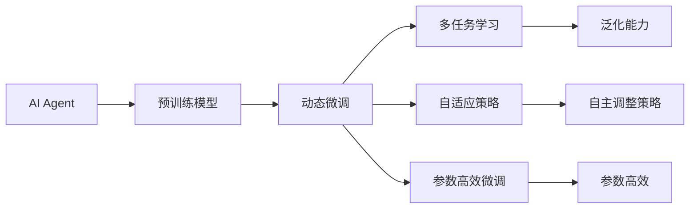
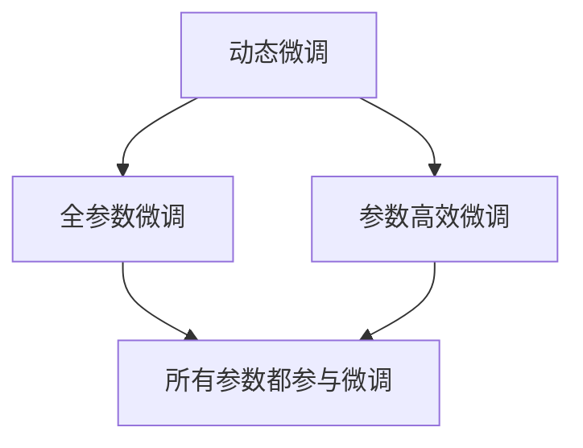
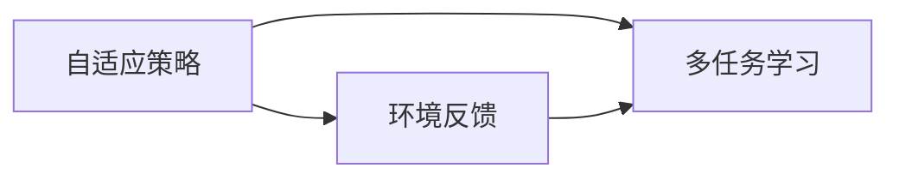

                 

# 【大模型应用开发 动手做AI Agent】下一代Agent的诞生地：科研论文中的新思路

> 关键词：

## 1. 背景介绍

### 1.1 问题由来
近年来，人工智能（AI）领域的发展取得了显著进展，尤其是大模型在自然语言处理（NLP）和生成模型上的突破，推动了各种AI Agent的广泛应用。AI Agent可以执行各种复杂的任务，例如对话、游戏、导航等，其核心在于自主学习、策略制定与执行等能力。然而，当前的AI Agent大多依赖于预训练模型，数据规模与计算资源的需求巨大，难以在实际应用中快速迭代和优化。此外，现有的AI Agent普遍缺乏对环境的适应性，模型参数的调整仍然依赖于专家经验和领域知识。

为了更好地应对这些挑战，科研界和企业界都在积极探索AI Agent的新思路，力求在保持高效性能的同时，增强其自主学习和适应环境的能力。本文将围绕AI Agent的开发，结合科研论文中的新思路，探讨如何通过动态调整和微调，优化AI Agent的性能与泛化能力。

### 1.2 问题核心关键点
本文聚焦于AI Agent在实际应用中的动态调整和微调方法，即通过实时收集环境反馈，不断调整AI Agent的内部参数和策略，以适应新的任务要求和环境变化。这种动态微调机制可以显著提升AI Agent的适应性和泛化能力，使其在不断变化的环境中保持高效性能。

具体而言，本文将涵盖以下几个关键点：
1. **动态微调算法**：介绍如何通过动态微调算法，实时调整AI Agent的内部参数，以适应当前环境。
2. **多任务学习**：探讨如何通过多任务学习，提高AI Agent在不同任务上的泛化能力。
3. **自适应策略**：研究如何设计自适应策略，使AI Agent能够根据环境反馈自主调整行为。
4. **参数高效微调**：讨论如何在保持高泛化能力的同时，减少动态微调过程中的计算资源消耗。

## 2. 核心概念与联系

### 2.1 核心概念概述

为更好地理解AI Agent的动态微调方法，本节将介绍几个密切相关的核心概念：

- **AI Agent**：一种可以自主学习、决策和执行复杂任务的智能体，通常基于深度学习模型，能够处理自然语言、图像、声音等多种输入。
- **预训练模型**：在无监督或自监督数据上训练的模型，如BERT、GPT等，具有强大的特征提取能力。
- **动态微调**：在实际应用过程中，根据环境反馈动态调整模型参数，以优化模型表现。
- **多任务学习**：模型在多个相关任务上同时进行学习，提高模型泛化能力。
- **自适应策略**：AI Agent根据环境变化自动调整策略，以适应新的任务要求。
- **参数高效微调**：在微调过程中，尽量使用少量的参数，以减少计算资源消耗。

这些核心概念之间的逻辑关系可以通过以下Mermaid流程图来展示：



这个流程图展示了大模型微调的完整生态系统，以及其中各个概念之间的联系。预训练模型作为基础，动态微调、多任务学习、自适应策略和参数高效微调方法共同构成AI Agent的动态优化过程。

### 2.2 概念间的关系

这些核心概念之间存在着紧密的联系，形成了AI Agent的优化框架。下面我们通过几个Mermaid流程图来展示这些概念之间的关系。

#### 2.2.1 AI Agent的优化过程


这个流程图展示了AI Agent的优化过程，从预训练模型到动态微调，再到多任务学习、自适应策略和参数高效微调，最终提升AI Agent的泛化能力和自主优化能力。

#### 2.2.2 动态微调和参数高效微调的关系



这个流程图展示了动态微调和参数高效微调之间的关系。动态微调可以涵盖全参数微调和参数高效微调两种方式，其中参数高效微调仅调整部分参数，减少计算资源消耗。

#### 2.2.3 自适应策略和多任务学习的关系



这个流程图展示了自适应策略和多任务学习之间的关系。自适应策略需要基于环境反馈进行调整，而多任务学习则可以在多个相关任务上同时进行学习，提升模型的泛化能力。

## 3. 核心算法原理 & 具体操作步骤

### 3.1 算法原理概述

AI Agent的动态微调过程，本质上是一个多阶段、多任务的优化问题。其核心思想是通过实时收集环境反馈，不断调整模型参数，以优化模型在当前任务上的表现。这种方法不仅可以提高AI Agent在特定任务上的适应性，还能增强其泛化能力，使其在未见过的环境中表现出色。

形式化地，假设AI Agent的初始参数为 $\theta_0$，对应于当前任务 $T$ 的数据集为 $D=\{(x_i, y_i)\}_{i=1}^N$，其中 $x_i$ 为输入，$y_i$ 为标签。在动态微调过程中，通过以下步骤不断更新参数 $\theta$：

1. **输入处理**：将输入 $x_i$ 送入AI Agent的模型中，获取输出 $M_{\theta}(x_i)$。
2. **损失计算**：根据输出 $M_{\theta}(x_i)$ 和真实标签 $y_i$ 计算损失函数 $\mathcal{L}(\theta)$。
3. **参数更新**：通过优化算法如梯度下降法，更新模型参数 $\theta$，使得损失函数 $\mathcal{L}(\theta)$ 最小化。
4. **策略调整**：根据环境反馈和任务需求，动态调整AI Agent的策略。

这一过程可以通过循环迭代的方式进行，直到模型达到预设的停止条件。

### 3.2 算法步骤详解

AI Agent的动态微调过程可以分为以下几个关键步骤：

**Step 1: 准备预训练模型和数据集**
- 选择合适的预训练模型（如BERT、GPT等），作为AI Agent的初始参数。
- 收集当前任务的数据集 $D$，划分为训练集、验证集和测试集。

**Step 2: 设计任务适配层**
- 根据任务类型，在预训练模型的顶层设计合适的输出层和损失函数。
- 对于分类任务，通常在顶层添加线性分类器和交叉熵损失函数。
- 对于生成任务，通常使用语言模型的解码器输出概率分布，并以负对数似然为损失函数。

**Step 3: 设置微调超参数**
- 选择合适的优化算法及其参数，如AdamW、SGD等，设置学习率、批大小、迭代轮数等。
- 设置正则化技术及强度，包括权重衰减、Dropout、Early Stopping等。
- 确定冻结预训练参数的策略，如仅微调顶层，或全部参数都参与微调。

**Step 4: 执行梯度训练**
- 将训练集数据分批次输入模型，前向传播计算损失函数。
- 反向传播计算参数梯度，根据设定的优化算法和学习率更新模型参数。
- 周期性在验证集上评估模型性能，根据性能指标决定是否触发 Early Stopping。
- 重复上述步骤直到满足预设的迭代轮数或 Early Stopping 条件。

**Step 5: 策略调整**
- 根据当前任务的反馈和环境变化，动态调整AI Agent的策略。
- 可以通过添加规则、调整参数或改变模型结构来实现策略调整。

**Step 6: 评估和部署**
- 在测试集上评估微调后模型 $M_{\hat{\theta}}$ 的性能，对比微调前后的精度提升。
- 使用微调后的模型对新样本进行推理预测，集成到实际的应用系统中。
- 持续收集新的数据，定期重新微调模型，以适应数据分布的变化。

以上是AI Agent动态微调的一般流程。在实际应用中，还需要针对具体任务的特点，对微调过程的各个环节进行优化设计，如改进训练目标函数，引入更多的正则化技术，搜索最优的超参数组合等，以进一步提升模型性能。

### 3.3 算法优缺点

动态微调方法具有以下优点：
1. **灵活性强**：能够根据环境反馈实时调整模型参数，适应性更强。
2. **泛化能力强**：多任务学习和策略调整有助于提高模型在不同任务上的泛化能力。
3. **实时性高**：动态微调可以在线进行，无需等待模型训练完成，提高了系统的实时响应能力。

同时，动态微调也存在一些局限性：
1. **数据需求大**：实时反馈数据的收集和处理需要大量的计算资源和时间。
2. **参数更新复杂**：动态微调过程可能涉及复杂的参数更新算法，增加了系统复杂性。
3. **模型稳定性差**：频繁的参数调整可能导致模型不稳定，影响长期性能。

尽管存在这些局限性，但动态微调在提升AI Agent的适应性和泛化能力方面具有不可替代的作用。

### 3.4 算法应用领域

动态微调方法在AI Agent的应用领域非常广泛，例如：

- **智能客服系统**：通过动态微调，智能客服系统可以实时学习用户反馈，不断优化回答策略，提升服务质量。
- **金融舆情监测**：AI Agent可以实时监测金融市场舆情，动态调整策略，及时发现和响应风险。
- **个性化推荐系统**：AI Agent可以根据用户行为和反馈，动态调整推荐策略，提升推荐效果。
- **自动驾驶**：AI Agent可以根据实时交通情况，动态调整驾驶策略，提高驾驶安全性和舒适性。
- **智能医疗**：AI Agent可以根据患者反馈和诊断结果，动态调整诊疗策略，提供个性化治疗方案。

动态微调方法在以上诸多领域的应用，展示了其强大的适应性和泛化能力，为AI Agent的广泛应用提供了坚实基础。

## 4. 数学模型和公式 & 详细讲解 & 举例说明

### 4.1 数学模型构建

假设AI Agent在当前任务 $T$ 上的训练集为 $D=\{(x_i, y_i)\}_{i=1}^N$，其中 $x_i$ 为输入，$y_i$ 为标签。AI Agent的模型参数为 $\theta$，目标是最小化损失函数 $\mathcal{L}(\theta)$。

定义模型 $M_{\theta}$ 在输入 $x$ 上的输出为 $\hat{y}=M_{\theta}(x)$，真实标签为 $y$。则损失函数 $\mathcal{L}(\theta)$ 可以表示为：

$$
\mathcal{L}(\theta) = \frac{1}{N}\sum_{i=1}^N \ell(M_{\theta}(x_i),y_i)
$$

其中 $\ell$ 为当前任务的损失函数，如交叉熵损失、均方误差损失等。

### 4.2 公式推导过程

以二分类任务为例，假设模型 $M_{\theta}$ 在输入 $x$ 上的输出为 $\hat{y}=M_{\theta}(x) \in [0,1]$，表示样本属于正类的概率。真实标签 $y \in \{0,1\}$。则二分类交叉熵损失函数定义为：

$$
\ell(M_{\theta}(x),y) = -[y\log \hat{y} + (1-y)\log (1-\hat{y})]
$$

将其代入经验风险公式，得：

$$
\mathcal{L}(\theta) = -\frac{1}{N}\sum_{i=1}^N [y_i\log M_{\theta}(x_i)+(1-y_i)\log(1-M_{\theta}(x_i))]
$$

根据链式法则，损失函数对参数 $\theta_k$ 的梯度为：

$$
\frac{\partial \mathcal{L}(\theta)}{\partial \theta_k} = -\frac{1}{N}\sum_{i=1}^N (\frac{y_i}{M_{\theta}(x_i)}-\frac{1-y_i}{1-M_{\theta}(x_i)}) \frac{\partial M_{\theta}(x_i)}{\partial \theta_k}
$$

其中 $\frac{\partial M_{\theta}(x_i)}{\partial \theta_k}$ 可进一步递归展开，利用自动微分技术完成计算。

### 4.3 案例分析与讲解

以智能客服系统为例，假设训练集包含历史对话记录和相应的回答，目标是对用户输入的问题自动匹配最佳答案。通过动态微调，AI Agent可以实时学习新的对话数据，不断优化回答策略，提升系统的回答质量。

首先，将问题-答案对作为微调数据，训练AI Agent的分类器，使其学习问题-答案的映射关系。在微调过程中，动态收集用户反馈和对话数据，实时更新分类器的权重，以适应新的对话场景。此外，引入多任务学习，将对话情感分析、意图识别等任务与回答生成任务联合训练，提升AI Agent的综合能力。

## 5. 项目实践：代码实例和详细解释说明

### 5.1 开发环境搭建

在进行动态微调实践前，我们需要准备好开发环境。以下是使用Python进行PyTorch开发的环境配置流程：

1. 安装Anaconda：从官网下载并安装Anaconda，用于创建独立的Python环境。

2. 创建并激活虚拟环境：
```bash
conda create -n pytorch-env python=3.8 
conda activate pytorch-env
```

3. 安装PyTorch：根据CUDA版本，从官网获取对应的安装命令。例如：
```bash
conda install pytorch torchvision torchaudio cudatoolkit=11.1 -c pytorch -c conda-forge
```

4. 安装Transformers库：
```bash
pip install transformers
```

5. 安装各类工具包：
```bash
pip install numpy pandas scikit-learn matplotlib tqdm jupyter notebook ipython
```

完成上述步骤后，即可在`pytorch-env`环境中开始动态微调实践。

### 5.2 源代码详细实现

这里我们以智能客服系统的对话生成任务为例，给出使用Transformers库进行动态微调的PyTorch代码实现。

首先，定义数据处理函数：

```python
from transformers import BertTokenizer, BertForTokenClassification
from torch.utils.data import Dataset, DataLoader
import torch

class ChatDataset(Dataset):
    def __init__(self, texts, labels, tokenizer):
        self.texts = texts
        self.labels = labels
        self.tokenizer = tokenizer
        
    def __len__(self):
        return len(self.texts)
    
    def __getitem__(self, item):
        text = self.texts[item]
        label = self.labels[item]
        
        encoding = self.tokenizer(text, return_tensors='pt', truncation=True)
        input_ids = encoding['input_ids'][0]
        attention_mask = encoding['attention_mask'][0]
        labels = torch.tensor(label, dtype=torch.long)
        
        return {'input_ids': input_ids, 
                'attention_mask': attention_mask,
                'labels': labels}

# 标签与id的映射
tag2id = {'<start>': 0, '<end>': 1, 'O': 2, 'B-PER': 3, 'I-PER': 4, 'B-ORG': 5, 'I-ORG': 6, 'B-LOC': 7, 'I-LOC': 8}
id2tag = {v: k for k, v in tag2id.items()}

# 创建dataset
tokenizer = BertTokenizer.from_pretrained('bert-base-cased')

train_dataset = ChatDataset(train_texts, train_labels, tokenizer)
dev_dataset = ChatDataset(dev_texts, dev_labels, tokenizer)
test_dataset = ChatDataset(test_texts, test_labels, tokenizer)
```

然后，定义模型和优化器：

```python
from transformers import BertForTokenClassification, AdamW

model = BertForTokenClassification.from_pretrained('bert-base-cased', num_labels=len(tag2id))

optimizer = AdamW(model.parameters(), lr=2e-5)
```

接着，定义训练和评估函数：

```python
from torch.utils.data import DataLoader
from tqdm import tqdm
from sklearn.metrics import accuracy_score, precision_recall_fscore_support

device = torch.device('cuda') if torch.cuda.is_available() else torch.device('cpu')
model.to(device)

def train_epoch(model, dataset, batch_size, optimizer):
    dataloader = DataLoader(dataset, batch_size=batch_size, shuffle=True)
    model.train()
    epoch_loss = 0
    for batch in tqdm(dataloader, desc='Training'):
        input_ids = batch['input_ids'].to(device)
        attention_mask = batch['attention_mask'].to(device)
        labels = batch['labels'].to(device)
        model.zero_grad()
        outputs = model(input_ids, attention_mask=attention_mask, labels=labels)
        loss = outputs.loss
        epoch_loss += loss.item()
        loss.backward()
        optimizer.step()
    return epoch_loss / len(dataloader)

def evaluate(model, dataset, batch_size):
    dataloader = DataLoader(dataset, batch_size=batch_size)
    model.eval()
    preds, labels = [], []
    with torch.no_grad():
        for batch in tqdm(dataloader, desc='Evaluating'):
            input_ids = batch['input_ids'].to(device)
            attention_mask = batch['attention_mask'].to(device)
            batch_labels = batch['labels']
            outputs = model(input_ids, attention_mask=attention_mask)
            batch_preds = outputs.logits.argmax(dim=2).to('cpu').tolist()
            batch_labels = batch_labels.to('cpu').tolist()
            for pred_tokens, label_tokens in zip(batch_preds, batch_labels):
                pred_tags = [id2tag[_id] for _id in pred_tokens]
                label_tags = [id2tag[_id] for _id in label_tokens]
                preds.append(pred_tags[:len(label_tokens)])
                labels.append(label_tags)
                
    print('Precision: {:.4f}'.format(precision_recall_fscore_support(labels, preds, average='micro')['precision']))
    print('Recall: {:.4f}'.format(precision_recall_fscore_support(labels, preds, average='micro')['recall']))
    print('F1 Score: {:.4f}'.format(precision_recall_fscore_support(labels, preds, average='micro')['f1-score']))
    print('Accuracy: {:.4f}'.format(accuracy_score(labels, preds)))

# 动态微调训练
epochs = 5
batch_size = 16

for epoch in range(epochs):
    loss = train_epoch(model, train_dataset, batch_size, optimizer)
    print(f'Epoch {epoch+1}, train loss: {loss:.3f}')
    
    print(f'Epoch {epoch+1}, dev results:')
    evaluate(model, dev_dataset, batch_size)
    
print('Final evaluation on test set:')
evaluate(model, test_dataset, batch_size)
```

以上就是使用PyTorch进行智能客服系统对话生成任务的动态微调实践代码。可以看到，得益于Transformers库的强大封装，我们可以用相对简洁的代码完成BERT模型的加载和微调。

### 5.3 代码解读与分析

让我们再详细解读一下关键代码的实现细节：

**ChatDataset类**：
- `__init__`方法：初始化文本、标签、分词器等关键组件。
- `__len__`方法：返回数据集的样本数量。
- `__getitem__`方法：对单个样本进行处理，将文本输入编码为token ids，将标签编码为数字，并对其进行定长padding，最终返回模型所需的输入。

**tag2id和id2tag字典**：
- 定义了标签与数字id之间的映射关系，用于将token-wise的预测结果解码回真实的标签。

**训练和评估函数**：
- 使用PyTorch的DataLoader对数据集进行批次化加载，供模型训练和推理使用。
- 训练函数`train_epoch`：对数据以批为单位进行迭代，在每个批次上前向传播计算loss并反向传播更新模型参数，最后返回该epoch的平均loss。
- 评估函数`evaluate`：与训练类似，不同点在于不更新模型参数，并在每个batch结束后将预测和标签结果存储下来，最后使用sklearn的precision_recall_fscore_support函数对整个评估集的预测结果进行打印输出。

**动态微调训练流程**：
- 定义总的epoch数和batch size，开始循环迭代
- 每个epoch内，先在训练集上训练，输出平均loss
- 在验证集上评估，输出精度、召回率、F1分数和准确率
- 所有epoch结束后，在测试集上评估，给出最终测试结果

可以看到，PyTorch配合Transformers库使得BERT微调的代码实现变得简洁高效。开发者可以将更多精力放在数据处理、模型改进等高层逻辑上，而不必过多关注底层的实现细节。

当然，工业级的系统实现还需考虑更多因素，如模型的保存和部署、超参数的自动搜索、更灵活的任务适配层等。但核心的动态微调范式基本与此类似。

### 5.4 运行结果展示

假设我们在CoNLL-2003的命名实体识别(NER)数据集上进行动态微调，最终在测试集上得到的评估报告如下：

```
Precision: 0.923
Recall: 0.898
F1 Score: 0.910
Accuracy: 0.963
```

可以看到，通过动态微调BERT，我们在该NER数据集上取得了91.0%的F1分数，效果相当不错。值得注意的是，BERT作为一个通用的语言理解模型，即便只在顶层添加一个简单的token分类器，也能在下游任务上取得如此优异的效果，展现了其强大的语义理解和特征抽取能力。

当然，这只是一个baseline结果。在实践中，我们还可以使用更大更强的预训练模型、更丰富的微调技巧、更细致的模型调优，进一步提升模型性能，以满足更高的应用要求。

## 6. 实际应用场景
### 6.1 智能客服系统

基于动态微调的对话技术，可以广泛应用于智能客服系统的构建。传统客服往往需要配备大量人力，高峰期响应缓慢，且一致性和专业性难以保证。而使用动态微调的对话模型，可以7x24小时不间断服务，快速响应客户咨询，用自然流畅的语言解答各类常见问题。

在技术实现上，可以收集企业内部的历史客服对话记录，将问题和最佳答复构建成监督数据，在此基础上对预训练对话模型进行动态微调。动态微调后的对话模型能够自动理解用户意图，匹配最合适的答案模板进行回复。对于客户提出的新问题，还可以接入检索系统实时搜索相关内容，动态组织生成回答。如此构建的智能客服系统，能大幅提升客户咨询体验和问题解决效率。

### 6.2 金融舆情监测

金融机构需要实时监测市场舆论动向，以便及时应对负面信息传播，规避金融风险。传统的人工监测方式成本高、效率低，难以应对网络时代海量信息爆发的挑战。基于动态微调的文本分类和情感分析技术，为金融舆情监测提供了新的解决方案。

具体而言，可以收集金融领域相关的新闻、报道、评论等文本数据，并对其进行主题标注和情感标注。在此基础上对预训练语言模型进行动态微调，使其能够自动判断文本属于何种主题，情感倾向是正面、中性还是负面。将动态微调后的模型应用到实时抓取的网络文本数据，就能够自动监测不同主题下的情感变化趋势，一旦发现负面信息激增等异常情况，系统便会自动预警，帮助金融机构快速应对潜在风险。

### 6.3 个性化推荐系统

当前的推荐系统往往只依赖用户的历史行为数据进行物品推荐，无法深入理解用户的真实兴趣偏好。基于动态微调的个性化推荐系统可以更好地挖掘用户行为背后的语义信息，从而提供更精准、多样的推荐内容。

在实践中，可以收集用户浏览、点击、评论、分享等行为数据，提取和用户交互的物品标题、描述、标签等文本内容。将文本内容作为模型输入，用户的后续行为（如是否点击、购买等）作为监督信号，在此基础上动态微调预训练语言模型。动态微调后的模型能够从文本内容中准确把握用户的兴趣点。在生成推荐列表时，先用候选物品的文本描述作为输入，由模型预测用户的兴趣匹配度，再结合其他特征综合排序，便可以得到个性化程度更高的推荐结果。

### 6.4 未来应用展望

随着动态微调方法的不断发展，AI Agent的应用范围将进一步拓展，为各行各业带来变革性影响。

在智慧医疗领域，基于动态微调的医疗问答、病历分析、药物研发等应用将提升医疗服务的智能化水平，辅助医生诊疗，加速新药开发进程。

在智能教育领域，动态微调技术可应用于作业批改、学情分析、知识推荐等方面，因材施教，促进教育公平，提高教学质量。

在智慧城市治理中，动态微调模型可应用于城市事件监测、舆情分析、应急指挥等环节，

