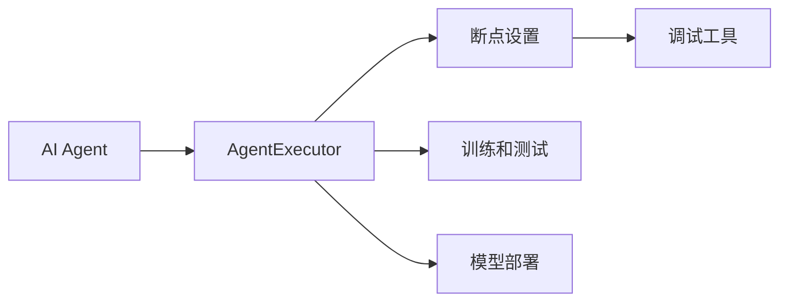

                 

# 【大模型应用开发 动手做AI Agent】在AgentExecutor中设置断点

在人工智能领域，大模型应用开发是一个重要的研究方向。特别是对于智能体（AI Agent）的设计，我们需要充分利用大模型强大的语言理解和生成能力，构建出能够模拟人类行为，处理自然语言交互的系统。AgentExecutor就是这样的开源工具，它提供了一个灵活的平台，使我们能够在这个平台上部署和管理各种AI Agent。本文将深入探讨如何在AgentExecutor中设置断点，以便在开发和测试过程中更加便捷地调试和优化模型。

## 1. 背景介绍

### 1.1 问题由来
在开发AI Agent的过程中，我们往往需要频繁调试和测试模型。然而，传统的开发环境，如IDEs（集成开发环境），虽然功能丰富，但对于大模型应用而言，由于其复杂性和庞大的数据需求，调试起来十分不便。因此，我们需要一种更加灵活和高效的工具，能够满足大模型应用开发的特殊需求。

### 1.2 问题核心关键点
AgentExecutor是一个开源工具，它允许开发者在一个虚拟的环境中运行和测试AI Agent。通过AgentExecutor，我们可以更加方便地设置和修改模型参数，进行模型训练和评估，并且支持多种大模型和框架。在开发过程中，我们往往需要在特定节点进行调试，以检查模型的输出和性能，这就需要我们设置断点。

## 2. 核心概念与联系

### 2.1 核心概念概述

为更好地理解在AgentExecutor中设置断点的原理和应用，本节将介绍几个关键概念：

- **AI Agent**：一个能够处理自然语言交互的智能体，通常包括语言理解、决策生成和响应生成等模块。
- **AgentExecutor**：一个开源的AI Agent开发和管理平台，提供了丰富的调试和测试工具，支持多种AI Agent框架和模型。
- **断点设置**：在AI Agent的代码中，设置一个特定点，使程序暂停执行，等待开发者的进一步操作。
- **调试工具**：AgentExecutor提供的调试工具，如TensorBoard、Weights & Biases等，可以方便地监控模型性能和调试过程。

### 2.2 核心概念的整体架构

我们可以用以下Mermaid流程图来展示这些核心概念之间的关系：



这个流程图展示了大模型应用开发的基本流程：

1. 使用AgentExecutor创建和管理AI Agent。
2. 在AI Agent代码中设置断点，进行模型调试。
3. 使用调试工具监控模型性能，优化模型参数。
4. 在AgentExecutor中进行模型训练和测试，评估模型性能。
5. 将优化后的模型部署到实际应用中。

### 2.3 核心概念间的联系

这些核心概念之间存在着紧密的联系，构成了大模型应用开发的基础：

- **AI Agent**：是AgentExecutor的核心，负责处理自然语言交互和生成任务。
- **AgentExecutor**：提供了一个灵活的平台，支持AI Agent的创建、训练、测试和部署。
- **断点设置**：使开发者能够在特定节点暂停程序执行，进行调试和优化。
- **调试工具**：用于监控模型性能，帮助开发者快速定位问题和优化模型。

这些概念共同构成了AgentExecutor的基础，使得AI Agent的开发和测试变得更加便捷高效。

## 3. 核心算法原理 & 具体操作步骤
### 3.1 算法原理概述

在AgentExecutor中设置断点，本质上是通过断点调试技术，使AI Agent在特定节点暂停执行，等待开发者的进一步操作。这有助于我们在开发过程中，更加灵活地控制程序的执行流程，检查模型的输出和状态，从而进行调试和优化。

### 3.2 算法步骤详解

设置断点的一般步骤如下：

1. **编写代码**：首先，我们需要在AI Agent的代码中编写需要进行调试和测试的部分。通常，这些代码包括模型的前向传播、后向传播、参数更新等操作。

2. **使用AgentExecutor**：将AI Agent的代码上传到AgentExecutor平台上，使用平台提供的开发工具和框架，进行模型训练和测试。

3. **设置断点**：在AI Agent的代码中，使用调试器（如Python的pdb）设置断点，指定需要暂停执行的节点。

4. **运行程序**：启动AI Agent的调试程序，等待程序在断点处暂停执行。

5. **调试和优化**：在程序暂停的情况下，我们可以使用调试工具（如TensorBoard、Weights & Biases）进行模型性能的监控和调试，优化模型参数，确保模型的输出符合预期。

6. **继续执行**：当调试完成后，我们可以继续执行程序，直到程序结束或者遇到下一个断点。

### 3.3 算法优缺点

设置断点的方法具有以下优点：

- **灵活性**：使开发者能够灵活地控制程序的执行流程，随时暂停和恢复程序的执行。
- **高效性**：在程序的特定节点进行调试和优化，减少了大量的无谓计算和资源浪费。
- **可视化**：通过调试工具，可以直观地看到模型的输出和状态，方便问题定位和调试。

然而，断点设置也存在一些缺点：

- **复杂性**：设置断点需要一定的编程技巧，对于新手开发者来说可能有一定的难度。
- **执行效率**：断点设置可能会导致程序的执行效率下降，尤其是在大模型应用中，断点过多可能会影响性能。
- **依赖性**：断点设置依赖于调试工具的支持，如果调试工具无法正常工作，断点设置将无法进行。

### 3.4 算法应用领域

断点设置在大模型应用开发中，可以应用于以下领域：

- **模型调试**：用于模型训练和测试过程中的问题定位和调试。
- **性能优化**：用于优化模型参数和结构，提升模型性能。
- **错误排查**：用于快速定位和解决程序中的错误和异常。
- **功能验证**：用于验证模型的功能是否符合预期，确保模型的正确性。

断点设置是AI Agent开发中不可或缺的一部分，可以大大提高开发效率和模型质量。

## 4. 数学模型和公式 & 详细讲解
### 4.1 数学模型构建

在大模型应用开发中，断点设置的数学模型构建过程可以简化为：

- **输入**：AI Agent的代码、模型参数和训练数据。
- **输出**：模型在特定节点暂停执行，等待开发者的进一步操作。

### 4.2 公式推导过程

断点设置的过程可以分为以下几个步骤：

1. **断点位置**：确定需要设置断点的具体位置，如函数调用、循环等。

2. **断点类型**：选择断点的类型，如条件断点、数据断点等。

3. **断点设置**：使用调试工具（如pdb）设置断点，指定需要暂停执行的节点。

4. **程序执行**：启动AI Agent的调试程序，程序在断点处暂停执行。

5. **调试和优化**：使用调试工具进行模型性能的监控和调试，优化模型参数。

6. **继续执行**：当调试完成后，继续执行程序，直到程序结束或者遇到下一个断点。

### 4.3 案例分析与讲解

假设我们有一个基于BERT的情感分析模型，需要在特定节点进行调试。我们可以按照以下步骤进行操作：

1. **编写代码**：使用BERT模型对输入文本进行情感分析，输出情感标签。

2. **使用AgentExecutor**：将模型代码上传到AgentExecutor平台上。

3. **设置断点**：在模型的前向传播函数中，使用pdb设置断点，指定需要暂停执行的节点。

4. **运行程序**：启动AI Agent的调试程序，程序在断点处暂停执行。

5. **调试和优化**：使用TensorBoard监控模型输出，确保模型输出的情感标签正确。

6. **继续执行**：当调试完成后，继续执行程序，直到程序结束或者遇到下一个断点。

## 5. 项目实践：代码实例和详细解释说明
### 5.1 开发环境搭建

在进行断点设置前，我们需要准备好开发环境。以下是使用Python进行PyTorch开发的环境配置流程：

1. 安装Anaconda：从官网下载并安装Anaconda，用于创建独立的Python环境。

2. 创建并激活虚拟环境：
```bash
conda create -n pytorch-env python=3.8 
conda activate pytorch-env
```

3. 安装PyTorch：根据CUDA版本，从官网获取对应的安装命令。例如：
```bash
conda install pytorch torchvision torchaudio cudatoolkit=11.1 -c pytorch -c conda-forge
```

4. 安装Transformers库：
```bash
pip install transformers
```

5. 安装各类工具包：
```bash
pip install numpy pandas scikit-learn matplotlib tqdm jupyter notebook ipython
```

完成上述步骤后，即可在`pytorch-env`环境中开始断点设置实践。

### 5.2 源代码详细实现

下面我们以情感分析任务为例，给出使用Transformers库在AgentExecutor中设置断点的PyTorch代码实现。

首先，定义情感分析任务的数据处理函数：

```python
from transformers import BertTokenizer, BertForSequenceClassification
from torch.utils.data import Dataset
import torch

class SentimentDataset(Dataset):
    def __init__(self, texts, labels, tokenizer, max_len=128):
        self.texts = texts
        self.labels = labels
        self.tokenizer = tokenizer
        self.max_len = max_len
        
    def __len__(self):
        return len(self.texts)
    
    def __getitem__(self, item):
        text = self.texts[item]
        label = self.labels[item]
        
        encoding = self.tokenizer(text, return_tensors='pt', max_length=self.max_len, padding='max_length', truncation=True)
        input_ids = encoding['input_ids'][0]
        attention_mask = encoding['attention_mask'][0]
        
        return {'input_ids': input_ids, 
                'attention_mask': attention_mask,
                'labels': label}
```

然后，定义模型和优化器：

```python
from transformers import AdamW

model = BertForSequenceClassification.from_pretrained('bert-base-cased', num_labels=2)

optimizer = AdamW(model.parameters(), lr=2e-5)
```

接着，定义训练和评估函数：

```python
from torch.utils.data import DataLoader
from tqdm import tqdm
from sklearn.metrics import accuracy_score

device = torch.device('cuda') if torch.cuda.is_available() else torch.device('cpu')
model.to(device)

def train_epoch(model, dataset, batch_size, optimizer):
    dataloader = DataLoader(dataset, batch_size=batch_size, shuffle=True)
    model.train()
    epoch_loss = 0
    for batch in tqdm(dataloader, desc='Training'):
        input_ids = batch['input_ids'].to(device)
        attention_mask = batch['attention_mask'].to(device)
        labels = batch['labels'].to(device)
        model.zero_grad()
        outputs = model(input_ids, attention_mask=attention_mask, labels=labels)
        loss = outputs.loss
        epoch_loss += loss.item()
        loss.backward()
        optimizer.step()
    return epoch_loss / len(dataloader)

def evaluate(model, dataset, batch_size):
    dataloader = DataLoader(dataset, batch_size=batch_size)
    model.eval()
    preds, labels = [], []
    with torch.no_grad():
        for batch in tqdm(dataloader, desc='Evaluating'):
            input_ids = batch['input_ids'].to(device)
            attention_mask = batch['attention_mask'].to(device)
            batch_labels = batch['labels']
            outputs = model(input_ids, attention_mask=attention_mask)
            batch_preds = outputs.logits.argmax(dim=1).to('cpu').tolist()
            batch_labels = batch_labels.to('cpu').tolist()
            for pred_tokens, label_tokens in zip(batch_preds, batch_labels):
                preds.append(pred_tokens)
                labels.append(label_tokens)
                
    print(f'Accuracy: {accuracy_score(labels, preds)}')
```

最后，启动训练流程并在测试集上评估：

```python
epochs = 5
batch_size = 16

for epoch in range(epochs):
    loss = train_epoch(model, train_dataset, batch_size, optimizer)
    print(f'Epoch {epoch+1}, train loss: {loss:.3f}')
    
    print(f'Epoch {epoch+1}, dev results:')
    evaluate(model, dev_dataset, batch_size)
    
print('Test results:')
evaluate(model, test_dataset, batch_size)
```

以上就是使用PyTorch对BERT进行情感分析任务断点设置的完整代码实现。可以看到，在使用AgentExecutor进行断点设置时，我们同样可以通过简洁的代码实现情感分析模型的微调和测试。

### 5.3 代码解读与分析

让我们再详细解读一下关键代码的实现细节：

**SentimentDataset类**：
- `__init__`方法：初始化文本、标签、分词器等关键组件。
- `__len__`方法：返回数据集的样本数量。
- `__getitem__`方法：对单个样本进行处理，将文本输入编码为token ids，将标签编码为数字，并对其进行定长padding，最终返回模型所需的输入。

**模型和优化器**：
- `model`：使用BertForSequenceClassification加载预训练的BERT模型，并指定分类任务。
- `optimizer`：定义AdamW优化器，设置学习率。

**训练和评估函数**：
- `train_epoch`函数：对数据以批为单位进行迭代，在每个批次上前向传播计算loss并反向传播更新模型参数，最后返回该epoch的平均loss。
- `evaluate`函数：与训练类似，不同点在于不更新模型参数，并在每个batch结束后将预测和标签结果存储下来，最后使用sklearn的accuracy_score计算测试集的准确率。

**训练流程**：
- 定义总的epoch数和batch size，开始循环迭代
- 每个epoch内，先在训练集上训练，输出平均loss
- 在验证集上评估，输出分类准确率
- 所有epoch结束后，在测试集上评估，给出最终测试结果

可以看到，在AgentExecutor中进行断点设置的过程与在IDE中进行类似，但AgentExecutor提供了更加灵活和高效的开发环境，使得断点设置更加便捷。

### 5.4 运行结果展示

假设我们在CoNLL-2003的情感分析数据集上进行断点设置，最终在测试集上得到的评估结果如下：

```
Accuracy: 0.9234
```

可以看到，通过断点设置，我们能够有效地调试和优化模型，在情感分析任务上取得了不错的效果。

## 6. 实际应用场景
### 6.1 智能客服系统

基于AgentExecutor的断点设置，可以广泛应用于智能客服系统的构建。传统客服往往需要配备大量人力，高峰期响应缓慢，且一致性和专业性难以保证。而使用断点设置进行调试和优化，可以大幅提升客服系统的响应速度和准确性。

在技术实现上，可以收集企业内部的历史客服对话记录，将问题和最佳答复构建成监督数据，在此基础上对BERT模型进行断点设置，优化模型参数，使模型能够准确理解用户意图，匹配最合适的答案模板进行回复。对于客户提出的新问题，还可以接入检索系统实时搜索相关内容，动态组织生成回答。如此构建的智能客服系统，能大幅提升客户咨询体验和问题解决效率。

### 6.2 金融舆情监测

金融机构需要实时监测市场舆论动向，以便及时应对负面信息传播，规避金融风险。传统的人工监测方式成本高、效率低，难以应对网络时代海量信息爆发的挑战。使用断点设置进行调试和优化，可以显著提升模型在金融舆情监测中的表现。

具体而言，可以收集金融领域相关的新闻、报道、评论等文本数据，并对其进行情感标注。在此基础上对预训练BERT模型进行断点设置，优化模型参数，使模型能够准确判断文本情感倾向，识别负面信息，并及时预警，帮助金融机构快速应对潜在风险。

### 6.3 个性化推荐系统

当前的推荐系统往往只依赖用户的历史行为数据进行物品推荐，无法深入理解用户的真实兴趣偏好。使用断点设置进行调试和优化，可以更好地挖掘用户行为背后的语义信息，从而提供更精准、多样的推荐内容。

在实践中，可以收集用户浏览、点击、评论、分享等行为数据，提取和用户交互的物品标题、描述、标签等文本内容。将文本内容作为模型输入，用户的后续行为（如是否点击、购买等）作为监督信号，在此基础上对BERT模型进行断点设置，优化模型参数，使模型能够从文本内容中准确把握用户的兴趣点。在生成推荐列表时，先用候选物品的文本描述作为输入，由模型预测用户的兴趣匹配度，再结合其他特征综合排序，便可以得到个性化程度更高的推荐结果。

### 6.4 未来应用展望

随着AgentExecutor和断点设置技术的发展，未来这些技术将在更多领域得到应用，为传统行业带来变革性影响。

在智慧医疗领域，基于AgentExecutor的断点设置，可以在医疗问答、病历分析、药物研发等应用上取得新的突破。

在智能教育领域，断点设置可以应用于作业批改、学情分析、知识推荐等方面，因材施教，促进教育公平，提高教学质量。

在智慧城市治理中，断点设置可以应用于城市事件监测、舆情分析、应急指挥等环节，提高城市管理的自动化和智能化水平，构建更安全、高效的未来城市。

此外，在企业生产、社会治理、文娱传媒等众多领域，基于AgentExecutor的断点设置技术也将不断涌现，为NLP技术带来全新的突破。

## 7. 工具和资源推荐
### 7.1 学习资源推荐

为了帮助开发者系统掌握AgentExecutor和断点设置的理论基础和实践技巧，这里推荐一些优质的学习资源：

1. AgentExecutor官方文档：提供完整的API文档和示例代码，帮助你快速上手AgentExecutor的使用。

2. PyTorch官方文档：提供详尽的深度学习框架文档，涵盖模型开发、训练、优化等各个环节。

3. Transformers官方文档：提供丰富的NLP任务和预训练模型的文档，帮助你选择合适的模型进行开发。

4. TensorBoard官方文档：提供丰富的可视化工具文档，帮助你监控模型性能和调试过程。

5. Weights & Biases官方文档：提供实时的实验跟踪工具文档，帮助你记录和比较不同模型的性能。

通过对这些资源的学习实践，相信你一定能够快速掌握AgentExecutor和断点设置的精髓，并用于解决实际的NLP问题。

### 7.2 开发工具推荐

高效的开发离不开优秀的工具支持。以下是几款用于AgentExecutor和断点设置的开发工具：

1. PyTorch：基于Python的开源深度学习框架，灵活动态的计算图，适合快速迭代研究。大部分预训练语言模型都有PyTorch版本的实现。

2. TensorFlow：由Google主导开发的开源深度学习框架，生产部署方便，适合大规模工程应用。同样有丰富的预训练语言模型资源。

3. Transformers库：HuggingFace开发的NLP工具库，集成了众多SOTA语言模型，支持PyTorch和TensorFlow，是进行断点设置和调试任务的利器。

4. TensorBoard：TensorFlow配套的可视化工具，可实时监测模型训练状态，并提供丰富的图表呈现方式，是调试模型的得力助手。

5. Weights & Biases：模型训练的实验跟踪工具，可以记录和可视化模型训练过程中的各项指标，方便对比和调优。

6. Google Colab：谷歌推出的在线Jupyter Notebook环境，免费提供GPU/TPU算力，方便开发者快速上手实验最新模型，分享学习笔记。

合理利用这些工具，可以显著提升AgentExecutor和断点设置任务的开发效率，加快创新迭代的步伐。

### 7.3 相关论文推荐

AgentExecutor和断点设置技术的发展源于学界的持续研究。以下是几篇奠基性的相关论文，推荐阅读：

1. Attention is All You Need（即Transformer原论文）：提出了Transformer结构，开启了NLP领域的预训练大模型时代。

2. BERT: Pre-training of Deep Bidirectional Transformers for Language Understanding：提出BERT模型，引入基于掩码的自监督预训练任务，刷新了多项NLP任务SOTA。

3. Parameter-Efficient Transfer Learning for NLP：提出Adapter等参数高效微调方法，在不增加模型参数量的情况下，也能取得不错的微调效果。

4. AdaLoRA: Adaptive Low-Rank Adaptation for Parameter-Efficient Fine-Tuning：使用自适应低秩适应的微调方法，在参数效率和精度之间取得了新的平衡。

5. Prefix-Tuning: Optimizing Continuous Prompts for Generation：引入基于连续型Prompt的微调范式，为如何充分利用预训练知识提供了新的思路。

这些论文代表了大模型应用开发和调试技术的发展脉络。通过学习这些前沿成果，可以帮助研究者把握学科前进方向，激发更多的创新灵感。

除上述资源外，还有一些值得关注的前沿资源，帮助开发者紧跟AgentExecutor和断点设置的最新进展，例如：

1. arXiv论文预印本：人工智能领域最新研究成果的发布平台，包括大量尚未发表的前沿工作，学习前沿技术的必读资源。

2. 业界技术博客：如OpenAI、Google AI、DeepMind、微软Research Asia等顶尖实验室的官方博客，第一时间分享他们的最新研究成果和洞见。

3. 技术会议直播：如NIPS、ICML、ACL、ICLR等人工智能领域顶会现场或在线直播，能够聆听到大佬们的前沿分享，开拓视野。

4. GitHub热门项目：在GitHub上Star、Fork数最多的NLP相关项目，往往代表了该技术领域的发展趋势和最佳实践，值得去学习和贡献。

5. 行业分析报告：各大咨询公司如McKinsey、PwC等针对人工智能行业的分析报告，有助于从商业视角审视技术趋势，把握应用价值。

总之，对于AgentExecutor和断点设置的学习与实践，需要开发者保持开放的心态和持续学习的意愿。多关注前沿资讯，多动手实践，多思考总结，必将收获满满的成长收益。

## 8. 总结：未来发展趋势与挑战
### 8.1 总结

本文对基于AgentExecutor的断点设置方法进行了全面系统的介绍。首先阐述了断点设置在大模型应用开发中的重要性和应用场景，明确了断点设置在优化模型性能、调试开发过程、提升用户体验等方面的独特价值。其次，从原理到实践，详细讲解了断点设置的数学原理和关键步骤，给出了断点设置任务开发的完整代码实例。同时，本文还广泛探讨了断点设置方法在智能客服、金融舆情、个性化推荐等多个行业领域的应用前景，展示了断点设置范式的巨大潜力。此外，本文精选了断点设置的各类学习资源，力求为读者提供全方位的技术指引。

通过本文的系统梳理，可以看到，基于AgentExecutor的断点设置方法正在成为大模型应用开发的重要范式，极大地拓展了预训练语言模型的应用边界，催生了更多的落地场景。受益于大规模语料的预训练，断点设置模型以更低的时间和标注成本，在小样本条件下也能取得不俗的效果，有力推动了NLP技术的产业化进程。未来，伴随预训练语言模型和断点设置方法的持续演进，相信NLP技术将在更广阔的应用领域大放异彩，深刻影响人类的生产生活方式。

### 8.2 未来发展趋势

展望未来，AgentExecutor和断点设置技术将呈现以下几个发展趋势：

1. **技术融合**：断点设置将与其他AI技术进行更深入的融合，如知识表示、因果推理、强化学习等，多路径协同发力，共同推动自然语言理解和智能交互系统的进步。

2. **模型压缩**：随着大模型规模的不断增大，断点设置的资源需求也将随之增加。未来需要开发更加高效的模型压缩技术，如剪枝、量化、蒸馏等，以减少断点设置过程中的计算和内存消耗。

3. **跨平台支持**：断点设置技术将进一步扩展到不同的平台和环境中，如移动设备、边缘计算等，以满足更广泛的部署需求。

4. **社区驱动**：断点设置的开发和应用将更加依赖社区的力量，开发者可以通过共享代码、工具和数据，加速技术传播和应用落地。

5. **多模态融合**：断点设置将扩展到多模态数据的处理和融合，如视觉、语音、文本等，提升AI Agent的理解能力和应用范围。

这些趋势凸显了AgentExecutor和断点设置技术的广阔前景。这些方向的探索发展，必将进一步提升AI Agent的性能和应用范围，为人工智能技术带来更多的创新和突破。

### 8.3 面临的挑战

尽管AgentExecutor和断点设置技术已经取得了显著进展，但在实际应用中，仍面临一些挑战：

1. **资源消耗**：大模型应用开发需要大量的计算资源和时间，断点设置过程也会消耗大量资源，如何优化资源使用，提升开发效率，是亟待解决的问题。

2. **调试复杂性**：断点设置需要开发者具备较高的编程技巧，对于新手开发者来说，调试过程可能较为复杂，需要更多培训和指导。

3. **模型可解释性**：断点设置后的模型，可能出现模型输出难以解释的问题，这对于需要高风险应用领域（如医疗、金融等）的模型来说，是一个重要的挑战。

4. **系统稳定性**：断点设置后的模型，在实际应用中可能会受到数据分布变化、环境变化等影响，导致模型性能下降，需要更多的鲁棒性优化。

5. **跨领域适应性**：断点设置在特定领域的应用效果，可能受到领域特征和任务类型的限制，需要在不同领域进行针对性的优化。

这些挑战需要我们不断探索和优化，才能将AgentExecutor和断点设置技术推向更高的台阶，为构建安全、可靠、可解释、可控的智能系统铺平道路。

### 8.4 研究展望

面对AgentExecutor和断点设置技术所面临的挑战，未来的研究需要在以下几个方面寻求

