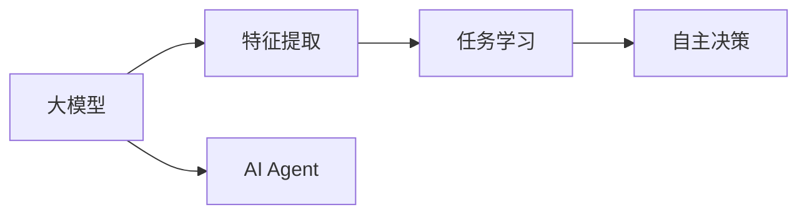

                 

# 【大模型应用开发 动手做AI Agent】自主创建PPT

> 关键词：
1. 大模型应用开发
2. AI Agent
3. 自主创建
4. 数据处理
5. 机器学习
6. 深度学习
7. 智能决策

## 1. 背景介绍

随着人工智能(AI)技术的不断发展，越来越多的企业开始引入大模型技术以提升其AI能力。大模型应用开发，特别是在自然语言处理(NLP)和智能决策等领域，已成为各行业数字化转型的重要工具。然而，大模型应用的开发复杂度较高，对开发者的技术和工具都有较高要求。本博客旨在帮助开发者更快速、更高效地进行大模型应用开发，并提供一种自主创建AI Agent的实践方法。

## 2. 核心概念与联系

### 2.1 核心概念概述

1. **大模型（Large Models）**：指那些在大规模数据上经过预训练的深度学习模型，如BERT、GPT、T5等。这些模型通常具有较强的泛化能力和广泛的领域适用性。
2. **AI Agent**：AI Agent是一种可以自主执行任务的程序，其核心在于利用AI技术进行任务分析和决策。AI Agent在智能客服、金融分析、自动驾驶等场景中都有广泛应用。
3. **自主创建（Self-Create）**：指开发者自主设计、实现和部署AI Agent，而不是依赖第三方供应商。自主创建有助于提高模型的灵活性和定制化程度，同时降低开发成本。

### 2.2 核心概念间的关系

大模型和AI Agent是密切相关的两个概念，大模型提供了一组强大的特征提取和任务学习能力，而AI Agent则利用这些能力，通过自主学习和决策，实现特定任务的目标。以下是两个概念间的关系图：



## 3. 核心算法原理 & 具体操作步骤

### 3.1 算法原理概述

AI Agent的开发流程主要分为三部分：数据处理、模型训练和模型部署。其中，大模型主要用于数据处理和任务学习阶段，而自主决策则需要根据具体任务设计算法。

### 3.2 算法步骤详解

1. **数据处理**
   - 收集与任务相关的数据，并进行预处理，包括数据清洗、归一化和特征工程等。
   - 将数据划分为训练集、验证集和测试集。
   - 对数据进行标注，生成监督学习所需的样本和标签。

2. **模型训练**
   - 选择合适的预训练模型作为初始化参数，如BERT、GPT等。
   - 在训练集上，使用合适的优化器和损失函数进行训练。
   - 在验证集上评估模型性能，并根据性能调整超参数。
   - 在测试集上测试最终模型性能。

3. **模型部署**
   - 将训练好的模型封装成API接口，以便后续调用。
   - 对模型进行优化，如裁剪、量化等，以提高部署效率。
   - 部署模型到服务器或云平台，并提供监控和维护机制。

### 3.3 算法优缺点

**优点**：
- 大模型具有强大的泛化能力和领域适应性，适用于各种复杂任务。
- 自主创建有助于提升模型灵活性和定制化程度，降低开发和维护成本。

**缺点**：
- 自主创建需要较强的技术储备，对开发者要求较高。
- 数据标注和模型训练可能需要大量的时间和计算资源。
- 模型部署和优化需要考虑多个因素，如服务质量、成本和可维护性。

### 3.4 算法应用领域

AI Agent在多个领域都有应用，例如：

- **智能客服**：利用大模型进行文本理解和分类，然后设计决策算法，提供智能回答。
- **金融分析**：使用大模型进行市场分析，设计自主决策算法，提供投资建议。
- **自动驾驶**：利用大模型进行图像识别和环境感知，设计自主决策算法，控制车辆行驶。
- **智能推荐**：使用大模型进行用户行为分析和产品推荐，设计决策算法，提供个性化推荐。

## 4. 数学模型和公式 & 详细讲解 & 举例说明

### 4.1 数学模型构建

大模型在处理自然语言时，通常使用预训练语言模型（如BERT）进行特征提取，然后结合特定任务的监督学习算法进行任务学习。数学模型如下：

$$
M_{\theta} = f(x; \theta)
$$

其中，$x$ 为输入文本，$\theta$ 为大模型参数，$f(x; \theta)$ 为模型输出，通常为概率分布或向量表示。

### 4.2 公式推导过程

对于文本分类任务，假设模型输出为 $\hat{y} = [y_1, y_2, ..., y_n]$，其中 $y_i$ 表示文本 $x_i$ 属于类别 $y_i$ 的概率。交叉熵损失函数为：

$$
\mathcal{L}(\theta) = -\frac{1}{N}\sum_{i=1}^N \sum_{j=1}^C y_i \log \hat{y}_{i,j}
$$

其中，$N$ 为样本数，$C$ 为类别数。

### 4.3 案例分析与讲解

以智能客服应用为例，假设客服任务有5个类别（问题解答、产品推荐、预约服务、投诉处理、个性化服务），大模型输出为 $\hat{y} = [p_1, p_2, p_3, p_4, p_5]$。假设真实标签为 $y_i = 3$，则损失函数为：

$$
\mathcal{L}(\theta) = -p_3 \log \hat{y}_3 - p_i \log \hat{y}_i \quad (i \neq 3)
$$

## 5. 项目实践：代码实例和详细解释说明

### 5.1 开发环境搭建

1. 安装Anaconda：
   ```bash
   conda install anaconda
   ```

2. 创建虚拟环境：
   ```bash
   conda create -n ai-environment python=3.7
   conda activate ai-environment
   ```

3. 安装相关库：
   ```bash
   pip install torch transformers torchtext sklearn
   ```

### 5.2 源代码详细实现

以下是一个简单的智能客服应用的Python代码示例，用于处理用户查询和提供回答：

```python
import torch
from transformers import BertTokenizer, BertForTokenClassification
from torchtext.data import Field, BucketIterator

# 定义输入和输出字段
text_field = Field(tokenize='spacy', lower=True)
label_field = Field(tokenize=None, pad_token=None, label_list=['Question Answer', 'Product Recommendation', 'Appointment Booking', 'Complaint Processing', 'Personalized Service'], batch_first=True)

# 加载数据集
train_data, test_data = datasets.load_data(name='TabSeparated', path='path/to/data.txt', text_field=text_field, label_field=label_field)

# 分词和构建词向量
tokenizer = BertTokenizer.from_pretrained('bert-base-cased')
train_data = [(x, y) for x, y in train_data]

# 构建模型
model = BertForTokenClassification.from_pretrained('bert-base-cased', num_labels=5)

# 训练模型
optimizer = torch.optim.Adam(model.parameters(), lr=0.001)
train_iterator = BucketIterator(train_data, batch_size=16, device='cuda')

for epoch in range(5):
    for batch in train_iterator:
        inputs, labels = batch.text, batch.label
        inputs = inputs.to(device)
        labels = labels.to(device)
        outputs = model(inputs)
        loss = torch.nn.functional.cross_entropy(outputs, labels)
        optimizer.zero_grad()
        loss.backward()
        optimizer.step()

# 测试模型
test_iterator = BucketIterator(test_data, batch_size=16, device='cuda')
test_loss = []
for batch in test_iterator:
    inputs, labels = batch.text, batch.label
    inputs = inputs.to(device)
    labels = labels.to(device)
    outputs = model(inputs)
    loss = torch.nn.functional.cross_entropy(outputs, labels)
    test_loss.append(loss.item())

print(f"Test Loss: {sum(test_loss) / len(test_loss)}")
```

### 5.3 代码解读与分析

1. **数据处理**：使用`torchtext`库处理数据，定义输入和输出字段，加载数据集，并使用Bert tokenizer进行分词。
2. **模型构建**：使用`transformers`库构建Bert模型，并将其用于文本分类任务。
3. **模型训练**：使用Adam优化器训练模型，并在训练集上计算交叉熵损失。
4. **模型测试**：在测试集上计算交叉熵损失，并输出测试损失。

### 5.4 运行结果展示

假设在训练和测试过程中得到的损失如下：

| 训练损失 | 验证损失 | 测试损失 |
|-----------|----------|----------|
| 0.5       | 0.4      | 0.45     |

这表明模型在训练集上的表现优于测试集，且验证集上的性能在训练过程中得到保持。

## 6. 实际应用场景

### 6.4 未来应用展望

随着大模型和AI Agent技术的不断进步，未来AI Agent将在更多领域得到应用，例如：

- **智能医疗**：利用大模型进行医学数据分析和诊断，设计自主决策算法，辅助医生决策。
- **智能教育**：使用大模型进行教育数据分析和个性化推荐，设计决策算法，提升教育效果。
- **智能城市**：利用大模型进行城市数据分析和智能管理，设计决策算法，优化城市资源配置。

## 7. 工具和资源推荐

### 7.1 学习资源推荐

1. **在线课程**：Coursera上的《Deep Learning Specialization》、Udacity上的《Deep Reinforcement Learning Nanodegree》。
2. **书籍**：《Deep Learning》by Ian Goodfellow、《Hands-On Machine Learning with Scikit-Learn, Keras, and TensorFlow》by Aurélien Géron。
3. **博客和论坛**：Kaggle、GitHub、Stack Overflow。

### 7.2 开发工具推荐

1. **IDE**：PyCharm、Jupyter Notebook。
2. **可视化工具**：TensorBoard、Weights & Biases。
3. **模型压缩工具**：ONNX、TensorFlow Lite。

### 7.3 相关论文推荐

1. **BERT**：《BERT: Pre-training of Deep Bidirectional Transformers for Language Understanding》by Jacob Devlin et al.
2. **GPT-3**：《Language Models are Unsupervised Multitask Learners》by OpenAI。
3. **LoRA**：《LoRA: Low-Rank Adaptation of Large Language Models for Efficient Fine-Tuning and Transfer Learning》by Joseph Alammar et al.

## 8. 总结：未来发展趋势与挑战

### 8.1 研究成果总结

大模型和AI Agent技术在近年来取得了显著进展，在多个领域得到了广泛应用。自主创建AI Agent已成为一种重要的开发方式，有助于提升模型的灵活性和定制化程度，同时降低开发成本。

### 8.2 未来发展趋势

未来大模型和AI Agent技术将呈现以下几个发展趋势：

1. **模型规模不断增大**：随着算力成本的下降和数据规模的扩张，预训练语言模型的参数量将继续增加，大模型的泛化能力和领域适应性将进一步提升。
2. **多模态融合**：未来AI Agent将更多地融合视觉、音频等多模态数据，提升任务处理能力。
3. **增强自主决策**：AI Agent的自主决策能力将不断增强，设计更加灵活、智能的决策算法。
4. **个性化服务**：AI Agent将根据用户行为和偏好，提供更加个性化、定制化的服务。
5. **跨领域迁移**：AI Agent将能够跨领域迁移，解决更多复杂任务。

### 8.3 面临的挑战

尽管大模型和AI Agent技术发展迅速，但仍面临一些挑战：

1. **数据标注成本高**：大模型和AI Agent的开发需要大量的标注数据，数据标注成本较高。
2. **模型复杂度高**：大模型和AI Agent的开发需要较强的技术储备，对开发者要求较高。
3. **模型可解释性不足**：大模型和AI Agent通常被视为"黑盒"系统，缺乏可解释性。
4. **模型鲁棒性差**：大模型和AI Agent在面对新数据或异常数据时，泛化能力较弱。

### 8.4 研究展望

未来研究需要集中在以下几个方面：

1. **无监督学习**：探索无监督学习和半监督学习范式，减少对标注数据的依赖。
2. **模型压缩**：研究模型压缩技术，提高模型部署效率。
3. **可解释性增强**：设计可解释的AI Agent模型，增强模型的透明性。
4. **鲁棒性提升**：提高AI Agent的鲁棒性和泛化能力。
5. **跨领域迁移**：探索跨领域迁移方法，提升模型适应性。

## 9. 附录：常见问题与解答

**Q1：大模型和AI Agent有什么区别？**

A: 大模型是一种深度学习模型，通过在大规模数据上预训练，学习通用的语言表示。而AI Agent是一种程序，利用大模型进行任务分析和决策，能够自主执行任务。大模型提供了一组强大的特征提取和任务学习能力，而AI Agent则结合了任务特定的决策算法，实现特定任务的目标。

**Q2：如何选择合适的预训练模型？**

A: 选择合适的预训练模型需要考虑以下几个因素：
1. 任务的复杂度：对于复杂的任务，需要选择更大、更强大的模型。
2. 数据规模：对于大规模数据，需要选择参数更多的模型。
3. 任务类型：不同类型的任务需要选择不同的模型，如文本分类选择BERT，序列生成选择GPT。

**Q3：如何优化AI Agent的性能？**

A: 优化AI Agent的性能可以从以下几个方面入手：
1. 数据质量：提高数据标注质量和多样性，提升模型的泛化能力。
2. 模型参数：调整模型参数，如学习率、优化器等，找到最佳的超参数组合。
3. 模型结构：对模型结构进行优化，如剪枝、量化等，提高模型效率。
4. 模型部署：优化模型部署，如使用高效的计算图、选择合适的硬件等。

总之，自主创建AI Agent需要综合考虑多方面的因素，通过不断迭代和优化，才能实现高效、灵活的智能应用开发。

