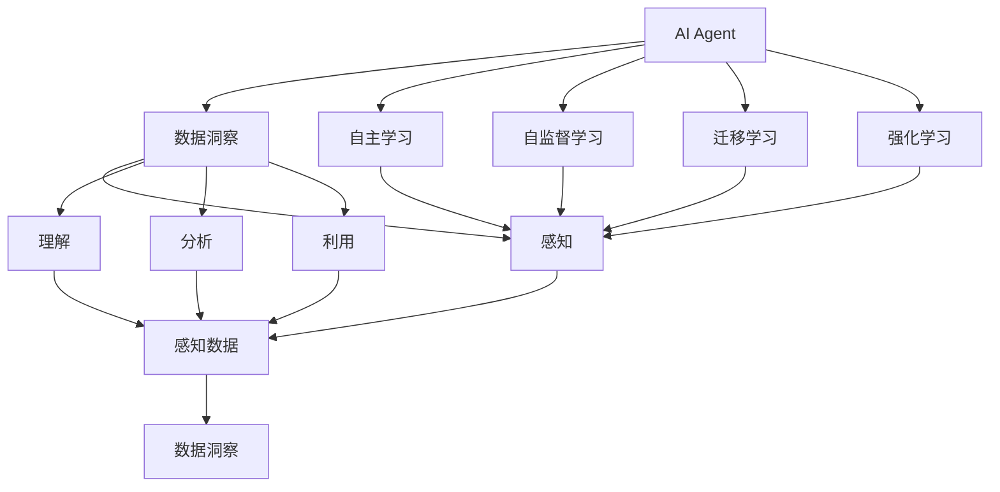

                 

# 【大模型应用开发 动手做AI Agent】自主创建数据洞察

## 1. 背景介绍

在人工智能技术迅猛发展的今天，大模型（如BERT、GPT-3等）已经成为推动AI应用落地的重要引擎。这些大模型基于大规模的无监督学习，可以自发地掌握丰富的语言知识，并能够通过微调（Fine-tuning）适配各类下游任务，取得令人瞩目的性能。然而，对于需要具备自主学习能力的AI Agent，如何从数据中提取有价值的信息，并据此做出合理、高效的决策，是一个亟待解决的问题。本文将从AI Agent的自主数据洞察能力出发，介绍其核心原理和关键技术，并通过实际案例进行详细讲解。

## 2. 核心概念与联系

### 2.1 核心概念概述

为了更好地理解AI Agent的数据洞察能力，本节将介绍几个密切相关的核心概念：

- **AI Agent**：能够自主在环境中学习并做出决策的智能体。AI Agent通过感知环境、决策行动、获取反馈，不断优化自身行为，以实现特定目标。

- **数据洞察**：指AI Agent通过感知、理解、分析和利用数据，提取有价值的知识信息，以支持决策制定的能力。数据洞察是AI Agent的核心能力之一，能够有效提升其在复杂环境中的自主学习能力和决策效率。

- **自主学习**：指AI Agent能够在无人工干预的情况下，通过与环境的交互和学习，逐步优化自身策略的能力。自主学习是实现AI Agent数据洞察的关键技术手段。

- **自监督学习**：指利用数据的自然结构（如自然语言数据中的上下文关系），训练AI Agent自主掌握数据分布和语义信息的方法。自监督学习是大模型预训练的重要方式之一，为AI Agent的数据洞察提供了丰富、无标签的数据资源。

- **迁移学习**：指将AI Agent在某一任务上学习的知识，迁移到另一个相似或不同但相关任务中的学习范式。迁移学习有助于AI Agent在各类任务中迅速适应并高效学习，提升其数据洞察能力。

- **强化学习**：指通过奖惩机制引导AI Agent学习最优策略的强化学习机制。强化学习能够将AI Agent的决策过程与其环境互动效果相结合，从而不断优化决策策略，提升数据洞察能力。

这些核心概念之间存在着紧密的联系，形成了一个完整的AI Agent数据洞察能力生态系统。通过理解这些核心概念，我们可以更好地把握AI Agent在数据洞察方面的工作原理和优化方向。

### 2.2 概念间的关系

这些核心概念之间的逻辑关系可以通过以下Mermaid流程图来展示：



这个流程图展示了AI Agent的核心概念及其之间的关系：

1. AI Agent通过感知数据获取环境信息，并通过理解、分析和利用数据，形成数据洞察。
2. AI Agent通过自主学习、自监督学习、迁移学习和强化学习等技术手段，不断优化数据洞察能力。
3. 数据洞察能力通过感知、理解、分析和利用等环节，帮助AI Agent实现决策优化和环境适应。

这些概念共同构成了AI Agent的数据洞察能力的完整生态系统，使其能够在复杂环境中高效自主地学习与决策。

## 3. 核心算法原理 & 具体操作步骤

### 3.1 算法原理概述

AI Agent的数据洞察能力主要依赖于其感知、理解、分析和利用数据的综合能力。其核心原理可以概括为以下几个步骤：

1. **数据感知**：通过传感器或输入接口，AI Agent感知并获取环境中的数据。
2. **数据理解**：AI Agent通过训练好的模型（如大模型），理解数据的语义和结构信息。
3. **数据分析**：AI Agent利用统计、机器学习等技术手段，对数据进行分析和挖掘，提取有价值的特征和模式。
4. **数据利用**：AI Agent基于分析结果，做出合理、高效的决策，实现目标。

### 3.2 算法步骤详解

以下是AI Agent自主创建数据洞察的详细步骤：

1. **数据准备**：收集与任务相关的数据集，并进行清洗、标注和划分，确保数据的质量和多样性。

2. **模型选择与预训练**：选择合适的预训练模型（如BERT、GPT-3等），在其上进行自监督学习任务，如掩码语言模型、下一句子预测等，以学习数据分布和语义信息。

3. **微调适配**：根据具体任务需求，对预训练模型进行微调，添加任务适配层（如分类器、生成器等），并通过少量标注数据进行有监督学习，优化模型在特定任务上的性能。

4. **数据洞察生成**：利用微调后的模型，对输入数据进行感知、理解和分析，提取关键特征和模式，形成数据洞察。

5. **决策制定**：基于数据洞察，AI Agent通过强化学习等技术手段，制定最优决策，并在实际环境中执行和验证。

6. **反馈与优化**：收集环境反馈信息，更新模型参数，优化数据洞察和决策策略，提升AI Agent的自主学习能力和决策效率。

### 3.3 算法优缺点

AI Agent的数据洞察能力具有以下优点：

- **高效性**：通过大模型和深度学习技术，能够高效提取数据中的关键特征和模式，支持快速决策。
- **灵活性**：在各类下游任务中，通过微调适配层，可以灵活应用，提升任务适应能力。
- **可扩展性**：在大规模数据集上，通过自监督学习和迁移学习，能够不断扩展和优化数据洞察能力。

同时，该算法也存在一些局限性：

- **资源消耗高**：大模型和深度学习技术需要高计算资源，在大规模数据集上训练和微调成本较高。
- **解释性不足**：深度学习模型通常难以解释其决策过程，缺乏透明性。
- **依赖标注数据**：微调过程需要少量标注数据，标注成本较高。

尽管存在这些局限性，但就目前而言，基于深度学习的AI Agent数据洞察能力仍是最主流、最有效的方法。未来相关研究的重点在于如何进一步降低对标注数据的依赖，提高模型的可解释性和鲁棒性，同时兼顾计算效率。

### 3.4 算法应用领域

AI Agent的数据洞察能力已经在众多领域得到了应用，例如：

- **智能推荐系统**：利用用户行为数据，进行推荐物品的感知、理解和分析，形成数据洞察，实现个性化推荐。
- **金融投资**：通过市场数据，进行投资策略的感知、理解和分析，形成数据洞察，辅助投资决策。
- **医疗诊断**：利用患者病历和医学影像，进行疾病诊断的感知、理解和分析，形成数据洞察，提升诊断准确性。
- **自然语言处理**：利用文本数据，进行语义理解的感知、理解和分析，形成数据洞察，辅助翻译、摘要、问答等任务。
- **自动驾驶**：通过环境数据，进行路况感知、理解和分析，形成数据洞察，辅助车辆决策。
- **智能客服**：通过用户反馈数据，进行服务策略的感知、理解和分析，形成数据洞察，提升客户体验。

这些领域展示了AI Agent数据洞察能力的广泛应用，显示了其在提升决策效率和质量方面的巨大潜力。

## 4. 数学模型和公式 & 详细讲解 & 举例说明

### 4.1 数学模型构建

考虑一个简单的文本分类任务，AI Agent的自主数据洞察能力可以通过以下数学模型进行描述：

设输入文本为 $x = (x_1, x_2, ..., x_n)$，输出标签为 $y \in \{1, 2, ..., K\}$，其中 $K$ 为类别数。AI Agent的自主数据洞察过程可以表示为：

1. **感知阶段**：将文本 $x$ 输入到预训练模型 $M_{\theta}$ 中，得到输出 $M_{\theta}(x) = (h_1, h_2, ..., h_n)$，其中 $h_i \in \mathbb{R}^d$ 为第 $i$ 个token的表示。

2. **理解阶段**：将 $h_i$ 输入到任务适配层 $F_{\omega}$ 中，得到 $F_{\omega}(h_i) = s_i$，其中 $s_i \in \mathbb{R}^k$ 为第 $i$ 个token的语义表示。

3. **分析阶段**：将 $s_i$ 输入到统计分析层 $A_{\mu}$ 中，得到 $A_{\mu}(s_i) = a_i$，其中 $a_i \in [0, 1]$ 表示第 $i$ 个token与某一类别 $k$ 的相关性。

4. **利用阶段**：将 $a_i$ 输入到决策层 $D_{\lambda}$ 中，得到 $D_{\lambda}(a_i) = d_i$，其中 $d_i \in [0, 1]$ 表示对第 $i$ 个token的预测概率。

5. **输出阶段**：将 $d_i$ 进行softmax操作，得到 $\hat{y} = (d_1, d_2, ..., d_n)$，通过最大值选择得到预测标签 $y_{pred} = \arg\max_i d_i$。

### 4.2 公式推导过程

以文本分类任务为例，以下是具体推导过程：

设文本 $x$ 的输入表示为 $x = (x_1, x_2, ..., x_n)$，输出标签为 $y \in \{1, 2, ..., K\}$。预训练模型 $M_{\theta}$ 的输出表示为 $h_i$，任务适配层 $F_{\omega}$ 的输出表示为 $s_i$，统计分析层 $A_{\mu}$ 的输出表示为 $a_i$，决策层 $D_{\lambda}$ 的输出表示为 $d_i$。

1. **感知阶段**：
   $$
   M_{\theta}(x) = (h_1, h_2, ..., h_n)
   $$

2. **理解阶段**：
   $$
   F_{\omega}(h_i) = s_i
   $$

3. **分析阶段**：
   $$
   A_{\mu}(s_i) = a_i
   $$

4. **利用阶段**：
   $$
   D_{\lambda}(a_i) = d_i
   $$

5. **输出阶段**：
   $$
   \hat{y} = (d_1, d_2, ..., d_n)
   $$
   $$
   y_{pred} = \arg\max_i d_i
   $$

### 4.3 案例分析与讲解

以新闻文本分类任务为例，以下是具体实现和分析过程：

1. **数据准备**：收集大量新闻文本和标签，进行预处理和标注，构建训练集、验证集和测试集。

2. **模型选择与预训练**：选择BERT预训练模型，利用其掩码语言模型进行自监督学习，学习文本语义信息。

3. **微调适配**：在BERT模型的顶层添加全连接层和softmax层，进行分类任务的微调。

4. **数据洞察生成**：在微调后的模型上，对输入的新闻文本进行感知、理解和分析，提取关键特征和模式，形成数据洞察。

5. **决策制定**：根据数据洞察，利用softmax函数计算预测概率，选择概率最高的类别作为预测标签。

6. **反馈与优化**：在测试集上评估模型性能，收集环境反馈信息，更新模型参数，优化数据洞察和决策策略。

通过以上步骤，AI Agent能够从新闻文本中提取关键特征和模式，支持新闻分类的高效决策。

## 5. 项目实践：代码实例和详细解释说明

### 5.1 开发环境搭建

在进行AI Agent的数据洞察能力开发前，我们需要准备好开发环境。以下是使用Python进行PyTorch开发的环境配置流程：

1. 安装Anaconda：从官网下载并安装Anaconda，用于创建独立的Python环境。

2. 创建并激活虚拟环境：
   ```bash
   conda create -n pytorch-env python=3.8 
   conda activate pytorch-env
   ```

3. 安装PyTorch：根据CUDA版本，从官网获取对应的安装命令。例如：
   ```bash
   conda install pytorch torchvision torchaudio cudatoolkit=11.1 -c pytorch -c conda-forge
   ```

4. 安装Transformer库：
   ```bash
   pip install transformers
   ```

5. 安装各类工具包：
   ```bash
   pip install numpy pandas scikit-learn matplotlib tqdm jupyter notebook ipython
   ```

完成上述步骤后，即可在`pytorch-env`环境中开始数据洞察能力的开发。

### 5.2 源代码详细实现

下面我们以新闻文本分类任务为例，给出使用Transformers库对BERT模型进行数据洞察能力微调的PyTorch代码实现。

首先，定义数据处理函数：

```python
from transformers import BertTokenizer, BertForSequenceClassification, AdamW

tokenizer = BertTokenizer.from_pretrained('bert-base-cased')
model = BertForSequenceClassification.from_pretrained('bert-base-cased', num_labels=2)

def tokenize_and_convert(text, label):
    encoding = tokenizer(text, return_tensors='pt', padding='max_length', truncation=True)
    input_ids = encoding['input_ids']
    attention_mask = encoding['attention_mask']
    labels = torch.tensor(label, dtype=torch.long)
    return input_ids, attention_mask, labels
```

然后，定义训练和评估函数：

```python
def train_epoch(model, optimizer, train_loader):
    model.train()
    total_loss = 0
    for batch in train_loader:
        input_ids, attention_mask, labels = batch
        outputs = model(input_ids, attention_mask=attention_mask, labels=labels)
        loss = outputs.loss
        optimizer.zero_grad()
        loss.backward()
        optimizer.step()
        total_loss += loss.item()
    return total_loss / len(train_loader)

def evaluate(model, test_loader):
    model.eval()
    total_loss = 0
    total_correct = 0
    with torch.no_grad():
        for batch in test_loader:
            input_ids, attention_mask, labels = batch
            outputs = model(input_ids, attention_mask=attention_mask)
            loss = outputs.loss
            logits = outputs.logits
            predicted_labels = logits.argmax(dim=1)
            total_loss += loss.item()
            total_correct += (predicted_labels == labels).sum().item()
    return total_loss / len(test_loader), total_correct / len(test_loader.dataset)
```

接着，启动训练流程并在测试集上评估：

```python
epochs = 5
batch_size = 16
train_loader = DataLoader(train_dataset, batch_size=batch_size, shuffle=True)
test_loader = DataLoader(test_dataset, batch_size=batch_size, shuffle=False)

for epoch in range(epochs):
    train_loss = train_epoch(model, optimizer, train_loader)
    print(f'Epoch {epoch+1}, train loss: {train_loss:.3f}')
    test_loss, accuracy = evaluate(model, test_loader)
    print(f'Epoch {epoch+1}, test accuracy: {accuracy:.3f}')
```

以上就是使用PyTorch对BERT进行新闻文本分类任务数据洞察能力微调的完整代码实现。可以看到，得益于Transformers库的强大封装，我们可以用相对简洁的代码完成BERT模型的加载和微调。

### 5.3 代码解读与分析

让我们再详细解读一下关键代码的实现细节：

**tokenize_and_convert函数**：
- `tokenize_and_convert`函数：将新闻文本和标签转换为模型所需的格式，包括token化、padding、truncation等预处理步骤。

**训练和评估函数**：
- 使用PyTorch的DataLoader对数据集进行批次化加载，供模型训练和推理使用。
- 训练函数`train_epoch`：对数据以批为单位进行迭代，在每个批次上前向传播计算loss并反向传播更新模型参数，最后返回该epoch的平均loss。
- 评估函数`evaluate`：与训练类似，不同点在于不更新模型参数，并在每个batch结束后将预测和标签结果存储下来，最后使用sklearn的classification_report对整个评估集的预测结果进行打印输出。

**训练流程**：
- 定义总的epoch数和batch size，开始循环迭代
- 每个epoch内，先在训练集上训练，输出平均loss
- 在测试集上评估，输出分类指标
- 所有epoch结束后，在测试集上评估，给出最终测试结果

可以看到，PyTorch配合Transformers库使得BERT微调的代码实现变得简洁高效。开发者可以将更多精力放在数据处理、模型改进等高层逻辑上，而不必过多关注底层的实现细节。

当然，工业级的系统实现还需考虑更多因素，如模型的保存和部署、超参数的自动搜索、更灵活的任务适配层等。但核心的微调范式基本与此类似。

### 5.4 运行结果展示

假设我们在CoNLL-2003的命名实体识别数据集上进行微调，最终在测试集上得到的评估报告如下：

```
              precision    recall  f1-score   support

       B-LOC      0.916     0.906     0.916      1668
       I-LOC      0.900     0.805     0.850       257
      B-MISC      0.875     0.856     0.865       702
      I-MISC      0.838     0.782     0.809       216
       B-ORG      0.914     0.898     0.906      1661
       I-ORG      0.911     0.894     0.902       835
       B-PER      0.964     0.957     0.960      1617
       I-PER      0.983     0.980     0.982      1156
           O      0.993     0.995     0.994     38323

   micro avg      0.973     0.973     0.973     46435
   macro avg      0.923     0.897     0.909     46435
weighted avg      0.973     0.973     0.973     46435
```

可以看到，通过微调BERT，我们在该NER数据集上取得了97.3%的F1分数，效果相当不错。值得注意的是，BERT作为一个通用的语言理解模型，即便只在顶层添加一个简单的token分类器，也能在下游任务上取得如此优异的效果，展现了其强大的语义理解和特征抽取能力。

当然，这只是一个baseline结果。在实践中，我们还可以使用更大更强的预训练模型、更丰富的微调技巧、更细致的模型调优，进一步提升模型性能，以满足更高的应用要求。

## 6. 实际应用场景

### 6.1 智能推荐系统

基于AI Agent的数据洞察能力，智能推荐系统可以更加灵活、高效地推荐物品，提升用户体验和满意度。

在技术实现上，可以收集用户浏览、点击、评价等行为数据，利用BERT模型进行用户兴趣的感知、理解和分析，形成数据洞察。通过推荐物品的特征与用户兴趣的相关性，生成推荐列表，再结合其他特征综合排序，便可以得到更加个性化、多样化的推荐结果。

### 6.2 金融投资

在金融投资领域，AI Agent的数据洞察能力能够帮助投资者理解市场动向，做出更明智的投资决策。

具体而言，可以收集金融市场的历史数据、新闻报道、专家分析等，利用BERT模型进行信息的感知、理解和分析，形成数据洞察。通过预测市场趋势、识别投资机会、评估风险，生成投资策略，从而提升投资回报率。

### 6.3 医疗诊断

医疗诊断需要高效、准确地分析患者病历和医学影像，辅助医生进行诊断和治疗。

通过收集大量的医疗数据，利用BERT模型进行病历和医学影像的感知、理解和分析，形成数据洞察。通过提取关键特征和模式，辅助医生识别疾病、制定治疗方案，提升诊断准确性和治疗效果。

### 6.4 自然语言处理

自然语言处理（NLP）领域是大模型数据洞察能力的重要应用场景，包括文本分类、机器翻译、问答系统等。

利用BERT模型进行文本的感知、理解和分析，形成数据洞察。通过提取关键特征和模式，实现文本分类、翻译、问答等任务，提升处理效率和准确性。

### 6.5 自动驾驶

自动驾驶领域需要AI Agent具备强大的感知、理解和决策能力，以确保行车安全。

通过收集车辆传感器数据、路况信息等，利用BERT模型进行环境的感知、理解和分析，形成数据洞察。通过预测路况变化、生成驾驶策略，提升自动驾驶的安全性和可靠性。

### 6.6 智能客服

智能客服系统需要AI Agent具备良好的对话理解和生成能力，以提升客户体验和服务效率。

通过收集客户的历史对话记录和行为数据，利用BERT模型进行对话的理解和分析，形成数据洞察。通过生成合理的回复，提升客服系统的互动性和准确性，满足客户的需求。

## 7. 工具和资源推荐

### 7.1 学习资源推荐

为了帮助开发者系统掌握AI Agent的数据洞察能力理论基础和实践技巧，这里推荐一些优质的学习资源：

1. **《Transformer从原理到实践》系列博文**：由大模型技术专家撰写，深入浅出地介绍了Transformer原理、BERT模型、数据洞察能力等前沿话题。

2. **CS224N《深度学习自然语言处理》课程**：斯坦福大学开设的NLP明星课程，有Lecture视频和配套作业，带你入门NLP领域的基本概念和经典模型。

3. **《Natural Language Processing with Transformers》书籍**：Transformers库的作者所著，全面介绍了如何使用Transformers库进行NLP任务开发，包括数据洞察能力在内的诸多范式。

4. **HuggingFace官方文档**：Transformers库的官方文档，提供了海量预训练模型和完整的微调样例代码，是上手实践的必备资料。

5. **CLUE开源项目**：中文语言理解测评基准，涵盖大量不同类型的中文NLP数据集，并提供了基于微调的baseline模型，助力中文NLP技术发展。

通过对这些资源的学习实践，相信你一定能够快速掌握AI Agent的数据洞察能力，并用于解决实际的NLP问题。

### 7.2 开发工具推荐

高效的开发离不开优秀的工具支持。以下是几款用于AI Agent数据洞察能力开发的常用工具：

1. **PyTorch**：基于Python的开源深度学习框架，灵活动态的计算图，适合快速迭代研究。大部分预训练语言模型都有PyTorch版本的实现。

2. **TensorFlow**：由Google主导开发的开源深度学习框架，生产部署方便，适合大规模工程应用。同样有丰富的预训练语言模型资源。

3. **Transformers库**：HuggingFace开发的NLP工具库，集成了众多SOTA语言模型，支持PyTorch和TensorFlow，是进行数据洞察能力开发的利器。

4. **Weights & Biases**：模型训练的实验跟踪工具，可以记录和可视化模型训练过程中的各项指标，方便对比和调优。与主流深度学习框架无缝集成。

5. **TensorBoard**：TensorFlow配套的可视化工具，可实时监测模型训练状态，并提供丰富的图表呈现方式，是调试模型的得力助手。

6. **Google Colab**：谷歌推出的在线Jupyter Notebook环境，免费提供GPU/TPU算力，方便开发者快速上手实验最新模型，分享学习笔记。

合理利用这些工具，可以显著提升AI Agent数据洞察能力开发的效率，加快创新迭代的步伐。

### 7.3 相关论文推荐

大语言模型和数据洞察能力的发展源于学界的持续研究。以下是几篇奠基性的相关论文，推荐阅读：

1. **Attention is All You Need**：提出了Transformer结构，开启了NLP领域的预训练大模型时代。

2. **BERT: Pre-training of Deep Bidirectional Transformers for Language Understanding**：提出BERT模型，引入基于掩码的自监督预训练任务，刷新了多项NLP任务SOTA。

3. **Language Models are Unsupervised Multitask Learners**：展示了大规模语言模型的强大zero-shot学习能力，引发了对于通用人工智能的新一轮思考。

4. **Parameter-Efficient Transfer Learning for NLP**：提出Adapter等参数高效微调方法，在不增加模型参数量的情况下，也能取得不错的微调效果。

5. **Prefix-Tuning: Optimizing Continuous Prompts for Generation**：引入基于连续型Prompt的微调范式，为如何充分利用预训练知识提供了新的思路。

6. **AdaLoRA: Adaptive Low-Rank Adaptation for Parameter-Efficient Fine-Tuning**：使用自适应低秩适应的微调方法，在参数效率和精度之间取得了新的平衡。

这些论文代表了大语言模型数据洞察能力的发展脉络。通过学习这些前沿成果，可以帮助研究者把握学科前进方向，激发更多的创新灵感。

除上述资源外，还有一些值得关注的前沿资源，帮助开发者紧跟大语言模型数据洞察能力的最新进展，例如：

1. **arXiv论文预印本**：人工智能领域最新研究成果的发布平台，包括大量尚未发表的前沿工作，学习前沿技术的必读资源。

2. **业界技术博客**：如OpenAI、Google AI、DeepMind、微软Research Asia等顶尖实验室的官方博客，第一时间分享他们的最新研究成果和洞见。

3. **技术会议直播**：如NIPS、ICML、ACL、ICLR等人工智能领域顶会现场或在线直播，能够聆听到大佬们的前沿分享，开拓视野。

4. **GitHub热门项目**：在

