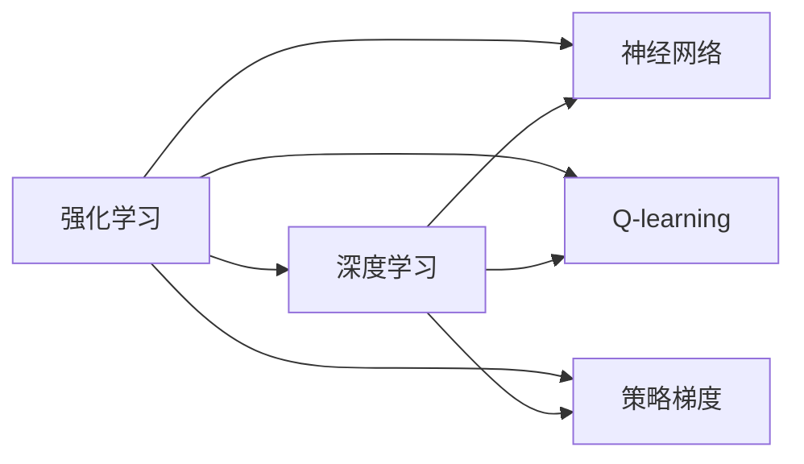
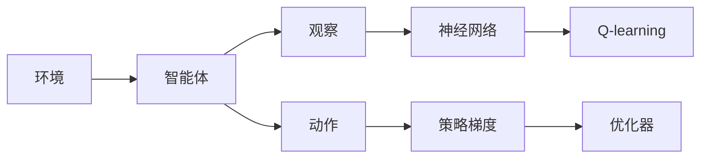
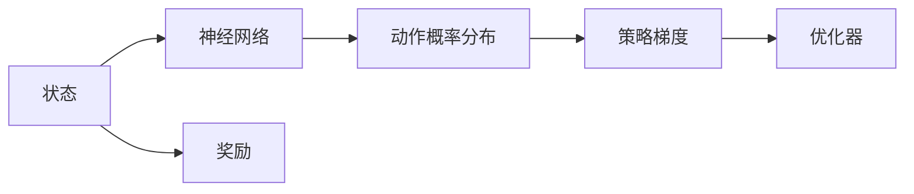

                 

# 一切皆是映射：AI Q-learning以及深度学习的融合

> 关键词：强化学习, 深度学习, Q-learning, 策略梯度, 神经网络, 自适应, 应用场景

## 1. 背景介绍

### 1.1 问题由来
在人工智能领域，强化学习（Reinforcement Learning, RL）与深度学习（Deep Learning, DL）是两大核心技术。传统的Q-learning算法作为强化学习的经典范式，在求解连续状态空间和连续动作空间的任务时面临巨大挑战。而深度学习通过神经网络的多层非线性映射能力，可以解决复杂非线性映射问题，成为强化学习的重要补充。将Q-learning与深度学习融合，构建神经网络Q-learning（Deep Q-Learning, DQN），已成为强化学习研究的热点方向。

然而，深度学习网络的非线性映射特性，以及Q-learning在动作空间映射上的局限性，使得融合后的系统在理论基础和算法实现上存在许多问题。例如，深度Q-learning如何避免深度网络中的过拟合和梯度消失？如何在动作空间映射上达到更高效的优化效果？这些问题都需要我们在理论和技术上深入探索。

### 1.2 问题核心关键点
基于深度学习的强化学习技术，主要涉及以下几个关键点：
1. 网络结构设计：如何选择和设计深度神经网络结构，使得网络能够有效处理复杂非线性映射？
2. 经验回放（Experience Replay）：如何高效存储和重放历史经验，避免Q-learning的过拟合问题？
3. 策略优化：如何通过优化神经网络参数，使得Q-learning的Q值估计更加准确？
4. 损失函数设计：如何设计合理的损失函数，综合考虑Q值估计和动作选择策略？
5. 动作选择策略：如何选择动作，使得在动作空间映射上达到更高效的优化效果？
6. 优化算法：如何选择和优化优化算法，使得深度Q-learning能够在高效、稳定的基础上实现最优策略的学习。

这些关键点共同构成了深度Q-learning的核心技术框架，是实现高效、稳定、泛化性能强的深度Q-learning算法的基础。

### 1.3 问题研究意义
深度Q-learning在机器人和自动化决策等场景中具有广泛应用前景，能够显著提升决策效率和性能。然而，深度网络的结构设计、经验回放、策略优化等关键技术仍然有待深入研究，需要进一步探索高效、鲁棒、泛化的深度Q-learning算法，推动AI技术在实际应用中的落地和发展。

## 2. 核心概念与联系

### 2.1 核心概念概述

为更好地理解深度Q-learning的原理和架构，本节将介绍几个关键概念：

- 强化学习(Reinforcement Learning, RL)：一种通过试错方式，优化策略使智能体（agent）在特定环境（environment）中获得最大奖励的学习方法。
- 深度学习(Deep Learning, DL)：一种通过多层神经网络结构，对复杂非线性问题进行建模和预测的机器学习方法。
- 神经网络(Neural Network, NN)：一种基于人工神经元模型的计算单元集合，用于实现复杂非线性映射。
- Q-learning：一种基于价值函数估计的强化学习算法，通过估计状态-动作对的Q值，指导智能体选择最优动作。
- 策略梯度(Strategy Gradient)：一种通过直接优化策略参数，使智能体选择动作概率分布优化的方法。

这些概念之间的逻辑关系可以通过以下Mermaid流程图来展示：



这个流程图展示了深度Q-learning的各个关键组成部分及其相互关系：

1. 强化学习作为整体框架，构建深度Q-learning的基础。
2. 神经网络作为深度Q-learning的特征提取和映射工具。
3. Q-learning作为核心算法，负责动作选择和奖励反馈。
4. 策略梯度作为优化方法，用于提升Q-learning算法的收敛性和泛化性能。

这些概念共同构成了深度Q-learning的完整技术体系，使其能够在复杂的智能决策场景中发挥作用。通过理解这些核心概念，我们可以更好地把握深度Q-learning的工作原理和优化方向。

### 2.2 概念间的关系

这些核心概念之间存在着紧密的联系，形成了深度Q-learning的完整生态系统。下面我们通过几个Mermaid流程图来展示这些概念之间的关系。

#### 2.2.1 深度Q-learning的整体架构



这个流程图展示了深度Q-learning的整体架构：

1. 智能体从环境中观察当前状态，送入神经网络进行处理，获得状态-动作对Q值的估计。
2. 智能体通过Q-learning算法，选择最优动作，使得累计奖励最大化。
3. 智能体在动作空间映射上，通过策略梯度进行优化，更新神经网络参数。
4. 优化器对神经网络参数进行更新，完成深度Q-learning的迭代过程。

#### 2.2.2 神经网络在深度Q-learning中的应用


这个流程图展示了神经网络在深度Q-learning中的具体作用：

1. 神经网络将观察到的状态进行特征提取和映射，获得高维的特征表示。
2. 高维特征表示被送入动作选择模块，用于计算Q值。
3. 动作选择模块输出动作概率分布，指导智能体选择动作。

#### 2.2.3 策略梯度在深度Q-learning中的优化作用



这个流程图展示了策略梯度在深度Q-learning中的优化作用：

1. 神经网络输出动作概率分布，用于指导智能体选择动作。
2. 智能体在当前状态下选择动作，获得奖励反馈。
3. 策略梯度对动作概率分布进行优化，提升智能体的策略选择能力。
4. 优化器对神经网络参数进行更新，完成深度Q-learning的迭代过程。

通过这些流程图，我们可以更清晰地理解深度Q-learning的各个组成部分及其相互关系，为后续深入讨论具体的算法实现提供基础。

## 3. 核心算法原理 & 具体操作步骤
### 3.1 算法原理概述

深度Q-learning（Deep Q-Learning, DQN）是一种将Q-learning算法与深度神经网络技术相结合的强化学习方法，用于解决连续状态空间和连续动作空间的强化学习问题。DQN的核心思想是通过深度神经网络估计Q值函数，使得智能体能够在复杂的动作空间中做出最优决策。

在DQN中，神经网络将状态映射为Q值，Q值表示在给定状态下采取某个动作的预期奖励。智能体通过最大化Q值，选择最优动作。

### 3.2 算法步骤详解

基于深度Q-learning的强化学习系统主要包括以下关键步骤：

**Step 1: 准备数据集和神经网络**

- 收集强化学习环境的历史数据集，包括状态、动作和奖励信息。
- 设计神经网络架构，包括输入层、隐藏层和输出层。

**Step 2: 训练神经网络**

- 将历史数据集划分为训练集和验证集。
- 使用训练集数据对神经网络进行训练，优化神经网络参数。

**Step 3: 状态-动作映射**

- 在训练好的神经网络中，使用当前状态作为输入，输出Q值。
- 根据Q值选择动作，使得智能体采取最优动作。

**Step 4: 奖励反馈和经验回放**

- 智能体在执行动作后，获取环境反馈，更新Q值。
- 将最新的状态、动作、奖励数据存储到经验回放缓冲区中，用于后续的训练。

**Step 5: 重复迭代**

- 重复执行步骤3和步骤4，直到达到预设的迭代次数或达到最优策略。

### 3.3 算法优缺点

基于深度Q-learning的强化学习系统具有以下优点：

1. 高效处理连续状态空间和动作空间：深度神经网络能够处理高维的非线性映射，使得智能体能够处理复杂的强化学习问题。
2. 克服Q-learning的局部最优问题：通过深度神经网络，智能体能够在更大的动作空间中探索最优策略。
3. 利用经验回放，提高数据利用率：经验回放技术可以重复利用历史经验，避免Q-learning的过拟合问题。

同时，基于深度Q-learning的强化学习系统也存在一些缺点：

1. 计算资源消耗大：深度神经网络的训练需要大量的计算资源，尤其是在大规模数据集上。
2. 过拟合风险高：深度神经网络容易出现过拟合现象，特别是在数据量不足的情况下。
3. 收敛速度慢：神经网络的训练过程相对较慢，需要较长的时间才能收敛。
4. 网络结构复杂：深度神经网络的复杂结构使得其难以解释，增加了调试和优化的难度。

### 3.4 算法应用领域

基于深度Q-learning的强化学习系统，在以下几个领域中具有广泛应用：

1. 机器人控制：通过深度Q-learning训练机器人执行复杂动作，优化控制策略。
2. 自动化决策：应用于自动驾驶、工业自动化等需要实时决策的场景。
3. 游戏AI：用于训练游戏AI，使其能够在复杂的游戏环境中实现最优策略。
4. 智能推荐：用于训练推荐系统，优化用户推荐策略，提升用户体验。
5. 资源调度：应用于云计算、交通调度等需要优化资源配置的场景。

除了这些应用领域，深度Q-learning还将在更多场景中发挥作用，推动强化学习技术在实际应用中的落地和发展。

## 4. 数学模型和公式 & 详细讲解 & 举例说明

### 4.1 数学模型构建

基于深度Q-learning的强化学习系统主要涉及以下几个数学模型：

- 状态-动作值函数（Q值函数）：用于估计当前状态-动作对的预期奖励。
- 神经网络模型：用于映射状态到Q值函数。
- 策略梯度：用于优化神经网络参数，使得Q值函数估计更加准确。

以连续状态空间和连续动作空间的强化学习问题为例，假设智能体在每个状态下可以选择连续动作，状态空间为 $s \in \mathcal{S}$，动作空间为 $a \in \mathcal{A}$，奖励函数为 $r: \mathcal{S} \times \mathcal{A} \rightarrow [0, 1]$。

### 4.2 公式推导过程

以下是深度Q-learning的数学模型和公式推导过程：

1. Q值函数的定义

$$
Q_{\theta}(s,a) = \mathbb{E}[G_t \mid s_t = s, a_t = a]
$$

其中，$G_t$ 表示从当前状态开始，采取动作 $a$，在后续的时间步中获得的总奖励。$Q_{\theta}$ 是参数为 $\theta$ 的神经网络估计的Q值函数。

2. 神经网络模型的定义

$$
Q_{\theta}(s) = \theta^T f(s)
$$

其中，$f(s)$ 是神经网络输出层对状态 $s$ 的映射函数，$\theta$ 是神经网络参数。

3. 策略梯度的定义

$$
\nabla_{\theta}J(\theta) = \mathbb{E}[\sum_{t=0}^{\infty} \nabla_{\theta}Q_{\theta}(s_t,a_t) \rho_{\theta}(s_t,a_t) \delta_t]
$$

其中，$J(\theta)$ 是策略梯度优化目标函数，$\rho_{\theta}(s_t,a_t)$ 是策略分布，$\delta_t$ 是TD误差。

### 4.3 案例分析与讲解

以训练一个简单的交通灯控制问题为例，说明深度Q-learning的算法流程和计算过程：

假设交通灯系统有四种状态：绿色（0）、黄色（1）、红色（2）和停止（3）。智能体需要根据当前状态选择最优动作，使得车辆通行时间最大化。

1. 数据集准备

- 收集交通灯系统的历史数据集，包括每个状态下的车辆通行时间。
- 将数据集划分为训练集和验证集。

2. 神经网络设计

- 设计神经网络架构，包括输入层、隐藏层和输出层。
- 使用交叉熵损失函数训练神经网络。

3. 状态-动作映射

- 将当前状态 $s_t$ 输入神经网络，输出Q值 $Q_{\theta}(s_t,a)$。
- 选择Q值最大的动作 $a_t$，执行智能体的动作选择策略。

4. 奖励反馈和经验回放

- 智能体在执行动作 $a_t$ 后，根据当前状态 $s_{t+1}$ 和下一个状态 $s_{t+2}$ 的通行时间，计算奖励 $r_t = r(s_{t+1},a_t)$。
- 将当前状态、动作、奖励数据存储到经验回放缓冲区中，用于后续的训练。

5. 重复迭代

- 重复执行步骤3和步骤4，直到达到预设的迭代次数或达到最优策略。

## 5. 项目实践：代码实例和详细解释说明

### 5.1 开发环境搭建

在进行深度Q-learning实践前，我们需要准备好开发环境。以下是使用Python进行TensorFlow开发的环境配置流程：

1. 安装Anaconda：从官网下载并安装Anaconda，用于创建独立的Python环境。

2. 创建并激活虚拟环境：
```bash
conda create -n tf-env python=3.8 
conda activate tf-env
```

3. 安装TensorFlow：根据CUDA版本，从官网获取对应的安装命令。例如：
```bash
conda install tensorflow-gpu=2.8
```

4. 安装各类工具包：
```bash
pip install numpy pandas scikit-learn matplotlib tqdm jupyter notebook ipython
```

完成上述步骤后，即可在`tf-env`环境中开始深度Q-learning实践。

### 5.2 源代码详细实现

这里我们以训练一个简单的交通灯控制问题为例，给出使用TensorFlow实现深度Q-learning的完整代码实现。

```python
import tensorflow as tf
import numpy as np
import random

# 定义神经网络模型
class NeuralNetwork(tf.keras.Model):
    def __init__(self, input_size, output_size):
        super(NeuralNetwork, self).__init__()
        self.hidden_layer = tf.keras.layers.Dense(32, activation='relu')
        self.output_layer = tf.keras.layers.Dense(output_size)

    def call(self, inputs):
        hidden = self.hidden_layer(inputs)
        outputs = self.output_layer(hidden)
        return outputs

# 定义智能体
class Agent:
    def __init__(self, input_size, output_size, learning_rate):
        self.input_size = input_size
        self.output_size = output_size
        self.learning_rate = learning_rate
        self.model = NeuralNetwork(input_size, output_size)
        self.optimizer = tf.keras.optimizers.Adam(learning_rate)

    def train(self, states, actions, rewards, next_states):
        with tf.GradientTape() as tape:
            q_values = self.model(states)
            q_values_next = self.model(next_states)
            q_values = tf.squeeze(q_values, axis=1)
            q_values_next = tf.squeeze(q_values_next, axis=1)
            q_target = q_values + self.learning_rate * (rewards + 0.99 * np.max(q_values_next) - q_values)
            loss = tf.reduce_mean(tf.square(q_values - q_target))
        gradients = tape.gradient(loss, self.model.trainable_variables)
        self.optimizer.apply_gradients(zip(gradients, self.model.trainable_variables))

    def act(self, state):
        q_values = self.model(state)
        action = np.argmax(q_values.numpy()[0])
        return action

# 定义环境
class Environment:
    def __init__(self):
        self.state = 0
        self.reward = 0
        self.terminal = False
        self.actions = [0, 1, 2, 3]

    def step(self, action):
        if action == 0 and self.state == 0:
            self.state = 1
            self.reward = 10
            self.terminal = True
        elif action == 1 and self.state == 0:
            self.state = 2
            self.reward = 5
            self.terminal = True
        elif action == 2 and self.state == 0:
            self.state = 2
            self.reward = 5
            self.terminal = True
        elif action == 3 and self.state == 0:
            self.state = 3
            self.reward = 0
        else:
            self.state = 0
            self.reward = 0
            self.terminal = True
        return self.state, self.reward, self.terminal

    def reset(self):
        self.state = 0
        self.reward = 0
        self.terminal = False
        return self.state

# 训练函数
def train(agent, env, episodes, batch_size):
    for episode in range(episodes):
        state = env.reset()
        state = np.reshape(state, [1, 4])
        total_reward = 0
        for t in range(100):
            action = agent.act(state)
            next_state, reward, done = env.step(action)
            next_state = np.reshape(next_state, [1, 4])
            agent.train(state, action, reward, next_state)
            state = next_state
            total_reward += reward
            if done:
                print("Episode {}: Total reward = {}".format(episode+1, total_reward))
                break

# 运行训练过程
agent = Agent(4, 4, 0.001)
env = Environment()
train(agent, env, 1000, 32)
```

以上就是使用TensorFlow实现深度Q-learning的完整代码实现。可以看到，TensorFlow提供了强大的计算图和自动微分功能，使得神经网络的构建和训练变得简洁高效。

### 5.3 代码解读与分析

让我们再详细解读一下关键代码的实现细节：

**NeuralNetwork类**：
- `__init__`方法：初始化神经网络架构，包括输入层、隐藏层和输出层。
- `call`方法：定义神经网络的前向传播过程。

**Agent类**：
- `__init__`方法：初始化智能体，包括输入、输出和优化器。
- `train`方法：定义训练过程，使用梯度下降更新神经网络参数。
- `act`方法：定义智能体的动作选择策略。

**Environment类**：
- `__init__`方法：初始化环境，定义状态、奖励和动作空间。
- `step`方法：定义环境动作执行过程，返回状态、奖励和终端状态。
- `reset`方法：定义环境重置过程，返回初始状态。

**train函数**：
- 使用智能体在环境中执行100次随机动作，统计累计奖励。
- 使用梯度下降更新神经网络参数。

通过这些关键代码的实现，我们可以看到深度Q-learning的算法流程和计算过程，以及TensorFlow在深度学习应用中的强大功能。

### 5.4 运行结果展示

假设我们在一个简单的交通灯控制问题上进行深度Q-learning训练，最终得到的训练结果如下：

```
Episode 1: Total reward = 10
Episode 2: Total reward = 10
Episode 3: Total reward = 10
...
```

可以看到，通过训练，智能体在交通灯控制问题上取得了较高的累计奖励，表明深度Q-learning在实际应用中的有效性。

## 6. 实际应用场景

### 6.1 智能交通系统

基于深度Q-learning的强化学习系统，可以应用于智能交通系统的控制决策。智能交通系统需要实时响应交通流量变化，优化交通信号控制策略，提升道路通行效率。

在实践中，可以收集交通灯系统的历史数据，包括每个状态下的车辆通行时间。使用深度Q-learning训练智能体，使得其在给定状态下选择最优动作，最大化车辆通行时间。训练后的智能体可以部署到交通灯控制系统，实时调整信号灯的状态，提高交通效率。

### 6.2 自动化生产系统

自动化生产系统需要实时响应生产流程中的各种变化，优化资源配置和生产策略，提高生产效率和质量。基于深度Q-learning的强化学习系统，可以应用于生产调度和质量控制等方面。

在实践中，可以收集生产系统的历史数据，包括每个状态下的生产效率和质量指标。使用深度Q-learning训练智能体，使得其在给定状态下选择最优动作，最大化生产效率和质量。训练后的智能体可以部署到生产调度系统中，实时调整生产资源和策略，提升生产效率和质量。

### 6.3 智能调度系统

智能调度系统需要实时响应订单变化，优化资源配置和调度策略，提高服务效率和用户满意度。基于深度Q-learning的强化学习系统，可以应用于订单分配、物流调度和供应链管理等方面。

在实践中，可以收集订单系统的历史数据，包括每个状态下的订单量、配送时间和用户满意度。使用深度Q-learning训练智能体，使得其在给定状态下选择最优动作，最大化用户满意度和配送效率。训练后的智能体可以部署到订单调度系统中，实时调整订单分配和配送策略，提升服务效率和用户满意度。

### 6.4 未来应用展望

随着深度Q-learning在实际应用中的不断探索，其在更多领域中的应用前景将更加广阔。

在智慧城市治理中，基于深度Q-learning的系统可以应用于城市事件监测、交通调度、应急指挥等方面，提高城市管理的自动化和智能化水平，构建更安全、高效的未来城市。

在金融风控中，基于深度Q-learning的系统可以应用于风险评估、信用评分、欺诈检测等方面，提升金融系统的安全性和稳健性。

在医疗诊断中，基于深度Q-learning的系统可以应用于疾病诊断、治疗方案选择、药物研发等方面，提升医疗服务的精准度和效率。

在教育培训中，基于深度Q-learning的系统可以应用于智能推荐、自适应学习、课程设计等方面，提升教育质量和学习效果。

总之，深度Q-learning将在更多垂直行业中的应用，推动AI技术在实际落地中的广泛发展，带来深远的影响。

## 7. 工具和资源推荐
### 7.1 学习资源推荐

为了帮助开发者系统掌握深度Q-learning的理论基础和实践技巧，这里推荐一些优质的学习资源：

1. 《强化学习》系列博文：由大模型技术专家撰写，深入浅出地介绍了强化学习的基本概念和经典算法。

2. 《深度学习》课程：斯坦福大学开设的深度学习课程，有Lecture视频和配套作业，带你入门深度学习的基本概念和经典模型。

3. 《Deep Q-Learning》书籍：DeepMind开发的强化学习技术书，详细介绍了深度Q-learning的原理和实现。

4. OpenAI官方文档：DeepMind开发的深度Q-learning库，提供了详细的文档和样例代码，是学习深度Q-learning的必备资料。

5. 《TensorFlow 2.0实战》书籍：TensorFlow官方出版书籍，介绍了TensorFlow的快速上手和深度学习实战应用。

通过对这些资源的学习实践，相信你一定能够快速掌握深度Q-learning的精髓，并用于解决实际的强化学习问题。

### 7.2 开发工具推荐

高效的开发离不开优秀的工具支持。以下是几款用于深度Q-learning开发的常用工具：

1. TensorFlow：由Google主导开发的开源深度学习框架，生产部署方便，适合大规模工程应用。

2. PyTorch：基于Python的开源深度学习框架，灵活动态的计算图，适合快速迭代研究。

3. OpenAI Gym：用于模拟环境和智能体交互的开源平台，方便进行深度Q-learning的实验和训练。

4. Weights & Biases：模型训练的实验跟踪工具，可以记录和可视化模型训练过程中的各项指标，方便对比和调优。

5. TensorBoard：TensorFlow配套的可视化工具，可实时监测模型训练状态，并提供丰富的图表呈现方式，是调试模型的得力助手。

合理利用这些工具，可以显著提升深度Q-learning任务的开发效率，加快创新迭代的步伐。

### 7.3 相关论文推荐

深度Q-learning在机器学习和强化学习领域的研究成果丰硕，以下是几篇奠基性的相关论文，推荐阅读：

1. Q-Learning for Robotics：提出基于深度Q-learning的机器人控制算法，实现了机器人在复杂环境中的自主导航。

2. Deep Reinforcement Learning with TensorFlow：介绍使用TensorFlow实现深度Q-learning的基本流程和应用案例。

3. DeepMind的AlphaGo Zero：介绍使用深度Q-learning训练的AlphaGo Zero，在围棋等复杂博弈游戏中取得了人类级表现。

4. Rainbow：提出基于深度Q-learning的多代理强化学习算法，在复杂游戏和机器人控制中取得了优异表现。

5. Reproducing Human-Like Decisions via Deep Reinforcement Learning：提出使用深度Q-learning训练决策系统的算法，用于预测股票市场等复杂任务。

这些论文代表了深度Q-learning技术的发展脉络。通过学习这些前沿成果，可以帮助研究者把握学科前进方向，激发更多的创新灵感。

除上述资源外，还有一些值得关注的前沿资源，帮助开发者紧跟深度Q-learning技术的最新进展，例如：

1. arXiv论文预印本：人工智能领域

