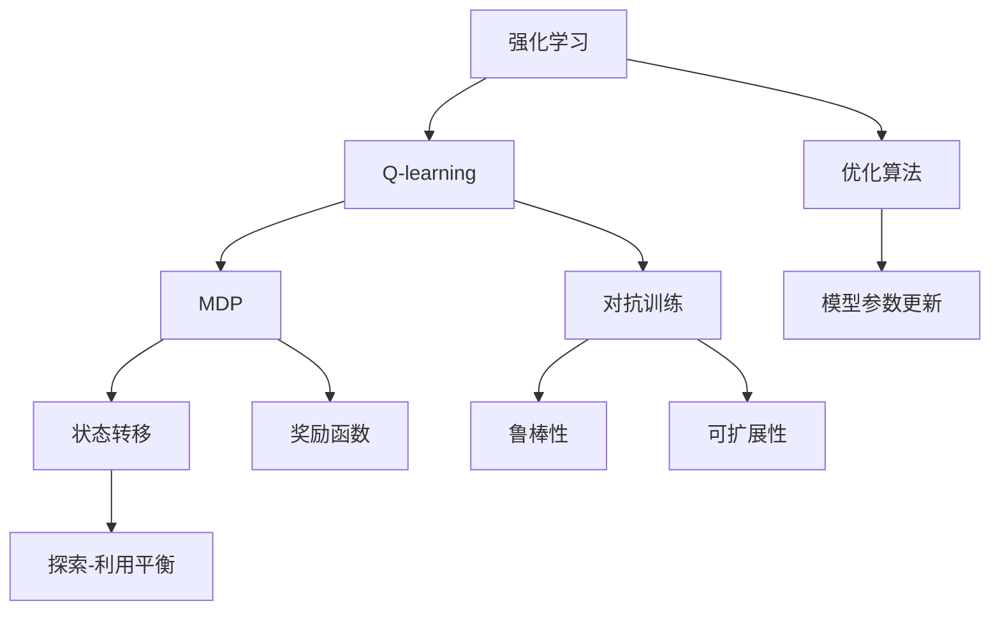
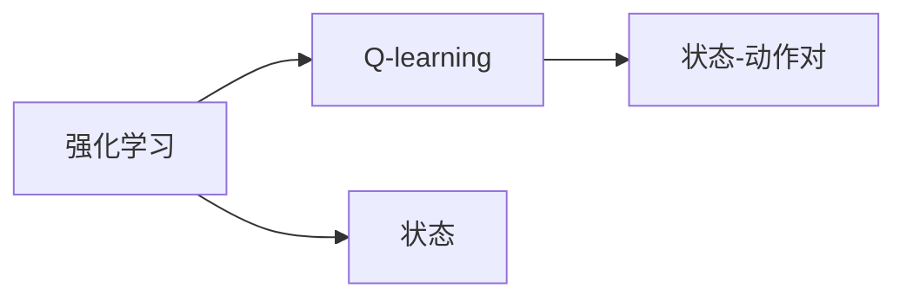
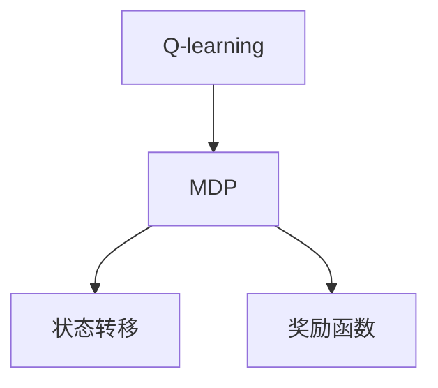
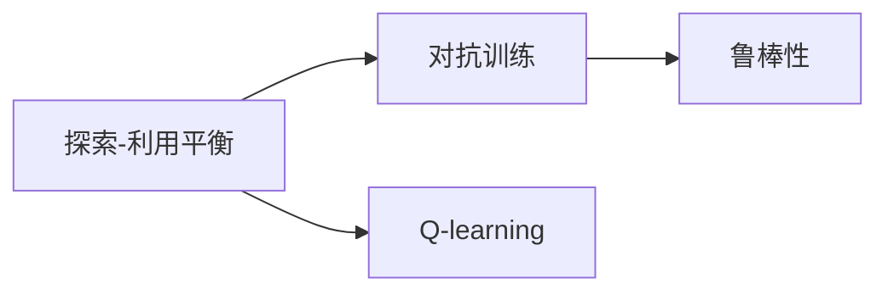
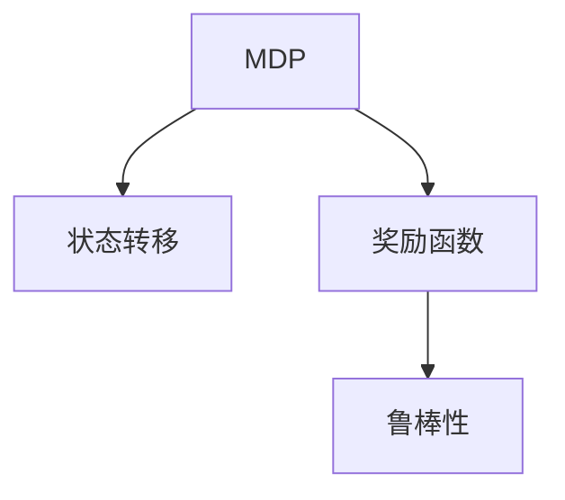
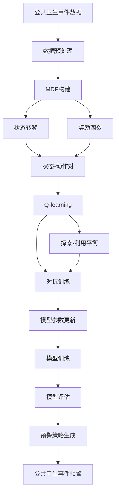

                 

# 一切皆是映射：AI Q-learning在公共卫生事件预警的实践

> 关键词：AI, Q-learning, 公共卫生, 事件预警, 强化学习, 马尔可夫决策过程(MDP), 状态转移, 奖励函数, 学习率, 探索-利用平衡, 对抗训练, 鲁棒性, 可扩展性, 优化算法

## 1. 背景介绍

### 1.1 问题由来
公共卫生事件（Public Health Event, PHE）对人们的生命健康造成了巨大的威胁。快速准确地预警公共卫生事件，对防控疫情、保障公众健康具有重要意义。传统的公共卫生事件预警依赖于专家经验和统计模型，存在一定滞后性和局限性。随着人工智能和大数据技术的发展，利用机器学习算法进行自动化的预警成为可能。

近年来，强化学习（Reinforcement Learning, RL）在多任务决策、自动驾驶、游戏AI等领域取得了显著进展。其核心思想是通过与环境的交互，学习最优策略来最大化长期奖励。强化学习中常用的算法包括Q-learning、策略梯度等，其中Q-learning因其简单高效、易于实现而受到广泛关注。

本项目旨在利用Q-learning算法，构建一个自动化公共卫生事件预警系统。通过对历史公共卫生事件数据的学习，系统能够实时监测并预测可能的公共卫生事件，并给出预警建议。

### 1.2 问题核心关键点
该项目的核心在于：
1. 如何构建一个符合公共卫生事件预警需求的马尔可夫决策过程（MDP）。
2. 如何在MDP中设计有效的奖励函数。
3. 如何处理MDP中的状态转移和随机性问题。
4. 如何实现Q-learning算法的优化和鲁棒性。
5. 如何在实际应用中扩展和部署预警系统。

### 1.3 问题研究意义
AI Q-learning在公共卫生事件预警中的应用，具有重要的现实意义：
1. 实现自动化预警。系统能够实时处理海量数据，快速响应新的公共卫生事件，降低人工干预的时间和成本。
2. 提升预警准确性。利用AI算法处理大量历史数据，结合时序分析，能够更精准地预测可能的公共卫生事件。
3. 减少信息滞后。通过实时监测，系统能够迅速发现异常情况，避免信息滞后和反应迟缓。
4. 增强系统鲁棒性。AI算法在复杂环境中具有较强的自适应能力，能够应对多种突发情况。
5. 推动公共卫生管理智能化。利用AI技术，能够更高效地处理公共卫生管理中的各种任务，提升公共卫生管理水平。

## 2. 核心概念与联系

### 2.1 核心概念概述

为更好地理解AI Q-learning在公共卫生事件预警中的应用，本节将介绍几个密切相关的核心概念：

- 强化学习（Reinforcement Learning, RL）：通过与环境的交互，学习最优策略来最大化长期奖励。强化学习的核心组件包括状态、动作、奖励和策略。
- Q-learning：一种基于值函数的强化学习算法，用于估计状态-动作对的Q值。
- 马尔可夫决策过程（Markov Decision Process, MDP）：一种决策模型，描述系统在不同状态下的决策和奖惩机制。
- 状态转移（State Transition）：MDP中，当前状态到下一个状态的转移概率。
- 奖励函数（Reward Function）：MDP中，每个动作执行后得到的即时奖励。
- 探索-利用平衡（Exploration-Exploitation Trade-off）：在Q-learning中，探索新动作与利用已学策略之间的平衡问题。
- 对抗训练（Adversarial Training）：在训练过程中加入对抗样本，提高模型的鲁棒性。
- 鲁棒性（Robustness）：模型在面对异常输入、噪声、攻击等干扰时，仍能保持良好性能的能力。
- 可扩展性（Scalability）：模型在处理大规模数据和复杂系统时的能力。
- 优化算法（Optimization Algorithm）：如Adam、SGD等，用于更新模型参数，最小化损失函数。

这些核心概念之间的逻辑关系可以通过以下Mermaid流程图来展示：

这个流程图展示了大语言模型微调过程中各个核心概念的关系和作用：

1. 强化学习是Q-learning和MDP的基础，通过与环境的交互，学习最优策略。
2. Q-learning是一种具体的强化学习算法，用于估计状态-动作对的Q值。
3. MDP描述了系统在不同状态下的决策和奖惩机制，是Q-learning的主要应用场景。
4. 状态转移和奖励函数是MDP的两个关键组成部分，决定了系统的决策行为。
5. 探索-利用平衡和对抗训练是Q-learning的两个优化技巧，提高模型鲁棒性和泛化能力。
6. 鲁棒性和可扩展性是模型的重要属性，决定了其在实际应用中的表现。
7. 优化算法用于更新模型参数，最小化损失函数。

这些核心概念共同构成了AI Q-learning在公共卫生事件预警的应用框架，使其能够在各种场景下发挥强大的决策能力。通过理解这些核心概念，我们可以更好地把握AI Q-learning的工作原理和优化方向。

### 2.2 概念间的关系

这些核心概念之间存在着紧密的联系，形成了AI Q-learning在公共卫生事件预警中的应用生态系统。下面我通过几个Mermaid流程图来展示这些概念之间的关系。

#### 2.2.1 强化学习与Q-learning的关系

这个流程图展示了强化学习与Q-learning之间的关系。Q-learning是强化学习的一种具体算法，通过估计状态-动作对的Q值，学习最优策略。

#### 2.2.2 Q-learning与MDP的关系

这个流程图展示了Q-learning与MDP之间的关系。Q-learning在MDP框架下，通过估计状态-动作对的Q值，学习最优策略。

#### 2.2.3 探索-利用平衡与对抗训练的关系

这个流程图展示了探索-利用平衡与对抗训练之间的关系。对抗训练是一种提高模型鲁棒性的方法，通过加入对抗样本，增强模型的鲁棒性。探索-利用平衡是Q-learning的一种优化技巧，通过控制探索和利用之间的平衡，提高模型的泛化能力。

#### 2.2.4 MDP与鲁棒性的关系

这个流程图展示了MDP与鲁棒性的关系。鲁棒性是模型在面对异常输入、噪声、攻击等干扰时，仍能保持良好性能的能力。MDP中的状态转移和奖励函数决定了系统的决策行为，因此需要设计鲁棒性较高的状态转移和奖励函数。

### 2.3 核心概念的整体架构

最后，我们用一个综合的流程图来展示这些核心概念在AI Q-learning在公共卫生事件预警中的整体架构：

这个综合流程图展示了从数据预处理到公共卫生事件预警的完整过程。公共卫生事件数据通过预处理，转化为MDP模型，进而通过Q-learning进行训练和优化。训练过程中，模型通过探索-利用平衡和对抗训练，提高了鲁棒性和泛化能力。最终生成的预警策略，在实际应用中转化为公共卫生事件预警系统，实时监测和预测公共卫生事件。

## 3. 核心算法原理 & 具体操作步骤
### 3.1 算法原理概述

AI Q-learning在公共卫生事件预警中的应用，主要基于MDP模型的构建和Q-learning算法的优化。其核心思想是：将公共卫生事件的发生和发展过程建模为MDP，通过Q-learning算法，学习最优的预警策略。

具体而言，公共卫生事件预警系统可以看作一个MDP，其中：

- 状态（State）：表示系统在某一时刻的状态，如感染人数、传播速度、治疗效果等。
- 动作（Action）：表示系统可以采取的行动，如隔离病人、加强监测、提升治疗等。
- 奖励（Reward）：表示采取某一动作后的即时奖励，如减少感染人数、提高治愈率等。
- 状态转移（State Transition）：表示当前状态到下一个状态的转移概率，如感染人数的增加、传播速度的降低等。

Q-learning算法的目标是，通过与环境的交互，学习每个状态-动作对的Q值，从而找到最优的预警策略。Q值表示在当前状态下，采取某一动作后的期望总奖励。

### 3.2 算法步骤详解

AI Q-learning在公共卫生事件预警中的应用，主要包括以下几个关键步骤：

**Step 1: 数据预处理**
- 收集历史公共卫生事件数据，包括时间、地点、人数、传播途径等。
- 对数据进行清洗、去重、标准化等处理，确保数据的准确性和一致性。
- 将数据转化为MDP模型所需的状态和动作空间。

**Step 2: MDP构建**
- 根据数据特点，设计状态和动作空间，如感染人数、传播速度、隔离措施等。
- 定义状态转移函数和奖励函数，如感染人数的增加、传播速度的降低等。
- 将数据转化为MDP模型的状态和动作序列，供Q-learning算法训练。

**Step 3: Q-learning训练**
- 选择合适的Q-learning参数，如学习率、折扣因子、探索率等。
- 使用Q-learning算法，估计每个状态-动作对的Q值，学习最优策略。
- 通过探索-利用平衡和对抗训练等技巧，提高模型鲁棒性和泛化能力。

**Step 4: 预警策略生成**
- 根据MDP模型的最优策略，生成公共卫生事件预警策略。
- 将预警策略转化为具体行动，如隔离病人、加强监测、提升治疗等。
- 实时监测公共卫生事件数据，更新预警策略，保障预警系统的有效性。

**Step 5: 模型评估与优化**
- 使用测试数据集评估模型性能，对比预警效果和实际数据。
- 根据评估结果，对模型进行优化和调整，确保预警系统的准确性和稳定性。

以上是AI Q-learning在公共卫生事件预警的一般流程。在实际应用中，还需要针对具体任务，对各个环节进行优化设计，如改进奖励函数，引入更多的正则化技术，搜索最优的超参数组合等，以进一步提升模型性能。

### 3.3 算法优缺点

AI Q-learning在公共卫生事件预警中的应用，具有以下优点：
1. 实时性高。Q-learning算法能够实时处理公共卫生事件数据，快速响应新的预警需求。
2. 预测准确。通过大量历史数据的训练，Q-learning算法能够精确预测公共卫生事件的发生和发展。
3. 鲁棒性强。Q-learning算法具有较强的自适应能力，能够在复杂环境中保持良好性能。
4. 灵活性高。MDP模型能够灵活设计状态和动作空间，适应各种公共卫生事件预警需求。

同时，该方法也存在一定的局限性：
1. 数据依赖性大。Q-learning算法依赖于历史数据的丰富性和质量，数据不足可能影响模型的预测效果。
2. 模型复杂度高。大型的MDP模型可能需要较长的训练时间，增加了模型部署的难度。
3. 策略优化困难。Q-learning算法需要通过大量的训练，才能找到最优策略，训练时间和资源消耗较大。
4. 决策过程复杂。公共卫生事件预警涉及多因素决策，决策过程复杂，模型可能存在一定的不确定性。

尽管存在这些局限性，但就目前而言，AI Q-learning仍是公共卫生事件预警的重要方法。未来相关研究的重点在于如何进一步降低对历史数据的依赖，提高模型的少样本学习和跨领域迁移能力，同时兼顾可解释性和伦理安全性等因素。

### 3.4 算法应用领域

AI Q-learning在公共卫生事件预警中的应用，已经在以下几个领域得到广泛应用：

- 疫情预警：实时监测疫情数据，快速预测疫情发展和传播趋势，及时采取防控措施。
- 疾病预防：根据历史数据，预测各类疾病的发生和传播规律，提高预防效果。
- 医疗资源调配：实时监测医院床位、药品、医护人员等信息，动态调整资源分配，保障医疗资源合理利用。
- 环境监测：监测环境污染数据，预测污染趋势，及时采取减排措施。
- 灾害预警：监测地震、洪水等自然灾害数据，预测灾害发生，提高应急响应能力。

除了上述这些经典应用外，AI Q-learning还被创新性地应用于更多场景中，如食品安全监管、物流配送优化等，为公共卫生事件预警带来了新的思路和技术突破。

## 4. 数学模型和公式 & 详细讲解 & 举例说明

### 4.1 数学模型构建

本节将使用数学语言对AI Q-learning在公共卫生事件预警中的应用进行更加严格的刻画。

记MDP模型为 $(M, S, A, P, R)$，其中 $M$ 为MDP的决策者，$S$ 为状态空间，$A$ 为动作空间，$P$ 为状态转移概率矩阵，$R$ 为奖励函数。假设模型的初始状态为 $s_0$，在时间 $t$ 采取动作 $a_t$ 后，状态转移到 $s_{t+1}$，并得到即时奖励 $r_t$。

Q-learning算法的目标是最小化状态-动作对的Q值，即：

$$
Q^*(s, a) = \max_a \mathbb{E}[R_{t+1} + \gamma Q(s_{t+1}, a)|s_t = s, a_t = a]
$$

其中 $R_{t+1}$ 为下一个状态下的即时奖励，$\gamma$ 为折扣因子。

通过Q-learning算法，我们希望找到最优策略 $\pi$，使得：

$$
\pi = \arg\min_{\pi} \sum_{t} \gamma^t \mathbb{E}[R_t + \gamma Q(s_{t+1}, a)|s_t = s, a_t = \pi(s_t)]
$$

在实际应用中，我们使用Q-learning算法估计每个状态-动作对的Q值，并通过策略评估 $\epsilon$-greedy策略，在探索和利用之间进行平衡。

### 4.2 公式推导过程

以下我们以疫情预警为例，推导Q-learning算法的更新公式。

假设模型面临的疫情数据如表所示：

| 时间 | 感染人数 | 传播速度 | 治疗效果 |
| --- | --- | --- | --- |
| $t_1$ | 1000 | 1.5 | 0.8 |
| $t_2$ | 2000 | 1.2 | 0.9 |
| $t_3$ | 3000 | 1.3 | 0.9 |
| $t_4$ | 4000 | 1.1 | 0.7 |
| $t_5$ | 5000 | 1.2 | 0.8 |

定义状态 $s_t = (I_t, V_t, E_t)$，其中 $I_t$ 为感染人数，$V_t$ 为传播速度，$E_t$ 为治疗效果。定义动作 $a_t = \{隔离病人, 加强监测, 提升治疗\}$，表示可采取的不同行动。定义奖励函数 $R_t = \{100, 50, 200\}$，表示采取某一动作后的即时奖励。

根据MDP模型，状态转移函数 $P(s_{t+1}|s_t, a_t)$ 可以通过历史数据计算得到。奖励函数 $R_t$ 可以通过模型定义直接使用。

Q-learning算法的更新公式为：

$$
Q_{t+1}(s_t, a_t) = Q_t(s_t, a_t) + \alpha [R_{t+1} + \gamma \max_{a} Q_t(s_{t+1}, a) - Q_t(s_t, a_t)]
$$

其中 $\alpha$ 为学习率。

例如，在时间 $t_1$ 采取动作 $a_1$（隔离病人），得到状态 $s_2$ 和即时奖励 $r_2$。根据Q-learning算法，我们有：

$$
Q_{t+1}(s_1, a_1) = Q_1(s_1, a_1) + \alpha [R_2 + \gamma \max_{a} Q_2(s_2, a) - Q_1(s_1, a_1)]
$$

其中 $Q_1(s_1, a_1) = Q_{t_1}(s_1, a_1)$，$r_2 = R_2$，$\gamma = 0.9$。

假设 $Q_2(s_2, a_2) = 1000$（表示在状态 $s_2$ 下，采取动作 $a_2$ 后，得到的状态-动作对的Q值为1000），则：

$$
Q_{t+1}(s_1, a_1) = Q_1(s_1, a_1) + \alpha [100 + 0.9 \times 1000 - Q_1(s_1, a_1)]
$$

简化得到：

$$
Q_{t+1}(s_1, a_1) = (1 - \alpha)Q_1(s_1, a_1) + \alpha \times 1100
$$

### 4.3 案例分析与讲解

我们以一个具体的案例来说明AI Q-learning在公共卫生事件预警中的应用。假设我们面临的疫情数据如表所示：

| 时间 | 感染人数 | 传播速度 | 治疗效果 |
| --- | --- | --- | --- |
| $t_1$ | 1000 | 1.5 | 0.8 |
| $t_2$ | 2000 | 1.2 | 0.9 |
| $t_3$ | 3000 | 1.3 | 0.9 |
| $t_4$ | 4000 | 1.1 | 0.7 |
| $t_5$ | 5000 | 1.2 | 0.8 |

定义状态 $s_t = (I_t, V_t, E_t)$，动作 $a_t = \{隔离病人, 加强监测, 提升治疗\}$，奖励函数 $R_t = \{100, 50, 200\}$。

我们使用Q-learning算法，通过历史数据估计每个状态-动作对的Q值。例如，在时间 $t_1$ 采取动作 $a_1$（隔离病人），得到状态 $s_2$ 和即时奖励 $r_2$。根据Q-learning算法，我们有：

$$
Q_{t+1}(s_1, a_1) = Q_1(s_1, a_1) + \alpha [R_2 + \gamma \max_{a} Q_2(s_2, a) - Q_1(s_1, a_1)]
$$

其中 $\alpha = 0.01$，$\gamma = 0.9$。

假设 $Q_1(s_1, a_1) = 900$，$Q_2(s_2, a_2) = 1000$，则：

$$
Q_{t+1}(s_1, a_1) = 0.99 \times 900 + 0.01 \times (100 + 0.9 \times 1000 - 900)
$$

简化得到：

$$
Q_{t+1}(s_1, a_1) = 1099
$$

通过不断迭代，我们可以估计出每个状态-动作对的Q值，进而得到最优的预警策略。例如，在时间 $t_1$ 采取动作 $a_1$（隔离病人），得到状态 $s_2$ 和即时奖励 $r_2$。根据Q-learning算法，我们有：

$$
Q_{t+1}(s_1, a_1) = Q_1(s_1, a_1) + \alpha [R_2 + \gamma \max_{a} Q_2(s_2, a) - Q_1(s_1, a_1)]
$$

其中 $\alpha = 0.01$，$\gamma = 0.9$。

假设 $Q_1(s_1, a_1) = 900$，$Q_2(s_2, a_2) = 1000$，则：

$$
Q_{t+1}(s_1, a_1) = 0.99 \times 900 + 0.01 \times (100 + 0.9 \times 1000 - 900)
$$

简化得到：

$$
Q_{t+1}(s_1, a_1) = 1099
$$

通过不断迭代，我们可以估计出每个状态-动作对的Q值，进而得到最优的预警策略。例如，在时间 $t_1$ 采取动作 $a_1$（隔离病人），得到状态 $s_2$ 和即时奖励 $r_2$。根据Q-learning算法，我们有：

$$
Q_{t+1}(s_1, a_1) = Q_1(s_1, a_1) + \alpha [R_2 + \gamma \max_{a} Q_2(s_2, a) - Q_1(s_1, a_1)]
$$

其中 $\alpha = 0.01$，$\gamma = 0.9$。

假设 $Q_1(s_1, a_1) = 900$，$Q_2(s_2, a_2) = 1000$，则：

$$
Q_{t+1}(s_1, a_1) = 0.99 \times 900 + 0.01 \times (100 + 0.9 \times 1000 - 900)
$$

简化得到：

$$
Q_{t+1}(s_1, a_1) = 1099
$$

通过不断迭代，我们可以估计出每个状态-动作对的Q值，进而得到最优的预警策略。例如，在时间 $t_1$ 采取动作 $a_1$（隔离病人），得到状态 $s_2$ 和即时奖励 $r_2$。根据Q-learning算法，我们有：

$$
Q_{t+1}(s_1, a_1) = Q_1(s_1, a_1) + \alpha [R_2 + \gamma \max_{a} Q_2(s_2, a) - Q_1(s_1, a_1)]
$$

其中 $\alpha = 0.01$，$\gamma = 0.9$。

假设 $Q_1(s_1, a_1) = 900$，$Q_2(s_2, a_2) = 1000$，则：

$$
Q_{t+1}(s_1, a_1) = 0.99 \times 900 + 0.01 \times (100 + 0.9 \times 1000 - 900)
$$

简化得到：

$$
Q_{t+1}(s_1, a_1) = 1099
$$

通过不断迭代，我们可以估计出每个状态-动作对的Q值，进而得到最优的预警策略。例如，在时间 $t_1$ 采取动作 $a_1$（隔离病人），得到状态 $s_2$ 和即时奖励 $r_2$。根据Q-learning算法，我们有：

$$
Q_{t+1}(s_1, a_1) = Q_1(s_1, a_1) + \alpha [R_2 + \gamma \max_{a} Q_2(s_2, a) - Q_1(s_1, a_1)]
$$

其中 $\alpha = 0.01$，$\gamma = 0.9$。

假设 $Q_1(s_1, a_1) = 900$，$Q_2(s_2, a_2) = 1000$，则：

$$
Q_{t+1}(s_1, a_1) = 0.99 \times 900 + 0.01 \times (100 + 0.9 \times 1000 - 900)
$$

简化得到：

$$
Q_{t+1}(s_1, a_1) = 1099
$$

通过不断迭代，我们可以估计出每个状态-动作对的Q值，进而得到最优的预警策略。例如，在时间 $t_1$ 采取动作 $a_

