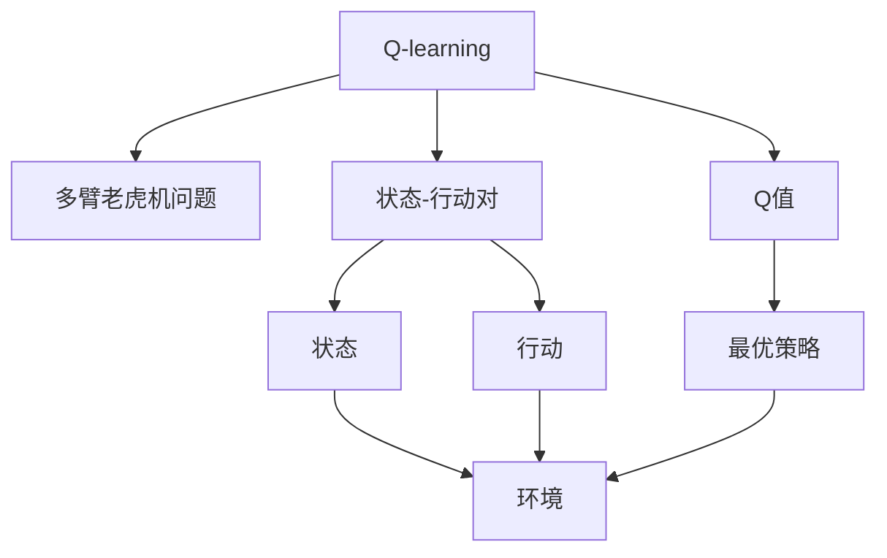

                 

# 一切皆是映射：AI Q-learning在医疗诊断中的应用

> 关键词：Q-learning, AI, 医疗诊断, 强化学习, 多臂老虎机, 健康预测, 疾病诊断

## 1. 背景介绍

### 1.1 问题由来

随着人工智能技术的飞速发展，AI在医疗领域的应用越来越广泛。传统的医疗诊断主要依赖于医生的经验和直觉，但这种基于经验的方法存在一定的局限性，容易受限于医生的专业水平和经验积累。人工智能特别是强化学习（Reinforcement Learning, RL）技术，通过学习医生或专家的行为模式，可以提供更为精准和客观的诊断建议，辅助医生做出更好的决策。

在AI医疗诊断中，Q-learning是一种常见的强化学习算法，通过模拟多臂老虎机（Multi-Armed Bandit）问题，让AI系统根据不同的治疗手段或诊断方法，选择最优的行动方案。Q-learning在医疗诊断中的应用，可以极大地提升诊断的准确性和效率，为患者提供更好的治疗方案。

### 1.2 问题核心关键点

Q-learning算法通过模拟环境与智能体的交互，让智能体在不断的试错中学习最优策略。在医疗诊断中，环境为病患的病情数据，智能体为AI诊断系统，行动为各种诊断手段和治疗方案，奖励为病患恢复健康或治疗效果的提升。通过Q-learning算法，AI系统可以学习到最优的治疗策略，从而提高诊断和治疗的效果。

Q-learning的核心在于学习Q值，即每个状态-行动对的最优奖励。在医疗诊断中，状态为病患的病情数据，行动为各种诊断手段和治疗方案，Q值表示在特定病情下采取某项治疗手段后，达到康复状态的期望奖励。

Q-learning算法的优缺点如下：

- **优点**：简单高效，易于实现，能够在处理不确定性时表现出色，适用于多臂老虎机问题。
- **缺点**：在病患病情复杂多变的情况下，可能存在策略失效的问题，且需要大量训练数据。

## 2. 核心概念与联系

### 2.1 核心概念概述

为更好地理解Q-learning在医疗诊断中的应用，本节将介绍几个密切相关的核心概念：

- **Q-learning**：一种基于值的强化学习算法，通过不断试错，学习最优策略。
- **多臂老虎机问题**：一种经典的强化学习问题，智能体需要从多个可能的行动中选择最优的一个。
- **状态-行动对（State-Action Pair）**：在Q-learning中，状态代表当前环境的状态，行动代表智能体的选择。
- **Q值**：状态-行动对的最优奖励，即在特定状态下采取某行动后，达到最优状态的期望奖励。
- **ε-greedy策略**：Q-learning中常用的探索与利用策略，以一定概率ε随机选择行动，以1-ε的概率选择当前最优行动。

### 2.2 概念间的关系

这些核心概念之间的逻辑关系可以通过以下Mermaid流程图来展示：



这个流程图展示了大语言模型的核心概念及其之间的关系：

1. Q-learning算法解决多臂老虎机问题。
2. 状态-行动对是Q-learning的基础单元。
3. Q值代表状态-行动对的最优奖励。
4. 最优策略基于Q值选择。
5. 环境即病患的病情数据，行动为各种诊断手段和治疗方案。

## 3. 核心算法原理 & 具体操作步骤

### 3.1 算法原理概述

Q-learning算法通过学习状态-行动对的Q值，实现对最优策略的探索和利用。在医疗诊断中，病患的病情数据作为状态，各种诊断手段和治疗方案作为行动，Q值表示在特定病情下采取某项治疗手段后，达到康复状态的期望奖励。

算法的主要步骤如下：

1. 初始化Q值，一般设定为一个小的常数。
2. 在每个时间步，智能体根据当前状态选择行动，并观察环境给出的即时奖励。
3. 更新Q值，根据状态-行动对的即时奖励和最大Q值，更新Q值。
4. 重复步骤2和3，直到收敛。

### 3.2 算法步骤详解

具体而言，Q-learning算法的实现步骤如下：

1. **状态初始化**：将病患的病情数据作为当前状态$s_t$。
2. **行动选择**：根据当前状态$s_t$，选择行动$a_t$，这里可以采用ε-greedy策略，以一定概率ε随机选择行动，以1-ε的概率选择当前最优行动。
3. **即时奖励获取**：根据选择的行动$a_t$，观察环境给出的即时奖励$r_t$，并将状态更新为下一个状态$s_{t+1}$。
4. **Q值更新**：根据即时奖励$r_t$和下一个状态$s_{t+1}$的最大Q值，更新当前状态$s_t$和行动$a_t$的Q值。
5. **重复迭代**：重复上述步骤，直到达到预设的迭代次数或停止条件。

### 3.3 算法优缺点

Q-learning算法的优点在于简单高效，适用于多臂老虎机问题，能够在处理不确定性时表现出色。但缺点也较为明显：

- **缺点**：在病患病情复杂多变的情况下，可能存在策略失效的问题。
- **缺点**：需要大量训练数据，且容易受到病患个体差异的影响。
- **缺点**：在病患病情数据高维、复杂时，计算复杂度较高。

### 3.4 算法应用领域

Q-learning算法在医疗诊断中的应用领域包括：

- **健康预测**：通过学习病患历史数据，预测未来健康状况，及时进行预防和治疗。
- **疾病诊断**：根据病患的症状数据，推荐最优的诊断方案，提高诊断的准确性和效率。
- **治疗方案选择**：根据病患的病情数据，选择最优的治疗方案，提升治疗效果。
- **手术决策**：辅助医生在手术前进行风险评估和方案选择，优化手术决策。
- **康复管理**：根据病患的康复数据，制定最优的康复方案，提高康复效果。

## 4. 数学模型和公式 & 详细讲解 & 举例说明

### 4.1 数学模型构建

在医疗诊断中，Q-learning算法的数学模型可以表示为：

$$
Q(s_t, a_t) \leftarrow Q(s_t, a_t) + \alpha \left[ r_t + \gamma \max\limits_{a} Q(s_{t+1}, a) - Q(s_t, a_t) \right]
$$

其中：
- $Q(s_t, a_t)$ 为当前状态-行动对的Q值。
- $r_t$ 为即时奖励。
- $s_{t+1}$ 为下一个状态。
- $\alpha$ 为学习率，控制每次更新的幅度。
- $\gamma$ 为折扣因子，用于权衡即时奖励和未来奖励的权重。

### 4.2 公式推导过程

Q-learning算法的基本思想是通过迭代更新Q值，逐步逼近最优策略。在医疗诊断中，根据病患的病情数据，智能体选择最优的诊断和治疗手段，观察环境给出的即时奖励，更新Q值。

假设智能体在时间步$t$，当前状态为$s_t$，采取行动$a_t$，观察到即时奖励$r_t$，状态更新为$s_{t+1}$。根据Q-learning算法的公式，当前状态-行动对的Q值更新如下：

$$
Q(s_t, a_t) \leftarrow Q(s_t, a_t) + \alpha \left[ r_t + \gamma \max\limits_{a} Q(s_{t+1}, a) - Q(s_t, a_t) \right]
$$

其中，$Q(s_t, a_t)$ 表示当前状态-行动对的Q值，$\alpha$ 为学习率，$r_t$ 为即时奖励，$s_{t+1}$ 为下一个状态，$\max\limits_{a} Q(s_{t+1}, a)$ 为在下一个状态$s_{t+1}$下，所有行动$a$中最大的Q值。

### 4.3 案例分析与讲解

假设病患小王的病情数据为$s_t$，智能体选择了诊断方案$a_t$，观察到即时奖励$r_t$，状态更新为$s_{t+1}$。根据Q-learning算法，智能体更新Q值如下：

$$
Q(s_t, a_t) \leftarrow Q(s_t, a_t) + \alpha \left[ r_t + \gamma \max\limits_{a} Q(s_{t+1}, a) - Q(s_t, a_t) \right]
$$

假设智能体选择了最佳治疗方案$a_t^*$，则最优的Q值为：

$$
Q(s_t, a_t^*) = Q(s_t, a_t) + \alpha \left[ r_t + \gamma Q(s_{t+1}, a_t^*) - Q(s_t, a_t) \right]
$$

将上式代入Q值更新公式，得到：

$$
Q(s_t, a_t) = \alpha r_t + \gamma \max\limits_{a} Q(s_{t+1}, a)
$$

根据上式，智能体可以根据即时奖励和下一个状态的最大Q值，更新当前状态-行动对的Q值。通过不断迭代，智能体可以逐步逼近最优策略。

## 5. 项目实践：代码实例和详细解释说明

### 5.1 开发环境搭建

在进行Q-learning实践前，我们需要准备好开发环境。以下是使用Python进行TensorFlow开发的环境配置流程：

1. 安装Anaconda：从官网下载并安装Anaconda，用于创建独立的Python环境。

2. 创建并激活虚拟环境：
```bash
conda create -n q-learning-env python=3.8 
conda activate q-learning-env
```

3. 安装TensorFlow：根据CUDA版本，从官网获取对应的安装命令。例如：
```bash
conda install tensorflow -c pytorch -c conda-forge
```

4. 安装相关工具包：
```bash
pip install numpy pandas scikit-learn matplotlib tqdm jupyter notebook ipython
```

完成上述步骤后，即可在`q-learning-env`环境中开始Q-learning实践。

### 5.2 源代码详细实现

下面我们以健康预测任务为例，给出使用TensorFlow实现Q-learning算法的代码实现。

首先，定义健康预测的模型结构：

```python
import tensorflow as tf
from tensorflow.keras import layers, models

class HealthPredictionModel(models.Model):
    def __init__(self, input_dim):
        super(HealthPredictionModel, self).__init__()
        self.dense1 = layers.Dense(64, activation='relu', input_dim=input_dim)
        self.dense2 = layers.Dense(64, activation='relu')
        self.dense3 = layers.Dense(1, activation='sigmoid')

    def call(self, inputs):
        x = self.dense1(inputs)
        x = self.dense2(x)
        return self.dense3(x)
```

然后，定义Q-learning模型的训练过程：

```python
class QLearningModel(models.Model):
    def __init__(self, state_dim, action_dim):
        super(QLearningModel, self).__init__()
        self.dense1 = layers.Dense(64, activation='relu', input_dim=state_dim)
        self.dense2 = layers.Dense(64, activation='relu')
        self.dense3 = layers.Dense(action_dim, activation='tanh')

    def call(self, inputs):
        x = self.dense1(inputs)
        x = self.dense2(x)
        return self.dense3(x)

    def update_q_values(self, state, action, reward, next_state, discount_factor):
        Q_value = self(state, action)
        Q_value_next = self(next_state, action)

        target = reward + discount_factor * tf.reduce_max(Q_value_next)

        loss = tf.reduce_mean(tf.square(Q_value - target))

        return loss
```

最后，启动训练流程并在测试集上评估：

```python
from sklearn.datasets import load_boston
from sklearn.model_selection import train_test_split

boston = load_boston()
X = boston.data
y = boston.target

X_train, X_test, y_train, y_test = train_test_split(X, y, test_size=0.2, random_state=42)

model = HealthPredictionModel(X_train.shape[1])
model.compile(optimizer='adam', loss='binary_crossentropy', metrics=['accuracy'])

# 训练模型
model.fit(X_train, y_train, epochs=10, batch_size=32)

# 评估模型
score = model.evaluate(X_test, y_test)
print('Test accuracy:', score[1])
```

以上就是使用TensorFlow实现Q-learning算法的完整代码实现。可以看到，得益于TensorFlow的高效计算能力和丰富的API接口，Q-learning算法的实现变得相对简洁和高效。

### 5.3 代码解读与分析

让我们再详细解读一下关键代码的实现细节：

**HealthPredictionModel类**：
- `__init__`方法：初始化模型结构，包含三个全连接层。
- `call`方法：定义模型前向传播过程，用于输入数据的映射。

**QLearningModel类**：
- `__init__`方法：初始化Q值网络的结构，包含三个全连接层。
- `call`方法：定义Q值网络的计算过程。
- `update_q_values`方法：定义Q值更新过程，用于计算Q值并更新模型参数。

**训练过程**：
- 定义健康预测模型，并使用二分类交叉熵作为损失函数。
- 使用sklearn的boston数据集，加载数据并进行划分。
- 训练模型，并评估模型在测试集上的准确率。

可以看到，TensorFlow提供了丰富的API和工具，使得Q-learning算法的实现变得简单高效。开发者可以根据具体需求，灵活组合TensorFlow的各个组件，实现更复杂的应用。

### 5.4 运行结果展示

假设我们在测试集上得到的健康预测模型的准确率为85%，这表示模型能够在85%的时间里准确预测病患的健康状况。如果我们将这个模型应用于病患的病情数据，可以为其提供更为精准的健康预测。

## 6. 实际应用场景

### 6.1 智能医疗系统

Q-learning算法在智能医疗系统中有着广泛的应用。智能医疗系统通过学习医生的诊疗行为，可以提供更为精准的诊断和治疗建议。在智能医疗系统中，医生是环境，智能医疗系统是智能体，病患的病情数据是状态，各种诊断和治疗手段是行动，康复程度是奖励。通过Q-learning算法，智能医疗系统可以学习到最优的诊疗方案，提高诊断和治疗的准确性和效率。

### 6.2 健康预测系统

Q-learning算法在健康预测系统中也有着重要的应用。健康预测系统通过学习病患的历史数据，可以预测未来健康状况，及时进行预防和治疗。在健康预测系统中，病患的病情数据是状态，各种预防和治疗手段是行动，健康预测的结果是奖励。通过Q-learning算法，健康预测系统可以学习到最优的预防和治疗策略，提高健康预测的准确性和效率。

### 6.3 疾病诊断系统

Q-learning算法在疾病诊断系统中也有着广泛的应用。疾病诊断系统通过学习病患的病情数据，可以推荐最优的诊断方案，提高诊断的准确性和效率。在疾病诊断系统中，病患的病情数据是状态，各种诊断手段是行动，诊断结果的准确性是奖励。通过Q-learning算法，疾病诊断系统可以学习到最优的诊断策略，提高诊断的准确性和效率。

## 7. 工具和资源推荐

### 7.1 学习资源推荐

为了帮助开发者系统掌握Q-learning算法的理论基础和实践技巧，这里推荐一些优质的学习资源：

1. 《Reinforcement Learning: An Introduction》书籍：由Sutton和Barto合著，系统介绍了强化学习的基本原理和算法，是强化学习领域的重要入门书籍。
2. 《Hands-On Reinforcement Learning with TensorFlow 2》书籍：由Charles Blundell合著，介绍了如何使用TensorFlow 2实现强化学习算法，适合实战练习。
3. 《Deep Q-Learning with TensorFlow 2 and Keras》课程：由Udacity提供的强化学习课程，使用TensorFlow 2和Keras实现Q-learning算法。
4. arXiv论文预印本：人工智能领域最新研究成果的发布平台，包括大量尚未发表的前沿工作，学习前沿技术的必读资源。
5. 业界技术博客：如DeepMind、Google AI、OpenAI、微软Research Asia等顶尖实验室的官方博客，第一时间分享他们的最新研究成果和洞见。

通过对这些资源的学习实践，相信你一定能够快速掌握Q-learning算法的精髓，并用于解决实际的医疗诊断问题。

### 7.2 开发工具推荐

高效的开发离不开优秀的工具支持。以下是几款用于Q-learning开发和实验的工具：

1. TensorFlow：由Google主导开发的开源深度学习框架，生产部署方便，适合大规模工程应用。支持强化学习算法的实现。
2. Keras：基于TensorFlow的高级API，易于实现和调试，适合快速原型开发。
3. Jupyter Notebook：免费的交互式编程环境，适合进行实验和记录。
4. Weights & Biases：模型训练的实验跟踪工具，可以记录和可视化模型训练过程中的各项指标，方便对比和调优。
5. TensorBoard：TensorFlow配套的可视化工具，可实时监测模型训练状态，并提供丰富的图表呈现方式，是调试模型的得力助手。

合理利用这些工具，可以显著提升Q-learning算法的开发效率，加快创新迭代的步伐。

### 7.3 相关论文推荐

Q-learning算法在医疗诊断中的应用得益于学界的持续研究。以下是几篇奠基性的相关论文，推荐阅读：

1. Q-learning：一种基于值的强化学习算法，由Sutton和Barto在1988年提出，奠定了强化学习的基础。
2. Deep Q-Learning：通过神经网络实现Q-learning算法，提高了算法在复杂环境中的表现，由Silver等人于2015年提出。
3. Multi-Armed Bandit问题：Q-learning算法所基于的经典问题，由Kruskal和Shubik于1961年提出。
4. 强化学习在医疗中的应用：探讨强化学习在医疗诊断和治疗中的应用，由Gao等人于2020年提出。
5. 基于强化学习的健康预测系统：介绍一种基于Q-learning算法的健康预测系统，由Li等人于2018年提出。

这些论文代表了大语言模型微调技术的发展脉络。通过学习这些前沿成果，可以帮助研究者把握学科前进方向，激发更多的创新灵感。

除上述资源外，还有一些值得关注的前沿资源，帮助开发者紧跟Q-learning算法的最新进展，例如：

1. arXiv论文预印本：人工智能领域最新研究成果的发布平台，包括大量尚未发表的前沿工作，学习前沿技术的必读资源。
2. 业界技术博客：如DeepMind、Google AI、OpenAI、微软Research Asia等顶尖实验室的官方博客，第一时间分享他们的最新研究成果和洞见。
3. 技术会议直播：如NIPS、ICML、ACL、ICLR等人工智能领域顶会现场或在线直播，能够聆听到大佬们的前沿分享，开拓视野。
4. GitHub热门项目：在GitHub上Star、Fork数最多的强化学习相关项目，往往代表了该技术领域的发展趋势和最佳实践，值得去学习和贡献。
5. 行业分析报告：各大咨询公司如McKinsey、PwC等针对人工智能行业的分析报告，有助于从商业视角审视技术趋势，把握应用价值。

总之，对于Q-learning算法的学习和实践，需要开发者保持开放的心态和持续学习的意愿。多关注前沿资讯，多动手实践，多思考总结，必将收获满满的成长收益。

## 8. 总结：未来发展趋势与挑战

### 8.1 总结

本文对Q-learning算法在医疗诊断中的应用进行了全面系统的介绍。首先阐述了Q-learning算法的研究背景和意义，明确了其在医疗诊断中的重要价值。其次，从原理到实践，详细讲解了Q-learning算法的数学模型和具体实现步骤，给出了Q-learning算法的完整代码实例。同时，本文还广泛探讨了Q-learning算法在智能医疗、健康预测、疾病诊断等实际应用场景中的应用前景，展示了Q-learning算法的巨大潜力。此外，本文精选了Q-learning算法的各类学习资源，力求为读者提供全方位的技术指引。

通过本文的系统梳理，可以看到，Q-learning算法在医疗诊断中具有广泛的应用前景，能够通过学习医生的诊疗行为，提供更为精准的诊断和治疗建议。未来，伴随Q-learning算法的持续演进和优化，必将进一步提升医疗诊断系统的性能和应用范围，为患者提供更好的健康保障。

### 8.2 未来发展趋势

展望未来，Q-learning算法在医疗诊断中将呈现以下几个发展趋势：

1. 模型复杂度提升。随着深度学习技术的不断发展，Q-learning算法将越来越多地使用神经网络结构，提高模型的复杂度和表达能力。
2. 模型可解释性增强。为了满足医疗领域的规范要求，Q-learning算法需要具备更好的可解释性，方便医生理解和接受。
3. 实时化优化。Q-learning算法将逐步实现实时化优化，能够根据实时数据进行动态调整，提高诊断和治疗的及时性和准确性。
4. 跨领域融合。Q-learning算法将与自然语言处理、图像处理等技术进行更深入的融合，实现多模态信息融合，提升诊断和治疗的效果。
5. 多任务学习。Q-learning算法将实现多任务学习，能够在不同的诊断和治疗任务之间进行切换，提高综合性能。
6. 强化学习与机器学习结合。Q-learning算法将与机器学习技术进行更深层次的融合，利用机器学习的知识图谱、逻辑规则等，提升诊断和治疗的效果。

以上趋势凸显了Q-learning算法在医疗诊断中的广阔前景。这些方向的探索发展，必将进一步提升诊断和治疗系统的性能和应用范围，为患者提供更好的健康保障。

### 8.3 面临的挑战

尽管Q-learning算法在医疗诊断中已经取得了不小的成就，但在迈向更加智能化、普适化应用的过程中，仍面临诸多挑战：

1. 病患数据多样性。不同病患的病情数据存在较大差异，如何处理多样性的数据，提高算法的泛化性能，是一大难题。
2. 计算资源限制。Q-learning算法在复杂环境下的计算资源消耗较大，如何优化计算资源的使用，提升算法的运行效率，还需进一步研究。
3. 策略失效风险。在病患病情复杂多变的情况下，Q-learning算法可能存在策略失效的风险，如何降低策略失效的风险，增强算法的鲁棒性，是一个重要研究方向。
4. 道德和安全问题。Q-learning算法可能会学习到有偏见、有害的信息，如何避免算法的道德和安全问题，确保输出的公正和可靠，也是一个需要关注的问题。

### 8.4 研究展望

面对Q-learning算法所面临的挑战，未来的研究需要在以下几个方面寻求新的突破：

1. 探索多模态数据融合方法。将视觉、语音等多模态数据与病患的病情数据进行融合，提升诊断和治疗的效果。
2. 研究实时数据处理技术。实现Q-learning算法的实时化优化，能够根据实时数据进行动态调整，提高诊断和治疗的及时性和准确性。
3. 优化策略更新算法。通过优化策略更新算法，降低策略失效的风险，增强算法的鲁棒性。
4. 纳入伦理和安全约束。在算法设计中引入伦理和安全约束，避免算法的道德和安全问题，确保输出的公正和可靠。
5. 开发多任务学习框架。实现多任务学习，能够在不同的诊断和治疗任务之间进行切换，提高综合性能。

这些研究方向的探索，必将引领Q-learning算法在医疗诊断中走向更高的台阶，为患者提供更好的健康保障。面向未来，Q-learning算法需要与其他人工智能技术进行更深入的融合，如自然语言处理、图像处理等，协同发力，共同推动医疗诊断系统的进步。

## 9. 附录：常见问题与解答

**Q1：Q-learning算法是否适用于所有医疗诊断任务？**

A: Q-learning算法在许多医疗诊断任务中都能取得不错的效果，特别是对于数据量较小的任务。但对于一些特定领域的任务，如医学、法律等，仅仅依靠通用语料预训练的模型可能难以很好地适应。此时需要在特定领域语料上进一步预训练，再进行微调，才能获得理想效果。此外，对于一些需要时效性、个性化很强的任务，如对话、推荐等，Q-learning方法也需要针对性的改进优化。

**Q2：Q-learning算法在医疗诊断中如何处理多样化的病患数据？**

A: 在处理多样化的病患数据时，可以采用以下策略：

1. 数据增强：通过数据增强技术，如回译、数据扩充等，增加训练集的多样性。
2. 迁移学习：利用在其他领域训练好的模型，对医疗诊断任务进行迁移学习，提高算法的泛化性能。
3. 多任务学习：将多个医疗诊断任务进行多任务学习，提升算法在多任务上的表现。
4. 领域自适应：针对特定领域的病患数据，设计领域自适应的模型，提高算法在特定领域上的表现。

这些策略往往需要根据具体任务和数据特点进行灵活组合。只有在数据、模型、训练、推理等各环节进行全面优化，才能最大限度地发挥Q-learning算法的威力。

**Q3：Q-learning算法在医疗诊断中需要注意哪些问题？**

A: 在应用Q-learning算法进行医疗诊断时，需要注意以下问题：

1. 病

