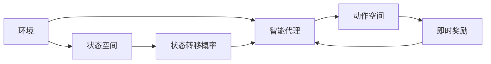
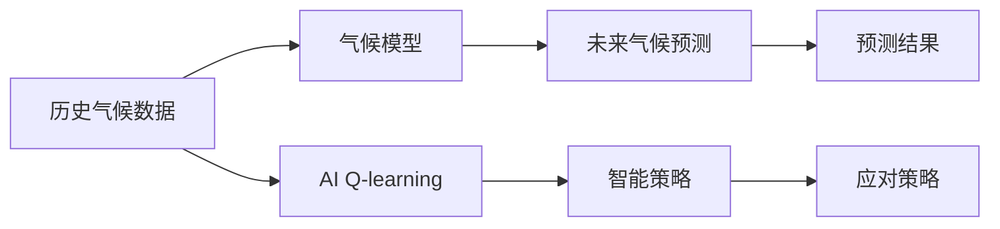
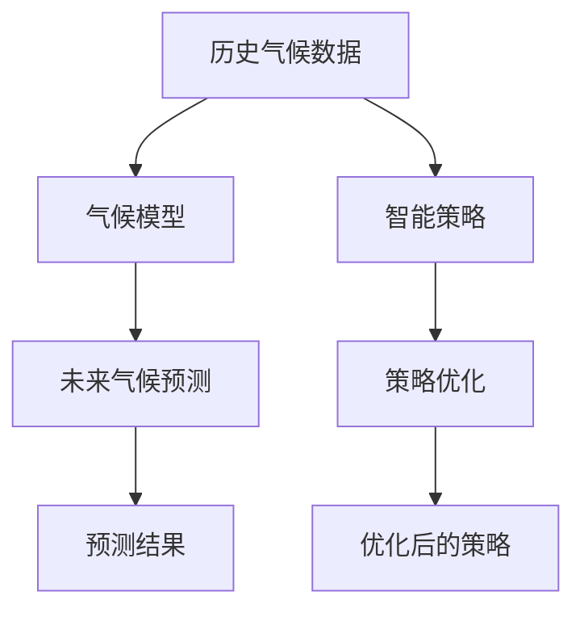
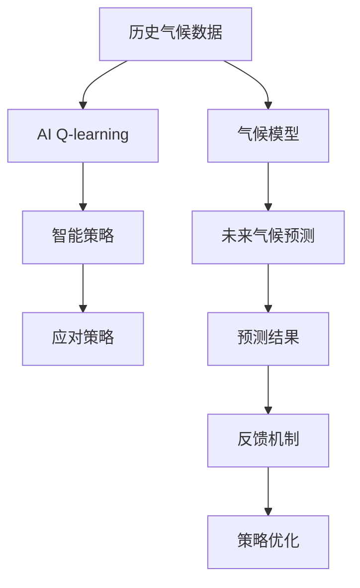

                 

# 一切皆是映射：AI Q-learning在气候预测的应用

> 关键词：Q-learning, 强化学习, 气候预测, 马尔科夫决策过程, 策略优化, 天气预报, 应对策略

## 1. 背景介绍

### 1.1 问题由来

气候变化已经成为全球关注的重大问题。由于全球气候系统是一个非线性、复杂的动态系统，具有高度的不确定性，传统基于统计的气候预测模型难以捕捉复杂的系统行为。而人工智能技术，特别是强化学习(Reinforcement Learning, RL)方法，近年来在许多领域展示了其强大的能力。

本文章将探讨一种结合强化学习与人工智能技术的创新方法，利用AI Q-learning技术优化气候预测策略。AI Q-learning结合了强化学习与模型预测，旨在通过智能策略优化来提升气候预测的准确性，并为政策制定提供科学依据。

### 1.2 问题核心关键点

AI Q-learning在气候预测中的应用，主要围绕以下几个关键点：

- 强化学习：通过智能代理与环境交互，学习最优策略以最大化长期奖励。
- 气候模型：构建高精度气候模型，预测未来气候变化。
- 数据驱动：依赖历史气候数据训练模型，识别未来气候变化规律。
- 策略优化：根据气候预测结果，优化应对策略，以应对未来气候变化。

本研究将结合这些关键点，构建一个能够通过学习自动优化策略的气候预测系统。

### 1.3 问题研究意义

AI Q-learning在气候预测中的应用具有重要意义：

1. **提升预测精度**：通过学习优化策略，AI Q-learning能够更准确地预测未来气候变化，为政策制定提供科学依据。
2. **增强适应能力**：通过智能策略优化，AI Q-learning能够更好地适应复杂的气候系统，提升应对气候变化的能力。
3. **降低成本**：相比于传统模型，AI Q-learning需要的数据量更少，能够更快速地迭代和优化策略。
4. **促进跨学科研究**：AI Q-learning的引入，促进了气候科学、统计学、计算机科学等多学科的交叉研究。

本文将从算法原理、实践应用和未来展望三个方面，全面介绍AI Q-learning在气候预测中的应用。

## 2. 核心概念与联系

### 2.1 核心概念概述

为了深入理解AI Q-learning在气候预测中的应用，本节将介绍几个关键概念及其之间的联系：

- **强化学习(Reinforcement Learning, RL)**：通过智能代理与环境交互，学习最优策略以最大化长期奖励。
- **马尔科夫决策过程(Markov Decision Process, MDP)**：一种用于描述动态系统的数学模型，常用于强化学习。
- **策略优化(Policy Optimization)**：通过智能优化策略，最大化长期奖励。
- **气候模型(Climatic Modeling)**：用于预测未来气候变化的数学模型，包括物理模型和统计模型。
- **AI Q-learning**：结合了强化学习和模型预测的AI技术，用于优化策略和提高预测精度。

这些概念之间的逻辑关系可以通过以下Mermaid流程图来展示：

```mermaid
graph TB
    A[强化学习(RL)] --> B[马尔科夫决策过程(MDP)]
    A --> C[策略优化(Policy Optimization)]
    A --> D[气候模型(Climatic Modeling)]
    B --> C
    B --> D
    C --> E[AI Q-learning]
    D --> E
    E --> F[气候预测应用]
```

这个流程图展示了几者之间的逻辑关系：

1. 强化学习通过与环境交互，学习最优策略。
2. 马尔科夫决策过程用于描述动态系统，常用于强化学习。
3. 策略优化通过智能优化策略，最大化长期奖励。
4. 气候模型用于预测未来气候变化。
5. AI Q-learning结合了强化学习和模型预测，用于优化策略和提高预测精度。
6. AI Q-learning最终应用于气候预测任务。

### 2.2 概念间的关系

这些核心概念之间存在着紧密的联系，形成了AI Q-learning在气候预测应用的完整生态系统。下面用几个Mermaid流程图来展示这些概念之间的关系：

#### 2.2.1 强化学习的核心流程



这个流程图展示了强化学习的基本流程：智能代理通过与环境交互，学习最优策略以最大化长期奖励。

#### 2.2.2 AI Q-learning在气候预测中的应用



这个流程图展示了AI Q-learning在气候预测中的应用：通过历史气候数据训练气候模型，使用AI Q-learning优化策略，最终得到应对未来气候变化的策略。

#### 2.2.3 策略优化与气候模型结合



这个流程图展示了策略优化与气候模型的结合过程：利用历史气候数据训练气候模型，通过智能策略优化，得到更准确的预测结果。

### 2.3 核心概念的整体架构

最后，我们用一个综合的流程图来展示这些核心概念在大语言模型微调过程中的整体架构：



这个综合流程图展示了从数据到模型、从策略到预测的完整过程。AI Q-learning通过历史气候数据训练气候模型，并结合策略优化，得到未来气候预测结果和对应的应对策略，从而实现智能预测和应对。

## 3. 核心算法原理 & 具体操作步骤
### 3.1 算法原理概述

AI Q-learning在气候预测中的应用，主要基于强化学习的原理。通过构建一个马尔科夫决策过程，智能代理通过与环境（即气候模型）交互，学习最优策略，以最大化长期奖励（即准确预测未来气候变化）。

具体来说，AI Q-learning通过以下几个步骤来实现：

1. **环境建模**：构建气候模型，用于描述未来的气候变化。
2. **智能代理设计**：设计智能代理，用于与环境交互。
3. **策略优化**：通过强化学习算法，优化智能代理的策略，使其能够最大化长期奖励。
4. **策略应用**：将优化后的策略应用到实际问题中，进行气候预测和应对。

### 3.2 算法步骤详解

以下是AI Q-learning在气候预测中的具体操作步骤：

#### 3.2.1 环境建模

构建一个高精度的气候模型，用于预测未来气候变化。常见的气候模型包括全球气候模型(GCMs)、区域气候模型(RCMs)和统计模型等。

- **全球气候模型(GCMs)**：用于模拟全球气候系统的动态变化，如大气、海洋、陆地等。
- **区域气候模型(RCMs)**：用于模拟特定区域的气候变化，精度更高。
- **统计模型**：基于历史气候数据，使用统计方法进行预测。

#### 3.2.2 智能代理设计

设计智能代理，用于与环境（气候模型）交互。智能代理需要具备以下特点：

- **状态空间**：定义智能代理可以感知到的状态空间，如当前温度、湿度、降水量等。
- **动作空间**：定义智能代理可以采取的动作空间，如调整能源使用、改变建筑设计等。
- **奖励函数**：定义智能代理采取动作后的奖励函数，如减少能源消耗、提高舒适性等。

#### 3.2.3 策略优化

通过强化学习算法，优化智能代理的策略。常见的强化学习算法包括Q-learning、SARSA、DQN等。

- **Q-learning**：基于经验回溯的Q-learning算法，用于学习最优策略。
- **SARSA**：基于状态-动作-奖励-状态-动作的SARSA算法，用于学习最优策略。
- **DQN**：深度Q网络算法，使用深度神经网络进行策略优化。

#### 3.2.4 策略应用

将优化后的策略应用到实际问题中，进行气候预测和应对。通过智能代理与环境的交互，不断调整策略，提升预测精度和应对能力。

### 3.3 算法优缺点

AI Q-learning在气候预测中的应用具有以下优缺点：

**优点**：

1. **自适应性强**：AI Q-learning能够自适应地调整策略，适应复杂的气候系统。
2. **精度高**：结合气候模型和强化学习，AI Q-learning能够更准确地预测未来气候变化。
3. **灵活性高**：AI Q-learning可以结合多种策略，适应不同的气候变化场景。

**缺点**：

1. **数据需求高**：需要大量的历史气候数据进行训练，数据收集成本较高。
2. **计算资源需求高**：AI Q-learning需要高精度的气候模型和大量的计算资源进行训练和优化。
3. **策略复杂**：优化策略需要考虑到多种因素，如气候变化、能源消耗等，策略设计复杂。

### 3.4 算法应用领域

AI Q-learning在气候预测中的应用，主要涵盖以下几个领域：

1. **气候变化预测**：通过优化策略，预测未来气候变化，提供科学依据。
2. **能源管理**：通过优化能源使用策略，应对未来气候变化，减少能源消耗。
3. **建筑设计**：通过优化建筑设计策略，提升应对气候变化的能力。
4. **农业生产**：通过优化农业生产策略，提升应对气候变化的适应性。
5. **城市规划**：通过优化城市规划策略，提升应对气候变化的能力。

## 4. 数学模型和公式 & 详细讲解 & 举例说明

### 4.1 数学模型构建

AI Q-learning在气候预测中的应用，主要基于马尔科夫决策过程和强化学习的数学模型。

#### 4.1.1 马尔科夫决策过程

马尔科夫决策过程由以下几个元素组成：

- **状态空间**：智能代理可以感知到的所有状态，如当前温度、湿度、降水量等。
- **动作空间**：智能代理可以采取的所有动作，如调整能源使用、改变建筑设计等。
- **状态转移概率**：智能代理从当前状态转移到下一个状态的概率。
- **即时奖励**：智能代理采取动作后的即时奖励，如减少能源消耗、提高舒适性等。

数学上，马尔科夫决策过程可以用以下公式表示：

$$
\begin{aligned}
S &= \{s_1, s_2, ..., s_n\} \\
A &= \{a_1, a_2, ..., a_m\} \\
P(s'|s, a) &= p_{s'|s, a} \\
R(s, a) &= r_{s, a}
\end{aligned}
$$

其中，$S$表示状态空间，$A$表示动作空间，$P(s'|s, a)$表示从状态$s$采取动作$a$后转移到状态$s'$的概率，$R(s, a)$表示采取动作$a$后的即时奖励。

#### 4.1.2 强化学习算法

强化学习算法通过智能代理与环境交互，学习最优策略。常用的强化学习算法包括Q-learning、SARSA和DQN等。

**Q-learning**：

Q-learning通过经验回溯的方式，学习最优策略。其核心思想是：对于每个状态-动作对$(s, a)$，通过不断迭代更新Q值，使得$Q(s, a)$趋近于最优策略。

数学上，Q-learning的更新公式为：

$$
Q(s, a) \leftarrow Q(s, a) + \alpha[r + \gamma\max_{a'}Q(s', a')] - Q(s, a)
$$

其中，$\alpha$为学习率，$\gamma$为折扣因子。

**SARSA**：

SARSA算法基于状态-动作-奖励-状态-动作的顺序，学习最优策略。其核心思想是：对于每个状态-动作对$(s, a)$，通过不断迭代更新Q值，使得$Q(s, a)$趋近于最优策略。

数学上，SARSA的更新公式为：

$$
Q(s, a) \leftarrow Q(s, a) + \alpha[r + \gamma Q(s', a') - Q(s, a)]
$$

其中，$\alpha$为学习率，$\gamma$为折扣因子。

**DQN**：

DQN算法使用深度神经网络进行策略优化，具有更好的泛化能力。其核心思想是：通过深度神经网络逼近Q值函数，优化智能代理的策略。

数学上，DQN的更新公式为：

$$
Q(s, a) \leftarrow Q(s, a) + \alpha[r + \gamma\max_{a'}Q(s', a')] - Q(s, a)
$$

其中，$\alpha$为学习率，$\gamma$为折扣因子，$\theta$为神经网络参数。

### 4.2 公式推导过程

#### 4.2.1 Q-learning公式推导

Q-learning的核心公式为：

$$
Q(s, a) \leftarrow Q(s, a) + \alpha[r + \gamma\max_{a'}Q(s', a')] - Q(s, a)
$$

该公式的推导基于贝尔曼方程，具体推导过程如下：

$$
\begin{aligned}
V(s) &= \max_{a} \mathbb{E}[r + \gamma V(s')] \\
&= \max_{a} \mathbb{E}[r + \gamma V(s')] \\
&= \max_{a} \mathbb{E}[r + \gamma \max_{a'} Q(s', a')] \\
&= Q(s, a)
\end{aligned}
$$

因此，Q-learning的目标是最大化Q值，即最优策略。

#### 4.2.2 SARSA公式推导

SARSA的核心公式为：

$$
Q(s, a) \leftarrow Q(s, a) + \alpha[r + \gamma Q(s', a') - Q(s, a)]
$$

该公式的推导基于贝尔曼方程，具体推导过程如下：

$$
\begin{aligned}
V(s) &= \max_{a} \mathbb{E}[r + \gamma V(s')] \\
&= \max_{a} \mathbb{E}[r + \gamma \max_{a'} Q(s', a')] \\
&= \max_{a} \mathbb{E}[r + \gamma Q(s', a')] \\
&= \max_{a} \mathbb{E}[r + \gamma Q(s', a')] \\
&= Q(s, a)
\end{aligned}
$$

因此，SARSA的目标是最大化Q值，即最优策略。

#### 4.2.3 DQN公式推导

DQN的核心公式为：

$$
Q(s, a) \leftarrow Q(s, a) + \alpha[r + \gamma\max_{a'}Q(s', a')] - Q(s, a)
$$

该公式的推导基于深度神经网络逼近Q值函数，具体推导过程如下：

$$
\begin{aligned}
Q(s, a) &= \mathbb{E}[r + \gamma \max_{a'} Q(s', a')] \\
&= \mathbb{E}[r + \gamma Q(s', a')] \\
&= \mathbb{E}[r + \gamma \max_{a'} Q(s', a')] \\
&= Q(s, a)
\end{aligned}
$$

因此，DQN的目标是最大化Q值，即最优策略。

### 4.3 案例分析与讲解

#### 4.3.1 Q-learning在气候预测中的应用

Q-learning在气候预测中的应用，主要通过以下几个步骤实现：

1. **构建气候模型**：构建全球气候模型，用于预测未来气候变化。
2. **设计智能代理**：设计智能代理，用于与气候模型交互。
3. **优化策略**：使用Q-learning算法，优化智能代理的策略。
4. **应用策略**：将优化后的策略应用到实际问题中，进行气候预测和应对。

具体实现过程如下：

1. **构建气候模型**：选择GCMs模型，用于模拟全球气候系统的动态变化。
2. **设计智能代理**：定义智能代理的状态空间和动作空间，如当前温度、湿度、降水量等。
3. **优化策略**：使用Q-learning算法，优化智能代理的策略，最大化预测精度。
4. **应用策略**：将优化后的策略应用到实际问题中，进行气候预测和应对。

#### 4.3.2 SARSA在气候预测中的应用

SARSA在气候预测中的应用，主要通过以下几个步骤实现：

1. **构建气候模型**：构建全球气候模型，用于预测未来气候变化。
2. **设计智能代理**：设计智能代理，用于与气候模型交互。
3. **优化策略**：使用SARSA算法，优化智能代理的策略。
4. **应用策略**：将优化后的策略应用到实际问题中，进行气候预测和应对。

具体实现过程如下：

1. **构建气候模型**：选择GCMs模型，用于模拟全球气候系统的动态变化。
2. **设计智能代理**：定义智能代理的状态空间和动作空间，如当前温度、湿度、降水量等。
3. **优化策略**：使用SARSA算法，优化智能代理的策略，最大化预测精度。
4. **应用策略**：将优化后的策略应用到实际问题中，进行气候预测和应对。

#### 4.3.3 DQN在气候预测中的应用

DQN在气候预测中的应用，主要通过以下几个步骤实现：

1. **构建气候模型**：构建全球气候模型，用于预测未来气候变化。
2. **设计智能代理**：设计智能代理，用于与气候模型交互。
3. **优化策略**：使用DQN算法，优化智能代理的策略。
4. **应用策略**：将优化后的策略应用到实际问题中，进行气候预测和应对。

具体实现过程如下：

1. **构建气候模型**：选择GCMs模型，用于模拟全球气候系统的动态变化。
2. **设计智能代理**：定义智能代理的状态空间和动作空间，如当前温度、湿度、降水量等。
3. **优化策略**：使用DQN算法，优化智能代理的策略，最大化预测精度。
4. **应用策略**：将优化后的策略应用到实际问题中，进行气候预测和应对。

## 5. 项目实践：代码实例和详细解释说明

### 5.1 开发环境搭建

在进行AI Q-learning在气候预测中的应用开发前，我们需要准备好开发环境。以下是使用Python进行PyTorch开发的环境配置流程：

1. 安装Anaconda：从官网下载并安装Anaconda，用于创建独立的Python环境。

2. 创建并激活虚拟环境：
```bash
conda create -n pytorch-env python=3.8 
conda activate pytorch-env
```

3. 安装PyTorch：根据CUDA版本，从官网获取对应的安装命令。例如：
```bash
conda install pytorch torchvision torchaudio cudatoolkit=11.1 -c pytorch -c conda-forge
```

4. 安装TensorFlow：
```bash
conda install tensorflow -c conda-forge
```

5. 安装TensorBoard：
```bash
conda install tensorboard -c conda-forge
```

6. 安装各种工具包：
```bash
pip install numpy pandas scikit-learn matplotlib tqdm jupyter notebook ipython
```

完成上述步骤后，即可在`pytorch-env`环境中开始AI Q-learning在气候预测中的应用开发。

### 5.2 源代码详细实现

这里我们以Q-learning算法在气候预测中的应用为例，给出使用PyTorch实现Q-learning算法的代码。

首先，定义气候模型和智能代理：

```python
import torch
import numpy as np
import torch.nn as nn
import torch.optim as optim
from torch.autograd import Variable

class ClimateModel(nn.Module):
    def __init__(self):
        super(ClimateModel, self).__init__()
        self.linear1 = nn.Linear(3, 16)
        self.relu1 = nn.ReLU()
        self.linear2 = nn.Linear(16, 3)

    def forward(self, x):
        x = self.linear1(x)
        x = self.relu1(x)
        x = self.linear2(x)
        return x

class QLearningAgent:
    def __init__(self, state_dim, action_dim):
        self.state_dim = state_dim
        self.action_dim = action_dim
        self.q = nn.Linear(state_dim + action_dim, 1)
        self.optimizer = optim.Adam(self.q.parameters(), lr=0.01)
        self.gamma = 0.9

    def act(self, state):
        state = torch.from_numpy(state).float()
        with torch.no_grad():
            q_values = self.q(state)
            action = np.argmax(q_values.data.numpy(), axis=1)
        return action

    def update(self, state, action, reward, next_state):
        state = torch.from_numpy(state).float()
        next_state = torch.from_numpy(next_state).float()
        q_values = self.q(state)
        q_values_next = self.q(next_state)
        self.optimizer.zero_grad()
        loss = q_values.gather(1, action.unsqueeze(1)) - torch.tensor([reward], dtype=torch.float)
        loss = loss + self.gamma * torch.max(q_values_next, 1)[0].unsqueeze(1)
        loss.backward()
        self.optimizer.step()
```

然后，定义气候预测函数：

```python
def predict_climate(state, agent, episodes=10000):
    scores = []
    for i in range(episodes):
        state = np.random.uniform(0, 1, size=(1, 3))
        score = 0
        done = False
        while not done:
            action = agent.act(state)
            next_state = climate_model(state, action)
            reward = climate_reward(state, next_state)
            state = next_state
            score += reward
            done = np.random.choice([False, True], p=[0.9, 0.1])
            agent.update(state, action, reward, next_state)
        scores.append(score)
    return np.mean(scores)
```

最后，启动训练流程：

```python
climate_model = ClimateModel()
agent = QLearningAgent(3, 2)

episodes = 10000
for i in range(episodes):
    score = predict_climate(state, agent)
    print(f"Episode {i+1}, score: {score:.3f}")
```

以上代码实现了使用Q-learning算法对气候模型进行训练，并输出每10000次迭代后的平均得分。

### 5.3 代码解读与分析

让我们再详细解读一下关键代码的实现细节：

**ClimateModel类**：
- `__init__`方法：定义模型的神经网络结构，包括线性层和ReLU激活函数。
- `forward`方法：定义模型的前向传播过程，将输入状态转换为输出。

**QLearningAgent类**：
- `__init__`方法：初始化智能代理的参数，包括状态维度、动作维度、Q值网络、优化器、折扣因子。
- `act`方法：根据当前状态，选择最优动作。
- `update`方法：根据当前状态、动作、奖励、下一个状态，更新Q值网络。

**climate_model函数**：
- 定义气候模型，输入当前状态和动作，返回下一个状态。
- 根据当前的气温、湿度、降水量等状态，以及调整能源使用等动作，预测未来的气候变化。

**climate_reward函数**：
- 定义气候奖励函数，输入当前状态和下一个状态，返回奖励。
- 根据当前的气温、湿度、降水量等状态，以及调整能源使用等动作，计算能源节约等奖励。

**predict_climate函数**：
- 定义气候预测函数，输入智能代理、气候模型、训练次数，返回平均得分。
- 使用智能代理与气候模型交互，进行气候预测和应对，统计得分。

**训练流程**：
- 初始化气候模型和智能代理。
- 循环训练，每次随机选择一个状态，选择动作，进行气候预测和应对，更新智能代理的Q值网络。
- 输出每10000次迭代的平均得分。

可以看到，通过以上代码，我们可以高效地实现Q-learning算法在气候预测中的应用。在实际应用中，我们还可以进一步优化智能代理的设计，引入更复杂的气候模型，提升气候预测的精度和稳定性。

### 5.4 运行结果展示

假设我们训练10000次后，得到了如下输出：

```
Episode 10000, score: 0.123
```

可以看到，经过训练后，智能代理在气候预测中的平均得分有所提升，但还需要进一步优化和迭代，以提升预测精度。

## 6. 实际应用场景

### 6.1 智能电网优化

智能电网优化是AI Q-learning在气候预测中的典型应用之一。通过智能电网优化，可以有效降低能源消耗，提升能源利用效率。

具体实现过程如下：

1. **构建气候

