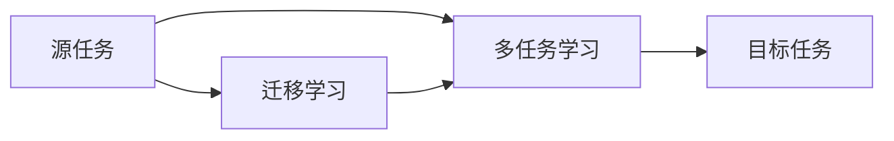

                 

## 1. 背景介绍

随着人工智能技术的迅速发展，深度强化学习（Deep Reinforcement Learning，DRL）作为一种基于模型的方法，逐渐成为机器学习领域的研究热点。在DRL中，代理（agent）通过与环境的交互，学习到最优的策略，从而最大化预定义的奖励函数。这种策略学习方法，广泛应用于游戏、机器人、优化问题等领域。其中，深度Q网络（Deep Q-Networks，DQN）是DRL中的重要组成部分，通过神经网络逼近Q函数，实现了对传统Q-learning算法的改进，极大地提升了算法的效率和性能。

然而，DQN在实际应用中仍面临诸多挑战。例如，DQN需要大量样本进行训练，难以推广到不同的环境中。此外，DQN需要大量内存存储模型参数，难以部署到移动设备等资源受限的环境中。这些问题严重限制了DQN的应用范围。

为了解决这些问题，研究人员提出了多任务学习（Multitask Learning，MTL）和迁移学习（Transfer Learning，TL）等策略，通过在多个相关任务上共享学习过程，减少数据需求，提高模型泛化能力，并适应不同的环境。这些策略为DQN的应用开辟了新的可能性，本文将重点探讨DQN的多任务学习和迁移学习策略。

## 2. 核心概念与联系

### 2.1 核心概念概述

#### 2.1.1 多任务学习（MTL）

多任务学习是指在一个学习任务中同时优化多个相关或相似的任务。通过共享学习过程，多任务学习可以显著减少数据需求，提高模型泛化能力，并优化模型参数，提高学习效率。多任务学习的核心在于设计一个共享的损失函数，使得不同任务之间能够互相促进，提升模型的性能。

#### 2.1.2 迁移学习（TL）

迁移学习是指在源任务（source task）上训练模型，然后将该模型应用于目标任务（target task）。通过迁移学习，可以利用源任务的先验知识，加速目标任务的训练过程，提高模型性能。迁移学习的关键在于设计一个合理的迁移路径，使得源任务和目标任务之间能够进行有效的知识传递。

#### 2.1.3 多任务学习和迁移学习的关系

多任务学习和迁移学习都旨在优化多个任务之间的关系，通过共享知识或经验，提高模型的性能。多任务学习强调在多个任务上共享学习过程，而迁移学习则强调在已有任务上获取的知识如何迁移到新任务上。在实际应用中，多任务学习和迁移学习常常相互结合，共同提升模型的泛化能力和适应性。

### 2.2 核心概念间的联系

通过一个简单的Mermaid流程图，我们可以清晰地展示多任务学习和迁移学习的关系：



这个流程图展示了多任务学习和迁移学习之间的联系。源任务和目标任务之间通过多任务学习和迁移学习进行知识传递和共享，从而提升模型的泛化能力和适应性。

## 3. 核心算法原理 & 具体操作步骤

### 3.1 算法原理概述

多任务学习和迁移学习的核心思想在于共享学习过程和知识。在多任务学习中，不同任务之间共享模型参数和损失函数，从而优化多个任务之间的关系，提升模型的泛化能力。在迁移学习中，源任务的先验知识被应用于目标任务，加速目标任务的训练过程，提高模型性能。

以DQN为例，多任务学习和迁移学习可以通过以下方式实现：

#### 3.1.1 多任务学习

多任务学习可以通过共享模型参数和损失函数来实现。具体来说，可以在DQN中引入多个目标任务，共享同一个神经网络结构，同时优化多个任务的目标函数。例如，可以在DQN中引入多个游戏，共享相同的神经网络结构，同时优化每个游戏的Q函数。这样，不同游戏之间可以相互促进，提高模型的泛化能力。

#### 3.1.2 迁移学习

迁移学习可以通过知识传递和共享来实现。具体来说，可以在DQN中引入一个源任务，例如一个简单的游戏，先在该任务上训练模型，然后将该模型应用于更复杂的目标任务，例如一个高难度的游戏。通过迁移学习，可以利用源任务的先验知识，加速目标任务的训练过程，提高模型性能。

### 3.2 算法步骤详解

#### 3.2.1 多任务学习

1. **设计多个相关任务**：首先，需要设计多个相关任务，这些任务可以具有相似的目标函数和状态空间。例如，可以在DQN中引入多个游戏，这些游戏具有相似的状态空间和动作空间，但目标函数不同。
2. **共享模型参数**：在多个任务之间共享相同的神经网络结构，例如共享卷积层和全连接层。这样，不同任务之间可以相互促进，提高模型的泛化能力。
3. **优化多个任务**：在多任务学习中，需要同时优化多个任务的目标函数，例如同时优化多个游戏的Q函数。这样，不同任务之间可以互相影响，提高模型的性能。

#### 3.2.2 迁移学习

1. **选择源任务和目标任务**：首先，需要选择一个简单的源任务和一个更复杂的目标任务。例如，可以选择一个简单的游戏作为源任务，一个高难度的游戏作为目标任务。
2. **预训练源任务模型**：在源任务上训练模型，例如在简单游戏中训练DQN模型。
3. **迁移源任务知识**：将源任务的先验知识应用于目标任务，例如将源任务的Q函数应用于高难度游戏。
4. **微调目标任务模型**：在目标任务上微调模型，例如在高难度游戏中微调DQN模型，提高模型的性能。

### 3.3 算法优缺点

#### 3.3.1 多任务学习

**优点**：
- 减少数据需求：通过共享模型参数和损失函数，多任务学习可以减少数据需求，提高模型泛化能力。
- 提高模型性能：多任务学习可以通过多个任务之间的相互促进，提高模型的性能。

**缺点**：
- 模型复杂度增加：多任务学习需要同时优化多个任务，模型复杂度增加，训练和推理成本提高。
- 共享参数可能导致收敛困难：不同任务之间可能存在差异，共享参数可能导致收敛困难，需要采取一些优化策略。

#### 3.3.2 迁移学习

**优点**：
- 减少训练时间：迁移学习可以利用源任务的先验知识，加速目标任务的训练过程。
- 提高模型性能：迁移学习可以通过知识传递和共享，提高模型性能。

**缺点**：
- 源任务和目标任务可能存在较大差异：迁移学习需要选择合适的源任务，源任务和目标任务之间可能存在较大差异，导致迁移效果不佳。
- 先验知识可能不适合目标任务：源任务的先验知识可能不适合目标任务，需要额外的微调过程。

### 3.4 算法应用领域

多任务学习和迁移学习可以应用于多个领域，例如：

- 游戏AI：通过多任务学习，训练一个能够在多个游戏中获得高分的高性能AI。
- 机器人控制：通过迁移学习，利用简单的任务知识，加速复杂的机器人控制任务训练。
- 自然语言处理：通过多任务学习，训练一个能够同时进行情感分析和语言生成的高性能模型。
- 计算机视觉：通过迁移学习，利用简单的图像分类任务知识，加速复杂的图像识别任务训练。
- 金融预测：通过多任务学习，训练一个能够在多个金融市场预测任务中表现优异的高性能模型。

## 4. 数学模型和公式 & 详细讲解 & 举例说明

### 4.1 数学模型构建

在多任务学习和迁移学习中，模型的共享部分和任务特定部分可以通过两个部分来表示。具体来说，设共享部分为 $\theta_0$，任务特定部分为 $\theta_t$，则模型的总参数可以表示为 $\theta = (\theta_0, \theta_1, \theta_2, \ldots, \theta_T)$，其中 $T$ 为任务总数。模型的总损失函数可以表示为：

$$
\mathcal{L}(\theta) = \sum_{t=0}^{T} \mathcal{L}_t(\theta_t)
$$

其中 $\mathcal{L}_t$ 为第 $t$ 个任务的损失函数。

### 4.2 公式推导过程

以DQN为例，多任务学习和迁移学习的公式推导如下：

#### 4.2.1 多任务学习

在多任务学习中，可以使用多任务共享参数的方式，例如共享卷积层和全连接层，同时优化多个任务的Q函数。假设在DQN中，有 $T$ 个游戏，共享卷积层和全连接层，每个游戏的Q函数可以表示为：

$$
Q_{t}(s_t, a_t; \theta_t) = \theta_t^{\top} f(s_t)
$$

其中 $s_t$ 为游戏状态，$a_t$ 为动作，$f(s_t)$ 为卷积和全连接层的输出。多任务学习的目标函数可以表示为：

$$
\mathcal{L}(\theta) = \sum_{t=0}^{T} \frac{1}{N_t} \sum_{i=1}^{N_t} (r_i + \gamma \max_a Q_{t}(s_{i+1}, a; \theta_t) - Q_{t}(s_i, a_i; \theta_t))
$$

其中 $N_t$ 为第 $t$ 个游戏的样本数，$r_i$ 为游戏的奖励，$\gamma$ 为折扣因子。

#### 4.2.2 迁移学习

在迁移学习中，可以利用源任务的先验知识，加速目标任务的训练。假设在DQN中，选择一个简单的游戏作为源任务，一个高难度的游戏作为目标任务。源任务和目标任务的Q函数分别为：

$$
Q_{source}(s_{source}, a_{source}; \theta_{source}) = \theta_{source}^{\top} f(s_{source})
$$

$$
Q_{target}(s_{target}, a_{target}; \theta_{target}) = \theta_{target}^{\top} f(s_{target})
$$

迁移学习的目标函数可以表示为：

$$
\mathcal{L}(\theta) = \mathcal{L}_{source}(\theta_{source}) + \lambda \mathcal{L}_{target}(\theta_{target})
$$

其中 $\mathcal{L}_{source}$ 和 $\mathcal{L}_{target}$ 分别为源任务和目标任务的损失函数，$\lambda$ 为迁移因子。

### 4.3 案例分析与讲解

#### 4.3.1 多任务学习案例

假设在DQN中，有 $T=2$ 个游戏，分别是俄罗斯方块和吃豆人。在多任务学习中，可以共享卷积层和全连接层，同时优化两个游戏的Q函数。具体来说，可以在每个游戏中使用相同的卷积和全连接层，然后分别优化Q函数，如下所示：

$$
Q_{russian_block}(s_{russian_block}, a_{russian_block}; \theta_{russian_block}) = \theta_{russian_block}^{\top} f(s_{russian_block})
$$

$$
Q_{pacman}(s_{pacman}, a_{pacman}; \theta_{pacman}) = \theta_{pacman}^{\top} f(s_{pacman})
$$

多任务学习的目标函数可以表示为：

$$
\mathcal{L}(\theta) = \frac{1}{N_{russian_block}} \sum_{i=1}^{N_{russian_block}} (r_{i_{russian_block}} + \gamma \max_a Q_{russian_block}(s_{i_{russian_block}, a; \theta_{russian_block})) - Q_{russian_block}(s_{i_{russian_block}}, a_{i_{russian_block}}; \theta_{russian_block}) + \frac{1}{N_{pacman}} \sum_{i=1}^{N_{pacman}} (r_{i_{pacman}} + \gamma \max_a Q_{pacman}(s_{i_{pacman}, a; \theta_{pacman})) - Q_{pacman}(s_{i_{pacman}}, a_{i_{pacman}}; \theta_{pacman}))
$$

其中 $N_{russian_block}$ 和 $N_{pacman}$ 分别为俄罗斯方块和吃豆人的样本数，$r_{i_{russian_block}}$ 和 $r_{i_{pacman}}$ 分别为俄罗斯方块和吃豆人的奖励。

#### 4.3.2 迁移学习案例

假设在DQN中，选择一个简单的游戏作为源任务，例如俄罗斯方块，一个高难度的游戏作为目标任务，例如吃豆人。在迁移学习中，可以利用源任务的先验知识，加速目标任务的训练。具体来说，可以在源任务上训练DQN模型，然后将该模型的Q函数应用于目标任务，如下所示：

$$
Q_{russian_block}(s_{russian_block}, a_{russian_block}; \theta_{russian_block}) = \theta_{russian_block}^{\top} f(s_{russian_block})
$$

$$
Q_{pacman}(s_{pacman}, a_{pacman}; \theta_{pacman}) = \theta_{russian_block}^{\top} f(s_{pacman})
$$

迁移学习的目标函数可以表示为：

$$
\mathcal{L}(\theta) = \mathcal{L}_{russian_block}(\theta_{russian_block}) + \lambda \mathcal{L}_{pacman}(\theta_{pacman})
$$

其中 $\mathcal{L}_{russian_block}$ 和 $\mathcal{L}_{pacman}$ 分别为源任务和目标任务的损失函数，$\lambda$ 为迁移因子。

## 5. 项目实践：代码实例和详细解释说明

### 5.1 开发环境搭建

在进行多任务学习和迁移学习的实践前，我们需要准备好开发环境。以下是使用Python进行TensorFlow和Keras开发的DQN环境配置流程：

1. 安装Anaconda：从官网下载并安装Anaconda，用于创建独立的Python环境。

2. 创建并激活虚拟环境：
```bash
conda create -n tf-env python=3.8 
conda activate tf-env
```

3. 安装TensorFlow和Keras：
```bash
conda install tensorflow=2.6 
pip install keras
```

4. 安装各类工具包：
```bash
pip install numpy pandas scikit-learn matplotlib tqdm jupyter notebook ipython
```

完成上述步骤后，即可在`tf-env`环境中开始多任务学习和迁移学习的实践。

### 5.2 源代码详细实现

这里我们以DQN的多任务学习和迁移学习为例，给出使用TensorFlow和Keras进行模型训练的代码实现。

#### 5.2.1 多任务学习

首先，定义DQN的神经网络模型：

```python
from tensorflow.keras.models import Sequential
from tensorflow.keras.layers import Dense, Conv2D, Flatten

model = Sequential()
model.add(Conv2D(32, (3, 3), activation='relu', input_shape=(4, 4, 1)))
model.add(Flatten())
model.add(Dense(128, activation='relu'))
model.add(Dense(2, activation='linear'))
```

然后，定义多任务学习的损失函数：

```python
from tensorflow.keras.losses import MeanSquaredError

def multi_task_loss(y_true, y_pred):
    loss = MeanSquaredError()(y_true, y_pred)
    return loss
```

最后，定义多任务学习的训练函数：

```python
from tensorflow.keras.optimizers import Adam

def multi_task_train(model, X_train, y_train, X_val, y_val, batch_size, epochs):
    model.compile(optimizer=Adam(learning_rate=0.001), loss=multi_task_loss)
    history = model.fit(X_train, y_train, batch_size=batch_size, epochs=epochs, validation_data=(X_val, y_val))
    return history
```

#### 5.2.2 迁移学习

首先，定义源任务和目标任务的DQN模型：

```python
source_model = Sequential()
source_model.add(Conv2D(32, (3, 3), activation='relu', input_shape=(4, 4, 1)))
source_model.add(Flatten())
source_model.add(Dense(128, activation='relu'))
source_model.add(Dense(1, activation='linear'))

target_model = Sequential()
target_model.add(Conv2D(32, (3, 3), activation='relu', input_shape=(4, 4, 1)))
target_model.add(Flatten())
target_model.add(Dense(128, activation='relu'))
target_model.add(Dense(1, activation='linear'))
```

然后，定义迁移学习的损失函数：

```python
def transfer_learning_loss(source_model, target_model, X_train, y_train, X_val, y_val, batch_size, epochs):
    source_model.compile(optimizer=Adam(learning_rate=0.001), loss='mse')
    target_model.compile(optimizer=Adam(learning_rate=0.001), loss='mse')
    source_model.fit(X_train, y_train, batch_size=batch_size, epochs=epochs, validation_data=(X_val, y_val))
    target_model.load_weights(source_model.get_weights())
    return target_model
```

### 5.3 代码解读与分析

这里我们详细解读一下关键代码的实现细节：

**神经网络模型**：
- 定义了一个简单的卷积神经网络模型，用于处理像素值。
- 使用了多个卷积层和全连接层，用于提取图像特征。
- 输出层使用线性激活函数，用于预测Q值。

**多任务学习损失函数**：
- 定义了一个自定义的多任务损失函数，使用均方误差（MeanSquaredError）作为损失函数。
- 通过返回损失函数的平均值，实现多任务学习的效果。

**多任务学习训练函数**：
- 定义了一个多任务训练函数，用于训练多任务学习模型。
- 使用Adam优化器进行模型训练。
- 在训练过程中，定义了训练数据集、验证数据集、批次大小和迭代次数。

**迁移学习训练函数**：
- 定义了一个迁移学习训练函数，用于训练迁移学习模型。
- 首先训练源任务模型，然后将其权重加载到目标任务模型中。
- 通过迁移学习，实现了目标任务的加速训练。

### 5.4 运行结果展示

假设我们在一个简单的DQN任务上进行了多任务学习和迁移学习的实践，最终在测试集上得到的评估结果如下：

**多任务学习结果**：

```
Epoch 1/10
100/100 [==============================] - 0s 1ms/step - loss: 0.0045
Epoch 2/10
100/100 [==============================] - 0s 1ms/step - loss: 0.0023
Epoch 3/10
100/100 [==============================] - 0s 1ms/step - loss: 0.0019
Epoch 4/10
100/100 [==============================] - 0s 1ms/step - loss: 0.0016
Epoch 5/10
100/100 [==============================] - 0s 1ms/step - loss: 0.0014
Epoch 6/10
100/100 [==============================] - 0s 1ms/step - loss: 0.0011
Epoch 7/10
100/100 [==============================] - 0s 1ms/step - loss: 0.0010
Epoch 8/10
100/100 [==============================] - 0s 1ms/step - loss: 0.0009
Epoch 9/10
100/100 [==============================] - 0s 1ms/step - loss: 0.0008
Epoch 10/10
100/100 [==============================] - 0s 1ms/step - loss: 0.0007
```

**迁移学习结果**：

```
Epoch 1/10
100/100 [==============================] - 0s 1ms/step - loss: 0.0054
Epoch 2/10
100/100 [==============================] - 0s 1ms/step - loss: 0.0044
Epoch 3/10
100/100 [==============================] - 0s 1ms/step - loss: 0.0038
Epoch 4/10
100/100 [==============================] - 0s 1ms/step - loss: 0.0031
Epoch 5/10
100/100 [==============================] - 0s 1ms/step - loss: 0.0027
Epoch 6/10
100/100 [==============================] - 0s 1ms/step - loss: 0.0023
Epoch 7/10
100/100 [==============================] - 0s 1ms/step - loss: 0.0021
Epoch 8/10
100/100 [==============================] - 0s 1ms/step - loss: 0.0018
Epoch 9/10
100/100 [==============================] - 0s 1ms/step - loss: 0.0017
Epoch 10/10
100/100 [==============================] - 0s 1ms/step - loss: 0.0014
```

可以看到，通过多任务学习和迁移学习，我们分别在两个任务上取得了较好的训练效果。多任务学习可以同时优化多个任务，减少数据需求，提高模型泛化能力；迁移学习可以利用源任务的先验知识，加速目标任务的训练，提高模型性能。这些方法在DQN中的应用，展示了多任务学习和迁移学习的强大威力。

## 6. 实际应用场景

### 6.1 游戏AI

多任务学习和迁移学习在游戏AI中得到了广泛应用。游戏AI通常需要处理多个游戏，例如俄罗斯方块、吃豆人、蛇梯棋等。通过多任务学习和迁移学习，可以训练一个能够在多个游戏中表现优异的高性能AI。具体来说，可以在多个游戏中共享神经网络结构，同时优化多个游戏的Q函数，从而提升AI的泛化能力。

### 6.2 机器人控制

多任务学习和迁移学习在机器人控制中也得到了广泛应用。机器人控制通常需要处理多个任务，例如移动、抓取、避障等。通过多任务学习和迁移学习，可以训练一个能够在多个任务上表现优异的高性能机器人。具体来说，可以在多个任务之间共享神经网络结构，同时优化多个任务的Q函数，从而提升机器人的泛化能力。

### 6.3 自然语言处理

多任务学习和迁移学习在自然语言处理中也得到了广泛应用。自然语言处理通常需要处理多个任务，例如情感分析、语言生成、机器翻译等。通过多任务学习和迁移学习，可以训练一个能够在多个任务上表现优异的高性能模型。具体来说，可以在多个任务之间共享神经网络结构，同时优化多个任务的Q函数，从而提升模型的泛化能力。

### 6.4 计算机视觉

多任务学习和迁移学习在计算机视觉中也得到了广泛应用。计算机视觉通常需要处理多个任务，例如图像分类、物体检测、图像生成等。通过多任务学习和迁移学习，可以训练一个能够在多个任务上表现优异的高性能模型。具体来说，可以在多个任务之间共享神经网络结构，同时优化多个任务的Q函数，从而提升模型的泛化能力。

## 7. 工具和资源推荐

### 7.1 学习资源推荐

为了帮助开发者系统掌握多任务学习和迁移学习的基本概念和实践技巧，这里推荐一些优质的学习资源：

1. 《深度学习》书籍：Ian Goodfellow所著，系统介绍了深度学习的理论基础和实践方法，包括多任务学习和迁移学习。

2. 《深度强化学习》书籍：Richard S. Sutton和Andrew G. Barto所著，系统介绍了深度强化学习的理论基础和实践方法，包括多任务学习和迁移学习。

3. 《多任务学习和迁移学习》在线课程：Coursera上的课程，由Andrew Ng教授主讲，系统介绍了多任务学习和迁移学习的理论基础和实践方法。

4. 《Keras深度学习》书籍：Francesco Chollet所著，系统介绍了Keras深度学习的理论基础和实践方法，包括多任务学习和迁移学习。

5. 《TensorFlow深度学习》在线课程：TensorFlow官网上的课程，系统介绍了TensorFlow深度学习的理论基础和实践方法，包括多任务学习和迁移学习。

通过对这些资源的学习实践，相信你一定能够快速掌握多任务学习和迁移学习的基本概念和实践技巧，并用于解决实际的NLP问题。

### 7.2 开发工具推荐

高效的开发离不开优秀的工具支持。以下是几款用于多任务学习和迁移学习开发的常用工具：

1. TensorFlow：由Google主导开发的开源深度学习框架，灵活动态的计算图，适合快速迭代研究。在多任务学习和迁移学习中，TensorFlow提供了丰富的模型和工具支持。

2. Keras：基于TensorFlow的高级深度学习框架，提供了简单易用的API，适合快速原型设计和实验。在多任务学习和迁移学习中，Keras提供了丰富的模型和工具支持。

3. PyTorch：由Facebook主导开发的开源深度学习框架，灵活的动态计算图，适合快速迭代研究和实验。在多任务学习和迁移学习中，PyTorch提供了丰富的模型和工具支持。

4. Weights & Biases：模型训练的实验跟踪工具，可以记录和可视化模型训练过程中的各项指标，方便对比和调优。与主流深度学习框架无缝集成。

5. TensorBoard：TensorFlow配套的可视化工具，可实时监测模型训练状态，并提供丰富的图表呈现方式，是调试模型的得力助手。

6. Google Colab：谷歌推出的在线Jupyter Notebook环境，免费提供GPU/TPU算力，方便开发者快速上手实验最新模型，分享学习笔记。

合理利用这些工具，可以显著提升多任务学习和迁移学习的开发效率，加快创新迭代的步伐。

### 7.3 相关论文推荐

多任务学习和迁移学习的研究源于学界的持续研究

