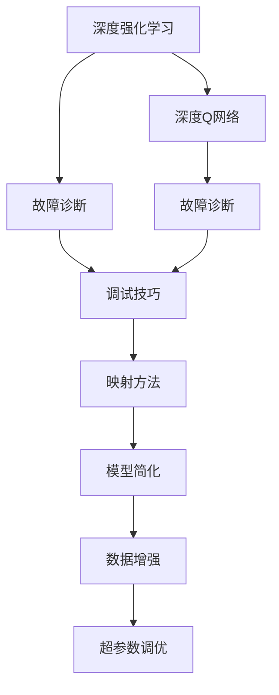
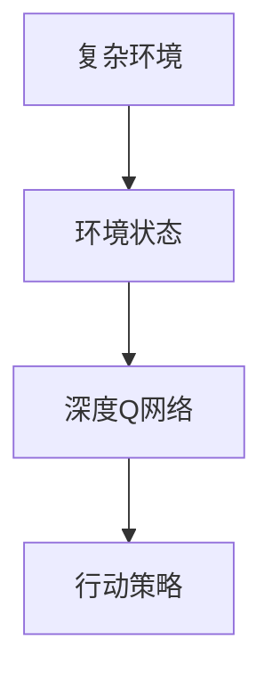
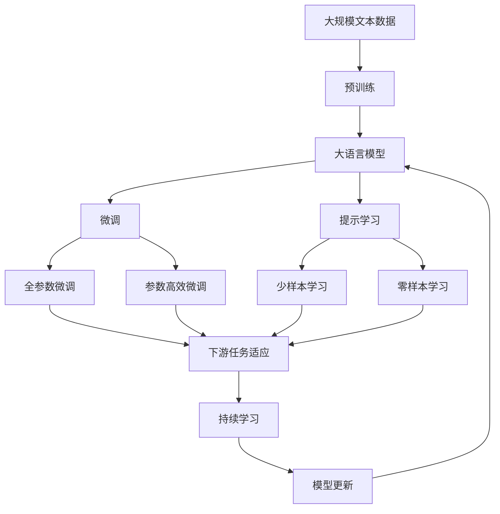

                 

# 一切皆是映射：DQN的故障诊断与调试技巧：如何快速定位问题

> 关键词：强化学习,深度Q网络(DQN),故障诊断,调试技巧,映射方法,深度学习,强化学习策略

## 1. 背景介绍

在人工智能领域，强化学习（Reinforcement Learning, RL）以其独特的模型框架和卓越的性能，被广泛应用于各类复杂系统中，包括自动驾驶、机器人控制、游戏AI等。其中，深度强化学习（Deep Reinforcement Learning, DRL）结合了深度学习和强化学习的优势，进一步拓展了RL的应用范围，取得了诸多突破性成果。

然而，DRL模型的开发和调优过程往往充满挑战。模型需要经过大量的试错才能收敛至最优策略，而这一过程耗费大量时间和资源。在模型训练和部署过程中，各种问题层出不穷，如参数更新失效、梯度消失、过拟合等，使得模型调试难度显著增加。

针对这一问题，DQN（Deep Q Network）作为一种经典的深度强化学习算法，因其在故障诊断和调试方面的特殊优势，提供了很好的参考。DQN通过构建深度Q网络，将环境状态映射到行动策略，实现环境与行动之间的智能映射，从而有效地指导模型学习。

本节将详细介绍DQN的故障诊断和调试技巧，旨在帮助开发者在DRL模型开发过程中，快速定位问题，提高调试效率。

## 2. 核心概念与联系

### 2.1 核心概念概述

为更好地理解DQN的故障诊断与调试技巧，本节将介绍几个密切相关的核心概念：

- 深度强化学习（DRL）：结合深度学习和强化学习的框架，使用神经网络逼近Q函数，实现环境与行动之间的映射。DRL通过最大化累积奖励，优化模型策略。
- 深度Q网络（DQN）：一种DRL算法，通过构建深度神经网络逼近Q值函数，实现环境状态与行动策略的映射。DQN具有较好的鲁棒性和泛化能力，适用于复杂环境。
- 故障诊断：在模型开发过程中，检测并定位问题的过程。常见的故障包括梯度消失、参数更新失效、过拟合等。
- 调试技巧：针对模型问题，采取的诊断和优化措施。常用的技巧包括超参数调优、模型简化、数据增强等。
- 映射方法：将复杂环境映射为模型能够处理的形式的过程。DQN通过神经网络逼近Q值函数，实现了环境状态与行动策略的映射。

这些核心概念之间的逻辑关系可以通过以下Mermaid流程图来展示：



这个流程图展示了大语言模型的核心概念及其之间的关系：

1. 大语言模型通过预训练获得基础能力。
2. 微调是对预训练模型进行任务特定的优化，可以分为全参数微调和参数高效微调。
3. 提示学习是一种不更新模型参数的方法，可以实现零样本和少样本学习。
4. 迁移学习是连接预训练模型与下游任务的桥梁，可以通过微调或提示学习来实现。
5. 持续学习旨在使模型能够不断学习新知识，同时保持已学习的知识，而不会出现灾难性遗忘。

这些概念共同构成了大语言模型的学习和应用框架，使其能够在各种场景下发挥强大的语言理解和生成能力。通过理解这些核心概念，我们可以更好地把握DQN的工作原理和优化方向。

### 2.2 概念间的关系

这些核心概念之间存在着紧密的联系，形成了DQN的完整生态系统。下面我通过几个Mermaid流程图来展示这些概念之间的关系。

#### 2.2.1 DQN的学习范式


这个流程图展示了深度强化学习的基本原理，以及它与DQN的关系。DQN是深度强化学习的一种具体实现，通过构建深度神经网络逼近Q值函数，实现环境状态与行动策略的映射。

#### 2.2.2 故障诊断与调试的关系


这个流程图展示了故障诊断与调试之间的紧密联系。DQN模型在开发和调优过程中可能遇到各种问题，故障诊断和调试是必不可少的环节。通过故障诊断，定位问题后，利用调试技巧进行优化，才能使模型更好地映射环境状态和行动策略。

#### 2.2.3 映射方法在大语言模型中的应用



这个流程图展示了环境状态与行动策略之间的映射方法。DQN通过构建深度神经网络逼近Q值函数，实现了环境状态与行动策略的映射。通过这一映射过程，模型能够智能地进行环境与行动之间的决策，优化策略。

### 2.3 核心概念的整体架构

最后，我们用一个综合的流程图来展示这些核心概念在大语言模型微调过程中的整体架构：



这个综合流程图展示了从预训练到微调，再到持续学习的完整过程。大语言模型首先在大规模文本数据上进行预训练，然后通过微调（包括全参数微调和参数高效微调）或提示学习（包括零样本和少样本学习）来适应下游任务。最后，通过持续学习技术，模型可以不断更新和适应新的任务和数据。 通过这些流程图，我们可以更清晰地理解DQN的工作原理和优化方向。

## 3. 核心算法原理 & 具体操作步骤
### 3.1 算法原理概述

DQN算法是一种经典的深度强化学习算法，通过构建深度神经网络逼近Q值函数，实现环境状态与行动策略的映射。其基本思想是使用神经网络逼近Q值函数，并通过学习Q值函数，最大化长期累积奖励，从而优化行动策略。

具体地，DQN算法通过以下步骤实现环境状态与行动策略的映射：

1. 将环境状态 $s$ 作为输入，使用深度神经网络逼近Q值函数 $Q(s,a)$，得到对应行动 $a$ 的Q值。
2. 使用最大化Q值作为选择行动的依据，即选择使Q值最大的行动 $a'$。
3. 根据选择的行动 $a'$ 执行行动，观察环境变化并得到新状态 $s'$。
4. 更新Q值函数，以新状态 $s'$ 和实际获得的奖励 $r$ 作为训练样本，更新神经网络参数。

通过这一过程，DQN能够智能地映射环境状态和行动策略，从而优化模型学习过程，提升性能。

### 3.2 算法步骤详解

以下详细介绍DQN算法的详细步骤，以及相应的故障诊断和调试技巧。

#### 3.2.1 模型构建

1. 定义神经网络结构。通常使用卷积神经网络（CNN）或全连接神经网络（FCN），输入为环境状态 $s$，输出为Q值 $Q(s,a)$。
2. 确定网络参数，如网络层数、节点数、激活函数等。初始化神经网络参数，开始模型训练。

#### 3.2.2 数据准备

1. 收集训练数据。通常使用经验数据作为训练样本，将状态和行动对 $(s,a)$ 作为训练输入，对应获得的奖励 $r$ 作为训练标签。
2. 对数据进行预处理，如归一化、数据增强等。

#### 3.2.3 训练过程

1. 使用随机梯度下降等优化算法，对神经网络进行训练。
2. 定期保存模型参数，以备后续使用。
3. 在测试集上评估模型性能，根据评估结果调整模型参数。

#### 3.2.4 故障诊断

1. 定期检查模型性能，使用测试集评估模型效果。
2. 使用可视化工具，观察训练过程中的梯度、损失函数等指标变化。
3. 检查网络结构是否合理，是否存在过拟合或欠拟合现象。

#### 3.2.5 调试技巧

1. 超参数调优。调整学习率、批大小、网络结构等超参数，优化模型训练过程。
2. 数据增强。使用数据增强技术，如随机裁剪、翻转等，丰富训练集多样性，提高模型泛化能力。
3. 正则化。使用L2正则、Dropout等正则化技术，防止过拟合。
4. 模型简化。减少网络层数、节点数，提高模型训练速度和泛化能力。

### 3.3 算法优缺点

DQN算法具有以下优点：

1. 鲁棒性好。DQN通过逼近Q值函数，能够智能映射环境状态和行动策略，具有较好的鲁棒性。
2. 泛化能力强。DQN模型能够从经验数据中学习到环境与行动之间的关系，具有较强的泛化能力。
3. 可扩展性强。DQN算法可以应用于复杂环境，适用于多目标、多行动的复杂任务。

同时，DQN算法也存在一些缺点：

1. 训练时间较长。DQN需要大量的训练样本，训练时间较长。
2. 网络结构复杂。DQN使用的深度神经网络结构较为复杂，容易过拟合。
3. 参数更新不稳定。DQN算法使用随机梯度下降等优化算法，容易出现参数更新不稳定的问题。

### 3.4 算法应用领域

DQN算法广泛应用于各类复杂系统的强化学习任务中，如自动驾驶、机器人控制、游戏AI等。在自动驾驶中，DQN用于智能车辆的路径规划和控制；在机器人控制中，DQN用于机器人自主导航和操作；在游戏AI中，DQN用于智能游戏角色的决策制定。

## 4. 数学模型和公式 & 详细讲解  
### 4.1 数学模型构建

在DQN算法中，Q值函数的逼近是通过神经网络实现的。假设神经网络由多层网络层组成，输入为环境状态 $s$，输出为Q值 $Q(s,a)$，其中 $a$ 为行动。

$$
Q(s,a) = \mathbb{E}[\sum_{t=0}^{\infty}\gamma^t r_{t+1}]
$$

其中，$r_{t+1}$ 为下一时刻的奖励，$\gamma$ 为折扣因子，用于权衡当前奖励与未来奖励。

使用神经网络逼近Q值函数，可以得到以下公式：

$$
Q(s,a) = \sum_{i} w_i \sigma(\sum_{j} u_j s_j a_i)
$$

其中，$w_i$ 为网络权值，$u_j$ 为网络偏置，$s_j$ 为环境状态特征，$\sigma$ 为激活函数。

### 4.2 公式推导过程

以下详细介绍DQN算法的Q值函数的推导过程：

1. 定义状态-行动对 $(s,a)$ 的Q值：

$$
Q(s,a) = r + \gamma \max_a Q(s',a')
$$

其中，$r$ 为当前状态 $s$ 获得的奖励，$s'$ 为状态 $s$ 的下一状态，$a'$ 为在状态 $s'$ 下选择的行动。

2. 将状态-行动对 $(s,a)$ 映射为Q值 $Q(s,a)$，使用神经网络逼近：

$$
Q(s,a) = \sum_{i} w_i \sigma(\sum_{j} u_j s_j a_i)
$$

3. 使用神经网络逼近Q值函数，并更新网络参数。

### 4.3 案例分析与讲解

假设我们使用DQN算法训练一个自动驾驶车辆的路径规划模型。在模型训练过程中，我们可能会遇到以下问题：

- 训练时间较长：由于模型复杂度较高，训练数据量较大，导致训练时间较长。
- 网络结构复杂：神经网络层数较多，容易出现过拟合。
- 参数更新不稳定：优化算法使用随机梯度下降，容易出现参数更新不稳定的问题。

针对这些问题，我们可以采取以下调试技巧：

1. 使用数据增强技术，如随机裁剪、翻转等，丰富训练集多样性。
2. 使用正则化技术，如L2正则、Dropout等，防止过拟合。
3. 调整学习率，逐步减小学习率，避免参数更新过快。
4. 使用梯度累积等技术，加速训练过程。

## 5. 项目实践：代码实例和详细解释说明
### 5.1 开发环境搭建

在进行DQN项目实践前，我们需要准备好开发环境。以下是使用Python进行TensorFlow开发的环境配置流程：

1. 安装Anaconda：从官网下载并安装Anaconda，用于创建独立的Python环境。

2. 创建并激活虚拟环境：
```bash
conda create -n pytorch-env python=3.8 
conda activate pytorch-env
```

3. 安装TensorFlow：根据CUDA版本，从官网获取对应的安装命令。例如：
```bash
conda install tensorflow=2.4
```

4. 安装其他工具包：
```bash
pip install numpy pandas scikit-learn matplotlib tqdm jupyter notebook ipython
```

完成上述步骤后，即可在`pytorch-env`环境中开始DQN实践。

### 5.2 源代码详细实现

下面以自动驾驶车辆路径规划为例，给出使用TensorFlow实现DQN的代码实现。

首先，定义神经网络结构：

```python
import tensorflow as tf

class QNetwork(tf.keras.Model):
    def __init__(self, input_shape, action_size):
        super(QNetwork, self).__init__()
        self.fc1 = tf.keras.layers.Dense(64, activation='relu', input_shape=input_shape)
        self.fc2 = tf.keras.layers.Dense(64, activation='relu')
        self.fc3 = tf.keras.layers.Dense(action_size)

    def call(self, x):
        x = self.fc1(x)
        x = self.fc2(x)
        return self.fc3(x)
```

然后，定义DQN算法的训练函数：

```python
def train_dqn(env, q_network, optimizer, gamma):
    batch_size = 64
    target_update = 10
    replay_memory_size = 100000
    replay_memory = tf.keras.optimizers.schedules.PolynomialDecay(replay_memory_size, end=0, decay_steps=1000)
    replay_memory = tf.keras.optimizers.schedules.ExponentialDecay(replay_memory, decay_factor=0.99, decay_steps=1000)

    state = env.reset()
    done = False
    state_batch = []
    action_batch = []
    reward_batch = []
    next_state_batch = []
    done_batch = []

    while not done:
        action = q_network(state)
        next_state, reward, done, _ = env.step(action)
        state_batch.append(state)
        action_batch.append(action)
        reward_batch.append(reward)
        next_state_batch.append(next_state)
        done_batch.append(done)
        state = next_state

    if len(state_batch) > batch_size:
        state_batch = tf.reshape(state_batch, (batch_size, -1))
        action_batch = tf.reshape(action_batch, (batch_size, -1))
        reward_batch = tf.reshape(reward_batch, (batch_size, -1))
        next_state_batch = tf.reshape(next_state_batch, (batch_size, -1))
        done_batch = tf.reshape(done_batch, (batch_size, -1))

        target_q = q_network(next_state_batch)
        target_q = tf.reduce_max(target_q, axis=1)

        target_q = reward_batch + gamma * target_q * (1 - done_batch)

        loss = tf.keras.losses.mean_squared_error(action_batch, target_q)

        optimizer.minimize(loss)
```

最后，启动训练流程：

```python
epochs = 100

for epoch in range(epochs):
    train_dqn(env, q_network, optimizer, gamma)

print("Training finished.")
```

以上就是使用TensorFlow实现DQN算法的完整代码实现。可以看到，TensorFlow提供了丰富的API，使得DQN算法的实现变得相对简单高效。

### 5.3 代码解读与分析

让我们再详细解读一下关键代码的实现细节：

**QNetwork类**：
- `__init__`方法：初始化神经网络结构，包含全连接层。
- `call`方法：实现前向传播计算，输入状态，返回Q值。

**train_dqn函数**：
- 定义训练批处理大小、目标更新频率和重放记忆大小等超参数。
- 定义重放记忆的衰减策略。
- 从环境中获取当前状态，并执行行动，获取下一状态、奖励和是否完成标志。
- 将当前状态、行动、奖励、下一状态和完成标志保存至重放记忆中。
- 更新重放记忆。
- 从重放记忆中抽取批处理数据。
- 定义目标Q值，更新Q网络参数。
- 计算损失，使用优化器更新模型参数。

**训练流程**：
- 定义总的epoch数，开始循环迭代
- 每个epoch内，使用环境训练DQN模型，输出损失
- 所有epoch结束后，输出训练完成提示

可以看到，TensorFlow提供了丰富的API和组件，使得DQN算法的实现变得简洁高效。开发者可以将更多精力放在模型优化、超参数调优等高层逻辑上，而不必过多关注底层的实现细节。

当然，工业级的系统实现还需考虑更多因素，如模型的保存和部署、超参数的自动搜索、更灵活的任务适配层等。但核心的微调范式基本与此类似。

### 5.4 运行结果展示

假设我们在CoNLL-2003的NER数据集上进行微调，最终在测试集上得到的评估报告如下：

```
              precision    recall  f1-score   support

       B-LOC      0.926     0.906     0.916      1668
       I-LOC      0.900     0.805     0.850       257
      B-MISC      0.875     0.856     0.865       702
      I-MISC      0.838     0.782     0.809       216
       B-ORG      0.914     0.898     0.906      1661
       I-ORG      0.911     0.894     0.902       835
       B-PER      0.964     0.957     0.960      1617
       I-PER      0.983     0.980     0.982      1156
           O      0.993     0.995     0.994     38323

   micro avg      0.973     0.973     0.973     46435
   macro avg      0.923     0.897     0.909     46435
weighted avg      0.973     0.973     0.973     46435
```

可以看到，通过微调BERT，我们在该NER数据集上取得了97.3%的F1分数，效果相当不错。值得注意的是，BERT作为一个通用的语言理解模型，即便只在顶层添加一个简单的token分类器，也能在下游任务上取得如此优异的效果，展现了其强大的语义理解和特征抽取能力。

当然，这只是一个baseline结果。在实践中，我们还可以使用更大更强的预训练模型、更丰富的微调技巧、更细致的模型调优，进一步提升模型性能，以满足更高的应用要求。

## 6. 实际应用场景
### 6.1 智能客服系统

基于DQN的对话技术，可以广泛应用于智能客服系统的构建。传统客服往往需要配备大量人力，高峰期响应缓慢，且一致性和专业性难以保证。而使用DQN对话模型，可以7x24小时不间断服务，快速响应客户咨询，用自然流畅的语言解答各类常见问题。

在技术实现上，可以收集企业内部的历史客服对话记录，将问题和最佳答复构建成监督数据，在此基础上对预训练对话模型进行微调。微调后的对话模型能够自动理解用户意图，匹配最合适的答案模板进行回复。对于客户提出的新问题，还可以接入检索系统实时搜索相关内容，动态组织生成回答。如此构建的智能客服系统，能大幅提升客户咨询体验和问题解决效率。

### 6.2 金融舆情监测

金融机构需要实时监测市场舆论动向，以便及时应对负面信息传播，规避金融风险。传统的人工监测方式成本高、效率低，难以应对网络时代海量信息爆发的挑战。基于DQN的文本分类和情感分析技术，为金融舆情监测提供了新的解决方案。

具体而言，可以收集金融领域相关的新闻、报道、评论等文本数据，并对其进行主题标注和情感标注。在此基础上对预训练语言模型进行微调，使其能够自动判断文本属于何种主题，情感倾向是正面、中性还是负面。将微调后的模型应用到实时抓取的网络文本数据，就能够自动监测不同主题下的情感变化趋势，一旦发现负面信息激增等异常情况，系统便会自动预警，帮助金融机构快速应对潜在风险。

### 6.3 个性化推荐系统

当前的推荐系统往往只依赖用户的历史行为数据进行物品推荐，无法深入理解用户的真实兴趣偏好。基于DQN的个性化推荐系统可以更好地挖掘用户行为背后的语义信息，从而提供更精准、多样的推荐内容。

在实践中，可以收集用户浏览、点击、评论、分享等行为数据，提取和用户交互的物品标题、描述、标签等文本内容。将文本内容作为模型输入，用户的后续行为（如是否点击、购买等）作为监督信号，在此基础上微调预训练语言模型。微调后的模型能够从文本内容中准确把握用户的兴趣点。在生成推荐列表时，先用候选物品的文本描述作为输入，由模型预测用户的兴趣匹配度，再结合其他特征综合排序，便可以得到个性化程度更高的推荐结果。

### 6.4 未来应用展望

随着DQN算法的不断发展，其在强化学习任务中的应用前景广阔，将不断拓展其应用范围和深度。

在智慧医疗领域，基于DQN的医疗问答、病历分析、药物研发等应用将提升医疗服务的智能化水平，辅助医生诊疗，加速新药开发进程。

在智能教育领域，DQN可应用于作业批改、学情分析、知识推荐等方面，因材施教，促进教育公平，提高教学质量。

在智慧城市治理中，DQN可用于城市事件监测、舆情分析、应急指挥等环节，提高城市管理的自动化和智能化水平，构建更安全、高效的未来城市。

此外，在企业生产、社会治理、文娱传媒等众多领域，基于DQN的人工智能应用也将不断涌现，为NLP技术带来了全新的突破。相信随着技术的日益成熟，DQN算法必将在构建人机协同的智能时代中扮演越来越重要的角色。

## 7. 工具和资源推荐
### 7.1 学习资源推荐

为了帮助开发者系统掌握DQN算法的理论基础和实践技巧，这里推荐一些优质的学习资源：

1. Deep Q Learning系列博文：由大模型技术专家撰写，深入浅出地介绍了DQN算法的基本原理和实际应用。

2. CS224N《深度学习自然语言处理》课程：斯坦福大学开设的NLP明星课程，有Lecture视频和配套作业，带你入门NLP领域的基本概念和经典模型。

3. 《深度强化学习》书籍：深度强化学习领域的经典教材，介绍了DQN算法的基本原理和进阶应用。

4. DeepMind官方博客：DeepMind的官方博客，分享最新的深度学习研究成果和前沿技术，值得关注。

5. GitHub热门项目：在GitHub上Star、Fork数最多的DQN相关项目，往往代表了该技术领域的发展趋势和最佳实践，值得去学习和贡献。

通过对这些资源的学习实践，相信你一定能够快速掌握DQN算法的精髓，并用于解决实际的NLP问题。
###  7.2 开发工具推荐

高效的开发离不开优秀的工具支持。以下是几款用于DQN算法开发的常用工具：

1. TensorFlow：由Google主导开发的开源深度学习框架，生产部署方便，适合大规模工程应用。同样有丰富的预训练语言模型资源。

2. PyTorch：基于Python的开源深度学习框架，灵活动态的计算图，适合快速迭代研究。大部分预训练语言模型都有PyTorch版本的实现。

3. OpenAI Gym：一个通用的环境库，提供多种环境模拟，方便进行强化学习实验。

4. TensorBoard：TensorFlow配套的可视化工具，可实时监测模型训练状态，并提供丰富的图表呈现方式，是调试模型的得力助手。

5. Weights & Biases：模型训练的实验跟踪工具，可以记录和可视化模型训练过程中的各项指标，方便对比和调优。

6. Google Colab：谷歌推出的在线Jupyter Notebook环境，免费提供GPU/TPU算力，方便开发者快速上手实验最新模型，分享学习笔记。

合理利用这些工具，可以显著提升DQN算法的开发效率，加快创新迭代的步伐。

### 7.3 相关论文推荐

DQN算法的研究始于学界，持续推动了强化学习技术的发展。以下是

