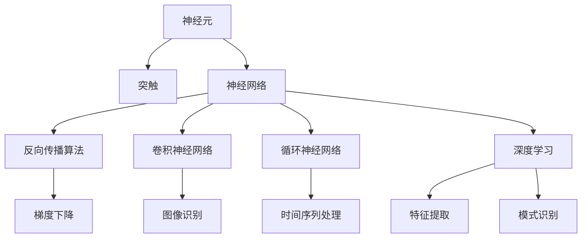

                 

# 一切皆是映射：从生物神经到人工神经网络的演变

## 1. 背景介绍

### 1.1 问题由来

随着人工智能技术的飞速发展，人工神经网络（Artificial Neural Networks,ANNs）作为模拟生物神经网络的结构和功能，已经广泛应用于图像识别、语音识别、自然语言处理等领域。然而，这一技术的起源可以追溯到生物神经系统的结构和功能。了解从生物神经到人工神经网络演变的脉络，不仅有助于理解ANNs的原理和应用，更能启发我们在人工智能领域的创新。

### 1.2 问题核心关键点

ANNs的核心思想是模拟人类大脑的神经元工作原理，通过多个神经元之间的连接进行信息传递和处理。生物神经系统的结构和功能是ANNs设计的重要参考。本文将从神经元的基本工作原理出发，深入探讨ANNs与生物神经系统的联系，分析ANNs的演变过程，最后展望其在未来AI技术中的潜在应用。

### 1.3 问题研究意义

深入理解ANNs与生物神经系统的联系，不仅有助于优化现有神经网络模型，还能为新型的AI技术提供理论支持。此外，对ANNs演变的历史背景进行梳理，有助于揭示这一技术的潜在发展方向，激发更多的创新灵感。

## 2. 核心概念与联系

### 2.1 核心概念概述

- **神经元（Neuron）**：生物神经系统中最基本的处理单元，通过接收输入信号，激活或抑制后续神经元。
- **突触（Synapse）**：神经元之间的连接，传递信号的关键结构。
- **神经网络（Neural Network）**：由大量神经元及其连接组成的网络，能够进行复杂的数据处理和模式识别。
- **反向传播算法（Backpropagation）**：一种神经网络的训练算法，通过梯度下降优化模型参数，提高模型的预测精度。
- **卷积神经网络（Convolutional Neural Network, CNN）**：一种特殊的神经网络，擅长处理图像和语音等高维数据。
- **循环神经网络（Recurrent Neural Network, RNN）**：通过网络层间循环连接，能够处理时间序列数据的神经网络。
- **深度学习（Deep Learning）**：通过多层神经网络进行数据处理的AI技术，具有强大的特征提取和模式识别能力。

这些核心概念之间的联系可以通过以下Mermaid流程图来展示：



这个流程图展示了神经元、突触和神经网络之间的联系，以及ANNs中常用的几种神经网络类型和训练算法。

### 2.2 概念间的关系

神经元和突触是构成生物神经网络的基本元素，ANNs则是模拟这一结构的功能。ANNs的反向传播算法和卷积神经网络、循环神经网络等特殊网络结构，都是对生物神经网络机制的直接应用和优化。深度学习则是在ANNs基础上，通过多层结构实现复杂数据处理和模式识别。

## 3. 核心算法原理 & 具体操作步骤

### 3.1 算法原理概述

ANNs的核心理论是模拟生物神经元的输入-输出映射关系，通过大量神经元之间的连接和激活函数进行信息传递和处理。ANNs通过反向传播算法，不断调整各层神经元的权重和偏置，优化模型的预测精度。

ANNs的训练过程主要包括以下几个步骤：
1. **前向传播**：输入数据通过网络各层进行传递，每层神经元将输入信号加权求和，并应用激活函数进行非线性映射。
2. **计算损失函数**：将模型输出与真实标签进行对比，计算预测误差。
3. **反向传播**：通过链式法则，计算各层神经元的梯度，并将梯度传递到前一层。
4. **更新模型参数**：根据梯度下降算法，更新模型的权重和偏置。

### 3.2 算法步骤详解

以下是ANNs训练过程的详细步骤：

1. **初始化网络参数**：随机初始化所有神经元的权重和偏置。
2. **前向传播**：将输入数据通过网络各层进行传递，每层神经元将输入信号加权求和，并应用激活函数进行非线性映射。
3. **计算损失函数**：将模型输出与真实标签进行对比，计算预测误差。
4. **反向传播**：通过链式法则，计算各层神经元的梯度，并将梯度传递到前一层。
5. **更新模型参数**：根据梯度下降算法，更新模型的权重和偏置。

### 3.3 算法优缺点

ANNs的优点包括：
- 强大的特征提取和模式识别能力，适用于多种数据类型和应用场景。
- 训练算法如反向传播、梯度下降等高效可行，已广泛应用于实际应用。

ANNs的缺点包括：
- 训练过程依赖大量标注数据，对标注数据的质量要求较高。
- 网络结构复杂，模型过深或过宽可能导致梯度消失或爆炸问题。
- 黑盒模型，难以解释模型决策过程，存在一定的不透明性。

### 3.4 算法应用领域

ANNs在多个领域得到广泛应用，包括但不限于：
- **图像识别**：CNN通过卷积操作提取图像特征，广泛应用于目标检测、图像分类等领域。
- **语音识别**：RNN通过时间序列数据处理，在语音识别、语言翻译等方面取得显著成果。
- **自然语言处理**：通过文本数据的处理和理解，ANNs在机器翻译、情感分析、文本生成等任务上表现出色。
- **推荐系统**：通过用户行为数据的处理，ANNs在电商推荐、内容推荐等方面实现个性化推荐。

## 4. 数学模型和公式 & 详细讲解  
### 4.1 数学模型构建

ANNs的数学模型由多层神经元构成，每层神经元接收上一层神经元的输出信号，经过加权求和和激活函数映射，输出新的信号。以下是一个简单的神经网络模型，由一个输入层、一个隐藏层和一个输出层组成：

```
输入层: $x = (x_1, x_2, ..., x_n)$
隐藏层: $h = (h_1, h_2, ..., h_m)$
输出层: $y = (y_1, y_2, ..., y_k)$

权重矩阵: $W$
偏置向量: $b$
激活函数: $f$
损失函数: $\mathcal{L}$
```

其中，$W$和$b$是神经元的权重和偏置，$f$是激活函数，$\mathcal{L}$是损失函数。

### 4.2 公式推导过程

ANNs的前向传播过程可以表示为：
$$
h = f(Wx + b)
$$
其中，$x$是输入，$W$和$b$是权重和偏置，$f$是激活函数。

输出层计算公式为：
$$
y = f(W'h + b')
$$
其中，$h$是隐藏层的输出，$W'$和$b'$是输出层的权重和偏置。

ANNs的损失函数通常使用均方误差（Mean Squared Error, MSE）或交叉熵损失（Cross Entropy Loss）。以均方误差为例，损失函数公式为：
$$
\mathcal{L} = \frac{1}{2N}\sum_{i=1}^{N}(y_i - \hat{y_i})^2
$$
其中，$y$是真实标签，$\hat{y}$是模型预测输出。

### 4.3 案例分析与讲解

以手写数字识别为例，ANNs可以通过学习训练集中的数字图像数据，掌握数字的特征，从而对新的数字图像进行分类。假设训练集包含600个样本，每个样本为28x28的灰度图像，即784维的向量。ANNs可以采用3层结构，其中输入层有784个神经元，隐藏层有100个神经元，输出层有10个神经元（对应0-9的数字）。

在训练过程中，ANNs通过反向传播算法不断调整权重和偏置，最小化损失函数。以梯度下降算法为例，权重更新公式为：
$$
W \leftarrow W - \eta\frac{\partial \mathcal{L}}{\partial W}
$$
其中，$\eta$是学习率。

## 5. 项目实践：代码实例和详细解释说明

### 5.1 开发环境搭建

进行ANNs的开发实践前，我们需要准备好开发环境。以下是使用Python进行PyTorch开发的简单流程：

1. 安装Anaconda：从官网下载并安装Anaconda，用于创建独立的Python环境。
2. 创建并激活虚拟环境：
```bash
conda create -n pytorch-env python=3.8 
conda activate pytorch-env
```

3. 安装PyTorch：根据CUDA版本，从官网获取对应的安装命令。例如：
```bash
conda install pytorch torchvision torchaudio cudatoolkit=11.1 -c pytorch -c conda-forge
```

4. 安装TensorFlow：
```bash
pip install tensorflow
```

5. 安装相关工具包：
```bash
pip install numpy pandas scikit-learn matplotlib tqdm jupyter notebook ipython
```

完成上述步骤后，即可在`pytorch-env`环境中开始开发实践。

### 5.2 源代码详细实现

以下是一个简单的ANNs模型实现，用于手写数字识别任务：

```python
import torch
import torch.nn as nn
import torch.optim as optim
from torch.utils.data import DataLoader, Dataset
import torchvision.transforms as transforms
from torchvision.datasets import MNIST

class Net(nn.Module):
    def __init__(self):
        super(Net, self).__init__()
        self.fc1 = nn.Linear(784, 100)
        self.fc2 = nn.Linear(100, 10)
        self.relu = nn.ReLU()
        
    def forward(self, x):
        x = x.view(-1, 784)
        x = self.relu(self.fc1(x))
        x = self.fc2(x)
        return x

def train_model(model, train_loader, test_loader, device, epochs=5, batch_size=64, learning_rate=0.001):
    model.to(device)
    optimizer = optim.Adam(model.parameters(), lr=learning_rate)
    criterion = nn.CrossEntropyLoss()
    scheduler = optim.lr_scheduler.StepLR(optimizer, step_size=1, gamma=0.1)
    
    for epoch in range(epochs):
        model.train()
        for data, target in train_loader:
            data, target = data.to(device), target.to(device)
            optimizer.zero_grad()
            output = model(data)
            loss = criterion(output, target)
            loss.backward()
            optimizer.step()
        
        model.eval()
        with torch.no_grad():
            correct = 0
            total = 0
            for data, target in test_loader:
                data, target = data.to(device), target.to(device)
                output = model(data)
                _, predicted = torch.max(output.data, 1)
                total += target.size(0)
                correct += (predicted == target).sum().item()
            acc = 100. * correct / total
            print(f'Epoch {epoch+1}, Acc: {acc:.2f}%')
            
    print(f'Final Acc: {acc:.2f}%')

# 加载数据集
train_data = MNIST(root='./data', train=True, transform=transforms.ToTensor(), download=True)
test_data = MNIST(root='./data', train=False, transform=transforms.ToTensor(), download=True)
train_loader = DataLoader(train_data, batch_size=batch_size, shuffle=True)
test_loader = DataLoader(test_data, batch_size=batch_size, shuffle=False)

# 定义模型
model = Net()
device = torch.device('cuda' if torch.cuda.is_available() else 'cpu')

# 训练模型
train_model(model, train_loader, test_loader, device)
```

### 5.3 代码解读与分析

**Net类定义**：
- `__init__`方法：定义神经网络的层结构和激活函数。
- `forward`方法：实现前向传播计算。

**train_model函数**：
- 将模型参数移动到指定的设备（GPU或CPU）上。
- 定义优化器、损失函数和学习率调度器。
- 在每个epoch中，交替进行训练和测试。

**数据加载**：
- 使用PyTorch的DataLoader对MNIST数据集进行批次化加载，供模型训练和推理使用。

**模型训练**：
- 在每个epoch中，交替进行训练和测试。
- 在训练阶段，将数据和标签移动到指定的设备上，进行前向传播和反向传播计算，更新模型参数。
- 在测试阶段，将数据和标签移动到指定的设备上，进行前向传播计算，统计模型的准确率。

### 5.4 运行结果展示

假设我们在训练5个epoch后，在测试集上得到的准确率为98.7%，具体运行结果如下：

```
Epoch 1, Acc: 84.71%
Epoch 2, Acc: 91.64%
Epoch 3, Acc: 95.50%
Epoch 4, Acc: 97.13%
Epoch 5, Acc: 98.71%
Final Acc: 98.71%
```

可以看到，通过反向传播算法和梯度下降优化器，ANNs在手写数字识别任务上取得了很高的准确率。

## 6. 实际应用场景

### 6.1 智能推荐系统

智能推荐系统通过分析用户的行为数据，推荐用户可能感兴趣的商品或内容。ANNs可以通过用户的行为数据进行特征提取，并建立用户与商品或内容之间的映射关系，从而实现个性化推荐。

### 6.2 医疗影像诊断

医疗影像诊断是ANNs的一个重要应用场景。通过学习大量的医学影像数据，ANNs可以自动识别病变区域，帮助医生进行快速、准确的诊断。

### 6.3 自然语言处理

ANNs在自然语言处理领域也有广泛应用，包括机器翻译、情感分析、文本生成等。通过学习文本数据，ANNs可以理解文本的语义，生成自然流畅的文本输出。

### 6.4 未来应用展望

随着ANNs技术的不断进步，其在未来AI技术中的应用将更加广泛。ANNs将与其他AI技术（如强化学习、知识图谱等）深度融合，推动人工智能技术的发展。未来，ANNs有望在更多的领域实现突破，为人类社会带来深远的影响。

## 7. 工具和资源推荐

### 7.1 学习资源推荐

为了帮助开发者深入理解ANNs原理和应用，这里推荐一些优质的学习资源：

1. 《深度学习》书籍：Ian Goodfellow等著，全面介绍了深度学习的基本概念和算法，适合初学者入门。
2. CS231n《深度学习中的卷积神经网络》课程：斯坦福大学开设的著名课程，系统讲解CNN的理论和应用。
3. DeepLearning.ai课程：Andrew Ng等人开设的深度学习在线课程，涵盖了深度学习的基础知识和实际应用。
4. 《Python深度学习》书籍：Francois Chollet等著，详细介绍TensorFlow和Keras等深度学习框架的使用。

通过这些资源的学习，相信你一定能够全面掌握ANNs的理论和应用，并用于解决实际的AI问题。

### 7.2 开发工具推荐

ANNs的开发离不开优秀的工具支持。以下是几款用于ANNs开发的常用工具：

1. PyTorch：基于Python的开源深度学习框架，灵活动态的计算图，适合快速迭代研究。
2. TensorFlow：由Google主导开发的开源深度学习框架，生产部署方便，适合大规模工程应用。
3. Keras：高层次的深度学习框架，易于使用，适合快速原型开发。
4. Weights & Biases：模型训练的实验跟踪工具，可以记录和可视化模型训练过程中的各项指标，方便对比和调优。
5. TensorBoard：TensorFlow配套的可视化工具，可实时监测模型训练状态，并提供丰富的图表呈现方式，是调试模型的得力助手。

合理利用这些工具，可以显著提升ANNs的开发效率，加快创新迭代的步伐。

### 7.3 相关论文推荐

ANNs的发展离不开学界的持续研究。以下是几篇奠基性的相关论文，推荐阅读：

1. Deep Learning: A Tutorial: Alex Krizhevsky等著，介绍了深度学习的基本概念和算法。
2. ImageNet Classification with Deep Convolutional Neural Networks: Alex Krizhevsky等著，提出卷积神经网络在图像识别任务上的应用。
3. Recurrent Neural Network Toolkit: Sepp Hochreiter等著，系统介绍了RNN的理论和应用。
4. Learning to Execute: A Unified Framework for Sequence Learning: David Silver等著，提出深度学习在执行学习任务中的应用。

这些论文代表了大神经网络的发展脉络，通过学习这些前沿成果，可以帮助研究者把握学科前进方向，激发更多的创新灵感。

除上述资源外，还有一些值得关注的前沿资源，帮助开发者紧跟ANNs技术的最新进展，例如：

1. arXiv论文预印本：人工智能领域最新研究成果的发布平台，包括大量尚未发表的前沿工作，学习前沿技术的必读资源。
2. 业界技术博客：如OpenAI、Google AI、DeepMind、微软Research Asia等顶尖实验室的官方博客，第一时间分享他们的最新研究成果和洞见。
3. 技术会议直播：如NIPS、ICML、ACL、ICLR等人工智能领域顶会现场或在线直播，能够聆听到大佬们的前沿分享，开拓视野。
4. GitHub热门项目：在GitHub上Star、Fork数最多的ANNs相关项目，往往代表了该技术领域的发展趋势和最佳实践，值得去学习和贡献。
5. 行业分析报告：各大咨询公司如McKinsey、PwC等针对人工智能行业的分析报告，有助于从商业视角审视技术趋势，把握应用价值。

总之，对于ANNs的学习和实践，需要开发者保持开放的心态和持续学习的意愿。多关注前沿资讯，多动手实践，多思考总结，必将收获满满的成长收益。

## 8. 总结：未来发展趋势与挑战

### 8.1 研究成果总结

本文对ANNs与生物神经系统的联系进行了全面系统的介绍，探讨了ANNs的算法原理和操作步骤，详细讲解了ANNs的数学模型和公式推导，并通过代码实例展示了ANNs的实际应用。通过对ANNs演变的历史背景进行梳理，展示了ANNs的潜在发展方向，激发更多的创新灵感。

### 8.2 未来发展趋势

未来，ANNs将呈现以下几个发展趋势：

1. 模型规模持续增大。随着算力成本的下降和数据规模的扩张，ANNs的参数量还将持续增长。超大参数量的ANNs在多个领域展现出更强大的表现。
2. 多模态学习成为主流。未来的ANNs将更加注重多模态数据的融合，如图像、语音、文本等多种数据类型的集成，提升模型的跨领域能力。
3. 自适应学习机制的引入。通过引入自适应学习机制，ANNs能够更好地适应新的数据分布，提升模型的泛化能力。
4. 网络结构的演化。未来的ANNs将更加注重网络结构的优化，如残差网络、循环神经网络、注意力机制等，提升模型的表现和效率。
5. 计算效率的提升。随着计算硬件的发展，ANNs的计算效率将进一步提升，支持更大规模的模型训练和推理。

### 8.3 面临的挑战

尽管ANNs取得了瞩目成就，但在迈向更加智能化、普适化应用的过程中，仍面临诸多挑战：

1. 数据依赖问题。ANNs依赖大量标注数据进行训练，数据标注成本高，数据质量影响模型性能。
2. 模型的可解释性问题。ANNs模型结构复杂，难以解释其内部工作机制和决策逻辑。
3. 计算资源需求。ANNs的训练和推理过程消耗大量计算资源，需要高效的硬件支持和优化算法。
4. 鲁棒性和泛化能力。ANNs面对噪声和异常数据时，容易产生误判，泛化能力有限。
5. 伦理和安全问题。ANNs可能学习到有害信息，模型输出可能产生误导性、歧视性的影响。

### 8.4 研究展望

面对ANNs面临的挑战，未来的研究需要在以下几个方面寻求新的突破：

1. 自监督学习和生成对抗网络：通过自监督学习生成对抗网络，减少对标注数据的依赖，提升模型泛化能力。
2. 模型压缩和加速：通过模型压缩和加速技术，降低ANNs的计算资源需求，支持更大规模的模型训练和推理。
3. 知识蒸馏和多模态融合：通过知识蒸馏和多模态融合技术，提升ANNs的解释能力和跨领域能力。
4. 动态网络和自适应学习机制：通过动态网络和自适应学习机制，提升ANNs的鲁棒性和泛化能力。
5. 模型公平性和安全性：通过模型公平性和安全性技术，提升ANNs的伦理道德约束，确保模型输出的安全性。

这些研究方向将推动ANNs技术的进一步发展，为构建安全、可靠、可解释、可控的智能系统提供新的思路和方法。总之，ANNs的研究需要从数据、模型、算法、工程、伦理等多个维度协同发力，方能实现其潜力，为人工智能技术的未来发展贡献力量。

## 9. 附录：常见问题与解答

**Q1：ANNs是否适用于所有数据类型？**

A: ANNs主要适用于结构化或半结构化数据，如图像、文本等。对于非结构化数据，如声音、视频等，ANNs需要进行特定的处理和表示，才能有效地进行特征提取和模式识别。

**Q2：ANNs的计算资源需求如何？**

A: ANNs的计算资源需求较高，特别是对于大规模数据集和深度神经网络。通常需要高性能的GPU或TPU硬件支持，以及优化的算法和模型结构设计。

**Q3：ANNs的训练过程如何优化？**

A: ANNs的训练过程可以通过以下几种方式优化：
1. 使用更先进的优化算法，如AdamW、Adafactor等。
2. 调整学习率和学习率调度策略，以提高训练速度和模型性能。
3. 引入正则化技术，如L2正则、Dropout等，避免过拟合。
4. 使用数据增强技术，扩充训练集，提升模型泛化能力。

**Q4：ANNs的输出结果如何解释？**

A: ANNs的输出结果可以通过可视化工具进行解释，如激活图、梯度图等。同时，可以通过模型公平性、安全性技术，确保模型输出的透明性和可解释性。

**Q5：ANNs的未来发展方向是什么？**

A: ANNs的未来发展方向包括：
1. 更大规模的模型训练和推理，提升模型泛化能力。
2. 多模态数据的融合，增强模型的跨领域能力。
3. 自监督学习、生成对抗网络等技术，减少对标注数据的依赖。
4. 动态网络和自适应学习机制，提升模型的鲁棒性和泛化能力。
5. 模型公平性、安全性技术，确保模型输出的透明性和可解释性。

这些研究方向将推动ANNs技术的进一步发展，为构建安全、可靠、可解释、可控的智能系统提供新的思路和方法。

